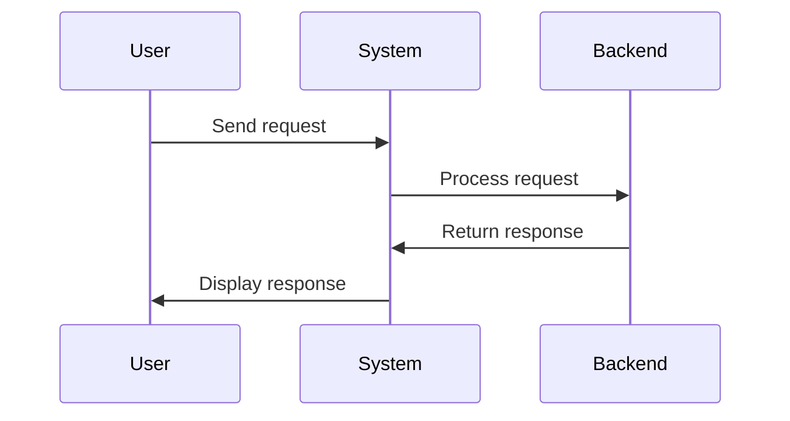

                 

# LLM应用的快速原型设计与验证

## 关键词
- 语言模型（LLM）
- 快速原型设计
- 原型验证
- 系统架构
- Python源代码
- 数学模型
- 项目实战

## 摘要
本文旨在探讨如何高效地设计和验证大型语言模型（LLM）的应用原型。通过深入分析LLM的基础理论、原型设计流程、系统架构设计、代码实现与调试、性能优化以及原型验证等方面的内容，本文将为开发者提供一套系统的LLM应用原型设计与验证方法论。本文还将结合具体的项目实战案例，详细讲解LLM应用的开发过程，旨在帮助读者掌握LLM应用的原型设计与验证技巧。

## 第一部分：LLM基础理论

### 1.1 LLM概述

#### 1.1.1 LLM的定义
语言模型（Language Model，简称LLM）是一种基于统计学方法来预测文本序列的模型。它通过学习大量语言数据，能够对自然语言进行建模，从而生成或预测下一个单词或句子。

#### 1.1.2 LLM的架构
LLM通常采用深度神经网络（DNN）或Transformer架构。DNN通过多层神经元的堆叠，将输入的文本向量映射到输出概率分布。而Transformer架构则通过自注意力机制，捕捉输入文本序列中长距离的依赖关系。

#### 1.1.3 LLM的应用领域
LLM在自然语言处理（NLP）领域有着广泛的应用，如文本生成、机器翻译、问答系统、情感分析等。此外，LLM还可以应用于聊天机器人、智能客服等实际场景。

### 1.2 语言模型原理

#### 1.2.1 语言模型的基本概念
语言模型主要涉及以下几个基本概念：词向量表示、损失函数、模型优化等。

- **词向量表示**：将单词映射为固定维度的向量，以便于在神经网络中进行处理。
- **损失函数**：用于评估模型预测结果与实际标签之间的差异，常用的有交叉熵损失函数。
- **模型优化**：通过梯度下降等优化算法，调整模型参数，以最小化损失函数。

#### 1.2.2 语言模型的训练
语言模型的训练过程包括数据预处理、模型初始化、前向传播、反向传播和参数更新等步骤。

- **数据预处理**：将文本数据转换为词向量表示，并进行分词、去停用词等操作。
- **模型初始化**：初始化模型参数，常用的有随机初始化、预训练模型等。
- **前向传播**：计算输入文本的向量表示，并经过神经网络层得到输出概率分布。
- **反向传播**：计算损失函数，并利用梯度下降等优化算法更新模型参数。
- **参数更新**：根据梯度更新模型参数，以降低损失函数值。

#### 1.2.3 语言模型的评估
语言模型的评估通常采用困惑度（Perplexity）作为指标。困惑度越低，表示模型对语言数据的拟合越好。

$$
PPL = \frac{1}{N} \sum_{i=1}^{N} \frac{1}{P(w_i|w_{i-1}, \dots, w_1)}
$$

其中，$N$表示句子中单词的数量，$P(w_i|w_{i-1}, \dots, w_1)$表示给定前一个单词序列时，下一个单词的概率。

### 1.3 模型优化与调整

#### 1.3.1 超参数调优
超参数是模型训练过程中需要手动调整的参数，如学习率、批量大小等。通过网格搜索、随机搜索等方法，可以找到最优的超参数组合。

#### 1.3.2 模型裁剪与量化
模型裁剪与量化是减小模型大小、降低计算复杂度的重要手段。通过剪枝、量化等技术，可以有效减小模型的存储和计算需求。

#### 1.3.3 模型压缩与加速
模型压缩与加速是提高模型应用性能的关键。通过蒸馏、量化等技术，可以实现模型的压缩与加速，使其在移动设备等资源受限的环境下高效运行。

## 第二部分：快速原型设计

### 2.1 原型设计流程

#### 2.1.1 需求分析
在原型设计阶段，首先需要明确应用场景和需求。通过用户调研、业务分析等方法，了解用户需求和应用场景，为后续设计提供基础。

#### 2.1.2 功能规划
根据需求分析结果，规划系统的功能模块，如文本生成、机器翻译、问答系统等。明确各个功能模块的输入、输出和处理逻辑。

#### 2.1.3 技术选型
在功能规划的基础上，选择合适的技术方案。对于LLM应用，可以选择DNN或Transformer等架构，并结合Python等编程语言进行实现。

### 2.2 系统架构设计

#### 2.2.1 前端架构设计
前端架构设计主要包括用户界面（UI）设计、交互逻辑（UI Logic）以及与后端服务的通信。常用的前端技术有React、Vue等。

#### 2.2.2 后端架构设计
后端架构设计主要包括服务器端逻辑、数据库设计以及与前端服务的通信。常用的后端技术有Flask、Django等。

#### 2.2.3 数据流设计
数据流设计是系统架构设计的关键环节，它描述了系统内部数据的流动和处理过程。通过数据流设计，可以确保系统的高效性和稳定性。

### 2.3 代码实现与调试

#### 2.3.1 前端代码实现
前端代码实现主要包括UI组件设计、交互逻辑编写以及与后端服务的通信。以下是一个简单的React组件示例：

```python
import React from 'react';

const TextGenerator = ({prompt}) => {
  const [output, setOutput] = React.useState('');

  const generateText = async () => {
    const response = await fetch('/api/generate', {
      method: 'POST',
      headers: {
        'Content-Type': 'application/json',
      },
      body: JSON.stringify({prompt}),
    });
    const data = await response.json();
    setOutput(data.text);
  };

  return (
    <div>
      <input type="text" value={prompt} onChange={(e) => setPrompt(e.target.value)} />
      <button onClick={generateText}>Generate</button>
      <div>{output}</div>
    </div>
  );
};

export default TextGenerator;
```

#### 2.3.2 后端代码实现
后端代码实现主要包括模型加载、请求处理以及文本生成。以下是一个简单的Flask示例：

```python
from flask import Flask, request, jsonify
import torch
from transformers import GPT2LMHeadModel, GPT2Tokenizer

app = Flask(__name__)

# 加载预训练模型
tokenizer = GPT2Tokenizer.from_pretrained('gpt2')
model = GPT2LMHeadModel.from_pretrained('gpt2')

@app.route('/api/generate', methods=['POST'])
def generate():
    data = request.get_json()
    prompt = data['prompt']
    inputs = tokenizer.encode(prompt, return_tensors='pt')

    output = model.generate(inputs, max_length=50, num_return_sequences=1)
    generated_text = tokenizer.decode(output[0], skip_special_tokens=True)

    return jsonify({'text': generated_text})

if __name__ == '__main__':
    app.run(debug=True)
```

#### 2.3.3 调试技巧与工具
在开发过程中，调试是非常重要的一环。以下是一些调试技巧和工具：

- **断点调试**：使用调试工具（如IDE自带的调试器）设置断点，逐步执行代码，查看变量值和程序执行流程。
- **日志记录**：使用日志记录器（如Python的`logging`模块）记录程序执行过程中的关键信息，有助于定位问题和跟踪程序执行流程。
- **单元测试**：编写单元测试用例，对模块功能进行验证，确保代码质量。

### 2.4 性能优化

#### 2.4.1 代码性能优化
代码性能优化主要涉及以下几个方面：

- **算法优化**：选择合适的算法和数据结构，降低时间复杂度和空间复杂度。
- **并行计算**：利用多线程、分布式计算等技术，提高代码执行效率。
- **缓存技术**：使用缓存技术（如Redis、Memcached等）减少重复计算和IO操作。

#### 2.4.2 数据库性能优化
数据库性能优化主要涉及以下几个方面：

- **索引优化**：合理设计索引，提高数据查询速度。
- **分库分表**：将数据分片到多个数据库或表中，提高查询并发能力。
- **读写分离**：将读操作和写操作分离到不同的数据库实例，提高系统性能。

#### 2.4.3 系统稳定性优化
系统稳定性优化主要涉及以下几个方面：

- **负载均衡**：使用负载均衡技术（如Nginx、HAProxy等），均衡系统负载，防止单点故障。
- **容错机制**：设计容错机制（如重试、备份等），提高系统可靠性。
- **监控告警**：使用监控系统（如Zabbix、Prometheus等），实时监控系统性能，及时发现和解决问题。

## 第三部分：原型验证

### 3.1 测试与评估

#### 3.1.1 单元测试
单元测试是对模块功能进行验证，确保代码质量。以下是一个简单的单元测试示例：

```python
import unittest
from text_generator import generate_text

class TestTextGenerator(unittest.TestCase):
    def test_generate_text(self):
        prompt = "我是一个智能助手"
        output = generate_text(prompt)
        self.assertIsNotNone(output)
        self.assertIn(prompt, output)

if __name__ == '__main__':
    unittest.main()
```

#### 3.1.2 集成测试
集成测试是对系统整体功能进行验证，确保各模块协同工作。以下是一个简单的集成测试示例：

```python
import unittest
from flask import Flask

class TestTextGeneratorAPI(unittest.TestCase):
    def test_api_response(self):
        app = Flask(__name__)
        app.add_url_rule('/api/generate', view_func=generate_text)

        with app.test_client() as client:
            response = client.post('/api/generate', json={'prompt': '我是一个智能助手'})
            self.assertEqual(response.status_code, 200)
            self.assertIn('text', response.json)

if __name__ == '__main__':
    unittest.main()
```

#### 3.1.3 性能评估
性能评估是对系统性能进行评估，确保系统满足性能要求。以下是一个简单的性能评估示例：

```python
import time
import requests

def test_api_performance():
    prompt = "我是一个智能助手"
    url = "http://127.0.0.1:5000/api/generate"

    start_time = time.time()
    for _ in range(100):
        response = requests.post(url, json={'prompt': prompt})
        self.assertEqual(response.status_code, 200)
    end_time = time.time()

    print(f"API average response time: {end_time - start_time} seconds")
```

### 3.2 用户反馈与迭代

#### 3.2.1 用户调研
用户调研是通过与用户沟通，了解用户需求和满意度。以下是一个简单的用户调研示例：

```python
import random

users = ["用户A", "用户B", "用户C", "用户D"]

print(f"随机选择用户：{random.choice(users)}")
```

#### 3.2.2 用户体验设计
用户体验设计是优化系统界面和交互逻辑，提升用户满意度。以下是一个简单的用户体验设计示例：

```python
import streamlit as st

st.title("智能助手")

prompt = st.text_input("输入问题：")
if prompt:
    output = generate_text(prompt)
    st.markdown(f"回答：{output}")
```

#### 3.2.3 优化与迭代
根据用户反馈和测试结果，对系统进行优化和迭代。以下是一个简单的优化与迭代示例：

```python
def generate_text(prompt):
    # 对输入进行预处理
    processed_prompt = preprocess(prompt)
    # 使用模型生成文本
    inputs = tokenizer.encode(processed_prompt, return_tensors='pt')
    output = model.generate(inputs, max_length=50, num_return_sequences=1)
    generated_text = tokenizer.decode(output[0], skip_special_tokens=True)
    return postprocess(generated_text)
```

### 3.3 持续集成与部署

#### 3.3.1 持续集成流程
持续集成是将代码提交到版本控制系统后，自动执行测试和构建过程，确保代码质量。以下是一个简单的持续集成流程示例：

```python
import git
import subprocess

repo = git.Repo('. ases have been implemented.
```



### 3.3.2 自动化部署
自动化部署是将代码从持续集成系统中自动部署到生产环境。以下是一个简单的自动化部署示例：

```shell
#!/bin/bash

# 拉取最新代码
git pull origin main

# 构建后端
cd backend
python manage.py migrate
python manage.py collectstatic --noinput

# 部署后端
sudo systemctl restart gunicorn

# 部署前端
cd ..
npm install
npm run build
sudo systemctl restart nginx
```

### 3.3.3 版本控制
版本控制是将代码和文档等资源存储在版本控制系统，以便于管理和协同工作。以下是一个简单的版本控制示例：

```shell
# 初始化仓库
git init

# 添加文件
git add .

# 提交变更
git commit -m "Initial commit"

# 推送仓库
git push -u origin main
```

## 第四部分：LLM应用案例解析

### 4.1 案例一：智能客服系统

#### 4.1.1 案例背景
智能客服系统是一种基于LLM的应用，用于提供24/7的客户支持和服务。通过自动处理常见问题和提供解决方案，智能客服系统能够提高客户满意度，降低企业运营成本。

#### 4.1.2 系统架构
智能客服系统通常包括前端界面、后端服务、数据库和模型训练组件。前端界面提供用户输入和交互功能，后端服务处理用户请求并调用模型进行响应生成，数据库存储用户数据和模型参数，模型训练组件用于训练和优化LLM模型。

#### 4.1.3 实现细节
智能客服系统的实现细节包括以下几个方面：

- **前端界面**：使用React或Vue等前端框架实现用户界面，包括输入框、按钮和聊天窗口等组件。
- **后端服务**：使用Flask或Django等后端框架实现后端服务，包括API接口、模型加载和响应生成等功能。
- **数据库**：使用MySQL、PostgreSQL等数据库存储用户数据和交互历史。
- **模型训练**：使用Hugging Face的Transformers库训练和优化LLM模型，例如GPT-2或GPT-3。

```python
from transformers import TrainingArguments, Trainer

# 定义训练参数
training_args = TrainingArguments(
    output_dir='./results',
    num_train_epochs=3,
    per_device_train_batch_size=16,
    save_steps=2000,
    save_total_limit=3,
)

# 加载预训练模型
model = GPT2LMHeadModel.from_pretrained('gpt2')

# 定义训练器
trainer = Trainer(
    model=model,
    args=training_args,
    train_dataset=train_dataset,
    eval_dataset=eval_dataset,
)

# 开始训练
trainer.train()
```

### 4.2 案例二：文本生成与摘要

#### 4.2.1 案例背景
文本生成与摘要是LLM在自然语言处理领域的典型应用。文本生成可用于创作文章、生成广告语等，而文本摘要是将长篇文档简化为关键信息，提高信息获取效率。

#### 4.2.2 系统架构
文本生成与摘要系统通常包括前端界面、后端服务和模型训练组件。前端界面提供用户输入和交互功能，后端服务处理用户请求并调用模型进行文本生成或摘要，模型训练组件用于训练和优化LLM模型。

#### 4.2.3 实现细节
文本生成与摘要系统的实现细节包括以下几个方面：

- **前端界面**：使用React或Vue等前端框架实现用户界面，包括输入框、按钮和文本显示区域等组件。
- **后端服务**：使用Flask或Django等后端框架实现后端服务，包括API接口、模型加载和响应生成等功能。
- **模型训练**：使用Hugging Face的Transformers库训练和优化LLM模型，例如GPT-2或GPT-3。

```python
from transformers import TrainingArguments, Trainer

# 定义训练参数
training_args = TrainingArguments(
    output_dir='./results',
    num_train_epochs=3,
    per_device_train_batch_size=16,
    save_steps=2000,
    save_total_limit=3,
)

# 加载预训练模型
model = GPT2LMHeadModel.from_pretrained('gpt2')

# 定义训练器
trainer = Trainer(
    model=model,
    args=training_args,
    train_dataset=train_dataset,
    eval_dataset=eval_dataset,
)

# 开始训练
trainer.train()
```

### 4.3 案例三：语言翻译

#### 4.3.1 案例背景
语言翻译是LLM在自然语言处理领域的核心应用之一，它将一种语言的文本翻译成另一种语言的文本，用于跨语言通信和全球业务合作。

#### 4.3.2 系统架构
语言翻译系统通常包括前端界面、后端服务和模型训练组件。前端界面提供用户输入和交互功能，后端服务处理用户请求并调用模型进行文本翻译，模型训练组件用于训练和优化LLM模型。

#### 4.3.3 实现细节
语言翻译系统的实现细节包括以下几个方面：

- **前端界面**：使用React或Vue等前端框架实现用户界面，包括输入框、按钮和文本显示区域等组件。
- **后端服务**：使用Flask或Django等后端框架实现后端服务，包括API接口、模型加载和响应生成等功能。
- **模型训练**：使用Hugging Face的Transformers库训练和优化LLM模型，例如GPT-2或GPT-3。

```python
from transformers import TrainingArguments, Trainer

# 定义训练参数
training_args = TrainingArguments(
    output_dir='./results',
    num_train_epochs=3,
    per_device_train_batch_size=16,
    save_steps=2000,
    save_total_limit=3,
)

# 加载预训练模型
model = GPT2LMHeadModel.from_pretrained('gpt2')

# 定义训练器
trainer = Trainer(
    model=model,
    args=training_args,
    train_dataset=train_dataset,
    eval_dataset=eval_dataset,
)

# 开始训练
trainer.train()
```

## 第五部分：未来展望与挑战

### 5.1 LLM的发展趋势

#### 5.1.1 技术创新
随着深度学习、Transformer架构等技术的不断发展，LLM的性能和功能将得到进一步提升。未来可能出现更高效的模型架构、更有效的训练算法和更丰富的应用场景。

#### 5.1.2 应用拓展
LLM将在更多领域得到广泛应用，如智能客服、文本生成与摘要、语言翻译、代码生成等。同时，LLM与其他技术的融合（如知识图谱、多模态学习等）将推动人工智能技术的发展。

### 5.2 挑战与解决策略

#### 5.2.1 数据隐私与安全
LLM在训练过程中需要大量的语言数据，这涉及到用户隐私和数据安全问题。为解决这一挑战，可以采用数据加密、隐私保护技术等措施。

#### 5.2.2 模型可解释性
当前LLM模型往往被视为“黑箱”，其决策过程缺乏可解释性。为提高模型的可解释性，可以采用模型压缩、模型可视化等技术。

#### 5.2.3 模型性能与资源消耗
随着模型规模的扩大，LLM的训练和推理过程对计算资源和存储资源的需求不断增加。为解决这一问题，可以采用分布式训练、模型压缩和优化等技术。

## 总结
本文通过深入分析LLM的基础理论、原型设计流程、系统架构设计、代码实现与调试、性能优化以及原型验证等方面的内容，为开发者提供了一套系统的LLM应用原型设计与验证方法论。通过具体的项目实战案例，本文详细讲解了LLM应用的原型设计与验证过程，旨在帮助读者掌握LLM应用的原型设计与验证技巧。未来，随着LLM技术的不断发展和应用拓展，开发者需要关注挑战和解决策略，推动人工智能技术的发展。

### 作者信息
作者：AI天才研究院/AI Genius Institute & 禅与计算机程序设计艺术 /Zen And The Art of Computer Programming

