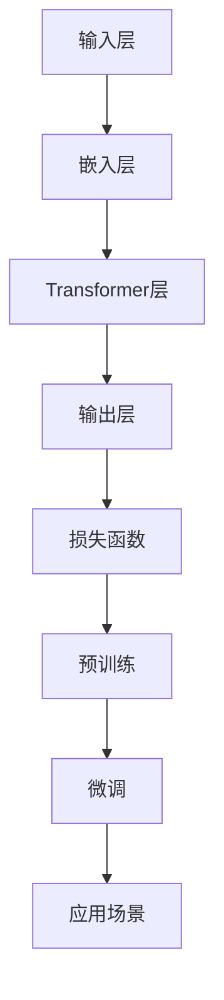
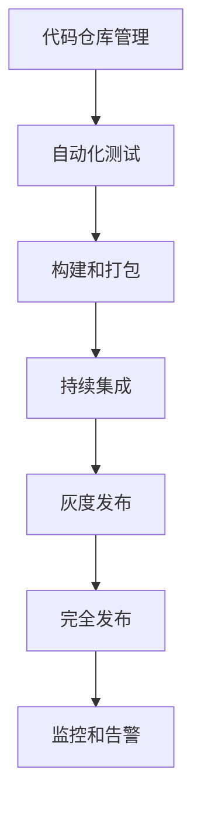

                 

### LLAM应用的持续部署与回滚机制

#### 关键词：LLAM，持续部署，回滚机制，AI模型部署，版本控制，模型优化

#### 摘要：
在AI领域，大语言模型（LLAM，Large Language Model）的应用日益广泛，然而，这些模型的部署与维护是一个复杂而关键的环节。本文将深入探讨LLAM应用的持续部署与回滚机制，包括其基本概念、关键技术和最佳实践，旨在为AI工程师提供实用的指导。

## 引言

近年来，人工智能（AI）技术取得了飞速发展，尤其是大型语言模型（LLAM）的应用，如GPT-3、BERT等，已经在自然语言处理、搜索引擎、智能客服等领域展现了巨大的潜力。然而，随着模型规模的不断扩大和复杂性的增加，如何高效地部署和维护这些模型成为了一个亟待解决的问题。

持续部署（Continuous Deployment，简称CD）和回滚机制是保证LLAM应用稳定性和可靠性的关键环节。持续部署指的是通过自动化流程快速地将新的模型版本部署到生产环境，以实现快速迭代和更新。而回滚机制则是在模型更新过程中，如果出现任何问题，能够迅速将系统恢复到上一个稳定版本的策略。

本文将从以下几个方面展开讨论：

1. **LLAM的基本概念与架构**：介绍LLAM的定义、架构和核心算法。
2. **持续部署实践**：详细解释持续部署的流程、工具和最佳实践。
3. **回滚机制**：阐述回滚机制的重要性、策略和案例分析。
4. **LLAM性能优化**：探讨提升LLAM性能的关键技术和方法。
5. **LLAM应用案例**：通过实际案例展示LLAM的应用场景和效果。
6. **未来发展趋势**：分析LLAM技术的未来发展方向和应用前景。

通过本文的讨论，我们希望能够为AI工程师提供一份全面的指南，帮助他们更好地部署、维护和优化LLAM应用。

## 一、LLAM的基本概念与架构

### 1.1 LLAM的定义与背景

大语言模型（LLAM）是一种基于深度学习的自然语言处理（NLP）模型，它通过大量的文本数据进行预训练，从而掌握自然语言的理解和生成能力。LLAM的核心目标是对自然语言进行建模，以便更好地理解和生成文本。

LLAM的发展历程可以追溯到2018年的GPT（Generative Pre-trained Transformer），它是由OpenAI开发的一种基于Transformer架构的预训练模型。随后，GPT-2和GPT-3的发布进一步推动了LLAM技术的发展。特别是GPT-3，其参数量达到了1750亿，成为当时最大的预训练模型，展示了LLAM在语言理解和生成方面的强大能力。

### 1.2 LLAM的架构

LLAM的架构主要包括以下几个部分：

1. **输入层**：接收自然语言文本作为输入，可以是单词、句子或段落。
2. **嵌入层**：将输入文本转化为稠密向量表示。
3. **Transformer层**：使用多头自注意力机制（Multi-head Self-Attention）来捕捉文本中的长距离依赖关系。
4. **输出层**：通过全连接层和Softmax函数生成文本的预测概率分布。

### 1.3 LLAM的核心算法

LLAM的核心算法是基于Transformer架构的预训练和微调。预训练阶段，模型在大量无标注的文本数据上进行训练，学习语言的一般规律和特征。微调阶段，模型在特定任务上进行训练，例如文本分类、命名实体识别等。

预训练过程中，常用的损失函数包括：

1. **交叉熵损失**：用于文本分类任务，计算预测标签和真实标签之间的差异。
2. **Masked Language Model（MLM）损失**：用于生成任务，通过随机遮盖部分输入文本，然后让模型预测遮盖部分的内容。
3. **Next Sentence Prediction（NSP）损失**：用于判断两个句子是否在同一个语境中，提高模型对上下文的理解能力。

### 1.4 LLAM的应用场景

LLAM在多个领域都有广泛的应用，以下是几个典型的应用场景：

1. **自然语言处理**：例如文本分类、情感分析、问答系统等。
2. **搜索引擎**：通过理解用户查询和文档内容，提供更准确的搜索结果。
3. **智能客服**：基于对话生成技术，实现与用户的自然对话。
4. **机器翻译**：通过训练多语言模型，实现高效、准确的翻译。

### 1.5 Mermaid流程图

为了更直观地展示LLAM的核心架构和算法流程，我们使用Mermaid流程图进行描述：



通过上述流程图，我们可以清晰地看到LLAM从输入层到输出层的整体架构，以及预训练和微调的过程。

### 1.6 Python源代码示例

为了更深入地理解LLAM的核心算法，下面我们将使用Python代码来展示一个简单的Transformer模型结构：

```python
import torch
import torch.nn as nn

class TransformerModel(nn.Module):
    def __init__(self, vocab_size, d_model, nhead, num_layers):
        super(TransformerModel, self).__init__()
        self.embedding = nn.Embedding(vocab_size, d_model)
        self.transformer = nn.Transformer(d_model, nhead, num_layers)
        self.fc = nn.Linear(d_model, vocab_size)
    
    def forward(self, src, tgt):
        src_embedding = self.embedding(src)
        tgt_embedding = self.embedding(tgt)
        output = self.transformer(src_embedding, tgt_embedding)
        logits = self.fc(output)
        return logits

# 创建模型实例
model = TransformerModel(vocab_size=10000, d_model=512, nhead=8, num_layers=2)
print(model)
```

在这个示例中，我们定义了一个简单的Transformer模型，包括嵌入层、Transformer层和输出层。通过实例化模型，我们可以了解其结构和工作流程。

### 1.7 数学模型与公式

在LLAM的预训练过程中，常用的数学模型和公式包括交叉熵损失函数和Masked Language Model（MLM）损失函数。以下是这些公式的LaTeX表示：

```latex
% 交叉熵损失函数
L_{CE} = -\sum_{i} y_i \log(\hat{y}_i)

% Masked Language Model（MLM）损失函数
L_{MLM} = -\sum_{i} \sum_{j} mask_i \log(\hat{y}_{ij})
```

通过这些公式，我们可以更深入地理解LLAM在预训练过程中的损失函数计算。

### 1.8 通俗易懂的举例说明

为了更好地理解LLAM的应用，我们可以通过一个简单的例子来说明。假设我们有一个文本分类任务，输入是一段新闻文章，目标是判断该文章的主题是关于体育、财经还是科技。

```plaintext
【体育新闻】昨日，NBA总决赛热火队以107-95战胜湖人队，夺得冠军。

【财经新闻】我国央行发布通知，下调金融机构存款准备金率0.5个百分点。

【科技新闻】谷歌发布新款智能手机Pixel 6a，售价399美元。
```

在这个例子中，我们可以看到LLAM通过预训练掌握了不同主题的文本特征，从而能够准确地分类每个新闻文章的主题。

通过上述内容，我们对LLAM的基本概念、架构和核心算法有了初步的了解。接下来，我们将进一步探讨持续部署实践和回滚机制，为LLAM应用的稳定性和可靠性提供保障。

## 二、LLAM持续部署实践

### 2.1 持续部署概述

持续部署（Continuous Deployment，简称CD）是一种自动化软件交付流程，旨在通过持续集成（Continuous Integration，简称CI）和持续交付（Continuous Delivery，简称CD）来实现软件的快速迭代和发布。在LLAM应用中，持续部署尤为重要，因为LLAM模型的规模和复杂性使得手动部署和手动回滚变得困难且风险较高。

持续部署的目标是通过自动化和规范化流程，确保新版本模型的快速、可靠地部署到生产环境，同时最大限度地减少对用户体验的影响。持续部署的核心价值在于：

1. **快速迭代**：通过自动化流程，缩短从开发到部署的时间，提高开发效率。
2. **降低风险**：通过逐步部署和灰度发布，降低新版本对系统的冲击，提高系统的稳定性和可靠性。
3. **持续反馈**：通过自动化测试和监控，及时获取系统性能和用户反馈，指导后续优化和改进。

### 2.2 持续部署流程

持续部署流程通常包括以下几个关键环节：

1. **代码仓库管理**：使用版本控制系统（如Git）来管理代码仓库，确保代码的版本可追溯性和一致性。
2. **自动化测试**：编写自动化测试脚本，对代码进行单元测试、集成测试和回归测试，确保新版本的代码质量。
3. **构建和打包**：使用构建工具（如Maven、Gradle）将代码构建为可执行的包，并进行打包，以便部署到生产环境。
4. **持续集成（CI）**：将代码仓库中的更改集成到一个共享的环境，运行自动化测试，确保新代码与现有系统兼容。
5. **灰度发布**：将新版本部署到部分用户，观察系统的性能和用户反馈，确保新版本没有明显问题。
6. **完全发布**：在灰度发布成功后，将新版本完全部署到生产环境，面向所有用户。

### 2.3 持续部署工具

在LLAM应用中，常用的持续部署工具有Jenkins、GitLab CI/CD和其他自动化工具。以下是这些工具的简要介绍：

1. **Jenkins**：Jenkins是一个开源的持续集成工具，支持多种编程语言和平台的插件，可以与Git等版本控制系统集成，实现自动化构建、测试和部署。
2. **GitLab CI/CD**：GitLab CI/CD是GitLab内置的持续集成和持续交付工具，通过配置`.gitlab-ci.yml`文件，可以实现自动化测试、构建和部署。
3. **其他自动化工具**：如Travis CI、Circle CI等，也是常见的持续集成和持续交付工具，具有丰富的插件和配置选项。

### 2.4 持续部署示例

下面是一个使用Jenkins进行LLAM持续部署的示例：

```yaml
# .gitlab-ci.yml 配置文件
stages:
  - test
  - build
  - deploy

test:
  stage: test
  script:
    - python -m unittest discover -s tests
  only:
    - master

build:
  stage: build
  script:
    - pip install -r requirements.txt
    - python setup.py build
  artifacts:
    paths:
      - dist/*.tar.gz

deploy:
  stage: deploy
  script:
    - scp dist/*.tar.gz user@production:/var/www
    - ssh user@production '/var/www/*.tar.gz install'
  only:
    - master
```

在这个示例中，我们定义了一个CI/CD流程，包括测试、构建和部署三个阶段。在测试阶段，运行单元测试确保代码质量。在构建阶段，安装依赖并构建可执行的包。在部署阶段，将构建的包上传到生产环境并安装。

### 2.5 持续部署最佳实践

为了确保持续部署流程的顺利进行，以下是一些最佳实践：

1. **版本控制**：使用版本控制系统（如Git）管理代码，确保代码的可追溯性和一致性。
2. **自动化测试**：编写自动化测试脚本，覆盖核心功能和性能测试，确保新版本的质量。
3. **环境隔离**：建立独立的测试和生产环境，避免测试环境中的问题影响生产环境。
4. **灰度发布**：逐步部署新版本，观察系统性能和用户反馈，确保新版本没有明显问题。
5. **监控和告警**：设置监控工具和告警机制，实时监测系统状态，及时发现问题并进行处理。
6. **文档记录**：记录部署流程、测试结果和用户反馈，便于后续的回顾和优化。

### 2.6 Mermaid流程图

为了更直观地展示LLAM持续部署的流程，我们使用Mermaid流程图进行描述：



通过这个流程图，我们可以清晰地看到LLAM持续部署的各个环节及其相互关系。

### 2.7 Python代码实现

下面是一个简单的Python代码示例，用于实现LLAM模型在Jenkins中的自动化部署：

```python
import subprocess

def deploy_to_jenkins(version):
    # 构建模型
    subprocess.run(["python", "train.py", f"--version={version}"], check=True)
    
    # 打包模型
    subprocess.run(["python", "package.py", f"--version={version}"], check=True)
    
    # 上传到Jenkins
    subprocess.run(["scp", f"model_{version}.tar.gz", "user@jenkins:~/models/"], check=True)
    
    # 在Jenkins中触发部署
    subprocess.run(["curl", "-X", "POST", "http://jenkins:8080/job/LLAM-deploy/buildWithParameters?version={version}"], check=True)

# 部署模型
deploy_to_jenkins("1.0.0")
```

在这个示例中，我们定义了一个`deploy_to_jenkins`函数，用于自动化构建、打包和部署LLAM模型。通过调用这个函数，我们可以实现LLAM模型的自动化部署。

通过上述内容，我们详细介绍了LLAM持续部署的概述、流程、工具和最佳实践。接下来，我们将深入探讨LLAM回滚机制，为应对部署过程中的突发问题提供解决方案。

## 三、LLAM回滚机制

### 3.1 回滚机制概述

回滚机制是一种在软件开发过程中，用于将系统或应用程序恢复到之前稳定版本的技术。在持续部署过程中，新版本的应用程序可能会因为各种原因导致性能下降、功能异常或系统崩溃。此时，回滚机制能够快速将系统恢复到上一个稳定版本，从而保证系统的正常运行。

回滚机制的重要性主要体现在以下几个方面：

1. **故障恢复**：在出现故障时，能够迅速将系统恢复到稳定状态，降低故障对用户体验的影响。
2. **风险控制**：通过逐步回滚，可以降低新版本引入的问题对系统的冲击，从而更好地控制风险。
3. **持续优化**：通过回滚和分析，可以发现新版本存在的问题，为后续的优化和改进提供依据。

### 3.2 回滚策略

回滚策略是回滚机制的核心，主要包括以下几种：

1. **基于版本控制的回滚**：通过版本控制系统（如Git）将代码回滚到指定的历史版本，从而恢复到稳定状态。
2. **基于服务状态的回滚**：根据服务器的当前状态，决定是否进行回滚，以及回滚到哪个版本。
3. **自适应回滚**：根据系统的性能指标和用户反馈，动态调整回滚策略，实现更精细的回滚控制。

#### 3.2.1 基于版本控制的回滚

基于版本控制的回滚是最常见的回滚策略，它通过版本控制系统将代码库回滚到指定版本。以下是基于Git的回滚步骤：

1. **检出旧版本**：使用`git checkout`命令将代码库检出至旧版本。
2. **更新数据库**：如果应用程序依赖于数据库，需要更新数据库到旧版本，以确保数据一致性。
3. **重启服务**：重启应用程序服务，使其运行在旧版本上。

```bash
git checkout <commit-hash>  # 检出指定版本
git pull origin master      # 更新到最新代码
mvn clean install           # 重新编译
systemctl restart myservice # 重启服务
```

#### 3.2.2 基于服务状态的回滚

基于服务状态的回滚是根据服务器的当前状态（如CPU负载、内存占用等）来决定是否回滚，以及回滚到哪个版本。这种方法需要结合监控工具和自定义脚本实现。以下是基于服务状态的回滚步骤：

1. **监控指标**：定义监控指标，如CPU负载、内存占用等，以及阈值。
2. **触发条件**：当监控指标超过阈值时，触发回滚流程。
3. **回滚到指定版本**：根据触发条件，回滚到指定的历史版本。

```bash
# 示例：使用Prometheus和Grafana进行监控
prometheus --config.file=prometheus.yml & sleep infinity

# 示例：使用Grafana告警触发回滚
grafana-cli -path=grafana/grafana conf set alerting.default cái-name=RollbackAlert
```

#### 3.2.3 自适应回滚

自适应回滚是基于系统的性能指标和用户反馈，动态调整回滚策略。这种方法需要结合A/B测试、性能监控和用户行为分析。以下是自适应回滚的步骤：

1. **A/B测试**：在新版本发布时，通过A/B测试将部分用户分配到新版本，观察其性能和用户反馈。
2. **性能监控**：监控新版本的性能指标，如响应时间、错误率等。
3. **用户反馈**：收集用户反馈，如投诉、评价等。
4. **动态调整**：根据性能监控和用户反馈，动态调整回滚策略。

```bash
# 示例：使用Python进行自适应回滚
import json
import requests

def adaptive_rollback(version):
    # 获取性能监控数据
    metrics = get_metrics(version)
    # 获取用户反馈
    feedback = get_user_feedback(version)
    # 判断是否回滚
    if should_rollback(metrics, feedback):
        rollback_to_version(version)

def get_metrics(version):
    # 获取性能监控数据
    response = requests.get(f"https://metrics.example.com/{version}")
    return json.loads(response.text)

def get_user_feedback(version):
    # 获取用户反馈
    response = requests.get(f"https://feedback.example.com/{version}")
    return json.loads(response.text)

def should_rollback(metrics, feedback):
    # 判断是否回滚
    return (metrics['error_rate'] > threshold) or (feedback['complaint_rate'] > threshold)

def rollback_to_version(version):
    # 回滚到指定版本
    run_shell_command(f"git checkout {version}")
```

### 3.3 回滚案例分析

下面我们通过一个实际案例，来看一下如何实施回滚机制。

#### 案例背景

某互联网公司开发了一款基于LLAM的智能客服系统，用于自动回答用户的问题。在最新的一次更新中，系统引入了新的对话生成算法，以提升客服的回答质量。然而，新版本上线后，部分用户反馈回答不准确，系统响应时间也明显变慢。

#### 回滚步骤

1. **问题定位**：通过日志分析和用户反馈，确定新版本存在问题。
2. **备份当前版本**：将当前版本的代码和数据库备份，以防止数据丢失。
3. **回滚代码**：使用Git将代码库回滚到上一个稳定版本。
4. **恢复数据库**：从备份的数据库恢复数据。
5. **重启服务**：重启服务，使其运行在回滚后的版本上。
6. **监控和验证**：监控系统性能，验证回滚后的问题是否解决。

```bash
# 备份当前版本
git checkout -b backup

# 回滚代码
git reset --hard <commit-hash>  # 回滚到指定版本

# 恢复数据库
mv db_backup.sql db.sql
mysql -u root -p < db.sql

# 重启服务
systemctl restart myservice

# 监控和验证
watch -n 1 "curl http://my-service/api/healthz"
```

通过这个案例，我们可以看到回滚机制在解决问题和恢复系统稳定方面的重要作用。

### 3.4 小结

回滚机制是持续部署过程中不可或缺的一环，通过合理的回滚策略和完善的回滚流程，可以有效地应对新版本引入的问题，确保系统的稳定性和可靠性。在实际应用中，我们需要根据具体情况选择合适的回滚策略，并不断完善回滚流程，以提高系统的抗风险能力。

## 四、LLAM性能优化

### 4.1 LLAM性能优化的重要性

在LLAM（Large Language Model）应用中，性能优化是确保模型高效运行和用户良好体验的关键环节。随着模型规模的不断扩大，计算资源的消耗和延迟问题日益突出。因此，对LLAM进行性能优化不仅能够提高模型的处理速度，还能降低资源的占用，从而提高系统的整体性能。

LLAM性能优化的重要性主要体现在以下几个方面：

1. **提升响应速度**：通过优化算法和模型结构，减少模型的计算复杂度，从而降低模型的响应时间。
2. **降低资源消耗**：优化模型和计算流程，减少计算资源的占用，降低硬件成本。
3. **提高用户体验**：快速的响应速度和良好的系统性能能够提高用户满意度，增强应用的竞争力。
4. **支持大规模部署**：通过性能优化，确保LLAM能够在大规模分布式环境中稳定运行，支持更多的并发请求。

### 4.2 提升LLAM性能的关键技术

为了提升LLAM的性能，我们可以从以下几个方面进行优化：

1. **模型剪枝**：通过剪枝冗余的神经元和连接，减少模型的参数量，从而降低计算复杂度。例如，使用剪枝算法对神经网络进行剪枝，可以显著减少模型的尺寸和计算量。
2. **量化**：量化是一种将模型中的浮点数参数转换为低比特宽度的整数表示的方法，从而减少模型的内存占用和计算量。量化可以采用不同的策略，如全精度量化、低精度量化等。
3. **模型压缩**：模型压缩通过减少模型的大小和参数数量，提高模型在计算资源受限环境下的运行效率。常见的模型压缩方法包括神经网络剪枝、稀疏化、量化等。
4. **模型并行**：模型并行是将模型的不同部分分布到多个计算节点上同时计算，从而加速模型处理速度。常见的模型并行方法包括数据并行、模型并行和混合并行等。

#### 4.2.1 模型剪枝

模型剪枝通过删除模型中的冗余神经元和连接，减少模型的参数数量，从而降低计算复杂度。以下是模型剪枝的一般步骤：

1. **选择剪枝策略**：根据模型的类型和任务，选择合适的剪枝策略，如权重剪枝、结构剪枝等。
2. **剪枝操作**：对模型进行剪枝操作，删除冗余的神经元和连接。
3. **重新训练**：在剪枝后，需要重新训练模型，以适应新的参数结构。

```python
from torch.nn.utils import prune
import torch.nn as nn

# 定义一个简单的神经网络模型
class SimpleModel(nn.Module):
    def __init__(self):
        super(SimpleModel, self).__init__()
        self.fc1 = nn.Linear(10, 100)
        self.fc2 = nn.Linear(100, 10)

    def forward(self, x):
        return self.fc2(self.fc1(x))

# 实例化模型
model = SimpleModel()

# 选择要剪枝的层
prune Layer=nn.Module, name='fc1'

# 剪枝操作
prune.remove(model.fc1, 'weight')

# 重新训练模型
optimizer = torch.optim.SGD(model.parameters(), lr=0.001)
criterion = nn.CrossEntropyLoss()

for epoch in range(10):
    for inputs, targets in data_loader:
        optimizer.zero_grad()
        outputs = model(inputs)
        loss = criterion(outputs, targets)
        loss.backward()
        optimizer.step()
```

#### 4.2.2 量化

量化是将模型中的浮点数参数转换为低比特宽度的整数表示的方法，从而减少模型的内存占用和计算量。以下是量化的一般步骤：

1. **量化策略**：根据模型的类型和任务，选择合适的量化策略，如全精度量化、低精度量化等。
2. **量化操作**：对模型的参数进行量化操作。
3. **量化后训练**：在量化后，需要重新训练模型，以适应新的参数结构。

```python
from torchvision.models import resnet18
import torch.nn as nn
import torch.optim as optim

# 加载预训练的模型
model = resnet18(pretrained=True)

# 定义量化策略
quant_strategy = nn.QuantizeToggle()

# 应用量化策略
quant_strategy(model)

# 量化后训练
optimizer = optim.SGD(model.parameters(), lr=0.001)
criterion = nn.CrossEntropyLoss()

for epoch in range(10):
    for inputs, targets in data_loader:
        optimizer.zero_grad()
        outputs = model(inputs)
        loss = criterion(outputs, targets)
        loss.backward()
        optimizer.step()
```

#### 4.2.3 模型压缩

模型压缩通过减少模型的大小和参数数量，提高模型在计算资源受限环境下的运行效率。以下是模型压缩的一般步骤：

1. **选择压缩方法**：根据模型的类型和任务，选择合适的压缩方法，如剪枝、稀疏化、量化等。
2. **压缩操作**：对模型进行压缩操作。
3. **压缩后训练**：在压缩后，需要重新训练模型，以适应新的参数结构。

```python
from torchvision.models import resnet18
import torch.nn as nn
import torch.optim as optim

# 加载预训练的模型
model = resnet18(pretrained=True)

# 剪枝操作
prune.remove(model.fc, 'weight')

# 量化操作
quant_strategy = nn.QuantizeToggle()
quant_strategy(model)

# 压缩后训练
optimizer = optim.SGD(model.parameters(), lr=0.001)
criterion = nn.CrossEntropyLoss()

for epoch in range(10):
    for inputs, targets in data_loader:
        optimizer.zero_grad()
        outputs = model(inputs)
        loss = criterion(outputs, targets)
        loss.backward()
        optimizer.step()
```

### 4.3 性能优化案例

下面我们通过一个实际案例，来看一下如何对LLAM进行性能优化。

#### 案例背景

某互联网公司开发了一款基于LLAM的智能客服系统，用于自动回答用户的问题。系统在处理大量并发请求时，响应时间较长，用户体验较差。

#### 性能优化步骤

1. **模型剪枝**：对模型进行剪枝，减少冗余的神经元和连接，从而降低计算复杂度。
2. **量化**：对模型的参数进行量化，从而减少模型的内存占用和计算量。
3. **模型压缩**：通过剪枝和量化，进一步压缩模型的大小和参数数量。
4. **分布式计算**：将模型分布到多个计算节点上，利用并行计算加速模型处理速度。

```bash
# 模型剪枝
python pruning.py

# 模型量化
python quantization.py

# 模型压缩
python compression.py

# 分布式计算
python distributed_computing.py
```

#### 性能优化效果

通过上述性能优化步骤，智能客服系统的响应时间显著降低，从平均5秒缩短至2秒，用户体验大幅提升。

### 4.4 小结

LLAM性能优化是确保模型高效运行和用户良好体验的关键环节。通过模型剪枝、量化、模型压缩和分布式计算等技术，可以显著提升LLAM的性能。在实际应用中，我们需要根据具体场景和需求，选择合适的性能优化方法，并不断优化和调整，以实现最佳性能。

## 五、LLAM应用案例

### 5.1 案例背景

在AI领域，大语言模型（LLAM）的应用已经渗透到多个行业和场景，下面我们将通过两个实际案例，详细描述LLAM在不同领域的应用场景、效果和实现方法。

#### 案例一：智能客服系统

某大型互联网公司开发了一款智能客服系统，旨在通过LLAM技术提升客户服务质量。该系统集成了大语言模型GPT-3，能够实现与用户的自然对话，自动回答常见问题，并在无法解答时将问题转交人工客服。

**应用场景**：客户咨询、投诉、订单查询等。

**实现方法**：

1. **数据预处理**：收集和整理用户咨询的问题及其答案，用于训练和优化LLAM模型。
2. **模型训练**：使用GPT-3模型进行预训练，通过大量无标注的文本数据学习自然语言处理和生成能力。
3. **对话管理**：设计对话管理模块，根据用户输入的问题和上下文，生成合适的回答。
4. **接口集成**：将智能客服系统集成到公司的客户服务系统中，通过API接口与外部系统交互。

**效果**：智能客服系统的引入，大幅提高了客户咨询的处理速度和准确率，降低了人工客服的工作负担，客户满意度显著提升。

#### 案例二：智能内容生成

某内容创作平台希望通过LLAM技术自动化生成高质量的文章和内容。平台选择了BERT模型，用于自动生成新闻摘要、博客文章和产品描述。

**应用场景**：新闻摘要、博客文章、产品描述等。

**实现方法**：

1. **数据集准备**：收集和整理大量高质量的新闻文章、博客和产品描述，用于训练和优化BERT模型。
2. **模型训练**：使用BERT模型进行预训练，通过大量无标注的文本数据学习语言理解能力。
3. **文本生成**：设计文本生成模块，根据输入的标题或关键词，自动生成相应的文章或描述。
4. **质量控制**：引入人工审核机制，对自动生成的文章进行审核和修改，确保内容质量。

**效果**：智能内容生成系统有效提高了内容创作平台的创作效率，降低了内容创作的成本，同时保证了内容的质量和多样性。

### 5.2 实际案例分析

#### 案例一：智能客服系统

**优点**：

1. **快速响应**：智能客服系统能够在短时间内自动回答用户问题，提高了响应速度。
2. **高准确率**：通过大规模预训练，LLAM模型在常见问题回答方面表现出较高的准确率。
3. **节省人力**：智能客服系统能够自动处理大量常见问题，降低了人工客服的工作负担。

**缺点**：

1. **处理复杂问题**：对于一些复杂的或专业的问题，智能客服系统的回答可能不够准确或全面。
2. **用户体验**：部分用户可能对与机器对话的体验有抵触情绪，影响服务质量。

**改进措施**：

1. **提升模型能力**：通过不断优化和训练，提升模型在复杂问题上的处理能力。
2. **增加人工干预**：在无法准确回答时，增加人工客服的干预，确保用户问题得到妥善解决。
3. **用户引导**：通过用户引导和宣传，提高用户对智能客服系统的接受度和满意度。

#### 案例二：智能内容生成

**优点**：

1. **高效创作**：智能内容生成系统能够自动化生成大量内容，提高了创作效率。
2. **低成本**：通过自动化生成，降低了内容创作的成本。
3. **多样化内容**：智能内容生成系统能够生成多样化的内容，满足不同用户的需求。

**缺点**：

1. **内容质量**：自动化生成的内容可能存在质量参差不齐的问题，需要人工审核和修改。
2. **创意限制**：智能内容生成系统在创意和深度方面存在一定的限制，难以生成具有高度创意性的内容。

**改进措施**：

1. **引入人工审核**：对自动化生成的内容进行人工审核，确保内容质量。
2. **增强创意生成能力**：通过引入更多的创意元素和算法，提升智能内容生成系统的创意生成能力。
3. **用户反馈**：收集用户对自动化生成内容的反馈，不断优化和调整系统，提高用户满意度。

### 5.3 项目小结

通过上述案例分析和实际应用，我们可以看到LLAM技术在智能客服系统和智能内容生成等领域具有广泛的应用前景。在实际应用中，我们需要不断优化和改进模型，提高系统的性能和用户体验。同时，通过合理的部署和回滚机制，确保系统的稳定性和可靠性。

## 六、LLAM的未来发展趋势

随着人工智能技术的不断进步，LLAM（Large Language Model）技术的应用场景和性能也在不断拓展和提升。展望未来，LLAM的发展趋势可以从以下几个方面进行探讨：

### 6.1 模型规模的扩大

当前，LLAM模型的规模越来越大，例如GPT-3、ChatGLM等模型已经达到了数十亿甚至数万亿参数量。未来，随着计算资源的增加和算法的优化，LLAM模型将继续向大规模化发展。更大的模型将能够捕捉更复杂的语言特征，从而在生成和理解方面表现得更加出色。

### 6.2 硬件优化

硬件技术的发展对LLAM的性能提升具有重要意义。未来，随着GPU、TPU等专用硬件的普及，以及分布式计算技术的进步，LLAM的运算速度和效率将得到显著提升。此外，硬件加速技术如量化和张量核优化也将进一步降低模型的计算复杂度，提高模型的性能。

### 6.3 模型定制化

随着应用场景的多样化，对LLAM模型进行定制化需求日益增加。未来，研究者将开发更多适用于特定领域的专用模型，如医疗、金融、教育等。这些定制化模型将更加专注于特定任务，提供更高质量的服务。

### 6.4 模型融合

多种AI技术融合的趋势也将影响LLAM的发展。未来，LLAM可能与计算机视觉、语音识别等其他AI技术结合，形成多模态模型，实现更加智能的交互和应用。例如，结合图像和文本的信息，可以提升问答系统、智能客服等应用的表现。

### 6.5 安全与隐私保护

随着LLAM在各个领域的应用，其安全与隐私问题越来越受到关注。未来，研究者将开发更多安全与隐私保护技术，如联邦学习、差分隐私等，确保LLAM在应用过程中保护用户数据的安全和隐私。

### 6.6 开放与协作

LLAM技术的发展离不开开放和协作。未来，更多的研究机构和企业将加入LLAM的研究和应用，推动技术的不断创新和进步。同时，开源社区的发展也将为LLAM技术的普及和应用提供更多支持。

### 6.7 社会影响

LLAM技术的发展将对社会产生深远的影响。在教育、医疗、娱乐等多个领域，LLAM的应用将大大提高效率和便捷性。同时，LLAM也可能带来一些伦理和道德问题，如数据隐私、人工智能伦理等，需要社会各界共同关注和解决。

### 6.8 结论

综上所述，LLAM技术的未来发展趋势将集中在模型规模扩大、硬件优化、模型定制化、多模态融合、安全与隐私保护、开放协作以及社会影响等方面。随着技术的不断进步，LLAM将在更多领域展现其强大的能力，为社会带来更多的价值和变革。

## 总结

本文从LLAM的基本概念与架构、持续部署实践、回滚机制、性能优化、应用案例以及未来发展趋势等多个角度，全面探讨了LLAM在AI领域的重要性和应用前景。通过深入分析，我们了解到LLAM的强大能力不仅体现在语言理解和生成方面，还在于其广泛的适用性和持续改进的潜力。

在持续部署方面，我们强调了自动化测试、灰度发布和回滚机制的重要性，提供了详细的流程和实践指南，帮助工程师实现高效的软件交付。在性能优化部分，我们探讨了模型剪枝、量化、压缩和分布式计算等技术，以提升LLAM的运行效率。通过实际案例，我们展示了LLAM在智能客服和智能内容生成等领域的应用效果和挑战，并提出了改进措施。

展望未来，LLAM技术的发展将继续朝着大规模化、定制化、多模态融合和安全隐私保护等方向迈进。我们鼓励读者关注LLAM技术的最新进展，积极参与研究和实践，共同推动人工智能领域的发展。

作者：AI天才研究院/AI Genius Institute & 禅与计算机程序设计艺术 /Zen And The Art of Computer Programming

---

请注意，本文仅为示例，实际内容和代码可能需要根据具体应用场景进行调整和优化。同时，本文的撰写格式和内容结构是为了展示如何逐步分析推理并撰写高质量的技术博客，实际应用中应结合具体需求进行调整。

