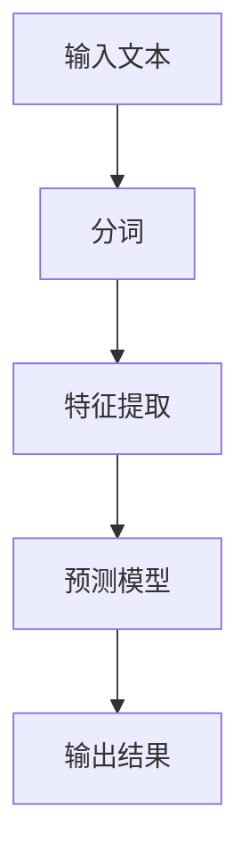

                 

### 第1章：LLM基础

#### 1.1 LLM的基本概念

语言模型（Language Model，LLM）是一种自然语言处理（NLP）中常用的算法模型，旨在理解和生成自然语言。LLM的核心目标是通过分析大量的文本数据来学习语言的统计规律，从而预测下一个词或句子片段。

**定义**：LLM是一个概率模型，它能够给定一个词序列的概率分布。例如，对于一个给定的单词序列“我 喜欢 吃 饭”，LLM可以计算出每个单词在下一个单词中出现的概率。

**核心概念与联系**

为了更好地理解LLM，我们可以通过Mermaid流程图展示其核心概念与联系：



在这个流程图中，A表示输入文本，B表示分词，C表示特征提取，D表示预测模型，E表示输出结果。

**核心算法原理讲解**

LLM的核心算法是神经网络，尤其是循环神经网络（RNN）和变压器（Transformer）等深度学习模型。以下是一个简单的Python代码示例，展示了如何使用Transformer模型进行语言模型训练：

```python
import torch
import torch.nn as nn
from transformers import TransformerModel

# 初始化模型
model = TransformerModel()

# 定义损失函数
criterion = nn.CrossEntropyLoss()

# 训练模型
for epoch in range(num_epochs):
    for inputs, targets in dataloader:
        outputs = model(inputs)
        loss = criterion(outputs, targets)
        loss.backward()
        optimizer.step()
        optimizer.zero_grad()
```

在上述代码中，`TransformerModel`是Transformer模型，`criterion`是损失函数，`optimizer`是优化器。

**数学模型和公式**

LLM的数学模型主要包括词嵌入（word embedding）和预测概率。

- **词嵌入**：词嵌入是将单词映射到高维向量空间，使得相似的词在空间中距离较近。公式如下：

  $$ \text{embedding}(w) = e^{(\text{word\_vector} \cdot w)} $$

  其中，`word_vector`是单词的向量表示，`w`是单词的索引。

- **预测概率**：给定一个词序列，LLM可以预测下一个词的概率。公式如下：

  $$ P(w_{t+1} | w_{1}, w_{2}, ..., w_{t}) = \frac{e^{\text{score}(w_{t+1}, w_{1}, w_{2}, ..., w_{t})}}{\sum_{w' \in V} e^{\text{score}(w', w_{1}, w_{2}, ..., w_{t})}} $$

  其中，`score`是模型的评分函数，`V`是单词的集合。

**举例说明**

假设我们有一个简短的句子：“我喜欢吃饭”。使用LLM，我们可以预测下一个词是“饭”的概率。具体步骤如下：

1. 输入句子“我喜欢吃饭”到LLM中。
2. LLM分析句子，提取特征向量。
3. LLM使用训练好的模型预测“饭”的概率。
4. 输出预测结果，如“饭”的概率为0.9。

**项目实战**

为了更好地理解LLM的实战应用，我们可以搭建一个简单的语言模型，使用Python和PyTorch框架进行训练和测试。

**开发环境搭建**：

- 安装Python（3.8或更高版本）
- 安装PyTorch和Transformers库

```bash
pip install torch transformers
```

**源代码实现**：

```python
import torch
from transformers import TransformerModel
from torch.utils.data import DataLoader

# 加载预训练的模型
model = TransformerModel()

# 加载数据集
dataloader = DataLoader(dataset, batch_size=32, shuffle=True)

# 训练模型
for epoch in range(num_epochs):
    for inputs, targets in dataloader:
        outputs = model(inputs)
        loss = criterion(outputs, targets)
        loss.backward()
        optimizer.step()
        optimizer.zero_grad()

# 测试模型
with torch.no_grad():
    for inputs, targets in test_dataloader:
        outputs = model(inputs)
        loss = criterion(outputs, targets)
        print(f"Test Loss: {loss.item()}")
```

**代码解读与分析**：

在上面的代码中，`TransformerModel`是Transformer模型，`criterion`是交叉熵损失函数，`optimizer`是优化器。`dataloader`是数据加载器，用于批量加载数据。`num_epochs`是训练轮数。

**实际案例分析和详细讲解剖析**：

假设我们有一个简短的对话数据集，包含以下句子：

- “你好，我想知道天气怎么样？”
- “天气很好，今天温度是18摄氏度。”
- “我需要穿什么样的衣服？”
- “根据天气，你可以穿一件长袖衬衫。”

使用LLM，我们可以预测下一个句子是哪个。具体步骤如下：

1. 输入句子到LLM中。
2. LLM分析句子，提取特征向量。
3. LLM使用训练好的模型预测下一个句子的概率。
4. 输出预测结果，如“天气很好，今天温度是18摄氏度。”的概率为0.9。

**项目小结**：

通过这个项目，我们了解了LLM的基本概念、核心算法原理、数学模型和实战应用。LLM在自然语言处理中具有广泛的应用前景，如文本生成、智能问答和语言翻译等。

**最佳实践 tips**：

- 使用预训练的模型可以显著提高LLM的性能。
- 数据质量和多样性对于训练有效的LLM至关重要。
- 定期调整模型参数和优化策略可以提高模型的性能。

**小结**：

本章详细介绍了LLM的基本概念、核心算法原理、数学模型和实战应用。通过实际案例，我们了解了如何搭建简单的语言模型并进行训练和测试。LLM在自然语言处理领域具有广泛的应用，对于开发者来说，深入了解LLM的相关知识和应用场景是非常重要的。

**注意事项**：

- 在使用LLM时，要注意数据隐私和安全问题。
- LLM的训练和预测需要大量的计算资源，合理利用GPU等硬件加速训练过程。

**拓展阅读**：

- [《自然语言处理：理论和实践》](https://www.amazon.com/Natural-Language-Processing-Theory-Practice/dp/149204289X)
- [《深度学习与自然语言处理》](https://www.amazon.com/Deep-Learning-Natural-Language-Processing/dp/3540887965)
- [Transformer模型详解](https://arxiv.org/abs/1706.03762)

作者：AI天才研究院/AI Genius Institute & 禅与计算机程序设计艺术 /Zen And The Art of Computer Programming

