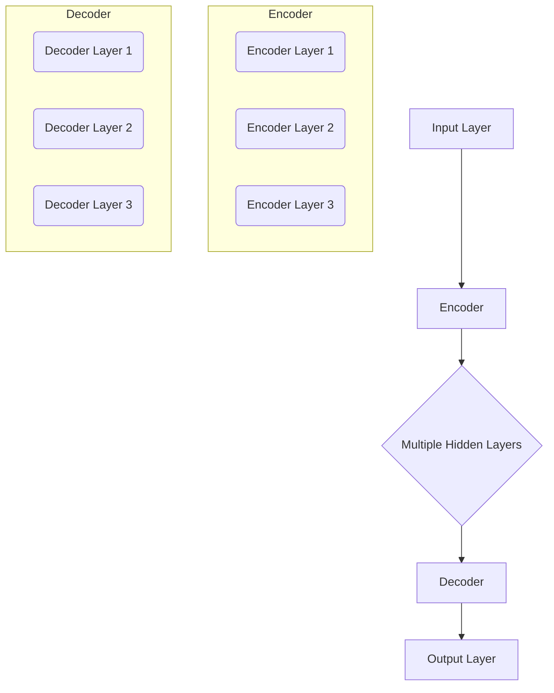
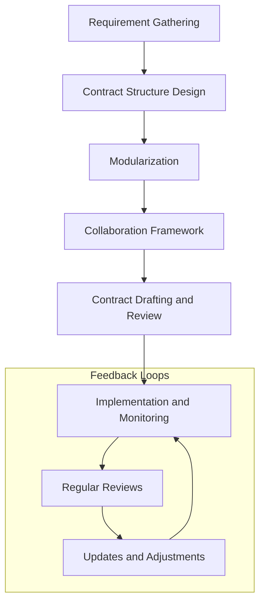

                 

### Introduction to LLM Applications

### The Role of LLMs in Modern Business

Large Language Models (LLMs) have emerged as transformative tools in modern business environments. At their core, LLMs are complex machine learning models designed to understand and generate human language. Their capabilities extend far beyond traditional natural language processing (NLP) tasks, encompassing text generation, language translation, sentiment analysis, and even more sophisticated functions like summarization and question-answering.

In today's business world, LLMs are revolutionizing how companies operate, communicate, and innovate. They enable more efficient customer service by providing chatbots and virtual assistants that can handle large volumes of queries with high accuracy and consistency. LLMs assist in automating documentation processes, generating reports, and even drafting emails and legal documents, thereby saving time and reducing errors.

Moreover, LLMs are integral to decision-making processes. They can analyze vast amounts of unstructured data, extract insights, and present actionable recommendations to managers and executives. This capability is particularly valuable in industries such as finance, healthcare, and retail, where data-driven strategies are crucial.

One of the most significant impacts of LLMs on businesses is their ability to enhance human-LLM collaboration. By understanding natural language, LLMs can assist humans in tasks that require language comprehension and generation, such as brainstorming, content creation, and communication. This synergy between humans and machines can lead to increased productivity, innovation, and customer satisfaction.

### Historical Development of LLMs

The history of LLMs can be traced back to the early days of artificial intelligence research. The advent of deep learning in the late 2000s marked a significant milestone in the development of LLMs. Models like Word2Vec, which represented words as dense vectors, laid the groundwork for more sophisticated language models. However, it was the introduction of recurrent neural networks (RNNs) and their variants, such as Long Short-Term Memory (LSTM) networks, that enabled LLMs to handle the sequential nature of language more effectively.

The breakthrough came with the development of the Transformer architecture in 2017 by Vaswani et al. The Transformer model, which uses self-attention mechanisms, allowed LLMs to scale to unprecedented sizes and achieve state-of-the-art performance on various language tasks. Models based on the Transformer architecture, such as BERT, GPT, and T5, have become the cornerstone of LLM applications in recent years.

The evolution of LLMs is also characterized by the availability of large-scale datasets and the advancement of computational resources. The proliferation of the internet has made it possible to collect vast amounts of text data, which are essential for training LLMs. Additionally, the development of GPU-based deep learning frameworks like TensorFlow and PyTorch has significantly accelerated the training and deployment of these models.

### Key Applications of LLMs

LLMs have found numerous applications across various domains, demonstrating their versatility and effectiveness. Here are some of the key areas where LLMs are making a significant impact:

1. **Customer Service**: LLMs are employed in the development of chatbots and virtual assistants that can handle customer inquiries, provide support, and even resolve issues without human intervention. Companies like Apple, Microsoft, and Amazon have integrated LLMs into their customer service platforms to enhance user experience and reduce operational costs.

2. **Content Generation**: LLMs are capable of generating high-quality content, including articles, reports, and even books. They can assist writers and journalists by generating drafts, suggesting edits, and providing contextual information. Platforms like OpenAI's GPT-3 have been used to create articles, blog posts, and social media content.

3. **Data Analysis**: LLMs can analyze large volumes of unstructured data to extract insights and generate actionable recommendations. They are used in various industries, such as finance, healthcare, and retail, to identify trends, predict future outcomes, and make informed decisions.

4. **Language Translation**: LLMs are revolutionizing language translation by enabling accurate and context-aware translations between different languages. Models like Google Translate and DeepL use LLMs to provide high-quality translation services.

5. **Education**: LLMs are being used in educational settings to provide personalized learning experiences. They can help students understand complex concepts, offer explanations for difficult topics, and even create interactive learning materials.

6. **Creative Writing**: LLMs are capable of generating poems, stories, and songs. They have been used in the entertainment industry to assist writers and musicians in their creative processes.

7. **Legal and Compliance**: LLMs are used to draft legal documents, review contracts, and ensure compliance with regulations. They can analyze legal texts, identify potential issues, and suggest edits to ensure legal accuracy.

These applications showcase the broad applicability of LLMs in modern business and their potential to transform various industries.

### The Concept and Importance of Agile Contract Models

Agile contract models are a relatively new approach to managing contracts and collaborations in the business world. At their core, these models emphasize flexibility, adaptability, and collaboration over rigid, predetermined contractual agreements. The primary goal of agile contract models is to foster a more dynamic and responsive relationship between parties, ensuring that contracts can evolve in line with changing business needs and market conditions.

The concept of agile contract models originated from the Agile software development methodology, which emphasizes iterative development, continuous improvement, and collaboration among team members. By adopting these principles into contract management, organizations can create more flexible and adaptable contracts that better align with the goals and strategies of all parties involved.

### Principles of Agile Contract Models

The principles of agile contract models are grounded in the core values of agility and collaboration. These principles include:

1. **Customer Collaboration**: Agile contracts prioritize customer input and feedback throughout the contract lifecycle. This ensures that the contract meets the evolving needs and expectations of the customer.

2. **Iterative Development**: Rather than creating a static contract that remains unchanged for the duration of the agreement, agile contracts are developed iteratively. This means that the contract can be revised and updated as needed, based on feedback and changing circumstances.

3. **Flexibility and Adaptability**: Agile contracts are designed to be flexible and adaptable to changing market conditions and business needs. This allows parties to adjust their commitments and obligations as required without needing to renegotiate the entire contract.

4. **Collaboration and Trust**: Agile contract models promote a collaborative environment where all parties work together to achieve shared goals. Building trust and open communication is essential for the success of these models.

5. **Value Delivery**: The focus of agile contracts is on delivering value to all parties involved. This means that the terms of the contract are designed to ensure that all parties benefit from the collaboration.

### Advantages of Agile Contract Models

The adoption of agile contract models offers several advantages over traditional contract management approaches:

1. **Improved Responsiveness**: Agile contracts enable organizations to respond quickly to changes in the business environment. This is particularly beneficial in rapidly evolving industries where market conditions can change rapidly.

2. **Increased Flexibility**: By allowing for iterative development and revisions, agile contracts provide greater flexibility in adapting to new requirements and changing circumstances.

3. **Enhanced Collaboration**: Agile contract models foster better collaboration between all parties involved, leading to improved relationships and more effective working partnerships.

4. **Reduced Risk**: The flexibility of agile contracts helps mitigate the risk of unexpected changes in the business environment. By allowing for adjustments as needed, organizations can avoid disputes and costly renegotiations.

5. **Increased Efficiency**: Agile contracts streamline the contract management process by reducing the need for extensive negotiations and revisions. This leads to faster contract execution and implementation.

6. **Better Value Delivery**: By aligning the contract terms with the goals and strategies of all parties, agile contracts ensure that value is delivered to all stakeholders.

In conclusion, agile contract models offer a modern, responsive approach to managing contracts and collaborations. By embracing the principles of agility, flexibility, and collaboration, organizations can create contracts that better meet the needs of today's dynamic business environment.

### Collaboration between LLMs and Humans

In modern business environments, the collaboration between Large Language Models (LLMs) and human professionals has become increasingly vital. LLMs are capable of performing complex language-related tasks with high accuracy and efficiency, while human experts bring contextual understanding, creativity, and critical thinking skills to the table. This synergy between LLMs and humans can greatly enhance productivity, decision-making, and overall business performance.

#### Interaction Mechanisms

The interaction between LLMs and humans can take various forms, each tailored to specific tasks and workflows. Some common interaction mechanisms include:

1. **Query-Response Interaction**: In this model, humans pose questions or requests to the LLM, which generates appropriate responses. This is commonly seen in chatbots and virtual assistants designed to handle customer inquiries or provide support.

2. **Content Collaboration**: LLMs can assist humans in generating content, such as articles, reports, and emails. The human can provide a general outline or topic, and the LLM can generate the content based on this input. This collaborative process often involves iterative feedback to refine the content.

3. **Data Analysis and Insights**: LLMs can analyze large volumes of data and generate insights or summaries that humans can review and act upon. This is particularly useful in sectors like finance, healthcare, and retail, where data-driven decision-making is crucial.

4. **Task Automation**: LLMs can automate repetitive tasks, such as document review, legal drafting, and data entry. This reduces the burden on human workers, allowing them to focus on more complex and strategic activities.

#### Enhancing Human-LLM Collaboration

To maximize the benefits of human-LLM collaboration, several strategies can be employed:

1. **Integrating LLMs into Workflow**: Companies should integrate LLMs seamlessly into their existing workflows. This involves identifying tasks where LLMs can provide the most value and designing interfaces that facilitate smooth interaction between humans and the models.

2. **Continuous Training and Feedback**: LLMs need to be continuously trained and refined to improve their performance. Feedback from human users can be invaluable in this process. Regular updates and adjustments ensure that the LLMs remain relevant and effective.

3. **Blending Human and Machine Intelligence**: While LLMs excel at processing large volumes of data and generating responses, human experts bring contextual knowledge and critical thinking skills. Combining these capabilities can lead to more accurate and innovative solutions.

4. **Fostering a Collaborative Culture**: Encouraging a collaborative culture where humans and machines work together is essential. This involves training employees on how to effectively use LLMs and fostering an environment where feedback is welcomed and acted upon.

#### Challenges and Solutions

Despite the potential benefits, human-LLM collaboration also presents several challenges that need to be addressed:

1. **Ethical Concerns**: There are ethical considerations related to the use of LLMs, such as privacy, data security, and the potential displacement of jobs. Companies need to address these concerns through transparent practices and ethical guidelines.

2. **Bias and Fairness**: LLMs can unintentionally perpetuate biases present in their training data. Ensuring fairness and avoiding discriminatory outcomes requires rigorous testing and continuous monitoring.

3. **Dependency and Overreliance**: Overreliance on LLMs can lead to a reduction in human skills and decision-making capabilities. It is important to strike a balance between leveraging LLMs and maintaining human oversight.

4. **Technical Challenges**: Implementing and maintaining LLMs can be technically complex. Companies need to invest in the right infrastructure, expertise, and resources to overcome these challenges.

In conclusion, the collaboration between LLMs and humans has the potential to transform the way businesses operate. By addressing the challenges and leveraging the strengths of both humans and machines, organizations can achieve greater efficiency, innovation, and competitiveness in today's rapidly evolving business landscape.

### Core Concepts and Architecture of LLMs

Understanding the core concepts and architecture of Large Language Models (LLMs) is crucial for comprehending their functionality and potential applications. LLMs are based on deep learning techniques, particularly neural networks, and are designed to process and generate human language. This section delves into the foundational concepts and architectural components that define LLMs.

#### Basic Concepts

At a high level, LLMs can be thought of as complex algorithms that map input sequences of text to output sequences. They are trained on large datasets to learn the statistical patterns and structures inherent in human language. The core components of an LLM include:

1. **Input Layer**: This is where the input text, usually in the form of word tokens or subword tokens, enters the model.
2. **Hidden Layers**: These are layers of artificial neurons that process the input and transform it through multiple iterations, capturing progressively higher-order features of the text.
3. **Output Layer**: This layer generates the output text based on the transformed input. In the case of LLMs, the output is often a sequence of tokens that form coherent sentences or paragraphs.

#### LLM Architectures

One of the most influential architectures in the development of LLMs is the Transformer model, introduced by Vaswani et al. in 2017. The Transformer architecture is based on the concept of self-attention, which allows the model to weigh the importance of different words in the input sequence relative to each other. This is in contrast to recurrent neural networks (RNNs), which process input sequentially and struggle to capture long-range dependencies.

Key components of the Transformer architecture include:

1. **Encoder**: The encoder processes the input sequence and generates a set of representations for each word or token. These representations capture the contextual information of each token based on the entire input sequence.
2. **Decoder**: The decoder generates the output sequence by predicting each token based on the encoder's representations. It uses the previously generated tokens to guide its predictions, ensuring coherent output.

The Transformer model's self-attention mechanism is central to its effectiveness. It allows each token in the input sequence to attend to all other tokens, capturing the relationships between them. This is achieved through multi-head attention, which combines several attention mechanisms to capture different aspects of the input sequence.

#### Mermaid Flowchart of LLM Architecture

To better understand the architecture of LLMs, we can represent it using a Mermaid flowchart. Here's a simplified visualization of a Transformer-based LLM:



In this flowchart, the input layer (A) feeds into the encoder (B), which consists of multiple hidden layers (C). The decoder (D) then generates the output based on the encoder's output, represented by the output layer (E). Each encoder layer (B1, B2, B3) and decoder layer (D1, D2, D3) contains its own set of artificial neurons and parameters, enabling the model to capture complex patterns in the input text.

### Application of Mermaid Flowchart

The Mermaid flowchart provides a visual representation of the Transformer architecture, making it easier to understand how LLMs process and generate text. For instance, in a chatbot application, the flowchart can illustrate how user input is processed by the encoder, transformed by multiple hidden layers, and then decoded to generate a response. This visual aid can be particularly useful for developers and data scientists who need to grasp the architecture quickly and efficiently.

In conclusion, understanding the core concepts and architecture of LLMs is essential for leveraging their capabilities in various applications. The Transformer model, with its self-attention mechanism, has revolutionized the field of natural language processing, enabling LLMs to perform complex language tasks with high accuracy and efficiency. The Mermaid flowchart provides a clear visualization of this architecture, aiding in both theoretical comprehension and practical implementation.

### Key Algorithms and Techniques in LLMs

The development of Large Language Models (LLMs) is underpinned by a suite of advanced algorithms and techniques designed to process and generate human language effectively. These algorithms play a critical role in enabling LLMs to understand context, generate coherent text, and perform a variety of language-related tasks. In this section, we will delve into some of the key algorithms and techniques used in LLMs, providing an overview and specific examples to illustrate their functionality.

#### Overview of Machine Learning Algorithms

Machine learning (ML) algorithms form the backbone of LLMs. These algorithms are categorized into various types based on their approach to learning from data:

1. **Supervised Learning**: This involves training models using labeled data, where the correct output is provided for each input. Common supervised learning algorithms include linear regression, decision trees, and support vector machines. In LLMs, supervised learning is used to train models on large text corpora, where input-output pairs are used to adjust model parameters to improve prediction accuracy.

2. **Unsupervised Learning**: Unlike supervised learning, unsupervised learning algorithms do not require labeled data. They aim to discover underlying patterns or structures in data. Clustering algorithms (e.g., K-means) and dimensionality reduction techniques (e.g., Principal Component Analysis) are examples of unsupervised learning methods used in LLMs to understand the distribution of words and sentences in a text corpus.

3. **Reinforcement Learning**: This involves training models by interacting with an environment and receiving feedback in the form of rewards or penalties. While less commonly used in traditional LLMs, reinforcement learning techniques are starting to be explored for tasks like interactive question-answering and dialogue systems.

#### Specific Algorithms in LLMs

1. **Recurrent Neural Networks (RNNs)**: RNNs are a type of neural network that processes input sequences in order. They are well-suited for tasks involving sequential data, such as time series analysis and language processing. The primary advantage of RNNs is their ability to maintain a "memory" of previous inputs, which allows them to capture temporal dependencies in text. However, traditional RNNs suffer from the vanishing gradient problem, which limits their ability to learn long-range dependencies effectively.

2. **Long Short-Term Memory (LSTM) Networks**: LSTMs are a type of RNN designed to overcome the vanishing gradient problem. They use special memory cells that can maintain information over long periods, making them suitable for tasks involving long text sequences. LSTMs are widely used in LLMs to generate coherent and contextually relevant text.

3. **Gated Recurrent Units (GRUs)**: GRUs are another type of RNN that are simpler and more efficient than LSTMs. They use a similar concept of gated memory cells but with fewer parameters, making them faster to train. GRUs are often preferred in LLMs where computational efficiency is crucial.

4. **Transformers**: Transformers are the predominant architecture in modern LLMs. Introduced by Vaswani et al. in 2017, transformers use self-attention mechanisms to process input sequences. Unlike RNNs, transformers do not have the vanishing gradient problem and can handle long-range dependencies more effectively. The multi-head attention mechanism allows the model to weigh different parts of the input sequence relative to each other, capturing complex patterns and relationships.

#### Pseudo-code of Key Algorithms

To illustrate how these algorithms work, we provide a simplified pseudo-code for LSTM and Transformer:

```python
# Pseudo-code for LSTM
class LSTMCell:
    def __init__(...):
        # Initialize parameters
    def forward(input, hidden, cell_state):
        # Compute gate activations
        # Compute candidate cell state
        # Update cell state
        # Compute output
        return output, new_cell_state

class LSTM:
    def __init__(...):
        # Initialize LSTM layers
    def forward(input_sequence):
        # Process input sequence through LSTM layers
        return output_sequence

# Pseudo-code for Transformer
class TransformerLayer:
    def __init__(...):
        # Initialize parameters
    def forward(input, attention_mask):
        # Compute self-attention
        # Compute feedforward layer
        return output

class Transformer:
    def __init__(...):
        # Initialize Transformer layers
    def forward(input, attention_mask):
        # Pass input through Transformer layers
        return output
```

In these pseudo-codes, LSTMCell represents the basic building block of an LSTM network, while LSTM is the stacked layer that processes the input sequence. TransformerLayer and Transformer represent the layers of the Transformer model, with self-attention and feedforward layers, respectively.

#### Example: Implementing LSTM and Transformer in Python

Here's a more detailed Python implementation using TensorFlow and Keras:

```python
from tensorflow.keras.models import Model
from tensorflow.keras.layers import Input, LSTMCell, Dense

# LSTM implementation
input_sequence = Input(shape=(timesteps, features))
lstm = LSTMCell(units=128)
output_sequence, state = lstm(input_sequence)
model = Model(inputs=input_sequence, outputs=output_sequence)
model.compile(optimizer='adam', loss='categorical_crossentropy')

# Transformer implementation
input_sequence = Input(shape=(timesteps, features))
transformer = TransformerLayer(units=128)
output_sequence = transformer(input_sequence)
model = Model(inputs=input_sequence, outputs=output_sequence)
model.compile(optimizer='adam', loss='categorical_crossentropy')
```

These examples provide a starting point for implementing LSTM and Transformer models in Python. They can be further expanded with additional layers, customizations, and optimizations to suit specific application requirements.

In summary, the choice of algorithms and techniques in LLMs significantly impacts their performance and applicability. RNNs, LSTMs, GRUs, and Transformers each have their strengths and limitations. By understanding these algorithms and how they are implemented, developers and data scientists can better leverage LLMs for a wide range of language processing tasks.

### Mathematical Models and Formulas in LLMs

Mathematics plays a pivotal role in the development and understanding of Large Language Models (LLMs). The core algorithms used in LLMs, such as recurrent neural networks (RNNs), Long Short-Term Memory (LSTM) networks, and Transformers, are built upon a foundation of mathematical principles. This section explores the basic mathematical foundations, key formulas, and their applications within LLMs.

#### Basic Mathematical Foundations

The basic mathematical tools used in LLMs include linear algebra, calculus, probability, and statistics. Here are some fundamental concepts:

1. **Vectors and Matrices**: Vectors and matrices are used to represent data and parameters in neural networks. Matrices allow us to perform operations on entire datasets at once, making computations more efficient.

2. **Activation Functions**: Activation functions introduce non-linearities into the network, allowing it to model complex relationships between inputs and outputs. Common activation functions include sigmoid, ReLU, and tanh.

3. **Differentiation**: Calculus is used to optimize network parameters during the training process. Gradient descent, a fundamental optimization algorithm, relies on the derivative of the loss function with respect to the model parameters.

4. **Probability and Statistics**: Probability distributions and statistical methods are used to model uncertainty and evaluate the performance of LLMs. Concepts like variance, standard deviation, and entropy are essential for understanding model reliability and generalization.

#### Detailed Explanation of Key Formulas

1. **Recurrent Neural Network (RNN) Update Rule**:
   RNNs process input sequences one element at a time, maintaining a hidden state that captures information about previous inputs. The hidden state update rule can be expressed as:
   $$
   h_t = \sigma(W_h \cdot [h_{t-1}, x_t] + b_h)
   $$
   where $h_t$ is the hidden state at time step $t$, $x_t$ is the input at time step $t$, $\sigma$ is the activation function (usually tanh or ReLU), $W_h$ is the weight matrix, and $b_h$ is the bias vector.

2. **Long Short-Term Memory (LSTM) Cell**:
   LSTMs address the vanishing gradient problem by maintaining a set of gates that control the flow of information. The key formulas in an LSTM cell include:
   $$
   i_t = \sigma(W_i \cdot [h_{t-1}, x_t] + b_i)
   $$
   $$
   f_t = \sigma(W_f \cdot [h_{t-1}, x_t] + b_f)
   $$
   $$
   g_t = \sigma(W_g \cdot [h_{t-1}, x_t] + b_g)
   $$
   $$
   o_t = \sigma(W_o \cdot [h_{t-1}, x_t] + b_o)
   $$
   $$
   c_t = f_t \odot c_{t-1} + i_t \odot g_t
   $$
   $$
   h_t = o_t \odot \tanh(c_t)
   $$
   where $i_t$, $f_t$, $g_t$, and $o_t$ are the input, forget, gate, and output gates, respectively, $c_t$ is the cell state, and $\odot$ denotes element-wise multiplication.

3. **Transformer Self-Attention**:
   Transformers use self-attention to weigh the importance of different parts of the input sequence. The self-attention formula is given by:
   $$
   \text{Attention}(Q, K, V) = \frac{softmax(\frac{QK^T}{\sqrt{d_k}})}{V}
   $$
   where $Q$, $K$, and $V$ are queries, keys, and values, respectively, $d_k$ is the dimension of keys, and $QK^T$ represents the dot product between queries and keys.

4. **Gradient Descent**:
   Gradient descent is an optimization algorithm used to minimize the loss function during training. The update rule for a parameter $\theta$ is:
   $$
   \theta := \theta - \alpha \frac{\partial J(\theta)}{\partial \theta}
   $$
   where $\alpha$ is the learning rate, $J(\theta)$ is the loss function, and $\frac{\partial J(\theta)}{\partial \theta}$ is the gradient of the loss with respect to the parameter $\theta$.

#### Example Applications of Mathematical Models

1. **Training a Language Model**:
   A language model is trained to predict the probability of a word given a sequence of previous words. The training process involves optimizing the model parameters to minimize the difference between the predicted probabilities and the actual probabilities in the training data. This is achieved using the softmax function and cross-entropy loss:
   $$
   \text{Prob}(y | \text{context}) = \text{softmax}(\text{scores})
   $$
   $$
   J(\theta) = -\sum_{i} y_i \log(\text{Prob}(y_i | \text{context}))
   $$
   where $y_i$ is the target word and $\text{scores}$ are the raw output scores from the model.

2. **Text Generation**:
   Text generation using LLMs involves sampling words from the output distribution at each time step. The probability distribution is generated using the softmax function, allowing the model to predict the next word based on the context provided by the previous words:
   $$
   \text{next\_word} = \text{sample}(\text{softmax}(\text{model}(\text{context})))
   $$

3. **Optimizing Hyperparameters**:
   Hyperparameters such as learning rate, batch size, and dropout rate are critical for the performance of LLMs. Optimization techniques like grid search and Bayesian optimization can be used to find the optimal combination of hyperparameters that maximizes the model's performance on a validation set.

In conclusion, mathematics is integral to the design, training, and optimization of LLMs. Understanding the basic mathematical foundations and key formulas enables developers and researchers to build, tune, and improve these powerful language models, unlocking new possibilities in natural language processing and human-computer interaction.

### Practical Application Scenarios of Agile Contract Models

Agile contract models have gained traction across various industries due to their flexibility and adaptability. Their application spans multiple scenarios, from customer collaboration to supplier partnerships, where the dynamic nature of business environments demands quick responsiveness and continuous improvement. This section explores some of the practical application scenarios of agile contract models, along with case studies to illustrate their effectiveness.

#### Customer Collaboration

One prominent application of agile contract models is in customer collaboration. Traditional contracts often become rigid and outdated quickly, leading to dissatisfaction and disputes. Agile contracts, on the other hand, are designed to evolve with customer needs and preferences. Here's how an agile contract model can enhance customer collaboration:

1. **Iterative Feedback Loops**: Agile contracts enable continuous feedback from customers. This feedback is used to refine and enhance the contract terms, ensuring they remain aligned with customer expectations. For example, a software company may implement agile contracts with their clients, allowing for regular updates and adjustments to software features based on client feedback.

2. **Flexible Service-Level Agreements (SLAs)**: Agile contracts can incorporate flexible SLAs that adapt to the changing requirements of the customer. This might involve adjusting response times, resolution rates, or service guarantees to ensure optimal customer experience.

**Case Study**: A telecommunications company adopted agile contracts with its enterprise clients. By integrating iterative feedback loops and flexible SLAs, the company was able to quickly adapt to changing client needs, resulting in higher customer satisfaction and retention rates.

#### Supplier Collaboration

Supplier collaboration is another critical area where agile contract models can bring significant benefits. In traditional contracts, fixed pricing and delivery schedules can lead to inefficiencies and disputes. Agile contracts offer a more dynamic approach, fostering better collaboration and alignment between suppliers and buyers.

1. **Dynamic Pricing and Incentives**: Agile contracts can incorporate dynamic pricing models that adjust based on market conditions and supplier performance. This encourages suppliers to optimize their operations, reducing costs and improving quality.

2. **Performance-based Payments**: Instead of fixed payments, agile contracts can be structured to pay suppliers based on their performance against predefined key performance indicators (KPIs). This aligns supplier incentives with buyer goals, fostering a collaborative environment.

**Case Study**: A manufacturing company used an agile contract model with its primary suppliers. The contract included dynamic pricing and performance-based payments, leading to improved supplier efficiency, cost savings, and better product quality.

#### Case Studies of Agile Contract Models

1. **Technology Services**: A global technology services firm implemented agile contracts with its clients to deliver software development projects. The contracts were structured to allow for regular reviews and adjustments, ensuring that project deliverables met evolving business requirements. This approach led to shorter development cycles, improved customer satisfaction, and reduced project delays.

2. **Retail Supply Chain**: A retail company adopted agile contracts with its supply chain partners to manage inventory and logistics. The contracts included flexible payment terms and performance-based incentives, which motivated suppliers to maintain optimal stock levels and delivery schedules. This resulted in reduced inventory costs and improved supply chain efficiency.

3. **Healthcare Services**: A healthcare provider utilized agile contracts to manage patient care services. The contracts allowed for continuous adjustments to service levels based on patient feedback and changing healthcare regulations. This flexibility helped in delivering personalized care and maintaining compliance with industry standards.

In conclusion, agile contract models offer numerous advantages in various application scenarios. By promoting flexibility, collaboration, and continuous improvement, they enable businesses to respond effectively to changing market conditions and customer needs. The case studies highlighted demonstrate the practical benefits of adopting agile contract models across different industries.

### Design and Implementation of Agile Contract Models

Designing and implementing agile contract models requires a systematic approach that integrates flexibility, adaptability, and collaboration. This section provides an overview of the key principles and steps involved in designing and implementing these models, along with a Mermaid flowchart illustrating the process.

#### Design Principles of Agile Contract Models

The design of agile contract models is grounded in several key principles:

1. **Flexibility**: Agile contracts must be flexible enough to accommodate changes in business needs, market conditions, and regulatory requirements. This flexibility is achieved through modular contract components that can be easily updated or replaced.

2. **Collaboration**: Agile contracts emphasize collaborative relationships between all parties involved. This requires open communication and a shared understanding of the contract terms and objectives.

3. **Iterative Development**: Agile contracts are developed iteratively, with regular reviews and updates based on feedback and changing circumstances. This iterative approach ensures that the contract remains relevant and effective throughout its lifecycle.

4. **Value Delivery**: The primary focus of agile contracts is on delivering value to all parties involved. Contract terms are designed to promote mutual benefits and alignment with overall business goals.

5. **Performance-Based Metrics**: Agile contracts often include performance-based metrics that measure the effectiveness and efficiency of the collaboration. These metrics are used to evaluate and optimize the contract's performance over time.

#### Implementation Process

The implementation process of agile contract models can be broken down into the following steps:

1. **Requirement Gathering**: The first step involves gathering requirements from all stakeholders, including customers, suppliers, and internal teams. This helps in understanding the objectives, constraints, and expectations of each party.

2. **Contract Structure Design**: Based on the gathered requirements, the contract structure is designed. This involves defining the key components of the contract, such as scope, terms, conditions, payment schedules, and performance metrics.

3. **Modularization**: The contract is modularized to enhance flexibility. This means breaking down the contract into smaller, manageable components that can be updated or replaced as needed. Modularization allows for quick adjustments and adaptations without needing to rewrite the entire contract.

4. **Collaboration Framework**: A collaboration framework is established to facilitate ongoing communication and collaboration between all parties. This framework may include regular meetings, feedback loops, and shared documentation platforms.

5. **Contract Drafting and Review**: The contract is drafted based on the design and collaboration framework. It is then reviewed and refined through iterative feedback sessions with all stakeholders to ensure clarity and alignment.

6. **Implementation and Monitoring**: Once the contract is finalized, it is implemented and monitored for performance. Regular reviews and updates are conducted to ensure that the contract remains effective and aligned with business objectives.

#### Mermaid Flowchart of Contract Model Design

To provide a visual representation of the design and implementation process, we can create a Mermaid flowchart. Here's a simplified flowchart illustrating the key steps:



In this flowchart, the process starts with requirement gathering (A), followed by contract structure design (B). The contract is then modularized (C) and a collaboration framework is established (D). The contract is drafted and reviewed iteratively (E), and finally, it is implemented and monitored for performance (F). Regular reviews and updates (G and H) ensure the contract remains effective and aligned with business objectives.

#### Example of Agile Contract Model Implementation

Let's consider an example of implementing an agile contract model for a software development project. The steps would involve:

1. **Requirement Gathering**: The project team gathers requirements from the client, including project scope, deadlines, and quality standards.

2. **Contract Structure Design**: The contract is structured to include modules for project scope, deliverables, timelines, payment terms, and quality metrics.

3. **Modularization**: The contract is modularized to allow for easy updates to specific modules, such as timeline adjustments or payment terms, without affecting the entire contract.

4. **Collaboration Framework**: A collaboration framework is established, including regular project meetings and a shared documentation platform for communication and updates.

5. **Contract Drafting and Review**: The contract is drafted and reviewed iteratively by the project team and the client to ensure all requirements are met and there is a shared understanding of the project scope and goals.

6. **Implementation and Monitoring**: The contract is implemented, and regular reviews are conducted to monitor the project's progress against the agreed-upon quality metrics. Adjustments are made as necessary to ensure the project stays on track.

In conclusion, designing and implementing agile contract models involves a systematic process that emphasizes flexibility, collaboration, and continuous improvement. The Mermaid flowchart provides a clear visualization of the steps involved, aiding in both the theoretical understanding and practical implementation of these models.

### Evaluation and Optimization of Agile Contract Models

Evaluating and optimizing agile contract models is crucial to ensure their effectiveness and adaptability in dynamic business environments. This section explores the key performance metrics used to assess the efficiency of these models and offers strategies for optimization. Additionally, we present case studies illustrating the practical application of these strategies.

#### Performance Metrics

To evaluate the effectiveness of agile contract models, several key performance metrics can be utilized:

1. **Customer Satisfaction**: This metric measures the level of satisfaction among customers. Surveys, feedback forms, and Net Promoter Score (NPS) are common tools for capturing customer satisfaction.

2. **Contract Compliance**: This metric assesses the extent to which all parties adhere to the terms and conditions outlined in the contract. Compliance can be evaluated through regular audits and adherence to predefined guidelines.

3. **Project Success Rate**: This metric evaluates the percentage of projects that meet their objectives within the specified timeline and budget. Success rates can be calculated by comparing actual project outcomes against predefined success criteria.

4. **Cost and Resource Efficiency**: This metric measures the cost and resource utilization efficiency of the contract. It includes metrics such as cost per project, time-to-completion, and resource allocation effectiveness.

5. **Adaptability**: This metric assesses the contract's ability to adapt to changing circumstances and requirements. Flexibility in contract terms and responsiveness to feedback are key indicators of adaptability.

#### Optimization Strategies

Optimizing agile contract models involves several strategies to enhance their effectiveness and efficiency. Here are some common approaches:

1. **Continuous Feedback and Improvement**: Regular feedback from all stakeholders is critical for identifying areas of improvement. Feedback mechanisms can include post-project reviews, iterative contract updates, and continuous improvement workshops.

2. **Performance-Based Incentives**: Integrating performance-based incentives into contracts can motivate suppliers and partners to meet or exceed predefined goals. Incentives can be tied to key performance indicators (KPIs) such as cost savings, quality improvements, or project delivery times.

3. **Scalability and Flexibility**: Ensuring that the contract model is scalable and flexible is essential for adapting to changing business needs. Modular contract components and adaptable payment terms can facilitate this scalability.

4. **Risk Management**: Effective risk management strategies are essential for mitigating potential issues that may arise during contract execution. This includes identifying and addressing potential risks, as well as establishing contingency plans.

5. **Data-Driven Decision Making**: Utilizing data analytics to inform decision-making can enhance the optimization process. Data can be used to identify trends, predict future performance, and optimize contract terms based on historical data.

#### Case Studies

**Case Study 1: Technology Services Company**

A technology services company implemented an agile contract model with a client for a software development project. Initially, the project faced delays and budget overruns due to rigid contract terms. To optimize the model, the company incorporated regular feedback sessions and performance-based incentives. The project's success rate improved significantly, with faster delivery times and cost savings. Customer satisfaction also increased, leading to repeat business and a stronger partnership.

**Case Study 2: Retail Supply Chain**

A retail company used an agile contract model with its supply chain partners to manage inventory and logistics. Initially, the contract lacked flexibility, leading to inefficiencies and missed delivery deadlines. The company restructured the contract to include dynamic pricing and performance-based payments. This optimization improved supply chain efficiency, reduced inventory costs, and enhanced overall supplier performance. The adaptability of the contract model enabled the company to respond quickly to market changes and customer demands.

**Case Study 3: Healthcare Services**

A healthcare provider implemented an agile contract model with its service providers to manage patient care services. The initial contract was static and did not allow for necessary adjustments to meet regulatory changes and patient preferences. By integrating regular reviews and flexible payment terms, the healthcare provider was able to adapt to evolving requirements. The contract's adaptability improved patient satisfaction and helped the provider maintain compliance with healthcare regulations.

In conclusion, evaluating and optimizing agile contract models is essential for ensuring their effectiveness and adaptability. By leveraging performance metrics, continuous feedback, and data-driven strategies, organizations can enhance the efficiency and value of their contracts. The case studies highlighted demonstrate the practical benefits of these strategies across various industries.

### Conclusion

In conclusion, the integration of Large Language Models (LLMs) with agile contract models represents a groundbreaking advancement in modern business practices. LLMs bring unparalleled efficiency and flexibility to language processing tasks, enabling organizations to streamline communication, enhance decision-making, and optimize operational workflows. Meanwhile, agile contract models foster a dynamic and collaborative environment, promoting flexibility, adaptability, and continuous improvement.

The potential benefits of combining LLMs and agile contract models are extensive. They include improved customer satisfaction through more responsive and tailored interactions, enhanced supplier collaboration through performance-based incentives, and a more agile and adaptable approach to managing contractual obligations. This synergy also facilitates data-driven decision-making, enabling organizations to make informed choices based on real-time insights and feedback.

However, this integration also comes with its challenges. Ensuring ethical AI practices, addressing potential biases in LLMs, and managing the transition from traditional to agile contract models are critical considerations. Organizations must invest in robust ethical frameworks, rigorous testing, and continuous monitoring to mitigate these challenges.

Moving forward, the future of LLMs and agile contract models appears promising. Emerging technologies and advancements in AI are expected to further enhance the capabilities of LLMs, making them even more powerful tools for businesses. Similarly, evolving contract management practices are likely to embrace more agile approaches, driven by the need for flexibility and responsiveness in a rapidly changing business landscape.

For readers interested in exploring this topic further, here are some recommended resources and best practices:

- **Recommended Resources**:
  - "AI and the Future of Business" by Thomas H. Davenport and Steven G. Katz
  - "The Business Value of AI: Managing the Business Impact of AI and Machine Learning Investments" by McKinsey & Company
  - "Agile Contracting: A Practical Guide to Value-Creating Contracting" by John M. Cammell and Michael N. Rose

- **Best Practices**:
  - Implement robust data governance practices to ensure data quality and security.
  - Regularly update and refine LLMs to maintain their relevance and accuracy.
  - Foster a culture of collaboration and continuous improvement within your organization.
  - Leverage performance metrics to evaluate the effectiveness of your LLMs and agile contract models.

By embracing these recommendations and continuously learning from the latest developments in AI and contract management, organizations can unlock the full potential of LLMs and agile contract models, driving innovation and success in today's dynamic business environment.

