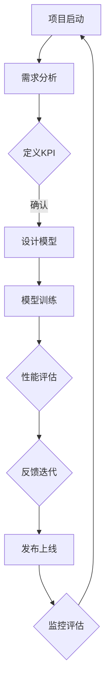
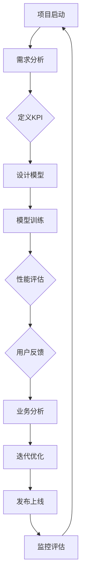
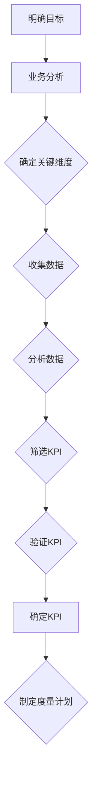

                 

# LLM应用的敏捷度量：选择正确的KPI

## 关键词
- 大型语言模型（LLM）
- 敏捷度量
- KPI
- 模型性能评估
- 用户反馈
- 业务指标
- 技术指标
- 数据收集与分析

## 摘要
本文深入探讨了LLM（大型语言模型）应用的敏捷度量方法，重点是如何选择正确的KPI（关键绩效指标）。通过详细阐述LLM应用的特点、敏捷开发方法以及敏捷度量原理，本文提供了一套系统的KPI选择流程，包括KPI的定义、分类、选择标准以及权重与组合策略。文章还分析了常见KPI，如模型性能指标、用户反馈指标、业务指标和技术指标，并结合案例进行了深入解读。此外，文章也探讨了敏捷度量实践中可能遇到的挑战及应对策略，为开发者提供了实用的指导和建议。

## 引言

### 了解LLM

大型语言模型（LLM，Large Language Models）是一种基于深度学习的自然语言处理技术，能够理解、生成和转换人类语言。LLM通过学习大量文本数据，提取语义信息和语言规律，从而实现文本生成、情感分析、机器翻译等功能。自GPT-3以来，LLM取得了显著的进步，成为了人工智能领域的重要突破。

### 敏捷度量在LLM应用中的重要性

敏捷度量是敏捷开发方法的重要组成部分，旨在通过量化指标来评估项目的进展和质量。在LLM应用开发中，敏捷度量有助于：

1. **明确目标**：通过定义和追踪KPI，明确项目的目标和期望成果。
2. **持续优化**：通过实时监控和调整度量指标，不断优化模型性能和用户体验。
3. **团队协作**：通过统一的度量标准，增强团队成员之间的沟通和协作。
4. **风险控制**：通过及时发现问题，提前制定应对策略，降低项目风险。

### 敏捷度量的目标与挑战

敏捷度量的目标包括：

1. **提高开发效率**：通过量化指标，评估开发过程中的时间、资源和人力投入。
2. **保证模型质量**：通过性能评估，确保模型在各个阶段的准确性和可靠性。
3. **优化用户体验**：通过用户反馈，持续改进模型的功能和界面。

然而，在实现敏捷度量过程中，开发者面临以下挑战：

1. **指标选择**：选择合适的KPI并非易事，需要综合考虑业务需求和模型特性。
2. **数据质量**：准确的度量依赖于高质量的数据，数据收集和处理过程中的问题可能导致度量结果失真。
3. **持续迭代**：敏捷度量要求持续跟踪和调整指标，这在快速变化的项目中具有挑战性。

## 第一部分: 了解LLM应用的敏捷度量

### 第1章: 了解LLM应用的敏捷度量

#### 1.1.1 什么是LLM

大型语言模型（LLM）是一种强大的自然语言处理工具，它通过学习大量文本数据，可以生成、理解和翻译人类语言。LLM的核心是神经网络架构，如Transformer，它能够捕捉文本中的长距离依赖关系，实现高效的语言理解与生成。

#### 1.1.2 敏捷开发方法

敏捷开发是一种以人为核心，迭代、增量式进行软件开发的模式。其核心理念包括快速迭代、客户至上、持续交付、团队协作等。敏捷开发方法强调灵活性和适应性，能够应对需求变化，提高开发效率和产品质量。

#### 1.1.3 敏捷度量原理

敏捷度量是通过量化的方法来评估项目的进展和质量。敏捷度量的核心是关键绩效指标（KPI），它用于衡量项目的关键维度，如时间、成本、质量和用户满意度。敏捷度量强调实时反馈和持续改进，帮助开发团队更好地掌控项目进度和质量。

#### 1.1.4 Mermaid流程图：LLM应用的敏捷度量流程

### 第2章: LLM应用的敏捷度量基础

#### 2.1.1 LLM应用概述

LLM应用广泛存在于各个领域，如智能客服、内容生成、翻译服务、文本摘要等。这些应用不仅需要模型具备强大的语言理解能力，还需要实时调整和优化，以满足不断变化的需求。

#### 2.1.2 敏捷开发方法

敏捷开发方法的核心原则是快速迭代和持续交付。在LLM应用开发中，敏捷开发方法有助于缩短开发周期，提高模型质量和用户满意度。具体方法包括：

1. **用户故事**：通过用户故事，明确用户需求和期望。
2. **迭代计划**：将开发工作分为多个迭代，每个迭代都有明确的交付目标。
3. **持续集成**：通过持续集成，确保代码质量，快速发现问题并解决。
4. **反馈循环**：通过用户反馈，不断优化模型和功能。

#### 2.1.3 敏捷度量原理

敏捷度量的核心是关键绩效指标（KPI），它用于衡量项目的关键维度，如时间、成本、质量和用户满意度。在LLM应用开发中，常见的KPI包括：

1. **模型性能指标**：如准确率、召回率、F1分数等，用于评估模型在任务中的表现。
2. **用户反馈指标**：如用户满意度、错误率等，用于衡量用户对模型和服务的接受程度。
3. **业务指标**：如点击率、转化率等，用于评估模型对业务目标的贡献。
4. **技术指标**：如计算时间、内存使用等，用于评估模型在运行过程中的资源消耗。

#### 2.1.4 Mermaid流程图：LLM应用的敏捷度量流程

### 第3章: KPI的定义与分类

#### 3.1.1 KPI的基本概念

关键绩效指标（KPI）是用于衡量项目或业务绩效的具体指标。它能够量化地反映项目的进展、质量和效率。KPI的选择和定义是敏捷度量成功的关键。

#### 3.1.2 KPI的分类

KPI可以根据其作用和属性进行分类。常见的分类方法包括：

1. **按作用分类**：
   - 模型性能指标：用于评估模型在任务中的表现。
   - 用户反馈指标：用于衡量用户对模型和服务的满意度。
   - 业务指标：用于评估模型对业务目标的贡献。
   - 技术指标：用于评估模型在运行过程中的资源消耗。

2. **按属性分类**：
   - 绝对值指标：如准确率、点击率等，具有明确的数值表示。
   - 相对值指标：如改进率、增长率等，表示相对变化。
   - 时序指标：如平均响应时间、服务中断时间等，反映时间序列变化。

#### 3.1.3 KPI的选择标准

选择合适的KPI需要考虑以下标准：

1. **代表性**：KPI能够代表项目的关键方面，具有明确的业务含义。
2. **可度量性**：KPI可以通过具体的方法和工具进行度量，数据易于获取。
3. **相关性**：KPI与项目目标密切相关，能够反映项目进展和成效。
4. **可操作**：KPI的选择和调整应具有实际的操作意义，有助于改进模型和业务。

#### 3.1.4 Mermaid流程图：KPI选择流程

### 第4章: LLM应用的常见KPI

#### 4.1.1 模型性能指标

模型性能指标是评估LLM模型在特定任务上的表现的关键指标。常见的模型性能指标包括：

1. **准确率（Accuracy）**：模型正确预测的样本占总样本的比例。计算公式为：
   $$\text{Accuracy} = \frac{\text{正确预测的样本数}}{\text{总样本数}}$$

2. **召回率（Recall）**：模型正确预测为正类的样本数与实际正类样本数的比例。计算公式为：
   $$\text{Recall} = \frac{\text{正确预测的正类样本数}}{\text{实际正类样本数}}$$

3. **精确率（Precision）**：模型正确预测为正类的样本数与预测为正类的样本总数（包括错误预测为正类的样本）的比例。计算公式为：
   $$\text{Precision} = \frac{\text{正确预测的正类样本数}}{\text{预测为正类的样本总数}}$$

4. **F1分数（F1 Score）**：精确率和召回率的调和平均值，用于综合评估模型的性能。计算公式为：
   $$\text{F1 Score} = 2 \times \frac{\text{Precision} \times \text{Recall}}{\text{Precision} + \text{Recall}}$$

#### 4.1.2 用户反馈指标

用户反馈指标是评估用户对LLM应用满意度的关键指标。常见的用户反馈指标包括：

1. **用户满意度（User Satisfaction）**：通过调查问卷或用户评分来衡量用户对服务的满意度。评分范围通常为1到5或10分制。

2. **错误率（Error Rate）**：用户在使用LLM应用时遇到的错误或问题的比例。计算公式为：
   $$\text{Error Rate} = \frac{\text{错误数量}}{\text{总用户数量}}$$

3. **反馈数量（Feedback Volume）**：用户提交的反馈数量，用于评估用户参与度和对服务的关注程度。

#### 4.1.3 业务指标

业务指标是评估LLM应用对业务目标贡献的关键指标。常见的业务指标包括：

1. **转化率（Conversion Rate）**：用户在完成特定操作（如购买、注册等）的比例。计算公式为：
   $$\text{Conversion Rate} = \frac{\text{完成操作的用户数}}{\text{总用户数}}$$

2. **点击率（Click-Through Rate, CTR）**：用户点击广告或链接的比例。计算公式为：
   $$\text{CTR} = \frac{\text{点击次数}}{\text{展示次数}}$$

3. **销售额（Sales）**：通过LLM应用实现的销售额，用于评估应用对业务收入的直接贡献。

#### 4.1.4 技术指标

技术指标是评估LLM应用在技术层面运行效率的关键指标。常见的技术指标包括：

1. **计算时间（Computation Time）**：模型在执行特定任务时所需的计算时间。计算时间越短，模型的运行效率越高。

2. **内存使用（Memory Usage）**：模型在运行过程中使用的内存总量。内存使用越低，模型对系统资源的占用越小。

3. **并发处理能力（Concurrency）**：模型同时处理多个请求的能力。高并发处理能力可以提高应用的响应速度和用户体验。

#### 4.1.5 KPI选择案例分析

以下是一个关于KPI选择的案例分析：

假设一家公司开发了一个基于LLM的智能客服系统，目标是通过自动化回答用户问题，提高客服效率和用户满意度。

1. **模型性能指标**：
   - **准确率**：确保智能客服系统能够正确理解用户的问题并给出准确的答案。
   - **召回率**：确保智能客服系统不会遗漏用户的潜在问题。

2. **用户反馈指标**：
   - **用户满意度**：通过用户调查问卷收集用户对智能客服系统的满意度评分。
   - **错误率**：记录用户在使用智能客服系统时遇到的错误数量。

3. **业务指标**：
   - **转化率**：通过跟踪用户在智能客服系统中的操作路径，计算用户完成特定操作的转化率。
   - **销售额**：通过分析智能客服系统对销售额的影响，评估其对业务目标的贡献。

4. **技术指标**：
   - **计算时间**：监控智能客服系统在处理用户请求时的计算时间，确保快速响应用户。
   - **内存使用**：监控智能客服系统的内存使用情况，确保系统稳定运行。

通过选择合适的KPI，公司可以全面评估智能客服系统的性能和效果，并针对不足之处进行优化和改进。

### 第5章: KPI的权重与组合

#### 5.1.1 KPI权重分配

在LLM应用的敏捷度量中，KPI的权重分配是一个关键问题。合理的权重分配有助于突出重要指标，提高度量结果的准确性和有效性。以下是一些常见的权重分配方法：

1. **按业务重要性分配**：根据KPI对业务目标的影响程度，赋予不同的权重。例如，对于智能客服系统，用户满意度和转化率可能比计算时间更重要。

2. **按指标相关性分配**：考虑各个KPI之间的相关性，避免过度依赖单一指标。例如，模型性能指标和用户反馈指标可能具有较高相关性，可以适当调整权重。

3. **按项目阶段分配**：根据项目不同阶段的重点，调整KPI的权重。例如，在项目初期，可能更关注模型性能指标，而在项目后期，更关注用户反馈和业务指标。

4. **专家评估**：邀请领域专家进行评估，根据他们的经验和知识，分配合理的权重。

#### 5.1.2 KPI组合策略

单一的KPI可能无法全面反映项目的状况，因此，KPI的组合策略至关重要。以下是一些常见的KPI组合策略：

1. **加权平均**：将各个KPI按照权重进行加权平均，得到综合评分。这种方法简单易行，但可能忽略某些关键指标。

2. **主成分分析（PCA）**：通过主成分分析，将多个KPI转换为一组新的主成分，这些主成分能够最大程度地保留原始KPI的信息。这种方法可以降低数据维度，突出关键指标。

3. **层次分析法（AHP）**：通过层次分析法，构建指标层次结构，对各层指标进行两两比较，计算权重。这种方法能够考虑指标之间的相互影响，但计算复杂度较高。

4. **多目标优化**：将多个KPI作为优化目标，通过多目标优化算法，找到一个综合最优解。这种方法能够全面考虑各个KPI，但需要复杂的算法和计算资源。

#### 5.1.3 KPI权重与组合案例分析

以下是一个关于KPI权重与组合策略的分析案例：

假设一家公司开发了一个基于LLM的智能客服系统，目标是通过自动化回答用户问题，提高客服效率和用户满意度。根据业务需求和项目阶段，公司选择了以下KPI：

1. **模型性能指标**：
   - **准确率**：权重为0.3
   - **召回率**：权重为0.3

2. **用户反馈指标**：
   - **用户满意度**：权重为0.2
   - **错误率**：权重为0.2

3. **业务指标**：
   - **转化率**：权重为0.1
   - **销售额**：权重为0.1

采用加权平均的方法，计算综合评分：

$$
\text{综合评分} = 0.3 \times \text{准确率} + 0.3 \times \text{召回率} + 0.2 \times \text{用户满意度} + 0.2 \times \text{错误率} + 0.1 \times \text{转化率} + 0.1 \times \text{销售额}
$$

通过这种方法，公司可以全面评估智能客服系统的性能和效果，并根据综合评分进行优化和改进。

### 第6章: LLM应用的敏捷度量实践

#### 6.1.1 度量体系构建

构建一个完整的LLM应用敏捷度量体系是确保项目成功的关键。以下步骤可以帮助开发者构建度量体系：

1. **明确项目目标**：首先，明确项目的目标和预期成果。这将有助于确定需要追踪的KPI。

2. **选择关键KPI**：根据项目目标，选择能够反映项目进展和质量的KPI。常见的KPI包括模型性能指标、用户反馈指标、业务指标和技术指标。

3. **制定度量计划**：为每个KPI制定详细的度量计划，包括度量方法、数据收集和处理流程。

4. **建立数据收集系统**：构建一个高效的数据收集系统，确保能够及时、准确地收集所需数据。

5. **数据存储与分析**：选择合适的数据存储工具，并对数据进行定期分析，提取有价值的信息。

6. **制定反馈机制**：建立反馈机制，及时将度量结果反馈给团队，以便进行改进和调整。

#### 6.1.2 度量数据收集与分析

度量数据的收集与分析是敏捷度量的核心环节。以下步骤可以帮助开发者有效收集和分析度量数据：

1. **数据收集**：
   - **自动收集**：使用自动化工具，如日志文件、API调用等，收集系统生成的数据。
   - **手动收集**：对于一些无法自动收集的数据，如用户满意度调查，可以采用手动收集方法。

2. **数据清洗**：对收集到的数据进行清洗，去除噪声和错误，确保数据质量。

3. **数据存储**：选择合适的数据存储方案，如数据库、数据仓库等，对清洗后的数据进行存储。

4. **数据分析**：
   - **描述性分析**：通过统计方法，对数据的基本特征进行描述，如平均值、中位数、标准差等。
   - **趋势分析**：分析数据随时间的变化趋势，如用户满意度随时间的变化情况。
   - **关联性分析**：分析不同KPI之间的关联性，如模型性能指标和用户满意度之间的关联。

5. **可视化展示**：使用图表、仪表板等工具，将分析结果可视化展示，便于团队成员理解和决策。

#### 6.1.3 度量结果与应用

度量结果的应用是敏捷度量的最终目标。以下步骤可以帮助开发者充分利用度量结果：

1. **问题识别**：通过分析度量结果，识别项目中的问题，如性能瓶颈、用户满意度低等。

2. **原因分析**：针对识别出的问题，进行原因分析，找出问题的根本原因。

3. **改进措施**：根据原因分析，制定相应的改进措施，如优化模型、改进用户体验等。

4. **实施与监控**：实施改进措施，并对改进效果进行监控，确保改进措施的有效性。

5. **持续迭代**：根据监控结果，对度量体系进行迭代和优化，持续改进项目质量。

#### 6.1.4 敏捷度量实践案例分析

以下是一个关于敏捷度量实践的分析案例：

假设一家公司开发了一款基于LLM的智能客服系统，目标是通过自动化回答用户问题，提高客服效率和用户满意度。在项目开发过程中，公司采用了敏捷度量方法，具体实践如下：

1. **度量体系构建**：
   - 明确项目目标：提高客服效率和用户满意度。
   - 选择关键KPI：模型准确率、用户满意度、客服响应时间等。
   - 制定度量计划：使用日志分析工具收集系统运行数据，每周进行数据分析。

2. **度量数据收集与分析**：
   - 自动收集：通过API调用日志收集系统运行数据。
   - 手动收集：通过用户满意度调查收集用户反馈。
   - 数据清洗：去除噪声和错误数据，确保数据质量。
   - 数据分析：使用统计方法和图表展示数据分析结果。

3. **度量结果与应用**：
   - 问题识别：通过数据分析，发现模型准确率较低。
   - 原因分析：经过原因分析，发现模型在处理长文本时性能较差。
   - 改进措施：优化模型处理长文本的能力。
   - 实施与监控：实施改进措施，并对改进效果进行监控。
   - 持续迭代：根据监控结果，对模型和系统进行迭代和优化。

通过上述实践，公司成功提高了智能客服系统的性能和用户满意度，实现了项目目标。

### 第7章: LLM应用敏捷度量挑战与对策

#### 7.1.1 挑战与对策

在LLM应用敏捷度量过程中，开发者可能面临以下挑战：

1. **数据质量问题**：数据质量对度量结果至关重要。如果数据存在噪声、错误或不完整，将严重影响度量结果的准确性。

   - 对策：加强数据清洗和处理，确保数据质量。可以使用数据验证和校验工具，对数据进行检查和修复。

2. **指标选择困境**：选择合适的KPI并非易事。不同的指标可能具有不同的业务含义和影响力，需要综合考虑。

   - 对策：根据项目目标和业务需求，明确关键指标。可以通过专家评估、用户调研等方法，选择最合适的指标。

3. **度量方法更新**：随着技术的发展和业务需求的变化，度量方法可能需要更新。然而，更新度量方法需要时间和资源。

   - 对策：制定度量方法的更新计划，定期评估和更新度量方法。可以使用自动化工具，简化更新过程。

4. **团队协作**：敏捷度量需要团队成员的紧密协作。然而，团队成员之间的沟通和协作可能存在困难。

   - 对策：建立有效的沟通机制，如定期会议、即时通讯工具等。鼓励团队成员积极参与度量过程，提高团队协作效率。

#### 7.1.2 挑战与对策案例分析

以下是一个关于敏捷度量挑战与对策的分析案例：

假设一家公司开发了一款基于LLM的智能客服系统，目标是通过自动化回答用户问题，提高客服效率和用户满意度。在项目开发过程中，公司遇到了以下挑战：

1. **数据质量问题**：
   - 挑战：由于数据源多样，数据质量参差不齐，导致度量结果不准确。
   - 对策：公司采用数据清洗工具，对数据源进行预处理，确保数据质量。同时，建立数据质量控制流程，定期检查和修复数据。

2. **指标选择困境**：
   - 挑战：公司难以选择合适的KPI，影响项目的进展和评估。
   - 对策：公司组织专家团队，通过讨论和调研，明确了模型准确率、用户满意度、客服响应时间等关键指标。同时，定期评估指标的有效性，根据业务需求进行调整。

3. **度量方法更新**：
   - 挑战：随着模型和技术的更新，原有的度量方法无法满足新需求。
   - 对策：公司制定度量方法更新计划，每季度评估和更新度量方法。使用自动化工具，简化更新过程，确保度量方法的及时性和有效性。

4. **团队协作**：
   - 挑战：团队成员之间的沟通不畅，影响项目的进度和质量。
   - 对策：公司建立定期会议和即时通讯工具，鼓励团队成员积极参与度量过程。同时，制定团队协作规范，提高团队协作效率。

通过上述对策，公司成功解决了敏捷度量过程中的挑战，确保了项目的顺利推进和成功交付。

### 附录

#### 附录A: 相关工具与资源

1. **敏捷度量工具推荐**：
   - **Grafana**：用于数据可视化和监控的工具，支持多种数据源和仪表板。
   - **Prometheus**：开源监控解决方案，用于收集和存储时间序列数据。
   - **TensorBoard**：TensorFlow的可视化工具，用于分析模型性能和训练过程。

2. **LLM应用相关资源**：
   - **Hugging Face**：提供预训练模型和自然语言处理工具，方便开发者进行研究和应用。
   - **OpenAI**：提供高质量的LLM模型和应用，如GPT-3，供开发者免费使用。
   - **GitHub**：众多开源项目和研究论文，供开发者参考和学习。

### 总结

本文深入探讨了LLM应用的敏捷度量方法，从理解LLM应用、敏捷开发方法和敏捷度量原理出发，详细阐述了KPI的选择、权重与组合策略，以及度量数据的收集与分析。通过案例分析，展示了敏捷度量在实际项目中的应用和挑战。未来，随着技术的发展和业务需求的变化，敏捷度量方法将不断更新和优化，为开发者提供更加精准和有效的度量工具。开发者应关注最新技术动态，灵活运用敏捷度量方法，提高项目质量和效率。作者：AI天才研究院/AI Genius Institute & 禅与计算机程序设计艺术 /Zen And The Art of Computer Programming。|

