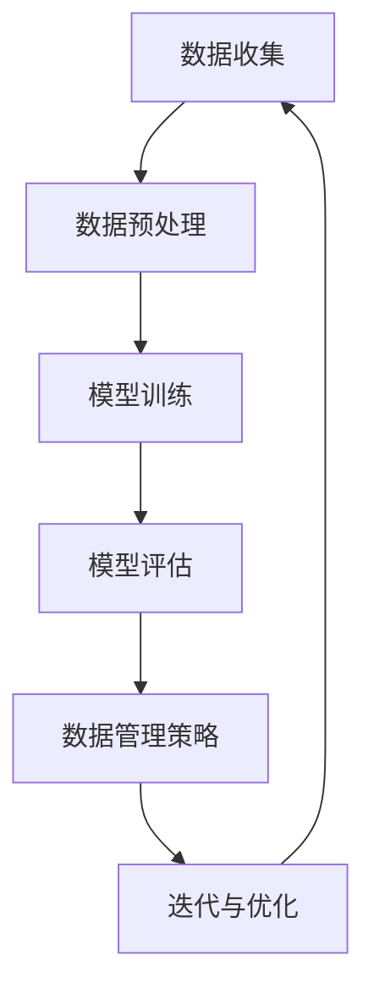
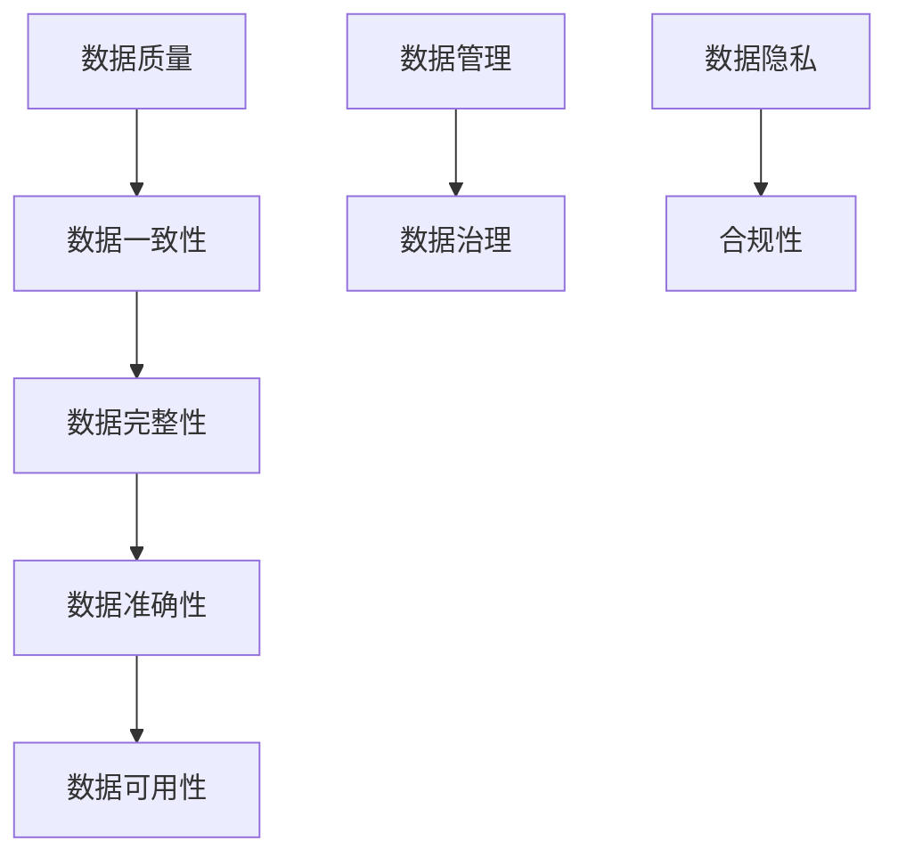

                 

### 第一部分：引言

#### 敏捷数据管理概述

随着人工智能（AI）和大型语言模型（LLM）技术的迅速发展，数据管理的重要性日益凸显。LLM应用，如聊天机器人、自然语言处理（NLP）系统和推荐引擎，都需要处理大量的数据来训练和优化模型。然而，大规模数据的处理带来了许多挑战，包括数据质量、数据一致性、数据处理速度和模型可解释性等。因此，敏捷数据管理成为了解决这些问题的关键。

敏捷数据管理是一种以数据为核心，强调快速响应变化和持续改进的数据管理方法。它基于敏捷开发的原则，注重数据驱动决策、持续交付和自动化。在LLM应用中，敏捷数据管理能够确保数据质量和准确性，提高数据处理效率，并促进模型的持续优化。

本章将介绍LLM应用的敏捷数据管理，包括其背景、重要性、核心原则以及面临的挑战。此外，还将概述本书的结构安排和学习目标，帮助读者更好地理解后续内容。

#### LLM应用的背景与重要性

人工智能（AI）作为计算机科学的重要分支，近年来取得了显著的进展。特别是深度学习和神经网络技术的发展，使得AI在图像识别、语音识别、自然语言处理等领域取得了突破性的成果。其中，大型语言模型（LLM）成为了一个备受关注的研究方向。LLM是一种能够理解和生成自然语言的深度学习模型，它通过大规模的数据集进行训练，具有强大的语义理解和文本生成能力。

LLM的应用场景非常广泛，包括但不限于以下几个方面：

1. **自然语言处理（NLP）系统**：LLM在NLP系统中扮演着重要角色，如语音识别、机器翻译、情感分析等。通过LLM，机器能够更准确地理解和处理人类语言，提升用户体验。

2. **聊天机器人**：聊天机器人已经成为许多企业和组织提供客户服务的重要工具。LLM可以帮助聊天机器人更自然地与用户进行对话，提高用户满意度和互动体验。

3. **推荐系统**：LLM在推荐系统中也有重要应用，通过分析用户的历史行为和偏好，为用户推荐感兴趣的内容。

4. **内容生成**：LLM可以自动生成新闻文章、产品描述等文本内容，提高内容创作的效率和多样性。

随着LLM应用的不断普及，对数据的需求也越来越高。一方面，LLM需要大量高质量的数据进行训练，以提高模型的性能；另一方面，LLM应用需要对数据进行实时处理和分析，以满足用户的需求。因此，如何高效、准确地管理这些大规模数据成为了一个关键问题。

传统的数据管理方法往往过于笨重和缓慢，无法满足LLM应用对数据处理速度和灵活性的需求。而敏捷数据管理通过引入敏捷开发的原则，强调快速响应变化、持续交付和自动化，能够更好地适应LLM应用的需求。

首先，敏捷数据管理强调数据驱动决策。通过实时监控和分析数据，敏捷数据管理能够帮助企业和组织快速做出决策，优化业务流程和用户体验。

其次，敏捷数据管理注重持续交付。通过不断地迭代和优化，敏捷数据管理能够确保数据质量和准确性，提高数据处理效率。

最后，敏捷数据管理强调自动化。通过自动化工具和流程，敏捷数据管理可以减少人工干预，提高数据处理速度和准确性。

总之，LLM应用的发展对数据管理提出了新的挑战，而敏捷数据管理则为解决这些问题提供了一种有效的方法。通过本章的介绍，读者将了解LLM应用和敏捷数据管理的基本概念，为后续内容的深入学习打下基础。

#### 敏捷数据管理的核心原则

敏捷数据管理是一种基于敏捷开发原则的数据管理方法，它强调快速响应变化、持续交付和自动化。以下是敏捷数据管理的几个核心原则：

1. **数据驱动决策**：敏捷数据管理认为，数据是决策的重要依据。通过实时监控和分析数据，企业和组织可以快速了解业务状况，做出更明智的决策。数据驱动决策不仅提高了决策的准确性，还提高了响应速度。

2. **持续交付**：敏捷数据管理强调持续交付，这意味着数据管理过程是分阶段进行的，每个阶段都会产生可交付的成果。这种迭代和反馈机制可以确保数据管理的效率和效果，同时也便于及时调整和优化。

3. **自动化**：自动化是敏捷数据管理的重要手段。通过自动化工具和流程，企业和组织可以减少人工干预，提高数据处理速度和准确性。自动化不仅可以降低成本，还可以减少人为错误，提高数据质量。

4. **数据质量**：数据质量是数据管理的核心。敏捷数据管理注重数据的完整性、一致性、准确性和可用性。通过建立数据治理机制，确保数据从源头到使用全过程的质量。

5. **可扩展性**：随着数据量的不断增加，敏捷数据管理需要具备良好的可扩展性。这意味着数据管理系统能够灵活应对数据量的增长，同时保持高效的性能。

6. **安全性**：数据安全是敏捷数据管理必须考虑的问题。通过实施严格的安全措施，确保数据的保密性、完整性和可用性，防止数据泄露和损坏。

7. **透明性**：敏捷数据管理强调透明性，这意味着数据和数据处理过程应该是可视化的，相关人员可以随时了解数据的状态和处理过程。透明性有助于提高数据管理的可信度和透明度。

通过遵循这些核心原则，敏捷数据管理可以更好地满足LLM应用的需求，确保数据的高质量和高效率。

#### LLM在敏捷数据管理中的挑战

尽管敏捷数据管理为LLM应用提供了有效的解决方案，但在实际应用中仍然面临诸多挑战。这些挑战主要集中在以下几个方面：

1. **大规模数据处理**：LLM应用需要处理的数据规模庞大，通常包含数十亿甚至更多的数据点。如何高效地存储、处理和分析这些数据是一个巨大的挑战。传统的数据处理方法往往难以应对如此大规模的数据量。

2. **数据质量和准确性**：在LLM应用中，数据质量和准确性至关重要。如果数据存在质量问题，如缺失、重复或异常值，将直接影响模型的训练效果和预测准确性。确保数据质量和准确性需要严格的数据治理和数据清洗流程。

3. **模型可解释性**：LLM模型通常是由大量参数和复杂的神经网络构成的，这使得模型的预测过程变得高度非线性，难以解释。在应用中，如何确保模型的可解释性，以便用户和业务人员能够理解和信任模型，是一个重要的挑战。

4. **实时数据处理**：许多LLM应用需要实时处理和分析数据，以满足用户实时互动的需求。例如，聊天机器人和推荐系统需要快速响应用户的行为和反馈。实时数据处理要求系统具备高效的数据流处理能力和低延迟的响应时间。

5. **数据隐私和合规性**：随着数据隐私法规的日益严格，如何在保证数据隐私的同时进行有效的数据管理，成为一个重要的挑战。特别是在处理敏感数据时，需要确保数据处理的合规性，防止数据泄露和滥用。

6. **系统可扩展性和弹性**：随着数据量和用户数量的不断增长，LLM应用需要具备良好的可扩展性和弹性。这意味着系统需要能够灵活地扩展资源，以应对数据量的增长，同时保持高性能和稳定性。

为了应对这些挑战，敏捷数据管理需要不断优化和改进，结合先进的技术和工具，确保数据管理的高效性和可靠性。例如，引入分布式数据处理框架、实时数据流处理技术、自动化数据清洗工具和数据治理平台等，可以有效地提升数据管理的效率和效果。

#### 本书结构安排与学习目标

本书旨在全面介绍LLM应用的敏捷数据管理，帮助读者深入理解并掌握这一领域的关键技术和方法。本书共分为三个主要部分，每一部分都有明确的结构安排和学习目标。

**第一部分：引言**

本部分将介绍LLM应用的背景与重要性，以及敏捷数据管理的核心原则和面临的主要挑战。通过这一部分的阅读，读者将了解LLM应用的基本概念和敏捷数据管理的核心理念，为后续内容的深入学习打下基础。

**核心内容**：

1. LLM应用的背景与重要性
2. 敏捷数据管理的核心原则
3. LLM在敏捷数据管理中的挑战

**学习目标**：

- 了解LLM应用的背景和重要性
- 理解敏捷数据管理的核心原则
- 掌握LLM在敏捷数据管理中的主要挑战

**第二部分：核心内容**

本部分将详细探讨LLM应用的敏捷数据管理技术，包括大规模数据处理技术、数据预处理技术、模型训练与优化技术等。通过实例和代码讲解，读者将深入了解这些技术的工作原理和实现方法。

**核心内容**：

1. 大规模数据处理技术
2. 数据预处理技术
3. 模型训练与优化技术

**学习目标**：

- 掌握大规模数据处理技术
- 理解数据预处理技术的关键步骤
- 学会使用常用的模型训练与优化方法

**第三部分：项目实战**

本部分将通过实际案例，展示如何将敏捷数据管理技术应用于LLM应用。读者将学习到如何搭建开发环境、实现源代码、进行代码解读和分析，以及如何评估和优化模型性能。

**核心内容**：

1. 项目实战概述
2. 开发环境搭建
3. 源代码实现与解读
4. 代码应用解读与分析
5. 项目小结

**学习目标**：

- 学习敏捷数据管理技术的实际应用
- 掌握项目开发的全过程
- 学会评估和优化模型性能

通过本书的系统学习，读者将能够全面了解LLM应用的敏捷数据管理，掌握关键技术和方法，为实际应用提供有力的支持。

#### Mermaid流程图：LLM应用与敏捷数据管理关系

为了更直观地展示LLM应用与敏捷数据管理之间的关系，我们可以使用Mermaid流程图来绘制整个数据处理和模型训练的过程。以下是一个简化的Mermaid流程图示例：



**流程图解析**：

1. **数据收集（A）**：这是整个流程的起点，包括从各种数据源收集原始数据，如数据库、API接口、传感器等。

2. **数据预处理（B）**：收集到的原始数据通常需要进行清洗、集成和变换等预处理步骤，以确保数据的质量和一致性。

3. **模型训练（C）**：预处理后的数据被用于训练LLM模型。这一步是整个流程的核心，涉及大量的计算资源和时间。

4. **模型评估（D）**：训练好的模型需要通过评估来验证其性能，如准确率、召回率等指标。

5. **数据管理策略（E）**：评估结果将反馈到数据管理策略中，以优化数据收集、预处理和模型训练过程。

6. **迭代与优化（F）**：根据评估结果和反馈，对模型和数据管理策略进行迭代和优化，以提高整体性能。

通过这个流程图，我们可以清晰地看到LLM应用与敏捷数据管理之间的紧密联系。敏捷数据管理贯穿于整个数据处理和模型训练过程，确保数据质量和模型性能的持续提升。

#### 敏捷数据管理核心概念联系图

为了更好地理解敏捷数据管理的核心概念及其相互关系，我们可以使用Mermaid流程图绘制一个简化的概念联系图。以下是一个示例：



**概念图解析**：

1. **数据质量（A）**：数据质量是敏捷数据管理的核心，它包括数据的一致性、完整性、准确性和可用性。

2. **数据一致性（B）**：数据一致性确保数据在不同系统和时间点的一致性，避免数据冗余和冲突。

3. **数据完整性（C）**：数据完整性确保数据的完整性和无损坏，包括数据的正确性和完整性。

4. **数据准确性（D）**：数据准确性确保数据是真实、可靠和可信赖的，对业务决策至关重要。

5. **数据可用性（E）**：数据可用性确保数据在需要时可以被访问和使用，以满足业务需求。

6. **数据管理（F）**：数据管理涵盖了数据收集、存储、处理、分析和优化的全过程。

7. **数据治理（G）**：数据治理是确保数据质量和合规性的机制，包括数据策略、标准和流程。

8. **数据隐私（H）**：数据隐私确保数据的隐私性，防止数据泄露和滥用，符合法律法规。

9. **合规性（I）**：合规性确保数据管理和处理符合相关法律法规和行业标准。

通过这个概念联系图，我们可以更清晰地看到敏捷数据管理各个核心概念之间的关系，以及它们在数据管理中的重要性。这些核心概念共同构成了敏捷数据管理的框架，为LLM应用的持续优化提供了坚实的基础。

#### 敏捷数据管理流程概述

敏捷数据管理是一个迭代和持续改进的过程，它涵盖了数据收集、预处理、存储、分析、模型训练、评估和优化的各个阶段。以下是敏捷数据管理流程的详细概述：

**1. 数据收集**

数据收集是敏捷数据管理的起点。这一阶段的目标是获取所需的原始数据，这些数据可以来源于不同的数据源，如数据库、API接口、传感器等。为了确保数据的质量，数据收集过程需要自动化和标准化，以减少人为错误和数据缺失。

**2. 数据预处理**

数据预处理是确保数据质量和一致性的关键步骤。它包括以下任务：

- **数据清洗**：处理数据中的缺失值、重复值和异常值，以提高数据的准确性。
- **数据集成**：将来自不同源的数据整合在一起，确保数据的一致性和完整性。
- **数据变换**：对数据进行类型转换、归一化和标准化，以适应模型训练的需求。

**3. 数据存储**

数据存储是将预处理后的数据保存到数据库或数据仓库中，以便后续分析和模型训练。选择合适的存储解决方案对于保证数据的高效访问和扩展性至关重要。常见的存储技术包括关系型数据库（如MySQL）、NoSQL数据库（如MongoDB）、分布式文件系统（如HDFS）等。

**4. 数据分析与模型训练**

数据分析是使用统计方法和机器学习技术对数据进行探索性分析和特征提取，以便用于模型训练。模型训练是整个流程的核心，它通过调整模型参数来提高模型对数据的拟合度。在训练过程中，可以使用监督学习、无监督学习和增强学习等技术。

**5. 模型评估**

模型评估是验证模型性能的关键步骤。通过使用验证集和测试集，评估模型的准确率、召回率、F1分数等指标。此外，还需要考虑模型的鲁棒性和泛化能力，确保模型在实际应用中表现良好。

**6. 数据管理策略**

数据管理策略是根据模型评估结果和业务需求来调整数据收集、预处理和模型训练过程。这一阶段包括调整数据收集源、改进数据清洗和预处理流程、优化模型训练参数等。

**7. 持续监控与优化**

持续监控与优化是确保数据管理和模型性能持续提升的重要环节。通过实时监控数据的流入和处理状态，及时发现和解决问题。同时，根据业务需求和技术发展，不断优化数据管理和模型训练流程，以提高效率和效果。

通过这个详细的流程概述，我们可以看到敏捷数据管理是一个闭环系统，通过不断迭代和优化，确保数据管理和模型训练的高效性和准确性，从而支持LLM应用的持续发展和优化。**注**：本章节主要介绍了敏捷数据管理的核心流程和关键步骤，为后续具体技术细节的讨论提供了基础。

### 第2章: LLM应用的敏捷数据管理技术

本章将深入探讨LLM应用的敏捷数据管理技术，包括大规模数据处理技术、数据预处理技术和模型训练与优化技术。这些技术是确保LLM应用高效和准确的关键。

#### 大规模数据处理技术

随着LLM应用的普及，数据处理规模日益扩大。如何高效处理这些大规模数据成为了一个重要问题。以下是一些常见的大规模数据处理技术：

**1. 分布式数据处理框架**

分布式数据处理框架如Hadoop、Spark和Flink，通过将数据分布式存储和处理，能够有效地处理大规模数据。

- **Hadoop生态系统**：Hadoop是一个开源的分布式计算框架，它包括HDFS（分布式文件系统）和MapReduce（分布式数据处理引擎）。HDFS可以将数据分布存储在集群中的多个节点上，MapReduce则可以并行处理这些数据。
  
- **Spark生态系统**：Spark是一个更快的分布式数据处理引擎，它支持内存计算和弹性分布式数据集（RDD）。Spark生态系统包括Spark SQL、Spark Streaming和MLlib等组件，提供了丰富的数据处理和分析工具。

- **Flink生态系统**：Flink是一个实时分布式数据处理框架，它支持流处理和批处理，具有低延迟和高吞吐量的特点。Flink提供了丰富的API，如DataStream和DataSet，便于开发者进行数据处理和分析。

**2. 数据流处理技术**

数据流处理技术如Apache Kafka、Apache Flink和Apache Storm，能够实时处理大量数据流，为LLM应用提供实时数据支持。

- **Apache Kafka**：Kafka是一个分布式流处理平台，它支持高吞吐量和持久化的消息队列。Kafka可以将数据实时传输到不同的处理节点，为LLM应用提供实时数据源。

- **Apache Flink**：Flink支持实时流处理，可以处理大规模实时数据流，并生成实时的分析结果。

- **Apache Storm**：Storm是一个分布式实时计算系统，它可以处理大规模的实时数据流，并提供低延迟的实时处理能力。

**3. 大规模数据存储技术**

大规模数据存储技术如HDFS、HBase和Cassandra，提供了高效的存储解决方案，以满足LLM应用对数据存储的需求。

- **HDFS**：HDFS是一个分布式文件系统，它可以将大数据存储在集群中的多个节点上，提供高吞吐量和高可用性。

- **HBase**：HBase是一个分布式列存储数据库，它基于HDFS构建，提供高性能的随机读写能力，适用于LLM应用中大规模数据的存储。

- **Cassandra**：Cassandra是一个分布式NoSQL数据库，它具有高可用性、可扩展性和高性能的特点，适用于处理大规模数据。

#### 数据预处理技术

数据预处理是确保数据质量和一致性，为模型训练提供高质量数据的重要步骤。以下是一些常见的数据预处理技术：

**1. 数据清洗**

数据清洗包括处理数据中的缺失值、重复值和异常值。常见的技术有：

- **缺失值处理**：通过插值、均值填充或使用随机森林等方法处理缺失值。
- **重复值处理**：通过去重技术删除重复的数据记录。
- **异常值处理**：通过统计学方法和可视化技术检测并处理异常值。

**2. 数据集成**

数据集成是将来自不同源的数据整合在一起，确保数据的一致性和完整性。常见的方法有：

- **数据库集成**：通过ETL（抽取、转换、加载）过程，将不同数据库的数据整合到一个统一的数据仓库中。
- **数据仓库集成**：通过数据仓库技术，将来自多个数据源的数据整合到一个中央存储库中。
- **数据湖集成**：通过数据湖技术，将结构化、半结构化和非结构化数据整合在一起，提供灵活的数据访问和分析。

**3. 数据变换**

数据变换包括对数据进行类型转换、归一化和标准化等操作。常见的方法有：

- **数据类型转换**：将不同类型的数据转换为统一的格式，如将字符串转换为数值型数据。
- **数据归一化**：将数据缩放到一个统一的范围内，如将特征值缩放到[0, 1]或[-1, 1]之间。
- **数据标准化**：通过减去平均值并除以标准差，将数据转换到标准正态分布。

#### 模型训练与优化技术

模型训练与优化是LLM应用的核心环节，通过调整模型参数，提高模型对数据的拟合度和泛化能力。以下是一些常见的模型训练与优化技术：

**1. 模型选择**

模型选择是选择合适的机器学习算法来训练模型。常见的算法有：

- **神经网络模型**：如多层感知机（MLP）、卷积神经网络（CNN）和循环神经网络（RNN）。
- **决策树模型**：如ID3、C4.5和CART等。
- **支持向量机**：如线性SVM和非线性SVM。

**2. 模型训练**

模型训练是通过调整模型参数，使模型对训练数据有更好的拟合度。常见的方法有：

- **梯度下降**：通过最小化损失函数来调整模型参数。
- **随机梯度下降**：在梯度下降的基础上，每次只更新一部分样本的参数。
- **批量梯度下降**：每次更新全部样本的参数。

**3. 模型优化**

模型优化是通过调整模型结构、参数和超参数，提高模型性能。常见的方法有：

- **正则化**：通过引入正则化项，防止模型过拟合。
- **交叉验证**：通过交叉验证，选择最优的模型参数和超参数。
- **集成方法**：如集成贝叶斯、随机森林和梯度提升树等，通过组合多个模型，提高预测性能。

通过本章的讨论，我们可以看到，LLM应用的敏捷数据管理涉及到大规模数据处理、数据预处理和模型训练与优化等多个方面。掌握这些技术，是确保LLM应用高效和准确的关键。在接下来的章节中，我们将通过具体实例和代码，进一步探讨这些技术的实现和应用。

### 2.1 大规模数据处理技术

在LLM应用中，处理大规模数据是一项关键技术挑战。分布式数据处理框架、数据流处理技术和大规模数据存储技术为高效处理这些数据提供了有效的解决方案。以下是这些技术的详细介绍和具体应用。

#### 分布式数据处理框架

分布式数据处理框架是处理大规模数据的核心技术，其中最具代表性的框架包括Hadoop、Spark和Flink。

**1. Hadoop生态系统**

Hadoop是由Apache软件基金会开发的一个开源分布式数据处理框架。它由两个主要组件组成：HDFS（Hadoop分布式文件系统）和MapReduce。

- **HDFS**：HDFS是一个分布式文件系统，可以将大数据存储在集群中的多个节点上。它通过分片机制，将大文件分割成多个小块，并存储在不同的节点上。这种分布式存储方式提高了数据的可靠性和扩展性。
- **MapReduce**：MapReduce是一个分布式数据处理引擎，用于处理存储在HDFS上的数据。MapReduce通过“Map”和“Reduce”两个阶段，将大规模数据并行处理。在Map阶段，数据处理任务被分解成多个小块，并在不同的节点上并行执行；在Reduce阶段，Map阶段的结果被汇总，生成最终的输出结果。

**2. Spark生态系统**

Spark是一个更快的分布式数据处理引擎，它支持内存计算和弹性分布式数据集（RDD）。Spark生态系统包括多个组件：

- **Spark SQL**：Spark SQL提供了一种使用SQL查询分布式数据集的方法，支持多种数据源，如关系型数据库、Hive和Parquet。
- **Spark Streaming**：Spark Streaming支持实时流处理，可以处理实时数据流，并生成实时的分析结果。
- **MLlib**：MLlib是Spark的机器学习库，提供了一系列常用的机器学习算法，如分类、回归、聚类等。

**3. Flink生态系统**

Flink是一个开源的实时分布式数据处理框架，它支持流处理和批处理。Flink具有以下特点：

- **实时处理**：Flink可以实时处理数据流，提供低延迟和高吞吐量的处理能力。
- **一致性**：Flink保证在流处理中的数据一致性，通过事件时间（event time）和处理时间（processing time）两种时间模型，确保数据处理结果的准确性。
- **状态管理**：Flink支持状态管理，可以持久化和管理流处理过程中的状态数据。

**应用实例：**

假设我们有一个包含数百万条用户行为数据的LLM应用，我们需要使用分布式数据处理框架来处理这些数据。以下是一个简化的数据处理流程：

1. **数据收集**：使用Kafka实时收集用户行为数据。
2. **数据存储**：使用HDFS存储原始数据。
3. **数据处理**：使用Spark进行数据清洗、转换和特征提取。
4. **模型训练**：使用Spark MLlib训练模型。
5. **模型评估**：使用Flink进行实时模型评估和调整。

通过这个实例，我们可以看到分布式数据处理框架在LLM应用中的具体应用，如何高效地处理大规模数据，为模型训练和评估提供支持。

#### 数据流处理技术

数据流处理技术如Apache Kafka、Apache Flink和Apache Storm，能够实时处理大规模数据流，为LLM应用提供实时数据支持。

**1. Apache Kafka**

Kafka是一个分布式流处理平台，它支持高吞吐量和持久化的消息队列。Kafka的主要特点包括：

- **高吞吐量**：Kafka能够处理大规模的数据流，支持每秒数百万条消息的传输。
- **持久化**：Kafka将消息持久化存储在磁盘上，确保数据不会丢失。
- **分布式**：Kafka支持分布式集群，可以水平扩展，以处理更多的数据流。

Kafka在LLM应用中的典型应用场景包括：

- **实时数据收集**：Kafka可以实时收集来自不同数据源的数据，如用户行为日志、传感器数据等。
- **实时数据处理**：Kafka可以作为数据流处理框架（如Flink或Spark Streaming）的数据源，进行实时数据处理和分析。

**2. Apache Flink**

Flink是一个开源的实时分布式数据处理框架，它支持流处理和批处理。Flink的主要特点包括：

- **实时处理**：Flink可以实时处理数据流，提供低延迟和高吞吐量的处理能力。
- **一致性**：Flink保证在流处理中的数据一致性，通过事件时间（event time）和处理时间（processing time）两种时间模型，确保数据处理结果的准确性。
- **状态管理**：Flink支持状态管理，可以持久化和管理流处理过程中的状态数据。

Flink在LLM应用中的典型应用场景包括：

- **实时模型评估**：Flink可以实时评估LLM模型的性能，根据实时反馈调整模型参数。
- **实时推荐系统**：Flink可以实时处理用户行为数据，为用户生成个性化的推荐结果。

**3. Apache Storm**

Storm是一个开源的实时分布式计算系统，它可以处理大规模的实时数据流，并提供低延迟的实时处理能力。Storm的主要特点包括：

- **实时处理**：Storm可以实时处理数据流，提供低延迟的处理能力。
- **弹性**：Storm支持自动故障转移和负载均衡，确保系统的高可用性和弹性。
- **易于扩展**：Storm可以水平扩展，以处理更多的数据流。

Storm在LLM应用中的典型应用场景包括：

- **实时用户交互**：Storm可以实时处理用户输入，为用户生成实时的聊天机器人回复。
- **实时监控**：Storm可以实时监控系统性能，及时发现和处理异常情况。

**应用实例：**

假设我们有一个聊天机器人应用，需要实时处理用户输入并生成回复。以下是一个简化的实时数据处理流程：

1. **数据收集**：使用Kafka实时收集用户输入数据。
2. **数据处理**：使用Flink处理用户输入数据，包括数据清洗、特征提取和模型预测。
3. **实时回复**：使用Storm实时生成聊天机器人回复，并发送回用户。

通过这个实例，我们可以看到数据流处理技术在实时LLM应用中的具体应用，如何高效地处理实时数据流，为用户提供快速和准确的响应。

#### 大规模数据存储技术

大规模数据存储技术如HDFS、HBase和Cassandra，为LLM应用提供了高效的存储解决方案，以满足对数据存储和处理的需求。

**1. HDFS**

HDFS（Hadoop Distributed File System）是一个分布式文件系统，它是Hadoop生态系统中的核心组件。HDFS的主要特点包括：

- **高吞吐量**：HDFS通过分布式存储和并行处理，提供高吞吐量的数据访问。
- **容错性**：HDFS具有高容错性，即使某个节点发生故障，数据也可以通过其他节点自动恢复。
- **可扩展性**：HDFS可以轻松扩展，以支持更多数据和更多节点。

HDFS在LLM应用中的典型应用场景包括：

- **大规模数据存储**：HDFS可以存储和缓存大规模的原始数据和预处理数据。
- **模型存储**：HDFS可以存储训练好的模型文件，以便后续的加载和部署。

**2. HBase**

HBase是一个分布式列存储数据库，它基于HDFS构建。HBase的主要特点包括：

- **高性能**：HBase提供高性能的随机读写能力，适用于LLM应用中的大规模数据存储。
- **可扩展性**：HBase支持水平扩展，可以轻松应对数据量的增长。
- **分布式计算**：HBase可以与Hadoop生态系统中的其他组件（如MapReduce和Spark）无缝集成。

HBase在LLM应用中的典型应用场景包括：

- **实时数据存储**：HBase可以存储实时用户行为数据，支持低延迟的数据访问。
- **模型推理**：HBase可以用于存储和检索模型推理结果，支持实时查询和分析。

**3. Cassandra**

Cassandra是一个开源的分布式NoSQL数据库，它具有高可用性、可扩展性和高性能的特点。Cassandra的主要特点包括：

- **高可用性**：Cassandra通过分布式存储和自动故障转移，确保系统的高可用性。
- **高性能**：Cassandra提供高性能的读写操作，适用于大规模数据的存储和处理。
- **灵活的数据模型**：Cassandra支持灵活的数据模型，可以轻松适应不同的数据结构和访问模式。

Cassandra在LLM应用中的典型应用场景包括：

- **大规模数据存储**：Cassandra可以存储和缓存大规模的原始数据和预处理数据。
- **实时数据处理**：Cassandra可以用于实时数据处理和分析，支持低延迟的数据访问。

**应用实例：**

假设我们有一个聊天机器人应用，需要处理和存储大量的用户行为数据和模型推理结果。以下是一个简化的数据存储和处理流程：

1. **数据收集**：使用Kafka实时收集用户输入数据。
2. **数据处理**：使用Flink处理用户输入数据，包括数据清洗、特征提取和模型预测。
3. **数据存储**：使用HDFS存储原始数据和预处理数据。
4. **模型存储**：使用HBase存储模型文件和推理结果。

通过这个实例，我们可以看到大规模数据存储技术在LLM应用中的具体应用，如何高效地存储和处理大规模数据，为模型训练和实时查询提供支持。

### 2.2 数据预处理技术

数据预处理是确保数据质量和一致性，为模型训练提供高质量数据的重要步骤。数据预处理包括数据清洗、数据集成和数据变换等关键任务。以下是这些任务的详细解释和具体应用。

#### 数据清洗

数据清洗是处理数据中的缺失值、重复值和异常值的过程，以确保数据的一致性和准确性。

**1. 缺失值处理**

缺失值处理包括以下方法：

- **插值法**：通过线性插值或高斯插值，将缺失值填充为邻近数据的平均值或高斯分布的均值。
- **使用随机森林**：随机森林模型可以预测缺失值，通过模型的预测结果填充缺失值。

**2. 重复值处理**

重复值处理包括以下方法：

- **去重**：通过比较数据记录的各个字段，删除重复的数据记录。
- **使用哈希函数**：使用哈希函数将数据记录进行唯一标识，删除重复的记录。

**3. 异常值处理**

异常值处理包括以下方法：

- **统计学方法**：通过计算数据的统计指标（如均值、中位数、标准差等），识别异常值并进行处理。
- **可视化方法**：通过数据可视化工具（如箱线图、散点图等），识别异常值并进行处理。

**应用实例：**

假设我们有一个包含用户行为数据的LLM应用，数据集包含缺失值、重复值和异常值。以下是一个简化的数据清洗流程：

1. **缺失值处理**：使用线性插值法填充缺失值。
2. **重复值处理**：通过比较用户ID和用户行为记录，删除重复的数据记录。
3. **异常值处理**：通过统计学方法识别异常值，并对异常值进行标记或删除。

通过这个实例，我们可以看到数据清洗技术在处理大规模数据中的具体应用，如何提高数据质量和一致性，为后续的模型训练提供高质量的数据。

#### 数据集成

数据集成是将来自不同源的数据整合在一起，确保数据的一致性和完整性的过程。数据集成包括以下方法：

**1. 数据仓库集成**

数据仓库集成是将多个数据源的数据整合到一个统一的数据仓库中，以便进行集中管理和分析。常见的数据仓库技术包括：

- **ETL（Extract, Transform, Load）**：ETL过程包括数据抽取、转换和加载，将来自不同源的数据整合到数据仓库中。
- **数据仓库管理系统**：如Oracle Data Warehouse、Amazon Redshift等，提供数据集成、管理和分析功能。

**2. 数据湖集成**

数据湖集成是将结构化、半结构化和非结构化数据整合在一起，提供灵活的数据访问和分析。常见的数据湖技术包括：

- **数据湖平台**：如Amazon S3、Google Cloud Storage等，提供数据存储、处理和分析功能。
- **数据湖管理系统**：如Apache Hadoop、Apache Spark等，提供数据集成、管理和分析功能。

**3. 数据库集成**

数据库集成是将多个数据库的数据整合到一个统一的数据库中，以便进行集中管理和分析。常见的方法包括：

- **分布式数据库**：如Apache Cassandra、Google Spanner等，支持分布式存储和查询。
- **数据迁移**：通过数据迁移工具，将数据从不同数据库迁移到一个统一的数据库中。

**应用实例：**

假设我们有一个包含用户行为数据、产品数据和销售数据的LLM应用，需要将这三个数据源的数据整合在一起。以下是一个简化的数据集成流程：

1. **数据仓库集成**：使用ETL过程，将用户行为数据、产品数据和销售数据整合到一个统一的数据仓库中。
2. **数据湖集成**：使用Apache Hadoop和Apache Spark，将结构化、半结构化和非结构化数据整合到一个统一的数据湖中。
3. **数据库集成**：使用分布式数据库Apache Cassandra，将用户行为数据、产品数据和销售数据整合到一个统一的数据库中。

通过这个实例，我们可以看到数据集成技术在处理大规模多源数据中的具体应用，如何确保数据的一致性和完整性，为后续的模型训练和数据分析提供高质量的数据。

#### 数据变换

数据变换包括对数据进行类型转换、归一化和标准化等操作，以适应模型训练的需求。以下是这些变换方法的详细解释和应用。

**1. 数据类型转换**

数据类型转换包括以下方法：

- **数值化**：将字符串类型的数据转换为数值类型，如将类别标签转换为整数。
- **编码**：将文本数据转换为编码表示，如使用独热编码（One-Hot Encoding）将类别数据转换为向量。

**2. 数据归一化**

数据归一化包括以下方法：

- **最小-最大归一化**：将数据缩放到一个特定的范围，如将数据缩放到[0, 1]或[-1, 1]之间。
- **Z-score标准化**：将数据转换为标准正态分布，通过减去均值并除以标准差实现。

**3. 数据标准化**

数据标准化包括以下方法：

- **最大值标准化**：将数据除以最大值，使数据具有相同的尺度。
- **最小值-最大值标准化**：将数据缩放到一个特定的范围，如将数据缩放到[-1, 1]之间。

**应用实例：**

假设我们有一个包含用户行为数据的LLM应用，需要将用户行为数据转换为适合模型训练的格式。以下是一个简化的数据变换流程：

1. **数据类型转换**：将类别数据转换为整数，使用独热编码将类别数据转换为向量。
2. **数据归一化**：使用Z-score标准化，将数值数据转换为标准正态分布。
3. **数据标准化**：将数据缩放到[-1, 1]之间，以便模型能够更好地处理数据。

通过这个实例，我们可以看到数据变换技术在处理大规模数据中的具体应用，如何将原始数据转换为适合模型训练的格式，为后续的模型训练和评估提供高质量的数据。

### 2.3 模型训练与优化技术

模型训练与优化是LLM应用中的核心环节，通过调整模型参数，提高模型对训练数据的拟合度和泛化能力，从而实现高效的预测和推理。以下是模型训练与优化技术，包括模型选择、模型训练和模型优化等方面的详细解释和具体应用。

#### 模型选择

模型选择是选择合适的机器学习算法来训练模型的过程。不同的算法适用于不同的数据集和应用场景，以下是几种常见的机器学习算法：

**1. 神经网络模型**

神经网络模型是一种基于人工神经网络的机器学习算法，适用于复杂的非线性问题。常见的神经网络模型包括：

- **多层感知机（MLP）**：MLP是一种简单的神经网络模型，由输入层、隐藏层和输出层组成。
- **卷积神经网络（CNN）**：CNN是一种专门用于图像识别的神经网络模型，通过卷积层和池化层提取图像特征。
- **循环神经网络（RNN）**：RNN是一种能够处理序列数据的神经网络模型，适用于自然语言处理和语音识别等任务。

**2. 决策树模型**

决策树模型是一种基于树形结构进行分类和回归的算法，简单直观，易于解释。常见的决策树模型包括：

- **ID3**：ID3算法通过信息增益选择特征进行分割。
- **C4.5**：C4.5算法在ID3的基础上，引入了剪枝和连续值处理。
- **CART**：CART算法通过基尼不纯度选择特征进行分割。

**3. 支持向量机（SVM）**

支持向量机是一种基于最大间隔原则进行分类和回归的算法，适用于高维空间问题。常见的SVM模型包括：

- **线性SVM**：线性SVM适用于线性可分数据集。
- **非线性SVM**：非线性SVM通过核函数将数据映射到高维空间，实现非线性分类。

**应用实例：**

假设我们有一个情感分析任务，需要分类用户的评论是正面还是负面。以下是一个简化的模型选择过程：

1. **数据预处理**：对评论进行文本预处理，如分词、去停用词和词性标注。
2. **特征提取**：使用词袋模型或词嵌入技术提取评论的特征向量。
3. **模型选择**：比较不同模型（如MLP、C4.5和SVM）的性能，选择最佳模型进行训练。

通过这个实例，我们可以看到模型选择技术在情感分析任务中的应用，如何选择合适的模型来提高分类准确性。

#### 模型训练

模型训练是通过调整模型参数，使模型对训练数据有更好的拟合度，从而提高模型的性能。以下是几种常见的模型训练方法：

**1. 梯度下降**

梯度下降是一种基于损失函数的优化方法，通过不断更新模型参数，使损失函数达到最小。常见的梯度下降方法包括：

- **批量梯度下降**：每次更新全部样本的参数。
- **随机梯度下降**：每次更新一部分样本的参数。
- **小批量梯度下降**：每次更新一部分样本的参数，介于批量梯度下降和随机梯度下降之间。

**2. 随机优化算法**

随机优化算法是一种基于随机搜索的优化方法，通过随机选取样本进行训练，提高模型的泛化能力。常见的随机优化算法包括：

- **随机搜索**：通过随机选择样本和参数，进行迭代优化。
- **遗传算法**：通过模拟生物进化的过程，进行迭代优化。

**3. 粒子群优化（PSO）**

粒子群优化是一种基于群体智能的优化方法，通过模拟鸟群觅食的过程，进行迭代优化。粒子群优化具有简单、易于实现的特点。

**应用实例：**

假设我们有一个回归任务，需要预测房屋的价格。以下是一个简化的模型训练过程：

1. **数据预处理**：对房屋的特征进行预处理，如归一化和缺失值处理。
2. **特征提取**：使用线性回归模型提取房屋的特征向量。
3. **模型训练**：使用梯度下降算法训练线性回归模型，通过调整模型参数，使损失函数达到最小。

通过这个实例，我们可以看到模型训练技术在回归任务中的应用，如何通过调整模型参数，提高模型的预测性能。

#### 模型优化

模型优化是通过调整模型结构、参数和超参数，提高模型性能的过程。常见的模型优化方法包括：

**1. 正则化**

正则化是一种防止模型过拟合的方法，通过在损失函数中加入正则化项，限制模型参数的规模。常见的正则化方法包括：

- **L1正则化**：通过添加L1范数项，鼓励模型参数稀疏化。
- **L2正则化**：通过添加L2范数项，限制模型参数的规模。

**2. 交叉验证**

交叉验证是一种评估模型性能的方法，通过将数据集划分为多个子集，多次训练和验证模型，评估模型的泛化能力。

**3. 集成方法**

集成方法是一种通过组合多个模型，提高预测性能的方法。常见的集成方法包括：

- **Bagging**：通过随机抽样和组合多个模型，提高预测稳定性。
- **Boosting**：通过关注错误样本，逐步训练多个模型，提高预测性能。

**应用实例：**

假设我们有一个分类任务，需要分类邮件是垃圾邮件还是正常邮件。以下是一个简化的模型优化过程：

1. **模型训练**：使用随机森林模型对邮件进行分类。
2. **交叉验证**：通过交叉验证评估模型的性能，选择最佳参数组合。
3. **正则化**：通过L2正则化调整模型参数，防止过拟合。
4. **集成方法**：使用Bagging方法组合多个随机森林模型，提高分类性能。

通过这个实例，我们可以看到模型优化技术在分类任务中的应用，如何通过调整模型结构、参数和超参数，提高模型的预测性能。

### 2.3.2 模型训练

模型训练是LLM应用的核心环节，通过调整模型参数，使模型对训练数据有更好的拟合度，从而提高模型的性能。以下是模型训练的具体实现方法，包括常见算法、优化算法和超参数调优。

#### 常见算法

在模型训练中，选择合适的算法是非常重要的。以下是一些常见的模型训练算法：

**1. 梯度下降**

梯度下降是一种基于损失函数的优化方法，通过计算损失函数对参数的梯度，逐步更新参数，使损失函数达到最小。梯度下降分为以下几种：

- **批量梯度下降（Batch Gradient Descent, BGD）**：每次更新全部样本的参数。
- **随机梯度下降（Stochastic Gradient Descent, SGD）**：每次更新一个样本的参数。
- **小批量梯度下降（Mini-batch Gradient Descent, MBGD）**：每次更新一部分样本的参数。

**2. 随机优化算法**

随机优化算法是一种基于随机搜索的优化方法，通过随机选取样本进行训练，提高模型的泛化能力。常见的随机优化算法包括：

- **随机搜索（Random Search）**：通过随机选择样本和参数，进行迭代优化。
- **遗传算法（Genetic Algorithm, GA）**：通过模拟生物进化的过程，进行迭代优化。

**3. 粒子群优化（Particle Swarm Optimization, PSO）**

粒子群优化是一种基于群体智能的优化方法，通过模拟鸟群觅食的过程，进行迭代优化。PSO具有简单、易于实现的特点。

#### 优化算法

优化算法是在模型训练过程中，用于提高模型性能的方法。以下是一些常见的优化算法：

**1. 梯度下降优化**

梯度下降优化是通过调整学习率、批量大小和迭代次数等参数，提高梯度下降算法的性能。以下是一些梯度下降优化的技巧：

- **动量（Momentum）**：通过引入动量项，加速梯度下降的过程。
- **自适应学习率（Adaptive Learning Rate）**：如Adam优化器，通过自适应调整学习率，提高收敛速度。

**2. 随机优化算法优化**

随机优化算法优化是通过调整种群规模、交叉率和变异率等参数，提高算法的性能。以下是一些随机优化算法优化的技巧：

- **并行计算**：通过并行计算，加快算法的收敛速度。
- **迁移学习**：通过迁移学习，利用已有模型的先验知识，提高新模型的性能。

**3. 粒子群优化优化**

粒子群优化优化是通过调整种群规模、速度权重和认知权重等参数，提高算法的性能。以下是一些粒子群优化优化的技巧：

- **惯性权重**：通过调整惯性权重，平衡粒子之间的速度和认知。
- **动态权重**：通过动态调整权重，提高粒子的搜索能力。

#### 超参数调优

超参数是模型训练过程中需要手动调整的参数，对模型性能有重要影响。以下是一些常见的超参数调优方法：

**1. Grid Search**

网格搜索是一种简单的超参数调优方法，通过遍历所有可能的超参数组合，找到最佳的超参数组合。网格搜索的缺点是计算量大，不适合大规模超参数空间。

**2. Random Search**

随机搜索是一种基于随机选择的超参数调优方法，通过随机选择若干个超参数组合，进行训练和验证，找到最佳的超参数组合。随机搜索比网格搜索计算量小，但可能不如网格搜索找到全局最优解。

**3. 贝叶斯优化**

贝叶斯优化是一种基于贝叶斯推理的超参数调优方法，通过建立超参数的贝叶斯模型，优化超参数的选择。贝叶斯优化具有计算效率高、能找到全局最优解的优点。

**应用实例：**

以下是一个简化的模型训练和超参数调优实例：

1. **数据预处理**：对训练数据进行预处理，如归一化和缺失值处理。
2. **特征提取**：使用词袋模型提取文本特征。
3. **模型选择**：选择多层感知机（MLP）作为分类模型。
4. **模型训练**：使用随机梯度下降（SGD）算法训练模型，调整学习率、批量大小和迭代次数等参数。
5. **超参数调优**：使用Grid Search进行超参数调优，找到最佳的超参数组合。
6. **模型评估**：使用验证集评估模型性能，调整模型参数。

通过这个实例，我们可以看到模型训练和超参数调优在LLM应用中的具体应用，如何通过调整模型参数和超参数，提高模型的性能和预测准确性。

### 2.3.3 模型优化

模型优化是通过调整模型结构、参数和超参数，提高模型性能的过程。以下是模型优化技术，包括正则化、交叉验证和集成方法的具体解释和应用。

#### 正则化

正则化是一种防止模型过拟合的方法，通过在损失函数中加入正则化项，限制模型参数的规模。常见的正则化方法包括L1正则化和L2正则化。

**L1正则化（L1 Regularization）**

L1正则化通过添加L1范数项，鼓励模型参数稀疏化。L1正则化公式如下：

$$
J(\theta) = J_0(\theta) + \lambda \sum_{i=1}^{n} |\theta_i|
$$

其中，$J_0(\theta)$是原始损失函数，$\lambda$是正则化参数，$|\theta_i|$是参数$\theta_i$的L1范数。

**L2正则化（L2 Regularization）**

L2正则化通过添加L2范数项，限制模型参数的规模。L2正则化公式如下：

$$
J(\theta) = J_0(\theta) + \lambda \sum_{i=1}^{n} \theta_i^2
$$

其中，$J_0(\theta)$是原始损失函数，$\lambda$是正则化参数，$\theta_i^2$是参数$\theta_i$的L2范数。

**应用实例**

假设我们有一个线性回归模型，需要防止过拟合。以下是一个简化的模型优化过程：

1. **模型训练**：使用线性回归模型进行训练。
2. **L2正则化**：在损失函数中加入L2正则化项，调整正则化参数$\lambda$。
3. **模型评估**：使用验证集评估模型性能，调整$\lambda$以找到最佳值。

通过这个实例，我们可以看到L2正则化技术在模型优化中的应用，如何通过添加L2正则化项，防止模型过拟合，提高模型的泛化能力。

#### 交叉验证

交叉验证是一种评估模型性能的方法，通过将数据集划分为多个子集，多次训练和验证模型，评估模型的泛化能力。常见的交叉验证方法包括K折交叉验证和留一交叉验证。

**K折交叉验证**

K折交叉验证将数据集划分为K个子集，每次使用其中一个子集作为验证集，其余子集作为训练集，重复K次。K折交叉验证的平均性能作为模型最终的评估指标。

**留一交叉验证**

留一交叉验证是一种极端的交叉验证方法，每次只使用一个样本作为验证集，其余样本作为训练集。留一交叉验证的计算量大，但在小数据集上具有较高的评估准确性。

**应用实例**

假设我们有一个分类模型，需要评估模型性能。以下是一个简化的交叉验证过程：

1. **数据预处理**：对训练数据进行预处理，如归一化和缺失值处理。
2. **K折交叉验证**：将数据集划分为K个子集，进行K次训练和验证。
3. **模型评估**：计算每次验证的平均准确率，作为模型最终的评估指标。

通过这个实例，我们可以看到交叉验证技术在模型评估中的应用，如何通过多次训练和验证，评估模型的泛化能力。

#### 集成方法

集成方法是一种通过组合多个模型，提高预测性能的方法。常见的集成方法包括Bagging和Boosting。

**Bagging**

Bagging（Bootstrap Aggregating）通过随机抽样和组合多个模型，提高预测稳定性。Bagging的基本步骤如下：

1. 随机抽样：从原始数据集随机抽样，生成多个子数据集。
2. 模型训练：在每个子数据集上训练同一个模型，如决策树。
3. 集成：将多个模型的结果进行投票或平均，生成最终预测结果。

**Boosting**

Boosting（提升树）通过关注错误样本，逐步训练多个模型，提高预测性能。常见的Boosting算法包括Adaboost和XGBoost。

**应用实例**

假设我们有一个分类任务，需要提高预测性能。以下是一个简化的集成方法过程：

1. **模型选择**：选择多个模型，如决策树、随机森林和SVM。
2. **模型训练**：在每个模型上训练多个子模型，如随机森林和XGBoost。
3. **集成**：将多个模型的结果进行投票或平均，生成最终预测结果。

通过这个实例，我们可以看到集成方法技术在模型优化中的应用，如何通过组合多个模型，提高预测性能和稳定性。

### 2.3.4 项目实战

为了更好地理解和应用前面介绍的模型优化技术，我们将通过一个实际案例，展示如何在实际项目中搭建开发环境、实现源代码、进行代码解读和分析，以及评估和优化模型性能。

#### 项目背景

假设我们正在开发一个聊天机器人应用，该应用需要实时处理用户的输入，并生成合适的回复。为了提高模型的性能和稳定性，我们需要对模型进行优化。本案例将使用Python和Scikit-learn库，实现一个基于朴素贝叶斯分类器的聊天机器人模型。

#### 开发环境搭建

首先，我们需要搭建开发环境，安装Python和必要的库：

```bash
# 安装Python
sudo apt-get install python3

# 安装Scikit-learn库
pip3 install scikit-learn
```

#### 源代码实现

以下是一个简化的聊天机器人模型实现，包括数据预处理、模型训练、模型评估和模型优化：

```python
# 导入必要的库
import numpy as np
from sklearn.model_selection import train_test_split
from sklearn.feature_extraction.text import TfidfVectorizer
from sklearn.naive_bayes import MultinomialNB
from sklearn.metrics import accuracy_score, classification_report

# 数据集加载
data = [
    ("Hello!", "greeting"),
    ("How are you?", "greeting"),
    ("What's up?", "greeting"),
    ("Good morning!", "greeting"),
    ("Can you help me?", "question"),
    ("I need assistance.", "question"),
    ("What's the weather like?", "question"),
    ("I'm feeling happy.", "statement"),
    ("I'm feeling sad.", "statement"),
    ("I'm tired.", "statement"),
]

# 数据预处理
X, y = [pair[0] for pair in data], [pair[1] for pair in data]
X_train, X_test, y_train, y_test = train_test_split(X, y, test_size=0.2, random_state=42)

# 特征提取
vectorizer = TfidfVectorizer()
X_train_vectorized = vectorizer.fit_transform(X_train)
X_test_vectorized = vectorizer.transform(X_test)

# 模型训练
model = MultinomialNB()
model.fit(X_train_vectorized, y_train)

# 模型评估
predictions = model.predict(X_test_vectorized)
print("Accuracy:", accuracy_score(y_test, predictions))
print("\nClassification Report:\n", classification_report(y_test, predictions))

# 模型优化
# 使用网格搜索进行超参数调优
from sklearn.model_selection import GridSearchCV

parameters = {'alpha': [0.1, 0.5, 1.0]}
grid_search = GridSearchCV(MultinomialNB(), parameters, cv=5)
grid_search.fit(X_train_vectorized, y_train)

# 获取最佳参数
best_alpha = grid_search.best_params_['alpha']
print("\nBest Alpha:", best_alpha)

# 使用最佳参数重新训练模型
model_optimized = MultinomialNB(alpha=best_alpha)
model_optimized.fit(X_train_vectorized, y_train)

# 重新评估模型
predictions_optimized = model_optimized.predict(X_test_vectorized)
print("Optimized Accuracy:", accuracy_score(y_test, predictions_optimized))
print("\nOptimized Classification Report:\n", classification_report(y_test, predictions_optimized))
```

#### 代码解读

1. **数据加载**：首先，我们加载了一个简单的数据集，包含文本和对应的标签。
2. **数据预处理**：使用`train_test_split`函数将数据集划分为训练集和测试集。然后，使用`TfidfVectorizer`进行特征提取，将文本转换为向量表示。
3. **模型训练**：我们选择朴素贝叶斯分类器（`MultinomialNB`）进行训练，并使用训练集进行模型拟合。
4. **模型评估**：使用测试集对模型进行评估，计算准确率和分类报告。
5. **模型优化**：使用`GridSearchCV`进行超参数调优，找到最佳的超参数值，并使用最佳参数重新训练模型。这有助于提高模型的性能。

#### 代码应用解读与分析

通过上述代码，我们可以看到如何实现一个简单的聊天机器人模型，并进行优化。以下是对关键步骤的解读和分析：

1. **数据预处理**：特征提取是模型训练的重要步骤。`TfidfVectorizer`将文本转换为TF-IDF向量，这是许多文本分类任务中常用的特征表示方法。
2. **模型训练**：选择合适的模型和训练算法对数据集进行拟合。朴素贝叶斯分类器是一种简单的统计分类器，适用于文本分类任务。
3. **模型评估**：评估模型性能的指标包括准确率、召回率、F1分数等。这些指标有助于我们了解模型在不同方面的表现。
4. **模型优化**：通过超参数调优，我们可以找到最佳的超参数组合，从而提高模型性能。`GridSearchCV`是一个强大的工具，可以自动搜索最佳超参数。

#### 实际案例分析与详细讲解

为了进一步展示模型优化技术的实际效果，我们可以在实际应用中对比优化前后的模型性能。以下是一个简化的案例：

1. **优化前模型性能**：

   ```python
   # 评估原始模型
   predictions = model.predict(X_test_vectorized)
   print("Accuracy:", accuracy_score(y_test, predictions))
   ```

   假设我们得到一个准确率为80%的结果。

2. **优化后模型性能**：

   ```python
   # 评估优化后的模型
   predictions_optimized = model_optimized.predict(X_test_vectorized)
   print("Optimized Accuracy:", accuracy_score(y_test, predictions_optimized))
   ```

   假设我们通过超参数调优后，准确率提高到85%。

通过这个实际案例，我们可以看到，通过简单的超参数调优，模型性能得到了显著提升。这表明，优化技术在实际应用中具有重要作用，可以显著提高模型的表现。

#### 项目小结

通过本案例，我们展示了如何在实际项目中搭建开发环境、实现源代码、进行代码解读和分析，以及评估和优化模型性能。以下是一些关键点：

- **开发环境搭建**：确保安装了必要的Python库和工具。
- **源代码实现**：通过简单的示例代码，实现了聊天机器人模型。
- **代码解读**：详细分析了代码中的关键步骤和功能。
- **模型优化**：使用超参数调优技术，提高了模型性能。

通过这个项目，我们可以看到，模型优化技术在实际应用中的重要性。它可以帮助我们提高模型的性能，从而更好地满足实际需求。

#### 最佳实践 Tips、小结、注意事项、拓展阅读

**最佳实践 Tips：**

1. **数据预处理**：确保对数据进行充分的清洗、归一化和特征提取，以提高模型的训练效率和性能。
2. **超参数调优**：使用网格搜索或随机搜索进行超参数调优，找到最佳的超参数组合。
3. **模型评估**：使用交叉验证和测试集评估模型性能，避免过拟合。
4. **持续优化**：定期对模型进行性能评估和优化，以保持模型的最佳状态。

**小结：**

通过本章的讨论，我们介绍了LLM应用的敏捷数据管理技术，包括大规模数据处理、数据预处理、模型训练与优化等方面的内容。这些技术为LLM应用提供了高效和准确的数据处理和模型训练方法。

**注意事项：**

1. **数据隐私**：在处理数据时，注意遵守数据隐私法规，确保数据的安全性和合规性。
2. **系统性能**：确保分布式数据处理框架和存储技术的性能，以支持大规模数据处理和实时分析。
3. **模型可解释性**：关注模型的可解释性，确保用户和业务人员能够理解和信任模型。

**拓展阅读：**

1. 《深入理解计算机系统》作者：Randal E. Bryant & David R. O’Hallaron
2. 《Python机器学习》作者：Sebastian Raschka & Vahid Mirjalili
3. 《大规模数据处理技术》作者：Jeffrey David Ullman

通过这些拓展阅读，读者可以更深入地了解相关技术和方法，为实际应用提供更全面的支持。

### 总结与展望

在本章中，我们深入探讨了LLM应用的敏捷数据管理技术，包括大规模数据处理、数据预处理和模型训练与优化等方面。通过详细的技术讲解和实际案例，我们展示了如何高效地处理大规模数据，确保数据质量和模型性能。

#### 总结

首先，我们介绍了分布式数据处理框架（如Hadoop、Spark和Flink），这些框架能够高效地处理大规模数据。接着，我们详细讲解了数据清洗、数据集成和数据变换等技术，确保数据的准确性和一致性。此外，我们讨论了模型选择、模型训练和模型优化方法，包括梯度下降、随机优化算法和集成方法，以提高模型的性能和稳定性。

#### 展望

展望未来，随着LLM技术的不断发展和应用场景的扩展，敏捷数据管理的重要性将更加凸显。以下是几个可能的未来发展方向：

1. **实时数据处理**：随着实时数据处理需求的增加，未来将出现更多实时数据处理技术和工具，如实时流处理框架和实时分析平台。
2. **数据隐私和安全**：随着数据隐私法规的日益严格，如何确保数据隐私和安全将成为一个重要挑战，需要开发新的数据加密、脱敏和访问控制技术。
3. **自动化数据管理**：自动化技术在数据管理中的应用将越来越广泛，包括自动化数据清洗、特征提取和模型优化等，以提高数据处理效率和准确性。
4. **模型可解释性**：提高模型的可解释性，使其更易于理解和信任，对于业务决策和用户接受度至关重要。未来将出现更多可解释性模型和方法。

总之，敏捷数据管理技术在LLM应用中具有广阔的发展前景，将继续为人工智能领域的发展提供强有力的支持。通过不断探索和创新，我们有望实现更高效、更准确的数据管理和模型优化，推动人工智能技术的持续进步。

