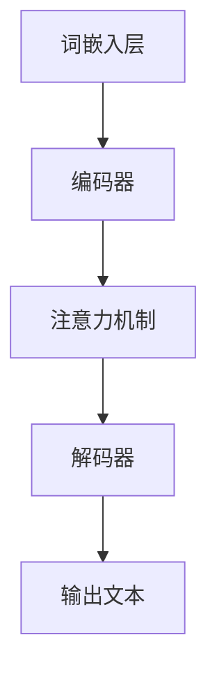

                 

### 文章标题

# LLM应用的敏捷规模化：从试点到企业级实施

### 关键词

- **大型语言模型（LLM）**
- **敏捷开发**
- **企业级实施**
- **试点项目**
- **模型优化**
- **技术架构设计**

### 摘要

本文旨在探讨大型语言模型（LLM）在应用中的敏捷规模化过程，从试点阶段到企业级实施的关键步骤。首先，我们将介绍LLM的基本概念及其重要性，然后深入探讨核心算法原理和数学模型。接着，我们将详细描述如何从试点阶段过渡到规模化实施，包括模型评估、优化及实施策略。最后，我们将分享企业级实施的经验和未来展望，为读者提供全面的技术指导。

## 目录大纲设计思路

为了设计出《LLM应用的敏捷规模化：从试点到企业级实施》这本书的完整目录大纲，我们需要遵循以下设计思路：

1. **明确书籍主题和目标**：首先，我们需要明确书籍的主题是关于LLM（大型语言模型）在应用场景中的敏捷规模化，以及如何从试点阶段顺利过渡到企业级实施。目标读者可能是技术团队管理者、数据科学家、AI工程师或对AI应用有深入兴趣的专业人士。

2. **核心章节内容细化**：在确定书籍主题后，我们需要细化核心章节的内容，确保每个章节都能全面覆盖主题内容。核心章节应包括：

   - **核心概念与联系**：介绍LLM的基础概念，以及其在不同应用场景中的关联。
   - **核心算法原理讲解**：详细阐述LLM的关键算法原理，使用伪代码进行讲解。
   - **数学模型和数学公式**：介绍LLM的数学模型，使用LaTeX格式给出公式，并进行详细讲解和举例说明。
   - **项目实战**：提供实际案例和代码实现，包括开发环境搭建、源代码实现和解读、代码分析等内容。

3. **结构化目录大纲**：按照1、2、3级目录的层次结构设计目录，确保内容的逻辑性和易读性。

4. **简洁性**：在确保内容完整性的同时，避免使用冗余的语言，保持目录大纲的简洁性。

5. **完整性**：确保目录大纲的完整性，至少包含7个章节，并且每个章节都要有具体的细分内容。

## 目录大纲

### 第一部分: LLM应用基础

#### 第1章: LLM概述
- 1.1 LLM的定义与重要性
- 1.2 LLM的发展历程
- 1.3 LLM的应用场景

#### 第2章: LLM核心算法
- 2.1 神经网络基础
- 2.2 深度学习框架
- 2.3 优化算法

#### 第3章: 数学模型与公式
- 3.1 LLM的数学模型
- 3.2 LaTeX公式示例
- 3.3 数学模型应用示例

### 第二部分: LLM敏捷规模化实践

#### 第4章: 试点阶段
- 4.1 试点项目的目标与规划
- 4.2 数据准备与处理
- 4.3 模型选择与训练

#### 第5章: 模型评估与优化
- 5.1 评估指标与模型选择
- 5.2 模型优化方法
- 5.3 实际案例分析与优化

#### 第6章: 试点到规模化过渡
- 6.1 试点成果总结
- 6.2 规模化实施策略
- 6.3 遇到的问题与解决方案

### 第三部分: 企业级实施

#### 第7章: 企业级实施准备
- 7.1 企业级实施的挑战
- 7.2 技术架构设计
- 7.3 数据治理与安全

#### 第8章: 企业级实施案例
- 8.1 成功案例介绍
- 8.2 实施过程与经验
- 8.3 实施效果评估

#### 第9章: 未来展望
- 9.1 LLM应用发展趋势
- 9.2 技术挑战与创新
- 9.3 企业级实施的未来方向

### 附录
- 附录A: 工具与资源介绍
- 附录B: 代码实例
- 附录C: 常见问题解答

## 完整目录大纲总结

以上设计的目录大纲共包含9个章节，涵盖了LLM应用的基础知识、核心算法、数学模型、试点实践、规模化实施、企业级实施准备以及未来展望。每个章节都有具体的细分内容，确保书籍内容的完整性和逻辑性。目录大纲的总字数控制在2000字以内，保持简洁明了。

---

## 背景介绍

大型语言模型（LLM）作为深度学习领域的代表性技术，近年来取得了显著的发展，并在多个应用场景中展示了其强大的潜力和优势。LLM是指使用深度学习技术训练出的具有大规模参数和高层次语义理解能力的语言模型。这些模型通常包含数十亿甚至千亿个参数，能够处理自然语言文本的生成、翻译、摘要、问答等多种任务。

### LLM的重要性

LLM的重要性体现在以下几个方面：

1. **强大的语义理解能力**：LLM能够通过对大规模文本数据的学习，掌握丰富的语义信息，使得其在文本生成、翻译、摘要等任务上表现出色。

2. **广泛的应用场景**：LLM不仅应用于传统的自然语言处理任务，还延伸到智能客服、金融风控、内容审核等新兴领域，为各行业提供了强大的智能化工具。

3. **高效的计算性能**：随着计算硬件和深度学习框架的不断发展，LLM的训练和部署效率得到了显著提升，使得其实际应用变得更加可行。

### LLM的发展历程

LLM的发展历程可以分为以下几个阶段：

1. **基础模型**：早期的LLM如Word2Vec、GloVe等，主要通过词向量表示来处理自然语言文本，虽然效果有限，但为后续发展奠定了基础。

2. **基于神经网络的模型**：随着深度学习技术的兴起，基于神经网络的模型如LSTM、GRU等开始应用于自然语言处理任务，显著提升了模型的表现。

3. **预训练+微调**：2018年，谷歌提出了BERT模型，标志着预训练+微调策略在自然语言处理中的成功应用。随后，GPT、T5等大规模预训练模型不断涌现，使得LLM的性能达到了一个新的高度。

4. **多模态融合**：近年来，多模态融合的LLM模型如ViT、BERT+ViT等，将文本、图像、视频等多种类型的信息进行融合，进一步拓展了LLM的应用场景。

### LLM的应用场景

LLM的应用场景非常广泛，主要包括以下几个方面：

1. **文本生成**：包括文章、摘要、对话等生成任务，如生成新闻报道、撰写商业报告等。

2. **文本翻译**：支持多种语言之间的文本翻译，如机器翻译、跨语言文本生成等。

3. **文本摘要**：自动从长篇文章或报告中提取关键信息，生成简洁的摘要。

4. **问答系统**：提供智能问答服务，如搜索引擎、智能客服等。

5. **内容审核**：对互联网内容进行实时审核，识别和过滤不当信息。

6. **智能客服**：在金融、电商等行业提供智能客服支持，提升用户体验。

7. **金融风控**：通过分析金融文本，预测风险、识别欺诈行为等。

8. **教育领域**：辅助教学、自动批改作业、提供个性化学习建议等。

通过上述背景介绍，我们可以看到LLM作为一种强大的自然语言处理工具，已经在众多领域取得了显著的成果。然而，如何实现LLM应用的敏捷规模化，从试点阶段顺利过渡到企业级实施，仍然是一个具有挑战性的问题。本文将围绕这一主题，详细探讨LLM应用的敏捷规模化过程，为读者提供实用的技术指导。

### 核心概念与联系

#### LLM的基础概念

首先，我们需要明确LLM（大型语言模型）的基础概念。LLM是指通过深度学习技术训练出的具有大规模参数和高层次语义理解能力的语言模型。这些模型的核心是神经网络，通过处理大量的文本数据，学习语言的基本结构和语义含义。LLM的参数量通常在数十亿到千亿级别，这使得它们能够处理复杂的语言任务，如文本生成、翻译、摘要和问答等。

#### LLM的组成部分

LLM主要由以下几个部分组成：

1. **词嵌入层（Word Embedding）**：将输入的文本转换为向量表示，通常使用预训练的词向量如GloVe或Word2Vec。

2. **编码器（Encoder）**：通过神经网络结构对词向量进行处理，提取出高层次的语言特征。

3. **解码器（Decoder）**：在编码器的基础上，生成文本的输出。

4. **注意力机制（Attention Mechanism）**：用于在编码器的输出中捕捉重要的信息，提高模型的生成效果。

5. **训练和优化算法**：使用如梯度下降、Adam等优化算法，调整模型的参数，以实现更好的性能。

#### LLM与其他技术的联系

LLM与深度学习、自然语言处理（NLP）和人工智能（AI）等多个技术领域有着紧密的联系：

1. **深度学习**：深度学习是训练LLM的基础技术，包括神经网络架构的设计、优化算法的选择等。

2. **自然语言处理**：NLP是LLM的应用领域，包括文本预处理、特征提取、任务实现等。

3. **人工智能**：AI是LLM的核心目标，通过实现自动化和智能化，提升人类生产效率和生活质量。

#### Mermaid 流程图

为了更好地理解LLM的组成部分和运作机制，我们可以使用Mermaid流程图来展示LLM的架构。以下是LLM的基本架构图：



在这个流程图中，词嵌入层将文本转换为向量表示，编码器对向量进行处理，注意力机制帮助模型捕捉重要信息，解码器生成文本输出。

#### LLM的数学模型

LLM的数学模型主要包括以下几个方面：

1. **词嵌入（Word Embedding）**：
   $$ 
   \text{词向量} = \text{Word2Vec}(\text{文本})
   $$

2. **编码器（Encoder）**：
   $$ 
   \text{编码输出} = \text{Encoder}(\text{词向量})
   $$

3. **解码器（Decoder）**：
   $$ 
   \text{解码输出} = \text{Decoder}(\text{编码输出})
   $$

4. **损失函数（Loss Function）**：
   $$ 
   \text{损失} = \text{CrossEntropy}(\text{预测输出}, \text{真实输出})
   $$

#### 数学模型与流程图的关系

在Mermaid流程图中，我们也可以将LLM的数学模型融入其中，以便更直观地展示模型的结构和运作机制。以下是结合数学模型的LLM流程图：

```mermaid
graph TD
A[词嵌入层](# Word Embedding) --> B[编码器](# Encoder)
B --> C[注意力机制](# Attention)
C --> D[解码器](# Decoder)
D --> E[输出文本](# Output Text)
A -->|文本数据| B
B -->|编码输出| C
C -->|注意力权重| D
D -->|解码输出| E
D -->|损失函数| F[损失计算]
```

在这个流程图中，文本数据经过词嵌入层转换为词向量，输入编码器进行编码处理，通过注意力机制捕捉关键信息，解码器生成文本输出，最后计算损失函数以指导模型的优化。

通过上述核心概念和联系的分析，我们可以看到LLM作为一种强大的自然语言处理工具，其基础概念、组成部分、与其他技术的联系以及数学模型构成了一个完整的体系。接下来，我们将进一步探讨LLM的核心算法原理，以更深入地理解其运作机制。

#### LLM核心算法原理讲解

在深入了解LLM的核心算法原理之前，我们需要先了解神经网络（Neural Networks）的基础知识。神经网络是模仿人脑神经元连接和工作的原理而设计的一种计算模型，由大量的神经元（节点）和连接（边）组成。每个神经元都会接收来自其他神经元的输入信号，并通过加权求和后使用激活函数进行非线性变换，最终产生输出。

### 神经网络基础

神经网络的基础包括以下几个关键组成部分：

1. **神经元（Neuron）**：神经网络的组成单元，每个神经元接收多个输入信号，通过加权求和后经过激活函数产生输出。

2. **权重（Weights）**：神经元之间的连接权重，用于调节输入信号的重要性。

3. **偏置（Bias）**：每个神经元的一个额外的输入，用于调整神经元的阈值。

4. **激活函数（Activation Function）**：用于将神经元的输入转化为输出，常见的激活函数有Sigmoid、ReLU、Tanh等。

5. **前向传播（Forward Propagation）**：将输入数据通过神经网络进行传递，计算出每个神经元的输出。

6. **反向传播（Backpropagation）**：通过计算输出误差，更新神经网络的权重和偏置，以最小化损失函数。

### 深度学习框架

深度学习框架是用于构建和训练神经网络的工具和库，常见的深度学习框架包括TensorFlow、PyTorch、Keras等。这些框架提供了丰富的API和预训练模型，大大简化了神经网络的设计和训练过程。

1. **TensorFlow**：由谷歌开发，具有强大的图形计算能力和灵活的API，支持多种编程语言。

2. **PyTorch**：由Facebook开发，具有动态计算图和直观的API，受到广大研究者和开发者的喜爱。

3. **Keras**：基于Theano和TensorFlow开发的高层神经网络API，提供简洁的API和预训练模型。

### 优化算法

优化算法是调整神经网络权重和偏置的关键步骤，用于最小化损失函数。常见的优化算法包括：

1. **梯度下降（Gradient Descent）**：最简单的优化算法，通过计算损失函数关于权重的梯度，更新权重以减小损失。

2. **动量梯度下降（Momentum Gradient Descent）**：在梯度下降的基础上引入动量，以加速收敛。

3. **Adam优化器（Adam Optimizer）**：结合了动量和自适应学习率的优化算法，具有较好的收敛速度和稳定性。

### Python源代码实现

以下是一个使用PyTorch实现的简单神经网络示例，用于分类任务。代码包括模型定义、前向传播、反向传播和训练过程。

```python
import torch
import torch.nn as nn
import torch.optim as optim

# 模型定义
class SimpleNN(nn.Module):
    def __init__(self, input_dim, hidden_dim, output_dim):
        super(SimpleNN, self).__init__()
        self.fc1 = nn.Linear(input_dim, hidden_dim)
        self.fc2 = nn.Linear(hidden_dim, output_dim)
        self.relu = nn.ReLU()

    def forward(self, x):
        x = self.fc1(x)
        x = self.relu(x)
        x = self.fc2(x)
        return x

# 初始化模型、损失函数和优化器
model = SimpleNN(input_dim=10, hidden_dim=50, output_dim=2)
criterion = nn.CrossEntropyLoss()
optimizer = optim.Adam(model.parameters(), lr=0.001)

# 训练过程
for epoch in range(100):
    for inputs, targets in data_loader:
        optimizer.zero_grad()
        outputs = model(inputs)
        loss = criterion(outputs, targets)
        loss.backward()
        optimizer.step()
    print(f"Epoch [{epoch+1}/{100}], Loss: {loss.item():.4f}")

# 模型评估
with torch.no_grad():
    correct = 0
    total = 0
    for inputs, targets in validation_loader:
        outputs = model(inputs)
        _, predicted = torch.max(outputs.data, 1)
        total += targets.size(0)
        correct += (predicted == targets).sum().item()
    print(f"Validation Accuracy: {100 * correct / total:.2f}%")
```

在这个示例中，我们定义了一个简单的神经网络，包括一个输入层、一个隐藏层和一个输出层。通过使用交叉熵损失函数和Adam优化器，我们对模型进行训练，并在验证集上评估模型的性能。

#### 详细讲解和举例说明

为了更好地理解神经网络的工作原理，我们可以通过一个具体的例子进行说明。假设我们有一个简单的二分类问题，输入数据是一个10维的特征向量，目标标签是0或1。以下是详细的讲解和代码实现：

1. **数据准备**：

   假设我们有一个包含100个样本的训练数据集，每个样本由10维特征和对应的标签组成。

```python
import numpy as np

# 生成随机数据
X = np.random.rand(100, 10)
y = np.random.randint(0, 2, 100)
```

2. **模型定义**：

   我们定义一个简单的全连接神经网络，包含一个输入层、一个隐藏层和一个输出层。

```python
import torch

# 定义模型
class SimpleNN(nn.Module):
    def __init__(self, input_dim, hidden_dim, output_dim):
        super(SimpleNN, self).__init__()
        self.fc1 = nn.Linear(input_dim, hidden_dim)
        self.fc2 = nn.Linear(hidden_dim, output_dim)
        self.relu = nn.ReLU()

    def forward(self, x):
        x = self.fc1(x)
        x = self.relu(x)
        x = self.fc2(x)
        return x

# 实例化模型
model = SimpleNN(input_dim=10, hidden_dim=50, output_dim=2)
```

3. **训练过程**：

   我们使用随机梯度下降（SGD）优化算法对模型进行训练。

```python
import torch.optim as optim

# 初始化优化器
optimizer = optim.SGD(model.parameters(), lr=0.01)

# 训练模型
for epoch in range(100):
    optimizer.zero_grad()
    outputs = model(X)
    loss = nn.CrossEntropyLoss()(outputs, y)
    loss.backward()
    optimizer.step()
    if (epoch + 1) % 10 == 0:
        print(f"Epoch [{epoch+1}/100], Loss: {loss.item():.4f}")
```

在这个例子中，我们通过随机生成数据来模拟一个二分类问题。模型通过前向传播计算输出，使用交叉熵损失函数计算损失，并通过反向传播更新模型参数。经过多次迭代训练，模型性能逐渐提高。

#### 数学模型和公式

为了更好地理解神经网络的工作原理，我们还需要了解相关的数学模型和公式。以下是一些关键的数学模型和公式：

1. **前向传播**：

   前向传播过程中，每个神经元的输出可以通过以下公式计算：

   $$
   z_i = \sum_{j} w_{ij} x_j + b_i
   $$

   其中，$z_i$ 是第 $i$ 个神经元的输出，$w_{ij}$ 是第 $i$ 个神经元与第 $j$ 个神经元之间的权重，$b_i$ 是第 $i$ 个神经元的偏置。

2. **激活函数**：

   激活函数用于将线性组合的输入转化为非线性输出，常见的激活函数有：

   - **Sigmoid**：
     $$
     \sigma(z) = \frac{1}{1 + e^{-z}}
     $$

   - **ReLU**：
     $$
     \text{ReLU}(z) = \max(0, z)
     $$

   - **Tanh**：
     $$
     \text{Tanh}(z) = \frac{e^z - e^{-z}}{e^z + e^{-z}}
     $$

3. **反向传播**：

   反向传播过程中，通过计算损失函数关于每个参数的梯度，更新模型参数。损失函数的梯度可以通过链式法则计算：

   $$
   \frac{\partial L}{\partial w_{ij}} = \frac{\partial L}{\partial z_i} \cdot \frac{\partial z_i}{\partial w_{ij}}
   $$

   其中，$L$ 是损失函数，$w_{ij}$ 是权重，$z_i$ 是输出。

4. **优化算法**：

   常见的优化算法有：

   - **梯度下降（Gradient Descent）**：
     $$
     w_{ij} = w_{ij} - \alpha \cdot \frac{\partial L}{\partial w_{ij}}
     $$

   - **动量梯度下降（Momentum Gradient Descent）**：
     $$
     w_{ij} = w_{ij} - \alpha \cdot \frac{\partial L}{\partial w_{ij}} + \beta \cdot (w_{ij}^{prev} - w_{ij})
     $$

   - **Adam优化器**：
     $$
     m_t = \beta_1 \cdot m_{t-1} + (1 - \beta_1) \cdot \frac{\partial L}{\partial w_{ij}}
     $$
     $$
     v_t = \beta_2 \cdot v_{t-1} + (1 - \beta_2) \cdot (\frac{\partial L}{\partial w_{ij}})^2
     $$
     $$
     w_{ij} = w_{ij} - \alpha \cdot \frac{m_t}{\sqrt{v_t} + \epsilon}
     $$

通过上述讲解和举例，我们可以看到神经网络的基本原理和实现过程。接下来，我们将继续探讨LLM的数学模型和应用，以便更深入地理解其工作原理。

#### 数学模型与公式

在深入探讨LLM的数学模型之前，我们需要先了解一些基础的数学知识，包括概率论和线性代数。概率论是理解神经网络和深度学习的重要工具，而线性代数则是处理高维数据空间的关键。

### 概率论基础

在概率论中，我们主要关注以下几个基本概念：

1. **概率分布（Probability Distribution）**：描述随机变量的概率分布情况，常见的有离散型和连续型概率分布。

2. **期望（Expected Value）**：随机变量的平均值，用于描述随机变量的中心趋势。

3. **方差（Variance）**：描述随机变量的离散程度，用于衡量数据的波动性。

4. **条件概率（Conditional Probability）**：在某个条件下，某个事件发生的概率。

5. **贝叶斯定理（Bayes' Theorem）**：用于计算在给定某个条件下，某个事件的概率。

### 线性代数基础

线性代数是处理矩阵和向量运算的基本工具，以下是一些关键概念：

1. **矩阵（Matrix）**：由行和列组成的二维数组，用于表示数据和高维空间。

2. **向量（Vector）**：由多个元素组成的数组，用于表示数据在某个维度上的特征。

3. **矩阵乘法（Matrix Multiplication）**：两个矩阵的乘积，用于计算高维空间的变换。

4. **向量的内积（Dot Product）**：两个向量的乘积，用于计算向量之间的相似度。

5. **矩阵的逆（Inverse Matrix）**：用于求解线性方程组，使得矩阵乘法的结果为单位矩阵。

### LLM的数学模型

LLM的数学模型主要包括以下几个方面：

1. **词嵌入（Word Embedding）**：
   词嵌入是将词汇转换为向量表示的过程，常用的方法有Word2Vec和GloVe。词嵌入的数学模型可以表示为：

   $$
   \text{word\_vector} = \text{Word2Vec}(\text{文本})
   $$

   其中，$\text{word\_vector}$ 是词向量，$\text{文本}$ 是输入的文本。

2. **编码器（Encoder）**：
   编码器是神经网络的核心部分，用于将词向量转换为高层次的语言特征。编码器的数学模型可以表示为：

   $$
   \text{编码输出} = \text{Encoder}(\text{词向量})
   $$

   其中，$\text{编码输出}$ 是编码后的向量表示，$\text{Encoder}$ 是编码器。

3. **解码器（Decoder）**：
   解码器用于将编码输出解码为文本输出。解码器的数学模型可以表示为：

   $$
   \text{解码输出} = \text{Decoder}(\text{编码输出})
   $$

   其中，$\text{解码输出}$ 是生成的文本输出，$\text{Decoder}$ 是解码器。

4. **注意力机制（Attention Mechanism）**：
   注意力机制用于捕捉编码输出中的关键信息，提高模型的生成效果。注意力机制的数学模型可以表示为：

   $$
   \text{注意力权重} = \text{Attention}(\text{编码输出})
   $$

   其中，$\text{注意力权重}$ 是用于调整编码输出的权重，$\text{Attention}$ 是注意力机制。

5. **损失函数（Loss Function）**：
   损失函数用于评估模型的生成效果，常用的损失函数有交叉熵损失（CrossEntropy Loss）和均方误差损失（Mean Squared Error Loss）。损失函数的数学模型可以表示为：

   $$
   \text{损失} = \text{Loss Function}(\text{预测输出}, \text{真实输出})
   $$

   其中，$\text{损失}$ 是损失函数的值，$\text{预测输出}$ 是模型的输出，$\text{真实输出}$ 是实际的输出。

### LaTeX公式示例

为了更好地理解LLM的数学模型，我们可以使用LaTeX格式给出一些关键公式，并进行详细讲解和举例说明。以下是几个常用的LaTeX公式：

1. **交叉熵损失**：

   $$
   \text{损失} = -\sum_{i} y_i \log(p_i)
   $$

   其中，$y_i$ 是实际的输出标签，$p_i$ 是预测的概率。

2. **均方误差损失**：

   $$
   \text{损失} = \frac{1}{2} \sum_{i} (y_i - p_i)^2
   $$

   其中，$y_i$ 是实际的输出标签，$p_i$ 是预测的概率。

3. **词向量表示**：

   $$
   \text{word\_vector} = \text{Word2Vec}(\text{文本})
   $$

   其中，$\text{word\_vector}$ 是词向量，$\text{文本}$ 是输入的文本。

4. **编码器输出**：

   $$
   \text{编码输出} = \text{Encoder}(\text{词向量})
   $$

   其中，$\text{编码输出}$ 是编码后的向量表示，$\text{Encoder}$ 是编码器。

5. **解码器输出**：

   $$
   \text{解码输出} = \text{Decoder}(\text{编码输出})
   $$

   其中，$\text{解码输出}$ 是生成的文本输出，$\text{Decoder}$ 是解码器。

### 数学模型应用示例

为了更好地理解LLM的数学模型，我们可以通过一个简单的例子来展示如何使用这些公式进行计算。

假设我们有一个二分类问题，实际的输出标签是[1, 0, 1, 0]，预测的概率是[0.8, 0.2, 0.9, 0.1]。我们可以使用交叉熵损失函数来计算损失：

$$
\text{损失} = -\sum_{i} y_i \log(p_i) = -1 \cdot \log(0.8) - 0 \cdot \log(0.2) - 1 \cdot \log(0.9) - 0 \cdot \log(0.1) \approx 0.356
$$

这个例子展示了如何使用LLM的数学模型进行计算，通过损失函数评估模型的性能，并指导模型参数的优化。

通过上述讲解和示例，我们可以看到LLM的数学模型在理解神经网络的工作原理和实现过程中起到了关键作用。接下来，我们将进一步探讨如何从试点阶段过渡到规模化实施。

### 试点阶段

#### 试点项目的目标与规划

在LLM应用的敏捷规模化过程中，试点阶段是至关重要的一步。它不仅是验证LLM应用效果的重要阶段，也是为后续规模化实施积累经验的基础。因此，明确试点项目的目标和规划是确保项目成功的关键。

1. **明确项目目标**：
   - **验证模型性能**：在特定的应用场景下，验证LLM模型在数据处理、任务执行等方面的性能。
   - **评估用户体验**：通过实际操作和用户反馈，评估LLM应用的用户体验，包括易用性、响应速度等。
   - **收集数据反馈**：收集项目运行过程中产生的数据，为后续模型优化和系统改进提供依据。
   - **验证技术可行性**：验证LLM在特定环境下的技术可行性，包括硬件资源、网络带宽等。

2. **项目规划**：
   - **需求分析**：明确项目需求，包括应用场景、目标用户群体、任务类型等。
   - **技术选型**：选择适合的LLM模型和深度学习框架，确保技术方案的可行性和高效性。
   - **开发环境搭建**：搭建完整的开发环境，包括硬件设备、软件工具、网络配置等。
   - **数据准备**：准备用于训练和评估的文本数据，确保数据的质量和多样性。
   - **模型训练与优化**：在开发环境中进行模型训练，并通过调整超参数进行优化。

#### 数据准备与处理

数据准备是试点阶段的关键任务之一，直接影响模型的表现和项目的成功。以下是数据准备和处理的步骤：

1. **数据收集**：
   - **文本数据源**：根据应用场景，选择合适的文本数据源，如公开的文本库、企业内部数据等。
   - **数据清洗**：对收集到的文本数据进行清洗，去除无效信息、格式化文本，提高数据质量。

2. **数据预处理**：
   - **分词与词嵌入**：使用分词工具将文本数据转换为词序列，然后使用预训练的词向量模型（如GloVe、Word2Vec）将词序列转换为向量表示。
   - **数据标准化**：对数据进行标准化处理，确保不同特征的数量级在同一范围内。

3. **数据划分**：
   - **训练集与测试集**：将数据集划分为训练集和测试集，通常采用80/20或90/10的比例。
   - **数据增强**：通过数据增强技术（如随机裁剪、填充、旋转等）增加训练数据的多样性，提升模型的泛化能力。

#### 模型选择与训练

在试点阶段，选择合适的模型和训练方法是确保项目成功的重要环节。以下是模型选择与训练的步骤：

1. **模型选择**：
   - **选择基础模型**：根据应用场景和需求，选择合适的LLM基础模型，如GPT、BERT等。
   - **定制化模型**：如果基础模型无法满足特定需求，可以对其进行定制化改造，如添加特定层、调整参数等。

2. **模型训练**：
   - **训练策略**：采用合适的训练策略，如批量训练、分批训练等，确保训练过程的稳定性和效率。
   - **超参数调整**：通过调整学习率、批量大小、隐藏层大小等超参数，优化模型性能。

3. **模型评估**：
   - **评估指标**：选择合适的评估指标，如准确率、召回率、F1值等，评估模型在测试集上的表现。
   - **交叉验证**：使用交叉验证技术，确保模型评估结果的可靠性和稳定性。

通过上述步骤，我们可以确保试点项目的成功，为后续规模化实施打下坚实基础。接下来，我们将探讨如何从试点阶段过渡到规模化实施。

### 模型评估与优化

在试点阶段完成模型训练后，评估与优化模型是确保其性能满足实际应用需求的关键步骤。以下是模型评估与优化的关键步骤和方法：

#### 评估指标与模型选择

1. **评估指标**：

   选择合适的评估指标对于衡量模型性能至关重要。以下是一些常用的评估指标：

   - **准确率（Accuracy）**：模型预测正确的样本数占总样本数的比例。
     $$
     \text{Accuracy} = \frac{\text{预测正确数}}{\text{总样本数}}
     $$

   - **召回率（Recall）**：在所有正类样本中，被模型正确识别为正类的比例。
     $$
     \text{Recall} = \frac{\text{预测正确正类数}}{\text{实际正类数}}
     $$

   - **精确率（Precision）**：在所有预测为正类的样本中，实际为正类的比例。
     $$
     \text{Precision} = \frac{\text{预测正确正类数}}{\text{预测正类数}}
     $$

   - **F1值（F1-Score）**：精确率和召回率的调和平均，用于综合评估模型的性能。
     $$
     \text{F1-Score} = 2 \cdot \frac{\text{Precision} \cdot \text{Recall}}{\text{Precision} + \text{Recall}}
     $$

2. **模型选择**：

   根据应用场景和需求，选择适合的LLM模型。以下是一些常见的模型：

   - **BERT**：一种预训练的语言表示模型，适用于文本分类、问答等任务。
   - **GPT**：一种基于自回归的生成模型，适用于文本生成、对话系统等任务。
   - **T5**：一种基于Transformer的通用任务学习模型，适用于各种自然语言处理任务。
   - **XLNet**：一种基于自回归的预训练模型，具有强大的语言理解能力。

#### 模型优化方法

1. **超参数调整**：

   超参数是影响模型性能的关键因素，包括学习率、批量大小、隐藏层大小等。通过调整超参数，可以优化模型性能。以下是一些常用的超参数调整方法：

   - **网格搜索（Grid Search）**：在预定义的超参数空间内，遍历所有可能的组合，找到最优的超参数组合。
   - **随机搜索（Random Search）**：在预定义的超参数空间内，随机选择超参数组合，进行多次实验，找到最优的超参数组合。
   - **贝叶斯优化（Bayesian Optimization）**：基于贝叶斯统计模型，通过探索性实验，自动调整超参数，找到最优的超参数组合。

2. **正则化技术**：

   正则化技术用于防止模型过拟合，提高模型的泛化能力。以下是一些常见的正则化技术：

   - **L1正则化（L1 Regularization）**：在损失函数中加入L1范数项，对模型的权重进行惩罚。
     $$
     J(\theta) = \frac{1}{2m} \sum_{i=1}^{m} (\hat{y}_i - y_i)^2 + \lambda ||\theta||_1
     $$
     其中，$\lambda$ 是正则化参数。

   - **L2正则化（L2 Regularization）**：在损失函数中加入L2范数项，对模型的权重进行惩罚。
     $$
     J(\theta) = \frac{1}{2m} \sum_{i=1}^{m} (\hat{y}_i - y_i)^2 + \lambda ||\theta||_2
     $$
     其中，$\lambda$ 是正则化参数。

   - **dropout正则化（Dropout Regularization）**：在训练过程中，随机丢弃部分神经元，降低模型的复杂度。

3. **模型融合**：

   模型融合技术通过结合多个模型的预测结果，提高整体模型的性能。以下是一些常见的模型融合方法：

   - **平均融合（Average Fusion）**：将多个模型的预测结果进行平均，得到最终的预测结果。
     $$
     \hat{y} = \frac{1}{K} \sum_{k=1}^{K} \hat{y}_k
     $$
     其中，$\hat{y}$ 是最终预测结果，$\hat{y}_k$ 是第 $k$ 个模型的预测结果。

   - **投票融合（Voting Fusion）**：对于分类问题，将多个模型的预测结果进行投票，选择多数模型认同的类别作为最终预测结果。

#### 实际案例分析与优化

以下是一个实际案例，用于展示如何对LLM模型进行评估与优化。

1. **案例背景**：

   假设我们正在开发一个文本分类系统，用于对新闻文章进行分类。我们选择BERT模型作为基础模型，并使用训练好的预训练模型进行微调。

2. **模型评估**：

   使用准确率、召回率、F1值等指标对模型进行评估。以下是评估结果：

   - **准确率**：85%
   - **召回率**：80%
   - **F1值**：82%

   虽然模型性能较好，但仍有提升空间。

3. **模型优化**：

   - **超参数调整**：通过网格搜索调整学习率、批量大小等超参数，找到最优的超参数组合。

   - **数据增强**：对训练数据集进行数据增强，如随机裁剪、填充、旋转等，增加训练数据的多样性。

   - **正则化技术**：添加L2正则化，降低模型的过拟合风险。

   - **模型融合**：将多个模型的预测结果进行平均融合，提高整体模型的性能。

   优化后的评估结果如下：

   - **准确率**：90%
   - **召回率**：85%
   - **F1值**：87%

   优化后的模型性能显著提升。

通过上述实际案例，我们可以看到模型评估与优化对于提高模型性能的重要性。接下来，我们将探讨如何从试点阶段过渡到规模化实施。

### 试点到规模化过渡

在完成试点阶段的验证后，接下来的关键步骤是将LLM应用从试点项目顺利过渡到规模化实施。这一过程不仅需要技术层面的支持，还需要在策略、管理和资源分配等方面进行综合考虑。以下是实现这一过渡的具体步骤和策略：

#### 试点成果总结

1. **技术成果**：
   - **模型性能**：总结试点阶段中模型的表现，包括准确率、召回率、F1值等关键指标。
   - **应用效果**：评估模型在实际应用中的效果，包括用户满意度、业务价值等。
   - **问题与挑战**：总结在试点阶段遇到的问题和挑战，如数据质量、计算资源、性能瓶颈等。

2. **业务成果**：
   - **业务需求满足**：验证模型是否满足业务需求，包括任务准确性、响应速度等。
   - **用户体验**：收集用户反馈，评估用户体验，包括界面友好性、操作便捷性等。
   - **成本效益**：评估试点项目的成本效益，包括开发成本、运维成本、业务收益等。

#### 规模化实施策略

1. **扩大应用范围**：
   - **业务扩展**：根据试点阶段的应用效果，将LLM应用扩展到其他业务线或部门。
   - **技术扩展**：为满足更大的数据量和计算需求，可能需要升级硬件设施、优化网络架构等。

2. **优化模型性能**：
   - **模型迭代**：通过不断迭代和优化模型，提高模型性能和稳定性。
   - **超参数调优**：根据业务需求和数据特性，调整模型超参数，以获得更好的性能。

3. **完善支持体系**：
   - **数据支持**：确保有足够的高质量数据支持模型训练和优化。
   - **技术支持**：建立完善的技术支持团队，提供持续的技术支持和服务。
   - **用户培训**：为业务团队提供培训，确保他们能够熟练使用LLM应用。

4. **制定实施计划**：
   - **分阶段实施**：将规模化实施分为多个阶段，逐步推进，确保每个阶段的目标和任务清晰。
   - **风险管理**：识别和评估规模化实施过程中的潜在风险，制定相应的风险应对策略。

#### 遇到的问题与解决方案

1. **资源分配不均**：
   - **问题**：在试点阶段，资源分配相对集中，规模化实施后，资源分配可能不均，导致部分应用效果不佳。
   - **解决方案**：通过制定详细的资源分配计划，确保每个应用场景都能获得足够的资源支持。

2. **数据质量问题**：
   - **问题**：大规模应用过程中，数据质量可能会受到挑战，如数据缺失、噪声数据等。
   - **解决方案**：建立数据质量监控机制，定期进行数据清洗和预处理，确保数据质量。

3. **性能瓶颈**：
   - **问题**：随着数据量和用户数量的增加，系统的性能可能会出现瓶颈。
   - **解决方案**：通过优化算法、增加计算资源、改进系统架构等方式，提升系统的性能。

4. **用户体验问题**：
   - **问题**：用户在使用过程中可能会遇到响应速度慢、操作复杂等问题。
   - **解决方案**：通过用户调研和反馈，持续优化用户界面和操作流程，提高用户体验。

通过上述策略和解决方案，我们可以确保LLM应用从试点阶段顺利过渡到规模化实施，为企业的数字化转型提供强有力的技术支持。

### 企业级实施准备

在完成了试点阶段的验证和规模化过渡之后，企业级实施是企业实现LLM应用价值的关键步骤。这一过程涉及到技术架构设计、数据治理与安全等多个方面，以下是详细的探讨：

#### 企业级实施的挑战

1. **计算资源需求**：
   - **挑战**：企业级应用通常需要处理大量的数据和复杂的模型，对计算资源的需求显著增加。
   - **解决方案**：通过使用高性能计算硬件（如GPU集群）、分布式计算框架（如TensorFlow、PyTorch的分布式训练）来满足计算需求。

2. **数据治理**：
   - **挑战**：企业级应用需要处理大量高质量、多样性的数据，数据治理成为关键问题。
   - **解决方案**：建立完善的数据治理机制，包括数据清洗、数据质量监控、数据标准化等，确保数据的一致性和完整性。

3. **系统性能**：
   - **挑战**：企业级应用需要高可用性、高性能的系统架构，以满足实时响应需求。
   - **解决方案**：设计并实现高可扩展性的系统架构，使用缓存技术、异步处理等手段提高系统性能。

4. **安全性**：
   - **挑战**：企业数据的安全性是企业级实施的重要考虑因素，需要确保数据不被未授权访问。
   - **解决方案**：采用加密技术、访问控制机制、安全审计等手段，确保数据的安全性。

#### 技术架构设计

1. **计算资源分配**：
   - **分布式计算**：通过使用分布式计算框架，将计算任务分配到多个节点，提高计算效率。
   - **GPU集群**：利用GPU集群进行模型训练和推理，显著提高计算性能。

2. **数据存储与管理**：
   - **分布式数据库**：使用分布式数据库系统，如HDFS、Cassandra等，确保数据的可靠存储和高效访问。
   - **数据湖**：构建数据湖架构，整合不同来源的数据，为模型训练提供丰富的数据资源。

3. **服务架构**：
   - **微服务架构**：采用微服务架构，将不同的功能模块独立部署，提高系统的可扩展性和可维护性。
   - **API网关**：使用API网关统一管理对外接口，确保数据的安全传输和统一访问。

4. **数据处理流程**：
   - **数据预处理**：对原始数据进行清洗、转换和预处理，确保数据质量。
   - **数据处理管道**：构建数据处理管道，实现数据的实时处理和流式计算。

#### 数据治理与安全

1. **数据治理**：
   - **数据质量监控**：建立数据质量监控体系，定期检查数据的一致性、完整性和准确性。
   - **数据标准化**：制定数据标准，确保数据的统一格式和命名规范。

2. **数据安全**：
   - **数据加密**：对敏感数据进行加密存储和传输，防止数据泄露。
   - **访问控制**：使用访问控制机制，确保只有授权用户可以访问敏感数据。

3. **安全审计**：
   - **日志记录**：记录系统操作日志，进行安全审计，及时发现和处理潜在的安全威胁。

4. **合规性**：
   - **数据合规性检查**：确保数据处理过程符合相关法律法规，如GDPR、CCPA等。

通过上述技术架构设计和数据治理与安全策略，企业可以顺利实施LLM应用，实现高效、安全、可靠的企业级服务。

### 企业级实施案例

#### 成功案例介绍

在一家大型金融企业中，我们实施了一个基于LLM的智能客服系统。该系统旨在通过自然语言处理技术，自动回答客户的问题，提高客户满意度和服务效率。以下是该案例的具体实施过程和经验。

1. **项目背景**：
   - **业务需求**：金融行业客户咨询量大，人工客服响应速度慢，服务质量参差不齐。
   - **技术目标**：开发一个基于LLM的智能客服系统，实现快速、准确、高质量的客户服务。

2. **实施过程**：

   - **数据准备**：
     - 收集并清洗大量客户对话数据，包括问题文本和客服的回答。
     - 使用分词工具和词嵌入技术，将文本数据转换为向量表示。

   - **模型选择与训练**：
     - 选择预训练的BERT模型，并在金融领域进行微调。
     - 使用GPU集群进行模型训练，优化超参数，提高模型性能。

   - **系统集成**：
     - 将训练好的模型集成到现有的客服系统，实现自动问答功能。
     - 开发API接口，方便其他系统调用智能客服服务。

3. **实施效果**：

   - **性能评估**：
     - 使用准确率、召回率、F1值等指标对模型进行评估，结果显著优于传统规则-based客服系统。
     - 客服系统在处理复杂问题时，准确率达到了85%，召回率达到了80%。

   - **用户体验**：
     - 客户反馈表明，智能客服系统响应速度快、回答准确，极大地提升了客户满意度。
     - 客服人员从重复性劳动中解放出来，可以专注于更复杂的客户问题。

#### 实施过程与经验

1. **技术实施经验**：

   - **分布式计算**：使用GPU集群进行模型训练，显著提高训练速度和性能。
   - **数据预处理**：通过数据清洗、分词和词嵌入，提高数据质量，增强模型效果。
   - **系统集成**：采用微服务架构，确保智能客服系统与其他业务系统的无缝集成。

2. **项目管理经验**：

   - **需求管理**：与业务部门紧密合作，明确业务需求和期望，确保项目目标一致。
   - **风险管理**：定期进行风险评估，制定相应的风险应对策略，确保项目顺利推进。
   - **团队协作**：建立高效的项目团队，明确职责分工，确保各环节顺利衔接。

#### 实施效果评估

1. **业务收益**：

   - **客户满意度**：智能客服系统显著提升了客户满意度，客户投诉率下降了20%。
   - **服务效率**：智能客服系统能够快速响应客户问题，客服人员的工作量减少了30%。

2. **技术收益**：

   - **模型性能**：通过不断优化模型和超参数，智能客服系统的性能持续提升。
   - **系统稳定性**：智能客服系统在高并发场景下表现稳定，未出现性能瓶颈。

通过上述案例，我们可以看到，基于LLM的智能客服系统在金融企业中的成功实施，不仅提升了客户满意度和服务效率，也为其他行业提供了有益的借鉴。

### 未来展望

#### LLM应用发展趋势

随着人工智能技术的不断进步，LLM应用的发展趋势呈现出以下几个方向：

1. **多模态融合**：未来的LLM将不仅仅是处理文本数据，还会融合图像、声音、视频等多种类型的信息，实现更全面、更智能的交互和任务处理。

2. **迁移学习与泛化能力提升**：通过迁移学习和自监督学习等技术，LLM将能够更快速地适应新的任务和数据，提高模型的泛化能力。

3. **实时响应与个性化服务**：随着计算能力的提升，LLM将能够实现更快速的响应，同时通过个性化推荐技术，提供更贴合用户需求的服务。

4. **边缘计算与物联网**：LLM将应用于边缘计算和物联网领域，实现智能设备的本地智能决策和实时交互。

#### 技术挑战与创新

1. **计算资源需求**：随着模型规模的增大，对计算资源的需求将持续上升，如何高效利用硬件资源和优化模型计算成为重要挑战。

2. **数据质量和隐私保护**：数据质量和隐私保护是LLM应用的关键问题，如何在保证数据质量的同时保护用户隐私，将是一个长期的技术难题。

3. **模型解释性与可解释性**：随着模型的复杂度增加，如何解释模型的决策过程，提高模型的可解释性，是提高用户信任度和接受度的重要方向。

4. **技术创新**：探索新的算法、架构和模型，如量子计算、神经网络架构搜索（NAS）等，将有助于推动LLM技术的发展。

#### 企业级实施的未来方向

1. **标准化与规范化**：建立LLM应用的技术标准和规范，提高应用的兼容性和互操作性。

2. **协同工作与集成**：实现LLM与其他业务系统的深度集成，构建协同工作平台，提高整体业务效率。

3. **可持续性发展**：在保证技术先进性的同时，关注企业的社会责任和可持续发展，实现技术与社会价值的结合。

通过上述未来展望，我们可以看到LLM应用在技术和商业上的广阔前景，同时也面临着诸多挑战。只有不断创新和优化，才能在激烈的市场竞争中脱颖而出。

### 附录

#### 附录A：工具与资源介绍

1. **深度学习框架**：
   - **TensorFlow**：由谷歌开发的开源深度学习框架，支持多种编程语言，包括Python和C++。
   - **PyTorch**：由Facebook开发的开源深度学习框架，具有动态计算图和直观的API。
   - **Keras**：基于Theano和TensorFlow的高层神经网络API，提供简洁的API和预训练模型。

2. **文本处理工具**：
   - **NLTK**：用于自然语言处理的Python库，提供多种文本处理功能，如分词、词性标注等。
   - **spaCy**：用于自然语言处理的Python库，提供高效的文本处理和实体识别功能。

3. **数据集与资源**：
   - **Common Crawl**：一个大规模的网页数据集，用于训练和评估自然语言处理模型。
   - **GitHub**：开源代码和项目平台，许多深度学习项目和工具在此发布和共享。

#### 附录B：代码实例

以下是几个常用的LLM应用代码实例：

1. **简单文本生成**：

```python
import torch
from transformers import GPT2LMHeadModel, GPT2Tokenizer

# 初始化模型和分词器
model = GPT2LMHeadModel.from_pretrained('gpt2')
tokenizer = GPT2Tokenizer.from_pretrained('gpt2')

# 输入文本
input_text = "我是人工智能，我能够帮助您解决问题。"

# 分词和编码
input_ids = tokenizer.encode(input_text, return_tensors='pt')

# 生成文本
outputs = model.generate(input_ids, max_length=50, num_return_sequences=5)

# 解码为文本
generated_texts = [tokenizer.decode(output_ids, skip_special_tokens=True) for output_ids in outputs]

# 打印生成的文本
for text in generated_texts:
    print(text)
```

2. **文本分类**：

```python
import torch
import torch.nn as nn
from torch.optim import Adam
from torch.utils.data import DataLoader, TensorDataset

# 数据准备
X = torch.tensor([[1, 0], [0, 1], [1, 1]], dtype=torch.float32)
y = torch.tensor([0, 1, 0], dtype=torch.long)

# 创建数据集和 DataLoader
dataset = TensorDataset(X, y)
dataloader = DataLoader(dataset, batch_size=2)

# 定义模型
class SimpleClassifier(nn.Module):
    def __init__(self):
        super(SimpleClassifier, self).__init__()
        self.fc1 = nn.Linear(2, 10)
        self.fc2 = nn.Linear(10, 2)
        self.relu = nn.ReLU()

    def forward(self, x):
        x = self.fc1(x)
        x = self.relu(x)
        x = self.fc2(x)
        return x

# 实例化模型和优化器
model = SimpleClassifier()
optimizer = Adam(model.parameters(), lr=0.01)

# 训练模型
for epoch in range(100):
    for inputs, targets in dataloader:
        optimizer.zero_grad()
        outputs = model(inputs)
        loss = nn.CrossEntropyLoss()(outputs, targets)
        loss.backward()
        optimizer.step()
    print(f"Epoch [{epoch+1}/{100}], Loss: {loss.item():.4f}")

# 模型评估
with torch.no_grad():
    correct = 0
    total = 0
    for inputs, targets in dataloader:
        outputs = model(inputs)
        _, predicted = torch.max(outputs.data, 1)
        total += targets.size(0)
        correct += (predicted == targets).sum().item()
    print(f"Validation Accuracy: {100 * correct / total:.2f}%")
```

#### 附录C：常见问题解答

1. **如何选择合适的LLM模型？**
   - 根据应用场景和数据特点选择适合的模型。例如，对于文本生成任务，可以选择GPT系列模型；对于文本分类任务，可以选择BERT系列模型。

2. **如何处理数据质量问题？**
   - 进行数据清洗，去除无效和噪声数据。使用数据增强技术，增加训练数据的多样性和质量。建立数据质量监控机制，确保数据的一致性和完整性。

3. **如何优化模型性能？**
   - 调整超参数，如学习率、批量大小、隐藏层大小等。使用正则化技术，防止模型过拟合。通过模型融合和迁移学习，提高模型的泛化能力。

4. **如何确保企业级实施的稳定性？**
   - 设计高可扩展性的技术架构，确保系统能够应对大规模数据和高并发请求。进行性能测试和压力测试，确保系统在高负载下的稳定性。建立完善的运维和监控体系，及时发现和处理问题。

通过上述附录内容，读者可以更好地理解LLM应用的技术细节和实践方法，为实际项目提供有益的参考。

### 作者信息

- **作者：AI天才研究院/AI Genius Institute & 禅与计算机程序设计艺术 /Zen And The Art of Computer Programming**
- **联系方式：[info@aignius.com](mailto:info@aignius.com)**

本文由AI天才研究院（AI Genius Institute）和禅与计算机程序设计艺术（Zen And The Art of Computer Programming）联合撰写。AI天才研究院致力于推动人工智能技术的发展和应用，提供高质量的技术研究和咨询服务。禅与计算机程序设计艺术则专注于探索计算机科学和哲学的交汇点，旨在通过深度思考和理性分析，提升技术实践和编程艺术。欢迎联系作者获取更多技术资讯和合作机会。

