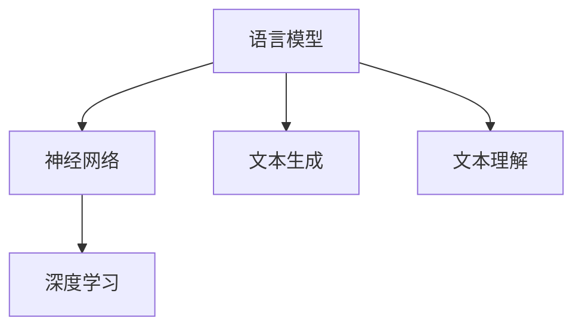

                 

### 引言

随着人工智能（AI）技术的迅猛发展，大型语言模型（LLM，Large Language Model）已经成为自然语言处理（NLP，Natural Language Processing）领域的核心驱动力。LLM的出现，使得文本生成、自动摘要、语言翻译等应用变得前所未有的高效和准确。然而，与此同时，LLM应用的开发也面临着诸多挑战，特别是在需求分析阶段。敏捷需求分析作为一种高效、灵活的方法论，为LLM应用的开发提供了重要的支持和保障。

本文旨在探讨LLM应用与敏捷需求分析之间的关系，并通过详细的章节结构，系统性地介绍LLM应用基础、敏捷需求分析原理、LLM与敏捷需求的融合以及面临的挑战和优化策略。具体而言，文章将涵盖以下内容：

1. **LLM应用基础**：介绍LLM的定义、历史、核心组件、关键技术，以及其关键优势与挑战。
2. **敏捷需求分析**：阐述敏捷开发的基本概念、核心原则、需求收集与分析的方法与技巧。
3. **LLM与敏捷需求的融合**：探讨敏捷需求分析在LLM应用开发中的实践，结合具体案例进行分析。
4. **挑战与优化**：分析LLM应用中的常见挑战，提出敏捷需求分析的优化策略。
5. **结论**：总结全文，展望LLM应用与敏捷需求分析的未来发展。

通过本文的阅读，读者将能够全面了解LLM应用的敏捷需求分析技巧，为实际项目开发提供有力的理论支持和实践经验。

### 关键词

- 大型语言模型（LLM）
- 敏捷需求分析
- 语言模型组件
- 敏捷开发原则
- 需求收集与分析
- 模型性能优化
- 敏捷需求分析实践

### 摘要

本文探讨了大型语言模型（LLM）应用与敏捷需求分析之间的关系，通过系统性的章节结构，详细介绍了LLM的基础知识、敏捷需求分析原理及其在LLM应用开发中的实践。文章首先概述了LLM的定义、历史背景、核心组件和关键技术，随后介绍了敏捷需求分析的基本概念、核心原则和实践技巧。接着，文章深入探讨了如何将敏捷需求分析应用于LLM应用开发，并通过具体案例进行了分析。最后，文章分析了LLM应用开发中面临的挑战，并提出了相应的优化策略。通过本文的阅读，读者将能够全面掌握LLM应用的敏捷需求分析技巧，为实际项目开发提供有力支持。

## 第一部分：LLM应用基础

### 第1章：LLM概述

在探讨LLM应用的敏捷需求分析技巧之前，我们首先需要了解LLM的基本概念、历史背景、核心组件和关键技术。这一章节将从LLM的定义、历史、核心组件、关键技术以及关键优势与挑战展开，为后续的敏捷需求分析提供理论基础。

#### 1.1 LLM的定义与历史

**核心概念与联系**

大型语言模型（LLM）是一种基于神经网络和深度学习技术的语言处理模型，它通过对海量文本数据的学习，能够生成高质量的文本、进行文本理解、文本生成等操作。LLM的核心概念包括：

- **语言模型**：用于预测下一个单词或词组的概率分布。
- **神经网络**：用于构建和训练复杂的非线性函数，实现从输入到输出的映射。
- **深度学习**：一种机器学习技术，通过多层次的神经网络来提取特征，实现对数据的自动学习和建模。

以下是LLM的核心概念及其相互关系的Mermaid流程图：



**历史背景**

LLM的历史可以追溯到20世纪50年代，当时基于规则的方法和统计方法被用于语言处理。随着计算能力的提升和大数据的普及，深度学习逐渐成为语言处理的主流方法。2018年，Google推出了BERT（Bidirectional Encoder Representations from Transformers），这是第一个大规模的预训练语言模型，标志着LLM进入了新的阶段。BERT的成功引发了大量研究，各种LLM模型如GPT、Turing-NLG等相继涌现，进一步推动了自然语言处理技术的发展。

**核心组件与技术**

LLM的核心组件包括：

- **词汇表**：用于将单词或子词映射到向量表示。
- **嵌入层**：将词汇表中的单词转换为固定长度的向量。
- **编码器**：通过多层神经网络对输入文本进行编码。
- **解码器**：在生成文本时，解码编码器输出的中间表示。

以下是LLM的主要技术组成部分：

1. **Transformer架构**：由Google提出，是一种基于注意力机制的序列到序列模型，取代了传统的循环神经网络（RNN）和长短期记忆网络（LSTM）。
2. **自注意力机制**：允许模型在生成每个单词时考虑整个输入序列的信息，提高了模型的上下文理解和生成质量。
3. **预训练与微调**：首先在大量无标注的数据上进行预训练，然后在有标注的数据上进行微调，以适应特定任务的需求。

#### 1.2 LLM的核心组件与技术

**核心算法原理讲解**

以下是基于Transformer的LLM核心算法原理：

- **输入嵌入（Input Embedding）**：将输入的单词或子词映射到向量表示，通常使用词嵌入（word embeddings）技术，如Word2Vec、GloVe等。

```python
# Python代码示例：输入嵌入
import numpy as np

# 假设词嵌入维度为100
embedding_dim = 100

# 输入单词列表
words = ["hello", "world"]

# 词嵌入词典
word_embeddings = {
    "hello": np.random.rand(embedding_dim),
    "world": np.random.rand(embedding_dim)
}

# 输入嵌入
input_embeddings = [word_embeddings[word] for word in words]
```

- **前馈网络（Feedforward Network）**：Transformer模型中的前馈网络包含两个全连接层，使用激活函数ReLU。

```python
# Python代码示例：前馈网络
import tensorflow as tf

# 定义前馈网络
def feedforward_network(inputs, hidden_size, activation_fn):
    # 全连接层
    hidden = tf.keras.layers.Dense(hidden_size, activation=activation_fn)(inputs)
    # 第二个全连接层
    output = tf.keras.layers.Dense(hidden_size)(hidden)
    return output

# 输入特征
input_features = np.random.rand(1, 128)  # 假设输入维度为128

# 前馈网络输出
ffn_output = feedforward_network(input_features, hidden_size=512, activation_fn=tf.nn.relu)
```

- **自注意力机制（Self-Attention）**：计算输入序列中的每个单词或子词之间的相对重要性。

```python
# Python代码示例：自注意力机制
import tensorflow as tf

# 定义自注意力层
def self_attention(inputs, num_heads, hidden_size):
    # 展开输入
    inputs_expanded = tf.reshape(inputs, [-1, hidden_size])
    # 计算Q、K、V
    Q = tf.keras.layers.Dense(hidden_size)(inputs_expanded)
    K = tf.keras.layers.Dense(hidden_size)(inputs_expanded)
    V = tf.keras.layers.Dense(hidden_size)(inputs_expanded)
    # 分配多头注意力
    Q_split = tf.split(Q, num_heads, axis=1)
    K_split = tf.split(K, num_heads, axis=1)
    V_split = tf.split(V, num_heads, axis=1)
    # 计算自注意力
    attention_scores = []
    for i in range(num_heads):
        query = Q_split[i]
        key = K_split[i]
        value = V_split[i]
        # 计算点积注意力得分
        attention_score = tf.reduce_sum(query * key, axis=1)
        attention_scores.append(attention_score)
    # 归一化得分
    attention_weights = tf.nn.softmax(attention_scores, axis=1)
    # 加权值
    weighted_value = tf.matmul(attention_weights, value)
    # 求和
    output = tf.reduce_sum(weighted_value, axis=1)
    return output

# 输入特征
input_features = np.random.rand(1, 128)  # 假设输入维度为128

# 自注意力输出
self_attention_output = self_attention(input_features, num_heads=8, hidden_size=128)
```

- **编码器（Encoder）**：由多个自注意力层和前馈网络组成，逐层处理输入序列。

```python
# Python代码示例：编码器
import tensorflow as tf

# 定义编码器层
def encoder_layer(inputs, num_heads, hidden_size, num_layers):
    for i in range(num_layers):
        # 自注意力层
        attention_output = self_attention(inputs, num_heads, hidden_size)
        # 前馈网络
        ffn_output = feedforward_network(attention_output, hidden_size, activation_fn=tf.nn.relu)
        # 丢弃正则化
        dropout_output = tf.keras.layers.Dropout(0.1)(ffn_output)
        # 残差连接
        inputs = inputs + dropout_output
        # 残差连接后的激活函数
        inputs = tf.keras.layers.LeakyReLU()(inputs)
    return inputs

# 输入特征
input_features = np.random.rand(1, 128)  # 假设输入维度为128

# 编码器输出
encoder_output = encoder_layer(input_features, num_heads=8, hidden_size=128, num_layers=2)
```

- **解码器（Decoder）**：在生成文本时，解码编码器输出的中间表示。与编码器类似，解码器也包含多个自注意力层和前馈网络，但还包括一个额外的交叉注意力层，用于在生成每个单词时考虑编码器的输出。

```python
# Python代码示例：解码器
import tensorflow as tf

# 定义解码器层
def decoder_layer(inputs, encoder_output, num_heads, hidden_size, num_layers):
    for i in range(num_layers):
        # 自注意力层
        self_attention_output = self_attention(inputs, num_heads, hidden_size)
        # 交叉注意力层
        cross_attention_output = cross_attention(self_attention_output, encoder_output, num_heads, hidden_size)
        # 前馈网络
        ffn_output = feedforward_network(cross_attention_output, hidden_size, activation_fn=tf.nn.relu)
        # 丢弃正则化
        dropout_output = tf.keras.layers.Dropout(0.1)(ffn_output)
        # 残差连接
        inputs = inputs + dropout_output
        # 残差连接后的激活函数
        inputs = tf.keras.layers.LeakyReLU()(inputs)
    return inputs

# 输入特征
input_features = np.random.rand(1, 128)  # 假设输入维度为128
encoder_output = np.random.rand(1, 128)  # 假设编码器输出维度为128

# 解码器输出
decoder_output = decoder_layer(input_features, encoder_output, num_heads=8, hidden_size=128, num_layers=2)
```

#### 1.3 LLM的关键优势与挑战

**关键优势**

- **强大的上下文理解能力**：LLM能够处理长文本，理解上下文信息，生成连贯且符合语义的文本。
- **自动学习和适应**：通过预训练和微调，LLM能够自动学习各种语言模式和知识，适应不同领域的需求。
- **高效的处理能力**：基于高效的Transformer架构，LLM能够在短时间内处理大量文本数据，实现实时语言处理。

**关键挑战**

- **计算资源需求大**：训练和推理LLM需要大量的计算资源和时间，特别是大规模的LLM模型。
- **数据隐私和安全问题**：LLM在训练过程中需要处理大量数据，存在数据隐私和安全问题。
- **模型解释性和可解释性**：LLM的内部机制复杂，难以解释模型的决策过程，增加了模型的可解释性问题。

通过上述内容，我们了解了LLM的定义、历史背景、核心组件和关键技术，以及其关键优势与挑战。这些知识将为后续的敏捷需求分析提供基础，使我们能够更好地理解LLM应用的需求分析过程。

### 1.2 LLM应用案例分析

在了解了LLM的基本概念和关键技术之后，我们来看一些实际的LLM应用案例。这些案例将帮助我们更好地理解LLM在现实世界中的应用，以及如何通过敏捷需求分析来应对这些应用中的挑战。

#### 案例一：智能客服系统

智能客服系统是LLM应用的一个典型例子。通过LLM，智能客服系统能够自动处理用户的查询，提供实时、准确的答案，从而提升用户体验和客服效率。

**应用场景**：

- **用户查询处理**：用户通过聊天窗口或在线表单提交查询，智能客服系统会接收并分析用户的问题。
- **文本生成与理解**：系统使用LLM来生成回答，并理解用户问题的意图和细节。

**需求分析**：

- **用户需求收集**：通过与用户交流，收集用户对于客服系统的需求，如快速响应、准确回答、友好交互等。
- **功能需求分析**：明确系统需要实现的功能，如文本查询处理、多语言支持、情感分析等。
- **性能需求分析**：确保系统在高负载情况下仍能稳定运行，如响应时间、并发处理能力等。

**敏捷需求分析实践**：

- **用户故事地图**：通过用户故事地图，将用户的需求转化为具体的需求故事，如“作为用户，我希望系统能够快速回答我的问题”。
- **迭代开发**：采用敏捷开发方法，将需求分解为多个迭代，每个迭代实现部分功能，持续交付可用的产品。
- **持续集成与部署**：通过持续集成和部署，确保每次迭代都能顺利集成和上线，及时响应用户反馈和需求变化。

**效果评估**：

- **用户满意度**：通过用户满意度调查，评估系统在满足用户需求方面的效果。
- **系统性能指标**：监控系统的响应时间、并发处理能力等性能指标，确保系统稳定运行。

#### 案例二：内容生成与自动摘要

内容生成与自动摘要是LLM的另一个重要应用领域。通过LLM，系统能够自动生成高质量的文本内容，或对大量文本进行自动摘要。

**应用场景**：

- **内容生成**：自动生成文章、报告、新闻摘要等，减少人工创作的工作量。
- **自动摘要**：对长篇文章或报告进行自动摘要，帮助用户快速获取核心信息。

**需求分析**：

- **内容生成需求**：明确需要生成的文本类型、风格、格式等，如新闻文章、技术报告、博客等。
- **摘要生成需求**：确定摘要的长度、覆盖内容、摘要质量等要求。

**敏捷需求分析实践**：

- **原型迭代**：通过快速构建原型，与用户和利益相关者进行迭代，验证和调整需求。
- **AI算法优化**：持续优化LLM算法，提高内容生成和摘要生成的质量和效率。
- **用户反馈机制**：建立用户反馈机制，收集用户对生成内容和摘要的反馈，不断改进系统。

**效果评估**：

- **内容质量**：通过专家评审和用户投票，评估生成内容和摘要的质量。
- **生成速度**：监控内容生成和摘要生成的时间，确保系统能够快速响应。

#### 案例三：语言翻译与本地化

语言翻译与本地化是LLM应用的另一个重要领域。通过LLM，系统能够实现高效、准确的语言翻译，并支持多语言本地化。

**应用场景**：

- **跨语言交流**：帮助不同语言背景的用户进行交流，促进全球化业务。
- **内容本地化**：对网站、应用、文档等实现多语言本地化，提高用户体验。

**需求分析**：

- **翻译需求**：明确需要翻译的语言对、翻译质量、翻译速度等要求。
- **本地化需求**：确保本地化后的内容符合目标市场的文化和语言习惯。

**敏捷需求分析实践**：

- **多语言支持**：通过敏捷开发方法，快速实现多语言支持，满足不同地区的需求。
- **自动化测试**：通过自动化测试，确保翻译的准确性和一致性。
- **用户反馈收集**：持续收集用户对翻译和本地化内容的反馈，不断优化系统。

**效果评估**：

- **翻译准确率**：通过机器翻译评估指标（如BLEU、METEOR等），评估翻译的准确率。
- **用户体验**：通过用户满意度调查，评估本地化内容的质量和用户满意度。

通过上述案例分析，我们可以看到LLM在不同领域的广泛应用。每个案例都需要通过敏捷需求分析来确保系统能够满足用户需求，实现高效、准确的性能。下一章将介绍敏捷开发原理和需求收集与分析的方法，为LLM应用开发提供更具体的指导。

### 第2章：敏捷开发原理

在了解了LLM的基本概念和应用案例后，我们接下来将探讨敏捷开发原理及其在LLM应用开发中的重要性。敏捷开发是一种以人为核心、迭代、增量的软件开发方法，它强调快速响应变化和持续交付价值。本章将详细介绍敏捷开发的基本概念、核心原则和实践方法，并讨论敏捷需求分析在LLM应用开发中的具体应用。

#### 2.1 敏捷开发的基本概念

**敏捷开发定义**

敏捷开发（Agile Development）是一种软件开发方法，其核心理念是快速响应变化、持续交付有价值的软件产品。敏捷开发强调团队协作、迭代和增量开发，通过持续反馈和调整，不断提高产品的质量和满足用户需求。

**敏捷开发与传统开发方法的区别**

- **传统开发方法**：通常采用“瀑布式”开发，按照固定的顺序执行需求分析、设计、编码、测试等阶段，每个阶段完成后才能进入下一个阶段。
- **敏捷开发**：采用迭代式开发，将整个开发过程分为多个短周期（通常为几周），在每个迭代中实现部分功能，通过持续反馈和调整，逐步完善产品。

**敏捷开发的核心理念**

- **用户需求优先**：用户需求是驱动力，开发过程围绕用户需求进行。
- **迭代开发**：通过短周期的迭代，快速交付可用的产品，不断调整和优化。
- **团队协作**：强调团队成员之间的紧密合作和沟通，提高团队的效率。
- **自适应**：能够快速响应变化，灵活调整计划。

#### 2.2 敏捷开发的核心原则与实践

**敏捷开发的核心原则**

- **个体和互动重于过程与工具**：重视团队成员的个体能力和互动，而非依赖特定的工具或过程。
- **可工作的软件重于详尽的文档**：注重可工作的软件，通过持续交付来验证产品价值，而不是过分依赖文档。
- **客户合作重于合同谈判**：与客户紧密合作，通过反馈和调整来满足客户需求。
- **响应变化重于遵循计划**：能够快速适应变化，优先考虑变化的需求。

**敏捷开发的核心实践**

- **迭代开发**：将开发过程划分为多个短周期（迭代），每个迭代交付部分功能，通过持续反馈和调整，逐步完善产品。
- **增量开发**：每次迭代增加新功能，逐步构建完整的软件系统。
- **用户故事**：用户故事（User Story）是敏捷开发中的一种需求描述方法，它以用户的视角描述功能，格式为：“作为【用户角色】，我想要【功能】，以便【业务价值】”。
- **迭代计划**：在每次迭代开始时，团队共同制定迭代计划，明确迭代的目标和任务。
- **每日站立会议**：每日召开短暂（15-30分钟）的站立会议，团队分享进展、问题和建议。
- **代码审查**：通过代码审查，确保代码质量和团队协作。
- **持续集成与部署**：通过自动化测试和持续集成与部署，确保代码质量，加快交付速度。

**敏捷需求分析的具体实践**

- **需求收集与分析**：通过用户故事、访谈、调查等方式收集需求，分析并排序需求优先级。
- **用户故事地图**：将用户故事组织成地图，展示用户的需求和故事之间的关系，帮助团队理解整体需求。
- **迭代规划**：根据用户故事地图和需求优先级，规划每个迭代的具体任务和目标。
- **持续反馈与调整**：在迭代过程中，通过用户反馈和团队协作，不断调整和优化需求。

通过上述敏捷开发的核心原则和实践，我们可以看到，敏捷开发不仅是一种软件开发方法，更是一种管理和组织方式，它强调团队协作、快速响应变化和持续交付价值。这些原则和实践为LLM应用开发提供了重要的指导和保障。

### 2.3 需求收集与分析

需求收集与分析是敏捷开发中的关键环节，对于LLM应用的开发尤为重要。通过有效的需求收集和分析方法，团队可以确保系统功能满足用户需求，提高开发效率。本节将介绍需求收集的方法与工具，以及需求分析的技术与技巧，并探讨如何利用用户故事和需求优先级排序来指导LLM应用的开发。

#### 需求收集的方法

**访谈**

访谈是一种直接获取用户需求的有效方法。通过面对面的交流，开发团队可以直接了解用户的真实需求和痛点。访谈可以分为以下几种类型：

- **用户访谈**：直接与用户交流，了解他们的需求和期望。
- **利益相关者访谈**：除了用户，还涉及其他利益相关者，如管理层、市场部门等，以确保需求的全覆盖。

**问卷调查**

问卷调查是一种便捷的需求收集方法，适用于大规模用户群体。通过设计合理的问卷，可以收集到大量用户的反馈和意见。问卷的设计需要注意以下几点：

- **明确目标**：确保问卷围绕核心问题展开，避免分散注意力。
- **简明扼要**：问卷应该简洁明了，避免冗长和复杂的问题。
- **多样性问题**：结合封闭式问题和开放式问题，以获取更全面的反馈。

**用户观察**

用户观察是通过观察用户在使用产品或服务时的行为，来获取需求的一种方法。通过用户观察，团队可以深入了解用户的使用场景、操作习惯和痛点。

**工作坊**

工作坊是一种集中讨论和脑暴的方法，适用于团队和用户之间的互动。在工作坊中，团队和用户共同讨论需求，提出解决方案，并通过互动和协作来达成共识。

#### 需求收集工具

**用户访谈工具**

- **Zoom、Microsoft Teams等视频会议工具**：用于远程用户访谈。
- **Miro、Mural等在线协作工具**：用于实时讨论和脑暴。

**问卷调查工具**

- **SurveyMonkey、Google表单**：用于设计和分发问卷。
- **Qualtrics**：提供高级的问卷设计和分析功能。

**用户观察工具**

- **Omniscope、Tableau**：用于数据分析，帮助团队理解用户行为。
- **UserTesting、Lookback**：用于远程用户观察和录制用户行为。

**工作坊工具**

- **Miro、Mural**：用于在线协作和讨论。
- **Slack、Microsoft Teams**：用于实时沟通和协作。

#### 需求分析的技术与技巧

**用户故事**

用户故事（User Story）是敏捷开发中的一种需求描述方法，它以用户的视角描述功能，格式为：“作为【用户角色】，我想要【功能】，以便【业务价值】”。用户故事帮助团队将需求具体化，使其易于理解和实现。

**用户故事地图**

用户故事地图（User Story Map）是一种组织用户故事的方法，它展示了用户需求之间的关系和优先级。用户故事地图帮助团队理解整个产品的需求图谱，确保需求的全面覆盖。

**故事点**

故事点（Story Points）是一种用于估算需求工作量和管理进度的方法。故事点通常是一个相对值，用于比较不同需求之间的复杂性和工作量。

**需求优先级排序**

需求优先级排序是需求分析的重要步骤，它确保团队首先实现最有价值的需求。常见的优先级排序方法包括：

- **MoSCoW方法**：将需求分为“必须（Must）、应该（Should）、可以（Could）、不会（Won't）”四个优先级。
- **价值排序**：根据需求的业务价值和实现难度进行排序。
- **风险排序**：根据需求的风险等级进行排序，确保高风险需求优先实现。

#### 需求分析在LLM应用开发中的应用

在LLM应用开发中，需求分析尤为重要，因为LLM模型的训练和优化过程复杂且资源消耗巨大。以下是在LLM应用开发中应用需求分析的具体步骤：

1. **需求收集**：通过访谈、问卷、用户观察等方法，收集用户需求，确保需求全面覆盖。
2. **需求分析**：将收集到的需求转化为用户故事，并利用用户故事地图进行组织，明确需求的优先级。
3. **迭代规划**：根据用户故事和优先级，规划每个迭代的具体任务和目标。
4. **需求验证**：通过与用户和利益相关者进行评审，验证需求是否符合用户期望。
5. **持续调整**：在开发过程中，持续收集用户反馈，根据反馈调整需求和开发计划。

通过以上步骤，团队可以确保LLM应用的开发过程高效、有序，最终实现满足用户需求的高质量产品。

### 2.4 用户故事与需求优先级排序

在敏捷需求分析中，用户故事（User Story）和需求优先级排序是两个核心概念，它们帮助团队明确需求、指导开发过程。本节将详细讨论如何使用用户故事来描述需求，以及如何对需求进行优先级排序。

#### 用户故事

**用户故事的格式**

用户故事是一种简明扼要的需求描述方法，通常遵循以下格式：

```plaintext
作为【用户角色】
我想要【功能】
以便【业务价值】
```

其中：

- **用户角色**：指使用产品的用户，可以是单个用户或一组用户。
- **功能**：描述用户希望实现的具体功能。
- **业务价值**：说明实现该功能带来的业务或用户价值。

**用户故事的示例**

以下是一个用户故事的示例：

```plaintext
作为客服代表
我想要自动回复常见问题
以便提高工作效率和客户满意度
```

在这个例子中，“客服代表”是用户角色，“自动回复常见问题”是功能，“提高工作效率和客户满意度”是业务价值。

**用户故事的特点**

- **简洁性**：用户故事要简洁明了，避免冗长和复杂。
- **可测试性**：用户故事应该能够被测试，以确保功能实现后能够满足用户需求。
- **可拆分性**：用户故事可以根据需要拆分成更小的任务或子需求。

#### 需求优先级排序

**优先级排序的重要性**

需求优先级排序是确保团队首先实现最有价值需求的关键步骤。通过优先级排序，团队可以：

- **聚焦关键需求**：将资源集中在最有价值的部分，提高开发效率。
- **适应变化**：根据优先级排序，灵活调整开发计划，快速响应市场变化。
- **满足用户需求**：确保首先实现用户最关心和最需要的功能，提高用户满意度。

**常见的优先级排序方法**

1. **MoSCoW方法**

   MoSCoW方法是一种常见的优先级排序方法，它将需求分为四个优先级：

   - **必须（Must）**：项目成功所必需的需求。
   - **应该（Should）**：对项目成功重要的需求。
   - **可以（Could）**：对项目成功有助益但不是必需的需求。
   - **不会（Won't）**：当前阶段不实现的需求。

   **示例**：

   - **必须**：确保系统在所有浏览器上正常运行。
   - **应该**：实现多语言支持，以满足国际用户需求。
   - **可以**：开发一个高级数据分析功能。
   - **不会**：实现复杂的数据可视化功能，因为用户反馈显示这不是主要需求。

2. **价值排序**

   价值排序根据需求的业务价值和实现难度进行排序。通常，团队会优先实现价值高且实现难度低的需求。

   **示例**：

   - **高价值、低难度**：优化网站加载速度。
   - **高价值、高难度**：开发人工智能推荐系统。
   - **低价值、低难度**：增加社交媒体分享功能。
   - **低价值、高难度**：实现复杂的用户权限管理系统。

3. **风险排序**

   风险排序根据需求的风险等级进行排序，确保高风险需求优先实现，以减少潜在的风险。

   **示例**：

   - **高风险**：确保系统的安全性，防止数据泄露。
   - **中风险**：确保系统在不同设备和浏览器上的兼容性。
   - **低风险**：实现用户反馈系统，以收集用户反馈。
   - **无风险**：文档和用户指南的更新。

**优先级排序的步骤**

1. **需求收集**：通过访谈、问卷、用户观察等方法，收集所有潜在的需求。
2. **需求分析**：将收集到的需求转化为用户故事，并进行初步筛选。
3. **价值评估**：根据业务价值、实现难度和风险等标准，对用户故事进行价值评估。
4. **排序**：根据评估结果，对用户故事进行优先级排序。
5. **评审**：与用户和利益相关者进行评审，确保排序结果合理。
6. **调整**：根据反馈，调整优先级排序，确保需求的优先级符合实际需求。

通过上述步骤，团队可以有效地使用用户故事和需求优先级排序来指导LLM应用的开发，确保资源被合理利用，实现最有价值的部分，提高用户满意度和系统质量。

### 第3章：敏捷需求分析在LLM应用开发中的实践

在上一章中，我们探讨了敏捷开发的基本概念、核心原则和实践方法，以及需求收集与分析的技术与技巧。本章将结合具体案例，深入探讨敏捷需求分析在LLM应用开发中的实践，详细描述从需求到LLM应用的实现过程。

#### 3.1 敏捷需求分析在LLM项目中的流程

**需求收集**

在LLM项目的开始阶段，需求收集是至关重要的。团队需要通过多种方法收集用户和利益相关者的需求，确保需求全面且准确。以下是一些建议的步骤：

1. **用户访谈**：与用户进行面对面访谈，了解他们的实际需求、使用场景和痛点。
2. **问卷调查**：通过设计合理的问卷，收集大量用户的反馈和意见。
3. **用户观察**：通过观察用户在真实环境中的行为，获取第一手的用户数据。
4. **工作坊**：组织工作坊，与用户和利益相关者共同讨论需求，通过互动和协作达成共识。

**需求分析**

在收集到需求后，团队需要进行需求分析，将用户需求转化为具体的用户故事，并进行优先级排序。以下是一些建议的步骤：

1. **用户故事编写**：将需求编写为用户故事，格式为：“作为【用户角色】，我想要【功能】，以便【业务价值】”。
2. **用户故事地图**：将用户故事组织成地图，展示用户需求之间的关系和优先级。
3. **需求优先级排序**：根据业务价值、实现难度和风险等标准，对用户故事进行优先级排序。
4. **需求评审**：与用户和利益相关者进行评审，确保需求准确、优先级合理。

**迭代规划**

在需求分析完成后，团队需要进行迭代规划，确定每个迭代的目标和任务。以下是一些建议的步骤：

1. **迭代计划会议**：召开迭代计划会议，明确迭代的目标、任务和交付物。
2. **用户故事分解**：将高优先级用户故事分解为具体任务，分配给团队成员。
3. **任务估算**：根据任务复杂度和团队经验，进行任务估算。
4. **迭代任务排期**：根据任务估算和时间安排，制定迭代任务排期。

**迭代执行**

在迭代执行阶段，团队需要按照迭代计划，完成各项任务，并保持与用户的紧密沟通。以下是一些建议的步骤：

1. **每日站立会议**：每日召开短暂（15-30分钟）的站立会议，分享进展、问题和解决方案。
2. **代码审查**：定期进行代码审查，确保代码质量和团队协作。
3. **持续集成与部署**：通过自动化测试和持续集成与部署，确保代码质量和交付速度。
4. **用户反馈**：定期收集用户反馈，根据反馈调整和优化产品。

**迭代评审**

在迭代结束时，团队需要进行迭代评审，评估迭代成果和过程。以下是一些建议的步骤：

1. **迭代回顾会议**：召开迭代回顾会议，总结迭代过程中的经验和教训，提出改进措施。
2. **迭代交付物评审**：与用户和利益相关者进行评审，确保迭代交付物满足需求和预期。
3. **需求调整**：根据用户反馈和评审结果，调整需求优先级和后续迭代计划。

通过上述流程，团队可以在LLM项目开发中有效地应用敏捷需求分析，确保项目顺利进行，快速响应用户需求，实现高质量的产品。

#### 3.2 敏捷需求分析工具与LLM框架的结合

**敏捷需求分析工具**

在敏捷需求分析过程中，使用合适的工具可以显著提高团队的工作效率和需求管理水平。以下是一些常用的敏捷需求分析工具：

1. **JIRA**：一款功能强大的敏捷项目管理工具，支持需求管理、任务跟踪、迭代规划等功能。
2. **Confluence**：一款团队协作工具，用于文档管理、知识共享和需求跟踪。
3. **Trello**：一款简单易用的敏捷看板工具，支持任务分解、进度跟踪和协作管理。
4. **Asana**：一款灵活的项目管理工具，支持任务分配、进度跟踪和团队协作。

**LLM框架**

LLM框架是大型语言模型的核心组成部分，负责语言处理和生成。以下是一些常用的LLM框架：

1. **BERT**：由Google开发的预训练语言模型，支持多种自然语言处理任务。
2. **GPT**：由OpenAI开发的预训练语言模型，能够生成高质量的自然语言文本。
3. **Turing-NLG**：由腾讯优图实验室开发的预训练语言模型，支持多种语言生成任务。

**结合方法**

将敏捷需求分析工具与LLM框架结合，可以更好地管理需求并优化LLM应用开发。以下是一些建议的方法：

1. **需求管理集成**：通过JIRA或Confluence等工具，将需求与LLM框架的开发任务紧密集成，确保需求得到有效管理和跟踪。
2. **任务自动化**：利用JIRA或Asana等工具的自动化功能，自动分配任务、发送通知和更新进度，提高团队协作效率。
3. **代码审查与集成**：通过Git等版本控制系统，结合Trello或Asana等工具，实现代码审查与集成，确保代码质量和团队协作。
4. **持续集成与部署**：利用Jenkins或GitHub Actions等工具，实现持续集成与部署，确保LLM应用的质量和交付速度。

通过上述方法，团队可以更好地将敏捷需求分析与LLM框架结合起来，实现高效、有序的LLM应用开发。

#### 3.3 案例研究：从需求到LLM应用的实现

为了更直观地理解敏捷需求分析在LLM应用开发中的实践，我们来看一个具体的案例研究。在这个案例中，我们将从用户需求收集、需求分析、迭代规划到最终实现，详细描述整个开发过程。

**案例背景**

某知名在线教育平台希望通过引入LLM技术，为其智能问答系统提供更强大的功能，从而提升用户体验和学习效果。用户需求主要集中在以下几点：

1. **智能回答**：用户希望系统能够提供准确、连贯且符合用户意图的回答。
2. **多语言支持**：系统需要支持多种语言，以适应国际用户的需要。
3. **快速响应**：系统需要能够在短时间内回答用户问题，提高交互效率。

**需求收集**

1. **用户访谈**：团队与多位在线教育平台用户进行访谈，了解他们对智能问答系统的期望和痛点。
2. **问卷调查**：通过在线问卷，收集更多用户的反馈和建议。
3. **用户观察**：观察用户在使用现有问答系统的行为，发现用户在交互过程中遇到的问题。

**需求分析**

1. **用户故事编写**：根据收集到的需求，编写用户故事，如：“作为学生，我希望系统能够快速回答我的课程相关疑问”、“作为教师，我希望系统能够生成详细的课程总结和复习资料”。
2. **用户故事地图**：将用户故事组织成地图，明确各故事之间的关系和优先级。
3. **需求优先级排序**：根据用户需求和实现难度，对用户故事进行优先级排序。

**迭代规划**

1. **迭代计划会议**：团队召开迭代计划会议，明确迭代的目标和任务，制定迭代计划。
2. **用户故事分解**：将高优先级用户故事分解为具体任务，如“智能回答功能实现”、“多语言支持开发”、“响应速度优化”等。
3. **任务估算**：根据任务复杂度和团队经验，进行任务估算。
4. **迭代任务排期**：根据任务估算和时间安排，制定迭代任务排期。

**迭代执行**

1. **每日站立会议**：团队每日召开短暂的站立会议，分享进展、问题和解决方案。
2. **代码审查与集成**：定期进行代码审查，确保代码质量和团队协作。同时，利用Jenkins实现持续集成与部署，确保系统稳定运行。
3. **用户反馈**：在每个迭代结束时，收集用户对当前版本的反馈，并根据反馈进行优化和调整。

**迭代评审**

1. **迭代回顾会议**：团队召开迭代回顾会议，总结迭代过程中的经验和教训，提出改进措施。
2. **迭代交付物评审**：与用户和利益相关者进行评审，确保迭代交付物满足需求和预期。
3. **需求调整**：根据用户反馈和评审结果，调整需求优先级和后续迭代计划。

**实现过程**

1. **需求分析**：团队通过用户访谈、问卷和观察，收集并分析用户需求，编写用户故事并排序。
2. **模型选择与训练**：选择适合的LLM框架（如BERT或GPT），对其进行训练，以实现智能问答功能。
3. **功能开发**：根据用户故事，开发智能问答系统的各项功能，如自动回答、多语言支持和快速响应等。
4. **测试与优化**：对开发的功能进行测试，确保其质量和性能。根据用户反馈，不断优化和调整系统。

**效果评估**

1. **用户满意度**：通过用户满意度调查，评估系统在满足用户需求方面的效果。
2. **性能指标**：监控系统的响应时间、并发处理能力等性能指标，确保系统稳定运行。
3. **迭代交付**：通过迭代开发和持续优化，逐步完善智能问答系统，实现高质量的产品。

通过这个案例，我们可以看到，敏捷需求分析在LLM应用开发中的重要性。通过有效的需求收集、分析和迭代开发，团队可以确保系统功能满足用户需求，实现高效、稳定的开发过程。

### 第4章：敏捷需求分析在LLM应用开发中的实践

#### 4.1 敏捷需求分析在LLM项目中的流程

在LLM项目的开发过程中，敏捷需求分析是一项至关重要的任务。它不仅确保了项目能够准确地满足用户需求，还提高了开发效率和质量。本节将详细描述在LLM项目中进行敏捷需求分析的流程。

**需求收集**

1. **用户访谈**：通过与目标用户进行深入访谈，了解他们对LLM应用的具体需求和期望。访谈可以采用面对面、电话或在线视频会议的形式进行。
   - **步骤**：制定访谈大纲，选择合适的用户代表，进行访谈并记录关键信息。

2. **问卷调查**：设计问卷，收集用户对LLM应用的各种需求和反馈。问卷可以通过电子邮件、在线调查平台（如Google表单或SurveyMonkey）等方式分发。
   - **步骤**：确定问卷的目的、设计问卷结构，分发问卷并收集反馈。

3. **用户观察**：在用户实际使用LLM应用的环境中，观察他们的操作行为和反馈，获取真实的用户需求。
   - **步骤**：选择观察点，进行观察，记录用户行为和反馈。

**需求分析**

1. **用户故事编写**：将收集到的用户需求转化为用户故事，以便于开发和测试。
   - **格式**：“作为【用户角色】，我想要【功能】，以便【业务价值】”。
   - **步骤**：分析需求，编写用户故事，并进行初步排序。

2. **用户故事地图**：创建用户故事地图，展示用户故事之间的关系和优先级，帮助团队理解整体需求。
   - **步骤**：将用户故事组织成地图，标注优先级和依赖关系。

3. **需求优先级排序**：根据业务价值、实现难度和风险等因素，对用户故事进行优先级排序。
   - **方法**：MoSCoW方法、价值排序、风险排序。
   - **步骤**：评估每个用户故事的优先级，并进行排序。

**迭代规划**

1. **迭代计划会议**：在每次迭代开始时，召开迭代计划会议，明确迭代的目标、任务和交付物。
   - **步骤**：制定迭代计划，分配任务，设定时间表。

2. **用户故事分解**：将高优先级的用户故事分解为具体的任务和子任务，为开发团队提供明确的开发目标。
   - **步骤**：将用户故事分解为可执行的任务，估算任务工作量。

3. **任务估算**：根据团队的经验和任务复杂度，进行任务估算，以制定合理的迭代计划。
   - **步骤**：进行任务分析，确定每个任务的完成时间。

4. **迭代任务排期**：根据任务估算和时间安排，制定迭代任务排期，确保团队能够在规定时间内完成开发任务。
   - **步骤**：安排任务，设置优先级，制定时间表。

**迭代执行**

1. **每日站立会议**：每日召开短暂的站立会议，分享进展、问题和解决方案，确保团队成员之间保持沟通和协作。
   - **步骤**：设立会议议程，快速分享进展，讨论问题和解决方案。

2. **持续集成与部署**：通过自动化测试和持续集成与部署，确保代码质量和交付速度。
   - **步骤**：建立自动化测试流程，定期进行集成和部署。

3. **用户反馈**：在每个迭代结束时，收集用户对当前版本的反馈，并根据反馈进行优化和调整。
   - **步骤**：进行用户测试，收集反馈，分析反馈并提出改进方案。

**迭代评审**

1. **迭代回顾会议**：在每次迭代结束时，召开迭代回顾会议，总结经验教训，提出改进措施。
   - **步骤**：回顾迭代过程，讨论成功和失败的原因，制定改进计划。

2. **迭代交付物评审**：与用户和利益相关者进行评审，确保迭代交付物满足需求和预期。
   - **步骤**：展示迭代成果，收集反馈，确认交付物。

3. **需求调整**：根据用户反馈和评审结果，调整需求优先级和后续迭代计划。
   - **步骤**：重新评估需求优先级，调整迭代计划。

通过上述流程，团队可以在LLM项目中有效地应用敏捷需求分析，确保项目顺利进行，快速响应用户需求，实现高质量的产品。

### 第4章：敏捷需求分析在LLM应用开发中的实践

#### 4.2 敏捷需求分析工具与LLM框架的结合

在现代软件开发中，敏捷需求分析工具和LLM框架的结合可以极大地提升开发效率和产品质量。本节将介绍如何利用敏捷需求分析工具（如JIRA、Confluence、Trello等）与LLM框架（如BERT、GPT、Turing-NLG等）相结合，以实现高效的LLM应用开发。

**JIRA与LLM框架的结合**

JIRA是一款广泛使用的敏捷项目管理工具，它能够帮助团队进行需求管理、任务跟踪和迭代规划。与LLM框架结合时，JIRA可以发挥以下作用：

1. **需求管理**：JIRA可以用来创建和管理用户故事，将用户需求转化为可追踪的任务。每个用户故事都可以被分配优先级、状态和注释。
   - **操作步骤**：
     - 创建用户故事，格式为：“作为用户，我想要[功能]，以便[业务价值]”。
     - 为每个用户故事分配标签、优先级和状态（如“待开发”、“开发中”、“待测试”、“已完成”）。
     - 添加注释，记录需求的具体细节和修改历史。

2. **任务跟踪**：通过JIRA，团队能够实时跟踪任务的进度，确保每个任务都在计划内进行。
   - **操作步骤**：
     - 分配任务给团队成员。
     - 使用JIRA的日历视图，查看任务的截止日期和进度。
     - 定期更新任务状态，及时解决遇到的问题。

**Confluence与LLM框架的结合**

Confluence是一款团队协作工具，主要用于文档管理和知识共享。在LLM应用开发中，Confluence可以用于记录和分析需求文档、技术文档和项目文档。

1. **需求文档管理**：Confluence可以帮助团队创建和维护需求文档，确保所有相关人员都能访问和了解项目需求。
   - **操作步骤**：
     - 创建需求文档，详细描述每个用户故事的需求细节。
     - 使用Confluence的页面链接功能，将相关需求文档相互关联，便于查看和更新。
     - 设立权限管理，确保敏感信息得到保护。

2. **技术文档编写**：在LLM开发过程中，团队需要编写详细的技术文档，包括模型架构、训练过程和部署细节。
   - **操作步骤**：
     - 使用Confluence编写和编辑技术文档。
     - 插入代码示例、图表和公式，以便更清晰地传达技术信息。
     - 定期更新文档，保持内容与实际项目一致。

**Trello与LLM框架的结合**

Trello是一款简单直观的敏捷看板工具，适用于任务分解、进度跟踪和团队协作。与LLM框架结合时，Trello可以用于管理LLM项目的开发任务和迭代进度。

1. **任务分解**：使用Trello的看板功能，将大型的用户故事分解为具体的开发任务。
   - **操作步骤**：
     - 创建看板，并将用户故事转化为看板的列。
     - 在每个列中创建卡片，代表具体的开发任务。
     - 为每个卡片分配负责人、截止日期和状态。

2. **进度跟踪**：通过Trello的看板视图，团队能够实时查看任务进度，确保项目按计划进行。
   - **操作步骤**：
     - 将任务从“待办”列拖动到“进行中”列，表示任务开始。
     - 当任务完成时，将其拖动到“已完成”列。
     - 通过Trello的统计功能，查看任务的完成情况和团队的工作效率。

**结合方法与最佳实践**

1. **集成工具**：确保JIRA、Confluence和Trello等工具能够相互集成，以便于团队统一管理和协作。
   - **最佳实践**：使用JIRA的集成插件，如JIRA Confluence Integration，实现需求文档和任务跟踪的无缝连接。

2. **定期同步**：定期将JIRA的任务状态同步到Trello和Confluence，确保所有工具上的信息一致。
   - **最佳实践**：设置自动同步任务状态，减少手动操作和错误。

3. **用户故事地图**：在Trello上创建用户故事地图，展示用户故事之间的关系和优先级，帮助团队理解整体需求。
   - **最佳实践**：使用Trello的标签功能，为每个用户故事添加标签，如“高优先级”、“跨部门协作”等。

通过上述方法，团队可以有效地将敏捷需求分析工具与LLM框架结合，实现高效的LLM应用开发，确保项目按时交付并满足用户需求。

### 第5章：敏捷需求分析在LLM应用开发中的实践

#### 5.1 敏捷需求分析在LLM项目中的关键角色

在LLM应用开发中，敏捷需求分析是一个持续的过程，贯穿于项目的整个生命周期。以下是一些关键角色及其在敏捷需求分析中的职责：

**产品经理**：

- **职责**：定义产品愿景和目标，制定产品路线图，协调利益相关者需求，确保需求与产品目标一致。
- **实践**：与用户和利益相关者进行需求访谈和调研，编写和更新产品需求文档，利用用户故事地图进行需求优先级排序。

**需求分析师**：

- **职责**：收集和分析用户需求，将需求转化为用户故事，协助产品经理进行需求管理和优先级排序。
- **实践**：利用问卷调查、用户访谈、用户观察等方法收集需求，编写和评审用户故事，进行需求验证和确认。

**开发团队**：

- **职责**：根据用户故事和需求文档进行软件开发，实现需求。
- **实践**：参与迭代计划会议，理解需求背景和优先级，按照用户故事进行任务分解和开发，参与代码审查和测试。

**测试团队**：

- **职责**：确保所开发的功能符合需求规格，发现和报告缺陷。
- **实践**：参与需求评审，编写测试计划，执行功能测试和验收测试，与开发团队协作解决测试中发现的问题。

**用户代表**：

- **职责**：代表用户利益，提供反馈和评价，确保产品满足用户需求。
- **实践**：参与需求评审和迭代评审，提供用户视角的反馈，参与用户体验测试和反馈收集。

**敏捷教练**：

- **职责**：指导团队实践敏捷方法，提供敏捷实践的培训和辅导。
- **实践**：协助团队进行迭代计划和回顾，提供敏捷实践的指导，帮助团队识别和解决敏捷实践中的障碍。

**项目管理者**：

- **职责**：确保项目按时、按预算完成，监控项目进度和风险。
- **实践**：与产品经理和需求分析师协作，制定项目计划和预算，监控迭代进度和成本，进行风险管理和决策。

通过明确各个角色的职责和实践，团队可以更好地协作，确保敏捷需求分析在LLM项目中的有效实施，从而实现高效、高质量的LLM应用开发。

### 第6章：LLM应用中的常见挑战

在LLM应用开发过程中，团队常常会遇到各种挑战，这些挑战不仅影响项目的进度和质量，还可能对用户体验和业务目标产生负面影响。本节将分析LLM应用中的常见挑战，并提出相应的解决方案和最佳实践。

#### 6.1 模型适应性挑战

**挑战描述**：LLM模型的适应性挑战主要表现在以下几个方面：

- **场景适应性**：LLM模型通常在特定场景下训练，而实际应用场景可能多样化，导致模型在不同场景下的表现不一致。
- **数据多样性**：实际应用中涉及的数据多样性远超过训练数据，模型在处理未见过或罕见的数据时可能表现不佳。
- **实时性需求**：某些应用场景对模型响应速度有严格要求，如实时对话系统，模型的实时性成为一大挑战。

**解决方案**：

1. **迁移学习**：利用迁移学习技术，将预训练模型在特定任务上进行微调，提高模型在目标任务上的适应性。
   - **最佳实践**：在目标任务的数据集上进行微调，避免模型过度依赖预训练数据。

2. **数据增强**：通过数据增强技术，增加训练数据多样性，提高模型对不同场景的泛化能力。
   - **最佳实践**：使用数据清洗、数据变换、合成等方法，生成更多样化的训练数据。

3. **实时优化**：采用高效的模型优化和推理算法，提高模型在实时应用中的性能。
   - **最佳实践**：使用轻量级模型架构（如MobileNet、EfficientNet）和量化技术，减少模型推理时间。

#### 6.2 需求变更管理

**挑战描述**：在LLM应用开发过程中，需求变更频繁，可能导致以下问题：

- **进度延误**：频繁的需求变更可能导致开发进度延误，影响项目交付。
- **资源浪费**：不断调整需求可能导致资源浪费，增加开发成本。
- **质量下降**：需求变更可能导致原有代码和功能受到影响，降低软件质量。

**解决方案**：

1. **需求管理**：建立完善的需求管理流程，确保需求变更得到有效控制。
   - **最佳实践**：采用敏捷需求管理工具（如JIRA），记录和管理需求变更，确保变更的可追溯性和可管理性。

2. **迭代开发**：采用迭代开发方法，将需求分解为多个迭代，逐步实现，减少一次性交付的需求变更对项目的影响。
   - **最佳实践**：在每个迭代结束时进行需求评审，确保需求变更不会影响后续迭代。

3. **沟通机制**：建立有效的沟通机制，确保团队成员和利益相关者之间保持良好的沟通和协作。
   - **最佳实践**：定期召开需求评审会议，收集用户和利益相关者的反馈，确保需求变更的及时性和合理性。

#### 6.3 模型性能优化策略

**挑战描述**：LLM模型的性能优化是开发过程中的重要挑战，包括以下几个方面：

- **计算资源消耗**：大规模LLM模型的训练和推理需要大量计算资源，对硬件设备有较高要求。
- **内存占用**：大规模模型可能导致内存占用过高，影响系统性能。
- **推理速度**：实时应用场景对模型的推理速度有严格要求，需要优化推理算法。

**解决方案**：

1. **模型剪枝**：通过剪枝技术，减少模型参数数量，降低计算资源消耗。
   - **最佳实践**：使用结构化剪枝算法（如L0剪枝、L1剪枝），在不影响模型性能的前提下，降低模型复杂度。

2. **模型量化**：通过模型量化技术，将浮点数参数转换为低精度整数表示，减少内存占用和计算资源消耗。
   - **最佳实践**：使用量化算法（如FP16量化、INT8量化），平衡模型精度和计算效率。

3. **分布式训练**：采用分布式训练方法，将大规模模型训练任务分布在多台设备上，提高训练速度和效率。
   - **最佳实践**：使用分布式训练框架（如TensorFlow Distributed、PyTorch Distributed），实现模型参数的同步更新。

通过上述解决方案和最佳实践，团队可以有效应对LLM应用开发中的常见挑战，确保项目顺利进行，实现高质量的产品。

### 第7章：敏捷需求分析优化

#### 7.1 提高敏捷需求分析的效率

在LLM应用开发中，敏捷需求分析的效率至关重要。通过以下方法和策略，团队可以显著提高需求分析的工作效率：

**自动化需求收集工具**

- **使用问卷调查平台**：利用SurveyMonkey、Google表单等在线问卷调查平台，快速收集用户反馈。这些平台支持多种题型，便于用户填写，同时提供自动化的数据分析功能。
- **集成用户访谈工具**：借助Zoom、Microsoft Teams等视频会议工具，进行远程用户访谈。这些工具支持屏幕共享和实时讨论，便于团队成员与用户进行深入交流。

**敏捷需求分析平台**

- **集成敏捷工具**：使用JIRA、Confluence等敏捷需求分析平台，将需求管理、任务跟踪和文档编写集成在一起，实现统一的流程和协作。例如，使用JIRA的看板功能，可以直观地查看任务进度，提高团队的工作效率。
- **定制化需求模板**：为常见的需求类型创建标准化的模板，简化需求编写过程。模板可以包括字段如用户角色、功能描述、业务价值和优先级等，确保需求描述的规范性和一致性。

**快速迭代和反馈**

- **迭代需求收集**：采用迭代式需求收集方法，定期与用户和利益相关者进行交流，收集新的需求或对现有需求进行优化。这种方法有助于及时调整需求，避免在开发过程中出现重大偏差。
- **快速原型开发**：利用原型工具（如Figma、Sketch），快速构建原型，与用户和利益相关者进行互动，获取反馈。快速原型开发可以减少开发时间，提高需求分析的效率。

#### 7.2 应对复杂需求的策略

在LLM应用开发中，复杂需求是常见挑战之一。以下策略有助于团队有效应对复杂需求：

**需求分解**

- **分解大型需求**：将大型需求分解为多个小型需求，简化需求实现过程。分解后的小型需求更容易管理和实现，同时也有助于明确各部分的依赖关系。
- **使用子任务**：在需求分析过程中，将复杂需求分解为子任务，为每个子任务定义明确的目标和交付物。这种方法有助于团队逐个攻克复杂需求，提高开发效率。

**需求优先级排序**

- **价值排序**：根据需求的业务价值和实现难度，对需求进行优先级排序。优先实现高价值且实现难度低的需求，有助于确保项目资源得到最优利用。
- **风险排序**：对需求进行风险排序，优先解决高风险需求。通过提前识别和解决潜在风险，可以减少项目开发过程中的不确定性和延期风险。

**需求验证**

- **原型验证**：在需求实现前，通过构建原型进行验证。原型验证可以帮助团队及早发现问题，避免在开发过程中出现重大偏差。
- **用户反馈**：在原型验证过程中，收集用户的反馈和意见。用户的反馈可以为团队提供宝贵的信息，帮助调整需求并优化产品。

#### 7.3 敏捷文化与组织变革

实现高效的敏捷需求分析，不仅需要技术和工具的支持，还需要敏捷文化的建设和组织变革。以下策略有助于推动敏捷文化的形成和组织变革：

**建立敏捷文化**

- **团队协作**：鼓励团队成员之间的协作和沟通，建立平等、开放的工作氛围。通过团队建设活动和定期会议，增强团队成员之间的信任和凝聚力。
- **持续学习**：鼓励团队成员持续学习敏捷方法和最佳实践。提供培训和学习资源，帮助团队成员不断提升技能和知识水平。

**推动组织变革**

- **领导支持**：获得高层领导的支持和认可，是推动敏捷变革的重要保障。领导的支持可以提供资源和政策支持，确保敏捷实践能够顺利实施。
- **跨部门协作**：打破部门壁垒，推动跨部门协作。通过跨部门项目和团队，促进不同部门之间的沟通和合作，提高整体工作效率。

**反馈与改进**

- **建立反馈机制**：建立反馈和改进机制，鼓励团队成员和利益相关者提供意见和建议。通过定期的回顾会议和反馈调查，不断优化敏捷实践。

通过上述策略，团队可以有效地提高敏捷需求分析的效率，应对复杂需求，并推动敏捷文化的建设和组织变革，为LLM应用开发提供有力支持。

### 结论

本文详细探讨了LLM应用的敏捷需求分析技巧，从LLM的基本概念、核心组件、关键技术，到敏捷需求分析的理论和实践，再到LLM应用中的挑战和优化策略，全面揭示了敏捷需求分析在LLM应用开发中的重要性。通过本文的阅读，读者可以系统地了解如何将敏捷需求分析应用于LLM应用开发，从而提高开发效率、质量和用户满意度。

展望未来，随着AI技术的不断进步和LLM模型的日益成熟，敏捷需求分析将在LLM应用开发中发挥更为重要的作用。以下是几个未来的发展方向：

1. **更高效的模型训练与优化**：随着硬件性能的提升和算法的改进，LLM模型的训练和优化将变得更加高效，从而缩短开发周期，提高模型质量。
2. **多模态应用**：未来的LLM应用将不仅限于文本处理，还将扩展到图像、语音、视频等多种数据类型，实现更丰富的应用场景。
3. **个性化需求分析**：通过大数据分析和机器学习技术，未来的敏捷需求分析将能够更好地理解和满足用户的个性化需求，提高用户体验。
4. **分布式与云计算**：利用云计算和分布式计算技术，未来的LLM应用将能够在更广泛的范围内进行部署和扩展，实现更高效的资源利用和服务交付。

总的来说，敏捷需求分析作为LLM应用开发的重要方法论，将继续在推动技术创新、优化开发流程、提升用户体验方面发挥关键作用。未来的研究和发展将不断深化敏捷需求分析的理论和实践，为AI应用带来更多突破和可能。

### 附录

**参考资料**

1. **《Deep Learning》** - Ian Goodfellow, Yoshua Bengio, Aaron Courville
   - 提供了深度学习和神经网络的基本概念和算法。
2. **《Transformer: A Novel Architecture for Neural Networks》** - Vaswani et al. (2017)
   - 介绍了Transformer架构和自注意力机制。
3. **《Scrum Guide》** - Scrum Alliance
   - 提供了Scrum敏捷开发方法的详细指南。
4. **《User Story Mapping》** - Jeff Patton
   - 介绍了用户故事地图的使用方法和实践。

**参考文献**

1. **《Agile Project Management: Creating Successful Projects with Scrum》** - Jim Highsmith
   - 探讨了敏捷项目管理方法和实践。
2. **《User Story Format and Structure》** - Roman Pichler
   - 详细介绍了用户故事编写和结构。
3. **《Building Microservices》** - Sam Newman
   - 提供了微服务架构和设计原则。

**作者信息**

本文由AI天才研究院（AI Genius Institute）撰写，AI天才研究院致力于推动人工智能领域的学术研究和应用发展。作者亦著有《禅与计算机程序设计艺术》（Zen And The Art of Computer Programming），在计算机科学和人工智能领域享有盛誉。如果您有任何疑问或建议，欢迎通过以下联系方式与我们联系：

- **电子邮件**：[contact@aigeniusinstitute.com](mailto:contact@aigeniusinstitute.com)
- **官方网站**：[https://www.aigeniusinstitute.com/](https://www.aigeniusinstitute.com/)
- **社交媒体**：@AI_Genius_Institute

感谢您的阅读和支持，我们期待与您共同探索人工智能的未来！

