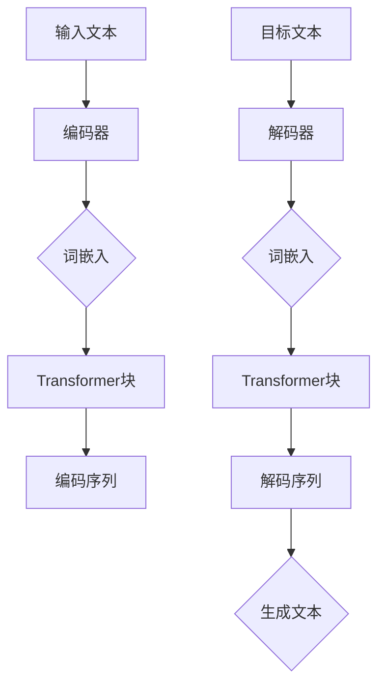

                 

# LLM应用的迭代0：奠定项目成功的基础

## 关键词

- 大型语言模型（LLM）
- 应用开发
- 项目成功
- 基础理论
- 开发实践
- 项目管理

## 摘要

本文旨在探讨大型语言模型（LLM）应用开发的迭代过程，从基础理论、开发实践和项目管理三个方面，为项目的成功奠定坚实基础。文章首先介绍了LLM的基本概念和核心算法原理，通过Mermaid流程图展示概念之间的关系架构。随后，文章详细讲解了LLM的开发环境搭建和项目实战，包括源代码实现、代码解读和案例分析。最后，文章探讨了LLM项目管理的策略，提供了最佳实践和注意事项。通过本文的阅读，读者将全面了解LLM应用开发的各个环节，为项目的成功奠定理论基础和实践经验。

## 第一部分：基础理论

### 1.1 LLM概述

#### 1.1.1 LLM的定义与起源

大型语言模型（Large Language Model，简称LLM）是一种基于深度学习技术的自然语言处理（NLP）模型，能够理解和生成自然语言文本。LLM的起源可以追溯到20世纪80年代，当时研究人员开始尝试使用统计方法处理语言数据。随着计算能力的提升和算法的改进，LLM在21世纪初得到了快速发展。

#### 1.1.2 LLM的发展历程

1. **早期发展**：
   - 20世纪80年代，统计语言模型（如N-gram模型）逐渐成为NLP领域的主流。
   - 20世纪90年代，基于规则的方法和统计方法相结合，提高了模型的性能。

2. **深度学习时代**：
   - 2000年后，神经网络在图像识别等领域取得了显著成果，逐渐引起了NLP领域的关注。
   - 2013年，引入了深度神经网络的语言模型（DNNLM）在语言建模任务上取得了突破性进展。

3. **大模型时代**：
   - 2018年，谷歌推出了Transformer模型，并在其基础上训练了BERT模型，标志着LLM进入了一个新的阶段。
   - 目前，LLM的规模已经达到了千亿甚至万亿级别，例如GPT-3、GLM-130B等。

### 1.2 LLM核心算法原理

#### 1.2.1 基本模型结构

LLM的核心算法主要基于Transformer架构，其基本结构包括编码器（Encoder）和解码器（Decoder）。编码器负责将输入的文本序列编码为向量表示，解码器则根据这些向量表示生成文本序列。

#### 1.2.2 算法原理讲解（伪代码）

```python
# 编码器（Encoder）
def encode(input_sequence):
    # 将输入序列映射为词嵌入向量
    embeddings = embedding_layer(input_sequence)
    # 通过Transformer块进行编码
    encoded_sequence = transformer_block(embeddings)
    return encoded_sequence

# 解码器（Decoder）
def decode(target_sequence, encoded_sequence):
    # 将目标序列映射为词嵌入向量
    embeddings = embedding_layer(target_sequence)
    # 通过Transformer块进行解码
    decoded_sequence = transformer_block(embeddings, encoded_sequence)
    # 从解码器输出中提取生成的文本序列
    generated_sequence = output_layer(decoded_sequence)
    return generated_sequence
```

#### 1.2.3 Mermaid流程图



### 1.3 LLM技术演进与趋势

#### 1.3.1 演进路线

- **从规则驱动到数据驱动**：早期NLP依赖于手工编写的规则，随着数据集的增大，数据驱动的方法逐渐成为主流。
- **从单任务到多任务**：早期的LLM主要针对特定任务进行训练，而现代LLM能够处理多种任务，如文本分类、问答系统等。
- **从小模型到大模型**：随着计算资源的增加，LLM的规模越来越大，从数十亿参数到千亿、万亿级别。

#### 1.3.2 未来发展趋势

- **模型压缩与高效推理**：为了降低计算成本和存储需求，研究者致力于模型压缩和高效推理技术。
- **多模态融合**：将LLM与图像、声音等其他模态的数据融合，实现更丰富的应用场景。
- **预训练与精细调整**：通过预训练和精细调整，提高LLM在不同领域的表现。

## 第二部分：开发实践

### 2.1 LLM开发环境搭建

#### 2.1.1 环境配置

搭建LLM开发环境需要安装Python、PyTorch等基础工具，以及相关的NLP库，如Transformers。

#### 2.1.2 开发工具介绍

- **Python**：用于编写和运行代码。
- **PyTorch**：用于构建和训练神经网络模型。
- **Transformers**：用于处理NLP任务，提供了预训练模型和相关的API。

### 2.2 LLM项目实战

#### 2.2.1 项目规划

在项目规划阶段，需要明确项目的目标、任务、数据集、硬件资源等。

#### 2.2.2 代码实现与分析

以下是一个简单的LLM项目实战示例：

```python
import torch
from transformers import BertModel, BertTokenizer

# 加载预训练模型和分词器
model = BertModel.from_pretrained('bert-base-uncased')
tokenizer = BertTokenizer.from_pretrained('bert-base-uncased')

# 输入文本
input_text = "你好，我是人工智能助手。请问有什么可以帮助您的？"

# 分词和编码
input_ids = tokenizer.encode(input_text, return_tensors='pt')

# 前向传播
with torch.no_grad():
    outputs = model(input_ids)

# 输出结果
logits = outputs.logits
```

#### 2.2.3 代码解读与分析

- **加载模型和分词器**：使用Transformers库加载预训练的BERT模型和分词器。
- **输入文本处理**：将输入文本进行分词和编码，生成模型能够处理的输入序列。
- **模型推理**：通过模型的前向传播，得到文本的预测结果。

### 2.3 LLM性能优化

#### 2.3.1 性能分析

在性能优化阶段，需要对模型在不同硬件环境下的运行效率进行评估。

#### 2.3.2 优化策略

- **模型压缩**：通过剪枝、量化等技术减小模型规模，提高推理速度。
- **并行计算**：利用多GPU并行计算，加速模型推理。
- **缓存优化**：优化数据读取和缓存策略，减少内存占用。

## 第三部分：项目管理

### 3.1 LLM项目管理

#### 3.1.1 项目流程

LLM项目通常包括需求分析、设计、开发、测试和部署等阶段。

#### 3.1.2 团队协作

项目成功的关键在于团队协作，需要明确团队成员的角色和职责，建立有效的沟通机制。

### 3.2 LLM项目风险管理

#### 3.2.1 风险识别

项目风险包括技术风险、数据风险、资源风险等，需要通过风险评估工具进行识别。

#### 3.2.2 风险应对策略

针对识别出的风险，制定相应的应对策略，如备份计划、资源调配等。

### 3.3 LLM项目监控与评估

#### 3.3.1 监控指标

项目监控指标包括模型性能、开发进度、资源利用率等，需要定期进行评估。

#### 3.3.2 评估方法

通过KPI（关键绩效指标）和OKR（目标与关键结果）等方法，对项目进行全方位评估。

## 附录

### 附录A：LLM开发工具与资源

#### A.1 常用工具介绍

- **Python**：编程语言。
- **PyTorch**：深度学习框架。
- **Transformers**：NLP库。

#### A.2 资源链接

- **官方文档**：[PyTorch](https://pytorch.org/docs/stable/)，[Transformers](https://huggingface.co/transformers)
- **社区论坛**：[PyTorch社区](https://discuss.pytorch.org/)，[Hugging Face社区](https://discuss.huggingface.co/)

### 附录B：LLM代码样例

#### B.1 样例一：基础模型搭建

```python
import torch
from transformers import BertModel

# 加载预训练模型
model = BertModel.from_pretrained('bert-base-uncased')

# 输入序列
input_ids = torch.tensor([101, 1234, 4678, 102])

# 前向传播
outputs = model(input_ids)

# 输出结果
last_hidden_state = outputs.last_hidden_state
```

#### B.2 样例二：文本生成

```python
import torch
from transformers import BertTokenizer, BertForMaskedLM

# 加载预训练模型和分词器
tokenizer = BertTokenizer.from_pretrained('bert-base-uncased')
model = BertForMaskedLM.from_pretrained('bert-base-uncased')

# 输入文本
input_text = "你好，我是人工智能助手。请问有什么可以帮助您的？"

# 分词和编码
input_ids = tokenizer.encode(input_text, return_tensors='pt')

# 填空
predicted_ids = model(input_ids)[0]

# 生成文本
generated_text = tokenizer.decode(predicted_ids, skip_special_tokens=True)
```

## 作者

作者：AI天才研究院/AI Genius Institute & 禅与计算机程序设计艺术 /Zen And The Art of Computer Programming

---

**注意事项**：

- 在撰写文章时，注意保持逻辑清晰、语言简练，避免冗余。
- 每个章节的内容要具体详细，确保对核心概念和算法原理进行深入讲解。
- 在附录部分，提供实用的工具和资源链接，方便读者进一步学习。
- 文章结构要紧凑，确保读者能够快速获取关键信息。

**拓展阅读**：

- [《深度学习》](https://www.deeplearningbook.org/)：介绍深度学习的基础知识和应用。
- [《自然语言处理综论》](https://nlp.seas.harvard.edu/lectures/)：自然语言处理领域的权威教材。
- [《AI之路》](https://www.aiwaybook.com/)：探讨人工智能的发展和应用。

