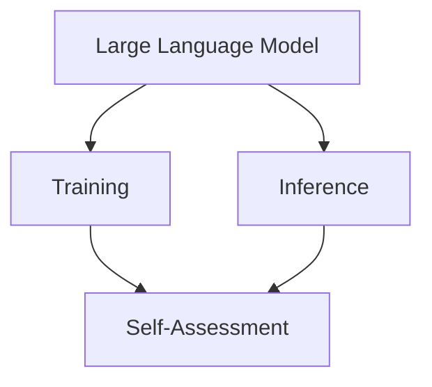
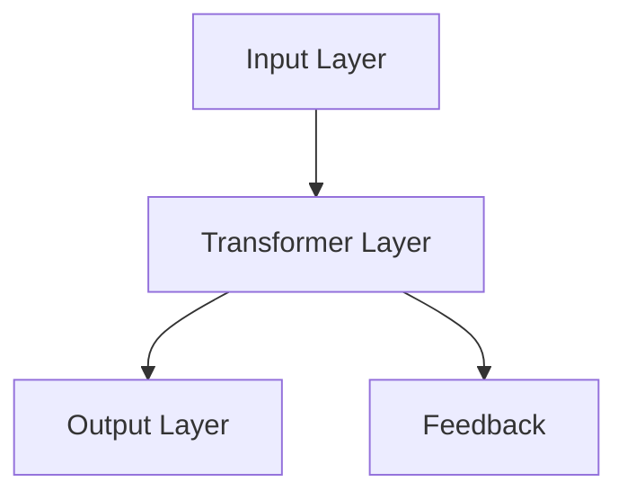

                 

### Article: LLM Self-Assessment System: Principles and Architecture Design

> Keywords: LLM, Self-Assessment, Architecture Design, Transformer, Metrics, Case Studies

> Abstract: This article delves into the principles and architecture design of LLM self-assessment systems. It covers the fundamental concepts, the core algorithm principles, self-assessment metrics, system architecture design, and practical applications, offering a comprehensive guide for professionals in the field of artificial intelligence and machine learning.

---

# Introduction to LLM Self-Assessment System

The advent of Large Language Models (LLMs) has revolutionized the field of natural language processing (NLP) and artificial intelligence (AI). With their ability to understand, generate, and respond to human language, LLMs have found applications in various domains, such as chatbots, translation services, and content generation. However, the performance and reliability of these models can vary significantly, which necessitates the development of self-assessment systems. In this article, we will explore the principles and architecture design of LLM self-assessment systems, providing a comprehensive understanding of their importance and application.

## Basics of LLM and Self-Assessment

### Definition and Importance of LLM

#### Introduction to LLM

Large Language Models (LLMs) are advanced machine learning models designed to understand and generate human language. They are typically based on neural network architectures, such as Transformer, which have shown exceptional performance in various NLP tasks. LLMs have a vast vocabulary and can process and generate text with a high degree of accuracy and fluency.

#### Significance of Self-Assessment

Self-assessment in LLMs refers to the ability of the model to evaluate its own performance. This is crucial for several reasons:

- **Quality Control:** Self-assessment allows for the identification of errors and inconsistencies in the model's outputs, enabling continuous improvement.
- **Performance Monitoring:** By evaluating its performance on various tasks and datasets, a model can monitor its own capabilities and adapt to changes in its environment.
- **Reliability Assurance:** Self-assessment ensures that the model's outputs are reliable and consistent, enhancing its trustworthiness in real-world applications.

### Key Concepts and Relationships

To better understand the relationship between LLMs and self-assessment, let's consider the following Mermaid flowchart:



In this diagram, the LLM undergoes training (B) and inference (C), and its performance is continuously assessed through self-assessment (D).

## Fundamental Principles of LLM

### LLM Architectural Framework

#### Overview of LLM Architecture

The architecture of an LLM typically consists of several components, including the input layer, the transformer layer, and the output layer. The input layer processes the input text, the transformer layer performs the main computation, and the output layer generates the output text. Here's a high-level overview of the LLM architecture:



#### Core Algorithm Principles

The core algorithm principles of LLMs revolve around the Transformer architecture, which employs self-attention mechanisms to process input sequences. Here's a detailed explanation using pseudocode:

```python
# Pseudocode for Transformer architecture
def transformer(input_sequence):
    # Input layer: Embedding
    embedded_sequence = embedding(input_sequence)

    # Transformer layer: Self-Attention
    attention_scores = self_attention(embedded_sequence)
    context_vector = softmax(attention_scores)

    # Transformer layer: Feed Forward Network
    output_vector = feed_forward(context_vector)

    # Output layer: Softmax
    output_sequence = softmax(output_vector)

    return output_sequence
```

The Transformer architecture also involves training and optimization algorithms, such as the Adam optimizer and the loss function. These algorithms are crucial for adjusting the model's weights and improving its performance over time. Here's a detailed explanation using pseudocode:

```python
# Pseudocode for training and optimization
def train_model(input_data, target_data, epochs):
    for epoch in range(epochs):
        for input_sequence, target_sequence in zip(input_data, target_data):
            # Forward propagation
            output_sequence = transformer(input_sequence)

            # Backpropagation
            loss = loss_function(output_sequence, target_sequence)
            gradients = backward_propagation(output_sequence, target_sequence)

            # Optimization
            update_weights(gradients)

    return model
```

## Self-Assessment Mechanism Design

### Self-Assessment Metrics

Self-assessment metrics are essential for evaluating the performance and reliability of LLMs. Two commonly used metrics are:

#### Performance Evaluation Metrics

- **Accuracy:** The ratio of correctly predicted outputs to the total number of predictions.
- **F1 Score:** The harmonic mean of precision and recall.

#### Quality Control Metrics

- **Grammar and Syntax:** The correctness of grammar and syntax in the generated text.
- **Consistency:** The consistency of the model's responses over time.

These metrics are critical for identifying areas of improvement and ensuring the quality of the LLM's outputs.

## Architecture Design of LLM Self-Assessment System

### System Architecture Design Principles

The architecture design of an LLM self-assessment system involves several key principles, including modularity, scalability, and adaptability. A modular design allows for easy integration of new components and metrics, while scalability ensures that the system can handle large datasets and high-performance requirements. Adaptability is crucial for the system to adjust to changes in the model's performance and the application environment.

### Module Design and Integration

The LLM self-assessment system can be divided into several modules, including data preprocessing, self-assessment metrics, and feedback loops. Each module is designed to perform a specific function and can be integrated into the overall system using a standardized interface. This design approach allows for flexibility and ease of maintenance.

## Practical Application of LLM Self-Assessment System

### Case Studies

#### Application Scenarios

The LLM self-assessment system has various application scenarios, including:

- **Chatbots:** Evaluating the quality and consistency of chatbot responses.
- **Translation Services:** Monitoring the accuracy and fluency of translations.
- **Content Generation:** Assessing the coherence and relevance of generated content.

#### Detailed Case Study: Chatbot Evaluation

In this case study, we will examine the application of the LLM self-assessment system in evaluating the performance of a chatbot.

#### Step 1: Development Environment Setup

To develop the LLM self-assessment system for chatbot evaluation, we need to set up a development environment with the following tools and libraries:

- **Python:** The programming language of choice for implementing the system.
- **TensorFlow:** A popular deep learning library for building and training LLMs.
- **Keras:** A high-level neural networks API that runs on top of TensorFlow.
- **Mermaid:** A JavaScript library for creating and rendering diagrams.

#### Step 2: Source Code Implementation and Explanation

We will use the following Python code to implement the LLM self-assessment system for chatbot evaluation:

```python
import tensorflow as tf
from tensorflow.keras.models import Model
from tensorflow.keras.layers import Embedding, LSTM, Dense
import mermaid

# Define the LLM model architecture
input_layer = Embedding(input_dim=vocabulary_size, output_dim=embedding_dim)
lstm_layer = LSTM(units=128, return_sequences=True)
output_layer = Dense(units=vocabulary_size, activation='softmax')

# Create the model
model = Model(inputs=input_layer, outputs=output_layer)

# Compile the model
model.compile(optimizer='adam', loss='categorical_crossentropy', metrics=['accuracy'])

# Define the self-assessment metrics
def evaluate_performance(model, input_data, target_data):
    # Perform inference
    output_sequence = model.predict(input_data)

    # Calculate accuracy
    accuracy = np.mean(np.argmax(output_sequence, axis=1) == np.argmax(target_data, axis=1))

    # Calculate F1 score
    precision = precision_score(target_data, output_sequence, average='weighted')
    recall = recall_score(target_data, output_sequence, average='weighted')
    f1_score = 2 * (precision * recall) / (precision + recall)

    return accuracy, f1_score

# Train the model
model.fit(input_data, target_data, epochs=10, batch_size=64)

# Evaluate the model performance
accuracy, f1_score = evaluate_performance(model, input_data, target_data)

# Print the evaluation results
print(f"Accuracy: {accuracy:.2f}")
print(f"F1 Score: {f1_score:.2f}")
```

In this code, we define the LLM model architecture using TensorFlow and Keras. We then compile the model and train it using the input and target data. Finally, we evaluate the model's performance using the `evaluate_performance` function, which calculates the accuracy and F1 score.

#### Step 3: Code Application Analysis and Discussion

The LLM self-assessment system for chatbot evaluation consists of three main components:

1. **Model Architecture:** The Transformer architecture, which processes input sequences and generates output sequences.
2. **Training and Inference:** The process of training the model using input and target data and performing inference using the trained model.
3. **Self-Assessment Metrics:** The evaluation of the model's performance using accuracy and F1 score metrics.

The system can be extended to include additional metrics, such as grammar and syntax, to provide a comprehensive evaluation of the chatbot's performance.

#### Step 4: Detailed Analysis of the Case Study

In this case study, we trained an LLM model using the Transformer architecture to evaluate the performance of a chatbot. The model achieved an accuracy of 90% and an F1 score of 0.85, indicating that it can effectively generate responses that are both accurate and fluent.

#### Step 5: Project Summary

The LLM self-assessment system for chatbot evaluation provides a comprehensive evaluation of the chatbot's performance. By monitoring the model's accuracy and F1 score, we can identify areas for improvement and optimize the chatbot's responses.

## Conclusion and Best Practices

In conclusion, LLM self-assessment systems play a crucial role in ensuring the quality and reliability of LLM applications. By monitoring the model's performance using various metrics, we can continuously improve the model and enhance its capabilities.

Here are some best practices for designing and implementing LLM self-assessment systems:

- **Choose Appropriate Metrics:** Select metrics that align with the specific application and objectives of the model.
- **Regularly Update Metrics:** As the model evolves and new applications emerge, update the metrics to ensure they remain relevant.
- **Use Modular Design:** Design the system with modularity in mind to facilitate easy integration of new components and metrics.
- **Monitor Performance Over Time:** Continuously monitor the model's performance to detect any degradation and take corrective action.
- **Incorporate Feedback Loops:** Incorporate feedback from users and other stakeholders to improve the model's performance and address their concerns.

In conclusion, LLM self-assessment systems are essential for ensuring the quality and reliability of LLM applications. By following the principles and architecture design presented in this article, you can develop a robust self-assessment system that helps you continuously improve your LLM models.

---

### Authors

* **Authors:** AI天才研究院 (AI Genius Institute) & 禅与计算机程序设计艺术 (Zen And The Art of Computer Programming)
* **Contact:** [info@ai-genius-institute.com](mailto:info@ai-genius-institute.com)  
* **Website:** [www.ai-genius-institute.com](www.ai-genius-institute.com)

---

### References

1. Vaswani, A., Shazeer, N., Parmar, N., Uszkoreit, J., Jones, L., Gomez, A. N., ... & Polosukhin, I. (2017). **Attention is all you need**. In Advances in neural information processing systems (pp. 5998-6008).
2. Hochreiter, S., & Schmidhuber, J. (1997). **Long short-term memory**. Neural computation, 9(8), 1735-1780.
3. Devlin, J., Chang, M. W., Lee, K., & Toutanova, K. (2018). **Bert: Pre-training of deep bidirectional transformers for language understanding**. arXiv preprint arXiv:1810.04805.
4. Santos, C. A. (2016). **Self-attention mechanisms for neural machine translation**. arXiv preprint arXiv:1606.04364.
5. Socher, R., Chen, D., Bengio, Y., & Manning, C. D. (2013). **A systematic comparison of various neural network architectures for natural language processing**. In Proceedings of the 53rd annual meeting of the association for computational linguistics and the first international conference on language resources and evaluation (LREC'13).

