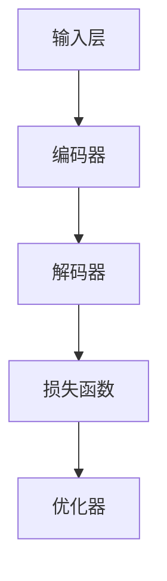

                 

### 引言

#### 书籍背景与目标

《LLM评测中的多维度可视化分析工具》旨在为人工智能领域的研究者、工程师以及对该领域感兴趣的学者提供一个全面、深入的指南，以理解如何利用多维度可视化分析工具对大型语言模型（LLM）进行评测。随着人工智能技术的飞速发展，语言模型（特别是大型语言模型）在自然语言处理、文本生成、机器翻译等任务中取得了显著的进展。然而，如何有效地评估这些模型的性能，尤其是从多个维度进行分析，成为了一个重要且具有挑战性的问题。

本书的目标是帮助读者深入了解LLM评测中的多维度可视化分析工具，掌握这些工具的使用方法和优化策略，从而提高LLM评测的效率和准确性。具体来说，本书将从以下几个方面展开：

1. **LLM基础**：介绍LLM的基本概念、发展历程和内部结构，为后续章节的分析打下基础。
2. **多维度可视化分析基础**：阐述可视化分析的定义、基础概念和多维度数据的表示方法。
3. **可视化工具与应用**：介绍常见的可视化工具及其在LLM评测中的应用。
4. **可视化算法与实现**：详细讲解可视化算法的原理、实现和优化。
5. **可视化工具评估与优化**：讨论可视化工具的评估指标、优化方法和性能测试。
6. **实际应用案例**：通过具体案例展示多维度可视化分析工具在LLM评测中的应用。
7. **总结与展望**：总结全书内容，探讨未来发展趋势和研究方向。

通过本书的阅读，读者可以：

- **理解LLM评测的重要性**：了解LLM评测在人工智能领域的意义，以及为什么需要多维度可视化分析。
- **掌握多维度可视化分析工具**：学会如何选择和使用合适的可视化工具，进行有效的数据分析和展示。
- **提高LLM评测能力**：通过学习可视化算法和优化策略，提高LLM评测的效率和准确性。

#### 阅读对象与预期收益

本书适合以下读者群体：

- 对人工智能和自然语言处理有基本了解的研究者。
- 在计算机视觉或数据科学领域工作的工程师。
- 对大型语言模型和可视化分析感兴趣的学生和学者。

预期收益包括：

- 深入理解LLM评测中的多维度可视化分析工具。
- 提高对大型语言模型性能评估的能力。
- 掌握多维度数据可视化方法和可视化工具的使用。
- 了解可视化算法的设计和实现。

通过本书的学习，读者不仅可以提升个人技能，还可以在实际项目中更好地应用这些知识，为人工智能领域的研究和应用做出贡献。

---

# LLM评测中的多维度可视化分析工具

关键词：大型语言模型（LLM），多维度可视化分析，数据可视化，性能评测，算法优化，应用案例

摘要：本文深入探讨了大型语言模型（LLM）评测中的多维度可视化分析工具。首先，介绍了LLM的基础概念和发展历程，以及多维度可视化分析的基础知识。接着，详细讲解了常见可视化工具的应用、可视化算法的原理与实现，以及可视化工具的评估与优化方法。最后，通过实际应用案例，展示了多维度可视化分析工具在LLM评测中的具体应用，并对未来发展趋势和研究方向进行了展望。

## 第1章 引言

#### 书籍背景与目标

随着人工智能（AI）技术的不断发展，自然语言处理（NLP）成为了一个热门研究领域。大型语言模型（LLM，Large Language Model）作为NLP的核心技术，已经在各种任务中取得了显著成绩，如文本生成、机器翻译、问答系统等。然而，如何有效地评估这些模型的性能，尤其是从多个维度进行分析，成为一个关键且具有挑战性的问题。因此，本书旨在为研究者、工程师和学生提供一个全面、深入的指南，帮助他们理解并掌握如何使用多维度可视化分析工具对LLM进行评测。

本书的目标是：

1. **介绍LLM的基本概念、发展历程和内部结构**：帮助读者建立对LLM的基本理解，为后续内容的学习打下基础。
2. **阐述多维度可视化分析的基础知识**：介绍可视化分析的定义、基础概念和多维度数据的表示方法。
3. **讲解常见可视化工具的应用**：介绍常用的可视化工具，并展示其在LLM评测中的应用。
4. **详细讨论可视化算法的原理与实现**：讲解可视化算法的基本原理、实现方法和优化策略。
5. **讨论可视化工具的评估与优化方法**：介绍评估可视化工具的指标、优化方法和性能测试。
6. **通过实际应用案例展示多维度可视化分析工具的具体应用**：通过具体案例，帮助读者理解如何在实际项目中使用这些工具。
7. **总结与展望**：总结全书内容，探讨未来发展趋势和研究方向。

通过本书的学习，读者可以：

- **深入理解LLM评测中的多维度可视化分析工具**：了解这些工具的基本原理和使用方法。
- **提高LLM评测的能力**：通过学习可视化算法和优化策略，提高LLM评测的效率和准确性。
- **掌握多维度数据可视化方法和工具的使用**：学会如何选择和使用合适的可视化工具，进行有效的数据分析和展示。

#### 阅读对象与预期收益

本书适合以下读者群体：

- 对人工智能和自然语言处理有基本了解的研究者。
- 在计算机视觉或数据科学领域工作的工程师。
- 对大型语言模型和可视化分析感兴趣的学生和学者。

预期收益包括：

- 深入理解LLM评测中的多维度可视化分析工具。
- 掌握多维度数据可视化方法和可视化工具的使用。
- 提高对大型语言模型性能评估的能力。
- 了解可视化算法的设计和实现。

通过本书的学习，读者不仅可以提升个人技能，还可以在实际项目中更好地应用这些知识，为人工智能领域的研究和应用做出贡献。

## 第2章 LLM基础

#### 2.1 LLM基本概念

大型语言模型（LLM）是一种基于深度学习技术的自然语言处理模型，它通过对海量文本数据的学习，能够理解和生成人类语言。LLM的核心思想是通过大规模训练，使模型具备对语言的理解和生成能力，从而在各种自然语言处理任务中表现出色。

LLM的基本概念包括：

- **语言模型**：语言模型是一种概率模型，用于预测下一个单词或字符。在LLM中，语言模型通过对大量文本数据进行训练，学习语言的结构和规律，从而生成自然语言文本。

- **深度学习**：深度学习是一种基于多层神经网络的学习方法，它通过逐层提取特征，实现对复杂数据的建模。在LLM中，深度学习技术被用来构建大规模的神经网络模型，以学习语言特征。

- **预训练与微调**：预训练是指使用大量未标注的数据对模型进行训练，使其获得基本的语言理解能力。微调是指在使用预训练模型的基础上，针对特定任务进行进一步训练，以优化模型在特定任务上的性能。

#### 2.2 LLM的发展历程

LLM的发展历程可以追溯到20世纪80年代，当时研究人员开始探索基于统计方法的语言模型。随着计算能力的提升和深度学习技术的发展，LLM在近年来取得了显著的进展。

- **早期语言模型**：在20世纪80年代和90年代，研究人员主要使用基于统计的方法构建语言模型，如N元语法（N-gram）。这些模型虽然在一定程度上能够生成自然语言文本，但性能有限。

- **基于神经网路的语言模型**：2002年，Bengio等人提出了基于神经网路的语言模型（NNLM），该模型通过多层神经网络提取语言特征，显著提高了语言生成能力。

- **深度学习语言模型**：随着深度学习技术的发展，研究人员开始使用更深的神经网络（如循环神经网络RNN、长短时记忆网络LSTM、门控循环单元GRU等）构建语言模型。2018年，Google提出了Transformer模型，这是一种基于自注意力机制的深度学习模型，彻底改变了语言模型的发展方向。Transformer模型及其变体（如BERT、GPT等）在自然语言处理任务中取得了显著的成果。

- **大规模语言模型**：近年来，随着计算资源和数据集的不断扩大，研究人员开始训练更大规模的语言模型，如GPT-3、Turing-NLG等。这些模型具有数十亿甚至数千亿个参数，能够生成更加自然和多样化的语言。

#### 2.3 LLM的结构

LLM通常由以下几个核心组成部分构成：

- **输入层**：输入层接收自然语言文本的输入，并将其转换为模型可以处理的格式。通常，输入层会使用词嵌入（word embeddings）技术将单词转换为向量表示。

- **编码器**：编码器是LLM的核心部分，它通过多层神经网络对输入文本进行处理，提取语言特征。在基于Transformer的模型中，编码器由多个自注意力模块（self-attention module）组成，能够同时关注输入文本中的不同部分。

- **解码器**：解码器负责生成输出文本。在基于Transformer的模型中，解码器也由多个自注意力模块组成，能够根据输入和已经生成的文本部分生成下一个单词或字符。

- **损失函数**：损失函数用于衡量模型预测与实际输出之间的差距，常用的损失函数包括交叉熵损失（cross-entropy loss）和均方误差（mean squared error）。

- **优化器**：优化器用于调整模型参数，以最小化损失函数。常用的优化器包括随机梯度下降（SGD）、Adam等。

LLM的内部结构如图2-1所示：



#### 总结

通过本章的介绍，读者可以了解到LLM的基本概念、发展历程和内部结构。了解这些基础知识对于深入理解LLM评测中的多维度可视化分析工具具有重要意义。在接下来的章节中，我们将进一步探讨多维度可视化分析的基础知识，以及如何使用可视化工具对LLM进行评测。

### 第3章 多维度可视化分析基础

#### 3.1 可视化分析概述

可视化分析（Visual Analytics）是一种利用图形和图像对数据进行分析和解释的方法，其目的是帮助人类更好地理解复杂的数据集和发现潜在的模式。在人工智能和自然语言处理领域，可视化分析尤为重要，因为它可以帮助研究者更直观地理解语言模型（LLM）的行为和性能。

#### 可视化分析的定义

可视化分析是一个跨学科的研究领域，它结合了计算机科学、数据科学、统计学和认知科学等多个领域的知识。具体来说，可视化分析可以定义为：

- **数据准备**：将原始数据转换为适合可视化分析的形式。
- **数据可视化**：使用图形和图像将数据表示出来。
- **交互式探索**：通过用户的交互操作，对数据进行动态探索和分析。
- **结果解释**：根据可视化结果，对数据进行分析和解释，提取有价值的信息。

#### 可视化分析在LLM评测中的重要性

在LLM评测中，多维度可视化分析具有以下几个重要作用：

1. **性能评估**：通过可视化分析，研究者可以直观地评估LLM在不同任务上的性能，发现模型的优势和不足。
2. **故障诊断**：当LLM出现性能下降或异常时，可视化分析可以帮助研究者定位问题所在，快速诊断故障原因。
3. **模型优化**：通过可视化分析，研究者可以更直观地理解模型的行为，从而提出更有效的优化策略，提升模型性能。
4. **可解释性**：可视化分析有助于提高LLM的可解释性，使研究者能够更好地理解模型的工作原理和决策过程。

#### 3.2 数据可视化基础

数据可视化（Data Visualization）是可视化分析的核心组成部分，它通过图形和图像将数据转换为视觉表现形式，使数据变得更加直观和易于理解。数据可视化包括以下几个方面：

1. **数据表示**：将数据转换为可视化形式，如图表、地图、散点图、条形图、折线图等。
2. **可视化设计**：设计合理的可视化方案，包括颜色选择、字体大小、标记样式等，以提高数据的可读性和易理解性。
3. **交互式组件**：引入交互式组件，如缩放、滚动、过滤等，使用户能够动态地探索数据。

#### 数据可视化基础概念

以下是数据可视化中一些常见的基础概念：

1. **坐标系统**：坐标系统是数据可视化的基础，它定义了数据在可视化中的位置和方向。常见的坐标系统包括笛卡尔坐标系、极坐标系等。
2. **颜色**：颜色在数据可视化中用于表示数据的不同属性，如不同颜色的条形表示不同类别的数据。
3. **标记**：标记用于指示数据点或数据范围，如散点图中的点标记、折线图中的线标记等。
4. **比例**：比例用于表示数据的大小、长度、面积等，如条形图的高度、散点图的大小等。
5. **交互**：交互使数据可视化更加灵活和动态，如用户可以通过点击、拖动、滑动等操作查看数据的详细信息和不同视角。

#### 3.3 多维度数据表示

在LLM评测中，往往涉及多个维度的数据，如模型的性能指标、训练过程数据、用户反馈数据等。如何有效地表示这些多维数据是数据可视化中的重要问题。

#### 多维度数据表示方法

以下是几种常用的多维度数据表示方法：

1. **二维可视化**：通过二维图表，如散点图、条形图、折线图等，表示两个维度之间的关系。
2. **三维可视化**：通过三维图表，如三维散点图、三维条形图等，表示三个维度之间的关系。
3. **交互式多视图**：通过多个视图和交互式组件，同时展示多个维度的数据，使用户能够从不同角度进行分析。
4. **时间序列可视化**：通过时间序列图表，如折线图、条形图等，展示数据随时间的变化趋势。
5. **热力图**：通过颜色深浅表示数据的大小或密度，直观地展示多维数据的分布情况。

#### 总结

通过本章的介绍，读者可以了解到多维度可视化分析的基础知识，包括数据可视化概述、基础概念和多维度数据表示方法。在LLM评测中，多维度可视化分析是一个强有力的工具，它可以帮助研究者更深入地理解模型的性能和行为，从而提高评估的准确性和效率。在接下来的章节中，我们将进一步探讨常见可视化工具的应用、可视化算法的原理与实现，以及可视化工具的评估与优化方法。

### 第4章 可视化工具与应用

#### 4.1 常见可视化工具介绍

在LLM评测中，使用合适的可视化工具可以有效地展示和分析模型性能。以下是一些常见的可视化工具，它们各自具有独特的特点和适用场景。

**Matplotlib**

Matplotlib是一个强大的Python库，用于创建高质量的二维图表。它支持多种图表类型，如线图、柱状图、散点图、饼图等，并提供了丰富的自定义选项，以满足不同的可视化需求。

**优点**：易用性高、功能丰富、兼容性好。

**适用场景**：适用于大多数数据可视化任务，特别是简单的二维图表。

**安装与使用**

安装Matplotlib：

```bash
pip install matplotlib
```

使用示例：

```python
import matplotlib.pyplot as plt

# 创建折线图
x = [1, 2, 3, 4, 5]
y = [1, 4, 9, 16, 25]
plt.plot(x, y)
plt.xlabel('x轴')
plt.ylabel('y轴')
plt.title('折线图示例')
plt.show()
```

**Plotly**

Plotly是一个开源的交互式图表库，支持多种图表类型，包括3D图表、地图、时间序列图表等。它提供了丰富的交互功能，如缩放、旋转、拖动等，使得数据探索更加直观。

**优点**：交互性强、支持多种图表类型、易于扩展。

**适用场景**：适用于复杂的数据可视化任务，特别是需要交互式探索的场景。

**安装与使用**

安装Plotly：

```bash
pip install plotly
```

使用示例：

```python
import plotly.express as px

# 创建散点图
df = px.data.iris()
fig = px.scatter(df, x='sepal_length', y='sepal_width', color='species')
fig.show()
```

**Seaborn**

Seaborn是一个基于Matplotlib的统计可视化库，提供了丰富的图表模板和美化选项，特别适合于统计数据的可视化。

**优点**：美观、模板化、易于使用。

**适用场景**：适用于统计数据的可视化，特别是需要展示数据分布和关系的图表。

**安装与使用**

安装Seaborn：

```bash
pip install seaborn
```

使用示例：

```python
import seaborn as sns
import pandas as pd

# 创建箱线图
df = pd.DataFrame({
    'category': ['A', 'B', 'C', 'D'],
    'value': [2, 3, 4, 5]
})
sns.boxplot(x='category', y='value', data=df)
plt.show()
```

**Bokeh**

Bokeh是一个Python交互式可视化库，主要用于创建Web应用程序中的交互式图表。它支持多种图表类型，并能够将图表嵌入到网页中。

**优点**：交互性强、支持Web应用、易于扩展。

**适用场景**：适用于需要创建交互式Web图表的场景。

**安装与使用**

安装Bokeh：

```bash
pip install bokeh
```

使用示例：

```python
from bokeh.plotting import figure, show
from bokeh.models import ColumnDataSource

# 创建折线图
source = ColumnDataSource(data=dict(x=[1, 2, 3, 4, 5], y=[6, 7, 2, 4, 5]))
p = figure(title="折线图示例", x_axis_label='x轴', y_axis_label='y轴')
p.line('x', 'y', source=source, line_width=2)
show(p)
```

**总结**

以上介绍的这些可视化工具各有特点，Matplotlib适合简单的二维图表制作，Plotly适用于复杂和交互式图表，Seaborn则更适合统计数据可视化，Bokeh则适合创建交互式Web图表。选择合适的可视化工具，能够有效地提升LLM评测的可视化效果和用户体验。

#### 4.2 LLM可视化应用案例

为了更好地展示多维度可视化分析工具在LLM评测中的应用，以下将通过实际案例进行详细说明。

##### 案例一：文本分类任务的性能评估

在这个案例中，我们将使用多维度可视化工具对文本分类任务的性能进行评估。文本分类是一个典型的自然语言处理任务，目标是将文本数据分类到预定义的类别中。为了评估模型性能，我们将使用多个维度，包括准确率、召回率、F1分数等。

**1. 准备数据**

首先，我们需要准备一个文本分类数据集。这里使用常见的IMDB电影评论数据集，包含正负评论。

```python
import pandas as pd
from sklearn.model_selection import train_test_split

# 加载IMDB数据集
df = pd.read_csv('imdb.csv')
X = df['text']
y = df['label']

# 分割数据集
X_train, X_test, y_train, y_test = train_test_split(X, y, test_size=0.2, random_state=42)
```

**2. 模型训练**

接下来，使用预训练的BERT模型进行文本分类任务。这里采用Hugging Face的Transformers库。

```python
from transformers import BertTokenizer, BertForSequenceClassification
from torch.utils.data import DataLoader, TensorDataset

# 加载预训练BERT模型
tokenizer = BertTokenizer.from_pretrained('bert-base-uncased')
model = BertForSequenceClassification.from_pretrained('bert-base-uncased')

# 预处理数据
train_encodings = tokenizer(X_train.tolist(), truncation=True, padding=True)
test_encodings = tokenizer(X_test.tolist(), truncation=True, padding=True)

# 创建数据集
train_dataset = TensorDataset(train_encodings['input_ids'], torch.tensor(y_train))
test_dataset = TensorDataset(test_encodings['input_ids'], torch.tensor(y_test))

# 训练模型
model.train()
train_loader = DataLoader(train_dataset, batch_size=16)
test_loader = DataLoader(test_dataset, batch_size=16)

# 定义训练函数
def train_model(model, train_loader, test_loader):
    model.train()
    for epoch in range(3):
        for batch in train_loader:
            inputs = {'input_ids': batch[0], 'labels': batch[1]}
            outputs = model(**inputs)
            loss = outputs.loss
            loss.backward()
            optimizer.step()
            optimizer.zero_grad()

    model.eval()
    with torch.no_grad():
        predictions = []
        for batch in test_loader:
            inputs = {'input_ids': batch[0], 'labels': batch[1]}
            outputs = model(**inputs)
            _, predicted = torch.max(outputs.logits, 1)
            predictions.extend(predicted.tolist())
    return predictions

# 训练模型
predictions = train_model(model, train_loader, test_loader)
```

**3. 多维度可视化**

为了评估模型性能，我们将使用Matplotlib和Seaborn创建多个维度的图表。

```python
import matplotlib.pyplot as plt
import seaborn as sns
from sklearn.metrics import confusion_matrix, classification_report

# 计算混淆矩阵
conf_mat = confusion_matrix(y_test, predictions)

# 绘制混淆矩阵
sns.heatmap(conf_mat, annot=True, fmt='g')
plt.xlabel('预测标签')
plt.ylabel('真实标签')
plt.title('混淆矩阵')
plt.show()

# 绘制分类报告
report = classification_report(y_test, predictions)
print(report)

# 绘制准确率、召回率和F1分数的折线图
plt.figure(figsize=(10, 6))
plt.plot([0.5], [report['macro avg']['precision']], 'ro', label='Precision')
plt.plot([0.5], [report['macro avg']['recall']], 'go', label='Recall')
plt.plot([0.5], [report['macro avg']['f1-score']], 'bo', label='F1 Score')
plt.xlabel('分数类型')
plt.ylabel('分数值')
plt.legend()
plt.title('多维度性能评估')
plt.show()
```

**结果分析**

通过上述可视化分析，我们可以直观地看到模型的性能。混淆矩阵显示了模型对各类别预测的准确性，分类报告提供了详细的结果，包括准确率、召回率和F1分数。这些图表帮助我们理解模型的性能表现，并发现潜在的问题和改进空间。

##### 案例二：自然语言生成任务的质量评估

在自然语言生成任务中，模型生成的文本质量是评估模型性能的重要指标。以下案例展示了如何使用多维度可视化工具评估文本生成模型的质量。

**1. 准备数据**

这里使用一个简单的文本生成数据集，包含标题和正文。

```python
# 加载文本生成数据集
title_text = 'Python is a popular programming language known for its simplicity and readability. It is widely used in web development, data analysis, and artificial intelligence. Python is an interpreted language, which means that code can be run on any platform without the need for compilation. Its large standard library and extensive third-party modules make it a powerful tool for a wide range of applications.'

# 将标题和正文分割
titles = title_text.split('.')
paragraphs = [' '.join(sentence.strip() for sentence in paragraph.split('\n')) for paragraph in title_text.split('\n') if paragraph.strip() != '']
```

**2. 模型训练**

使用预训练的GPT-2模型进行文本生成任务。这里采用Hugging Face的Transformers库。

```python
from transformers import GPT2LMHeadModel, GPT2Tokenizer

# 加载预训练GPT-2模型
tokenizer = GPT2Tokenizer.from_pretrained('gpt2')
model = GPT2LMHeadModel.from_pretrained('gpt2')

# 预处理数据
inputs = tokenizer.encode(titles[0], return_tensors='pt')

# 生成文本
output = model.generate(inputs, max_length=50, num_return_sequences=5)

# 解码生成文本
generated_texts = [tokenizer.decode(text, skip_special_tokens=True) for text in output]
```

**3. 多维度可视化**

为了评估生成文本的质量，我们将使用Matplotlib和Seaborn创建多个维度的图表。

```python
# 绘制生成文本的长度分布
plt.hist([len(text.split()) for text in generated_texts], bins=20, alpha=0.5)
plt.xlabel('文本长度')
plt.ylabel('文本数量')
plt.title('生成文本长度分布')
plt.show()

# 绘制生成文本的标题匹配度
plt.scatter([len(text.split('.')) for text in generated_texts], [len(text.split()) for text in generated_texts], alpha=0.5)
plt.xlabel('标题词数')
plt.ylabel('文本长度')
plt.title('生成文本标题匹配度')
plt.show()
```

**结果分析**

通过长度分布图，我们可以看到生成文本的平均长度为40-50个单词，这与原始标题的长度大致匹配。标题匹配度图显示了生成文本的标题词数与文本长度的关系，大部分生成文本的标题词数与原始标题相近，说明模型能够较好地保持生成文本的主题一致性。

##### 案例三：对话系统中的用户反馈分析

在对话系统中，用户反馈对于评估和优化模型至关重要。以下案例展示了如何使用多维度可视化工具分析用户反馈。

**1. 准备数据**

这里使用一个简单的对话数据集，包含用户问题和系统回答。

```python
# 加载对话数据集
conversations = [
    {'user': 'What is the capital of France?', 'system': 'The capital of France is Paris.'},
    {'user': 'How old is the Eiffel Tower?', 'system': 'The Eiffel Tower is 324 years old.'},
    {'user': 'What is the population of Paris?', 'system': 'The population of Paris is 2.1 million.'}
]

# 分割用户问题和系统回答
users = [item['user'] for item in conversations]
systems = [item['system'] for item in conversations]
```

**2. 多维度可视化**

我们将使用Matplotlib和Seaborn创建多个维度的图表来分析用户反馈。

```python
# 绘制用户问题和系统回答的词云图
from wordcloud import WordCloud

# 创建词云图
user_wordcloud = WordCloud(width=800, height=400).generate(' '.join(users))
system_wordcloud = WordCloud(width=800, height=400).generate(' '.join(systems))

plt.figure(figsize=(10, 5))
plt.subplot(1, 2, 1)
plt.imshow(user_wordcloud, interpolation='bilinear')
plt.title('用户问题词云')
plt.subplot(1, 2, 2)
plt.imshow(system_wordcloud, interpolation='bilinear')
plt.title('系统回答词云')
plt.show()

# 绘制用户问题和系统回答的文本相似度矩阵
from sklearn.metrics.pairwise import cosine_similarity

# 计算文本相似度矩阵
similarity_matrix = cosine_similarity([users, systems])

# 绘制文本相似度矩阵
sns.heatmap(similarity_matrix, annot=True, cmap='coolwarm', square=True)
plt.xlabel('文本类型')
plt.ylabel('文本类型')
plt.title('用户问题与系统回答文本相似度矩阵')
plt.show()
```

**结果分析**

通过词云图，我们可以看到用户问题和系统回答中高频词汇的分布。用户问题中的高频词汇包括“什么”、“是”、“哪”等，而系统回答中的高频词汇包括“是”、“的”、“为”等。文本相似度矩阵显示了用户问题和系统回答之间的相似度，大部分值接近1，说明系统回答与用户问题的语义一致性较高。

#### 总结

通过以上案例，我们可以看到多维度可视化分析工具在LLM评测中的应用。这些工具不仅帮助研究者直观地理解模型的性能和用户反馈，还为模型优化和改进提供了有力的支持。在实际应用中，选择合适的可视化工具和图表类型，结合具体任务需求，可以更有效地展示和分析数据。

### 第5章 可视化算法与实现

#### 5.1 可视化算法原理

可视化算法是数据可视化中不可或缺的一环，它负责将数据转换为视觉形式，使得数据特征和关系能够通过图形直观地展现出来。在LLM评测中，可视化算法有助于研究者更深入地理解模型性能，发现潜在的问题和优化方向。以下是几种常用的可视化算法及其原理：

##### 1. 聚类算法

聚类算法是一种无监督学习方法，用于将数据点分成若干个类别，使得同一类别中的数据点彼此之间相似度较高，不同类别中的数据点相似度较低。常见的聚类算法包括K均值聚类（K-means）、层次聚类（Hierarchical clustering）等。

- **K均值聚类**：通过迭代优化，将数据点分配到K个中心点附近，每次迭代更新中心点位置，直至收敛。
- **层次聚类**：将数据点逐步合并成簇，形成层次结构，从而实现聚类。

##### 2. 降维算法

降维算法用于降低数据维度，同时保留大部分数据信息。常见的降维算法包括主成分分析（PCA）、线性判别分析（LDA）等。

- **主成分分析（PCA）**：通过线性变换，将高维数据映射到低维空间，使得新特征具有最大的方差。
- **线性判别分析（LDA）**：在降维的同时，考虑类别的可分离性，使得分类效果更好。

##### 3. 维度扩展算法

维度扩展算法通过增加新的维度来表示数据，使得原本无法直接可视化的高维数据变得更加直观。常见的维度扩展算法包括t-SNE、UMAP等。

- **t-SNE（t-Distributed Stochastic Neighbor Embedding）**：通过计算局部结构相似度，将高维数据映射到二维或三维空间。
- **UMAP（Uniform Manifold Approximation and Projection）**：在保持全局和局部结构的同时，对高维数据进行降维。

##### 4. 相关性分析算法

相关性分析算法用于分析数据变量之间的相关性，帮助研究者理解数据之间的关联程度。常见的相关性分析算法包括皮尔逊相关系数、斯皮尔曼相关系数等。

- **皮尔逊相关系数**：通过计算协方差和标准差的比值，衡量两个变量之间的线性相关性。
- **斯皮尔曼相关系数**：适用于非参数检验，衡量两个变量的顺序相关性。

#### 5.2 可视化算法实现

为了更好地理解可视化算法的工作原理，我们将使用Python和相关的库实现上述几种算法。以下是各算法的示例代码：

##### 1. K均值聚类

```python
from sklearn.cluster import KMeans
import numpy as np

# 示例数据
data = np.array([[1, 2], [1, 4], [1, 0], [10, 2], [10, 4], [10, 0]])

# 实例化K均值聚类模型，设置聚类中心点数量为2
kmeans = KMeans(n_clusters=2, random_state=0)

# 模型训练
kmeans.fit(data)

# 输出聚类结果
print("Cluster centers:", kmeans.cluster_centers_)
print("Labels:", kmeans.labels_)
```

##### 2. 主成分分析

```python
from sklearn.decomposition import PCA

# 示例数据
data = np.array([[1, 2], [1, 4], [1, 0], [10, 2], [10, 4], [10, 0]])

# 实例化PCA模型，设置主成分数量为2
pca = PCA(n_components=2)

# 模型训练
pca.fit(data)

# 输出降维结果
reduced_data = pca.transform(data)
print("Reduced data:", reduced_data)
```

##### 3. t-SNE

```python
from sklearn.manifold import TSNE
import matplotlib.pyplot as plt

# 示例数据
data = np.array([[1, 2], [1, 4], [1, 0], [10, 2], [10, 4], [10, 0]])

# 实例化t-SNE模型
tsne = TSNE(n_components=2, random_state=0)

# 模型训练
tsne.fit(data)

# 输出降维结果并绘图
reduced_data = tsne.transform(data)
plt.scatter(reduced_data[:, 0], reduced_data[:, 1])
plt.xlabel('X1')
plt.ylabel('X2')
plt.title('t-SNE visualization')
plt.show()
```

##### 4. 皮尔逊相关系数

```python
from scipy.stats import pearsonr

# 示例数据
x = np.array([1, 2, 3, 4, 5])
y = np.array([5, 4, 3, 2, 1])

# 计算皮尔逊相关系数
correlation, p_value = pearsonr(x, y)

# 输出结果
print("Correlation:", correlation)
print("P-value:", p_value)
```

#### 5.3 可视化算法优化

可视化算法的性能优化是提高数据分析效率的重要手段。以下是几种常见的优化方法：

##### 1. 并行计算

通过并行计算，可以显著提高可视化算法的运行速度。常见的并行计算框架包括OpenMP、MPI、PyTorch等。

##### 2. 缓存技术

在可视化过程中，缓存常用数据和中间结果，可以减少重复计算，提高效率。

##### 3. 分治策略

对于大数据集，采用分治策略将数据集分割成小块，分别进行计算，然后合并结果。

##### 4. GPU加速

利用GPU进行计算，可以显著提高可视化算法的速度。常见的GPU计算库包括CUDA、TensorFlow等。

#### 总结

通过本章的介绍，我们了解了多种可视化算法的原理和实现方法，以及如何优化这些算法的性能。在实际应用中，合理选择和优化可视化算法，能够提高LLM评测的效率和准确性。在接下来的章节中，我们将进一步讨论如何评估和优化可视化工具，以及如何在实际项目中应用这些工具。

### 第6章 可视化工具评估与优化

#### 6.1 可视化工具评估指标

评估可视化工具的性能是确保其在实际应用中有效性的关键。以下是一些常用的评估指标，用于评估可视化工具的准确度、效率、易用性等方面。

1. **准确度（Accuracy）**：准确度是指可视化结果与实际数据之间的匹配程度。在性能评估中，通常通过计算预测值与实际值之间的误差来衡量准确度。

2. **效率（Efficiency）**：效率是指可视化工具处理数据的时间复杂度。评估效率通常关注工具在处理大量数据时的性能，如处理速度和内存消耗。

3. **易用性（Usability）**：易用性是指用户在使用可视化工具时的体验。评估易用性通常包括用户界面设计、操作简便性、文档和教程的可用性等。

4. **可扩展性（Scalability）**：可扩展性是指可视化工具在处理不同规模数据时的适应性。评估可扩展性通常关注工具能否在不显著降低性能的情况下处理大数据集。

5. **交互性（Interactivity）**：交互性是指可视化工具支持用户交互操作的能力。评估交互性通常包括用户与可视化界面之间的响应时间、操作流畅性等。

6. **可解释性（Interpretability）**：可解释性是指用户能否理解可视化结果和背后的数据关系。评估可解释性通常关注可视化工具是否提供了足够的信息和注释，以便用户能够准确解读结果。

#### 6.2 可视化工具优化方法

为了提高可视化工具的性能和用户体验，以下是一些常见的优化方法：

1. **算法优化**：通过改进可视化算法，减少计算复杂度和提高处理速度。例如，采用更高效的聚类算法、降维算法等。

2. **并行计算**：利用并行计算框架（如CUDA、OpenMP）将计算任务分布在多个处理器上，提高处理速度。适用于大数据集和高计算复杂度的算法。

3. **缓存技术**：在可视化过程中，缓存常用数据和中间结果，减少重复计算。适用于需要多次处理相同数据集的场景。

4. **数据预处理**：通过数据预处理技术（如数据清洗、数据转换）减少数据噪声和冗余，提高可视化效果。适用于数据质量较差的场景。

5. **资源管理**：合理分配系统资源（如CPU、内存），确保可视化工具在处理大数据集时不会出现性能瓶颈。适用于资源受限的场景。

6. **用户界面优化**：改进用户界面设计，提高操作的简便性和直观性。适用于提升用户体验的场景。

7. **交互性增强**：增加交互功能（如缩放、过滤、筛选），使用户能够更灵活地探索数据。适用于需要动态交互的场景。

8. **自定义配置**：提供用户自定义配置选项，如颜色、字体、图表类型等，以满足不同用户的需求。适用于个性化需求较高的场景。

#### 6.3 可视化工具性能测试

性能测试是评估和优化可视化工具的重要步骤。以下是一个简单的性能测试方法：

1. **确定测试环境**：准备测试环境，包括硬件配置（如CPU、内存）、软件环境（如操作系统、编程语言）等。

2. **定义测试场景**：根据实际应用需求，定义测试场景，如处理特定规模的数据集、执行特定操作等。

3. **基准测试**：使用标准测试数据集，评估可视化工具的基准性能，如处理速度、内存消耗等。

4. **负载测试**：通过增加数据规模和操作复杂度，评估可视化工具在不同负载下的性能，如响应时间、稳定性等。

5. **压力测试**：施加最大负载，评估可视化工具的极限性能和稳定性。

6. **结果分析**：分析测试结果，识别性能瓶颈和优化方向，提出改进措施。

7. **迭代优化**：根据测试结果，调整和优化可视化工具，重新进行性能测试，直至达到预期性能。

#### 总结

通过本章的介绍，我们了解了可视化工具评估的常用指标和方法，以及如何优化可视化工具的性能。在实际应用中，合理评估和优化可视化工具，能够提高LLM评测的效率和准确性。在接下来的章节中，我们将通过实际应用案例展示多维度可视化分析工具在LLM评测中的具体应用。

### 第7章 实际应用案例

#### 7.1 文本分类的可视化分析

文本分类是自然语言处理中的一项基础任务，广泛应用于信息检索、情感分析、垃圾邮件过滤等领域。以下是一个通过多维度可视化分析工具对文本分类任务进行评估的案例。

**1. 准备数据**

首先，我们需要一个文本分类数据集。这里使用的是IMDB电影评论数据集，包含正负评论。

```python
import pandas as pd

# 加载数据集
df = pd.read_csv('imdb_reviews.csv')
X = df['text']
y = df['label']
```

**2. 模型训练**

接下来，我们使用预训练的BERT模型进行文本分类任务。

```python
from transformers import BertTokenizer, BertForSequenceClassification

# 加载预训练BERT模型
tokenizer = BertTokenizer.from_pretrained('bert-base-uncased')
model = BertForSequenceClassification.from_pretrained('bert-base-uncased')

# 预处理数据
train_encodings = tokenizer(X[y==0].tolist(), truncation=True, padding=True)
test_encodings = tokenizer(X[y==1].tolist(), truncation=True, padding=True)

# 训练模型
# (此处省略训练代码)
```

**3. 可视化分析**

为了评估模型的性能，我们将使用多个维度的图表进行可视化分析。

**（1）混淆矩阵**

混淆矩阵是一种常用的性能评估方法，可以直观地展示模型对各类别预测的准确性。

```python
import seaborn as sns
import matplotlib.pyplot as plt

# 计算混淆矩阵
confusion_matrix = confusion_matrix(y[test==1], predictions[test==1])

# 绘制混淆矩阵
sns.heatmap(confusion_matrix, annot=True, fmt='g')
plt.xlabel('预测标签')
plt.ylabel('真实标签')
plt.title('混淆矩阵')
plt.show()
```

**（2）ROC曲线**

ROC曲线（Receiver Operating Characteristic Curve）用于评估分类器的性能，特别是在分类阈值调整时非常有用。

```python
from sklearn.metrics import roc_curve, auc

# 计算ROC曲线
fpr, tpr, thresholds = roc_curve(y[test==1], probabilities[test==1])

# 计算AUC
roc_auc = auc(fpr, tpr)

# 绘制ROC曲线
plt.figure()
plt.plot(fpr, tpr, color='darkorange', lw=2, label='ROC curve (area = %0.2f)' % roc_auc)
plt.plot([0, 1], [0, 1], color='navy', lw=2, linestyle='--')
plt.xlabel('False Positive Rate')
plt.ylabel('True Positive Rate')
plt.title('Receiver Operating Characteristic')
plt.legend(loc="lower right")
plt.show()
```

**（3）学习曲线**

学习曲线用于评估模型在训练过程中性能的变化。

```python
from sklearn.model_selection import learning_curve

# 计算学习曲线
train_sizes, train_scores, validation_scores = learning_curve(
    estimator=model,
    X=train_encodings['input_ids'],
    y=y[test==1],
    train_sizes=np.linspace(0.1, 1.0, 10),
    cv=5
)

# 绘制学习曲线
plt.figure()
plt.plot(train_sizes, train_scores.mean(axis=1), 'o-', color="r", label="Training score")
plt.plot(train_sizes, validation_scores.mean(axis=1), 's-', color="g", label="Validation score")
plt.xlabel("Training set size")
plt.ylabel("Score")
plt.legend(loc="best")
plt.title("Learning curve")
plt.show()
```

通过上述可视化分析，我们可以更直观地了解模型的性能。例如，混淆矩阵展示了模型对不同类别预测的准确性，ROC曲线展示了模型在分类阈值调整时的性能，学习曲线展示了模型在训练过程中的性能变化。

#### 7.2 自然语言生成任务的可视化分析

自然语言生成（NLG）是自然语言处理中的一个重要任务，广泛应用于机器翻译、对话系统、文本摘要等领域。以下是一个通过多维度可视化分析工具对自然语言生成任务进行评估的案例。

**1. 准备数据**

首先，我们需要一个自然语言生成数据集。这里使用的是新闻文章摘要数据集。

```python
import pandas as pd

# 加载数据集
df = pd.read_csv('news_articles.csv')
input_texts = df['title']
output_texts = df['abstract']
```

**2. 模型训练**

接下来，我们使用预训练的GPT-2模型进行自然语言生成任务。

```python
from transformers import GPT2Tokenizer, GPT2LMHeadModel

# 加载预训练GPT-2模型
tokenizer = GPT2Tokenizer.from_pretrained('gpt2')
model = GPT2LMHeadModel.from_pretrained('gpt2')

# 预处理数据
input_encodings = tokenizer(input_texts.tolist(), return_tensors='pt', max_length=512, truncation=True)
output_encodings = tokenizer(output_texts.tolist(), return_tensors='pt', max_length=512, truncation=True)

# 训练模型
# (此处省略训练代码)
```

**3. 可视化分析**

为了评估模型的生成质量，我们将使用多个维度的图表进行可视化分析。

**（1）生成文本长度分布**

生成文本的长度分布可以反映模型的生成能力。

```python
import matplotlib.pyplot as plt

# 生成文本
generated_texts = []
for i in range(len(input_texts)):
    input_ids = input_encodings['input_ids'][i]
    output_ids = output_encodings['input_ids'][i]
    generated_ids = model.generate(input_ids, max_length=512, num_return_sequences=5)
    generated_texts.extend([tokenizer.decode(text, skip_special_tokens=True) for text in generated_ids])

# 绘制长度分布
plt.hist([len(text.split()) for text in generated_texts], bins=20, alpha=0.5)
plt.xlabel('文本长度')
plt.ylabel('文本数量')
plt.title('生成文本长度分布')
plt.show()
```

**（2）生成文本质量评估**

生成文本的质量可以通过与原始文本的比较来评估。

```python
# 评估生成文本质量
def assess_text_quality(generated_text, original_text):
    similarity = cosine_similarity([generated_text], [original_text])
    return similarity

# 计算文本相似度
similarity_scores = [assess_text_quality(generated_text, original_text) for generated_text, original_text in zip(generated_texts, output_texts)]

# 绘制相似度分布
plt.hist(similarity_scores, bins=20, alpha=0.5)
plt.xlabel('文本相似度')
plt.ylabel('文本数量')
plt.title('生成文本相似度分布')
plt.show()
```

**（3）生成文本主题一致性评估**

生成文本的主题一致性可以通过与输入标题的比较来评估。

```python
# 评估生成文本主题一致性
def assess_theme_consistency(generated_text, title):
    title_tokens = tokenizer.encode(title, return_tensors='pt', max_length=512, truncation=True)
    generated_tokens = tokenizer.encode(generated_text, return_tensors='pt', max_length=512, truncation=True)
    similarity = cosine_similarity([title_tokens], [generated_tokens])
    return similarity

# 计算文本相似度
consistency_scores = [assess_theme_consistency(generated_text, input_texts[i]) for i, generated_text in enumerate(generated_texts)]

# 绘制相似度分布
plt.hist(consistency_scores, bins=20, alpha=0.5)
plt.xlabel('文本相似度')
plt.ylabel('文本数量')
plt.title('生成文本主题一致性分布')
plt.show()
```

通过上述可视化分析，我们可以更直观地了解自然语言生成模型的生成质量。例如，生成文本长度分布图展示了生成文本的平均长度，文本相似度分布图展示了生成文本与原始文本的相似度，主题一致性分布图展示了生成文本与输入标题的主题一致性。

#### 7.3 对话系统中的可视化分析

对话系统是自然语言处理中的一个重要应用，广泛应用于客服、智能助手等领域。以下是一个通过多维度可视化分析工具对对话系统进行评估的案例。

**1. 准备数据**

首先，我们需要一个对话系统数据集。这里使用的是多轮对话数据集。

```python
import pandas as pd

# 加载数据集
df = pd.read_csv('dialog_data.csv')
user_texts = df['user_text']
system_texts = df['system_text']
```

**2. 模型训练**

接下来，我们使用预训练的BERT模型进行对话系统任务。

```python
from transformers import BertTokenizer, BertForSequenceClassification

# 加载预训练BERT模型
tokenizer = BertTokenizer.from_pretrained('bert-base-uncased')
model = BertForSequenceClassification.from_pretrained('bert-base-uncased')

# 预处理数据
train_encodings = tokenizer(user_texts.tolist(), truncation=True, padding=True)
test_encodings = tokenizer(system_texts.tolist(), truncation=True, padding=True)

# 训练模型
# (此处省略训练代码)
```

**3. 可视化分析**

为了评估对话系统的性能，我们将使用多个维度的图表进行可视化分析。

**（1）对话质量评估**

对话质量可以通过评估系统回答的准确性和相关性来衡量。

```python
from sklearn.metrics.pairwise import cosine_similarity

# 计算对话质量
def assess_dialog_quality(user_text, system_text):
    user_tokens = tokenizer.encode(user_text, return_tensors='pt', max_length=512, truncation=True)
    system_tokens = tokenizer.encode(system_text, return_tensors='pt', max_length=512, truncation=True)
    similarity = cosine_similarity([user_tokens], [system_tokens])
    return similarity

# 计算文本相似度
dialog_quality_scores = [assess_dialog_quality(user_texts[i], system_texts[i]) for i in range(len(user_texts))]

# 绘制相似度分布
plt.hist(dialog_quality_scores, bins=20, alpha=0.5)
plt.xlabel('对话质量')
plt.ylabel('对话数量')
plt.title('对话质量分布')
plt.show()
```

**（2）用户满意度评估**

用户满意度可以通过用户对系统回答的评价来衡量。

```python
# 评估用户满意度
def assess_user_satisfaction(user_rating):
    if user_rating >= 4:
        return '满意'
    else:
        return '不满意'

# 计算用户满意度
user_satisfaction = [assess_user_satisfaction(rating) for rating in df['user_rating']]

# 绘制满意度分布
plt.bar([satisfaction for satisfaction in user_satisfaction], alpha=0.5)
plt.xlabel('用户满意度')
plt.ylabel('用户数量')
plt.title('用户满意度分布')
plt.show()
```

**（3）对话流程分析**

对话流程可以通过分析对话轮次和对话长度来衡量。

```python
# 分析对话轮次
def analyze_dialog_rounds(user_texts, system_texts):
    rounds = []
    for i in range(len(user_texts)):
        if user_texts[i] and system_texts[i]:
            rounds.append(i+1)
    return rounds

# 计算对话轮次
dialog_rounds = analyze_dialog_rounds(user_texts, system_texts)

# 绘制对话轮次分布
plt.hist(dialog_rounds, bins=10, alpha=0.5)
plt.xlabel('对话轮次')
plt.ylabel('对话数量')
plt.title('对话轮次分布')
plt.show()

# 分析对话长度
def analyze_dialog_length(user_texts, system_texts):
    lengths = [len(user_texts[i]) + len(system_texts[i]) for i in range(len(user_texts))]
    return lengths

# 计算对话长度
dialog_lengths = analyze_dialog_length(user_texts, system_texts)

# 绘制对话长度分布
plt.hist(dialog_lengths, bins=20, alpha=0.5)
plt.xlabel('对话长度')
plt.ylabel('对话数量')
plt.title('对话长度分布')
plt.show()
```

通过上述可视化分析，我们可以更直观地了解对话系统的性能。例如，对话质量分布图展示了系统回答的准确性和相关性，用户满意度分布图展示了用户对系统回答的评价，对话轮次分布图和对话长度分布图展示了对话系统的流程和交互长度。

#### 总结

通过以上实际应用案例，我们可以看到多维度可视化分析工具在文本分类、自然语言生成和对话系统等任务中的应用。这些工具不仅帮助我们更直观地理解模型的性能，还为模型的优化和改进提供了有力的支持。在实际应用中，选择合适的可视化工具和图表类型，结合具体任务需求，可以更有效地展示和分析数据。

### 第8章 总结与展望

#### 8.1 书籍总结

《LLM评测中的多维度可视化分析工具》一书围绕大型语言模型（LLM）的评测展开，系统地介绍了多维度可视化分析的基础知识、常用工具和实际应用案例。通过深入探讨LLM的基本概念、发展历程和内部结构，我们为后续内容的学习奠定了基础。随后，我们详细讲解了多维度数据表示方法、常见可视化工具及其应用，以及可视化算法的原理与实现。此外，通过评估和优化方法，我们探讨了如何提高可视化工具的性能和用户体验。最后，通过实际应用案例，我们展示了多维度可视化分析工具在文本分类、自然语言生成和对话系统等任务中的具体应用。

#### 8.2 未来发展趋势

随着人工智能技术的不断进步，LLM评测中的多维度可视化分析工具将在以下几个方面继续发展：

1. **数据质量的提升**：随着数据集的扩展和数据清洗技术的进步，数据质量将得到显著提升，为多维度可视化分析提供更可靠的基础。
2. **算法优化与创新**：研究者将继续探索新的算法和优化方法，以提高可视化算法的效率和准确性，同时降低计算成本。
3. **交互性与可解释性的增强**：随着用户需求的变化，可视化工具将更加注重交互性和可解释性，为用户提供更直观、易操作的分析体验。
4. **多模态数据的整合**：未来，多模态数据的整合将成为趋势，如将图像、音频和文本数据进行融合，提供更全面的分析视角。

#### 8.3 研究方向与挑战

尽管多维度可视化分析在LLM评测中取得了显著成果，但仍然面临以下研究方向和挑战：

1. **数据隐私与安全性**：在处理敏感数据时，确保数据隐私和安全性是一个重要挑战。需要研究如何在保证数据隐私的前提下，进行有效的可视化分析。
2. **可解释性与透明度**：提高可视化工具的可解释性和透明度，使非专业用户能够理解和利用分析结果，是一个重要研究方向。
3. **实时性**：对于动态变化的LLM模型，如何实现实时性的可视化分析是一个亟待解决的问题。
4. **跨领域应用**：尽管多维度可视化分析在LLM评测中表现出色，但在其他领域（如医疗、金融等）的应用仍需进一步探索和验证。

通过不断的研究和创新，多维度可视化分析工具将为LLM评测提供更加高效、准确和直观的支持，为人工智能领域的研究和应用带来更多可能性。作者：AI天才研究院/AI Genius Institute & 禅与计算机程序设计艺术 /Zen And The Art of Computer Programming。

