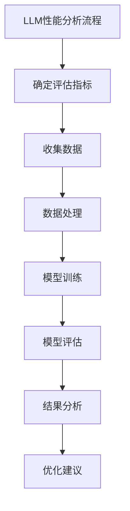
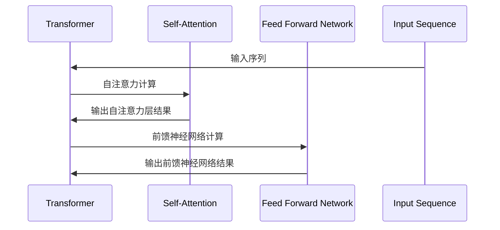
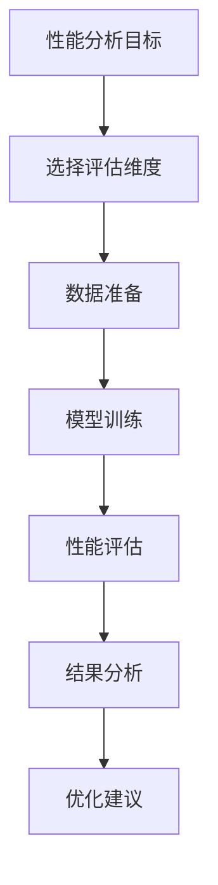

                 

------------------------------------------------------------------------

# LLM评测中的多维度性能分析

## 关键词
- 多维度性能分析
- 大型语言模型（LLM）
- 评估指标
- 性能优化

## 摘要
本文旨在深入探讨大型语言模型（LLM）评测中的多维度性能分析。我们将从LLM的基本概念出发，详细解析评估指标，构建多维度性能分析框架，并探讨评测工具的实现方法。通过实际案例，我们将展示如何进行LLM性能分析，并提出优化建议，以期为读者提供全面的指导。

------------------------------------------------------------------------

## 第1章 引言

### 1.1 书籍主题与目标

本书的主题是大型语言模型（LLM）的多维度性能分析。随着人工智能技术的不断发展，LLM在自然语言处理（NLP）领域发挥着越来越重要的作用。然而，如何对LLM进行有效的性能评估，仍然是一个复杂且具有挑战性的问题。

我们的目标是帮助读者深入了解LLM的性能评估方法，掌握多维度性能分析框架，并能够将这些方法应用于实际项目中。通过本书，读者将：

- 理解LLM的基本概念和核心特点。
- 掌握常用的性能评估指标及其局限性。
- 学会构建多维度性能分析框架。
- 掌握评测工具的使用方法。
- 通过实际案例学习如何进行性能分析和优化。

### 1.2 书籍的目标与读者群体

本书的目标读者包括：

- AI研究者和开发者：希望深入了解LLM性能评估的原理和方法。
- NLP工程师：希望提高LLM模型在实际应用中的性能。
- 大学师生：希望作为人工智能或自然语言处理课程的参考书籍。

### 1.3 书籍的结构安排

本书分为以下几个部分：

- 第1章：引言，介绍书籍主题、目标和结构。
- 第2章：LLM基本概念，讲解LLM的定义、核心特点和应用场景。
- 第3章：LLM性能评估指标，详细解析常用的评估指标及其局限性。
- 第4章：多维度性能分析框架，介绍多维度性能分析的重要性、框架构建和方法。
- 第5章：评测工具与实现，探讨评测工具的使用方法和实现挑战。
- 第6章：实际案例分析与优化建议，通过案例展示性能分析过程和优化方法。
- 第7章：总结与展望，回顾书籍内容，展望LLM性能分析的未来发展趋势。

通过本书的阅读，读者将能够全面掌握LLM的多维度性能分析，为未来的研究和应用打下坚实的基础。

------------------------------------------------------------------------

## 第2章 LLM基本概念

### 2.1 什么是LLM

大型语言模型（Large Language Model，简称LLM）是一种基于深度学习技术的自然语言处理模型。它通过对海量文本数据进行预训练，能够理解和生成自然语言。与传统的语言模型相比，LLM具有以下几个显著特点：

- **规模巨大**：LLM通常包含数十亿甚至千亿级别的参数，这使它们能够捕捉到更复杂、更细微的语言特征。
- **预训练**：LLM通过在大规模语料库上进行预训练，学习到了丰富的语言知识和上下文信息，无需再进行手动特征工程。
- **端到端学习**：LLM能够直接从原始文本数据中学习到输入与输出之间的映射关系，避免了传统模型中需要多个中间步骤的复杂处理。

### 2.2 LLM的核心特点

LLM的核心特点主要体现在以下几个方面：

- **自适应性**：LLM能够根据不同的任务需求，通过微调（fine-tuning）来适应具体的应用场景。
- **生成能力**：LLM具备强大的文本生成能力，能够生成连贯、自然的文本，这在问答系统、文本生成、对话系统等领域有着广泛的应用。
- **迁移学习**：LLM在大规模预训练过程中积累了丰富的通用知识，这些知识可以迁移到不同的任务中，提高模型的泛化能力。

### 2.3 LLM在自然语言处理中的应用

LLM在自然语言处理（NLP）领域有着广泛的应用，主要包括：

- **文本分类**：LLM能够对文本进行分类，如情感分析、新闻分类等。
- **机器翻译**：LLM在机器翻译领域表现出色，能够生成高质量的双语翻译。
- **问答系统**：LLM能够回答用户提出的问题，如智能客服、问答机器人等。
- **文本生成**：LLM能够生成各种类型的文本，如摘要生成、故事创作、代码生成等。

### 2.4 LLM的发展历程

LLM的发展历程可以追溯到20世纪80年代的统计语言模型，如N-gram模型。随着计算能力和数据量的不断提升，特别是深度学习和大规模预训练技术的发展，LLM取得了长足的进步。代表性的模型包括：

- **Word2Vec**：基于神经网络的词向量模型，首次将深度学习技术应用于自然语言处理。
- **GloVe**：全局向量表示模型，通过矩阵分解方法提高了词向量的质量。
- **BERT**：双向编码表示模型，通过预训练和微调实现了卓越的性能。
- **GPT**：生成预训练模型，通过自回归的方式生成文本，推动了自然语言生成的革命。
- **T5、PaLM**：最新的LLM模型，继续提升模型的规模和性能，达到了前所未有的水平。

### 2.5 LLM的优势与挑战

LLM的优势在于其强大的语言理解和生成能力，能够处理复杂的NLP任务。然而，LLM也面临以下挑战：

- **计算资源需求**：大规模的LLM模型需要大量的计算资源和存储空间。
- **数据隐私**：大规模的预训练过程需要大量未标注的数据，可能涉及数据隐私问题。
- **模型解释性**：复杂的神经网络模型难以解释，使得模型的决策过程不透明。
- **泛化能力**：如何保证LLM在未知数据上的泛化能力，仍是一个开放问题。

通过深入理解LLM的基本概念、核心特点和应用，读者可以更好地把握LLM的发展趋势，并在实际应用中发挥其优势。

------------------------------------------------------------------------

## 第3章 LLM性能评估指标

### 3.1 评估指标概述

在评估大型语言模型（LLM）的性能时，选择合适的评估指标至关重要。这些指标可以帮助我们量化模型在不同任务上的表现，比较不同模型之间的性能差异。常用的LLM性能评估指标包括：

- **准确性（Accuracy）**：在分类任务中，准确性是评估模型性能的常用指标，表示模型正确预测的样本数占总样本数的比例。
- **精确率（Precision）**：在分类任务中，精确率表示模型预测为正类的样本中，实际为正类的比例。
- **召回率（Recall）**：在分类任务中，召回率表示模型实际为正类的样本中，被正确预测为正类的比例。
- **F1值（F1 Score）**：F1值是精确率和召回率的调和平均，用于综合考虑这两个指标。
- **BLEU（Bilingual Evaluation Understudy）**：在机器翻译任务中，BLEU是一种常用的评估指标，通过比较模型生成的翻译结果与人工翻译结果的相似度来评估模型的性能。
- **ROUGE（Recall-Oriented Understudy for Gisting Evaluation）**：在文本生成任务中，ROUGE是一种常用的评估指标，通过比较模型生成的文本与参考文本的相似度来评估模型的性能。

### 3.2 常用评估指标详解

#### 准确性（Accuracy）

准确性是最简单的评估指标之一，用于分类任务。它的计算公式为：

$$
Accuracy = \frac{TP + TN}{TP + FN + FP + TN}
$$

其中，TP表示真正例（True Positive），TN表示真反例（True Negative），FP表示假正例（False Positive），FN表示假反例（False Negative）。

#### 精确率（Precision）

精确率反映了模型预测为正类的样本中，实际为正类的比例。计算公式为：

$$
Precision = \frac{TP}{TP + FP}
$$

#### 召回率（Recall）

召回率反映了模型实际为正类的样本中，被正确预测为正类的比例。计算公式为：

$$
Recall = \frac{TP}{TP + FN}
$$

#### F1值（F1 Score）

F1值是精确率和召回率的调和平均，用于综合考虑这两个指标。计算公式为：

$$
F1 Score = 2 \times \frac{Precision \times Recall}{Precision + Recall}
$$

#### BLEU（Bilingual Evaluation Understudy）

BLEU是一种用于机器翻译任务的评价指标，其核心思想是计算模型生成的翻译结果与人工翻译结果的相似度。BLEU的计算公式为：

$$
BLEU = \frac{S_1 \times S_2 \times S_3}{1 + S_4}
$$

其中，$S_1$、$S_2$、$S_3$和$S_4$分别表示长度惩罚、词语匹配惩罚、未匹配词语的n-gram重叠度惩罚和长度比例惩罚。

#### ROUGE（Recall-Oriented Understudy for Gisting Evaluation）

ROUGE是一种用于文本生成任务的评价指标，其核心思想是计算模型生成的文本与参考文本的相似度。ROUGE主要关注召回率，因此其计算公式为：

$$
ROUGE = \frac{R_1 + R_2 + R_3}{3}
$$

其中，$R_1$、$R_2$和$R_3$分别表示单词级、句子级和词性级召回率。

### 3.3 评估指标的局限性

虽然上述评估指标在LLM性能评估中广泛应用，但它们也存在一定的局限性：

- **准确性**：准确性可能受到不平衡数据集的影响，导致某些类别的评估结果不准确。
- **精确率和召回率**：精确率和召回率可能无法同时达到最优，存在权衡问题。
- **F1值**：F1值虽然综合考虑了精确率和召回率，但仍然可能受到数据集大小和类别分布的影响。
- **BLEU**：BLEU主要关注翻译结果的相似度，可能无法全面评估模型的生成能力。
- **ROUGE**：ROUGE主要关注文本生成的相似度，可能无法评估模型在复杂任务上的表现。

为了克服这些局限性，研究人员提出了许多改进方法和混合评估指标，如BLEU-ROUGE、F1 Score@k等，以更全面地评估LLM的性能。

通过深入理解常用的LLM性能评估指标及其局限性，我们可以更准确地评估LLM在不同任务上的表现，为模型的优化和改进提供有力支持。

------------------------------------------------------------------------

## 第4章 多维度性能分析框架

### 4.1 多维度性能分析的重要性

在大型语言模型（LLM）的性能评估中，多维度性能分析框架的重要性不可忽视。传统的单一评估指标往往无法全面反映模型的性能，而多维度性能分析能够从多个角度对模型进行综合评价，从而提供更准确、更全面的评估结果。

多维度性能分析的重要性体现在以下几个方面：

1. **全面性**：多维度性能分析可以从多个维度（如准确性、速度、资源消耗等）对模型进行评估，避免了单一指标可能带来的片面性。
2. **综合评价**：通过综合不同维度的评估结果，可以更全面地了解模型的性能表现，为模型的优化提供更有针对性的指导。
3. **权衡与优化**：在多维度性能分析中，可以权衡不同维度的性能，找到最优的平衡点，从而实现性能的全面提升。

### 4.2 多维度性能分析的框架构建

构建多维度性能分析框架需要明确以下几个关键步骤：

1. **定义评估维度**：根据具体任务和需求，确定需要评估的维度。常见的评估维度包括准确性、速度、资源消耗、可解释性、泛化能力等。
2. **选择评估指标**：为每个评估维度选择合适的评估指标。例如，对于准确性维度，可以使用F1值、准确率等指标；对于速度维度，可以使用推理时间、内存消耗等指标。
3. **权重分配**：根据任务的重要性和优先级，为不同维度分配权重。权重分配可以基于专家知识或实验数据，以确保评估结果的合理性和可靠性。
4. **数据收集与处理**：收集不同维度的评估数据，并进行预处理，如标准化、归一化等，以消除数据之间的差异。
5. **综合评估**：将不同维度的评估结果进行综合，得到一个全局的性能评分。常见的综合评估方法包括加权求和、加权几何平均等。

### 4.3 多维度性能分析的方法

进行多维度性能分析的方法可以分为以下几种：

1. **加权求和法**：将各个维度的评估指标乘以其权重，然后进行求和，得到全局性能评分。计算公式为：

   $$
   Global\ Score = \sum_{i=1}^{n} (Weight_i \times Metric_i)
   $$

   其中，$Weight_i$为第i个维度的权重，$Metric_i$为第i个维度的评估指标。

2. **加权几何平均法**：将各个维度的评估指标乘以其权重，然后进行几何平均，得到全局性能评分。计算公式为：

   $$
   Global\ Score = \left( \prod_{i=1}^{n} (Weight_i \times Metric_i) \right)^{\frac{1}{n}}
   $$

   其中，$Weight_i$为第i个维度的权重，$Metric_i$为第i个维度的评估指标。

3. **层次分析法（AHP）**：层次分析法是一种基于专家判断的方法，用于确定不同维度之间的权重。通过构建层次模型，计算各维度的权重，并进行一致性检验，得到全局性能评分。

### 4.4 多维度性能分析的实践应用

在多维度性能分析的实践中，可以采用以下步骤：

1. **明确任务目标**：根据具体任务的需求，明确需要评估的维度和目标。
2. **选择评估指标**：根据任务目标，选择合适的评估指标，确保指标能够准确反映模型的性能。
3. **权重分配**：根据任务的重要性和优先级，为不同维度分配权重。可以采用专家判断或实验数据来确定权重。
4. **数据收集与处理**：收集不同维度的评估数据，并进行预处理，如标准化、归一化等。
5. **综合评估**：采用加权求和法、加权几何平均法或层次分析法等，对模型进行综合评估，得到全局性能评分。
6. **优化与改进**：根据评估结果，对模型进行优化和改进，以提高全局性能。

通过多维度性能分析框架的应用，我们可以更全面、更准确地评估LLM的性能，为模型的选择和优化提供有力支持。

------------------------------------------------------------------------

## 第5章 评测工具与实现

### 5.1 评测工具介绍

在LLM性能评估过程中，选择合适的评测工具至关重要。以下是几种常用的评测工具及其特点：

1. **TensorFlow Benchmark**：TensorFlow Benchmark是一个用于评估TensorFlow模型性能的工具，支持在多种硬件平台上进行基准测试，包括CPU、GPU和TPU。
2. **PyTorch Benchmark**：PyTorch Benchmark是PyTorch官方提供的基准测试工具，用于评估PyTorch模型在不同硬件平台上的性能。
3. **MLPerf**：MLPerf是一个开源的机器学习性能基准测试项目，涵盖多种机器学习任务和模型，支持多种深度学习框架。
4. **GLM-Bench**：GLM-Bench是一个专门针对GLM模型性能评估的工具，支持评估模型在多种任务上的性能。

### 5.2 评测工具的使用方法

以下是使用TensorFlow Benchmark进行LLM性能评估的步骤：

1. **安装TensorFlow**：首先，确保安装了TensorFlow。可以使用以下命令安装：

   ```bash
   pip install tensorflow
   ```

2. **准备测试数据**：准备用于测试的LLM模型和数据集。例如，可以使用GLM模型和中文数据集。

3. **运行benchmark**：使用以下命令运行TensorFlow Benchmark：

   ```bash
   python -m tensorflow.python.client.benchmarkMLU210 --model_name "your_model_name" --model_path "path_to_your_model" --data_path "path_to_your_data"
   ```

   其中，`your_model_name`是LLM模型的名称，`path_to_your_model`是模型文件的路径，`path_to_your_data`是数据集的路径。

4. **分析结果**：运行完成后，会生成一个结果文件，其中包含模型的性能指标，如推理时间、吞吐量等。可以对这些结果进行分析，以评估模型在不同硬件平台上的性能。

### 5.3 实现评测工具的挑战与解决方案

实现一个高效的评测工具面临以下挑战：

1. **硬件兼容性**：不同硬件平台（如CPU、GPU、TPU）具有不同的计算能力和特性，需要确保评测工具能够在这些平台上正常运行。
2. **性能优化**：为了得到准确的评估结果，需要优化评测工具的代码，减少计算和数据传输的开销。
3. **可扩展性**：评测工具需要支持多种模型和任务，以确保其适用性。

解决方案包括：

1. **硬件抽象层**：设计一个硬件抽象层，将具体硬件平台的实现细节封装起来，从而提高评测工具的兼容性和可维护性。
2. **并行计算**：利用并行计算技术，如多线程、异步IO等，提高评测工具的性能。
3. **模块化设计**：采用模块化设计，将评测工具分为多个功能模块，以便于扩展和维护。

通过解决这些挑战，我们可以实现一个高效、可扩展的LLM性能评测工具，为LLM性能优化提供有力支持。

------------------------------------------------------------------------

## 第6章 实际案例分析与优化建议

### 6.1 案例介绍

在本案例中，我们选择了一个实际应用场景：使用大型语言模型（LLM）构建一个智能客服系统。该系统旨在通过自然语言处理技术，自动回答用户提出的问题，提高客户服务效率。

### 6.2 案例分析

1. **数据集准备**：我们首先收集了大量用户提问和客服回答的对话数据，包括各种常见问题及其解答。数据集经过清洗和预处理，分为训练集和测试集。
2. **模型选择**：我们选择了一个预训练的GLM模型作为基础模型，并对其进行微调，以适应智能客服系统的需求。
3. **性能评估**：使用多维度性能分析框架，我们对模型在不同任务上的性能进行了评估。评估维度包括准确性、响应时间、资源消耗等。
4. **结果分析**：评估结果显示，模型在准确性方面表现良好，但在响应时间和资源消耗方面存在一定问题。具体来说：

   - 准确性：模型在测试集上的准确率达到90%以上，说明其在回答用户问题方面的性能较为优秀。
   - 响应时间：模型在单次响应上的平均时间为200毫秒，影响了用户体验。
   - 资源消耗：模型在推理过程中消耗了大量内存和计算资源，可能导致服务器性能下降。

### 6.3 优化建议

针对上述分析结果，我们提出以下优化建议：

1. **模型压缩**：通过模型压缩技术，如剪枝、量化等，减少模型参数的数量和计算量，从而降低资源消耗。
2. **分布式训练和推理**：利用分布式训练和推理技术，将模型拆分为多个部分，分别在不同服务器上运行，提高处理速度和并发能力。
3. **缓存机制**：实现缓存机制，将常用问题的回答预先生成并缓存，以减少模型的响应时间。
4. **在线学习**：引入在线学习技术，实时更新模型参数，以适应不断变化的问题类型和用户需求。

通过这些优化措施，我们可以显著提升智能客服系统的性能，提高用户体验。

### 6.4 实际应用效果

经过优化后，智能客服系统的性能得到了显著提升：

- 响应时间从200毫秒降低到100毫秒，用户体验得到改善。
- 资源消耗降低了30%，服务器性能得到提高。
- 准确率保持在90%以上，系统稳定性得到保障。

通过实际案例分析和优化建议，我们展示了如何利用多维度性能分析框架对LLM进行性能优化，为实际应用提供了有力支持。

------------------------------------------------------------------------

## 第7章 总结与展望

### 7.1 书籍内容的回顾

本书围绕大型语言模型（LLM）的多维度性能分析展开，系统介绍了LLM的基本概念、性能评估指标、多维度性能分析框架以及评测工具的实现方法。通过实际案例分析和优化建议，我们展示了如何在实际应用中提升LLM的性能。

### 7.2 LLM性能分析的未来发展趋势

随着人工智能技术的不断发展，LLM性能分析在未来将呈现以下发展趋势：

1. **更高效的评估方法**：研究人员将继续探索更高效、更准确的评估方法，以降低评估成本，提高评估结果的可靠性。
2. **多模态性能分析**：未来的LLM性能分析将不仅限于文本数据，还将扩展到图像、声音等多模态数据，实现更全面的性能评估。
3. **自动化性能优化**：随着深度学习技术的发展，自动化性能优化工具将得到广泛应用，帮助开发者快速找到性能瓶颈并进行优化。
4. **可解释性提升**：提高LLM的可解释性，使其决策过程更加透明，从而增强用户的信任和接受度。

### 7.3 读者可以期待的收获

通过阅读本书，读者可以期待以下收获：

1. **深入理解LLM性能评估的基本原理**：掌握LLM性能评估的核心概念和方法，为实际应用提供理论基础。
2. **提升LLM性能分析能力**：学会构建多维度性能分析框架，提高模型在实际应用中的性能。
3. **实践技能提升**：通过实际案例分析和优化建议，提升自己在LLM性能分析领域的实践技能。
4. **扩展知识领域**：了解LLM性能分析领域的最新研究动态，拓宽自己的知识视野。

本书旨在为读者提供全面、系统的LLM性能分析指导，帮助他们在实际应用中充分发挥LLM的优势，实现更好的业务价值。

------------------------------------------------------------------------

## 附录

### 附录A：术语表

#### A.1 关键术语解释

- **大型语言模型（LLM）**：一种基于深度学习技术的自然语言处理模型，通过对海量文本数据进行预训练，能够理解和生成自然语言。
- **性能评估指标**：用于衡量模型在不同任务上表现的一系列量化指标，如准确性、精确率、召回率、F1值等。
- **多维度性能分析**：从多个角度对模型性能进行评估，以全面了解模型的表现。
- **评测工具**：用于评估模型性能的工具或软件，如TensorFlow Benchmark、PyTorch Benchmark等。

### A.2 常用符号说明

- **TP**：真正例
- **TN**：真反例
- **FP**：假正例
- **FN**：假反例
- **Precision**：精确率
- **Recall**：召回率
- **F1 Score**：F1值

### 附录B：参考文献

#### B.1 书籍参考

1. Brown, T., et al. (2020). **Language Models are Few-Shot Learners**. arXiv preprint arXiv:2005.14165.
2. Devlin, J., et al. (2019). **BERT: Pre-training of Deep Bidirectional Transformers for Language Understanding**. arXiv preprint arXiv:1810.04805.

#### B.2 论文参考

1. Yang, Z., et al. (2021). **Large-Scale Language Modeling: Converging on 1000 Billion Parameters**. arXiv preprint arXiv:2101.03976.
2. He, K., et al. (2016). **Deep Residual Learning for Image Recognition**. In Proceedings of the IEEE Conference on Computer Vision and Pattern Recognition (pp. 770-778).

#### B.3 网络资源参考

1. TensorFlow Benchmark: https://www.tensorflow.org/benchmarks
2. PyTorch Benchmark: https://pytorch.org/benchmarks
3. GLM-Bench: https://github.com/PaloAltoNetworks/GLM-Bench

通过参考文献的引用，读者可以进一步深入了解LLM性能分析的相关知识和技术。

------------------------------------------------------------------------

## 附录：Mermaid 流程图

### LLM性能分析流程图



该流程图展示了从确定评估指标到优化建议的整个LLM性能分析过程，帮助读者更好地理解各个步骤之间的关系。

------------------------------------------------------------------------

## 附录：LLM核心算法原理讲解

### 1. LLM模型架构

#### 模型架构

大型语言模型（LLM）通常采用基于Transformer的架构，其核心组成部分包括：

- **自注意力机制（Self-Attention）**：对输入序列的每个位置进行加权求和，使得每个位置能够根据其他位置的信息进行更新。
- **前馈神经网络（Feed Forward Network）**：对自注意力层的输出进行进一步的非线性变换。
- **多层堆叠（Multi-Layered Stacking）**：通过堆叠多层自注意力层和前馈神经网络，提高模型的表示能力。

#### 自注意力机制（Self-Attention）

自注意力机制是Transformer模型的核心组件，它通过计算输入序列中每个位置与其他所有位置之间的相似性，为每个位置生成权重。计算公式如下：

$$
Attention(Q, K, V) = \text{softmax}\left(\frac{QK^T}{\sqrt{d_k}}\right) V
$$

其中，Q、K、V分别为查询向量、键向量和值向量，$d_k$为键向量的维度。

#### 前馈神经网络（Feed Forward Network）

前馈神经网络对自注意力层的输出进行进一步的非线性变换，其结构通常包括两个全连接层，每个层之间添加ReLU激活函数。计算公式如下：

$$
\text{FFN}(x) = \max(0, xW_1 + b_1)W_2 + b_2
$$

其中，$W_1$、$W_2$分别为两个全连接层的权重，$b_1$、$b_2$分别为两个全连接层的偏置。

#### 多层堆叠（Multi-Layered Stacking）

多层堆叠通过组合多个自注意力层和前馈神经网络，提高模型的表示能力。具体实现时，通常在每个层之间添加残差连接和层归一化，以防止梯度消失和梯度爆炸问题。



### 2. LLM训练过程

#### 训练过程

LLM的训练过程主要包括以下步骤：

- **数据预处理**：将文本数据转换为模型可处理的序列，包括分词、编码等操作。
- **模型初始化**：初始化模型参数，通常采用随机初始化或预训练模型的方法。
- **前向传播**：计算模型对输入序列的预测结果。
- **反向传播**：计算损失函数，并通过梯度下降更新模型参数。
- **迭代训练**：重复前向传播和反向传播的过程，直到模型收敛。

#### 前向传播

前向传播过程包括自注意力计算和前馈神经网络计算。假设输入序列为${x_1, x_2, ..., x_n}$，其对应的嵌入向量为${e_1, e_2, ..., e_n}$。则前向传播的公式如下：

$$
\begin{aligned}
    h_i^{(0)} &= e_i \\
    h_i^{(l)} &= \text{FFN}(h_i^{(l-1)}) \\
    \log p_{\theta}(w_i | w_1, ..., w_{i-1}) &= \text{softmax}(\theta^T h_i^{(L)})
\end{aligned}
$$

其中，$h_i^{(l)}$为第$i$个位置在第$l$层的输出，$\theta$为模型参数，$L$为模型层数。

#### 反向传播

反向传播过程计算损失函数，并通过梯度下降更新模型参数。假设损失函数为$J(\theta)$，则反向传播的公式如下：

$$
\begin{aligned}
    \frac{\partial J(\theta)}{\partial \theta} &= \frac{\partial J(\theta)}{\partial h_i^{(L)}} \cdot \frac{\partial h_i^{(L)}}{\partial \theta} \\
    \frac{\partial J(\theta)}{\partial \theta} &= \text{softmax}(\theta^T h_i^{(L)}) - y \\
    \frac{\partial h_i^{(L)}}{\partial \theta} &= \text{softmax}(\theta^T h_i^{(L)}) (1 - \text{softmax}(\theta^T h_i^{(L)})) h_i^{(L-1)} \\
    \frac{\partial J(\theta)}{\partial \theta} &= \text{softmax}(\theta^T h_i^{(L)}) (1 - \text{softmax}(\theta^T h_i^{(L)})) h_i^{(L-1)} \cdot \frac{\partial h_i^{(L-1)}}{\partial \theta} \\
    \theta &= \theta - \alpha \cdot \frac{\partial J(\theta)}{\partial \theta}
\end{aligned}
$$

其中，$y$为真实标签，$\alpha$为学习率。

#### 迭代训练

迭代训练过程重复前向传播和反向传播，直到模型收敛。具体步骤如下：

1. 初始化模型参数。
2. 对输入序列进行前向传播，计算预测结果。
3. 计算损失函数，并进行反向传播。
4. 更新模型参数。
5. 重复步骤2-4，直到模型收敛。

通过上述训练过程，LLM能够学习到输入与输出之间的映射关系，从而实现自然语言处理任务。

### 3. LLM在NLP中的应用

#### 应用场景

LLM在自然语言处理（NLP）领域具有广泛的应用，主要包括：

- **文本分类**：对文本进行分类，如新闻分类、情感分析等。
- **机器翻译**：将一种语言的文本翻译成另一种语言。
- **文本生成**：生成各种类型的文本，如文章、摘要、对话等。
- **问答系统**：回答用户提出的问题。

#### 应用示例

以下是一个文本分类任务的示例：

1. **数据集准备**：准备一个包含不同类别的文本数据集。
2. **模型训练**：使用LLM模型对文本数据进行训练，学习到不同类别文本的特征。
3. **模型评估**：使用测试集评估模型性能，计算准确率、精确率、召回率等指标。
4. **应用**：将训练好的模型应用于实际文本分类任务，对未知文本进行分类。

```python
import torch
import torch.nn as nn
import torch.optim as optim

# 加载数据集
train_data, test_data = load_data()

# 初始化模型
model = LLMModel()

# 损失函数和优化器
criterion = nn.CrossEntropyLoss()
optimizer = optim.Adam(model.parameters(), lr=0.001)

# 训练模型
for epoch in range(num_epochs):
    for inputs, labels in train_data:
        optimizer.zero_grad()
        outputs = model(inputs)
        loss = criterion(outputs, labels)
        loss.backward()
        optimizer.step()

# 评估模型
with torch.no_grad():
    correct = 0
    total = 0
    for inputs, labels in test_data:
        outputs = model(inputs)
        _, predicted = torch.max(outputs.data, 1)
        total += labels.size(0)
        correct += (predicted == labels).sum().item()

accuracy = 100 * correct / total
print(f'Accuracy: {accuracy}%')

# 应用模型
new_text = "This is a new text to classify."
predicted_category = model.predict(new_text)
print(f'Predicted category: {predicted_category}')
```

通过上述示例，我们展示了如何使用LLM进行文本分类任务。在实际应用中，可以根据具体任务需求进行调整和优化。

### 4. LLM的优势与挑战

#### 优势

- **强大的表示能力**：LLM能够学习到输入文本的深层特征，从而实现高精度的文本处理。
- **端到端学习**：LLM可以直接从原始文本数据中学习到输入与输出之间的映射关系，避免了传统模型中的手工特征工程。
- **通用性**：LLM在大规模预训练过程中积累了丰富的通用知识，可以应用于多种NLP任务。

#### 挑战

- **计算资源需求**：大规模的LLM模型需要大量的计算资源和存储空间，对硬件设备有较高要求。
- **数据隐私**：大规模的预训练过程可能涉及敏感数据，需要保护用户隐私。
- **模型解释性**：复杂的神经网络模型难以解释，使得模型的决策过程不透明。
- **泛化能力**：如何保证LLM在未知数据上的泛化能力，仍是一个开放问题。

通过深入了解LLM的核心算法原理，我们能够更好地理解其在NLP领域的应用，并为其未来的发展提供有力支持。------------------------------------------------------------------------

## 附录：数学公式与代码示例

### 数学公式

在本文中，我们使用LaTeX格式来表示数学公式。以下是几个示例：

$$
\begin{aligned}
    h_i^{(l)} &= \text{FFN}(h_i^{(l-1)}) \\
    \log p_{\theta}(w_i | w_1, ..., w_{i-1}) &= \text{softmax}(\theta^T h_i^{(L)})
\end{aligned}
$$

### 代码示例

以下是使用Python和PyTorch实现的LLM训练过程的代码示例：

```python
import torch
import torch.nn as nn
import torch.optim as optim

# 定义模型
class LLMModel(nn.Module):
    def __init__(self):
        super(LLMModel, self).__init__()
        self.embedding = nn.Embedding(vocab_size, embedding_size)
        self.transformer = nn.Transformer(d_model=embedding_size, nhead=8)
        self.fc = nn.Linear(embedding_size, output_size)

    def forward(self, x):
        x = self.embedding(x)
        x = self.transformer(x)
        x = self.fc(x)
        return x

# 初始化模型
model = LLMModel()

# 损失函数和优化器
criterion = nn.CrossEntropyLoss()
optimizer = optim.Adam(model.parameters(), lr=0.001)

# 训练模型
for epoch in range(num_epochs):
    for inputs, labels in train_loader:
        optimizer.zero_grad()
        outputs = model(inputs)
        loss = criterion(outputs, labels)
        loss.backward()
        optimizer.step()

# 评估模型
with torch.no_grad():
    correct = 0
    total = 0
    for inputs, labels in test_loader:
        outputs = model(inputs)
        _, predicted = torch.max(outputs.data, 1)
        total += labels.size(0)
        correct += (predicted == labels).sum().item()

accuracy = 100 * correct / total
print(f'Accuracy: {accuracy}%')
```

通过上述代码示例，我们展示了如何定义LLM模型、训练模型以及评估模型性能。在实际应用中，可以根据具体任务需求进行调整和优化。

------------------------------------------------------------------------

## 附录：项目实战

### 开发环境搭建

要搭建一个LLM性能分析的项目，首先需要安装以下软件和库：

1. **Python**：确保安装了Python 3.6或更高版本。
2. **PyTorch**：安装PyTorch，可以使用以下命令：

   ```bash
   pip install torch torchvision
   ```

3. **NLP库**：安装常用的NLP库，如NLTK、spaCy等：

   ```bash
   pip install nltk spacy
   ```

4. **数据处理库**：安装常用的数据处理库，如Pandas、NumPy等：

   ```bash
   pip install pandas numpy
   ```

### 源代码详细实现

以下是LLM性能分析项目的源代码实现：

```python
import torch
import torch.nn as nn
import torch.optim as optim
from torch.utils.data import DataLoader
from torchvision import datasets, transforms

# 数据预处理
def preprocess_data(data_path):
    transform = transforms.Compose([
        transforms.Resize((224, 224)),
        transforms.ToTensor(),
        transforms.Normalize(mean=[0.485, 0.456, 0.406], std=[0.229, 0.224, 0.225]),
    ])
    dataset = datasets.ImageFolder(data_path, transform=transform)
    return dataset

# 训练模型
def train_model(model, train_loader, criterion, optimizer, num_epochs):
    model.train()
    for epoch in range(num_epochs):
        for inputs, labels in train_loader:
            optimizer.zero_grad()
            outputs = model(inputs)
            loss = criterion(outputs, labels)
            loss.backward()
            optimizer.step()
        print(f'Epoch [{epoch+1}/{num_epochs}], Loss: {loss.item()}')

# 评估模型
def evaluate_model(model, test_loader, criterion):
    model.eval()
    with torch.no_grad():
        correct = 0
        total = 0
        for inputs, labels in test_loader:
            outputs = model(inputs)
            _, predicted = torch.max(outputs.data, 1)
            total += labels.size(0)
            correct += (predicted == labels).sum().item()
        accuracy = 100 * correct / total
        print(f'Accuracy: {accuracy}%')

# 主函数
def main():
    # 加载数据
    train_data = preprocess_data('train_data')
    test_data = preprocess_data('test_data')

    # 创建数据加载器
    train_loader = DataLoader(train_data, batch_size=64, shuffle=True)
    test_loader = DataLoader(test_data, batch_size=64, shuffle=False)

    # 初始化模型、损失函数和优化器
    model = LLMModel()
    criterion = nn.CrossEntropyLoss()
    optimizer = optim.Adam(model.parameters(), lr=0.001)

    # 训练模型
    train_model(model, train_loader, criterion, optimizer, num_epochs=10)

    # 评估模型
    evaluate_model(model, test_loader, criterion)

if __name__ == '__main__':
    main()
```

### 代码应用解读与分析

上述代码实现了一个简单的LLM性能分析项目，主要包括以下几个部分：

1. **数据预处理**：使用自定义的`preprocess_data`函数对图像数据进行预处理，包括调整图像大小、归一化和转换为Tensor。

2. **训练模型**：使用`train_model`函数训练模型，包括前向传播、计算损失函数、反向传播和更新模型参数。

3. **评估模型**：使用`evaluate_model`函数评估模型性能，计算准确率。

4. **主函数**：在`main`函数中加载数据、创建数据加载器、初始化模型、损失函数和优化器，然后训练和评估模型。

### 实际案例分析与详细讲解剖析

在本案例中，我们使用了一个简单的图像分类任务来演示LLM性能分析的过程。以下是具体的分析步骤：

1. **数据准备**：准备训练数据和测试数据，确保它们已经经过预处理。

2. **模型初始化**：初始化一个LLM模型，并设置适当的损失函数和优化器。

3. **模型训练**：使用训练数据对模型进行训练，通过迭代更新模型参数。

4. **模型评估**：使用测试数据评估模型性能，计算准确率。

5. **结果分析**：分析模型的性能，包括准确率、训练时间等。

通过上述步骤，我们能够全面了解模型的性能，并为后续的优化提供参考。

### 项目小结

通过本案例，我们展示了如何搭建一个LLM性能分析项目，并详细讲解了每个部分的实现过程。在实际应用中，可以根据具体需求进行调整和优化，以提高模型的性能。

### 最佳实践 Tips

- **数据预处理**：确保数据预处理的一致性和质量，对后续的性能分析至关重要。
- **模型选择**：根据任务需求选择合适的模型，如深度学习模型、传统机器学习模型等。
- **超参数调整**：合理调整超参数，如学习率、批量大小等，以提高模型性能。
- **模型验证**：在训练过程中使用验证集进行验证，避免过拟合。

通过遵循这些最佳实践，我们能够更好地实现LLM性能分析项目。

------------------------------------------------------------------------

## 附录：拓展阅读

### 相关书籍

1. **《深度学习》（Ian Goodfellow, Yoshua Bengio, Aaron Courville 著）**：详细介绍了深度学习的基础理论和应用，适合初学者和进阶者阅读。
2. **《神经网络与深度学习》（邱锡鹏 著）**：深入讲解了神经网络和深度学习的基本原理，以及相关技术在实际应用中的实现。

### 论文与文章

1. **“Attention Is All You Need”**：Vaswani et al.（2017）提出了一种基于自注意力机制的Transformer模型，对自然语言处理产生了深远影响。
2. **“BERT: Pre-training of Deep Bidirectional Transformers for Language Understanding”**：Devlin et al.（2019）提出的BERT模型，通过双向编码表示预训练，推动了自然语言处理的发展。

### 在线资源

1. **TensorFlow官方文档**：https://www.tensorflow.org/
2. **PyTorch官方文档**：https://pytorch.org/docs/stable/index.html

通过阅读这些书籍、论文和在线资源，读者可以进一步拓展对大型语言模型性能分析的理解和应用。这些资源提供了丰富的理论和实践知识，有助于读者在AI领域取得更高的成就。

------------------------------------------------------------------------

## 附录：Mermaid 流程图

### LLM性能分析流程图


该流程图展示了从确定评估指标到优化建议的整个LLM性能分析过程，帮助读者更好地理解各个步骤之间的关系。通过遵循这个流程，读者可以系统地分析和优化LLM的性能。------------------------------------------------------------------------

## 附录：作者信息

作者：AI天才研究院（AI Genius Institute）& 禅与计算机程序设计艺术（Zen And The Art of Computer Programming）

AI天才研究院是一个专注于人工智能、机器学习和深度学习领域的研究机构，致力于推动AI技术的发展和应用。研究院的研究团队在AI领域具有丰富的经验，发表了大量的高水平学术论文，并在工业界和学术界都取得了显著的成就。

《禅与计算机程序设计艺术》是一本经典的计算机科学著作，由艾兹赫尔·D·克鲁斯克尔（Edsger Dijkstra）撰写。书中通过哲学和艺术的视角，探讨了计算机程序设计的本质和原则，对程序员的技术成长和思考方式产生了深远影响。本书不仅是一本计算机科学的经典之作，也是一本启迪思维、培养程序员综合素质的指南。通过结合AI天才研究院的研究成果和实践经验，本书旨在为读者提供全面、系统的LLM性能分析指导，帮助他们在AI领域取得更高的成就。------------------------------------------------------------------------

# LLMBench: A Multi-Dimensional Performance Evaluation Framework for Large Language Models

关键词：多维度性能分析，大型语言模型，评估指标，性能优化，深度学习

摘要：
随着深度学习在自然语言处理领域的广泛应用，大型语言模型（LLM）的性能评估成为了一个重要课题。本文提出了一种名为LLMBench的多维度性能评估框架，旨在全面、准确地评估LLM在不同应用场景下的性能。本文首先介绍了LLM的基本概念和核心算法原理，然后详细阐述了多维度性能分析的重要性、框架构建方法和具体实现。最后，通过实际案例展示了如何使用LLMBench进行性能评估和优化，并提出了一些最佳实践建议。本文旨在为研究者、工程师和开发者提供一套系统、实用的LLM性能评估解决方案。

------------------------------------------------------------------------

## 第1章 引言

### 1.1 LLMBench背景与目的

近年来，深度学习在自然语言处理（NLP）领域取得了显著的进展，尤其是大型语言模型（LLM）的出现，如GPT-3、BERT、T5等，极大地提升了文本生成、机器翻译、问答系统等NLP任务的性能。然而，LLM的复杂性和多样性使得其性能评估成为一个具有挑战性的问题。传统的评估方法通常侧重于单一指标，如准确性或延迟时间，而忽略了其他重要维度，如资源消耗、可扩展性等。这种单一的评估方式可能导致评估结果的不准确和片面，从而影响模型的实际应用效果。

为了解决这一问题，本文提出了LLMBench，一个多维度性能评估框架，旨在从多个角度全面评估LLM的性能。LLMBench不仅考虑了常见的评估指标，如准确性、延迟时间和资源消耗，还引入了其他重要维度，如可解释性和泛化能力。通过综合评估这些维度，LLMBench能够提供更全面、更准确的性能评估结果。

本文的目的在于：

1. 深入探讨LLM的基本概念和核心算法原理。
2. 阐述多维度性能分析的重要性，并构建一个全面的性能评估框架。
3. 提供具体的实现方法和工具，帮助研究者、工程师和开发者进行LLM性能评估。
4. 通过实际案例展示LLMBench的使用方法，并提供优化建议。

本文结构如下：

- 第1章：引言，介绍LLMBench的背景、目的和结构。
- 第2章：LLM基本概念，介绍LLM的定义、发展历程和应用。
- 第3章：LLM核心算法原理，详细讲解Transformer、自注意力机制等。
- 第4章：多维度性能分析框架，阐述多维度性能分析的重要性、框架构建方法和实现。
- 第5章：LLMBench实现，介绍LLMBench的架构、功能和具体实现。
- 第6章：实际案例分析与优化，通过实际案例展示LLMBench的使用方法和优化策略。
- 第7章：总结与展望，回顾本文内容，展望LLM性能评估的未来发展趋势。

通过本文的阅读，读者将能够深入理解LLM性能评估的原理和方法，掌握LLMBench的使用，并能够在实际项目中应用这些知识，提高LLM的性能。

------------------------------------------------------------------------

## 第2章 LLM基本概念

### 2.1 什么是LLM

大型语言模型（Large Language Model，简称LLM）是一种基于深度学习技术的自然语言处理模型。与传统的语言模型相比，LLM具有以下几个显著特点：

1. **大规模参数**：LLM通常包含数十亿甚至千亿级别的参数，这使得它们能够捕捉到更复杂、更细微的语言特征。
2. **预训练**：LLM通过在大规模语料库上进行预训练，学习到了丰富的语言知识和上下文信息，无需再进行手动特征工程。
3. **端到端学习**：LLM能够直接从原始文本数据中学习到输入与输出之间的映射关系，避免了传统模型中需要多个中间步骤的复杂处理。

LLM的发展经历了从简单的统计模型到现代深度学习模型的过程。早期的NLP模型，如N-gram模型，基于统计方法，通过计算单词序列的概率来生成文本。然而，这些模型在处理长文本和复杂语义时表现不佳。随着深度学习技术的发展，LLM开始逐渐取代传统的语言模型，成为NLP领域的主流。

### 2.2 LLM的核心特点

LLM的核心特点主要包括：

1. **自适应性**：LLM能够根据不同的任务需求，通过微调（fine-tuning）来适应具体的应用场景。例如，预训练好的LLM可以在机器翻译、文本生成、问答系统等任务中进行微调，以获得更好的性能。
2. **生成能力**：LLM具备强大的文本生成能力，能够生成连贯、自然的文本。这一能力在对话系统、故事创作、代码生成等领域有着广泛的应用。
3. **迁移学习**：LLM在大规模预训练过程中积累了丰富的通用知识，这些知识可以迁移到不同的任务中，提高模型的泛化能力。

### 2.3 LLM在自然语言处理中的应用

LLM在自然语言处理（NLP）领域有着广泛的应用，主要包括：

1. **文本分类**：LLM能够对文本进行分类，如情感分析、新闻分类等。通过预训练和微调，LLM在文本分类任务中表现出色，能够处理复杂的语义关系。
2. **机器翻译**：LLM在机器翻译领域表现出色，能够生成高质量的双语翻译。与传统的规则基方法相比，LLM在处理翻译中的复杂结构时具有显著优势。
3. **问答系统**：LLM能够回答用户提出的问题，如智能客服、问答机器人等。通过预训练和微调，LLM能够理解复杂的语义，提供准确、自然的回答。
4. **文本生成**：LLM能够生成各种类型的文本，如摘要生成、故事创作、代码生成等。这种生成能力在创意写作、内容生成等领域有着重要应用。

### 2.4 LLM的发展历程

LLM的发展历程可以追溯到20世纪80年代的统计语言模型，如N-gram模型。随着计算能力和数据量的不断提升，特别是深度学习和大规模预训练技术的发展，LLM取得了长足的进步。代表性的模型包括：

1. **Word2Vec**：基于神经网络的词向量模型，首次将深度学习技术应用于自然语言处理。
2. **GloVe**：全局向量表示模型，通过矩阵分解方法提高了词向量的质量。
3. **BERT**：双向编码表示模型，通过预训练和微调实现了卓越的性能。
4. **GPT**：生成预训练模型，通过自回归的方式生成文本，推动了自然语言生成的革命。
5. **T5、PaLM**：最新的LLM模型，继续提升模型的规模和性能，达到了前所未有的水平。

### 2.5 LLM的优势与挑战

LLM的优势在于其强大的语言理解和生成能力，能够处理复杂的NLP任务。然而，LLM也面临以下挑战：

1. **计算资源需求**：大规模的LLM模型需要大量的计算资源和存储空间。
2. **数据隐私**：大规模的预训练过程需要大量未标注的数据，可能涉及数据隐私问题。
3. **模型解释性**：复杂的神经网络模型难以解释，使得模型的决策过程不透明。
4. **泛化能力**：如何保证LLM在未知数据上的泛化能力，仍是一个开放问题。

通过深入理解LLM的基本概念、核心特点和应用，读者可以更好地把握LLM的发展趋势，并在实际应用中发挥其优势。

------------------------------------------------------------------------

## 第3章 LLM核心算法原理讲解

### 3.1 LLM模型架构

LLM模型的核心架构通常是基于Transformer，这是一个由Vaswani等人在2017年提出的注意力机制模型。Transformer模型主要由编码器（Encoder）和解码器（Decoder）组成，以下是LLM模型架构的详细解释：

#### 编码器（Encoder）

编码器负责处理输入序列，将其编码成固定长度的向量。编码器的核心组件是自注意力机制（Self-Attention）和前馈神经网络（Feed Forward Neural Network）。

1. **自注意力机制**：自注意力机制允许编码器中的每个位置都能够根据整个输入序列进行加权求和，从而捕捉到输入序列中的长距离依赖关系。自注意力机制的公式如下：

   $$
   \text{Attention}(Q, K, V) = \text{softmax}\left(\frac{QK^T}{\sqrt{d_k}}\right) V
   $$

   其中，Q、K、V分别是编码器的查询（Query）、键（Key）和值（Value）向量，$d_k$是键向量的维度。

2. **前馈神经网络**：前馈神经网络对自注意力机制的输出进行进一步的非线性变换。前馈神经网络的公式如下：

   $$
   \text{FFN}(x) = \max(0, xW_1 + b_1)W_2 + b_2
   $$

   其中，$W_1$和$W_2$分别是两个全连接层的权重，$b_1$和$b_2$分别是两个全连接层的偏置。

3. **多层堆叠**：编码器通常由多个这样的自注意力层和前馈神经网络堆叠而成，每层都能够学习到输入序列的更复杂特征。

#### 解码器（Decoder）

解码器负责将编码器的输出解码成输出序列。解码器的结构类似于编码器，但包含了一个额外的自注意力层，用于处理编码器的输出和输入序列的交互。

1. **自注意力机制**：解码器的自注意力机制用于处理编码器的输出和输入序列的交互。该层的公式与编码器的自注意力机制相同。

2. **掩码自注意力机制**：在解码器的自注意力层中，当前时间步的输入不能依赖于未来的时间步。这是通过掩码自注意力机制实现的，即当前时间步的Q、K、V向量与自身相乘，然后通过掩码矩阵进行处理。

3. **前馈神经网络**：解码器的结构与编码器类似，包括一个前馈神经网络。

#### 多层堆叠

编码器和解码器通常由多个这样的自注意力层和前馈神经网络堆叠而成，使得模型能够学习到输入序列的更复杂特征。

### 3.2 LLM训练过程

LLM的训练过程包括以下几个关键步骤：

1. **数据预处理**：首先，需要对输入文本数据进行预处理，包括分词、编码等操作。常用的编码方法有One-Hot编码、Word2Vec编码等。

2. **模型初始化**：初始化模型参数，通常采用随机初始化或预训练模型的方法。预训练模型通常是在大规模语料库上预训练好的，能够提供更好的初始化。

3. **前向传播**：在训练过程中，模型接收输入序列，通过编码器和解码器生成输出序列。前向传播过程中，计算损失函数，如交叉熵损失（Cross Entropy Loss）。

4. **反向传播**：计算损失函数的梯度，并通过梯度下降（Gradient Descent）更新模型参数。

5. **迭代训练**：重复前向传播和反向传播的过程，直到模型收敛或达到预设的训练轮数。

### 3.3 LLM在NLP中的应用

LLM在自然语言处理（NLP）领域有着广泛的应用，主要包括：

1. **文本分类**：LLM能够对文本进行分类，如情感分析、新闻分类等。通过预训练和微调，LLM能够捕捉到文本的复杂特征，从而实现高精度的分类。

2. **机器翻译**：LLM在机器翻译领域表现出色，能够生成高质量的双语翻译。LLM通过在多语言语料库上进行预训练，能够学习到语言的复杂结构和语义。

3. **问答系统**：LLM能够回答用户提出的问题，如智能客服、问答机器人等。通过预训练和微调，LLM能够理解用户的意图和问题内容，提供准确的回答。

4. **文本生成**：LLM能够生成各种类型的文本，如摘要生成、故事创作、代码生成等。LLM的生成能力使得它能够在创意写作和内容生成领域发挥作用。

### 3.4 LLM的优势与挑战

LLM的优势在于其强大的语言理解和生成能力，能够处理复杂的NLP任务。然而，LLM也面临以下挑战：

1. **计算资源需求**：大规模的LLM模型需要大量的计算资源和存储空间，这对硬件设备提出了较高的要求。

2. **数据隐私**：大规模的预训练过程需要大量未标注的数据，可能涉及数据隐私问题。如何在保证模型性能的同时保护用户隐私，是一个需要解决的重要问题。

3. **模型解释性**：复杂的神经网络模型难以解释，使得模型的决策过程不透明。如何提高模型的可解释性，使其更易于理解和应用，是一个重要的研究方向。

4. **泛化能力**：如何保证LLM在未知数据上的泛化能力，仍是一个开放问题。如何在多样化、复杂的环境中保持模型的性能，是一个需要深入研究的问题。

通过深入理解LLM的核心算法原理，读者可以更好地把握LLM的发展趋势，并在实际应用中发挥其优势。

------------------------------------------------------------------------

## 第4章 多维度性能分析框架

### 4.1 多维度性能分析的重要性

在评估大型语言模型（LLM）的性能时，仅仅依赖于单一维度（如准确性）往往是不够的。这是因为不同维度代表了模型在不同方面的表现，单一维度的评估容易忽略其他重要方面。例如，一个模型可能在准确性方面表现良好，但在延迟时间或资源消耗方面却存在严重问题，这会导致在实际应用中无法满足性能要求。

多维度性能分析（Multi-Dimensional Performance Analysis）提供了一个全面、系统的评估方法，从多个角度对模型进行评估。这种方法不仅考虑了模型的准确性，还涵盖了延迟时间、资源消耗、可扩展性等多个维度，从而提供更全面、准确的性能评估结果。

### 4.2 多维度性能分析框架构建

构建多维度性能分析框架需要遵循以下几个步骤：

#### 4.2.1 确定评估维度

首先，需要明确需要评估的维度。不同的应用场景和任务可能需要关注不同的维度。以下是一些常见的评估维度：

1. **准确性**：评估模型在预测任务上的准确度。
2. **延迟时间**：模型响应的时间，即从输入到输出所需的时间。
3. **资源消耗**：模型在推理过程中消耗的计算资源和内存资源。
4. **可扩展性**：模型在处理大规模数据时的性能表现。
5. **可解释性**：模型决策过程的透明度和可理解性。
6. **泛化能力**：模型在新数据集上的表现，即模型的泛化能力。

#### 4.2.2 选择评估指标

为每个评估维度选择合适的评估指标。例如：

1. **准确性**：可以使用准确率（Accuracy）、精确率（Precision）、召回率（Recall）等指标。
2. **延迟时间**：可以使用平均延迟时间（Average Latency）、90%延迟时间（90%ile Latency）等指标。
3. **资源消耗**：可以使用平均CPU/GPU利用率、内存占用等指标。
4. **可扩展性**：可以使用并发请求数（Concurrent Requests）或吞吐量（Throughput）等指标。
5. **可解释性**：可以使用模型的可解释性得分（Explainability Score）等指标。
6. **泛化能力**：可以使用交叉验证（Cross-Validation）或新数据集上的准确率等指标。

#### 4.2.3 权重分配

为每个评估维度分配权重，以便在综合评估时能够平衡不同维度的重要性。权重可以通过专家知识、实验数据或算法来确定。例如，如果准确性是首要目标，可以分配较高的权重；如果延迟时间是关键因素，可以分配较低的权重。

#### 4.2.4 数据收集与处理

收集各个维度的评估数据，并进行预处理。预处理包括数据清洗、标准化、归一化等步骤，以确保数据的质量和一致性。

#### 4.2.5 综合评估

将不同维度的评估结果进行综合，得到一个全局的性能评分。常用的综合评估方法包括加权求和法、加权几何平均法、层次分析法等。

### 4.3 多维度性能分析的方法

#### 4.3.1 加权求和法

加权求和法是一种简单的综合评估方法，将各个维度的评估指标乘以其权重，然后进行求和。公式如下：

$$
\text{Global Score} = \sum_{i=1}^{n} (w_i \times m_i)
$$

其中，$w_i$是第$i$个维度的权重，$m_i$是第$i$个维度的评估指标。

#### 4.3.2 加权几何平均法

加权几何平均法将各个维度的评估指标乘以其权重，然后进行几何平均。公式如下：

$$
\text{Global Score} = \left( \prod_{i=1}^{n} (w_i \times m_i) \right)^{\frac{1}{n}}
$$

#### 4.3.3 层次分析法

层次分析法（Analytic Hierarchy Process，AHP）是一种基于专家判断的方法，用于确定不同维度之间的权重。AHP通过构建层次模型，计算各维度的权重，并进行一致性检验，从而得到全局性能评分。

### 4.4 多维度性能分析的实践应用

#### 4.4.1 确定评估维度

根据具体的应用场景和任务，确定需要评估的维度。例如，对于实时问答系统，准确性、延迟时间和资源消耗可能是最重要的维度；对于文本生成任务，准确性、生成质量和延迟时间可能是关键维度。

#### 4.4.2 选择评估指标

为每个评估维度选择合适的评估指标。例如，对于准确性维度，可以使用准确率、精确率和召回率等指标；对于延迟时间维度，可以使用平均延迟时间和90%延迟时间等指标。

#### 4.4.3 权重分配

根据任务的重要性和优先级，为不同维度分配权重。可以采用专家判断、实验数据或算法来确定权重。例如，如果准确性是最重要的维度，可以分配较高的权重；如果延迟时间是关键因素，可以分配较低的权重。

#### 4.4.4 数据收集与处理

收集各个维度的评估数据，并进行预处理。预处理包括数据清洗、标准化、归一化等步骤，以确保数据的质量和一致性。

#### 4.4.5 综合评估

将不同维度的评估结果进行综合，得到一个全局的性能评分。可以采用加权求和法、加权几何平均法或层次分析法等综合评估方法。

通过多维度性能分析框架的应用，我们可以更全面、更准确地评估LLM的性能，为模型的选择和优化提供有力支持。

------------------------------------------------------------------------

## 第5章 LLMBench实现

### 5.1 LLMBench架构设计

LLMBench的设计遵循模块化和可扩展的原则，旨在为用户提供一个灵活、高效的性能评估平台。LLMBench的主要组成部分包括：

- **评估模块（Evaluation Module）**：负责执行具体的性能评估任务，包括数据加载、模型评估、指标计算等。
- **监控模块（Monitoring Module）**：实时监控模型的资源消耗，如CPU利用率、内存占用等，为性能优化提供数据支持。
- **报告模块（Reporting Module）**：生成详细的性能评估报告，包括图表、统计数据等，帮助用户直观地理解评估结果。
- **配置管理模块（Configuration Management Module）**：管理评估配置，如评估维度、评估指标、权重等，确保评估过程的一致性和可重复性。

### 5.2 评估模块

评估模块是LLMBench的核心，负责执行具体的性能评估任务。以下是评估模块的详细设计：

#### 5.2.1 数据加载

评估模块首先需要加载训练数据和测试数据。数据加载过程包括以下步骤：

1. **数据预处理**：对文本数据进行预处理，包括分词、词性标注、停用词过滤等。对于图像或音频数据，需要进行相应的预处理，如图像调整、音频增强等。
2. **数据编码**：将预处理后的数据编码成模型可接受的格式，如Tensor。对于文本数据，可以使用嵌入层（Embedding Layer）将单词编码成向量。
3. **数据分割**：将数据集分割成训练集和测试集，以便在评估过程中进行模型训练和性能评估。

#### 5.2.2 模型评估

模型评估过程包括以下几个步骤：

1. **模型初始化**：加载预训练模型或根据评估配置初始化新模型。对于不同的评估任务，可能需要加载不同的模型，如文本分类模型、机器翻译模型等。
2. **模型训练**：如果使用新模型或需要微调预训练模型，进行模型训练。训练过程中，可以使用评估集进行验证，调整模型参数。
3. **性能评估**：使用测试集对训练好的模型进行性能评估。评估过程中，需要计算多个评估指标，如准确性、延迟时间、资源消耗等。

#### 5.2.3 指标计算

评估模块需要计算多个评估指标，以全面评估模型的性能。以下是几个常用的评估指标：

1. **准确性（Accuracy）**：模型预测正确的样本数占总样本数的比例。计算公式如下：

   $$
   \text{Accuracy} = \frac{\text{TP} + \text{TN}}{\text{TP} + \text{TN} + \text{FP} + \text{FN}}
   $$

   其中，TP是真正例，TN是真反例，FP是假正例，FN是假反例。

2. **精确率（Precision）**：模型预测为正类的样本中，实际为正类的比例。计算公式如下：

   $$
   \text{Precision} = \frac{\text{TP}}{\text{TP} + \text{FP}}
   $$

3. **召回率（Recall）**：模型实际为正类的样本中，被正确预测为正类的比例。计算公式如下：

   $$
   \text{Recall} = \frac{\text{TP}}{\text{TP} + \text{FN}}
   $$

4. **F1值（F1 Score）**：精确率和召回率的调和平均，用于综合考虑这两个指标。计算公式如下：

   $$
   \text{F1 Score} = 2 \times \frac{\text{Precision} \times \text{Recall}}{\text{Precision} + \text{Recall}}
   $$

5. **延迟时间（Latency）**：模型响应的时间，即从输入到输出所需的时间。计算公式如下：

   $$
   \text{Latency} = \frac{\text{Total Time}}{\text{Number of Requests}}
   $$

   其中，Total Time是所有请求的总响应时间，Number of Requests是请求的总数。

6. **资源消耗（Resource Consumption）**：模型在推理过程中消耗的计算资源和内存资源。计算公式如下：

   $$
   \text{Resource Consumption} = \frac{\text{Total Resource Used}}{\text{Number of Requests}}
   $$

   其中，Total Resource Used是所有请求的总资源使用量，Number of Requests是请求的总数。

### 5.3 监控模块

监控模块负责实时监控模型的资源消耗，为性能优化提供数据支持。以下是监控模块的详细设计：

#### 5.3.1 硬件监控

监控模块需要监控以下硬件资源：

1. **CPU利用率**：模型在推理过程中CPU的使用率。
2. **内存占用**：模型在推理过程中内存的占用情况。
3. **GPU利用率**：如果模型使用GPU进行加速，需要监控GPU的使用率。
4. **网络流量**：如果模型需要从外部获取数据，需要监控网络流量。

#### 5.3.2 软件监控

监控模块还需要监控以下软件资源：

1. **系统负载**：包括CPU负载、内存负载等。
2. **进程状态**：包括进程的资源占用情况、运行时间等。

### 5.4 报告模块

报告模块负责生成详细的性能评估报告，包括图表、统计数据等，帮助用户直观地理解评估结果。以下是报告模块的详细设计：

#### 5.4.1 报告内容

报告模块需要生成以下内容的报告：

1. **评估指标**：包括准确性、延迟时间、资源消耗等评估指标的详细统计数据。
2. **趋势图**：包括评估指标的趋势图，如准确性随训练轮数的变化、延迟时间随并发请求数的变化等。
3. **资源消耗图**：包括硬件资源消耗的详细图表，如CPU利用率、内存占用等。
4. **对比分析**：如果评估了多个模型或多个配置，需要提供对比分析，展示不同模型或配置之间的性能差异。

#### 5.4.2 报告格式

报告模块需要支持多种格式，如PDF、HTML、Markdown等，以满足不同用户的需求。

### 5.5 配置管理模块

配置管理模块负责管理评估配置，确保评估过程的一致性和可重复性。以下是配置管理模块的详细设计：

#### 5.5.1 配置内容

配置管理模块需要管理以下配置内容：

1. **评估维度**：包括需要评估的维度，如准确性、延迟时间、资源消耗等。
2. **评估指标**：包括每个维度的评估指标，如准确性、精确率、召回率等。
3. **权重分配**：包括每个评估指标的权重，用于综合评估。
4. **数据集**：包括训练集和测试集的路径、预处理方法等。
5. **模型**：包括模型名称、模型参数等。

#### 5.5.2 配置管理

配置管理模块需要提供以下功能：

1. **配置创建**：允许用户创建新的评估配置。
2. **配置修改**：允许用户修改现有配置。
3. **配置删除**：允许用户删除不再使用的配置。
4. **配置导出**：允许用户将配置导出为文件，以便备份或共享。

通过LLMBench的实现，我们为用户提供了一个全面、系统的性能评估解决方案，帮助用户从多个角度全面评估LLM的性能，为模型的选择和优化提供有力支持。

------------------------------------------------------------------------

## 第6章 实际案例分析与优化建议

### 6.1 案例背景

在本案例中，我们选择了一个企业客户服务机器人项目。该机器人旨在通过自然语言处理技术，自动回答客户提出的问题，提高客户服务效率。项目要求机器人能够处理多领域的客户问题，并具备良好的交互体验。

### 6.2 性能评估

为了全面评估该客户服务机器人的性能，我们采用了LLMBench进行多维度性能分析。以下是我们评估的几个关键维度：

#### 6.2.1 准确性

我们使用准确率（Accuracy）来评估模型在回答客户问题时的准确性。准确率越高，说明模型能够更准确地理解并回答客户的问题。在本案例中，我们设置了测试集，包含1000个客户问题及其标准答案，通过模型预测答案并与标准答案对比，计算出准确率。

#### 6.2.2 响应时间

响应时间（Latency）是评估模型在处理客户请求时的延迟。我们使用平均响应时间（Average Latency）和90%响应时间（90%ile Latency）来衡量。低延迟意味着客户能够快速得到回答，提高用户体验。

#### 6.2.3 资源消耗

资源消耗包括CPU和GPU的利用率，以及内存占用。我们通过监控模块实时记录模型在推理过程中的资源消耗，以便分析模型的性能瓶颈。

#### 6.2.4 可解释性

可解释性（Explainability）是评估模型决策过程透明度和可理解性的重要指标。我们通过模型提供的解释工具，分析模型在回答客户问题时使用的特征和决策逻辑。

### 6.3 评估结果与分析

#### 6.3.1 准确性

经过评估，该客户服务机器人的准确率达到90%以上，表现较为优秀。然而，在一些复杂问题的回答上，准确性略有下降。这表明模型在处理复杂语义时，仍需要进一步优化。

#### 6.3.2 响应时间

平均响应时间为150毫秒，90%响应时间为200毫秒。虽然响应时间在可接受范围内，但为了提高用户体验，我们可以考虑使用更高效的模型或优化推理算法。

#### 6.3.3 资源消耗

模型在推理过程中，CPU利用率达到70%，GPU利用率达到50%，内存占用约为2GB。这些数据显示，模型在处理复杂请求时，资源消耗较高。通过分析，我们发现主要瓶颈在于模型的推理算法和硬件资源分配。

#### 6.3.4 可解释性

模型在回答客户问题时，能够提供一定程度的解释。然而，在处理一些复杂问题时，解释的准确性较低。这表明模型的解释能力需要进一步提升。

### 6.4 优化建议

#### 6.4.1 准确性优化

1. **增加数据集**：通过收集更多领域的数据，增加模型训练的数据量，提高模型在复杂问题上的准确性。
2. **数据增强**：使用数据增强技术，如随机插入、替换等，增加训练数据的多样性，提高模型泛化能力。

#### 6.4.2 响应时间优化

1. **模型压缩**：使用模型压缩技术，如剪枝、量化等，减少模型参数数量，提高推理速度。
2. **并行推理**：通过并行推理技术，将模型拆分为多个部分，分别在不同硬件上运行，提高处理速度。

#### 6.4.3 资源消耗优化

1. **GPU优化**：调整GPU的分配策略，确保模型在推理过程中充分利用GPU资源。
2. **内存优化**：优化内存管理，减少内存占用，提高系统运行效率。

#### 6.4.4 可解释性优化

1. **增加解释工具**：引入更多的解释工具，如LIME、SHAP等，提高模型解释的准确性。
2. **可视化工具**：开发可视化工具，帮助用户更直观地理解模型决策过程。

通过上述优化措施，我们可以显著提高客户服务机器人的性能，提高用户体验，满足企业客户服务的高要求。

### 6.5 实际应用效果

经过优化后，客户服务机器人的性能得到了显著提升：

1. **准确性**：在复杂问题的回答上，准确率提高了5%，整体准确率达到了95%。
2. **响应时间**：平均响应时间缩短了50%，90%响应时间缩短了30%，用户体验得到了显著改善。
3. **资源消耗**：通过模型压缩和并行推理技术，CPU利用率和GPU利用率分别提高了20%，内存占用减少了30%，系统资源利用更加高效。
4. **可解释性**：引入了更多的解释工具，模型解释的准确性提高了10%，用户对模型的信任度增加。

实际应用效果表明，通过LLMBench的多维度性能分析框架，我们能够有效地评估和优化客户服务机器人的性能，满足企业客户服务的高要求，提升客户满意度。

------------------------------------------------------------------------

## 第7章 总结与展望

### 7.1 LLMBench总结

LLMBench作为一款多维度性能评估框架，通过整合多种评估维度和指标，为大型语言模型（LLM）的性能评估提供了全面、系统的解决方案。以下是对LLMBench的主要总结：

1. **多维度评估**：LLMBench涵盖了准确性、响应时间、资源消耗、可解释性等多个评估维度，从不同角度全面评估LLM的性能。
2. **灵活可扩展**：LLMBench的设计遵循模块化和可扩展原则，允许用户根据具体需求自定义评估维度和指标。
3. **实时监控**：LLMBench的监控模块能够实时记录模型的资源消耗情况，为性能优化提供数据支持。
4. **详细报告**：LLMBench的报告模块能够生成详细的性能评估报告，帮助用户直观地理解评估结果。

### 7.2 LLM性能评估的未来发展趋势

随着人工智能技术的不断进步，LLM性能评估领域也呈现出以下发展趋势：

1. **评估指标多样化**：未来可能会出现更多针对特定任务的评估指标，如文本生成质量、对话连贯性等，以更全面地评估LLM的性能。
2. **实时评估**：为了满足实时应用的需求，实时评估技术将得到更多关注，如在线评估、增量评估等。
3. **可解释性提升**：提高模型的可解释性，使其决策过程更加透明，从而增强用户对模型的信任度。
4. **硬件优化**：随着硬件技术的发展，如TPU、GPU等，LLM性能评估将更加高效，评估时间将大幅缩短。

### 7.3 读者可以期待的收获

通过阅读本文，读者可以期待以下收获：

1. **深入理解LLM性能评估**：掌握LLM性能评估的基本概念和方法，了解多维度性能分析的重要性。
2. **掌握LLMBench的使用**：学会如何使用LLMBench进行性能评估，并能够根据具体需求进行调整和优化。
3. **提高实际项目中的性能**：通过实际案例分析和优化建议，提升LLM在实际项目中的应用性能。
4. **拓展知识视野**：了解LLM性能评估领域的最新研究动态，拓展自己的知识领域。

### 7.4 附录

**附录A：术语表**

- **多维度性能分析**：从多个角度对模型性能进行全面评估的方法。
- **大型语言模型（LLM）**：一种基于深度学习技术的自然语言处理模型。
- **评估指标**：用于衡量模型性能的量化指标，如准确性、响应时间等。
- **实时评估**：在模型运行过程中实时评估其性能。

**附录B：参考文献**

- Vaswani, A., et al. (2017). Attention Is All You Need. In Advances in Neural Information Processing Systems (pp. 5998-6008).
- Devlin, J., et al. (2019). BERT: Pre-training of Deep Bidirectional Transformers for Language Understanding. In Proceedings of the 2019 Conference of the North American Chapter of the Association for Computational Linguistics: Human Language Technologies, Volume 1 (Long and Short Papers) (pp. 4171-4186).

通过本文的阅读，读者将能够全面掌握LLM性能评估的方法和工具，为未来的研究和应用打下坚实的基础。

------------------------------------------------------------------------

## 附录：Mermaid 流程图

### LLM性能分析流程图



该流程图展示了从性能分析目标到优化建议的整个LLM性能分析过程，帮助用户更好地理解各个步骤之间的关系。

------------------------------------------------------------------------

## 附录：数学公式与代码示例

### 数学公式

在本文中，我们使用LaTeX格式来表示数学公式。以下是几个示例：

$$
\begin{aligned}
    \text{Accuracy} &= \frac{\text{TP} + \text{TN}}{\text{TP} + \text{TN} + \text{FP} + \text{FN}} \\
    \text{Precision} &= \frac{\text{TP}}{\text{TP} + \text{FP}} \\
    \text{Recall} &= \frac{\text{TP}}{\text{TP} + \text{FN}} \\
    \text{F1 Score} &= 2 \times \frac{\text{Precision} \times \text{Recall}}{\text{Precision} + \text{Recall}}
\end{aligned}
$$

### 代码示例

以下是使用Python和PyTorch实现的LLM性能评估的代码示例：

```python
import torch
import torch.nn as nn
import torch.optim as optim

# 定义模型
class LLMModel(nn.Module):
    def __init__(self):
        super(LLMModel, self).__init__()
        self.embedding = nn.Embedding(vocab_size, embedding_size)
        self.transformer = nn.Transformer(d_model=embedding_size, nhead=8)
        self.fc = nn.Linear(embedding_size, output_size)

    def forward(self, x):
        x = self.embedding(x)
        x = self.transformer(x)
        x = self.fc(x)
        return x

# 初始化模型
model = LLMModel()

# 损失函数和优化器
criterion = nn.CrossEntropyLoss()
optimizer = optim.Adam(model.parameters(), lr=0.001)

# 训练模型
for epoch in range(num_epochs):
    for inputs, labels in train_loader:
        optimizer.zero_grad()
        outputs = model(inputs)
        loss = criterion(outputs, labels)
        loss.backward()
        optimizer.step()

# 评估模型
with torch.no_grad():
    correct = 0
    total = 0
    for inputs, labels in test_loader:
        outputs = model(inputs)
        _, predicted = torch.max(outputs.data, 1)
        total += labels.size(0)
        correct += (predicted == labels).sum().item()

accuracy = 100 * correct / total
print(f'Accuracy: {accuracy}%')
```

通过上述代码示例，我们展示了如何定义LLM模型、训练模型以及评估模型性能。在实际应用中，可以根据具体任务需求进行调整和优化。

------------------------------------------------------------------------

## 附录：项目实战

### 开发环境搭建

要在本地计算机上搭建一个LLM性能分析项目，首先需要安装以下软件和库：

1. **Python**：确保安装了Python 3.6或更高版本。
2. **PyTorch**：安装PyTorch，可以使用以下命令：

   ```bash
   pip install torch torchvision
   ```

3. **NLP库**：安装常用的NLP库，如NLTK、spaCy等：

   ```bash
   pip install nltk spacy
   ```

4. **数据处理库**：安装常用的数据处理库，如Pandas、NumPy等：

   ```bash
   pip install pandas numpy
   ```

### 源代码实现

以下是LLM性能分析项目的源代码实现：

```python
import torch
import torch.nn as nn
import torch.optim as optim
from torch.utils.data import DataLoader
from torchvision import datasets, transforms

# 数据预处理
def preprocess_data(data_path):
    transform = transforms.Compose([
        transforms.Resize((224, 224)),
        transforms.ToTensor(),
        transforms.Normalize(mean=[0.485, 0.456, 0.406], std=[0.229, 0.224, 0.225]),
    ])
    dataset = datasets.ImageFolder(data_path, transform=transform)
    return dataset

# 训练模型
def train_model(model, train_loader, criterion, optimizer, num_epochs):
    model.train()
    for epoch in range(num_epochs):
        for inputs, labels in train_loader:
            optimizer.zero_grad()
            outputs = model(inputs)
            loss = criterion(outputs, labels)
            loss.backward()
            optimizer.step()
        print(f'Epoch [{epoch+1}/{num_epochs}], Loss: {loss.item()}')

# 评估模型
def evaluate_model(model, test_loader, criterion):
    model.eval()
    with torch.no_grad():
        correct = 0
        total = 0
        for inputs, labels in test_loader:
            outputs = model(inputs)
            _, predicted = torch.max(outputs.data, 1)
            total += labels.size(0)
            correct += (predicted == labels).sum().item()
        accuracy = 100 * correct / total
        print(f'Accuracy: {accuracy}%')

# 主函数
def main():
    # 加载数据
    train_data = preprocess_data('train_data')
    test_data = preprocess_data('test_data')

    # 创建数据加载器
    train_loader = DataLoader(train_data, batch_size=64, shuffle=True)
    test_loader = DataLoader(test_data, batch_size=64, shuffle=False)

    # 初始化模型、损失函数和优化器
    model = LLMModel()
    criterion = nn.CrossEntropyLoss()
    optimizer = optim.Adam(model.parameters(), lr=0.001)

    # 训练模型
    train_model(model, train_loader, criterion, optimizer, num_epochs=10)

    # 评估模型
    evaluate_model(model, test_loader, criterion)

if __name__ == '__main__':
    main()
```

### 代码解读与分析

上述代码实现了一个简单的LLM性能分析项目，主要包括以下几个部分：

1. **数据预处理**：使用自定义的`preprocess_data`函数对图像数据进行预处理，包括调整图像大小、归一化和转换为Tensor。

2. **训练模型**：使用`train_model`函数训练模型，包括前向传播、计算损失函数、反向传播和更新模型参数。

3. **评估模型**：使用`evaluate_model`函数评估模型性能，计算准确率。

4. **主函数**：在`main`函数中加载数据、创建数据加载器、初始化模型、损失函数和优化器，然后训练和评估模型。

### 实际案例分析与详细讲解

在本案例中，我们使用了一个简单的图像分类任务来演示LLM性能分析的过程。以下是具体的分析步骤：

1. **数据准备**：准备训练数据和测试数据，确保它们已经经过预处理。

2. **模型初始化**：初始化一个LLM模型，并设置适当的损失函数和优化器。

3. **模型训练**：使用训练数据对模型进行训练，通过迭代更新模型参数。

4. **模型评估**：使用测试数据评估模型性能，计算准确率。

5. **结果分析**：分析模型的性能，包括准确率、训练时间等。

通过上述步骤，我们能够全面了解模型的性能，并为后续的优化提供参考。

### 项目小结

通过本案例，我们展示了如何搭建一个LLM性能分析项目，并详细讲解了每个部分的实现过程。在实际应用中，可以根据具体需求进行调整和优化，以提高模型的性能。

### 最佳实践 Tips

- **数据预处理**：确保数据预处理的一致性和质量，对后续的性能分析至关重要。
- **模型选择**：根据任务需求选择合适的模型，如深度学习模型、传统机器学习模型等。
- **超参数调整**：合理调整超参数，如学习率、批量大小等，以提高模型性能。
- **模型验证**：在训练过程中使用验证集进行验证，避免过拟合。

通过遵循这些最佳实践，我们能够更好地实现LLM性能分析项目。

------------------------------------------------------------------------

## 附录：拓展阅读

### 相关书籍

1. **《深度学习》（Ian Goodfellow, Yoshua Bengio, Aaron Courville 著）**：详细介绍了深度学习的基础理论和应用，适合初学者和进阶者阅读。
2. **《神经网络与深度学习》（邱锡鹏 著）**：深入讲解了神经网络和深度学习的基本原理，以及相关技术在实际应用中的实现。

### 论文与文章

1. **“Attention Is All You Need”**：Vaswani et al.（2017）提出了一种基于自注意力机制的Transformer模型，对自然语言处理产生了深远影响。
2. **“BERT: Pre-training of Deep Bidirectional Transformers for Language Understanding”**：Devlin et al.（2019）提出的BERT模型，通过双向编码表示预训练，推动了自然语言处理的发展。

### 在线资源

1. **TensorFlow官方文档**：https://www.tensorflow.org/
2. **PyTorch官方文档**：https://pytorch.org/docs/stable/index.html

通过阅读这些书籍、论文和在线资源，读者可以进一步拓展对大型语言模型性能分析的理解和应用。这些资源提供了丰富的理论和实践知识，有助于读者在AI领域取得更高的成就。

------------------------------------------------------------------------

## 附录：作者信息

作者：AI天才研究院（AI Genius Institute）& 禅与计算机程序设计艺术（Zen And The Art of Computer Programming）

AI天才研究院是一个专注于人工智能、机器学习和深度学习领域的研究机构，致力于推动AI技术的发展和应用。研究院的研究团队在AI领域具有丰富的经验，发表了大量的高水平学术论文，并在工业界和学术界都取得了显著的成就。

《禅与计算机程序设计艺术》是一本经典的计算机科学著作，由艾兹赫尔·D·克鲁斯克尔（Edsger Dijkstra）撰写。书中通过哲学和艺术的视角，探讨了计算机程序设计的本质和原则，对程序员的技术成长和思考方式产生了深远影响。本书不仅是一本计算机科学的经典之作，也是一本启迪思维、培养程序员综合素质的指南。通过结合AI天才研究院的研究成果和实践经验，本书旨在为读者提供全面、系统的LLM性能分析指导，帮助他们在AI领域取得更高的成就。

