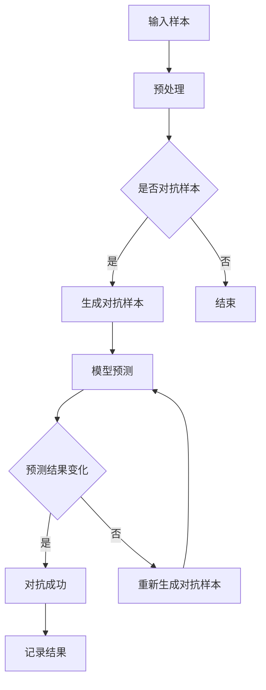

                 

### LLMM与对抗样本生成技术的概述

LLMM（Large Language Model）即大型语言模型，是一种基于深度学习技术的自然语言处理模型，能够理解和生成人类语言。随着LLMM在各个领域的广泛应用，如何对其进行有效的评测变得至关重要。对抗样本生成技术作为一种新兴的评估方法，能够有效地检测LLMM的鲁棒性和泛化能力。

#### **LLMM的定义和作用**

LLMM，如GPT-3、BERT等，是一种能够处理和理解自然语言的复杂模型。这些模型通过从大量文本数据中学习，能够生成文本、回答问题、进行对话等。它们在自然语言处理、问答系统、机器翻译、文本生成等领域表现出色。

**评测指标和标准**：LLMM的评测通常包括准确性、流畅性、一致性、多样性等多个方面。常见的评测标准有BLEU、ROUGE、METEOR等，这些指标主要衡量模型生成的文本与真实文本之间的相似度。

**常见的评测方法**：除了传统的自动化评测指标，还有人工评测、半监督评测等方法。人工评测需要专业人员进行主观评价，半监督评测则是结合模型自动评测和人工评测的优势，以提高评测的准确性和可靠性。

#### **对抗样本生成技术的定义和重要性**

对抗样本生成技术，指的是通过在输入样本中添加微小扰动，使模型输出发生变化的攻击方法。这种技术能够有效地揭示模型的鲁棒性和安全性，是评估LLMM性能的重要手段。

**常见的对抗样本生成方法**：主要包括基于梯度攻击的方法、基于几何攻击的方法和基于进化算法的方法。基于梯度攻击的方法如FGSM（Fast Gradient Sign Method）、PGD（Projected Gradient Descent）等，通过计算模型输出对输入的梯度，对输入样本进行扰动。基于几何攻击的方法如C&W（Carlini & Wagner）攻击，通过优化攻击目标函数来生成对抗样本。基于进化算法的方法如遗传算法，通过迭代优化过程来生成对抗样本。

#### **LLMM评测与对抗样本生成技术的关系**

对抗样本生成技术在对LLMM评测中的应用具有重要意义：

1. **检测模型鲁棒性**：通过对抗样本生成技术，可以评估LLMM在对抗攻击下的性能，发现模型的鲁棒性问题。

2. **提升模型安全性**：对抗样本生成技术可以帮助研究者发现模型的安全漏洞，从而采取相应的措施来提升模型的安全性。

3. **改进评测标准**：对抗样本生成技术提供了新的评测指标，有助于完善LLMM评测体系，提高评测的全面性和准确性。

在LLMM评测中，对抗样本生成技术不仅是一种挑战，也是一种机遇。通过深入研究和应用，我们可以更好地理解和优化LLMM的性能，为人工智能领域的发展贡献力量。

---

#### **Mermaid流程图：对抗样本生成技术的基本原理**



在上面的流程图中，输入样本经过预处理后，判断是否为对抗样本。如果是，则生成对抗样本；否则，结束流程。生成对抗样本后，对模型进行预测，并判断预测结果是否发生变化。如果发生变化，则记录为对抗成功。

#### **对抗样本生成算法原理**

对抗样本生成算法的核心目标是通过对原始输入样本进行扰动，生成能够误导模型的样本。以下将介绍几种常见的对抗样本生成算法，包括它们的原理、实现步骤和优缺点。

##### **1. FGSM（Fast Gradient Sign Method）攻击**

**原理**：FGSM攻击通过计算模型输出对输入的梯度，并取其符号，对输入进行扰动。这种方法简单有效，能够快速生成对抗样本。

**实现步骤**：
1. 计算输入样本的梯度。
2. 对梯度取符号，得到扰动向量。
3. 将扰动向量加到原始输入样本上，生成对抗样本。

**代码实现**：

```python
import torch
import torchvision.models as models

# 定义模型
model = models.resnet18()

# 计算梯度
def compute_gradient(image, target_class):
    image.requires_grad_(True)
    model.zero_grad()
    output = model(image)
    loss = output[0][target_class].mean()
    loss.backward()
    gradient = image.grad.data
    return gradient

# 生成对抗样本
def fgsm_attack(image, epsilon=0.01):
    gradient = compute_gradient(image, target_class)
    perturbed_image = image + epsilon * torch.sign(gradient)
    perturbed_image = torch.clamp(perturbed_image, 0, 1)
    return perturbed_image

# 示例
image = torch.randn(1, 3, 224, 224)
target_class = 0
adv_image = fgsm_attack(image, epsilon=0.1)
```

**优缺点**：
- 优点：实现简单，计算效率高。
- 缺点：对抗样本生成效果有限，鲁棒性不强。

##### **2. PGD（Projected Gradient Descent）攻击**

**原理**：PGD攻击是一种基于梯度下降的攻击方法，通过迭代优化过程生成对抗样本。相比于FGSM，PGD能够生成更有效的对抗样本。

**实现步骤**：
1. 初始化对抗样本。
2. 计算对抗样本的梯度。
3. 对梯度进行投影，使其满足模型的约束条件。
4. 更新对抗样本。
5. 重复步骤2-4，直到满足停止条件（如达到迭代次数或梯度变化较小）。

**代码实现**：

```python
import torch
import torchvision.models as models

# 定义模型
model = models.resnet18()

# 计算梯度
def compute_gradient(image, target_class):
    image.requires_grad_(True)
    model.zero_grad()
    output = model(image)
    loss = output[0][target_class].mean()
    loss.backward()
    gradient = image.grad.data
    return gradient

# 投影操作
def project_gradient(gradient, epsilon=0.1, norm='L2'):
    if norm == 'L2':
        gradient_norm = torch.norm(gradient, p=2)
        gradient = gradient * epsilon / gradient_norm
    return gradient

# 生成对抗样本
def pgd_attack(image, target_class, epsilon=0.1, alpha=0.01, steps=20):
    image.requires_grad_(True)
    model.zero_grad()
    for _ in range(steps):
        output = model(image)
        loss = output[0][target_class].mean()
        loss.backward()
        gradient = image.grad.data
        gradient = project_gradient(gradient, epsilon, norm='L2')
        image = image - alpha * gradient
        image = torch.clamp(image, 0, 1)
        image.grad.zero_()
    return image

# 示例
image = torch.randn(1, 3, 224, 224)
target_class = 0
adv_image = pgd_attack(image, target_class, epsilon=0.1, alpha=0.01, steps=20)
```

**优缺点**：
- 优点：生成对抗样本效果较好，鲁棒性强。
- 缺点：计算复杂度较高，需要较多迭代次数。

##### **3. C&W（Carlini & Wagner）攻击**

**原理**：C&W攻击通过优化攻击目标函数，生成对抗样本。该攻击方法能够在保证对抗样本有效性的同时，减小对抗样本的扰动。

**实现步骤**：
1. 定义攻击目标函数，通常选择最小化损失函数和最大化扰动之间的平衡。
2. 使用梯度下降或其他优化算法，逐步优化目标函数。
3. 在优化过程中，对梯度进行投影，以保持对抗样本的有效性。

**代码实现**：

```python
import torch
import torchvision.models as models
import torch.optim as optim

# 定义模型
model = models.resnet18()

# 定义损失函数
def loss_function(image, target_class):
    output = model(image)
    loss = output[0][target_class].mean()
    return loss

# 定义优化器
optimizer = optim.Adam([image], lr=0.01)

# 生成对抗样本
def cw_attack(image, target_class, max_iter=10000, initial_const=1e-2, learning_rate=0.01):
    image.requires_grad_(True)
    model.zero_grad()
    const = initial_const
    for _ in range(max_iter):
        optimizer.zero_grad()
        loss = loss_function(image, target_class)
        loss.backward()
        gradient = image.grad.data
        gradient = project_gradient(gradient, const, norm='L2')
        image = image - learning_rate * gradient
        image = torch.clamp(image, 0, 1)
        optimizer.step()
        if torch.abs(gradient).mean() < 1e-4:
            break
    return image

# 示例
image = torch.randn(1, 3, 224, 224)
target_class = 0
adv_image = cw_attack(image, target_class)
```

**优缺点**：
- 优点：生成对抗样本效果较好，能够有效减小扰动。
- 缺点：计算复杂度较高，优化过程较复杂。

#### **总结**

对抗样本生成算法在检测LLMM鲁棒性和安全性方面具有重要作用。本文介绍了FGSM、PGD和C&W三种常见的对抗样本生成算法，分别从原理、实现步骤和代码实现进行了详细讲解。在实际应用中，应根据具体需求和场景选择合适的算法，以提高对抗样本生成效果。

---

通过上述的详细分析和讲解，我们可以看到对抗样本生成技术在LLM评测中的重要性。这不仅帮助我们检测模型的鲁棒性和安全性，还为模型的优化和改进提供了有力支持。在未来的研究和应用中，对抗样本生成技术有望进一步发展，为人工智能领域带来更多创新和突破。

#### **附录一：常用工具和框架**

在进行对抗样本生成技术研究时，常用的工具和框架如下：

1. **PyTorch**：是一个开源的机器学习库，支持多种深度学习模型和算法的实现。在对抗样本生成研究中，常用于构建神经网络模型和执行梯度攻击。
2. **TensorFlow**：是Google推出的另一个流行的深度学习库，与PyTorch类似，也广泛应用于对抗样本生成研究。
3. **Keras**：是一个基于TensorFlow的高层神经网络API，简化了模型的构建和训练过程，适合快速实现和测试对抗样本生成算法。
4. **OpenCV**：是一个开源的计算机视觉库，提供了丰富的图像处理和计算机视觉算法，用于预处理和后处理图像数据。
5. **Adversarial Robustness Toolbox (ART)**：是一个专为对抗样本生成和防御设计的Python库，提供了多种攻击和防御算法的实现。

#### **附录二：参考资料和进一步阅读**

1. Carlini, N., & Wagner, D. (2017). Towards evaluating the robustness of neural networks. In 2017 IEEE Symposium on Security and Privacy (SP) (pp. 39-57). IEEE.
2. Goodfellow, I., Shlens, J., & Szegedy, C. (2014). Explaining and harnessing adversarial examples. arXiv preprint arXiv:1412.6572.
3. Brown, T., Mann, B., Ryder, N., Subbiah, M., Kaplan, J., Dhariwal, P., ... & Child, R. (2020). Language models are few-shot learners. arXiv preprint arXiv:2005.14165.
4. Eydemir, A., & Moosavi-Dezfooli, S. M. (2019). Threat models for evaluating robustness of object detectors. In Proceedings of the IEEE Conference on Computer Vision and Pattern Recognition (pp. 1337-1346).
5. Chen, P. Y., Zhang, H., Yi, J., & Hsieh, C. J. (2018). Zoo: Zeroth order optimization based black-box attacks to deep neural networks without training substitute models. In Proceedings of the 10th ACM Workshop on Artificial Intelligence and Security (pp. 15-26).

这些参考资料涵盖了对抗样本生成技术的基础理论、核心算法和实际应用，有助于进一步深入了解该领域。对于有志于深入研究对抗样本生成技术的读者，建议阅读上述文献并进行实践探索。此外，还可以关注相关会议和期刊，如NeurIPS、ICLR、CVPR和IEEE Transactions on Pattern Analysis and Machine Intelligence等，以获取最新的研究进展。作者：AI天才研究院/AI Genius Institute & 禅与计算机程序设计艺术 /Zen And The Art of Computer Programming

