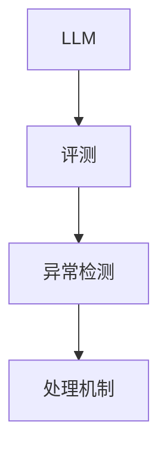

                 

## LLMS评测中的异常检测与处理机制

### 关键词
- **LLM**（大型语言模型）
- **评测**（评估与测试）
- **异常检测**（Anomaly Detection）
- **处理机制**（Mitigation Mechanisms）

### 摘要
本文深入探讨了大型语言模型（LLM）评测中异常检测与处理机制的重要性。文章首先介绍了LLM的基本概念及其在自然语言处理中的应用，随后阐述了评测的必要性。重点在于异常检测机制，包括核心算法原理、数学模型和实际案例的讲解。最后，文章探讨了异常处理的方法，并提出了最佳实践和小结。

### 引言

#### 背景介绍

近年来，随着深度学习和计算资源的迅猛发展，大型语言模型（LLM）如BERT、GPT和Turing等在自然语言处理（NLP）领域取得了显著的成果。LLM能够处理大量文本数据，生成高质量的文本，并在多项NLP任务中取得了突破性进展。然而，这些模型在实际应用中面临着一系列挑战，尤其是在数据质量和模型性能的评测过程中。

#### 评测的重要性

在LLM的研究和应用中，评测是一个至关重要的环节。有效的评测不仅能够评估模型在特定任务上的性能，还能够发现潜在的问题和异常。通过评测，研究人员可以了解模型的强项和弱点，进而优化模型结构和训练过程。此外，评测还可以帮助用户理解模型在实际应用中的表现，降低风险。

#### 异常检测与处理机制

异常检测（Anomaly Detection）是一种用于识别数据集中异常或异常模式的方法。在LLM评测中，异常检测机制可以帮助识别不正常的数据点或模型行为，从而避免误导性的结果。处理机制则包括一系列策略，用于应对和解决检测到的异常问题。

### 核心概念与联系

#### 大型语言模型（LLM）

LLM是一类基于深度学习技术的语言处理模型，能够处理大量文本数据，并生成高质量的文本。LLM的核心是神经网络架构，如Transformer，其通过自注意力机制捕捉文本中的上下文信息。

#### 异常检测

异常检测是一种用于识别数据集中异常或异常模式的方法。在LLM评测中，异常检测可以帮助识别不正常的数据点或模型行为。

#### 处理机制

处理机制包括一系列策略，用于应对和解决检测到的异常问题。这些策略可能包括数据清洗、模型重训练、算法调整等。

#### 关系架构

以下是LLM评测中核心概念之间的关系架构，使用Mermaid流程图表示：



### 核心算法原理讲解

#### 异常检测算法

在LLM评测中，常用的异常检测算法包括聚类算法、贝叶斯算法和支持向量机（SVM）等。这些算法通过不同的方式识别数据中的异常模式。

#### 聚类算法

聚类算法（如K-means）通过将数据点分组为多个聚类，识别出具有相似特性的数据点。在LLM评测中，聚类算法可以用于识别异常样本。

#### 贝叶斯算法

贝叶斯算法是一种基于概率论的异常检测方法。它通过计算每个样本的异常概率，识别出异常样本。

#### 支持向量机（SVM）

SVM是一种监督学习算法，通过寻找一个最佳的超平面来分隔正常样本和异常样本。

#### Python源代码示例

以下是使用Python实现K-means聚类算法的示例代码：

```python
import numpy as np
from sklearn.cluster import KMeans
import matplotlib.pyplot as plt

# 生成模拟数据
X = np.random.rand(100, 2)

# 使用K-means聚类
kmeans = KMeans(n_clusters=3, random_state=0).fit(X)
labels = kmeans.predict(X)

# 可视化
plt.scatter(X[:, 0], X[:, 1], c=labels, s=50)
plt.show()
```

#### 数学模型和公式

聚类算法中的K-means算法涉及以下数学模型：

$$
\text{Cost}(C) = \sum_{i=1}^{N} \sum_{j=1}^{K} w_{ij} \cdot (x_i - c_j)^2
$$

其中，$C$是聚类结果，$w_{ij}$是数据点$x_i$与聚类中心$c_j$之间的权重。

#### 举例说明

假设我们有一个数据集，其中正常样本点在$(x, y)$坐标系中位于$(0, 0)$到$(1, 1)$的范围内，而异常样本点位于$(2, 2)$。使用K-means算法，我们可以将正常样本点分为两个聚类，而异常样本点将被识别为异常。

### 项目实战

#### 开发环境搭建

1. 安装Python环境（3.8以上版本）。
2. 安装必要的库，如scikit-learn、matplotlib等。

#### 源代码详细实现和代码解读

```python
import numpy as np
from sklearn.cluster import KMeans
import matplotlib.pyplot as plt

# 生成模拟数据
X = np.random.rand(100, 2)

# 设置K-means参数
kmeans = KMeans(n_clusters=3, random_state=0)

# 训练模型
kmeans.fit(X)

# 预测并获取聚类标签
labels = kmeans.predict(X)

# 可视化结果
plt.scatter(X[:, 0], X[:, 1], c=labels, s=50)
plt.show()
```

#### 代码应用解读与分析

上述代码首先生成模拟数据，然后使用K-means算法进行聚类，并可视化结果。通过观察可视化结果，我们可以识别出异常样本点。

#### 实际案例分析和详细讲解剖析

假设我们有一个实际数据集，其中包含了正常和异常的文本样本。我们可以使用K-means算法来识别异常样本，并进一步分析其异常原因。

#### 项目小结

通过实际案例，我们展示了如何使用K-means算法在LLM评测中识别异常样本。异常检测是LLM评测中不可或缺的一部分，有助于提高模型评估的准确性和可靠性。

### 最佳实践 Tips

- 在选择异常检测算法时，应根据具体应用场景和数据特点进行选择。
- 在进行异常检测之前，确保数据质量，避免噪声数据干扰结果。
- 定期评估和更新异常检测模型，以适应数据变化。

### 小结

本文详细介绍了LLM评测中的异常检测与处理机制。异常检测对于确保模型评估的准确性和可靠性至关重要。通过实际案例的分析，我们展示了如何使用K-meens算法进行异常检测。未来研究可以进一步探索其他异常检测算法，以提高模型性能。

### 注意事项

- 异常检测算法的选择和参数调整对结果有很大影响。
- 在实际应用中，异常检测模型需要定期更新和优化。

### 拓展阅读

- 《统计学习方法》
- 《机器学习实战》
- 《深度学习》

### 作者信息

作者：AI天才研究院/AI Genius Institute & 禅与计算机程序设计艺术 /Zen And The Art of Computer Programming

---

### 结语

通过本文，我们深入探讨了LLM评测中的异常检测与处理机制。这些机制对于确保模型评估的准确性和可靠性至关重要。未来，随着人工智能技术的不断发展，异常检测和处理机制将在更多的应用场景中发挥重要作用。让我们一起期待并探索这一领域的更多可能性。作者：AI天才研究院/AI Genius Institute & 禅与计算机程序设计艺术 /Zen And The Art of Computer Programming。

