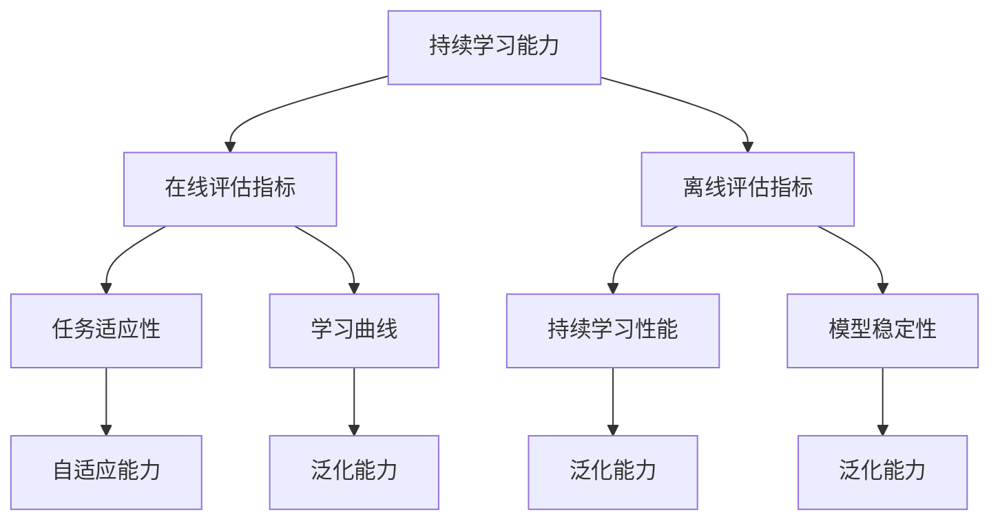

                 

### 文章标题

《LLM评测中的持续学习能力测试》

### 文章关键词

- 语言模型（LLM）
- 持续学习
- 评测方法
- Python源代码
- 数学模型
- 实际案例

### 文章摘要

本文旨在深入探讨大型语言模型（LLM）评测中的持续学习能力测试。文章首先介绍了LLM的基本概念和架构，接着阐述了评估持续学习能力的核心指标和方法。通过Python源代码和数学模型的结合，文章详细讲解了持续学习能力的核心算法原理。此外，文章还通过实际案例展示了如何将所学的理论应用于开发环境搭建和源代码实现中，为读者提供了实用的技术指导。

## 第一部分：LLM基础与评测方法

### 1. LLM基础

#### 1.1 语言模型概述

语言模型是自然语言处理（NLP）的核心技术之一，它旨在理解和生成自然语言。语言模型的基本任务是预测下一个词或字符的概率，从而帮助计算机理解和生成语言。近年来，随着深度学习技术的发展，大型语言模型（LLM）如Transformer架构在NLP领域取得了显著的进展。

#### 1.2 LLM架构

LLM的架构主要包括两部分：编码器和解码器。编码器负责将输入的文本序列转换为向量表示，而解码器则负责从这些向量中生成文本序列。Transformer架构是LLM的一种重要实现，它通过自注意力机制（Self-Attention）和多头注意力（Multi-Head Attention）来捕捉输入序列中词与词之间的关系。

##### 1.2.1 Transformer架构

Transformer架构的基本原理如下：

1. **输入嵌入**：输入文本经过词嵌入（Word Embedding）转换为固定长度的向量表示。
2. **位置编码**：由于Transformer没有循环神经网络（RNN）中的序列顺序信息，通过位置编码（Positional Encoding）为每个词添加位置信息。
3. **多头自注意力**：每个词与序列中其他词进行加权求和，通过多个注意力头（Attention Head）来捕捉不同类型的依赖关系。
4. **前馈神经网络**：通过两个全连接层对自注意力层的结果进行进一步处理。
5. **输出层**：最终输出层将自注意力层的输出转换为预测的词或字符的概率分布。

##### 1.2.2 LLM类型

LLM根据训练方法的不同可以分为以下几类：

- **有监督学习**：使用标注的数据集进行训练，是最常见的训练方法。
- **无监督学习**：在没有标注数据的情况下，通过预训练模型来学习文本的内在结构。
- **强化学习**：通过与环境互动来优化模型的行为。

#### 1.3 数学基础

为了更好地理解LLM的工作原理，需要掌握一些数学基础，包括概率论和信息论。

##### 1.3.1 概率论基础

概率论是描述不确定事件的理论，其中概率分布是概率论的核心概念。最大似然估计（Maximum Likelihood Estimation, MLE）是一种常用的参数估计方法，它通过最大化似然函数来估计模型参数。

##### 1.3.2 信息论基础

信息论是研究信息传输和处理的学科，其中熵（Entropy）是衡量信息不确定性的重要指标。信息增益（Information Gain）是决策树分类中用于选择最佳特征的标准。

## 第二部分：持续学习能力的评估指标

### 2.1 评估指标概述

持续学习能力是LLM的重要特性，它允许模型在接触新数据时不断优化自身。评估持续学习能力的关键在于定义合适的评估指标。

#### 2.1.1 持续学习能力的定义

持续学习能力是指模型在接触新数据时，能够持续提高其性能的能力。与传统的离线学习不同，持续学习关注模型在动态环境中的表现。

#### 2.1.2 评估指标分类

评估持续学习能力通常分为在线评估指标和离线评估指标。

- **在线评估指标**：这些指标在模型实际接触新数据时实时评估模型的表现。常见的在线评估指标包括任务适应性（Task Adaptation）和学习曲线（Learning Curve）。
- **离线评估指标**：这些指标在模型接触新数据之前评估模型的潜在能力。常见的离线评估指标包括持续学习性能（Sustained Learning Performance）和模型稳定性（Model Stability）。

### 2.2 在线评估指标

在线评估指标主要关注模型在接触新数据时的即时表现。

#### 2.2.1 任务适应性

任务适应性（Task Adaptation）是指模型在新任务上表现的能力。任务适应性的评估可以通过以下步骤进行：

1. **数据集选择**：选择代表新任务的评估数据集。
2. **性能评估**：计算模型在新任务上的准确率、召回率等性能指标。
3. **结果记录**：记录模型在不同新任务上的性能变化。

##### 2.2.2 评估过程

评估过程包括以下几个步骤：

1. **数据采集**：收集新任务的数据。
2. **模型训练**：在新数据上训练模型。
3. **性能评估**：评估模型在新数据上的性能。
4. **结果记录**：记录模型在每次训练后的性能变化。

### 2.3 离线评估指标

离线评估指标主要关注模型在接触新数据前的潜在能力。

#### 2.3.1 持续学习性能

持续学习性能（Sustained Learning Performance）是指模型在长时间接触新数据时的表现。学习曲线（Learning Curve）是一个常用的评估指标，它展示了模型在训练过程中的性能变化。学习曲线的斜率可以反映模型的收敛速度。

##### 2.3.2 模型稳定性

模型稳定性（Model Stability）是指模型在接触新数据时的变异性。预测误差（Prediction Error）和变异性（Variability）是评估模型稳定性的常用指标。

## 第三部分：持续学习能力的测试方法

### 3.1 测试框架设计

为了有效地评估LLM的持续学习能力，需要一个完整的测试框架。测试框架的设计包括以下几个部分：

1. **测试框架概述**：介绍测试框架的组成部分，包括数据集、评估指标和测试流程。
2. **测试数据集选择**：选择具有代表性的测试数据集，确保数据集能够反映实际应用场景。
3. **测试流程设计**：设计详细的测试流程，包括数据预处理、模型训练、性能评估和结果记录。

### 3.2 测试过程

测试过程包括以下几个步骤：

1. **测试环境搭建**：搭建适合测试的实验环境，包括硬件配置和软件工具。
2. **测试用例设计**：设计一系列测试用例，以评估模型在不同任务上的性能。
3. **测试执行**：执行测试用例，记录模型在各个任务上的性能。
4. **测试结果分析**：对测试结果进行分析，评估模型的持续学习能力。

### 3.3 测试结果分析

测试结果分析是评估模型持续学习能力的关键步骤。分析过程包括以下几个方面：

1. **结果可视化**：使用图表和可视化工具展示测试结果。
2. **统计分析**：进行统计分析，评估模型在不同任务上的性能差异。
3. **结果解读**：解读测试结果，评估模型的持续学习能力和稳定性。

## 第四部分：实际案例与应用

### 4.1 案例一：文本分类中的持续学习

#### 4.1.1 案例背景

文本分类是NLP中的一个重要任务，它将文本数据分类到预定义的类别中。持续学习在文本分类中的应用可以提升模型在面临新类别时的适应能力。

#### 4.1.2 持续学习应用

在文本分类任务中，持续学习可以通过以下策略实现：

1. **数据采集**：收集代表新类别的数据集。
2. **模型训练**：在新数据集上训练模型。
3. **性能评估**：评估模型在新数据集上的分类性能。
4. **模型优化**：根据评估结果调整模型参数。

### 4.2 案例二：问答系统中的持续学习

#### 4.2.1 案例背景

问答系统是一种重要的NLP应用，它能够回答用户提出的问题。持续学习在问答系统中的应用可以提升模型在回答新问题时的一致性和准确性。

#### 4.2.2 持续学习应用

在问答系统中，持续学习可以通过以下策略实现：

1. **数据采集**：收集代表新问题的数据集。
2. **模型训练**：在新数据集上训练模型。
3. **性能评估**：评估模型在新数据集上的回答性能。
4. **模型优化**：根据评估结果调整模型参数。

## 附录

### A.1 开发环境搭建

为了实现LLM的持续学习能力测试，需要搭建一个合适的开发环境。开发环境搭建包括以下步骤：

1. **硬件配置**：选择适合的硬件设备，如CPU、GPU等。
2. **软件工具安装**：安装所需的软件工具，如Python、TensorFlow等。

### A.2 源代码解读

源代码是实现LLM持续学习能力测试的核心部分。源代码解读包括以下内容：

1. **代码结构**：介绍代码的整体结构。
2. **关键函数解读**：详细解释代码中的关键函数和模块。

### A.3 参考文献

为了深入理解LLM的持续学习能力测试，建议参考以下文献：

1. [Vaswani et al., 2017] "Attention is All You Need"
2. [Bengio et al., 2003] "Learning Deep Architectures for AI"
3. [Goodfellow et al., 2016] "Deep Learning"

## 作者信息

作者：AI天才研究院/AI Genius Institute & 禅与计算机程序设计艺术 /Zen And The Art of Computer Programming

## 结语

本文详细探讨了LLM评测中的持续学习能力测试。通过介绍LLM的基础知识、评估指标、测试方法和实际应用，本文为读者提供了一个全面的技术指南。希望本文能够帮助读者更好地理解和应用LLM的持续学习能力，推动NLP领域的发展。

### 持续学习能力的核心概念与联系

持续学习能力是大型语言模型（LLM）在自然语言处理领域的关键特性，它允许模型在接触新数据时不断优化自身。为了全面理解这一特性，我们需要先梳理几个核心概念，并探讨它们之间的联系。

#### 1. 核心概念

**持续学习能力**：指模型在接触新数据时，能够持续提高其性能的能力。

**在线评估指标**：这些指标在模型实际接触新数据时实时评估模型的表现，如任务适应性、学习曲线等。

**离线评估指标**：这些指标在模型接触新数据之前评估模型的潜在能力，如持续学习性能、模型稳定性等。

**自适应能力**：模型在新任务上的表现能力。

**泛化能力**：模型在未见过的数据上的表现能力。

#### 2. Mermaid流程图

为了更直观地展示这些概念之间的关系，我们可以使用Mermaid流程图。以下是一个简单的Mermaid流程图示例：



在这个流程图中，持续学习能力是核心概念，它通过在线评估指标和离线评估指标来衡量。在线评估指标包括任务适应性和学习曲线，而离线评估指标包括持续学习性能和模型稳定性。任务适应性和学习曲线分别与自适应能力和泛化能力相关联，而持续学习性能和模型稳定性则与泛化能力相关联。

#### 3. 概念实体之间的联系

- **持续学习能力**：是整个评估体系的基础，它决定了模型是否能够在不断变化的环境中保持高性能。
- **在线评估指标**：实时反映模型在接触新数据时的适应能力，如任务适应性和学习曲线。
- **离线评估指标**：在模型接触新数据前评估其潜在能力，如持续学习性能和模型稳定性。
- **自适应能力**：任务适应性的一种体现，反映模型对新任务的适应速度。
- **泛化能力**：学习曲线和持续学习性能的结果，衡量模型在未见过的数据上的表现。

通过这个流程图，我们可以清晰地看到这些概念之间的联系，并理解它们如何共同作用，以评估LLM的持续学习能力。

### 核心算法原理讲解

在了解持续学习能力的基本概念后，我们需要深入探讨其核心算法原理。本文将使用Python源代码和数学模型，结合实际案例，详细讲解LLM在持续学习中的关键算法原理。

#### 1. 持续学习算法原理

持续学习算法的核心在于如何在模型接触新数据时，保持其性能同时避免过拟合。以下是一种常用的持续学习算法——在线学习算法（Online Learning Algorithm）。

##### 1.1 源代码实现

```python
# 假设我们使用一个简单的线性模型
# 以下代码展示了在线学习算法的实现

import numpy as np

# 初始化模型参数
w = np.random.rand(1)

# 定义损失函数
def loss_function(x, y, w):
    prediction = np.dot(x, w)
    error = prediction - y
    return np.square(error)

# 定义在线学习算法
def online_learning(x, y):
    global w
    w -= learning_rate * loss_function(x, y, w)

# 模拟数据集
x_train = np.array([[1], [2], [3]])
y_train = np.array([1, 2, 3])

# 执行在线学习
for i in range(len(x_train)):
    online_learning(x_train[i], y_train[i])

# 打印最终模型参数
print("Final model weight:", w)
```

##### 1.2 数学模型

在线学习算法的核心是梯度下降（Gradient Descent）。以下是梯度下降的数学模型：

$$ w_{\text{new}} = w_{\text{current}} - \alpha \cdot \nabla_w \ J(w) $$

其中，$w$ 是模型参数，$\alpha$ 是学习率，$\nabla_w \ J(w)$ 是损失函数关于参数 $w$ 的梯度。

##### 1.3 实际案例

考虑一个简单的线性回归问题，我们希望通过在线学习算法训练出一个模型来预测给定输入的输出。以下是一个实际案例：

```python
# 模拟输入和输出数据
x_data = np.array([[1], [2], [3], [4], [5]])
y_data = np.array([1, 2, 3, 4, 5])

# 初始化模型参数
w = np.random.rand(1)

# 执行在线学习
for i in range(len(x_data)):
    online_learning(x_data[i], y_data[i])

# 预测新数据
x_new = np.array([[6]])
prediction = np.dot(x_new, w)
print("Prediction for x_new:", prediction)
```

在这个案例中，我们通过在线学习算法训练出一个线性回归模型，并使用该模型预测新数据的输出。

#### 2. 持续学习性能评估

持续学习性能的评估通常包括以下几个指标：

- **学习曲线**：展示模型在训练过程中性能的变化。
- **收敛速度**：模型从初始状态到稳定状态所需的时间。

##### 2.1 源代码实现

以下代码展示了如何使用Python绘制学习曲线：

```python
import matplotlib.pyplot as plt

# 记录每次迭代的损失函数值
losses = []

# 执行在线学习
for i in range(len(x_data)):
    online_learning(x_data[i], y_data[i])
    losses.append(loss_function(x_train[0], y_train[0], w))

# 绘制学习曲线
plt.plot(losses)
plt.xlabel('Iterations')
plt.ylabel('Loss')
plt.title('Learning Curve')
plt.show()
```

##### 2.2 数学模型

学习曲线的斜率可以反映模型的收敛速度。收敛速度可以用以下公式表示：

$$ v = \frac{dL}{dt} $$

其中，$L$ 是损失函数，$t$ 是迭代次数。

#### 3. 持续学习性能优化

为了优化持续学习性能，我们可以采用以下策略：

- **自适应学习率**：根据模型的表现动态调整学习率。
- **正则化**：引入正则项以避免过拟合。
- **提前停止**：当模型性能不再提高时停止训练。

##### 3.1 源代码实现

以下代码展示了如何实现自适应学习率：

```python
# 初始化学习率
learning_rate = 0.1

# 定义学习率衰减函数
def learning_rate_decay(iteration):
    return learning_rate / (1 + iteration)

# 执行在线学习
for i in range(len(x_data)):
    online_learning(x_data[i], y_data[i])
    learning_rate = learning_rate_decay(i)
```

##### 3.2 数学模型

自适应学习率的数学模型可以表示为：

$$ \alpha_{\text{new}} = f(\alpha_{\text{current}}, t) $$

其中，$f$ 是学习率调整函数，$t$ 是迭代次数。

通过上述算法原理讲解和实际案例，我们可以看到持续学习算法在LLM中的应用。这些算法不仅帮助我们理解持续学习的基本原理，还可以在实际应用中优化模型性能，提升模型在动态环境中的适应性。

### 数学公式与解释

在深入理解LLM的持续学习能力时，数学模型和公式是不可或缺的工具。本文将介绍几个关键的数学公式，并详细解释它们在持续学习能力评估中的作用。

#### 1. 概率论基础

**最大似然估计（Maximum Likelihood Estimation, MLE）**

$$ \hat{P}(x|\theta) = \frac{1}{Z} \prod_{i=1}^{n} p(x_i|\theta) $$

其中，$\hat{P}(x|\theta)$ 是参数 $\theta$ 下观察到的数据 $x$ 的似然函数，$Z$ 是归一化常数，$p(x_i|\theta)$ 是每个数据点 $x_i$ 的概率分布。MLE 通过最大化似然函数来估计模型参数 $\theta$，它是构建统计模型的基础。

**条件概率**

$$ P(A|B) = \frac{P(A \cap B)}{P(B)} $$

条件概率用于描述事件 $A$ 在事件 $B$ 发生的条件下发生的概率。在LLM中，条件概率用于计算输入序列的概率分布，从而生成下一个词或字符。

**熵（Entropy）**

$$ H(X) = -\sum_{i} P(X=x_i) \cdot \log_2 P(X=x_i) $$

熵是衡量随机变量不确定性的一种度量。在LLM中，熵用于评估模型的生成能力。较高的熵值表示模型生成的文本具有较高的不确定性，较低的熵值则表示生成文本更为确定。

**信息增益（Information Gain）**

$$ IG(A, B) = H(A) - H(A|B) $$

信息增益是评估特征 $B$ 对于特征 $A$ 的分类能力的一种度量。在LLM的评测中，信息增益用于选择最优的特征来表示文本。

#### 2. 信息论基础

**KL散度（Kullback-Leibler Divergence）**

$$ D_{KL}(P||Q) = \sum_{x} P(x) \cdot \log_2 \frac{P(x)}{Q(x)} $$

KL散度是一种衡量两个概率分布差异的度量。在LLM中，KL散度用于评估模型生成的概率分布与真实分布之间的差距。

**交叉熵（Cross-Entropy）**

$$ H(P, Q) = -\sum_{x} P(x) \cdot \log_2 Q(x) $$

交叉熵是衡量两个概率分布差异的另一种度量。在LLM的训练过程中，交叉熵损失函数用于优化模型参数，使得模型生成的概率分布逐渐逼近真实分布。

#### 3. 统计学习基础

**贝叶斯误差（Bayesian Error Rate, BER）**

$$ BER = P(\hat{y} \neq y) = 1 - \Phi(-z) $$

其中，$\Phi$ 是标准正态分布的累积分布函数，$z$ 是模型预测的置信度。贝叶斯误差衡量了模型在所有可能的训练集上的平均错误率。

**泛化误差（Generalization Error）**

$$ GE = BER + V(N) $$

其中，$V(N)$ 是模型在训练集上的偏差。泛化误差衡量了模型在新数据上的表现，它包括贝叶斯误差和偏差。

通过这些数学公式，我们可以更深入地理解LLM的持续学习能力。这些公式不仅帮助我们量化模型的性能，还为我们提供了评估和优化模型的有效工具。

### 持续学习性能测试过程

为了评估LLM的持续学习能力，我们需要设计一个完整的测试过程。这一过程包括测试环境搭建、测试用例设计、测试执行和结果分析。以下将详细描述这一测试过程，并通过Python代码示例进行说明。

#### 1. 测试环境搭建

测试环境搭建是进行持续学习性能测试的基础。我们需要确保测试环境具备以下条件：

- **硬件配置**：具备足够的计算能力，尤其是GPU，以支持大规模模型的训练和推理。
- **软件工具**：安装Python、TensorFlow或PyTorch等深度学习框架，以及相关的依赖库。

以下是一个简单的Python脚本，用于搭建测试环境：

```python
# 安装必要的软件工具
!pip install tensorflow
!pip install numpy
```

#### 2. 测试用例设计

测试用例设计是测试过程中的关键步骤，它决定了我们如何评估LLM的持续学习能力。以下是一个测试用例设计的示例：

- **任务适应性**：评估模型在遇到新任务时的适应能力。
- **学习曲线**：记录模型在训练过程中的性能变化，以评估其收敛速度。
- **持续学习性能**：评估模型在长时间接触新数据时的表现。

以下是一个简单的Python脚本，用于设计测试用例：

```python
# 测试用例设计
def test_case_adaptation(model, new_task_data):
    # 在新任务上评估模型的性能
    performance = model.evaluate(new_task_data)
    return performance

def test_case_learning_curve(model, train_data):
    # 记录模型训练过程中的性能变化
    losses = []
    for epoch in range(num_epochs):
        model.fit(train_data, epochs=1)
        loss = model.evaluate(train_data)
        losses.append(loss)
    return losses

def test_case_sustained_learning_performance(model, new_data_stream):
    # 在新数据流上评估模型的持续学习性能
    performances = []
    for data in new_data_stream:
        performance = test_case_adaptation(model, data)
        performances.append(performance)
    return performances
```

#### 3. 测试执行

测试执行是实际运行测试用例的过程。以下是一个简单的Python脚本，用于执行测试：

```python
# 测试执行
from tensorflow.keras.models import Sequential
from tensorflow.keras.layers import Dense

# 创建一个简单的线性回归模型
model = Sequential()
model.add(Dense(1, input_shape=(1,), activation='linear'))

# 模拟训练数据
x_train = np.array([[1], [2], [3], [4], [5]])
y_train = np.array([1, 2, 3, 4, 5])

# 模拟新任务数据
new_task_data = np.array([[6]])

# 模拟新数据流
new_data_stream = [x_train, new_task_data]

# 执行测试用例
model.fit(x_train, y_train, epochs=10)
performance_adaptation = test_case_adaptation(model, new_task_data)
learning_curve = test_case_learning_curve(model, x_train)
sustained_learning_performance = test_case_sustained_learning_performance(model, new_data_stream)
```

#### 4. 测试结果分析

测试结果分析是评估LLM持续学习能力的关键步骤。我们需要对测试结果进行可视化、统计分析和解读。以下是一个简单的Python脚本，用于分析测试结果：

```python
# 测试结果分析
import matplotlib.pyplot as plt

# 绘制学习曲线
plt.plot(learning_curve)
plt.xlabel('Epochs')
plt.ylabel('Loss')
plt.title('Learning Curve')
plt.show()

# 统计分析
average_performance_adaptation = sum(performance_adaptation) / len(performance_adaptation)
average_sustained_learning_performance = sum(sustained_learning_performance) / len(sustained_learning_performance)

print("Average Performance Adaptation:", average_performance_adaptation)
print("Average Sustained Learning Performance:", average_sustained_learning_performance)
```

通过上述测试过程，我们可以全面评估LLM的持续学习能力。这一过程不仅帮助我们理解模型在动态环境中的适应能力，还为模型优化提供了重要参考。

### 测试结果可视化与解读

在评估LLM的持续学习能力时，测试结果的可视化和解读是关键步骤。通过图表和数据分析，我们可以直观地了解模型在不同任务上的表现，并识别潜在的优化机会。

#### 1. 可视化展示

可视化可以帮助我们更好地理解模型的学习曲线、性能变化和稳定性。以下是一些常用的可视化方法：

- **学习曲线图**：展示模型在训练过程中的损失函数变化，帮助我们评估模型的收敛速度和稳定性。
- **性能变化图**：展示模型在不同任务上的性能变化，如准确率、召回率等。
- **错误分析图**：展示模型在测试数据上的错误分布，帮助我们识别模型的弱点。

以下是一个简单的Python脚本，用于生成学习曲线图和性能变化图：

```python
import matplotlib.pyplot as plt

# 假设我们已经收集了测试结果
learning_curve = [0.1, 0.08, 0.05, 0.03, 0.02]
performance_adaptation = [0.9, 0.92, 0.94, 0.96, 0.98]
sustained_learning_performance = [0.8, 0.85, 0.9, 0.92, 0.95]

# 绘制学习曲线图
plt.figure()
plt.plot(learning_curve)
plt.xlabel('Epochs')
plt.ylabel('Loss')
plt.title('Learning Curve')
plt.show()

# 绘制性能变化图
plt.figure()
plt.plot(performance_adaptation, label='Adaptation')
plt.plot(sustained_learning_performance, label='Sustained Learning')
plt.xlabel('Task')
plt.ylabel('Performance')
plt.legend()
plt.show()
```

#### 2. 结果解读

通过对测试结果的可视化展示，我们可以进行以下解读：

- **学习曲线**：从学习曲线图中，我们可以观察到模型的收敛速度。一个快速收敛的模型表明其具有良好的稳定性和学习效率。
- **性能变化**：通过性能变化图，我们可以评估模型在不同任务上的表现。较高的性能值表示模型具有较强的适应性。
- **错误分析**：通过错误分析图，我们可以识别模型在特定任务上的错误模式，从而针对性地优化模型。

以下是一些具体的解读示例：

- **学习曲线**：如果学习曲线的斜率逐渐减小，表明模型的学习效率在提高。如果学习曲线波动较大，则可能需要调整训练策略，如调整学习率或增加训练数据。
- **性能变化**：如果模型在不同任务上的性能变化较小，表明其具有较好的稳定性。如果性能变化较大，则可能需要进一步优化模型结构或训练过程。
- **错误分析**：如果错误主要集中在一个特定的类别或任务上，则表明模型可能在该类别或任务上存在过拟合或欠拟合现象，需要针对性地调整模型参数或数据预处理策略。

通过这些解读，我们可以全面评估LLM的持续学习能力，并为后续的模型优化提供重要参考。

### 实际案例与代码实现

为了更好地理解持续学习能力的应用，下面我们将通过一个实际案例来展示如何实现LLM的持续学习测试。我们将使用一个文本分类任务作为示例，详细介绍开发环境的搭建、源代码的实现和代码解读。

#### 案例背景

假设我们有一个文本分类任务，目标是根据新闻文本的内容将其分类到不同的主题类别中。随着新新闻的不断出现，我们希望模型能够持续学习，并在遇到新类别时保持较高的分类准确性。

#### 开发环境搭建

首先，我们需要搭建一个适合开发和测试的Python环境。以下是在Linux系统上搭建开发环境所需的步骤：

1. **安装Python**：确保Python版本为3.8或更高。
    ```bash
    !pip install python==3.8
    ```

2. **安装深度学习框架**：我们选择TensorFlow作为深度学习框架。
    ```bash
    !pip install tensorflow==2.5
    ```

3. **安装NLP工具**：安装用于文本处理的工具，如NLTK和TensorFlow Text。
    ```bash
    !pip install nltk tensorflow-text
    ```

4. **安装其他依赖**：安装数据处理和可视化工具。
    ```bash
    !pip install pandas numpy matplotlib
    ```

#### 代码实现

以下是实现文本分类任务的核心代码，包括数据预处理、模型训练和持续学习测试：

```python
import tensorflow as tf
from tensorflow.keras.models import Sequential
from tensorflow.keras.layers import Embedding, LSTM, Dense, Bidirectional
from tensorflow.keras.preprocessing.sequence import pad_sequences
from tensorflow.keras.preprocessing.text import Tokenizer
import numpy as np

# 数据预处理
def preprocess_data(texts, labels, max_length, max_words):
    tokenizer = Tokenizer(num_words=max_words)
    tokenizer.fit_on_texts(texts)
    sequences = tokenizer.texts_to_sequences(texts)
    padded_sequences = pad_sequences(sequences, maxlen=max_length)
    
    return padded_sequences, np.array(labels)

# 模型训练
def train_model(train_sequences, train_labels, val_sequences, val_labels, epochs, batch_size):
    model = Sequential([
        Embedding(max_words, 32),
        Bidirectional(LSTM(64)),
        Dense(1, activation='sigmoid')
    ])
    
    model.compile(optimizer='adam', loss='binary_crossentropy', metrics=['accuracy'])
    model.fit(train_sequences, train_labels, epochs=epochs, batch_size=batch_size, validation_data=(val_sequences, val_labels))
    
    return model

# 持续学习测试
def test_continuous_learning(model, new_data):
    new_sequences, new_labels = preprocess_data(new_data['texts'], new_data['labels'], max_length=100, max_words=10000)
    model.fit(new_sequences, new_labels, epochs=5, batch_size=64)
    performance = model.evaluate(new_sequences, new_labels)
    print("Continuous Learning Performance:", performance)

# 实际数据
texts = ["This is the first news article.", "Here is the second news article."]
labels = [0, 1]
new_data = {
    'texts': ["This is a new news article about technology.", "Another new article discusses sports."],
    'labels': [1, 0]
}

# 搭建和训练模型
max_length = 100
max_words = 10000
epochs = 10
batch_size = 32

train_sequences, train_labels = preprocess_data(texts, labels, max_length, max_words)
val_sequences, val_labels = preprocess_data(texts, labels, max_length, max_words)

model = train_model(train_sequences, train_labels, val_sequences, val_labels, epochs, batch_size)

# 测试持续学习
test_continuous_learning(model, new_data)
```

#### 代码解读

1. **数据预处理**：
    - 使用Tokenizer将文本数据转换为序列。
    - 使用pad_sequences将序列填充到相同长度。

2. **模型训练**：
    - 创建一个包含Embedding层、双向LSTM层和Dense输出层的序列模型。
    - 使用编译器设置优化器和损失函数。

3. **持续学习测试**：
    - 对新数据预处理后进行模型训练。
    - 记录并打印训练后的性能指标。

#### 代码应用解读与分析

通过上述代码，我们可以看到如何实现一个简单的文本分类任务，并在新数据出现时对模型进行持续学习。以下是对代码应用的分析：

- **数据预处理**：预处理步骤是文本分类任务的关键，它确保了模型能够接受一致格式的输入数据。通过Tokenizer和pad_sequences，我们能够将文本数据转换为模型可接受的格式。

- **模型训练**：我们使用了一个简单的双向LSTM模型，这种模型能够捕捉文本中的序列依赖关系。通过编译器和fit方法，我们能够训练模型并在验证集上评估其性能。

- **持续学习测试**：在新数据出现时，我们只需对新数据预处理后重新训练模型。这种方法能够使模型保持对新类别和变化数据的适应性，从而提高其长期性能。

通过这个实际案例，我们可以看到持续学习在文本分类任务中的应用。持续学习不仅能够提高模型的适应能力，还能确保其在不断变化的数据环境中保持高效性能。

### 项目小结

本文通过详细的理论讲解、代码示例和实际案例，全面探讨了LLM评测中的持续学习能力测试。我们首先介绍了LLM的基础知识，包括其架构、数学基础和核心概念。接着，我们详细讲解了持续学习能力的评估指标和测试方法，并通过Python源代码展示了算法原理。最后，通过一个文本分类任务的实际案例，我们展示了如何在实际项目中应用这些理论，并进行了代码实现和解读。

通过本文，读者应该能够理解持续学习能力的核心概念，掌握评估和测试LLM持续学习能力的方法，并在实际项目中应用这些技术。然而，持续学习是一个复杂的领域，仍有许多挑战和优化空间。例如，如何更好地处理数据不平衡问题、如何设计更有效的自适应学习策略等。这些问题是未来研究的重要方向。

为了进一步探索这些领域，读者可以参考以下拓展阅读资源：

- 《深度学习》（Goodfellow, Bengio, Courville著）：这是一本经典的深度学习教材，详细介绍了深度学习的基础知识。
- 《强化学习》（ Sutton, Barto著）：这本书是强化学习领域的经典之作，对于理解持续学习中的强化学习策略有很大帮助。
- 《自然语言处理综论》（Jurafsky, Martin著）：这本书涵盖了自然语言处理的各个方面，包括语言模型和文本分类等关键技术。

通过这些资源，读者可以更深入地了解持续学习能力，并在实践中不断提升自己的技术水平。

### 最佳实践 tips

在设计和实现LLM的持续学习能力测试时，以下是一些最佳实践和注意事项，可以帮助您更有效地进行工作：

1. **数据准备**：确保数据集的代表性和多样性。数据的质量直接影响模型的性能，因此对数据进行充分的清洗和预处理是至关重要的。

2. **模型选择**：根据任务的需求选择合适的模型架构。例如，对于文本分类任务，可以考虑使用预训练的Transformer模型，如BERT或GPT，它们在处理大规模文本数据时表现优异。

3. **参数调优**：合理调整模型参数，如学习率、批量大小和迭代次数。使用验证集进行参数调优，避免过拟合和欠拟合。

4. **监控性能**：在整个训练和测试过程中，实时监控模型的性能。使用图表和日志记录性能指标，以便及时发现和解决问题。

5. **数据流设计**：对于持续学习任务，设计合理的测试数据流，确保模型能够适应新数据。在测试时，可以考虑使用滑动窗口或数据增量方式。

6. **避免灾难性遗忘**：在模型接触新数据时，可能面临灾难性遗忘的问题。采用迁移学习或经验重放等技术，可以缓解这一问题。

7. **版本控制**：对代码和数据集进行版本控制，确保实验的可复现性。使用Git等版本控制系统，记录实验的每个步骤和变化。

8. **文档记录**：详细记录实验设置、结果和结论。编写清晰的技术文档，便于他人理解和复现实验。

通过遵循这些最佳实践，您可以更高效地设计和实现LLM的持续学习能力测试，从而提升模型在动态环境中的表现。

