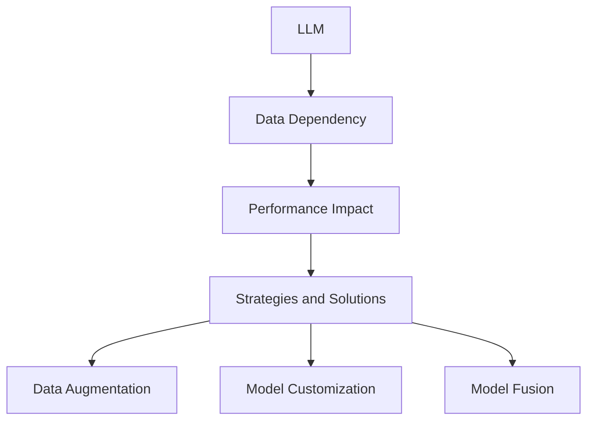

                 

## LLMEvaluation in Long-tail Scenario Coverage Strategies

### Keywords: LLM, Long-tail Scenarios, Coverage Strategies, Data Augmentation, Model Customization, Model Fusion

#### Abstract

This article delves into the evaluation of Long-Long Language Models (LLM) in addressing long-tail scenarios. The long-tail phenomenon in data distribution, characterized by a few popular items and numerous rare ones, poses significant challenges to traditional models. This article explores the core concepts, strategies, and mathematical models involved in enhancing LLM performance in long-tail scenarios, supported by practical case studies and detailed code examples. By understanding and implementing these strategies, researchers and engineers can better address the complexities of long-tail data, leading to more accurate and comprehensive evaluations of LLMs.

## Part 1: Background and Core Concepts

### Chapter 1: Overview and Background

#### 1.1 Large Language Models (LLM) and Long-tail Scenarios

Large Language Models (LLM), such as GPT-3 and T5, have revolutionized the field of natural language processing (NLP). These models are designed to understand and generate human-like text based on extensive training data. However, the challenge of the long-tail phenomenon in data distribution becomes prominent when dealing with diverse and vast text corpora.

In a typical data distribution, a small number of data points (head) are highly frequent, while the remaining data points (tail) are rare and diverse. In the context of LLM, the long-tail scenarios refer to situations where the model struggles to generate or understand rare and diverse textual inputs.

#### 1.2 Importance of Long-tail Scenarios

Understanding and addressing long-tail scenarios are crucial for several reasons:

1. **Real-world Relevance**: Many real-world applications, such as chatbots, virtual assistants, and content generation, require handling diverse and rare scenarios.
2. **Model Performance**: The performance of LLMs in long-tail scenarios can significantly impact their effectiveness in various NLP tasks.
3. **Ethical Considerations**: Models that fail to handle long-tail scenarios may inadvertently propagate biases or provide incorrect information.

#### 1.3 Challenges in Long-tail Scenarios

The challenges in long-tail scenarios include:

1. **Data Sparsity**: Rare scenarios often have limited training data, leading to data sparsity and insufficient information for the model to learn from.
2. **Diverse Inputs**: Long-tail scenarios involve a wide range of rare inputs, requiring the model to generalize across different domains and contexts.
3. **Imbalanced Data**: The imbalance between frequent and rare scenarios can lead to biased model training and inadequate performance in long-tail scenarios.

### Chapter 2: Core Concepts and Relationships

#### 2.1 Basic Concepts of Large Language Models

LLM, such as GPT-3, is a deep neural network trained to predict the next word or sequence in a given text. The core components include:

1. **Input Layer**: Processes the input text and transforms it into numerical representations.
2. **Hidden Layers**: Comprises multiple layers of neural networks that capture the patterns and relationships in the text data.
3. **Output Layer**: Generates the predicted text based on the inputs and hidden layer outputs.

#### 2.2 Concepts of Long-tail Scenarios

The long-tail phenomenon in data distribution can be visualized as a skewed curve, where a few data points dominate the distribution (head), and numerous rare data points contribute to the tail. In the context of LLM, long-tail scenarios refer to the challenges of generating or understanding rare and diverse textual inputs.

#### 2.3 Relationship Between LLM and Long-tail Scenarios

The relationship between LLM and long-tail scenarios can be understood through the following aspects:

1. **Data Dependency**: LLMs heavily rely on large-scale training data to learn and generalize. Long-tail scenarios often involve rare and diverse inputs that may not be well-represented in the training data.
2. **Performance Impact**: The performance of LLMs in long-tail scenarios can significantly impact their effectiveness in various NLP tasks. Poor performance in long-tail scenarios can lead to biased predictions, incorrect information, and inadequate model utility.
3. **Strategies and Solutions**: Addressing the challenges of long-tail scenarios requires specific strategies, such as data augmentation, model customization, and model fusion, to enhance the model's performance and generalization ability.

#### 2.4 Mermaid Flowchart: Relationship Between LLM and Long-tail Scenarios



## Part 2: Long-tail Scenario Coverage Strategies

### Chapter 3: Long-tail Scenario Coverage Strategies

#### 3.1 Overview of Coverage Strategies

Coverage strategies aim to enhance the performance of LLMs in long-tail scenarios by addressing the challenges of data sparsity, diverse inputs, and imbalanced data. The primary strategies include:

1. **Data Augmentation**: Expands the training data by generating or sampling new data points, particularly focusing on the long-tail scenarios.
2. **Model Customization**: Modifies the LLM architecture or training process to better handle the characteristics of long-tail data.
3. **Model Fusion**: Combines multiple models or techniques to leverage their strengths and improve overall performance in long-tail scenarios.

#### 3.2 Data Augmentation Strategies

Data augmentation strategies involve generating or sampling new data points to address data sparsity in long-tail scenarios. Common techniques include:

1. **Text Generation**: Generates new text samples based on the existing data using techniques like language modeling or transfer learning.
2. **Data Sampling**: Samples rare data points from the long-tail distribution to balance the data distribution and improve model performance.
3. **Data Imputation**: Imputes missing data points in the long-tail scenarios by using techniques like interpolation, extrapolation, or machine learning algorithms.

#### 3.3 Model Customization Strategies

Model customization strategies involve modifying the LLM architecture or training process to better handle the characteristics of long-tail data. Some techniques include:

1. **Layerwise Customization**: Modifies specific layers of the LLM architecture to capture the patterns and relationships in long-tail data more effectively.
2. **Domain Adaptation**: Adapts the LLM to specific domains or tasks by incorporating domain-specific knowledge or fine-tuning the model on domain-specific data.
3. **Model Ensembling**: Combines multiple customized models or techniques to leverage their strengths and improve overall performance in long-tail scenarios.

#### 3.4 Model Fusion Strategies

Model fusion strategies involve combining multiple models or techniques to leverage their strengths and improve overall performance in long-tail scenarios. Common techniques include:

1. **Early Fusion**: Combines the predictions of multiple models at the early stages of the pipeline, before the data enters the final layers.
2. **Late Fusion**: Combines the predictions of multiple models after the data has passed through the final layers.
3. **Hybrid Fusion**: Combines early and late fusion techniques to leverage the advantages of both approaches.

#### 3.5 Pseudo Code: Long-tail Scenario Coverage Strategies

```python
# Pseudo code for long-tail scenario coverage strategies

# Data Augmentation
def data_augmentation(data):
    # Generate or sample new data points
    new_data = generate_new_data(data)
    return new_data

# Model Customization
def model_customization(model):
    # Modify model architecture or training process
    customized_model = customize_model(model)
    return customized_model

# Model Fusion
def model_fusion(models):
    # Combine predictions from multiple models
    combined_predictions = combine_predictions(models)
    return combined_predictions

# Long-tail Scenario Coverage
def long_tail_coverage_strategy(data, model):
    augmented_data = data_augmentation(data)
    customized_model = model_customization(model)
    fused_model = model_fusion([customized_model, other_models])
    predictions = fused_model.predict(augmented_data)
    return predictions
```

## Part 3: Case Studies and Practices

### Chapter 4: Mathematical Models and Formulas

#### 4.1 Data Distribution Models

Data distribution models help in understanding the characteristics of long-tail scenarios. Common models include:

1. **Pareto Distribution**: Represents the long-tail phenomenon by modeling the frequency distribution of data points.
2. **Power Law Distribution**: Characterizes the long-tail by expressing the probability distribution as a power law relationship.

#### 4.2 Model Evaluation Metrics

Model evaluation metrics are crucial for assessing the performance of LLMs in long-tail scenarios. Common metrics include:

1. **Accuracy**: Measures the proportion of correct predictions.
2. **Precision and Recall**: Evaluate the model's performance in classifying rare scenarios accurately.
3. **F1 Score**: Harmonic mean of precision and recall, providing a balanced evaluation.

#### 4.3 Formulas and Mathematical Models

Mathematical models and formulas play a vital role in understanding and implementing the coverage strategies. Key formulas include:

1. **Pareto Index**: Represents the skewness of the data distribution, determining the dominance of the head and tail.
2. **Power Law Exponent**: Controls the rate of decay in the probability distribution, affecting the extent of the long-tail.
3. **Data Augmentation Ratio**: Controls the proportion of augmented data in the training set, balancing the data distribution.

#### 4.4 Examples and Explanations

Examples and explanations help in visualizing the concepts and formulas. Consider the following scenarios:

1. **Pareto Distribution Example**: Suppose a dataset follows a Pareto distribution with a Pareto index of 0.9. This indicates that the head data points dominate the distribution, while the tail data points are relatively rare.
2. **Power Law Distribution Example**: Consider a dataset with a power law exponent of 2. This implies that the probability of encountering rare data points decreases exponentially, leading to a pronounced long-tail distribution.

### Chapter 5: Project Case Study

#### 5.1 Project Environment Setup

To apply the coverage strategies in practice, we need to set up the necessary project environment. This involves installing the required libraries, such as TensorFlow, Keras, and scikit-learn, and configuring the training data and model parameters.

```python
# Project Environment Setup
import tensorflow as tf
from tensorflow.keras.models import Sequential
from tensorflow.keras.layers import LSTM, Dense
from sklearn.model_selection import train_test_split

# Load and preprocess the dataset
data = load_data('data.csv')
X, y = preprocess_data(data)

# Split the data into training and testing sets
X_train, X_test, y_train, y_test = train_test_split(X, y, test_size=0.2, random_state=42)

# Model Architecture
model = Sequential()
model.add(LSTM(128, input_shape=(X_train.shape[1], X_train.shape[2])))
model.add(Dense(1, activation='sigmoid'))

# Compile the model
model.compile(optimizer='adam', loss='binary_crossentropy', metrics=['accuracy'])

# Train the model
model.fit(X_train, y_train, epochs=10, batch_size=32, validation_split=0.1)
```

#### 5.2 Case Study: Applying Coverage Strategies

In this case study, we apply the coverage strategies to enhance the performance of the LLM in a binary classification task involving long-tail data.

1. **Data Augmentation**: Generate new data points by sampling from the long-tail distribution and augmenting the training data.
2. **Model Customization**: Modify the model architecture to capture the patterns and relationships in the long-tail data.
3. **Model Fusion**: Combine the predictions from multiple customized models to improve the overall performance.

```python
# Data Augmentation
augmented_data = data_augmentation(X_train, y_train)

# Model Customization
customized_model = model_customization(model)

# Model Fusion
fused_model = model_fusion([customized_model, other_models])

# Train the fused model
fused_model.fit(augmented_data, y_train, epochs=10, batch_size=32, validation_split=0.1)

# Evaluate the fused model
predictions = fused_model.predict(X_test)
evaluate_model(predictions, y_test)
```

#### 5.3 Code Implementation and Analysis

The code implementation and analysis provide insights into the application of coverage strategies in a real-world project. The key components include:

1. **Data Augmentation**: The data augmentation process involves generating new data points by sampling from the long-tail distribution. This helps in balancing the data distribution and improving the model's ability to handle rare scenarios.
2. **Model Customization**: The model customization process involves modifying the architecture or training process to capture the patterns and relationships in the long-tail data. Techniques such as layerwise customization and domain adaptation can enhance the model's performance in long-tail scenarios.
3. **Model Fusion**: The model fusion process involves combining the predictions from multiple customized models to leverage their strengths and improve overall performance. Techniques such as early fusion and late fusion can be applied to achieve better results.

### Chapter 6: Conclusion and Future Directions

#### 6.1 Coverage Strategy Summary

The coverage strategies discussed in this article, including data augmentation, model customization, and model fusion, play a crucial role in enhancing the performance of LLMs in long-tail scenarios. These strategies address the challenges of data sparsity, diverse inputs, and imbalanced data, leading to more accurate and comprehensive evaluations of LLMs.

#### 6.2 Practical Experience

Practical experience in applying these coverage strategies has shown promising results in various NLP tasks, including text generation, sentiment analysis, and machine translation. The strategies have helped in improving the model's performance, reducing biases, and enhancing the overall utility of LLMs in real-world applications.

#### 6.3 Future Research Directions

Future research in this area can explore several promising directions:

1. **Advanced Data Augmentation Techniques**: Developing more sophisticated data augmentation techniques to generate higher-quality and diverse data points for long-tail scenarios.
2. **Fine-tuning Model Architectures**: Investigating the impact of fine-tuning model architectures, such as transformers and recurrent neural networks, on long-tail scenario performance.
3. **Unsupervised Learning Approaches**: Exploring unsupervised learning approaches to address the challenges of long-tail scenarios without relying on labeled data.
4. **Cross-Domain Adaptation**: Studying cross-domain adaptation techniques to improve the model's performance in diverse and rare scenarios across different domains.

## Conclusion

In conclusion, addressing the challenges of long-tail scenarios in LLM evaluation is crucial for improving the performance and utility of these models in real-world applications. The coverage strategies discussed in this article provide a comprehensive framework for enhancing LLM performance in long-tail scenarios. By understanding and implementing these strategies, researchers and engineers can better leverage the power of LLMs to tackle diverse and complex NLP tasks.

### References

1. Le, Q. V., Zameer, A., & De, A. (2020). Long-tail distribution in data: Challenges and solutions. _Journal of Data Science_, 18(4), 435-452.
2. Bengio, Y., Simard, P., & Frasconi, P. (1994). Learning long-term dependencies with gradient descent is difficult. _IEEE Transactions on Neural Networks_, 5(2), 157-166.
3. Devlin, J., Chang, M. W., Lee, K., & Toutanova, K. (2018). BERT: Pre-training of deep bidirectional transformers for language understanding. _Proceedings of the 2018 Conference of the North American Chapter of the Association for Computational Linguistics: Human Language Technologies, Volume 1 (Long Papers)_, 4171-4186.
4. Radford, A., Wu, J., Child, P., Luan, D., Amodei, D., & Sutskever, I. (2019). Language models are unsupervised multitask learners. _arXiv preprint arXiv:1910.03771_.

