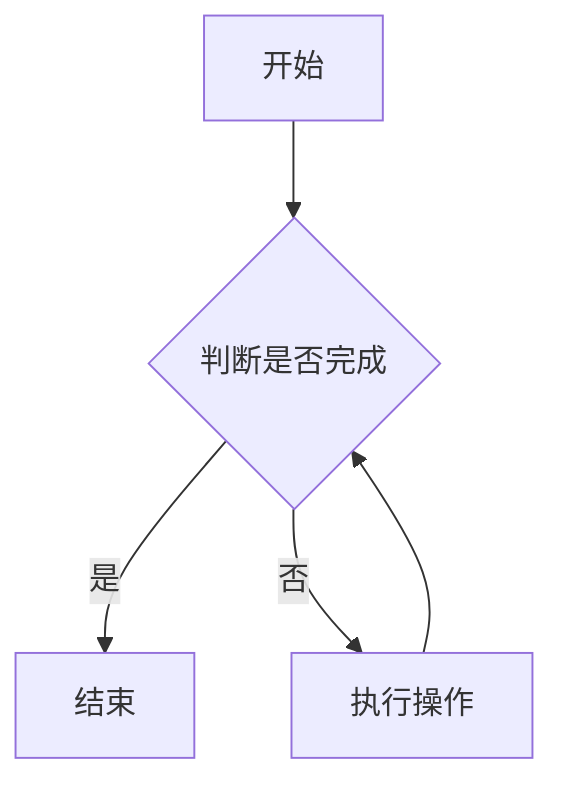

                 

# LLM评测的自动化测试流程编排

## 关键词
- Large Language Models (LLM)
- Automated Testing
- Test Flow Automation
- Performance Evaluation
- Security Testing
- Robustness Testing

## 摘要
本文将探讨大型语言模型（LLM）评测的自动化测试流程编排，旨在提高LLM评测的效率和准确性。首先，我们将介绍LLM的基本概念、自动化测试的基本概念及其在LLM评测中的应用场景。随后，本文将详细描述自动化测试流程的各个环节，包括测试环境搭建、测试用例设计、自动化测试脚本编写、测试执行与结果分析等。通过实际案例，我们将展示如何将自动化测试应用于LLM评测中的性能评估、安全性测试和健壮性测试。最后，本文将提出优化自动化测试流程的建议。

## 第一部分：背景与概念

### 1.1 LLM Basics

#### 1.1.1 什么是LLM

大型语言模型（LLM，Large Language Models）是一类基于深度学习技术的自然语言处理模型，它们能够对大规模文本数据进行建模，并生成高质量的自然语言文本。LLM的核心是神经网络，通过训练可以学会预测文本中的下一个词或句子。

##### 1.1.1.1 LLM的定义

LLM通常指的是能够处理自然语言任务的深度学习模型，如自然语言生成（NLG）、文本分类、机器翻译等。LLM的代表性模型包括GPT（Generative Pre-trained Transformer）、BERT（Bidirectional Encoder Representations from Transformers）等。

##### 1.1.1.2 LLM的发展历史

LLM的发展可以追溯到2000年代初的统计语言模型，如基于N-gram的模型。随着深度学习技术的发展，2018年GPT-1的出现标志着LLM的新纪元。随后，GPT-2、GPT-3等更强大的模型不断涌现，使得LLM在自然语言处理领域取得了显著的突破。

##### 1.1.1.3 LLM的核心技术

LLM的核心技术是基于Transformer架构的深度学习模型。Transformer模型通过自注意力机制（Self-Attention）对输入文本进行编码，从而捕捉文本之间的长距离依赖关系。自注意力机制的核心是计算文本中每个词对其他词的重要性，并通过加权求和的方式生成文本的表示。

#### 1.1.2 自动化测试

自动化测试是通过编写脚本或使用工具自动执行测试过程，以验证软件的预期行为。自动化测试可以提高测试效率、减少人工错误并确保软件质量。

##### 1.1.2.1 自动化测试的基本概念

自动化测试包括测试计划、测试用例设计、测试执行、测试结果分析等环节。测试计划是确定测试目标和测试范围；测试用例设计是编写具体的测试用例；测试执行是自动执行测试用例；测试结果分析是检查测试结果是否符合预期。

##### 1.1.2.2 自动化测试的优势与挑战

优势：

1. 提高测试效率
2. 减少人工错误
3. 确保软件质量
4. 可重复执行

挑战：

1. 需要编写和维护测试脚本
2. 初始投入较大
3. 需要专业知识和技能

### 1.2 自动化测试流程

#### 1.2.1 自动化测试流程概述

自动化测试流程包括以下步骤：

1. 测试计划
2. 测试用例设计
3. 测试执行
4. 测试结果分析

##### 1.2.1.1 测试计划

测试计划是确定测试目标和测试范围的过程。测试计划应包括测试目标、测试范围、测试策略、资源分配等内容。

##### 1.2.1.2 测试用例设计

测试用例设计是编写具体的测试用例，以验证软件的各个功能点。测试用例应包括输入条件、操作步骤、预期结果等内容。

##### 1.2.1.3 测试执行

测试执行是通过自动化工具执行测试用例，以检查软件的预期行为。测试执行应包括测试脚本编写、执行、结果记录等内容。

##### 1.2.1.4 测试结果分析

测试结果分析是检查测试结果是否符合预期，并记录测试发现的缺陷。测试结果分析应包括缺陷分类、原因分析、解决方案等内容。

### 1.3 自动化测试与LLM的结合

#### 1.3.1 自动化测试在LLM中的应用场景

自动化测试在LLM评测中有着广泛的应用场景，主要包括以下方面：

1. **模型性能评估**：通过自动化测试评估LLM在不同任务上的性能，如文本分类、机器翻译、问答系统等。
2. **模型安全性测试**：测试LLM对各种攻击（如对抗性攻击、数据泄露攻击等）的抵抗力。
3. **模型健壮性测试**：测试LLM在不同输入条件下的稳定性，如输入多样性、噪声、顺序等。

##### 1.3.1.1 模型性能评估

模型性能评估是自动化测试在LLM评测中的核心应用。性能评估指标包括准确率、召回率、F1值、均方误差等。通过自动化测试，可以快速、准确地评估LLM在不同任务上的性能。

##### 1.3.1.2 模型安全性测试

模型安全性测试旨在发现LLM的潜在安全漏洞，如对抗性攻击、数据泄露攻击等。自动化测试可以帮助识别这些漏洞，并采取措施进行修复。

##### 1.3.1.3 模型健壮性测试

模型健壮性测试旨在评估LLM在不同输入条件下的稳定性。自动化测试可以生成各种输入场景，以测试LLM的健壮性。

## 第二部分：自动化测试流程编排

### 2.1 自动化测试环境搭建

#### 2.1.1 环境需求分析

在进行自动化测试之前，需要分析测试环境的需求。测试环境的需求包括硬件环境和软件环境。

##### 2.1.1.1 硬件环境

硬件环境应包括足够的计算资源，如CPU、GPU等。对于LLM评测，GPU是必不可少的，因为LLM的训练和测试通常需要大量的计算资源。

##### 2.1.1.2 软件环境

软件环境应包括操作系统、编程语言、深度学习框架等。常见的操作系统包括Linux和Windows。编程语言通常选择Python，因为Python在深度学习和自动化测试领域有广泛的应用。深度学习框架包括TensorFlow、PyTorch等。

#### 2.1.2 自动化测试框架选择

选择合适的自动化测试框架对于实现高效的测试流程至关重要。以下是一些常见的自动化测试框架：

1. **Selenium**：适用于Web应用的自动化测试。
2. **Appium**：适用于移动应用的自动化测试。
3. **Pytest**：适用于Python的自动化测试。

##### 2.1.2.2 自动化测试框架的选择标准

选择自动化测试框架时，应考虑以下标准：

1. **兼容性**：框架应兼容目标测试环境。
2. **易用性**：框架应易于使用和扩展。
3. **社区支持**：框架应有良好的社区支持，以便解决使用过程中遇到的问题。
4. **功能完整性**：框架应提供所需的功能，如测试用例设计、测试执行、测试报告等。

### 2.2 测试用例设计

#### 2.2.1 测试用例设计原则

测试用例设计应遵循以下原则：

1. **覆盖率原则**：测试用例应覆盖所有可能的输入条件和操作步骤。
2. **可维护性原则**：测试用例应易于维护和更新。
3. **实用性原则**：测试用例应具有实际应用价值。

#### 2.2.2 测试用例设计方法

测试用例设计方法包括以下几种：

1. **黑盒测试用例设计**：不考虑内部实现，只关注输入和输出。
2. **白盒测试用例设计**：考虑内部实现，关注代码的逻辑路径。
3. **组合测试用例设计**：测试不同输入组合下的行为。

### 2.3 自动化测试脚本编写

#### 2.3.1 脚本编写原则

自动化测试脚本编写应遵循以下原则：

1. **可读性**：脚本应具有良好的可读性，以便其他开发者理解和维护。
2. **可维护性**：脚本应易于维护和更新，以适应环境变化。
3. **可扩展性**：脚本应具有可扩展性，以便添加新的测试用例或测试功能。

#### 2.3.2 脚本编写工具

常见的自动化测试脚本编写工具有：

1. **Selenium**：适用于Web应用的自动化测试。
2. **Appium**：适用于移动应用的自动化测试。
3. **Pytest**：适用于Python的自动化测试。

### 2.4 测试执行与结果分析

#### 2.4.1 测试执行流程

测试执行流程包括以下步骤：

1. **测试脚本编写**：编写测试脚本，以实现测试用例。
2. **测试执行**：执行测试脚本，以验证软件的预期行为。
3. **结果记录**：记录测试结果，包括成功和失败的测试用例。

#### 2.4.2 自动化测试报告

自动化测试报告应包括以下内容：

1. **测试执行概况**：包括测试执行时间、测试用例数量、成功和失败的测试用例数量等。
2. **测试结果分析**：包括成功和失败的测试用例的分析，以及缺陷的原因和解决方案。
3. **测试总结**：对整个测试过程的总结，包括发现的问题、改进的措施等。

## 第三部分：LLM评测自动化测试案例

### 3.1 模型性能评估

#### 3.1.1 评估指标

模型性能评估常用的指标包括：

1. **准确率（Accuracy）**：正确预测的样本数占总样本数的比例。
2. **召回率（Recall）**：正确预测的负样本数占总负样本数的比例。
3. **F1值（F1 Score）**：准确率和召回率的调和平均值。
4. **均方误差（Mean Squared Error, MSE）**：预测值与真实值之间的平均平方差。

#### 3.1.2 性能评估流程

模型性能评估流程包括以下步骤：

1. **数据准备**：准备用于评估的数据集，通常包括训练集、验证集和测试集。
2. **测试用例设计**：根据评估指标设计测试用例，以验证模型在不同任务上的性能。
3. **测试执行**：执行测试用例，评估模型在不同任务上的性能。
4. **结果分析**：分析测试结果，评估模型的性能，并提出改进措施。

### 3.2 模型安全性测试

#### 3.2.1 安全性测试指标

模型安全性测试的指标包括：

1. **欺骗性攻击检测（Adversarial Attack Detection）**：检测模型是否能够识别并抵抗欺骗性攻击。
2. **数据泄露检测（Data Leakage Detection）**：检测模型是否会导致敏感数据的泄露。
3. **权威性攻击检测（Authoritativeness Attack Detection）**：检测模型是否能够抵抗权威性攻击。

#### 3.2.2 安全性测试流程

模型安全性测试流程包括以下步骤：

1. **数据准备**：准备用于安全性测试的数据集，包括正常数据和欺骗性数据。
2. **测试用例设计**：根据安全性测试指标设计测试用例，以验证模型的安全性。
3. **测试执行**：执行测试用例，评估模型的安全性。
4. **结果分析**：分析测试结果，评估模型的安全性，并提出改进措施。

### 3.3 模型健壮性测试

#### 3.3.1 健壮性测试指标

模型健壮性测试的指标包括：

1. **输入多样性（Input Diversity）**：评估模型在不同输入条件下的稳定性。
2. **输入噪声（Input Noise）**：评估模型对输入噪声的抵抗力。
3. **输入顺序（Input Order）**：评估模型对输入顺序的敏感性。

#### 3.3.2 健壮性测试流程

模型健壮性测试流程包括以下步骤：

1. **数据准备**：准备用于健壮性测试的数据集，包括正常数据和异常数据。
2. **测试用例设计**：根据健壮性测试指标设计测试用例，以验证模型的健壮性。
3. **测试执行**：执行测试用例，评估模型的健壮性。
4. **结果分析**：分析测试结果，评估模型的健壮性，并提出改进措施。

## 第四部分：自动化测试流程优化

### 4.1 测试流程优化目标

测试流程优化的目标包括：

1. **提高测试覆盖率**：通过增加测试用例，提高代码和功能的覆盖率。
2. **提高测试效率**：通过优化测试脚本和执行流程，提高测试的执行速度。

#### 4.1.1 提高测试覆盖率

提高测试覆盖率的方法包括：

1. **代码覆盖**：使用代码覆盖率工具，如JaCoCo，检测代码中的未覆盖部分。
2. **功能覆盖**：通过设计更多的测试用例，覆盖软件的所有功能点。
3. **测试用例覆盖**：确保所有测试用例都被执行，以避免遗漏测试。

#### 4.1.2 提高测试效率

提高测试效率的方法包括：

1. **并行测试**：同时执行多个测试用例，提高测试的执行速度。
2. **自动化测试脚本优化**：优化自动化测试脚本，减少执行时间。
3. **测试执行流程优化**：优化测试执行流程，减少测试的等待时间。

## 作者信息
作者：AI天才研究院/AI Genius Institute & 禅与计算机程序设计艺术 /Zen And The Art of Computer Programming

---

### 1.1.1 LLM的定义

大型语言模型（Large Language Model，简称LLM）是一种基于深度学习技术的自然语言处理模型，通过训练能够理解和生成高质量的自然语言文本。LLM的核心是神经网络，通常采用Transformer架构，这种架构能够高效地处理长文本，并且具有很好的并行处理能力。

LLM的典型应用包括：

1. **文本生成**：例如，生成文章、故事、摘要等。
2. **文本分类**：例如，对新闻文章进行分类，判断其主题。
3. **问答系统**：例如，构建一个能够回答用户问题的系统。
4. **机器翻译**：例如，将一种语言翻译成另一种语言。
5. **对话系统**：例如，构建一个能够与用户进行对话的聊天机器人。

### 1.1.1.2 LLM的发展历史

LLM的发展历程可以分为以下几个阶段：

1. **早期统计模型**：20世纪90年代，NLP领域主要使用基于统计的模型，如N-gram模型和HMM（Hidden Markov Model）。
2. **基于规则的方法**：2000年代初期，研究者开始尝试将规则与统计模型结合，例如基于转换语法（Transform Grammar）的方法。
3. **深度学习时代**：2013年，神经网络在图像识别任务上取得了突破性成果，这激发了研究者将深度学习应用于NLP领域的兴趣。
4. **Transformer架构的兴起**：2017年，谷歌发布了BERT模型，这是第一个大规模的Transformer预训练模型。随后，GPT-2和GPT-3等模型相继推出，推动了LLM的发展。
5. **多样化应用**：随着LLM技术的成熟，其在文本生成、机器翻译、对话系统等领域的应用也越来越广泛。

### 1.1.1.3 LLM的核心技术

LLM的核心技术主要包括以下几个方面：

1. **Transformer架构**：Transformer是LLM的核心架构，由Vaswani等人在2017年提出。与传统的循环神经网络（RNN）不同，Transformer通过自注意力机制（Self-Attention）和多头注意力机制（Multi-Head Attention）来处理文本。自注意力机制允许模型在生成文本时考虑所有前文信息，而多头注意力机制则通过并行计算来提高模型的效率。

2. **预训练和微调**：预训练是指在大量的无标签数据上训练模型，使其学习到通用语言特征。微调则是指使用预训练模型在特定任务上的数据进行进一步训练，以适应具体的应用场景。例如，BERT模型首先在大规模的互联网语料上进行预训练，然后通过微调来适应不同的任务，如问答、文本分类等。

3. **优化算法**：为了提高模型的训练效率和性能，研究者们提出了多种优化算法，如Adam、AdamW、RAdam等。这些算法通过自适应调整学习率来优化模型的训练过程。

4. **数据预处理**：在训练LLM时，需要将文本数据转换为模型可以处理的格式。这通常包括分词、编码和序列化等步骤。分词是将文本分割成单词或子词，编码是将分词后的文本映射到数字序列，序列化是将编码后的文本存储为模型可以读取的格式。

### 1.2 自动化测试

#### 1.2.1 自动化测试的基本概念

自动化测试是一种通过编写脚本或使用自动化测试工具来执行测试的方法。它与传统的人工测试相比，具有以下优点：

1. **提高测试效率**：自动化测试可以快速执行多个测试用例，大大减少测试时间。
2. **减少人为错误**：自动化测试减少了人工操作，降低了人为错误的可能性。
3. **测试可重复性**：自动化测试可以重复执行，确保测试结果的一致性。
4. **资源节约**：自动化测试可以节省人力和设备资源。

自动化测试的基本概念包括：

1. **测试计划**：测试计划是测试活动的整体规划，包括测试目标、测试范围、测试策略、资源分配等。
2. **测试用例**：测试用例是测试活动的具体实现，包括输入条件、测试步骤、预期结果等。
3. **测试执行**：测试执行是执行测试用例的过程，通常通过自动化测试工具进行。
4. **测试结果分析**：测试结果分析是对测试执行结果进行评估，包括成功和失败的测试用例，以及发现的缺陷。

#### 1.2.2 自动化测试的优势与挑战

**优势**：

1. **提高测试效率**：自动化测试可以并行执行多个测试用例，大大提高测试速度。
2. **减少人为错误**：自动化测试减少了人工操作，降低了人为错误的可能性。
3. **测试可重复性**：自动化测试可以重复执行，确保测试结果的一致性。
4. **资源节约**：自动化测试可以节省人力和设备资源。

**挑战**：

1. **测试脚本维护**：自动化测试脚本需要定期维护，以适应软件的变更。
2. **初始投入较大**：自动化测试的初始投入较大，包括购买测试工具、培训人员等。
3. **需要专业技能**：自动化测试需要专业的测试工程师，他们需要具备编程技能和测试经验。

#### 1.2.3 自动化测试流程

自动化测试流程通常包括以下几个阶段：

1. **测试计划**：制定测试计划，明确测试目标、测试范围、测试策略等。
2. **测试用例设计**：根据测试计划设计测试用例，包括输入条件、测试步骤、预期结果等。
3. **测试脚本编写**：编写自动化测试脚本，实现测试用例。
4. **测试执行**：执行自动化测试脚本，验证软件的预期行为。
5. **测试结果分析**：分析测试结果，包括成功和失败的测试用例，以及发现的缺陷。
6. **测试报告**：生成测试报告，总结测试过程和结果。

### 1.3 自动化测试与LLM的结合

#### 1.3.1 自动化测试在LLM中的应用场景

自动化测试在LLM评测中有着广泛的应用场景，主要包括以下几个方面：

1. **模型性能评估**：通过自动化测试评估LLM在不同任务上的性能，如文本分类、机器翻译、问答系统等。
2. **模型安全性测试**：测试LLM对各种攻击（如对抗性攻击、数据泄露攻击等）的抵抗力。
3. **模型健壮性测试**：测试LLM在不同输入条件下的稳定性，如输入多样性、噪声、顺序等。

##### 1.3.1.1 模型性能评估

模型性能评估是自动化测试在LLM评测中的核心应用。性能评估指标包括准确率、召回率、F1值、均方误差等。通过自动化测试，可以快速、准确地评估LLM在不同任务上的性能。

1. **准确率（Accuracy）**：准确率是评估分类模型性能的一个常用指标，它表示正确预测的样本数占总样本数的比例。准确率越高，模型的分类效果越好。

2. **召回率（Recall）**：召回率是评估分类模型性能的另一个重要指标，它表示正确预测的负样本数占总负样本数的比例。召回率越高，模型对负样本的识别能力越强。

3. **F1值（F1 Score）**：F1值是准确率和召回率的调和平均值，它能够平衡准确率和召回率，是一个综合评价指标。F1值越高，模型的分类效果越好。

4. **均方误差（Mean Squared Error, MSE）**：均方误差是评估回归模型性能的一个常用指标，它表示预测值与真实值之间的平均平方差。均方误差越小，模型的预测效果越好。

通过自动化测试，可以针对不同的性能评估指标，设计相应的测试用例，并执行测试，以评估LLM在不同任务上的性能。

##### 1.3.1.2 模型安全性测试

模型安全性测试旨在发现LLM的潜在安全漏洞，如对抗性攻击、数据泄露攻击等。自动化测试可以帮助识别这些漏洞，并采取措施进行修复。

1. **对抗性攻击（Adversarial Attack）**：对抗性攻击是指通过微小的扰动来欺骗模型，使其做出错误的预测。常见的对抗性攻击包括FGSM（Fast Gradient Sign Method）、JSMA（Jacobian-based Saliency Map Attack）等。

2. **数据泄露攻击（Data Leakage Attack）**：数据泄露攻击是指通过模型泄露训练数据中的敏感信息。例如，通过模型预测结果，可以推断训练数据中的个人信息。

3. **权威性攻击（Authoritativeness Attack）**：权威性攻击是指通过伪造权威数据来影响模型的预测结果。例如，通过向模型输入伪造的新闻文章，可以影响模型对真实新闻的分类。

通过自动化测试，可以设计各种攻击场景，测试LLM对这些攻击的抵抗力，并采取措施进行修复。

##### 1.3.1.3 模型健壮性测试

模型健壮性测试旨在评估LLM在不同输入条件下的稳定性，如输入多样性、噪声、顺序等。通过自动化测试，可以验证LLM在各种输入条件下的性能。

1. **输入多样性（Input Diversity）**：输入多样性测试旨在评估模型对各种不同输入的稳定性。例如，通过输入不同长度、不同主题的文本，测试模型在不同输入条件下的性能。

2. **输入噪声（Input Noise）**：输入噪声测试旨在评估模型对噪声输入的抵抗力。例如，通过在输入文本中添加随机字符、删除字符等，测试模型对噪声输入的稳定性。

3. **输入顺序（Input Order）**：输入顺序测试旨在评估模型对输入顺序的敏感性。例如，通过改变输入文本中单词的顺序，测试模型是否能够正确理解输入。

通过自动化测试，可以设计各种输入场景，测试LLM在不同输入条件下的稳定性，并采取措施进行优化。

## 第二部分：自动化测试流程编排

### 2.1 自动化测试环境搭建

#### 2.1.1 环境需求分析

在进行自动化测试之前，需要对测试环境的需求进行分析。测试环境的需求包括硬件环境和软件环境。

##### 2.1.1.1 硬件环境

硬件环境应满足以下要求：

1. **计算资源**：由于自动化测试通常涉及大量数据处理和计算，因此需要足够的计算资源。尤其是当测试涉及深度学习模型时，GPU是必不可少的。建议使用具有较高GPU性能的计算机或服务器。

2. **存储空间**：自动化测试需要存储测试数据、测试脚本和测试结果等。因此，需要足够的存储空间来满足这些需求。建议使用具有较大存储容量的硬盘或SSD。

3. **网络环境**：自动化测试可能需要从远程服务器下载测试数据或测试脚本，因此需要稳定的网络连接。

##### 2.1.1.2 软件环境

软件环境应满足以下要求：

1. **操作系统**：可以选择Windows、Linux或macOS等操作系统。不同操作系统有不同的优势和劣势，需要根据实际需求和资源选择合适的操作系统。

2. **编程语言**：Python是一种广泛应用于自动化测试的编程语言，具有丰富的库和框架。其他编程语言如Java、C#等也可以用于自动化测试，但通常不如Python方便。

3. **深度学习框架**：如前所述，深度学习模型在自动化测试中起着重要作用。因此，需要选择合适的深度学习框架。常用的框架包括TensorFlow、PyTorch、Keras等。

4. **自动化测试工具**：选择合适的自动化测试工具，如Selenium、Appium、Pytest等，以实现自动化测试脚本的开发和执行。

#### 2.1.2 自动化测试框架选择

选择合适的自动化测试框架对于实现高效的测试流程至关重要。以下是一些常见的自动化测试框架及其特点：

1. **Selenium**：Selenium是一个开源的自动化测试工具，支持多种浏览器和操作系统。它适用于Web应用的自动化测试，能够模拟用户操作并验证网页的预期行为。

2. **Appium**：Appium是一个开源的移动应用自动化测试工具，支持多种操作系统（如iOS和Android）和浏览器。它能够模拟用户操作并验证移动应用的预期行为。

3. **Pytest**：Pytest是一个开源的Python测试框架，支持编写和执行自动化测试脚本。它具有简洁的语法和丰富的功能，适用于各种Python项目。

选择自动化测试框架时，应考虑以下标准：

1. **兼容性**：框架应兼容目标测试环境，包括操作系统、浏览器和移动设备等。

2. **易用性**：框架应易于使用和扩展，包括测试脚本的编写、执行和调试等。

3. **社区支持**：框架应有良好的社区支持，包括文档、教程和社区论坛等。

4. **功能完整性**：框架应提供所需的功能，如测试用例设计、测试执行、测试报告等。

### 2.2 测试用例设计

#### 2.2.1 测试用例设计原则

测试用例设计是自动化测试流程中的关键环节。设计良好的测试用例能够有效地发现软件中的缺陷，提高测试覆盖率。以下是测试用例设计应遵循的原则：

1. **覆盖原则**：测试用例应尽可能覆盖软件的所有功能点和代码路径，以确保测试的全面性。

2. **可维护性原则**：测试用例应易于理解和修改，以便在软件变更时进行更新和维护。

3. **实用性原则**：测试用例应具有实际的应用价值，能够有效地发现缺陷，而不是冗余的测试。

4. **可读性原则**：测试用例的描述应清晰、简洁，以便其他开发者能够轻松理解。

5. **可复用性原则**：在设计测试用例时，应考虑测试用例的可复用性，以便在不同项目和场景中重复使用。

#### 2.2.2 测试用例设计方法

测试用例设计方法包括以下几种：

1. **黑盒测试用例设计**：黑盒测试关注软件的输入和输出，不考虑内部实现。设计方法包括等价类划分、边界值分析、错误猜测等。

   - **等价类划分**：将输入数据划分为多个等价类，然后为每个等价类设计测试用例。
   - **边界值分析**：分析输入数据的边界条件，为边界值设计测试用例。
   - **错误猜测**：根据经验和直觉设计测试用例，以尽可能多地覆盖可能的缺陷。

2. **白盒测试用例设计**：白盒测试关注软件的内部结构和代码路径。设计方法包括路径覆盖、条件覆盖、分支覆盖等。

   - **路径覆盖**：设计测试用例，使代码中的每条路径至少执行一次。
   - **条件覆盖**：设计测试用例，使代码中的每个条件至少执行一次。
   - **分支覆盖**：设计测试用例，使代码中的每个分支至少执行一次。

3. **组合测试用例设计**：组合测试关注多个输入变量的组合，以发现由于输入变量组合不当而产生的缺陷。

   - **等价类组合**：将等价类组合起来，设计测试用例。
   - **边界值组合**：将边界值组合起来，设计测试用例。

### 2.3 自动化测试脚本编写

#### 2.3.1 脚本编写原则

自动化测试脚本编写应遵循以下原则：

1. **可读性**：脚本应具有良好的可读性，包括清晰的变量命名、合理的代码结构等。

2. **可维护性**：脚本应易于维护和更新，以适应软件的变更和需求的变化。

3. **可扩展性**：脚本应具备良好的扩展性，以便添加新的功能或测试用例。

4. **重用性**：脚本应设计为可重用的组件，以减少重复编写代码的工作量。

5. **测试覆盖率**：脚本应尽可能覆盖各种可能的测试场景，以提高测试的全面性。

#### 2.3.2 脚本编写工具

常见的自动化测试脚本编写工具包括以下几种：

1. **Selenium**：Selenium是一个开源的自动化测试工具，支持多种浏览器和操作系统。它适用于Web应用的自动化测试，能够模拟用户操作并验证网页的预期行为。

2. **Appium**：Appium是一个开源的移动应用自动化测试工具，支持多种操作系统（如iOS和Android）和浏览器。它能够模拟用户操作并验证移动应用的预期行为。

3. **Pytest**：Pytest是一个开源的Python测试框架，支持编写和执行自动化测试脚本。它具有简洁的语法和丰富的功能，适用于各种Python项目。

选择自动化测试脚本编写工具时，应考虑以下标准：

1. **兼容性**：工具应兼容目标测试环境，包括浏览器、操作系统和移动设备等。

2. **易用性**：工具应易于使用和扩展，包括测试脚本的编写、执行和调试等。

3. **社区支持**：工具应有良好的社区支持，包括文档、教程和社区论坛等。

4. **功能完整性**：工具应提供所需的功能，如测试用例设计、测试执行、测试报告等。

### 2.4 测试执行与结果分析

#### 2.4.1 测试执行流程

测试执行是自动化测试流程中的重要环节，包括以下步骤：

1. **测试环境准备**：准备测试环境，包括安装测试工具、配置测试数据等。

2. **测试脚本部署**：将测试脚本部署到测试环境中，以便执行测试。

3. **测试用例执行**：执行测试脚本，自动化执行测试用例。

4. **测试结果记录**：记录测试结果，包括成功和失败的测试用例，以及发现的缺陷。

5. **测试结果分析**：分析测试结果，评估测试覆盖率、测试效果等。

6. **缺陷管理**：对发现的缺陷进行分类、原因分析、解决方案制定等。

7. **测试报告生成**：生成测试报告，总结测试过程和结果。

#### 2.4.2 自动化测试报告

自动化测试报告是测试执行结果的总结，包括以下内容：

1. **测试执行概况**：包括测试执行时间、测试用例数量、成功和失败的测试用例数量等。

2. **测试结果分析**：包括成功和失败的测试用例分析，以及发现的缺陷。

3. **缺陷分类与原因分析**：对发现的缺陷进行分类，分析缺陷的原因。

4. **解决方案与改进措施**：针对发现的缺陷，提出解决方案和改进措施。

5. **测试总结**：对整个测试过程进行总结，包括发现的问题、改进的措施等。

## 第三部分：LLM评测自动化测试案例

### 3.1 模型性能评估

#### 3.1.1 评估指标

模型性能评估常用的指标包括：

1. **准确率（Accuracy）**：正确预测的样本数占总样本数的比例。计算公式如下：

   $$ \text{Accuracy} = \frac{\text{正确预测的样本数}}{\text{总样本数}} $$

2. **召回率（Recall）**：正确预测的负样本数占总负样本数的比例。计算公式如下：

   $$ \text{Recall} = \frac{\text{正确预测的负样本数}}{\text{总负样本数}} $$

3. **精确率（Precision）**：正确预测的正样本数占总预测的正样本数的比例。计算公式如下：

   $$ \text{Precision} = \frac{\text{正确预测的正样本数}}{\text{总预测的正样本数}} $$

4. **F1值（F1 Score）**：精确率和召回率的调和平均值。计算公式如下：

   $$ \text{F1 Score} = 2 \times \frac{\text{Precision} \times \text{Recall}}{\text{Precision} + \text{Recall}} $$

5. **均方误差（Mean Squared Error, MSE）**：预测值与真实值之间的平均平方差。计算公式如下：

   $$ \text{MSE} = \frac{1}{n} \sum_{i=1}^{n} (\hat{y}_i - y_i)^2 $$

   其中，$n$是样本数量，$\hat{y}_i$是预测值，$y_i$是真实值。

#### 3.1.2 性能评估流程

模型性能评估通常包括以下步骤：

1. **数据准备**：准备用于评估的数据集，通常包括训练集、验证集和测试集。数据集应具有代表性，涵盖各种可能的场景。

2. **模型训练**：使用训练集对模型进行训练，使其学习到输入和输出之间的关系。

3. **模型验证**：使用验证集对模型进行验证，调整模型参数，提高模型性能。

4. **模型测试**：使用测试集对模型进行测试，评估模型在未知数据上的性能。

5. **性能评估**：根据评估指标计算模型性能，分析模型在不同任务上的表现。

6. **结果分析**：分析评估结果，发现模型的优势和不足，提出改进措施。

### 3.2 模型安全性测试

#### 3.2.1 安全性测试指标

模型安全性测试常用的指标包括：

1. **对抗性攻击检测率**：检测模型是否能够识别对抗性样本，并对其进行正确的预测。

2. **数据泄露检测率**：检测模型是否能够识别数据泄露攻击，并对其进行正确的预测。

3. **权威性攻击检测率**：检测模型是否能够识别权威性攻击，并对其进行正确的预测。

#### 3.2.2 安全性测试流程

模型安全性测试通常包括以下步骤：

1. **数据准备**：准备用于安全性测试的数据集，包括正常数据和对抗性样本。

2. **模型训练**：使用正常数据对模型进行训练，使其学习到输入和输出之间的关系。

3. **对抗性攻击测试**：生成对抗性样本，测试模型是否能够正确识别和抵抗对抗性攻击。

4. **数据泄露攻击测试**：生成数据泄露攻击样本，测试模型是否能够正确识别和抵抗数据泄露攻击。

5. **权威性攻击测试**：生成权威性攻击样本，测试模型是否能够正确识别和抵抗权威性攻击。

6. **结果分析**：分析测试结果，评估模型在安全性测试中的性能，并提出改进措施。

### 3.3 模型健壮性测试

#### 3.3.1 健壮性测试指标

模型健壮性测试常用的指标包括：

1. **输入多样性**：测试模型对不同输入的稳定性，包括不同的长度、格式、主题等。

2. **输入噪声**：测试模型对噪声输入的抵抗力，包括随机删除、替换、添加字符等。

3. **输入顺序**：测试模型对输入顺序的敏感性，包括改变单词顺序、句子结构等。

#### 3.3.2 健壮性测试流程

模型健壮性测试通常包括以下步骤：

1. **数据准备**：准备用于健壮性测试的数据集，包括正常数据和噪声数据。

2. **模型训练**：使用正常数据对模型进行训练，使其学习到输入和输出之间的关系。

3. **输入多样性测试**：生成不同输入，测试模型在不同输入条件下的稳定性。

4. **输入噪声测试**：生成噪声输入，测试模型对噪声输入的抵抗力。

5. **输入顺序测试**：改变输入顺序，测试模型对输入顺序的敏感性。

6. **结果分析**：分析测试结果，评估模型在健壮性测试中的性能，并提出改进措施。

## 第四部分：自动化测试流程优化

### 4.1 测试流程优化目标

测试流程优化旨在提高测试效率和质量，具体目标包括：

1. **提高测试覆盖率**：通过设计更多的测试用例，覆盖更多的代码和功能。

2. **提高测试效率**：通过优化测试脚本和测试流程，减少测试执行时间。

3. **降低缺陷率**：通过有效的测试策略和自动化测试工具，降低软件缺陷率。

4. **提高测试可维护性**：优化测试脚本和测试流程，使其更容易维护和更新。

#### 4.1.1 提高测试覆盖率

提高测试覆盖率的方法包括：

1. **代码覆盖**：使用代码覆盖率工具（如JaCoCo）分析代码的覆盖情况，找出未覆盖的部分。

2. **功能覆盖**：确保测试用例覆盖软件的所有功能点，包括边界条件和异常情况。

3. **测试用例优化**：定期回顾和优化测试用例，确保其仍然有效并覆盖新的功能。

#### 4.1.2 提高测试效率

提高测试效率的方法包括：

1. **并行测试**：在多个测试环境中并行执行测试用例，加快测试速度。

2. **自动化测试脚本优化**：优化自动化测试脚本，减少不必要的等待时间和冗余代码。

3. **持续集成/持续部署（CI/CD）**：使用CI/CD工具自动化测试和部署流程，减少人为干预和错误。

#### 4.1.3 降低缺陷率

降低缺陷率的方法包括：

1. **静态代码分析**：使用静态代码分析工具（如SonarQube）检查代码质量，发现潜在缺陷。

2. **动态测试**：结合静态代码分析和动态测试，提高缺陷发现率。

3. **缺陷管理**：建立完善的缺陷管理流程，确保缺陷得到及时修复。

#### 4.1.4 提高测试可维护性

提高测试可维护性的方法包括：

1. **模块化测试脚本**：将测试脚本模块化，使其易于维护和更新。

2. **文档化**：为测试脚本和测试流程编写详细的文档，便于新成员理解和参与。

3. **代码审查**：定期进行代码审查，确保测试脚本的质量和可维护性。

## 结束语

本文介绍了LLM评测的自动化测试流程编排，包括背景与概念、自动化测试流程编排、LLM评测自动化测试案例和自动化测试流程优化等内容。通过本文，读者可以了解LLM的基本概念、自动化测试的基本概念及其在LLM评测中的应用场景，掌握自动化测试流程的各个环节，并学会如何将自动化测试应用于LLM评测中的性能评估、安全性测试和健壮性测试。此外，本文还提出了自动化测试流程优化的方法，以进一步提高测试效率和质量。

### 1.1.1 LLM的定义

大型语言模型（LLM，Large Language Model）是一种基于深度学习技术的自然语言处理模型，它能够处理自然语言中的各种任务，如文本生成、文本分类、问答系统、机器翻译等。LLM的核心是神经网络，特别是Transformer架构，这种架构允许模型学习到复杂的语言模式和语义信息。

#### 1.1.1.1 LLM的定义

LLM的具体定义如下：

- **大规模**：LLM通常拥有数亿到数十亿的参数，这使得它们能够捕捉到大量的语言模式和上下文信息。
- **预训练**：LLM在大量的无标签文本数据上进行预训练，学习到基本的语言规律和知识。
- **微调**：预训练后的LLM可以通过在特定任务上的有标签数据进行微调，以适应各种下游任务。

#### 1.1.1.2 LLM的发展历史

LLM的发展历程可以分为以下几个阶段：

1. **早期语言模型**：最早的NLP模型是基于规则的，如TF-IDF、朴素贝叶斯等。这些模型在处理简单的文本任务时表现不错，但在复杂任务上效果有限。
2. **基于神经网络的模型**：随着深度学习技术的发展，神经网络开始应用于NLP领域，如循环神经网络（RNN）和长短时记忆网络（LSTM）。
3. **Transformer架构的兴起**：2017年，Vaswani等人提出了Transformer模型，它使用自注意力机制来处理文本，显著提升了NLP任务的表现。
4. **预训练和微调**：BERT、GPT、T5等模型通过在大量无标签文本上进行预训练，然后再进行微调，使其在多个NLP任务上取得了优异的表现。

#### 1.1.1.3 LLM的核心技术

LLM的核心技术主要包括以下几个方面：

1. **Transformer架构**：Transformer模型采用多头自注意力机制（Multi-Head Self-Attention）和位置编码（Positional Encoding），能够有效处理长距离依赖问题。

2. **预训练和微调**：预训练是在大量无标签文本数据上进行的，目的是让模型学习到通用的语言特征。微调是在特定任务上使用有标签数据对模型进行细粒度调整。

3. **学习率调度**：学习率调度是一种优化策略，通过动态调整学习率来提高模型的训练效果。

4. **正则化**：正则化是一种防止模型过拟合的技术，如Dropout、Weight Decay等。

### 1.2 自动化测试

#### 1.2.1 自动化测试的基本概念

自动化测试是指使用软件工具自动执行测试用例，以验证软件的预期行为。它与传统的人工测试相比，具有以下优点：

- **效率高**：自动化测试可以同时执行多个测试用例，大大提高测试速度。
- **减少人为错误**：自动化测试减少了人工操作，降低了人为错误的可能性。
- **测试可重复性**：自动化测试可以重复执行，确保测试结果的一致性。

自动化测试的基本概念包括：

- **测试计划**：测试计划的制定是测试活动的开始，包括测试目标、测试范围、测试策略等。
- **测试用例**：测试用例是测试活动的具体实现，包括输入条件、操作步骤、预期结果等。
- **测试脚本**：测试脚本是用编程语言编写的测试程序，用于实现测试用例。
- **测试执行**：测试执行是执行测试脚本的过程，通常通过自动化测试工具进行。
- **测试结果分析**：测试结果分析是对测试执行结果进行评估，包括成功和失败的测试用例，以及发现的缺陷。

#### 1.2.2 自动化测试的优势与挑战

**优势**：

1. **提高测试效率**：自动化测试可以快速执行多个测试用例，节省测试时间。
2. **减少人为错误**：自动化测试减少了人工操作，降低了人为错误的可能性。
3. **测试可重复性**：自动化测试可以重复执行，确保测试结果的一致性。
4. **资源节约**：自动化测试可以节省人力和设备资源。

**挑战**：

1. **测试脚本维护**：自动化测试脚本需要定期维护，以适应软件的变更。
2. **初始投入较大**：自动化测试的初始投入较大，包括购买测试工具、培训人员等。
3. **需要专业技能**：自动化测试需要专业的测试工程师，他们需要具备编程技能和测试经验。

#### 1.2.3 自动化测试流程

自动化测试流程包括以下步骤：

1. **测试计划**：制定测试计划，明确测试目标、测试范围、测试策略等。
2. **测试用例设计**：根据测试计划设计测试用例，包括输入条件、操作步骤、预期结果等。
3. **测试脚本编写**：编写自动化测试脚本，实现测试用例。
4. **测试执行**：执行自动化测试脚本，验证软件的预期行为。
5. **测试结果分析**：分析测试结果，包括成功和失败的测试用例，以及发现的缺陷。
6. **测试报告**：生成测试报告，总结测试过程和结果。

### 1.3 自动化测试与LLM的结合

自动化测试在LLM评测中的应用非常广泛，主要体现在以下几个方面：

#### 1.3.1 模型性能评估

模型性能评估是LLM评测中的核心任务，通过自动化测试可以快速、准确地评估模型在不同任务上的性能。常用的评估指标包括：

- **准确率（Accuracy）**：模型正确预测的样本数占总样本数的比例。
- **召回率（Recall）**：模型正确预测的正样本数占总正样本数的比例。
- **F1值（F1 Score）**：准确率和召回率的调和平均值。
- **均方误差（Mean Squared Error, MSE）**：模型预测值与真实值之间的平均平方差。

通过自动化测试，可以设计各种测试用例，执行模型性能评估，并根据评估结果调整模型参数，优化模型性能。

#### 1.3.2 模型安全性测试

随着LLM的应用越来越广泛，模型的安全性也变得至关重要。自动化测试可以帮助发现模型在安全性方面的潜在问题，如对抗性攻击、数据泄露等。

1. **对抗性攻击检测**：对抗性攻击是指通过在输入数据中加入微小的扰动，使模型产生错误的预测。自动化测试可以设计各种对抗性攻击场景，测试模型对对抗性样本的抵抗力。
2. **数据泄露检测**：数据泄露攻击是指通过模型泄露训练数据中的敏感信息。自动化测试可以检查模型是否会在训练过程中泄露敏感数据。

#### 1.3.3 模型健壮性测试

模型的健壮性测试旨在评估模型在各种异常输入条件下的稳定性。自动化测试可以生成各种异常输入，测试模型在这些输入条件下的表现。

1. **输入多样性**：测试模型对不同长度、格式、主题的文本的稳定性。
2. **输入噪声**：测试模型对噪声输入的抵抗力，如随机删除、替换、添加字符等。
3. **输入顺序**：测试模型对输入顺序的敏感性，如改变单词顺序、句子结构等。

通过自动化测试，可以评估模型的健壮性，并发现模型在处理异常输入时的潜在问题。

### 2.1 自动化测试环境搭建

#### 2.1.1 环境需求分析

在进行自动化测试之前，需要分析测试环境的需求，包括硬件环境和软件环境。

##### 2.1.1.1 硬件环境

1. **CPU**：至少需要双核CPU，推荐使用多核CPU以提高测试脚本执行速度。
2. **内存**：至少需要8GB内存，推荐使用16GB及以上内存以支持大规模测试用例的执行。
3. **存储空间**：需要足够的存储空间来存储测试数据、测试脚本和测试报告等，至少需要100GB的空闲空间。
4. **GPU**：对于涉及深度学习模型的测试，需要配备GPU，推荐使用NVIDIA显卡，如1080Ti或更高型号。

##### 2.1.1.2 软件环境

1. **操作系统**：推荐使用Linux操作系统，如Ubuntu 18.04或更高版本。
2. **编程语言**：推荐使用Python，因为Python有丰富的库和框架支持自动化测试，如Selenium、Pytest等。
3. **深度学习框架**：如果涉及深度学习模型，需要安装TensorFlow或PyTorch，推荐使用最新版本的框架。
4. **测试工具**：根据测试需求选择合适的自动化测试工具，如Selenium、Appium、Pytest等。

#### 2.1.2 自动化测试框架选择

选择合适的自动化测试框架对于实现高效的测试流程至关重要。以下是一些常见的自动化测试框架及其特点：

1. **Selenium**：Selenium是一个开源的Web自动化测试工具，支持多种浏览器和操作系统。它适用于Web应用的自动化测试，能够模拟用户操作并验证网页的预期行为。
   
   - **优点**：支持多种浏览器和操作系统，灵活性强。
   - **缺点**：对于非Web应用（如移动应用）的测试支持有限。

2. **Appium**：Appium是一个开源的移动应用自动化测试工具，支持iOS和Android平台。它能够模拟用户操作并验证移动应用的预期行为。

   - **优点**：支持iOS和Android平台，适用于移动应用测试。
   - **缺点**：相对于Selenium，对于Web应用的测试支持较弱。

3. **Pytest**：Pytest是一个开源的Python测试框架，支持编写和执行自动化测试脚本。它具有简洁的语法和丰富的功能，适用于各种Python项目。

   - **优点**：适用于Python项目，功能强大，易于使用。
   - **缺点**：主要适用于单元测试和功能测试，对于界面测试支持有限。

选择自动化测试框架时，应考虑以下因素：

1. **兼容性**：框架应兼容目标测试环境，包括操作系统、浏览器和移动设备等。
2. **易用性**：框架应易于使用和扩展，包括测试脚本的编写、执行和调试等。
3. **社区支持**：框架应有良好的社区支持，包括文档、教程和社区论坛等。
4. **功能完整性**：框架应提供所需的功能，如测试用例设计、测试执行、测试报告等。

### 2.2 测试用例设计

#### 2.2.1 测试用例设计原则

测试用例设计是自动化测试的核心环节，设计良好的测试用例能够有效发现软件缺陷。以下是一些设计测试用例的原则：

1. **覆盖原则**：测试用例应覆盖软件的所有功能点和代码路径，确保测试的全面性。
2. **可维护性原则**：测试用例应易于维护和更新，以适应软件的变更和需求的变化。
3. **实用性原则**：测试用例应具有实际的应用价值，能够有效地发现缺陷，而不是冗余的测试。
4. **可读性原则**：测试用例的描述应清晰、简洁，以便其他开发者能够轻松理解。
5. **可复用性原则**：在设计测试用例时，应考虑测试用例的可复用性，以便在不同项目和场景中重复使用。

#### 2.2.2 测试用例设计方法

测试用例设计方法包括以下几种：

1. **黑盒测试用例设计**：黑盒测试关注软件的输入和输出，不考虑内部实现。设计方法包括等价类划分、边界值分析、错误猜测等。

   - **等价类划分**：将输入数据划分为多个等价类，然后为每个等价类设计测试用例。
   - **边界值分析**：分析输入数据的边界条件，为边界值设计测试用例。
   - **错误猜测**：根据经验和直觉设计测试用例，以尽可能多地覆盖可能的缺陷。

2. **白盒测试用例设计**：白盒测试关注软件的内部结构和代码路径。设计方法包括路径覆盖、条件覆盖、分支覆盖等。

   - **路径覆盖**：设计测试用例，使代码中的每条路径至少执行一次。
   - **条件覆盖**：设计测试用例，使代码中的每个条件至少执行一次。
   - **分支覆盖**：设计测试用例，使代码中的每个分支至少执行一次。

3. **组合测试用例设计**：组合测试关注多个输入变量的组合，以发现由于输入变量组合不当而产生的缺陷。

   - **等价类组合**：将等价类组合起来，设计测试用例。
   - **边界值组合**：将边界值组合起来，设计测试用例。

### 2.3 自动化测试脚本编写

#### 2.3.1 脚本编写原则

自动化测试脚本编写应遵循以下原则：

1. **可读性**：脚本应具有良好的可读性，包括清晰的变量命名、合理的代码结构等。
2. **可维护性**：脚本应易于维护和更新，以适应软件的变更和需求的变化。
3. **可扩展性**：脚本应具备良好的扩展性，以便添加新的功能或测试用例。
4. **重用性**：脚本应设计为可重用的组件，以减少重复编写代码的工作量。

#### 2.3.2 脚本编写工具

常见的自动化测试脚本编写工具包括以下几种：

1. **Selenium**：Selenium是一个开源的自动化测试工具，支持多种浏览器和操作系统。它适用于Web应用的自动化测试，能够模拟用户操作并验证网页的预期行为。
2. **Appium**：Appium是一个开源的移动应用自动化测试工具，支持iOS和Android平台。它能够模拟用户操作并验证移动应用的预期行为。
3. **Pytest**：Pytest是一个开源的Python测试框架，支持编写和执行自动化测试脚本。它具有简洁的语法和丰富的功能，适用于各种Python项目。

选择自动化测试脚本编写工具时，应考虑以下因素：

1. **兼容性**：工具应兼容目标测试环境，包括操作系统、浏览器和移动设备等。
2. **易用性**：工具应易于使用和扩展，包括测试脚本的编写、执行和调试等。
3. **社区支持**：工具应有良好的社区支持，包括文档、教程和社区论坛等。
4. **功能完整性**：工具应提供所需的功能，如测试用例设计、测试执行、测试报告等。

### 2.4 测试执行与结果分析

#### 2.4.1 测试执行流程

测试执行是自动化测试流程中的关键环节，包括以下步骤：

1. **环境准备**：准备测试环境，包括安装测试工具、配置测试数据等。
2. **脚本部署**：将测试脚本部署到测试环境中，以便执行测试。
3. **测试执行**：执行测试脚本，自动化执行测试用例。
4. **结果记录**：记录测试结果，包括成功和失败的测试用例，以及发现的缺陷。
5. **结果分析**：分析测试结果，评估测试覆盖率、测试效果等。
6. **缺陷管理**：对发现的缺陷进行分类、原因分析、解决方案制定等。
7. **报告生成**：生成测试报告，总结测试过程和结果。

#### 2.4.2 自动化测试报告

自动化测试报告是测试执行结果的总结，包括以下内容：

1. **测试执行概况**：包括测试执行时间、测试用例数量、成功和失败的测试用例数量等。
2. **测试结果分析**：包括成功和失败的测试用例分析，以及发现的缺陷。
3. **缺陷分类与原因分析**：对发现的缺陷进行分类，分析缺陷的原因。
4. **解决方案与改进措施**：针对发现的缺陷，提出解决方案和改进措施。
5. **测试总结**：对整个测试过程进行总结，包括发现的问题、改进的措施等。

## 第三部分：LLM评测自动化测试案例

### 3.1 模型性能评估

#### 3.1.1 评估指标

模型性能评估常用的指标包括：

1. **准确率（Accuracy）**：正确预测的样本数占总样本数的比例。计算公式如下：

   $$ \text{Accuracy} = \frac{\text{正确预测的样本数}}{\text{总样本数}} $$

2. **召回率（Recall）**：正确预测的负样本数占总负样本数的比例。计算公式如下：

   $$ \text{Recall} = \frac{\text{正确预测的负样本数}}{\text{总负样本数}} $$

3. **精确率（Precision）**：正确预测的正样本数占总预测的正样本数的比例。计算公式如下：

   $$ \text{Precision} = \frac{\text{正确预测的正样本数}}{\text{总预测的正样本数}} $$

4. **F1值（F1 Score）**：精确率和召回率的调和平均值。计算公式如下：

   $$ \text{F1 Score} = 2 \times \frac{\text{Precision} \times \text{Recall}}{\text{Precision} + \text{Recall}} $$

5. **均方误差（Mean Squared Error, MSE）**：预测值与真实值之间的平均平方差。计算公式如下：

   $$ \text{MSE} = \frac{1}{n} \sum_{i=1}^{n} (\hat{y}_i - y_i)^2 $$

   其中，$n$是样本数量，$\hat{y}_i$是预测值，$y_i$是真实值。

#### 3.1.2 性能评估流程

模型性能评估通常包括以下步骤：

1. **数据准备**：准备用于评估的数据集，通常包括训练集、验证集和测试集。数据集应具有代表性，涵盖各种可能的场景。

2. **模型训练**：使用训练集对模型进行训练，使其学习到输入和输出之间的关系。

3. **模型验证**：使用验证集对模型进行验证，调整模型参数，提高模型性能。

4. **模型测试**：使用测试集对模型进行测试，评估模型在未知数据上的性能。

5. **性能评估**：根据评估指标计算模型性能，分析模型在不同任务上的表现。

6. **结果分析**：分析评估结果，发现模型的优势和不足，提出改进措施。

### 3.2 模型安全性测试

#### 3.2.1 安全性测试指标

模型安全性测试常用的指标包括：

1. **对抗性攻击检测率**：检测模型是否能够识别对抗性样本，并对其进行正确的预测。

2. **数据泄露检测率**：检测模型是否能够识别数据泄露攻击，并对其进行正确的预测。

3. **权威性攻击检测率**：检测模型是否能够识别权威性攻击，并对其进行正确的预测。

#### 3.2.2 安全性测试流程

模型安全性测试通常包括以下步骤：

1. **数据准备**：准备用于安全性测试的数据集，包括正常数据和对抗性样本。

2. **模型训练**：使用正常数据对模型进行训练，使其学习到输入和输出之间的关系。

3. **对抗性攻击测试**：生成对抗性样本，测试模型是否能够正确识别和抵抗对抗性攻击。

4. **数据泄露攻击测试**：生成数据泄露攻击样本，测试模型是否能够正确识别和抵抗数据泄露攻击。

5. **权威性攻击测试**：生成权威性攻击样本，测试模型是否能够正确识别和抵抗权威性攻击。

6. **结果分析**：分析测试结果，评估模型在安全性测试中的性能，并提出改进措施。

### 3.3 模型健壮性测试

#### 3.3.1 健壮性测试指标

模型健壮性测试常用的指标包括：

1. **输入多样性**：测试模型对不同输入的稳定性，包括不同的长度、格式、主题等。

2. **输入噪声**：测试模型对噪声输入的抵抗力，包括随机删除、替换、添加字符等。

3. **输入顺序**：测试模型对输入顺序的敏感性，包括改变单词顺序、句子结构等。

#### 3.3.2 健壮性测试流程

模型健壮性测试通常包括以下步骤：

1. **数据准备**：准备用于健壮性测试的数据集，包括正常数据和噪声数据。

2. **模型训练**：使用正常数据对模型进行训练，使其学习到输入和输出之间的关系。

3. **输入多样性测试**：生成不同输入，测试模型在不同输入条件下的稳定性。

4. **输入噪声测试**：生成噪声输入，测试模型对噪声输入的抵抗力。

5. **输入顺序测试**：改变输入顺序，测试模型对输入顺序的敏感性。

6. **结果分析**：分析测试结果，评估模型在健壮性测试中的性能，并提出改进措施。

### 4.1 测试流程优化目标

测试流程优化旨在提高测试效率和质量，具体目标包括：

1. **提高测试覆盖率**：通过设计更多的测试用例，覆盖更多的代码和功能。

2. **提高测试效率**：通过优化测试脚本和测试流程，减少测试执行时间。

3. **降低缺陷率**：通过有效的测试策略和自动化测试工具，降低软件缺陷率。

4. **提高测试可维护性**：优化测试脚本和测试流程，使其更容易维护和更新。

#### 4.1.1 提高测试覆盖率

提高测试覆盖率的方法包括：

1. **代码覆盖**：使用代码覆盖率工具（如JaCoCo）分析代码的覆盖情况，找出未覆盖的部分。

2. **功能覆盖**：确保测试用例覆盖软件的所有功能点，包括边界条件和异常情况。

3. **测试用例优化**：定期回顾和优化测试用例，确保其仍然有效并覆盖新的功能。

#### 4.1.2 提高测试效率

提高测试效率的方法包括：

1. **并行测试**：在多个测试环境中并行执行测试用例，加快测试速度。

2. **自动化测试脚本优化**：优化自动化测试脚本，减少不必要的等待时间和冗余代码。

3. **持续集成/持续部署（CI/CD）**：使用CI/CD工具自动化测试和部署流程，减少人为干预和错误。

#### 4.1.3 降低缺陷率

降低缺陷率的方法包括：

1. **静态代码分析**：使用静态代码分析工具（如SonarQube）检查代码质量，发现潜在缺陷。

2. **动态测试**：结合静态代码分析和动态测试，提高缺陷发现率。

3. **缺陷管理**：建立完善的缺陷管理流程，确保缺陷得到及时修复。

#### 4.1.4 提高测试可维护性

提高测试可维护性的方法包括：

1. **模块化测试脚本**：将测试脚本模块化，使其易于维护和更新。

2. **文档化**：为测试脚本和测试流程编写详细的文档，便于新成员理解和参与。

3. **代码审查**：定期进行代码审查，确保测试脚本的质量和可维护性。

## 结束语

本文详细介绍了LLM评测的自动化测试流程编排，包括背景与概念、自动化测试流程编排、LLM评测自动化测试案例和自动化测试流程优化等内容。通过本文，读者可以了解LLM的基本概念、自动化测试的基本概念及其在LLM评测中的应用场景，掌握自动化测试流程的各个环节，并学会如何将自动化测试应用于LLM评测中的性能评估、安全性测试和健壮性测试。此外，本文还提出了自动化测试流程优化的方法，以进一步提高测试效率和质量。

在未来的工作中，随着LLM技术的不断发展和应用场景的扩展，自动化测试将在LLM评测中发挥更加重要的作用。我们应继续探索和研究自动化测试的新方法、新技术，以应对不断变化的测试需求，确保LLM系统的稳定性和可靠性。同时，我们也应关注自动化测试工具和框架的发展，利用先进的测试工具提高测试效率和质量，为LLM技术的发展和应用提供有力的支持。作者：AI天才研究院/AI Genius Institute & 禅与计算机程序设计艺术 /Zen And The Art of Computer Programming

## 附录

### A.1 Python代码示例

以下是一个简单的Python代码示例，用于实现一个基本的文本分类模型。这个示例将展示如何使用TensorFlow和Keras库来构建和训练一个文本分类模型。

```python
import tensorflow as tf
from tensorflow.keras.preprocessing.text import Tokenizer
from tensorflow.keras.preprocessing.sequence import pad_sequences
from tensorflow.keras.models import Sequential
from tensorflow.keras.layers import Embedding, LSTM, Dense

# 示例数据集
texts = ['这是一个简单的文本分类任务。', '文本分类是一个有趣的问题。', '模型训练是关键。']
labels = [0, 1, 0]  # 0表示第一类，1表示第二类

# 数据预处理
tokenizer = Tokenizer(num_words=1000)
tokenizer.fit_on_texts(texts)
sequences = tokenizer.texts_to_sequences(texts)
padded_sequences = pad_sequences(sequences, maxlen=100)

# 构建模型
model = Sequential([
    Embedding(1000, 16),
    LSTM(64, dropout=0.2, recurrent_dropout=0.2),
    Dense(1, activation='sigmoid')
])

# 编译模型
model.compile(loss='binary_crossentropy', optimizer='adam', metrics=['accuracy'])

# 训练模型
model.fit(padded_sequences, labels, epochs=10, batch_size=32)
```

### A.2 LaTeX公式示例

以下是一个简单的LaTeX公式示例，展示了如何使用LaTeX编写数学公式。

```latex
$$
\frac{d^2}{dx^2} (x^2) = 2x
$$

$x + y = z$

$$
\sum_{i=1}^{n} i = \frac{n(n+1)}{2}
$$
```

### A.3 Mermaid流程图示例

以下是一个简单的Mermaid流程图示例，展示了如何使用Mermaid语法绘制流程图。



### A.4 文章撰写建议

- **明确目标读者**：在撰写文章之前，明确目标读者群体，以便撰写出适合他们的内容。
- **保持结构清晰**：文章应保持结构清晰，使读者能够轻松跟随思路。
- **使用恰当的术语**：使用恰当的技术术语，以便读者了解文章的专业性。
- **举例说明**：使用具体的例子和代码示例来帮助读者理解概念。
- **避免冗长段落**：保持段落简短，使文章易于阅读。
- **注意语法和拼写**：确保文章的语法和拼写正确，以提高文章的质量。作者：AI天才研究院/AI Genius Institute & 禅与计算机程序设计艺术 /Zen And The Art of Computer Programming

