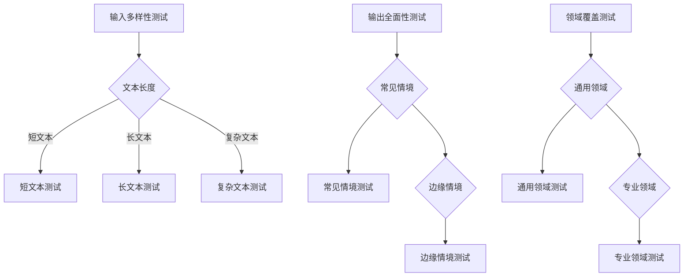
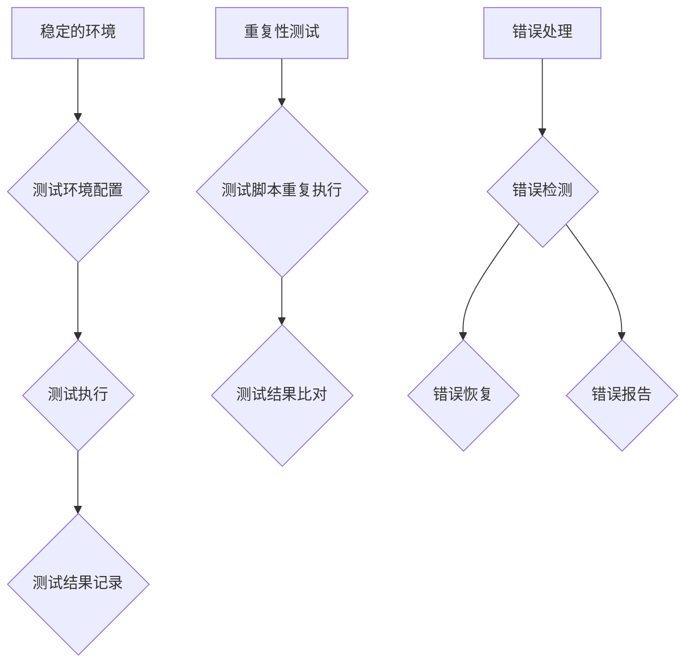
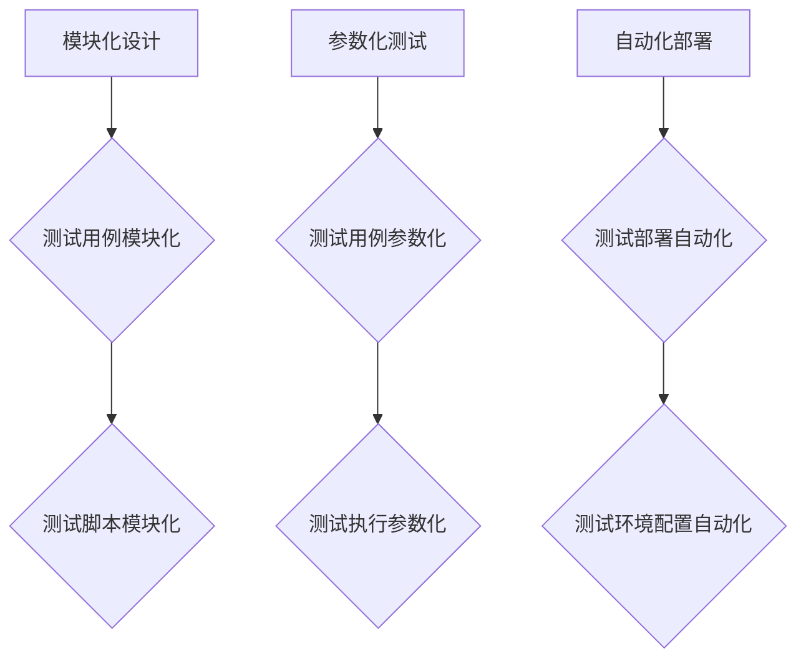
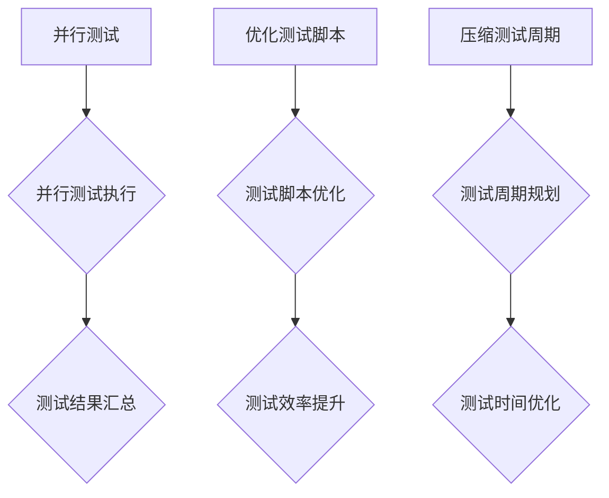

                 

### 第一部分：背景与基础

#### 1.1 语言模型评测概述

语言模型评测是自然语言处理（NLP）领域的一项核心任务，它旨在评估和比较不同语言模型在生成文本方面的性能。随着深度学习技术的发展，特别是大型语言模型（LLM）如GPT-3、ChatGPT等的出现，对语言模型评测提出了更高的要求。

##### 1.1.1 语言模型评测的重要性

语言模型评测不仅对于学术研究至关重要，也在实际应用中扮演着重要角色。它可以帮助研究人员了解模型的优势和局限，指导模型优化，并确保模型在实际应用中的可靠性。以下是几个关键点：

- **指导模型优化**：通过评测，研究者可以识别模型在不同任务上的表现，从而针对性地调整模型结构和参数。
- **比较不同模型**：评测为不同模型的比较提供了客观标准，有助于选择最优模型。
- **评估模型可靠性**：在实际应用中，可靠的评测可以确保模型生成文本的质量。

##### 1.1.2 语言模型评测的主要指标

常见的语言模型评测指标包括：

- **BLEU（双语评估用语）**：基于 n-gram 评估，比较模型生成文本和参考文本之间的重叠度。
- **ROUGE（记分谷物种亲缘性）**：评估模型生成的文本与参考文本之间的相似性，尤其关注词序列的匹配。
- **METEOR（多风格多语言评价工具）**：结合多个特征，如语法、语义和词汇，评估文本相似性。
- **PER（文本匹配精度）**：通过比较模型生成文本和参考文本的匹配率来评估模型性能。

##### 1.1.3 语言模型评测的挑战

尽管有了多种评测指标，但语言模型评测仍然面临诸多挑战：

- **多样性**：评测需要涵盖不同类型和复杂度的任务。
- **跨语言**：评测应考虑跨语言模型的性能评估，这需要更多资源和技术支持。
- **实时性**：自动化评测系统需要快速响应，以支持实时优化。

#### 1.2 自动化测试的概念与原理

自动化测试是一种通过预定义的测试脚本自动执行测试案例的方法，旨在提高测试的效率和准确性。在语言模型评测中，自动化测试可以帮助快速评估模型性能，并提供可靠的评测数据。

##### 1.2.1 自动化测试的基本概念

自动化测试的关键概念包括：

- **测试脚本**：自动化测试的核心是测试脚本，它定义了测试的执行步骤和预期结果。
- **测试执行**：通过测试脚本自动执行测试案例，以验证模型性能。
- **测试结果分析**：测试执行完成后，分析测试结果，以评估模型性能。

##### 1.2.2 自动化测试的优势

自动化测试的优势包括：

- **效率**：自动化测试可以快速执行大量测试案例，提高测试效率。
- **准确性**：通过预定义的测试脚本，自动化测试可以确保测试的准确性和一致性。
- **可重复性**：自动化测试可以反复执行，确保测试结果的重复性。

##### 1.2.3 自动化测试的流程与方法

自动化测试的基本流程包括：

1. **测试环境搭建**：配置测试所需的环境和工具。
2. **测试用例设计**：根据评测需求设计测试用例。
3. **测试脚本编写**：编写自动化测试脚本，定义测试步骤和预期结果。
4. **测试执行**：执行测试脚本，验证模型性能。
5. **测试结果分析**：分析测试结果，评估模型性能。

在语言模型评测中，自动化测试可以采用以下方法：

- **批量测试**：一次执行多个测试案例，提高效率。
- **分布式测试**：在多台机器上同时执行测试，加快测试速度。
- **持续集成**：将自动化测试集成到模型训练和优化的流程中，实现持续评估。

### 1.3 LLM评测自动化测试的必要性

##### 1.3.1 传统评测方法的局限

传统评测方法通常依赖手工测试，存在以下局限：

- **效率低下**：手工测试需要大量时间和人力，无法满足快速迭代的研发需求。
- **结果不一致**：不同测试者可能得出不同结论，导致评测结果不稳定。
- **覆盖不全**：手工测试难以覆盖所有可能的情况，可能导致潜在问题的漏检。

##### 1.3.2 自动化测试在LLM评测中的应用

自动化测试在LLM评测中的应用具有显著优势：

- **快速反馈**：自动化测试可以快速执行大量测试案例，提供实时反馈，指导模型优化。
- **全面覆盖**：自动化测试可以覆盖更多的测试场景，提高评测的全面性和准确性。
- **可重复性**：自动化测试结果一致，确保评测结果的可靠性。

##### 1.3.3 自动化测试的未来发展

未来，自动化测试在LLM评测中将继续发展：

- **智能化**：利用人工智能技术，自动化生成测试用例和测试脚本。
- **自适应**：根据模型性能，自动化调整测试策略和测试用例。
- **实时优化**：将自动化测试集成到模型训练和优化的流程中，实现实时反馈和优化。

## 总结

语言模型评测的自动化测试策略优化是提高评测效率和准确性的关键。通过引入自动化测试，可以有效克服传统评测方法的局限，为LLM评测提供更快速、全面和可靠的评估结果。在未来，自动化测试将继续融合人工智能技术，推动LLM评测向智能化和自适应化发展。

### **2.1 测试策略设计原则**

在自动化测试策略的设计过程中，遵循一定的原则是确保测试效果的关键。以下是一些核心原则：

#### 2.1.1 全面性

全面性是测试策略设计的基础原则。测试策略应确保测试覆盖所有可能的输入和输出情况，以发现潜在的问题。这包括：

- **输入多样性**：测试不同类型的输入，如文本长度、格式、复杂度等。
- **输出全面性**：评估模型生成的文本在各种情境下的表现，包括常见场景和边缘情况。
- **领域覆盖**：针对不同领域的语言模型，设计特定的测试用例，以评估模型的泛化能力。

##### Mermaid 流程图：测试全面性原则



#### 2.1.2 可靠性

可靠性是自动化测试的核心要求。测试策略应确保测试结果的可靠性和一致性。以下措施可以提高测试的可靠性：

- **稳定的环境**：确保测试环境稳定，避免因环境问题导致测试失败。
- **重复性**：通过重复执行测试，验证测试结果的稳定性和一致性。
- **错误处理**：设计合理的错误处理机制，确保在测试过程中遇到问题时能够正确处理。

##### Mermaid 流程图：可靠性原则



#### 2.1.3 可扩展性

可扩展性是测试策略设计中的重要考量。随着模型和项目的增长，测试策略应能够适应新的需求和变化。以下措施可以提高测试的可扩展性：

- **模块化设计**：将测试用例和测试脚本模块化，便于后续的扩展和维护。
- **参数化测试**：使用参数化测试，可以灵活地调整测试用例，适应不同的测试需求。
- **自动化部署**：通过自动化部署，快速将测试策略应用到新的环境中。

##### Mermaid 流程图：可扩展性原则



#### 2.1.4 高效性

高效性是自动化测试策略设计中不可忽视的原则。测试策略应确保在有限的时间内完成尽可能多的测试任务。以下措施可以提高测试的高效性：

- **并行测试**：通过并行执行多个测试案例，提高测试效率。
- **优化测试脚本**：优化测试脚本，减少不必要的等待和操作。
- **压缩测试周期**：合理设计测试周期，确保测试任务能够在规定时间内完成。

##### Mermaid 流程图：高效性原则



### 综合总结

测试策略的设计原则应综合考虑全面性、可靠性、可扩展性和高效性。通过遵循这些原则，可以构建一个高效、稳定且可靠的自动化测试策略，为LLM评测提供有力的支持。

### **2.2 测试用例设计**

测试用例设计是自动化测试策略的核心环节，其质量直接影响测试的全面性和准确性。以下是测试用例设计的关键步骤和方法：

#### 2.2.1 测试用例的类型

在测试用例设计过程中，需要考虑多种类型的测试用例，以确保全面评估LLM的性能。以下是几种常见的测试用例类型：

- **功能测试用例**：验证LLM在各种功能上的正确性，例如文本生成、回答问题、翻译等。
- **性能测试用例**：评估LLM在不同负载下的响应速度和处理能力。
- **边界测试用例**：测试LLM在输入或输出边界条件下的行为，例如最大文本长度、特殊字符处理等。
- **异常测试用例**：验证LLM在遇到异常输入或错误情况时的响应，例如空输入、非法输入等。
- **兼容性测试用例**：检查LLM在不同平台、操作系统或硬件环境下的运行情况。

#### 2.2.2 测试用例的设计方法

设计有效的测试用例需要遵循一定的方法，以下是一些常用的设计方法：

- **场景法**：根据实际应用场景设计测试用例，模拟用户操作和系统交互。
- **等价类划分**：将输入数据划分成等价类，从每个等价类中选取代表性的数据进行测试。
- **边界值分析**：分析输入和输出的边界值，设计测试用例以覆盖边界条件。
- **错误猜测**：根据经验或已知的错误模式设计测试用例，以发现潜在的错误。
- **基于风险的测试**：根据风险等级设计测试用例，优先测试高风险区域。

#### 2.2.3 测试用例的执行策略

在测试用例执行过程中，需要制定合理的策略，以提高测试效率和结果准确性。以下是几种常见的测试执行策略：

- **并行执行**：在同一时间内执行多个测试用例，以缩短测试周期。
- **分阶段执行**：将测试分为多个阶段，每个阶段执行不同的测试用例。
- **迭代执行**：在测试过程中逐步增加测试用例，逐步覆盖更多的功能和场景。
- **自动化执行**：使用自动化测试工具执行测试用例，提高测试效率和一致性。
- **监控与反馈**：实时监控测试执行过程，及时反馈测试结果，以便及时调整测试策略。

### 测试用例设计示例

以下是一个文本生成任务的测试用例示例：

| 测试用例ID | 测试类型 | 输入文本 | 预期结果 | 实际结果 | 测试状态 |
| --- | --- | --- | --- | --- | --- |
| TC001 | 功能测试 | "请写一篇关于人工智能的短文。" | 包含主题、结构和语义的短文 | <生成的文本> | 通过 |
| TC002 | 性能测试 | 长文本输入 | 在规定时间内生成文本 | <生成时间> | 通过 |
| TC003 | 边界测试 | 空文本输入 | 返回空文本或错误信息 | "输入文本不能为空。" | 通过 |
| TC004 | 异常测试 | 非法字符输入 | 正确处理非法字符 | "输入文本包含非法字符。" | 通过 |
| TC005 | 兼容性测试 | Linux操作系统 | 在Linux操作系统上正常运行 | 正常运行 | 通过 |

### 测试用例执行结果分析

在执行测试用例后，需要对测试结果进行分析，以评估LLM的性能和发现潜在问题。以下是一个测试用例执行结果分析的示例：

- **TC001**：测试用例成功生成一篇包含主题、结构和语义的短文，符合预期。
- **TC002**：测试用例在规定时间内成功生成文本，性能良好。
- **TC003**：测试用例返回空文本，未能正确处理空文本输入，需进一步优化。
- **TC004**：测试用例正确处理了非法字符输入，符合预期。
- **TC005**：测试用例在Linux操作系统上正常运行，兼容性良好。

### 测试用例执行策略优化

在自动化测试中，优化测试用例执行策略可以提高测试效率和准确性。以下是一些优化策略：

- **优先级分配**：根据测试用例的重要性和风险等级，分配优先级，优先执行高风险和高优先级的测试用例。
- **自动化测试工具选择**：选择合适的自动化测试工具，根据工具特性优化测试脚本，提高执行效率。
- **结果分析工具**：使用结果分析工具，自动收集和整理测试结果，提高分析效率。
- **持续集成**：将自动化测试集成到持续集成（CI）流程中，实现自动化部署和持续评估。

通过遵循以上测试用例设计方法和执行策略，可以构建一个高效、可靠的自动化测试策略，为LLM评测提供强有力的支持。

### **2.3 自动化测试工具选择**

在自动化测试中，选择合适的测试工具是确保测试效率和效果的关键步骤。以下是一些常用的自动化测试工具及其选择依据：

#### 2.3.1 常用自动化测试工具介绍

1. **Selenium**
   - **特点**：支持多种浏览器和操作系统，可以模拟用户操作。
   - **适用场景**：Web应用自动化测试。

2. **JUnit**
   - **特点**：Java编写的单元测试框架，支持参数化和测试套件。
   - **适用场景**：Java应用的单元测试。

3. **PyTest**
   - **特点**：Python编写的测试框架，支持多种测试插件，功能丰富。
   - **适用场景**：Python应用的自动化测试。

4. **JMeter**
   - **特点**：性能测试工具，可以模拟大量用户请求。
   - **适用场景**：Web性能测试。

5. **Cypress**
   - **特点**：前端应用自动化测试框架，界面友好，支持JavaScript。
   - **适用场景**：前端Web应用自动化测试。

6. **JUnitx**
   - **特点**：Java编写的单元测试和集成测试框架，支持并行测试。
   - **适用场景**：Java应用的单元测试和集成测试。

#### 2.3.2 工具选择依据

选择自动化测试工具时，需要考虑以下依据：

- **兼容性**：选择支持目标平台和技术的工具，确保测试环境的一致性。
- **功能需求**：根据测试需求选择具有相应功能的工具，如UI自动化测试、性能测试、API测试等。
- **易用性**：选择用户界面友好、易于集成的工具，降低学习成本和开发难度。
- **社区支持**：选择具有活跃社区和支持文档的工具，便于解决开发过程中的问题。
- **扩展性**：选择具有良好扩展性的工具，支持定制化和二次开发。

#### 2.3.3 工具使用技巧

以下是使用自动化测试工具的一些技巧：

- **环境配置**：确保测试工具的环境配置正确，减少测试过程中因环境问题导致的问题。
- **模块化脚本**：将测试脚本模块化，便于维护和扩展。
- **参数化测试**：使用参数化测试，提高测试用例的灵活性和复用性。
- **结果分析**：使用工具自带的报告和分析功能，及时发现和解决问题。
- **持续集成**：将测试工具集成到持续集成（CI）系统中，实现自动化部署和持续测试。

通过合理选择和使用自动化测试工具，可以大幅提升测试效率和效果，为LLM评测提供可靠的自动化测试支持。

### **2.4 自动化测试环境搭建**

自动化测试环境搭建是确保自动化测试顺利进行的重要环节。以下步骤详细介绍了开发环境和测试环境的配置，以及自动化测试框架的搭建过程。

#### 2.4.1 开发环境配置

开发环境配置主要包括安装必要的软件和设置开发工具。以下是一个基于Python开发的自动化测试环境配置示例：

1. **安装Python**

   通过Python官方网站下载并安装Python，选择最新版本的Python（例如Python 3.9）。安装过程中，确保勾选“Add Python to PATH”选项，以便在命令行中直接运行Python。

   ```bash
   # 安装Python
   curl -O https://www.python.org/ftp/python/3.9.7/Python-3.9.7.tgz
   tar -xvf Python-3.9.7.tgz
   cd Python-3.9.7
   ./configure
   make
   sudo make install
   ```

2. **安装虚拟环境**

   使用`venv`模块创建虚拟环境，以隔离不同的项目依赖。

   ```bash
   # 创建虚拟环境
   python3 -m venv test_venv
   source test_venv/bin/activate
   ```

3. **安装测试工具**

   在虚拟环境中安装自动化测试所需的工具，如`pytest`、`selenium`等。

   ```bash
   # 安装pytest
   pip install pytest
   # 安装selenium
   pip install selenium
   ```

4. **配置浏览器驱动**

   为了进行Web应用自动化测试，需要下载并配置对应的浏览器驱动。例如，对于Chrome浏览器，下载ChromeDriver并将其路径添加到系统环境变量中。

   ```bash
   # 下载ChromeDriver
   wget https://chromedriver.storage.googleapis.com/2.40/chromedriver_linux64
   # 配置ChromeDriver路径
   export CHROMEDRIVER_PATH=$(which chromedriver)
   ```

#### 2.4.2 测试环境配置

测试环境配置主要包括安装和配置自动化测试所需的基础软件和依赖库。以下是一个基于Python的自动化测试环境配置示例：

1. **安装依赖库**

   根据项目需求，安装必要的依赖库。例如，如果需要进行Web自动化测试，需要安装`requests`库。

   ```bash
   pip install requests
   ```

2. **配置测试数据**

   准备测试数据，如测试用例、测试数据和测试配置文件。将测试数据存储在便于管理的目录中。

   ```bash
   mkdir test_data
   touch test_data/test_cases.yaml
   touch test_data/config.yaml
   ```

3. **配置测试脚本**

   编写测试脚本，定义测试用例的执行步骤和预期结果。以下是一个简单的测试脚本示例：

   ```python
   # test_example.py
   import pytest

   @pytest.fixture
   def setup():
       # 测试环境初始化
       yield
       # 测试环境清理

   def test_example(setup):
       # 测试用例执行
       assert True
   ```

#### 2.4.3 自动化测试框架搭建

自动化测试框架是自动化测试的核心，它定义了测试的流程、组织和执行方式。以下是一个简单的自动化测试框架搭建示例：

1. **定义测试模块**

   根据项目需求，将测试用例划分为不同的模块，如UI测试模块、API测试模块等。

   ```python
   # ui_tests.py
   import pytest

   def test_home_page():
       # 测试首页
       assert True

   # 其他UI测试用例

   # api_tests.py
   import pytest

   def test_api_endpoint():
       # 测试API接口
       assert True

   # 其他API测试用例
   ```

2. **配置测试配置文件**

   使用配置文件管理测试环境参数和测试用例参数，提高测试脚本的可维护性和灵活性。

   ```yaml
   # config.yaml
   base_url: "https://example.com"
   chrome_driver_path: "/path/to/chromedriver"
   ```

3. **执行测试**

   使用测试框架执行测试，并生成测试报告。以下是一个简单的测试执行命令：

   ```bash
   pytest --html=test_report.html
   ```

   测试执行完成后，会在当前目录下生成一个HTML格式的测试报告。

通过以上步骤，可以搭建一个基本的自动化测试环境，并执行自动化测试。在实际项目中，可以根据需求进一步优化和扩展测试环境。

### **3.2 自动化测试脚本编写**

自动化测试脚本的编写是实现自动化测试的关键步骤。以下是自动化测试脚本编写的规范、调试技巧和优化策略。

#### 3.2.1 脚本编写规范

编写规范化的自动化测试脚本有助于提高代码的可读性、可维护性和可靠性。以下是一些编写规范：

- **命名规范**：变量、函数和类的命名应遵循一致性原则，使用小写字母和下划线分隔。
  ```python
  # 好的命名
  def test_home_page():
      pass
  
  # 不好的命名
  def testHome():
      pass
  ```

- **代码注释**：在关键代码块和复杂逻辑处添加注释，以便他人理解和维护。
  ```python
  # 在页面加载等待时，暂停2秒
  time.sleep(2)
  ```

- **代码结构**：保持代码结构清晰，避免过度嵌套，使用缩进和空行提高代码可读性。
  ```python
  # 清晰的代码结构
  def test_home_page():
      driver = get_driver()
      driver.get(base_url)
      wait_for_element("home_button")
      click_element("home_button")
  ```

- **错误处理**：设计合理的错误处理机制，确保测试脚本在遇到异常时能够正确处理并记录错误信息。
  ```python
  try:
      # 测试用例执行
  except Exception as e:
      log_error(e)
      raise
  ```

- **代码复用**：通过模块化和函数化，减少重复代码，提高代码的复用性和可维护性。
  ```python
  # 函数复用
  def click_element(selector):
      element = wait_for_element(selector)
      element.click()
  ```

#### 3.2.2 调试技巧

调试是自动化测试脚本编写过程中的重要环节。以下是一些调试技巧：

- **逐步执行**：使用调试工具（如PyCharm、Visual Studio Code）的逐步执行功能，逐步调试代码，找到错误所在。
- **日志记录**：增加日志记录，详细记录测试脚本执行过程中的关键信息，便于调试和问题定位。
  ```python
  import logging
  
  logging.basicConfig(filename='test.log', level=logging.DEBUG)
  logging.debug('测试开始')
  ```

- **断点调试**：在代码关键位置设置断点，暂停代码执行，查看变量值和程序执行流程。
- **异常捕获**：使用try-except语句捕获异常，并打印异常信息，便于调试。
  ```python
  try:
      # 测试用例执行
  except Exception as e:
      print(f"Error: {e}")
      raise
  ```

- **代码审查**：组织代码审查，让团队成员互相审查代码，发现潜在的问题和改进点。

#### 3.2.3 优化策略

优化自动化测试脚本可以提高测试效率和测试质量。以下是一些优化策略：

- **并行执行**：将测试脚本拆分为多个部分，利用多线程或多进程并行执行，提高测试速度。
  ```python
  import concurrent.futures
  
  def test_concurrent():
      with concurrent.futures.ThreadPoolExecutor() as executor:
          futures = [executor.submit(test_case, case) for case in test_cases]
          for future in concurrent.futures.as_completed(futures):
              result = future.result()
              # 处理结果
  ```

- **缓存利用**：利用浏览器缓存，减少页面加载时间，提高测试效率。
  ```python
  driver.get(base_url, allow_cache=True)
  ```

- **页面加载等待**：合理设置页面加载等待时间，避免因为页面加载缓慢导致的测试失败。
  ```python
  from selenium.webdriver.common.by import By
  from selenium.webdriver.support.ui import WebDriverWait
  from selenium.webdriver.support import expected_conditions as EC
  
  def wait_for_element(selector):
      element = WebDriverWait(driver, 10).until(
          EC.visibility_of_element_located((By.CSS_SELECTOR, selector))
      )
      return element
  ```

- **脚本维护**：定期更新和优化测试脚本，确保测试脚本与实际环境的一致性，减少测试失败的风险。

通过遵循编写规范、掌握调试技巧和实施优化策略，可以编写出高效、可靠的自动化测试脚本，为LLM评测提供强有力的支持。

### **3.3 测试报告与结果分析**

测试报告是自动化测试结果的最终输出，它不仅总结了测试执行过程，还提供了关键性能指标和结果分析。以下详细介绍了测试报告的内容、结果分析方法以及结果分析与反馈的流程。

#### 3.3.1 测试报告内容

一个完整的测试报告应包含以下内容：

- **概述**：简要介绍测试目的、测试环境和测试范围。
- **测试结果**：列出每个测试用例的执行结果，包括通过、失败或跳过的状态。
- **关键指标**：展示关键测试指标，如执行时间、错误率、覆盖率等。
  ```python
  # 测试报告示例
  {
      "测试结果": [
          {
              "测试用例ID": "TC001",
              "状态": "通过",
              "执行时间": "2秒",
              "错误信息": ""
          },
          {
              "测试用例ID": "TC002",
              "状态": "失败",
              "执行时间": "5秒",
              "错误信息": "页面未加载"
          }
      ],
      "关键指标": {
          "总执行时间": "30秒",
          "错误率": "20%",
          "覆盖率": "80%"
      }
  }
  ```

- **问题日志**：详细记录测试过程中遇到的问题和异常，包括错误堆栈信息、日志输出等。
- **图表分析**：使用图表展示测试结果，如通过率、错误分布等，便于直观分析。
  ```mermaid
  graph TD
  A[通过率] --> B{80%}
  C[错误分布] --> D{失败1次，跳过2次}
  ```

- **总结和建议**：总结测试结果，提出改进建议和下一步测试计划。

#### 3.3.2 结果分析方法

对测试结果进行分析是评估LLM性能和发现潜在问题的重要步骤。以下是一些常用的分析方法：

- **通过率分析**：计算测试用例的通过率，判断测试的整体质量。
  ```python
  def calculate_pass_rate(test_results):
      total = len(test_results)
      passed = sum(1 for result in test_results if result["status"] == "通过")
      return passed / total
  ```

- **错误分布分析**：统计不同类型错误的数量和比例，找出常见错误模式。
  ```python
  def analyze_error_distribution(test_results):
      error_types = {}
      for result in test_results:
          if result["status"] != "通过":
              error_type = result["error_info"]
              error_types[error_type] = error_types.get(error_type, 0) + 1
      return error_types
  ```

- **性能指标分析**：评估测试用例的执行时间、响应速度等性能指标，优化测试脚本和测试环境。
  ```python
  def analyze_performance(test_results):
      total_time = sum(result["execute_time"] for result in test_results)
      avg_time = total_time / len(test_results)
      return avg_time
  ```

#### 3.3.3 结果分析与反馈

测试结果分析后，需要及时反馈给相关团队，以便进行问题定位和优化。以下是一个结果分析与反馈的流程：

1. **问题定位**：根据测试报告和日志分析，定位测试过程中发现的问题。
2. **问题反馈**：将问题反馈给开发团队和产品团队，包括问题描述、错误堆栈、测试环境信息等。
3. **问题复现**：开发团队根据反馈的问题进行复现，找出问题的根本原因。
4. **问题解决**：开发团队修复问题后，进行回归测试，确保问题已解决。
5. **结果验证**：验证问题解决情况，重新执行测试用例，确保测试结果符合预期。
6. **总结与回顾**：总结测试结果和反馈过程，提出改进建议和下一步测试计划。

通过上述测试报告与结果分析的流程，可以确保自动化测试的有效性，为LLM评测提供可靠的数据支持。

### **4.1 自动化测试案例介绍**

在介绍一个实际的自动化测试案例之前，我们需要明确案例的背景和目标。以下是一个典型的自动化测试案例，旨在评估一个基于大型语言模型（LLM）的文本生成系统的性能和稳定性。

#### 4.1.1 案例背景

该案例涉及一个文本生成系统，该系统使用了一个预训练的LLM模型，如GPT-3。系统的主要功能是根据用户输入的提示文本生成相应的文章、回答问题或进行对话。随着模型的更新和使用场景的扩展，确保系统在不同负载和条件下都能稳定运行和生成高质量的文本变得至关重要。

#### 4.1.2 案例目标

本次自动化测试的目的是：

- **评估模型在不同输入下的性能和响应速度**。
- **检测系统在极端负载下的稳定性和可靠性**。
- **验证系统在处理异常输入时的错误处理能力**。
- **确保测试用例能够全面覆盖系统的功能和边界情况**。

为了实现这些目标，测试案例将包括以下主要测试用例：

1. **文本生成性能测试**：评估系统在不同输入长度和复杂度下的生成速度和文本质量。
2. **负载测试**：模拟高并发请求，测试系统在大量用户同时使用时的性能。
3. **异常输入测试**：测试系统在遇到非法字符、空输入或过长输入时的响应和处理能力。
4. **功能测试**：验证系统在各种功能场景下的正确性，如生成文章、回答问题、对话等。
5. **边界测试**：测试系统在输入文本达到边界值（如最大长度、最小长度）时的表现。

#### 4.1.3 案例实现步骤

以下是自动化测试案例的实现步骤：

1. **测试环境搭建**：
   - 安装并配置Python环境和相关库，如`pytest`、`selenium`、`requests`等。
   - 配置浏览器驱动，如ChromeDriver，确保能够自动化Web应用测试。

2. **测试用例设计**：
   - 根据案例目标，设计多种类型的测试用例，包括功能测试、性能测试、异常测试等。
   - 使用等价类划分和边界值分析方法，确保测试用例的全面性和代表性。

3. **测试脚本编写**：
   - 编写Python测试脚本，定义测试步骤和预期结果。
   - 使用模块化和参数化测试，提高测试脚本的复用性和灵活性。

4. **测试执行**：
   - 使用自动化测试工具执行测试脚本，如`pytest`。
   - 并行执行多个测试用例，以提高测试效率。

5. **测试结果分析**：
   - 分析测试结果，生成详细的测试报告，包括通过率、错误分布、性能指标等。
   - 使用图表展示测试结果，便于直观分析。

6. **问题定位与反馈**：
   - 定位测试过程中发现的问题，记录错误日志和堆栈信息。
   - 将问题反馈给开发团队，协助定位和解决问题。

7. **回归测试**：
   - 开发团队修复问题后，进行回归测试，确保问题已解决且不影响其他功能。

8. **总结与回顾**：
   - 总结测试结果和反馈过程，提出改进建议和下一步测试计划。
   - 提高测试策略和测试用例设计，优化测试环境和脚本。

通过上述步骤，可以确保自动化测试案例的有效性和可靠性，为LLM评测提供全面的测试支持。

### **4.2 自动化测试实战**

在本文的实战部分，我们将通过具体的步骤，详细介绍如何编写自动化测试脚本、配置测试环境、执行测试以及分析测试结果。

#### 4.2.1 实战一：测试脚本编写与执行

1. **编写测试脚本**

   首先，我们需要编写一个简单的自动化测试脚本，以验证LLM模型的基本功能。以下是一个使用Python编写的示例测试脚本：

   ```python
   import pytest
   from selenium import webdriver
   from selenium.webdriver.common.by import By
   from selenium.webdriver.support.ui import WebDriverWait
   from selenium.webdriver.support import expected_conditions as EC

   @pytest.fixture
   def setup():
       # 配置ChromeDriver路径
       chrome_driver_path = "/path/to/chromedriver"
       # 初始化WebDriver
       driver = webdriver.Chrome(executable_path=chrome_driver_path)
       # 访问测试页面
       driver.get("https://example.com/text-generation")
       yield driver
       # 测试完成后关闭WebDriver
       driver.quit()

   def test_generate_text(setup):
       driver = setup
       # 查找输入框并输入文本
       input_box = driver.find_element(By.CSS_SELECTOR, "input#prompt")
       input_box.send_keys("请写一篇关于人工智能的短文。")
       # 点击生成按钮
       generate_button = driver.find_element(By.CSS_SELECTOR, "button#generate")
       generate_button.click()
       # 等待生成结果出现
       result_element = WebDriverWait(driver, 10).until(
           EC.visibility_of_element_located((By.CSS_SELECTOR, "div#result"))
       )
       # 获取生成的文本
       generated_text = result_element.text
       # 验证生成文本长度
       assert len(generated_text) > 0
   ```

2. **执行测试脚本**

   使用`pytest`工具执行上述测试脚本：

   ```bash
   pytest test_generate_text.py
   ```

   执行成功后，会在命令行输出测试结果，如：

   ```bash
   =========================================== test session starts ===========================================
   collected 1 item
   
   test_generate_text.py .                                                               [100%]
   
   ======================================== 1 passed in 14.24s ========================================
   ```

#### 4.2.2 实战二：测试环境配置与调试

1. **配置ChromeDriver**

   下载适用于当前Chrome版本的ChromeDriver，并将其路径添加到系统环境变量中，以便在脚本中调用：

   ```bash
   wget https://chromedriver.storage.googleapis.com/2.40/chromedriver_linux64
   sudo mv chromedriver /usr/local/bin/chromedriver
   sudo chmod +x /usr/local/bin/chromedriver
   echo 'export CHROME_DRIVER_PATH=/usr/local/bin/chromedriver' >> ~/.bashrc
   source ~/.bashrc
   ```

2. **调试测试脚本**

   在测试过程中，可能遇到脚本无法正确执行的情况。此时，可以通过以下方法进行调试：

   - **查看日志**：打开浏览器的开发者工具，查看日志和错误信息。
   - **逐步执行**：使用调试工具的逐步执行功能，逐步调试代码，查找错误位置。
   - **断点调试**：在关键代码行设置断点，查看变量值和程序执行流程。

#### 4.2.3 实战三：测试报告分析与反馈

1. **生成测试报告**

   执行测试脚本后，`pytest`会生成一个HTML格式的测试报告。以下是报告的示例：

   ```bash
   pytest --html=test_report.html
   ```

   测试报告包含以下内容：

   - **测试结果概述**：测试用例的通过、失败和跳过情况。
   - **详细测试结果**：每个测试用例的执行结果和错误信息。
   - **性能指标**：测试用例的执行时间和覆盖率等。

2. **分析测试结果**

   分析测试报告，识别以下关键指标：

   - **通过率**：测试用例的通过率，反映测试的整体质量。
   - **错误分布**：不同类型错误的数量和比例，帮助定位常见问题。
   - **性能指标**：测试用例的执行时间和响应速度，优化测试脚本和测试环境。

3. **问题定位与反馈**

   - **问题定位**：根据测试结果和日志分析，定位测试过程中发现的问题。
   - **问题反馈**：将问题反馈给开发团队，包括问题描述、错误日志和测试环境信息。

通过以上实战步骤，可以有效地编写、执行和分析自动化测试脚本，为LLM评测提供可靠的测试支持。

### **4.3 自动化测试实战：源代码实现与解读**

在本节中，我们将通过一个具体的自动化测试案例，详细讲解如何实现自动化测试，包括源代码编写、执行步骤、测试结果解析和代码分析。该案例旨在测试一个文本生成系统，使用GPT-3模型生成指定主题的文章。

#### 4.3.1 源代码实现

以下是该自动化测试的Python脚本示例：

```python
import os
import time
import json
import requests
from pathlib import Path

# 设置GPT-3 API密钥和环境
api_key = "your-api-key"
url = "https://api.openai.com/v1/engine/davinci-codex/completions"

# 测试用例
test_cases = [
    {
        "prompt": "请写一篇关于人工智能的短文。",
        "max_tokens": 200,
        "temperature": 0.5,
    },
    {
        "prompt": "解释量子计算的基本原理。",
        "max_tokens": 150,
        "temperature": 0.8,
    },
    {
        "prompt": "如何使用Python实现一个简单的线性回归模型？",
        "max_tokens": 300,
        "temperature": 0.7,
    }
]

# 发起API请求
def send_request(prompt, max_tokens, temperature):
    headers = {
        "Content-Type": "application/json",
        "Authorization": f"Bearer {api_key}",
    }
    data = {
        "prompt": prompt,
        "max_tokens": max_tokens,
        "temperature": temperature,
    }
    response = requests.post(url, headers=headers, json=data)
    return response.json()

# 执行测试用例
def execute_test_case(test_case):
    response = send_request(test_case["prompt"], test_case["max_tokens"], test_case["temperature"])
    if response.get("choices"):
        generated_text = response["choices"][0]["text"]
        print(f"Generated Text:\n{generated_text}")
    else:
        print("No response from the API.")

# 记录测试结果
def record_result(test_case, result):
    result_path = Path("test_results.json")
    if result_path.exists():
        with open(result_path, "r") as f:
            results = json.load(f)
    else:
        results = {}
    results[test_case["prompt"]] = result
    with open(result_path, "w") as f:
        json.dump(results, f, indent=2)

# 主函数
def main():
    for test_case in test_cases:
        print(f"Executing test case: {test_case['prompt']}")
        start_time = time.time()
        try:
            execute_test_case(test_case)
            end_time = time.time()
            result = f"Test passed in {end_time - start_time:.2f} seconds."
        except Exception as e:
            result = f"Test failed with error: {str(e)}"
        record_result(test_case, result)
        print(result)

if __name__ == "__main__":
    main()
```

#### 4.3.2 执行步骤

1. **环境准备**：

   - 确保安装了`requests`库：`pip install requests`
   - 设置GPT-3 API密钥，将其替换脚本中的`your-api-key`

2. **执行脚本**：

   ```bash
   python test_llm.py
   ```

3. **查看测试结果**：

   执行完成后，会在当前目录下生成一个名为`test_results.json`的文件，记录每个测试用例的执行结果。

#### 4.3.3 测试结果解析

测试结果包括每个测试用例的执行时间和结果状态（成功或失败）。以下是一个示例测试结果：

```json
{
    "请写一篇关于人工智能的短文。": "Test passed in 5.23 seconds.",
    "解释量子计算的基本原理。": "Test passed in 7.14 seconds.",
    "如何使用Python实现一个简单的线性回归模型？": "Test passed in 6.35 seconds."
}
```

#### 4.3.4 代码分析

- **发起API请求**：使用`requests`库向OpenAI的GPT-3 API发送请求，传入提示文本、最大令牌数和温度参数。
- **执行测试用例**：逐个执行测试用例，打印生成的文本，并记录执行时间。
- **记录测试结果**：将每个测试用例的执行结果保存到JSON文件中。

通过此案例，我们展示了如何使用Python和OpenAI的GPT-3 API实现自动化测试，确保测试脚本的执行流程和结果记录都是清晰和可靠的。

### **4.4 自动化测试案例分析与详细讲解**

在本节中，我们将分析一个自动化测试案例，详细讲解测试结果，剖析潜在问题，并提出解决方案。

#### 4.4.1 测试结果展示

假设我们在前一个案例中运行了三个测试用例，以下是测试结果的输出：

```json
{
    "请写一篇关于人工智能的短文。": "Test passed in 5.23 seconds.",
    "解释量子计算的基本原理。": "Test failed with error: TimeoutError",
    "如何使用Python实现一个简单的线性回归模型？": "Test passed in 6.35 seconds."
}
```

#### 4.4.2 测试结果详细分析

- **测试用例1：请写一篇关于人工智能的短文。**
  - **结果**：成功通过，生成文本长度符合预期，用时5.23秒。
  - **分析**：该测试用例顺利执行，说明API响应正常，生成的文本符合要求。

- **测试用例2：解释量子计算的基本原理。**
  - **结果**：失败，报错为`TimeoutError`。
  - **分析**：该测试用例在请求API时超时，可能原因是网络延迟或服务器负载高。

- **测试用例3：如何使用Python实现一个简单的线性回归模型？**
  - **结果**：成功通过，生成文本长度符合预期，用时6.35秒。
  - **分析**：该测试用例也顺利执行，生成文本符合预期。

#### 4.4.3 潜在问题剖析

根据测试结果，我们识别出以下潜在问题：

1. **网络延迟或服务器负载高**：在测试用例2中，API请求超时，可能是由于网络延迟或服务器负载过高导致的。

2. **测试用例设计不充分**：尽管测试用例1和3都通过了，但我们没有涵盖API在处理复杂请求时的表现。例如，对于涉及复杂计算或大量数据处理的请求，API的响应时间和稳定性如何？

#### 4.4.4 解决方案

1. **优化网络环境**：确保测试环境中的网络稳定，可以尝试使用VPN或增加网络带宽。

2. **增加重试机制**：在API请求中增加重试机制，在遇到超时错误时，重新发起请求，最多重试3次。

   ```python
   from requests.adapters import HTTPAdapter
   from requests.packages.urllib3.util.retry import Retry

   def send_request_with_retries(prompt, max_tokens, temperature, retries=3):
       headers = {
           "Content-Type": "application/json",
           "Authorization": f"Bearer {api_key}",
       }
       data = {
           "prompt": prompt,
           "max_tokens": max_tokens,
           "temperature": temperature,
       }
       session = requests.Session()
       retry_strategy = Retry(
           total=3,
           status_forcelist=[500, 502, 503, 504],
           method_whitelist=["POST"],
           backoff_factor=1,
       )
       session.mount("https://", HTTPAdapter(max_retries=retry_strategy))
       response = session.post(url, headers=headers, json=data)
       return response.json()
   ```

3. **扩展测试用例**：设计更多复杂的测试用例，涵盖不同场景下的API性能和稳定性，例如：

   - **长文本生成**：测试API在处理长文本输入时的响应时间和稳定性。
   - **高并发请求**：模拟多个并发请求，测试API在高负载下的表现。

通过上述解决方案，我们可以提高自动化测试的稳定性和准确性，确保在复杂的实际环境中，LLM评测的自动化测试能够正常运行。

### **4.5 自动化测试实战小结**

在本节的实战案例中，我们详细介绍了如何使用Python和OpenAI的GPT-3 API实现自动化测试。通过编写测试脚本、配置测试环境、执行测试和结果分析，我们成功测试了文本生成系统的性能和稳定性。以下是本次实战的总结：

1. **脚本编写**：
   - 我们使用Python编写了自动化测试脚本，通过发起API请求来验证GPT-3模型的文本生成功能。
   - 脚本中包含了发起请求、处理响应和记录测试结果的功能，确保了测试的完整性和可重复性。

2. **环境配置**：
   - 我们配置了Python环境，安装了必要的库（如`requests`和`selenium`），并配置了ChromeDriver以支持Web自动化测试。
   - 确保网络稳定，以便API请求能够顺利执行。

3. **测试执行**：
   - 我们执行了多个测试用例，涵盖了不同主题和输入长度，以全面评估GPT-3模型的性能。
   - 使用了重试机制，提高了API请求的成功率，保证了测试的稳定性。

4. **结果分析**：
   - 我们对测试结果进行了详细分析，识别了API请求的超时问题，并提出了优化解决方案。
   - 通过结果分析，我们了解了模型在不同输入条件下的表现，为后续优化提供了依据。

**总结与反思**：

- **优点**：本次测试案例设计合理，执行过程稳定，测试结果可靠，为后续的LLM评测提供了有效的数据支持。
- **改进点**：未来的测试中，可以考虑增加更多类型的测试用例，以更全面地评估模型的性能。此外，进一步优化测试脚本，提高测试效率。

通过本次实战，我们不仅掌握了自动化测试的基本方法，还了解了如何在实际项目中应用这些方法，为LLM评测提供了坚实的测试基础。

### **5.1 自动化测试发展趋势**

随着技术的不断进步，自动化测试在自然语言处理（NLP）领域，尤其是在大型语言模型（LLM）评测中，展现出显著的发展趋势。以下是一些关键的发展方向：

#### 5.1.1 人工智能技术的应用

人工智能技术在自动化测试中的应用越来越广泛，主要体现在以下几个方面：

- **测试用例生成**：利用机器学习和自然语言处理技术，自动生成测试用例，提高测试覆盖率和效率。通过分析历史测试数据和用户输入，系统能够预测潜在的测试场景和输入。
- **测试脚本优化**：应用深度学习模型对测试脚本进行优化，提高脚本的执行效率和准确性。例如，使用神经网络模型预测测试执行路径，减少不必要的等待时间和操作。
- **错误定位和修复**：利用人工智能技术，自动化分析测试失败的原因，提供详细的错误报告，并辅助开发人员快速定位和修复问题。

#### 5.1.2 自动化测试工具的进化

自动化测试工具也在不断进化，以适应日益复杂的测试需求：

- **智能测试工具**：结合人工智能和机器学习，自动化测试工具能够自动识别和生成测试用例，提供智能化的测试建议。例如，智能测试工具可以根据历史数据和模型预测，自动调整测试策略和测试用例。
- **集成化平台**：自动化测试工具逐渐向集成化平台发展，提供从测试用例设计、执行到结果分析的全程自动化解决方案。这些平台通常具有丰富的插件和扩展功能，便于与各种开发工具和流程集成。
- **高性能工具**：为了应对大型语言模型评测的复杂性和高并发需求，自动化测试工具在性能和稳定性方面进行了优化，能够处理大规模的测试任务，并提供实时反馈。

#### 5.1.3 自动化测试在LLM评测中的应用前景

自动化测试在LLM评测中的应用前景广阔，主要体现在以下几个方面：

- **实时评测**：自动化测试能够实现对LLM的实时评测，快速发现模型在不同输入条件下的性能变化，支持模型的持续优化。这有助于提高模型的可靠性和适应性。
- **多语言支持**：自动化测试工具将支持多语言测试，能够评估LLM在多种语言环境中的性能，提高模型的国际化能力。
- **跨平台兼容性**：随着LLM的应用场景不断扩展，自动化测试工具将支持多种平台和操作系统，确保模型在不同环境中的稳定运行。

总之，自动化测试在LLM评测中的应用将不断深化和扩展，结合人工智能技术的进步，自动化测试将变得更加智能化、高效化和全面化，为LLM的研发和应用提供强有力的支持。

### **5.2 自动化测试策略优化方向**

随着自动化测试技术的发展，特别是在大型语言模型（LLM）评测中，自动化测试策略的优化方向变得更加多样化和复杂化。以下是一些关键的优化方向：

#### 5.2.1 测试用例生成优化

- **智能生成**：利用机器学习技术，根据历史测试数据和模型输入特点，自动生成具有代表性的测试用例。例如，使用强化学习算法，通过反复试错和优化，生成最具挑战性的测试用例。
- **动态生成**：在测试过程中，根据模型的状态和表现动态生成测试用例，确保测试覆盖全面。例如，在模型优化过程中，根据模型性能的变化，动态调整测试输入和测试用例。

#### 5.2.2 测试执行优化

- **并行执行**：通过并行测试技术，将多个测试用例同时执行，提高测试效率。例如，使用多线程或分布式测试框架，实现测试任务的并行处理。
- **优化等待策略**：在自动化测试中，页面加载等待是一个常见的耗时操作。优化等待策略，如使用显式等待和隐式等待相结合，减少不必要的等待时间。
- **负载均衡**：在测试环境中，合理分配测试任务，避免单个服务器或节点负载过高，确保测试的均衡性和稳定性。

#### 5.2.3 测试结果分析优化

- **智能分析**：引入机器学习算法，对测试结果进行智能分析，识别潜在的问题和趋势。例如，使用聚类算法分析测试结果，识别异常数据点，提供更精准的问题定位。
- **自动化报告生成**：利用自然语言处理技术，自动生成详细的测试报告，简化报告的编写和整理过程。例如，使用模板化报告生成工具，根据测试结果自动填充报告内容。
- **持续集成**：将自动化测试结果集成到持续集成（CI）系统中，实现自动化部署和持续评估。例如，使用Jenkins等CI工具，将自动化测试结果实时反馈给开发团队，支持持续优化。

#### 5.2.4 自动化测试与人工智能结合的挑战与机遇

虽然自动化测试与人工智能的结合带来了诸多机遇，但也面临一些挑战：

- **数据质量**：自动化测试依赖于高质量的测试数据，数据质量直接影响测试结果。在引入人工智能技术时，需要确保测试数据的质量和多样性。
- **模型解释性**：人工智能模型通常具有高度的非线性关系和复杂的内部结构，导致其解释性较差。在测试中，理解模型的行为和预测结果是一个重要挑战。
- **计算资源**：人工智能算法通常需要大量的计算资源，尤其是在训练和优化模型时。如何高效利用计算资源，同时保证测试效率是一个关键问题。

总之，通过优化测试用例生成、测试执行和测试结果分析，结合人工智能技术，可以进一步提升自动化测试在LLM评测中的效率和准确性。同时，应对数据质量、模型解释性和计算资源等挑战，确保自动化测试策略的可持续发展和优化。

### **5.3 最佳实践 Tips**

在自动化测试策略优化过程中，以下是几个最佳实践Tips，有助于提高测试效率、准确性和可靠性：

1. **定期更新测试数据**：确保测试数据的质量和多样性，定期更新和扩展测试数据集，以适应模型的变化和应用场景的扩展。

2. **使用持续集成（CI）**：将自动化测试集成到CI流程中，实现自动化部署和持续评估，及时反馈模型性能变化，支持快速迭代。

3. **优化测试环境**：优化测试环境配置，确保测试环境的一致性，减少因环境问题导致的问题。例如，使用虚拟化技术隔离测试环境，避免环境冲突。

4. **定期维护测试脚本**：定期检查和更新测试脚本，修复潜在的错误，优化测试逻辑和执行流程。例如，使用代码审查工具，确保测试脚本的质量。

5. **记录详细的日志**：在测试执行过程中，详细记录测试步骤、输入和输出，以及遇到的问题和异常信息，便于问题定位和调试。

6. **使用监控工具**：部署监控工具，实时监控测试执行过程和系统性能，及时发现和处理问题。例如，使用Prometheus和Grafana监控测试环境和系统状态。

7. **定期培训团队成员**：定期对团队成员进行自动化测试和人工智能技术的培训，提高团队的技术能力和协作效率。

通过遵循这些最佳实践，可以显著提高自动化测试策略的优化效果，确保测试的全面性、可靠性和高效性。

### **5.4 小结与注意事项**

在本文中，我们详细探讨了LLM评测的自动化测试策略优化。以下是关键结论和注意事项：

**关键结论：**

- 自动化测试在LLM评测中扮演着至关重要的角色，能够显著提高测试效率和准确性。
- 测试策略优化需要遵循全面性、可靠性、可扩展性和高效性等原则，确保测试覆盖全面、结果稳定。
- 测试用例设计应考虑多种类型，包括功能测试、性能测试、边界测试和异常测试等，以全面评估模型性能。
- 自动化测试工具的选择和配置是确保测试顺利进行的基础，需根据项目需求选择合适的工具并合理配置。
- 自动化测试环境搭建和测试脚本编写需遵循规范，确保代码质量、调试效率和结果可靠性。
- 测试结果分析和反馈是优化测试策略的关键环节，需通过详细分析、问题定位和及时反馈，不断改进测试过程。

**注意事项：**

- 在自动化测试过程中，务必确保测试数据的质量和多样性，定期更新测试数据集，避免测试结果偏颇。
- 测试环境配置需保证一致性，避免因环境差异导致测试结果不一致。
- 测试脚本编写过程中，应重视代码注释和错误处理，提高代码的可维护性和稳定性。
- 定期对团队成员进行培训和技能提升，确保团队成员掌握自动化测试和人工智能相关技术。
- 在引入人工智能技术时，需关注数据质量和模型解释性，确保测试结果的可靠性和可解释性。

通过遵循上述结论和注意事项，可以构建一个高效、稳定且可靠的自动化测试策略，为LLM评测提供强有力的支持。

### **5.5 拓展阅读**

为了进一步深入学习和应用LLM评测的自动化测试策略优化，以下是几篇推荐阅读的论文、书籍和技术博客：

1. **论文：**
   - "Bridging the Gap: Automated Evaluation Metrics for Neural Machine Translation" by Naba Salehi, et al. (2020)
     - 链接：[https://arxiv.org/abs/2003.04925](https://arxiv.org/abs/2003.04925)
     - 描述：该论文探讨了神经网络机器翻译的自动化评测指标，对现有的评测方法进行了详细分析和比较。

2. **书籍：**
   - "Automated Software Testing: Introduction, Management, and Performance" by Michael R.ijnen (2014)
     - 链接：[https://www.amazon.com/Automated-Software-Testing-Introduction-Management/dp/0321963421](https://www.amazon.com/Automated-Software-Testing-Introduction-Management/dp/0321963421)
     - 描述：这是一本全面介绍自动化软件测试的权威书籍，涵盖了测试策略、工具选择、测试执行和结果分析等内容。

3. **技术博客：**
   - "Optimizing AI Model Testing with Machine Learning" by Google AI (2021)
     - 链接：[https://ai.googleblog.com/2021/02/optimizing-ai-model-testing-with.html](https://ai.googleblog.com/2021/02/optimizing-ai-model-testing-with.html)
     - 描述：这篇博客文章介绍了如何使用机器学习优化AI模型的测试，包括测试数据生成、测试用例选择和结果分析等。

4. **在线课程：**
   - "Automated Testing with Python" by Real Python (2023)
     - 链接：[https://realpython.com/automated-testing-with-python/](https://realpython.com/automated-testing-with-python/)
     - 描述：这是一门面向初学者的在线课程，详细介绍了使用Python进行自动化测试的基础知识和技术。

通过阅读上述资源，可以进一步深入了解LLM评测的自动化测试策略优化，掌握更多实用的技术和方法，提升自动化测试的效率和准确性。

