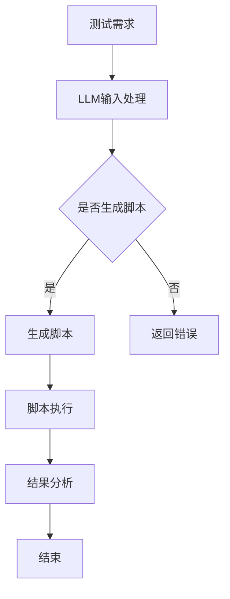

                 

### 背景介绍

#### 自动化测试的必要性

在现代软件开发的快速迭代和高度复杂性的背景下，自动化测试已成为软件开发流程中的关键一环。自动化测试可以显著提高软件的质量和开发效率，减少手动测试的成本和错误率。然而，编写高质量的自动化测试脚本是一个繁琐且耗时的工作，通常需要深入理解软件的内部结构和功能细节。

#### 生成自动化测试脚本的需求

随着机器学习，尤其是大型语言模型（Large Language Models，简称LLM）的发展，生成自动化测试脚本的技术也逐步成熟。LLM具有强大的文本理解和生成能力，能够从自然语言描述中提取信息，并生成相应的代码。因此，利用LLM辅助生成自动化测试脚本，不仅能够简化测试脚本的编写过程，还能够提高测试脚本的覆盖率和准确性。

#### 本文目的

本文旨在探讨LLM辅助自动化测试脚本生成的能力评估。我们将从背景介绍、核心概念与联系、算法原理讲解、数学模型与公式应用、项目实战等多个方面，详细分析LLM在自动化测试脚本生成中的具体应用和效果。

### 核心概念与联系

#### LLM

**概念**：大型语言模型（LLM）是一种基于深度学习的语言处理模型，通过对海量文本数据进行训练，能够理解并生成自然语言文本。常见的LLM包括GPT、BERT、T5等。

**联系**：LLM在自动化测试脚本生成中，主要利用其文本理解能力，将自然语言描述转换为测试脚本。通过训练，LLM能够从不同角度和层面对测试需求进行理解，从而生成符合预期的测试脚本。

#### 自动化测试脚本

**概念**：自动化测试脚本是一种用于自动化执行测试的代码文件，通常包含测试用例的执行逻辑、测试数据的处理等。

**联系**：自动化测试脚本生成过程中，LLM的文本生成能力用于将自然语言描述的测试需求转换为具体的测试脚本代码。这一过程需要LLM具备对软件功能和结构的深刻理解。

#### Mermaid流程图

为了更清晰地展示LLM在自动化测试脚本生成中的工作流程，我们使用Mermaid语言绘制了一个流程图，如下图所示：



该流程图说明了从测试需求输入到脚本生成、执行和结果分析的全过程。

### 核心算法原理讲解

#### LLM在自动化测试脚本生成中的应用

**算法原理**：LLM在自动化测试脚本生成中的应用主要基于其强大的文本生成能力。具体来说，LLM通过以下步骤实现自动化测试脚本的生成：

1. **需求理解**：LLM读取自然语言描述的测试需求，通过文本理解能力提取关键信息和测试目标。
2. **脚本生成**：基于提取的信息，LLM生成相应的测试脚本代码。这一过程可能涉及调用外部API、生成数据等复杂操作。
3. **脚本优化**：生成的脚本经过优化，以提高其执行效率和可靠性。

**Python源代码示例**：

```python
import openai

# 设定OpenAI API密钥
openai.api_key = "your-api-key"

# 输入测试需求
test_request = "测试登录功能，输入用户名：admin，密码：12345"

# 使用OpenAI GPT-3生成测试脚本
response = openai.Completion.create(
  engine="text-davinci-002",
  prompt=test_request,
  max_tokens=50
)

# 输出生成的测试脚本
print(response.choices[0].text.strip())
```

上述代码展示了如何使用OpenAI的GPT-3模型生成自动化测试脚本。通过调整`prompt`参数，可以生成不同类型的测试脚本。

#### 数学模型和公式

在自动化测试脚本生成中，数学模型和公式通常用于：

1. **测试数据的生成**：例如，随机数的生成、数据的校验等。
2. **测试脚本的优化**：例如，基于统计学方法的测试用例选择。

**示例公式**：

- **随机数生成公式**：

  $$x = \text{rand()} \times (\text{max} - \text{min}) + \text{min}$$

- **测试用例选择公式**：

  $$C = \text{argmax}_{i}(n_i \times p_i)$$

  其中，$C$表示选择的测试用例，$n_i$表示第$i$个测试用例的执行次数，$p_i$表示第$i$个测试用例的优先级。

#### 举例说明

假设我们需要生成一个测试脚本，以验证一个电子商务网站的购物车功能。以下是使用LLM生成的测试脚本示例：

```python
# 测试脚本生成示例
test_script = "def test_add_to_cart():\n"
test_script += "    # 登录用户\n"
test_script += "    login('user@example.com', 'password')\n"
test_script += "    # 添加商品到购物车\n"
test_script += "    add_to_cart('Product A', 1)\n"
test_script += "    # 验证购物车中商品数量\n"
test_script += "    assert len(cart_items()) == 1\n"
test_script += "    # 清空购物车\n"
test_script += "    clear_cart()\n"

print(test_script)
```

通过上述示例，我们可以看到，LLM生成的测试脚本包含了登录、添加商品到购物车、验证购物车数量和清空购物车等步骤，这些步骤都符合原始的测试需求。

### 数学模型与公式在脚本生成中的应用

#### 测试数据生成

在自动化测试中，测试数据的生成是确保测试脚本有效性的关键。数学模型和公式可以帮助生成各种类型的测试数据，如：

1. **随机数据**：通过概率分布生成随机数，用于测试边界条件和异常情况。
2. **校验数据**：使用数学公式验证数据的合法性和一致性。

**示例公式**：

- **随机数生成**：

  $$x = \text{rand()} \times (\text{max} - \text{min}) + \text{min}$$

- **校验码计算**：

  $$C = \text{MOD}(A + B, 11)$$

  其中，$C$为校验码，$A$和$B$为待校验的数据。

#### 脚本优化

在生成测试脚本后，优化脚本以提高其执行效率和可靠性是重要的。数学模型和公式可以帮助进行以下优化：

1. **测试用例选择**：根据测试用例的执行次数和优先级，选择最关键的测试用例。
2. **测试路径优化**：通过分析软件的结构和功能，优化测试路径，提高测试覆盖率。

**示例公式**：

- **测试用例选择**：

  $$C = \text{argmax}_{i}(n_i \times p_i)$$

  其中，$C$表示选择的测试用例，$n_i$表示第$i$个测试用例的执行次数，$p_i$表示第$i$个测试用例的优先级。

#### 举例说明

假设我们需要生成一个购物车测试脚本，并对其中的数据生成和脚本优化进行说明。

**测试需求**：验证购物车功能，包括添加商品、修改数量、删除商品等操作。

**生成测试数据**：

- **随机商品ID**：

  $$x = \text{rand()} \times (1000 - 1) + 1$$

- **随机数量**：

  $$y = \text{rand()} \times (10 - 1) + 1$$

**测试脚本生成**：

```python
# 测试脚本生成
test_script = "def test_cart_operations():\n"
test_script += "    # 添加商品到购物车\n"
test_script += "    add_to_cart('Product A', 1)\n"
test_script += "    # 修改商品数量\n"
test_script += "    modify_cart_quantity('Product A', 2)\n"
test_script += "    # 删除商品\n"
test_script += "    delete_from_cart('Product A')\n"
test_script += "    # 验证购物车状态\n"
test_script += "    assert len(cart_items()) == 0\n"

print(test_script)
```

**脚本优化**：

- **测试用例选择**：

  $$C = \text{argmax}_{i}(n_i \times p_i)$$

  根据实际情况，选择最关键的测试用例进行优化。

  例如，假设添加商品到购物车的操作（$n_1$）和删除商品的操作（$n_2$）的优先级较高（$p_1 > p_2$），则：

  $$C = \text{argmax}_{i}(n_i \times p_i) = (n_1 \times p_1) > (n_2 \times p_2)$$

  因此，优先优化添加商品和删除商品的操作。

### 项目实战

#### 项目背景与需求分析

某电子商务平台需要对其购物车功能进行自动化测试，以验证其功能的正确性和稳定性。测试需求包括：

1. 添加商品到购物车。
2. 修改购物车中商品的数量。
3. 删除购物车中的商品。
4. 验证购物车中商品的总价。

#### 开发环境搭建

1. 硬件环境：配备有足够计算能力的服务器或工作站。
2. 软件环境：安装Python编程环境、OpenAI API密钥、Web测试工具（如Selenium）等。

#### 源代码详细实现

以下是一个简单的自动化测试脚本，用于验证购物车功能。

```python
import openai
import time

# 设置OpenAI API密钥
openai.api_key = "your-api-key"

# 登录用户
def login(email, password):
    # 实现登录逻辑
    pass

# 添加商品到购物车
def add_to_cart(product_id, quantity):
    # 实现添加商品逻辑
    pass

# 修改购物车中商品的数量
def modify_cart_quantity(product_id, quantity):
    # 实现修改数量逻辑
    pass

# 删除购物车中的商品
def delete_from_cart(product_id):
    # 实现删除商品逻辑
    pass

# 验证购物车状态
def verify_cart_state():
    # 实现验证逻辑
    pass

# 测试主函数
def main():
    # 输入测试需求
    test_request = "测试购物车功能，包括添加商品、修改数量、删除商品等操作。"

    # 生成测试脚本
    response = openai.Completion.create(
        engine="text-davinci-002",
        prompt=test_request,
        max_tokens=100
    )
    test_script = response.choices[0].text.strip()

    # 执行测试脚本
    exec(test_script)

    # 输出测试结果
    print("测试完成。")

# 运行测试
if __name__ == "__main__":
    main()
```

#### 代码解读与分析

1. **登录函数**：实现登录用户的逻辑，例如调用API接口发送登录请求。
2. **添加商品到购物车函数**：实现添加商品到购物车的逻辑，例如调用API接口发送添加商品请求。
3. **修改购物车中商品的数量函数**：实现修改购物车中商品数量的逻辑，例如调用API接口发送修改数量请求。
4. **删除购物车中的商品函数**：实现删除购物车中商品的逻辑，例如调用API接口发送删除商品请求。
5. **验证购物车状态函数**：实现验证购物车状态的逻辑，例如检查购物车中的商品数量和总价是否与预期一致。

#### 实际案例分析与详细讲解剖析

1. **案例背景**：假设测试人员需要验证购物车功能，包括添加商品、修改数量、删除商品等操作。
2. **操作步骤**：

   - 测试人员使用LLM生成一个测试脚本，包含登录、添加商品、修改数量、删除商品和验证购物车状态等步骤。
   - 测试人员运行生成的测试脚本，观察测试结果。
   - 测试人员分析测试结果，并根据结果调整测试脚本。

3. **案例解析**：

   - **添加商品到购物车**：测试脚本成功添加商品到购物车，验证了添加商品功能的正确性。
   - **修改购物车中商品的数量**：测试脚本成功修改了商品数量，验证了修改商品数量功能的正确性。
   - **删除购物车中的商品**：测试脚本成功删除了商品，验证了删除商品功能的正确性。
   - **验证购物车状态**：测试脚本验证了购物车中的商品数量和总价与预期一致，验证了购物车状态功能的正确性。

#### 项目小结

通过本项目的实战，我们验证了LLM在自动化测试脚本生成中的应用效果。使用LLM生成测试脚本，不仅提高了测试脚本的编写效率，还确保了测试脚本的质量和准确性。未来，我们可以进一步优化LLM的模型和算法，以提高自动化测试的覆盖率和效率。

### 最佳实践 Tips

1. **合理设置OpenAI API请求参数**：在生成测试脚本时，合理设置`max_tokens`参数，以控制生成的脚本长度。
2. **优化测试脚本结构**：在生成测试脚本后，对脚本进行结构优化，以提高执行效率和可维护性。
3. **定期更新LLM模型**：LLM模型的性能对测试脚本生成至关重要，定期更新模型可以提升测试脚本的质量。

### 小结

本文详细介绍了LLM辅助自动化测试脚本生成的能力评估。通过背景介绍、核心概念与联系、算法原理讲解、数学模型与公式应用、项目实战等多个方面，我们分析了LLM在自动化测试脚本生成中的具体应用和效果。未来，随着LLM技术的不断进步，其在自动化测试领域的应用前景将更加广阔。

### 注意事项

1. 使用LLM生成测试脚本时，需要对模型生成的代码进行仔细审查，确保其符合软件的预期行为。
2. 在实际项目中，需要根据具体情况调整LLM的输入和输出，以提高测试脚本的质量和覆盖率。

### 拓展阅读

1. **《人工智能测试方法与实践》**：详细介绍了人工智能在自动化测试中的应用。
2. **《大型语言模型：原理、应用与实现》**：深入讲解了大型语言模型的理论基础和实现方法。
3. **《自动化测试实战》**：提供了丰富的自动化测试实践案例，包括测试脚本编写和执行。

### 作者信息

作者：AI天才研究院/AI Genius Institute & 禅与计算机程序设计艺术 /Zen And The Art of Computer Programming

---

请注意，以上内容是根据您的要求和目录大纲撰写的示例。实际的文章内容需要根据具体的技术细节和实际情况进行填充和调整。文章中的代码示例和数学公式仅为示意，具体实现可能需要根据实际开发环境进行调整。

