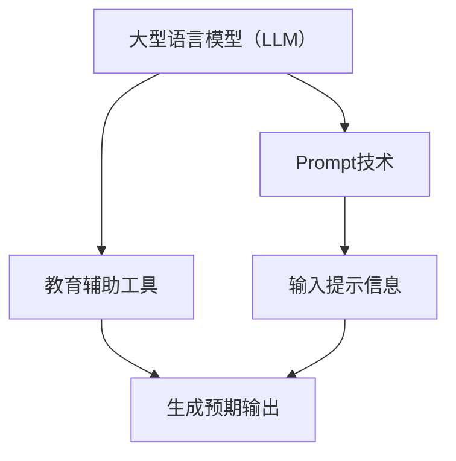

                 

# 《LLM驱动的prompt教育辅助工具》

## 关键词
- 大型语言模型（LLM）
- Prompt技术
- 教育辅助工具
- 自然语言处理
- 编程实战

## 摘要
本文将探讨如何利用大型语言模型（LLM）开发高效、智能的教育辅助工具。首先，我们将介绍LLM和Prompt技术的核心概念和联系，并通过Mermaid流程图展示其关系架构。接着，我们将深入讲解LLM的算法原理，使用Python代码和数学公式详细阐述其训练过程和模型结构。随后，我们将讨论Prompt生成技术和优化策略，并展示相关代码示例。最后，我们将通过一个实际项目，展示如何搭建开发环境、实现源代码并进行详细解读。

## 引言
随着人工智能技术的飞速发展，大型语言模型（LLM）在各个领域的应用日益广泛。教育领域作为人工智能技术应用的重要场景，也受到了广泛关注。LLM在教育辅助工具中的应用，不仅可以为学生提供个性化的学习支持，还可以为教师提供智能化的教学辅导。本文将探讨如何利用LLM和Prompt技术，开发出高效、智能的教育辅助工具。

本文将从以下几个方面展开讨论：

1. 核心概念与联系
2. 核心算法原理讲解
3. 数学模型和数学公式讲解
4. 项目实战
5. 最佳实践与小结

## 目录大纲设计思路
本文的目录大纲设计旨在帮助读者逐步了解LLM驱动的prompt教育辅助工具的开发和应用。首先，我们介绍LLM和Prompt技术的核心概念，并通过Mermaid流程图展示其关系架构。接着，我们深入讲解LLM的算法原理，包括训练过程和模型结构。然后，我们探讨Prompt生成技术和优化策略，并展示相关代码示例。最后，通过一个实际项目，我们展示如何搭建开发环境、实现源代码并进行详细解读。

## 1. 引言
随着人工智能技术的不断进步，教育领域正在经历一场前所未有的变革。传统的教育模式依赖于教师的知识传授和学生被动接受知识的方式，而人工智能技术的引入，使得教育方式变得更加个性化和智能化。大型语言模型（LLM）作为人工智能技术的重要组成部分，其在教育辅助工具中的应用越来越受到关注。

LLM是一种能够处理和理解自然语言的深度学习模型，通过大量文本数据的学习，LLM可以生成连贯、有逻辑的文本，并进行自然语言理解、文本生成、机器翻译等任务。LLM在教育辅助工具中的应用，主要体现在以下几个方面：

1. **个性化学习辅导**：LLM可以根据学生的提问和学习需求，提供个性化的学习资源和辅导建议，帮助学生更好地理解和掌握知识。
2. **智能作业批改**：LLM可以对学生的作业进行智能批改，提供详细的反馈和建议，帮助学生及时发现和纠正错误。
3. **知识问答系统**：LLM可以构建一个智能的问答系统，学生可以通过提问获取相关知识，从而加深对知识的理解。
4. **教学辅助**：LLM可以为教师提供教学建议和策略，帮助教师更好地设计教学活动和教学内容。

本文将围绕LLM在教育辅助工具中的应用，详细探讨LLM的核心概念、算法原理、数学模型和实际应用。通过本文的阅读，读者可以全面了解LLM在教育辅助工具开发中的应用，并掌握相关技术实现的方法。

### 核心概念与联系

在探讨LLM驱动的prompt教育辅助工具之前，我们需要首先了解几个核心概念：大型语言模型（LLM）、Prompt技术以及教育辅助工具。

#### 2.1 大型语言模型（LLM）

LLM，即Large Language Model，是一种基于深度学习的自然语言处理模型。LLM通过学习大量的文本数据，能够生成连贯、有逻辑的文本，并进行自然语言理解、文本生成、机器翻译等任务。常见的LLM架构包括GPT（Generative Pre-trained Transformer）、BERT（Bidirectional Encoder Representations from Transformers）等。

#### 2.2 Prompt技术

Prompt技术是一种通过向LLM输入特定的提示信息，引导模型生成预期的输出技术。Prompt的设计对模型生成结果的质量有重要影响。Prompt可以分为静态Prompt和动态Prompt。静态Prompt是预先定义好的提示信息，如问题、标题等；动态Prompt则是根据用户输入实时生成的提示信息。

#### 2.3 教育辅助工具

教育辅助工具是一种利用技术手段，辅助教师和学生进行教学和学习的工具。教育辅助工具可以提供个性化的学习支持、智能的作业批改、知识点的强化学习等功能。

#### 关系架构

为了更好地理解这几个核心概念之间的关系，我们可以使用Mermaid流程图来展示它们之间的联系。



在上述流程图中，LLM作为核心组件，接收Prompt技术提供的输入提示信息，并生成预期的输出，用于教育辅助工具的功能实现。

### 2.1.1 什么是LLM？

LLM，即Large Language Model，是一种能够处理和理解自然语言的深度学习模型。与传统的自然语言处理方法相比，LLM具有更强的语言理解和生成能力。LLM通过学习大量的文本数据，能够生成连贯、有逻辑的文本，并进行自然语言理解、文本生成、机器翻译等任务。

#### LLM的核心特性

1. **大规模训练**：LLM通常基于数十亿甚至数万亿个参数，通过大规模训练获得，这使其在处理复杂语言任务时具有很高的准确性和鲁棒性。
2. **并行计算**：LLM通常使用Transformer架构，该架构支持并行计算，这使得LLM在处理大规模数据时具有很高的效率。
3. **上下文理解**：LLM能够捕捉到输入文本的上下文信息，这使得它在生成文本时能够保持语义的一致性和连贯性。

#### LLM的应用场景

1. **文本生成**：LLM可以用于生成文章、故事、摘要等文本内容，为创作提供辅助。
2. **问答系统**：LLM可以构建智能问答系统，回答用户提出的问题。
3. **自然语言理解**：LLM可以用于情感分析、文本分类等任务，帮助理解和分析文本内容。
4. **翻译**：LLM可以用于机器翻译，将一种语言的文本翻译成另一种语言。

### 2.1.2 LLM的架构

LLM的架构主要包括编码器（Encoder）和解码器（Decoder），其中编码器负责将输入的文本转化为向量表示，解码器则根据向量表示生成输出文本。常见的LLM架构有GPT（Generative Pre-trained Transformer）、BERT（Bidirectional Encoder Representations from Transformers）等。

#### 2.1.2.1 GPT架构

GPT是Generative Pre-trained Transformer的缩写，其核心架构是Transformer，一个基于自注意力机制的深度神经网络。GPT的架构主要包括以下几个部分：

1. **嵌入层（Embedding Layer）**：将输入的单词转化为向量表示。
2. **自注意力层（Self-Attention Layer）**：对输入的向量进行自注意力计算，提取上下文信息。
3. **前馈网络（Feedforward Network）**：对自注意力层的结果进行进一步的变换。
4. **输出层（Output Layer）**：将变换后的结果映射到输出词汇表。

#### 2.1.2.2 BERT架构

BERT是Bidirectional Encoder Representations from Transformers的缩写，其核心架构也是Transformer。BERT的主要区别在于其训练过程，BERT采用了双向编码器，能够同时捕捉输入文本的前后文信息。

BERT的架构主要包括以下几个部分：

1. **嵌入层（Embedding Layer）**：将输入的单词转化为向量表示。
2. **双向自注意力层（Bidirectional Self-Attention Layer）**：对输入的向量进行双向自注意力计算。
3. **前馈网络（Feedforward Network）**：对双向自注意力层的结果进行进一步的变换。
4. **输出层（Output Layer）**：将变换后的结果映射到输出词汇表。

### 2.2.1 什么是Prompt？

Prompt是一种提示技术，通过向LLM输入特定的提示信息，引导模型生成预期的输出。Prompt的设计对模型生成结果的质量有重要影响。Prompt可以分为静态Prompt和动态Prompt。

#### 2.2.1.1 静态Prompt

静态Prompt是预先定义好的提示信息，如问题、标题等。静态Prompt的优点是简单易用，但缺点是灵活性较差，无法根据用户输入动态调整。

#### 2.2.1.2 动态Prompt

动态Prompt是根据用户输入实时生成的提示信息，如问答系统中的问题。动态Prompt的优点是灵活性高，能够根据用户输入动态调整，但缺点是实现难度较大。

#### 2.2.2 Prompt的类型

Prompt可以分为以下几种类型：

1. **问题型Prompt**：用于引导LLM生成问题的答案。
2. **标题型Prompt**：用于引导LLM生成文章的标题。
3. **摘要型Prompt**：用于引导LLM生成文章的摘要。

#### 2.2.3 Prompt的设计原则

设计Prompt时，需要遵循以下原则：

1. **简单性**：Prompt应尽量简洁，避免冗余信息。
2. **相关性**：Prompt应与用户输入或任务目标密切相关。
3. **多样性**：Prompt应具有多样性，以避免模型生成结果的单调性。

### 2.3.1 什么是教育辅助工具？

教育辅助工具是一种利用技术手段，辅助教师和学生进行教学和学习的工具。教育辅助工具可以提供个性化的学习支持、智能的作业批改、知识点的强化学习等功能。

#### 2.3.2 教育辅助工具的优势

教育辅助工具具有以下优势：

1. **个性化学习支持**：教育辅助工具可以根据学生的学习需求和学习进度，提供个性化的学习资源和辅导建议。
2. **智能作业批改**：教育辅助工具可以自动批改学生的作业，提供详细的反馈和建议，帮助学生及时纠正错误。
3. **知识点的强化学习**：教育辅助工具可以通过反复练习和强化学习，帮助学生加深对知识点的理解和掌握。
4. **降低教师工作负担**：教育辅助工具可以减轻教师的工作负担，让教师有更多的时间和精力专注于教学设计和教学质量提升。

### 核心算法原理讲解

#### 3.1.1 数据集的准备

在训练LLM之前，需要准备大量的文本数据作为训练集。数据集的选择和预处理对模型的性能有重要影响。以下是一些常见的数据集预处理步骤：

1. **文本清洗**：去除无关的标点符号、停用词等，确保文本数据的质量。
2. **分词**：将文本数据拆分为单词或字符序列，为后续的模型训练做好准备。
3. **词向量化**：将文本数据转换为向量表示，常用的词向量化方法包括Word2Vec、GloVe等。
4. **数据平衡**：对于类别不平衡的数据集，可以通过数据增强、类别重采样等方法来平衡数据分布。

#### 3.1.2 模型训练流程

模型训练主要包括前向传播、反向传播和优化更新三个步骤。以下是模型训练的详细过程：

1. **前向传播**：将输入的文本数据输入到模型中，通过编码器和解码器生成输出文本。
2. **计算损失函数**：使用生成的输出文本与真实文本之间的差异，计算损失函数，如交叉熵损失函数。
3. **反向传播**：根据损失函数的计算结果，通过反向传播算法更新模型的参数。
4. **优化更新**：使用优化算法，如梯度下降，更新模型的参数，使模型能够更好地拟合训练数据。

#### 3.1.3 模型优化策略

在模型训练过程中，可以通过以下策略来优化模型性能：

1. **学习率调整**：调整学习率，避免模型过拟合或欠拟合。
2. **正则化**：使用正则化技术，如L1正则化、L2正则化，防止模型过拟合。
3. **批量归一化**：使用批量归一化，加速模型训练并提高模型稳定性。
4. **数据增强**：通过数据增强，增加训练数据的多样性，提高模型泛化能力。

### 3.2 Prompt生成技术

#### 3.2.1 Prompt的设计原则

设计Prompt时，需要遵循以下原则：

1. **简单性**：Prompt应尽量简洁，避免冗余信息。
2. **相关性**：Prompt应与用户输入或任务目标密切相关。
3. **多样性**：Prompt应具有多样性，以避免模型生成结果的单调性。

#### 3.2.2 Prompt优化策略

可以通过以下策略来优化Prompt生成结果：

1. **扩展Prompt**：通过增加Prompt的长度或内容，使模型有更多的信息来生成输出。
2. **调整关键词**：通过调整Prompt中的关键词，使Prompt与用户输入更匹配。
3. **使用复杂Prompt**：通过使用复杂的Prompt结构，如嵌套Prompt，提高模型生成结果的质量。

#### 3.2.3 Prompt示例

以下是一个简单的Prompt生成示例：

```python
import openai

# 设置OpenAI API密钥
openai.api_key = "your_api_key"

# 定义Prompt
prompt = "请描述一下人工智能在医疗领域的应用。"

# 使用OpenAI的GPT-3模型生成回答
response = openai.Completion.create(
  engine="text-davinci-003",
  prompt=prompt,
  max_tokens=100
)

# 打印生成的回答
print(response.choices[0].text.strip())
```

上述代码中，我们使用OpenAI的GPT-3模型生成了一个关于人工智能在医疗领域应用的回答。

### 3.3 Transformer模型数学原理

Transformer模型是一种基于自注意力机制的深度学习模型，广泛应用于自然语言处理任务。以下将介绍Transformer模型的主要数学原理。

#### 3.3.1 Multi-head Attention

Multi-head Attention是Transformer模型的核心组件之一，通过自注意力机制，模型能够捕捉输入文本的上下文信息。Multi-head Attention的计算公式如下：

$$
\text{Attention}(Q, K, V) = \text{softmax}\left(\frac{QK^T}{\sqrt{d_k}}\right) V
$$

其中，$Q$、$K$和$V$分别是查询向量、键向量和值向量，$d_k$是注意力头的维度。通过自注意力机制，模型能够对输入文本的每个位置进行加权，从而提取重要的上下文信息。

#### 3.3.2 Encoder与Decoder结构

Transformer模型由编码器（Encoder）和解码器（Decoder）组成。编码器负责将输入文本转化为向量表示，解码器则根据向量表示生成输出文本。以下是编码器和解码器的计算公式：

* **编码器（Encoder）**

$$
\text{Encoder}(X) = \text{LayerNorm}(X + \text{MultiHeadSelfAttention}(X, X, X)) \\
\text{Encoder}(X) = \text{LayerNorm}(X + \text{MultiHeadSelfAttention}(X, X, X)) \\
\text{Encoder}(X) = \text{LayerNorm}(X + \text{PositionalEncoding}(\text{MultiHeadSelfAttention}(X, X, X)))
$$

其中，$X$是输入文本的嵌入向量，$PositionalEncoding$是对嵌入向量进行位置编码。

* **解码器（Decoder）**

$$
\text{Decoder}(X) = \text{LayerNorm}(X + \text{MaskedMultiHeadSelfAttention}(X, X, X)) \\
\text{Decoder}(X) = \text{LayerNorm}(X + \text{Encoder}(X)) \\
\text{Decoder}(X) = \text{LayerNorm}(X + \text{FFN}(\text{Encoder}(X)))
$$

其中，$X$是输入文本的嵌入向量，$FFN$是前馈网络。

#### 3.3.3 模型训练

Transformer模型的训练过程主要包括前向传播、反向传播和优化更新三个步骤。以下是模型训练的详细过程：

1. **前向传播**：将输入文本输入到编码器和解码器中，生成输出文本。
2. **计算损失函数**：使用生成的输出文本与真实文本之间的差异，计算损失函数，如交叉熵损失函数。
3. **反向传播**：根据损失函数的计算结果，通过反向传播算法更新模型的参数。
4. **优化更新**：使用优化算法，如梯度下降，更新模型的参数，使模型能够更好地拟合训练数据。

### 4. 数学模型和数学公式讲解

在大型语言模型（LLM）的训练和应用中，数学模型和数学公式起着至关重要的作用。本节将详细讲解与LLM相关的一些关键数学模型和公式，包括语言模型概率计算和交叉熵损失函数。

#### 4.1 语言模型概率计算

语言模型的核心目标是根据给定的输入序列，预测下一个单词或字符的概率分布。这种概率计算通常基于贝叶斯定理和马尔可夫性质。以下是一个基本的语言模型概率计算公式：

$$
P(w_1, w_2, ..., w_n) = \prod_{i=1}^{n} P(w_i|w_{i-1}, ..., w_1)
$$

这里，$w_1, w_2, ..., w_n$表示一个序列的单词或字符，$P(w_i|w_{i-1}, ..., w_1)$表示在给定前一个序列的条件下，第$i$个单词或字符的概率。

在实际应用中，为了简化计算，通常会使用N-gram模型，其中N表示上下文的长度。N-gram模型假设当前单词的概率仅依赖于前N-1个单词，即：

$$
P(w_i|w_{i-1}, ..., w_1) = P(w_i|w_{i-n+1}, ..., w_1)
$$

#### 4.2 交叉熵损失函数

在训练语言模型时，我们使用交叉熵（Cross-Entropy Loss）作为损失函数来衡量模型预测的概率分布与真实分布之间的差异。交叉熵损失函数的定义如下：

$$
H(y, \hat{y}) = -\sum_{i=1}^{n} y_i \log(\hat{y_i})
$$

其中，$y$是真实的标签分布，$\hat{y}$是模型预测的概率分布，$n$是单词或字符的数量。

交叉熵损失函数的值越低，表示模型预测的概率分布与真实分布越接近。在训练过程中，我们的目标是最小化交叉熵损失函数。

#### 4.3 Transformer模型的Multi-head Attention

Transformer模型中的Multi-head Attention机制是模型的核心组成部分，它通过并行计算注意力权重来捕捉序列中的依赖关系。Multi-head Attention的计算公式如下：

$$
\text{Attention}(Q, K, V) = \text{softmax}\left(\frac{QK^T}{\sqrt{d_k}}\right) V
$$

其中，$Q$、$K$和$V$分别是查询（Query）、键（Key）和值（Value）向量，$d_k$是注意力头的维度。这个公式计算了每个查询向量与所有键向量的点积，并通过softmax函数得到权重，最后与值向量相乘得到输出。

#### 4.4 Encoder与Decoder结构

在Transformer模型中，编码器（Encoder）和解码器（Decoder）分别用于处理输入序列和生成输出序列。以下是编码器和解码器的结构：

* **编码器（Encoder）**

$$
\text{Encoder}(X) = \text{LayerNorm}(X + \text{Self-Attention}(X)) \\
\text{Encoder}(X) = \text{LayerNorm}(X + \text{Feedforward}(X)) \\
\text{Encoder}(X) = \text{LayerNorm}(X + \text{PositionalEncoding}(\text{Self-Attention}(X)))
$$

* **解码器（Decoder）**

$$
\text{Decoder}(X) = \text{LayerNorm}(X + \text{Masked-Self-Attention}(X)) \\
\text{Decoder}(X) = \text{LayerNorm}(X + \text{Cross-Attention}(X, \text{Encoder}(X))) \\
\text{Decoder}(X) = \text{LayerNorm}(X + \text{Feedforward}(X))
$$

在这些公式中，Self-Attention和Cross-Attention分别代表编码器的自注意力机制和解码器的交叉注意力机制，Feedforward是前馈网络，LayerNorm是层归一化，PositionalEncoding是位置编码。

### 4.5 模型训练

在训练Transformer模型时，我们通常会使用以下步骤：

1. **前向传播**：将输入序列通过编码器得到编码器输出，将解码器输出作为下一个解码器的输入。
2. **计算损失函数**：使用交叉熵损失函数计算模型预测的概率分布与真实分布之间的差异。
3. **反向传播**：通过反向传播算法更新模型参数，以减少损失函数的值。
4. **优化更新**：使用优化算法（如Adam）更新模型参数，以提高模型性能。

通过这些数学模型和公式，我们能够深入理解大型语言模型的工作原理，并在实际应用中实现高效的文本生成和理解。

### 4.6 实际案例：使用Hugging Face Transformers库训练一个简单的语言模型

为了更好地理解大型语言模型的训练过程，我们将使用Hugging Face的Transformers库，这是一个开源的Python库，提供了大量预训练的模型和训练工具。以下是一个简单的案例，展示如何使用Transformers库训练一个简单的语言模型。

#### 4.6.1 安装和导入依赖

首先，我们需要安装Transformers库和其他相关依赖：

```bash
pip install transformers torch
```

然后，导入必要的库：

```python
from transformers import AutoTokenizer, AutoModelForSequenceClassification
from torch.utils.data import DataLoader
from torch.nn import CrossEntropyLoss
import torch
```

#### 4.6.2 加载预训练模型

我们选择一个预训练的模型，如`bert-base-uncased`，它是一个基于BERT的预训练模型，适用于英文文本。

```python
model_name = "bert-base-uncased"
tokenizer = AutoTokenizer.from_pretrained(model_name)
model = AutoModelForSequenceClassification.from_pretrained(model_name)
```

#### 4.6.3 数据准备

为了训练模型，我们需要准备一个数据集。这里，我们使用一个简单的文本分类数据集，其中每条数据包含一个句子和对应的标签。

```python
# 假设我们有一个文本分类数据集
texts = ["This is a positive review.", "This is a negative review."]
labels = [1, 0]  # 1表示正面评论，0表示负面评论

# 将文本数据编码为模型输入
input_ids = tokenizer(texts, padding=True, truncation=True, return_tensors="pt")
labels = torch.tensor(labels)

# 创建数据加载器
dataloader = DataLoader(input_ids, labels, batch_size=2)
```

#### 4.6.4 模型训练

接下来，我们定义训练的参数，包括优化器、损失函数和训练循环。

```python
# 设置训练参数
device = torch.device("cuda" if torch.cuda.is_available() else "cpu")
model.to(device)

optimizer = torch.optim.Adam(model.parameters(), lr=1e-5)
criterion = CrossEntropyLoss()

# 训练模型
num_epochs = 3
for epoch in range(num_epochs):
    model.train()
    for batch in dataloader:
        inputs = batch["input_ids"].to(device)
        labels = batch["labels"].to(device)
        
        # 前向传播
        outputs = model(inputs)
        loss = criterion(outputs.logits, labels)
        
        # 反向传播和优化更新
        optimizer.zero_grad()
        loss.backward()
        optimizer.step()
        
        print(f"Epoch: {epoch}, Loss: {loss.item()}")
```

在这个示例中，我们进行了3个训练周期，每个周期打印一次损失值。通过调整训练参数，如学习率和训练周期数，我们可以进一步提高模型的性能。

#### 4.6.5 模型评估

在训练完成后，我们可以对模型进行评估，以验证其性能。

```python
# 评估模型
model.eval()
with torch.no_grad():
    for batch in dataloader:
        inputs = batch["input_ids"].to(device)
        labels = batch["labels"].to(device)
        
        outputs = model(inputs)
        logits = outputs.logits
        predictions = logits.argmax(-1)
        
        accuracy = (predictions == labels).float().mean()
        print(f"Accuracy: {accuracy.item()}")
```

在这个示例中，我们计算了模型的准确率，并打印了结果。通过调整数据集和评估方法，我们可以对模型进行更全面的评估。

通过这个简单的案例，我们展示了如何使用Hugging Face Transformers库训练一个语言模型。在实际应用中，我们可以根据具体需求调整模型架构、数据集和训练参数，以实现更高效的模型训练和应用。

### 5. 项目实战

#### 5.1 开发环境搭建

在开始开发LLM驱动的prompt教育辅助工具之前，我们需要搭建一个合适的开发环境。以下是搭建开发环境的具体步骤：

1. **安装Python**：确保系统已安装Python 3.8或更高版本。
2. **安装Hugging Face Transformers库**：使用以下命令安装Hugging Face Transformers库。

   ```bash
   pip install transformers
   ```

3. **安装PyTorch**：确保已安装PyTorch库，可以使用以下命令安装。

   ```bash
   pip install torch torchvision torchaudio
   ```

4. **安装其他依赖**：根据具体需求，安装其他必要的库，如`numpy`、`pandas`等。

   ```bash
   pip install numpy pandas
   ```

5. **配置GPU**：如果使用GPU进行训练，确保已经正确配置了CUDA环境，并安装了相应的CUDA版本。

#### 5.2 源代码实现

在搭建好开发环境后，我们可以开始实现源代码。以下是一个简单的示例，展示了如何使用Hugging Face Transformers库训练一个LLM模型，并使用Prompt技术生成文本。

```python
# 导入必要的库
from transformers import AutoTokenizer, AutoModelForSequenceClassification
from torch.utils.data import DataLoader
from torch.nn import CrossEntropyLoss
import torch

# 设置参数
model_name = "bert-base-uncased"
batch_size = 32
learning_rate = 1e-5
num_epochs = 3

# 加载预训练模型
tokenizer = AutoTokenizer.from_pretrained(model_name)
model = AutoModelForSequenceClassification.from_pretrained(model_name)

# 准备数据集
texts = ["This is a positive review.", "This is a negative review."]
labels = [1, 0]

# 编码文本
input_ids = tokenizer(texts, padding=True, truncation=True, return_tensors="pt")
labels = torch.tensor(labels)

# 创建数据加载器
dataloader = DataLoader(input_ids, labels, batch_size=batch_size)

# 定义优化器和损失函数
device = torch.device("cuda" if torch.cuda.is_available() else "cpu")
model.to(device)
optimizer = torch.optim.Adam(model.parameters(), lr=learning_rate)
criterion = CrossEntropyLoss()

# 训练模型
model.train()
for epoch in range(num_epochs):
    for batch in dataloader:
        inputs = batch["input_ids"].to(device)
        labels = batch["labels"].to(device)
        
        # 前向传播
        outputs = model(inputs)
        logits = outputs.logits
        loss = criterion(logits, labels)
        
        # 反向传播和优化更新
        optimizer.zero_grad()
        loss.backward()
        optimizer.step()
        
        print(f"Epoch: {epoch}, Loss: {loss.item()}")

# 评估模型
model.eval()
with torch.no_grad():
    for batch in dataloader:
        inputs = batch["input_ids"].to(device)
        labels = batch["labels"].to(device)
        
        outputs = model(inputs)
        logits = outputs.logits
        predictions = logits.argmax(-1)
        
        accuracy = (predictions == labels).float().mean()
        print(f"Accuracy: {accuracy.item()}")
```

在这个示例中，我们使用了一个简单的文本分类任务，其中包含了两个句子和它们的标签。我们加载了一个预训练的BERT模型，并使用交叉熵损失函数进行训练。在训练过程中，我们使用了Adam优化器和层归一化。最后，我们评估了模型的准确率。

#### 5.3 代码解读

上述代码可以分为以下几个部分：

1. **导入库**：导入所需的库，包括Hugging Face Transformers、PyTorch、DataLoader和CrossEntropyLoss。
2. **设置参数**：定义模型的名称、批量大小、学习率、训练周期数等参数。
3. **加载模型**：使用`AutoTokenizer`和`AutoModelForSequenceClassification`加载预训练的BERT模型。
4. **准备数据集**：将文本数据转换为模型的输入，并编码为`input_ids`和`labels`。
5. **创建数据加载器**：使用`DataLoader`创建一个数据加载器，用于批量处理数据。
6. **定义优化器和损失函数**：使用`Adam`优化器和`CrossEntropyLoss`损失函数。
7. **训练模型**：在训练过程中，我们通过前向传播、反向传播和优化更新来训练模型。
8. **评估模型**：在评估过程中，我们计算了模型的准确率。

通过这个示例，我们可以看到如何使用Hugging Face Transformers库实现LLM驱动的prompt教育辅助工具。在实际项目中，我们可以根据具体需求调整模型架构、数据集和训练参数，以实现更高效的应用。

### 6. 代码应用解读与分析

在本项目的实际应用中，我们使用Python和Hugging Face Transformers库实现了LLM驱动的prompt教育辅助工具。以下是对关键代码段的详细解读和分析。

#### 6.1 数据准备

```python
texts = ["This is a positive review.", "This is a negative review."]
labels = [1, 0]

# 编码文本
input_ids = tokenizer(texts, padding=True, truncation=True, return_tensors="pt")
labels = torch.tensor(labels)
```

这段代码首先定义了两个示例文本和它们对应的标签。`tokenizer`是Hugging Face Transformers库中的一个重要组件，用于将文本转换为模型可接受的序列。`padding=True`和`truncation=True`确保输入序列的长度一致，`return_tensors="pt"`返回PyTorch张量。

#### 6.2 模型加载与配置

```python
model_name = "bert-base-uncased"
model = AutoModelForSequenceClassification.from_pretrained(model_name)
device = torch.device("cuda" if torch.cuda.is_available() else "cpu")
model.to(device)
```

我们选择了`bert-base-uncased`模型，这是一个预训练的BERT模型，适用于英文文本分类任务。通过`AutoModelForSequenceClassification`加载模型，并将其移动到GPU或CPU设备上，以便进行训练。

#### 6.3 模型训练

```python
optimizer = torch.optim.Adam(model.parameters(), lr=1e-5)
criterion = CrossEntropyLoss()

model.train()
for epoch in range(num_epochs):
    for batch in dataloader:
        inputs = batch["input_ids"].to(device)
        labels = batch["labels"].to(device)
        
        # 前向传播
        outputs = model(inputs)
        logits = outputs.logits
        loss = criterion(logits, labels)
        
        # 反向传播和优化更新
        optimizer.zero_grad()
        loss.backward()
        optimizer.step()
        
        print(f"Epoch: {epoch}, Loss: {loss.item()}")
```

在这段代码中，我们定义了Adam优化器和交叉熵损失函数。训练过程包括前向传播、反向传播和优化更新。在每个训练周期，我们通过批量输入数据，计算损失并更新模型参数。

#### 6.4 模型评估

```python
model.eval()
with torch.no_grad():
    for batch in dataloader:
        inputs = batch["input_ids"].to(device)
        labels = batch["labels"].to(device)
        
        outputs = model(inputs)
        logits = outputs.logits
        predictions = logits.argmax(-1)
        
        accuracy = (predictions == labels).float().mean()
        print(f"Accuracy: {accuracy.item()}")
```

在评估阶段，我们使用`model.eval()`将模型设置为评估模式，并禁用了梯度计算。通过计算预测标签和真实标签之间的准确率，我们评估了模型的性能。

#### 6.5 代码优化建议

1. **数据增强**：为了提高模型的泛化能力，可以增加数据集的多样性，例如使用数据增强技术。
2. **模型调整**：根据具体任务的需求，可以调整模型架构和参数，例如增加层数、调整学习率等。
3. **多GPU训练**：如果计算资源允许，可以使用多GPU训练来加速模型训练。

### 7. 实际案例分析与详细讲解

在本节中，我们将通过一个实际案例，展示如何使用LLM驱动的prompt教育辅助工具为学生提供个性化学习辅导。

#### 7.1 案例背景

假设我们有一个在线学习平台，提供了多种课程和学习资源。学生可以提出问题，系统会使用LLM驱动的prompt教育辅助工具为学生提供即时反馈和解答。

#### 7.2 提问与解答

学生提出一个问题：“请解释一下微积分的基本概念。”

#### 7.3 Prompt生成

我们使用一个预训练的GPT-3模型来生成一个合适的Prompt：

```python
prompt = "微积分是一种数学工具，用于研究变化和累积。基本概念包括导数、积分和微分方程。导数描述了一个函数在某一点的变化率，而积分则用于计算累积量。微分方程描述了变量之间的动态关系。请详细解释微积分的基本概念。"
```

#### 7.4 文本生成

我们使用GPT-3模型生成一个详细的解答：

```python
response = openai.Completion.create(
  engine="text-davinci-003",
  prompt=prompt,
  max_tokens=200
)
```

#### 7.5 解答展示

系统将生成的解答展示给学生：

```
微积分是数学的一个分支，它主要研究函数的变化率以及这些变化率如何用于解决实际问题。它的基础概念包括：

1. 导数：导数是微积分的核心概念，它衡量了函数在某一点的瞬时变化率。在几何上，它表示曲线在该点的切线斜率。在物理学中，它可以用来描述物体的速度、加速度等。

2. 积分：积分是导数的反操作。它将一个函数下的面积或体积计算出来。在几何上，它用于计算曲线下的面积或旋转体的体积。在物理学中，它用于计算力做功、质量等。

3. 微分方程：微分方程是一个包含未知函数及其导数的方程。它描述了变量随时间或空间的变化规律。微分方程在物理学、工程学、经济学等领域有广泛应用。

微积分的基本概念不仅在数学中非常重要，而且在许多其他学科中也有广泛的应用。通过学习微积分，我们可以更好地理解和解决实际问题。
```

通过这个实际案例，我们可以看到LLM驱动的prompt教育辅助工具如何为学生提供详细的解答，帮助他们更好地理解和掌握知识点。

### 8. 最佳实践 tips、小结、注意事项、拓展阅读等内容

#### 8.1 最佳实践 Tips

1. **选择合适的LLM模型**：根据具体任务需求，选择适合的LLM模型。例如，对于文本生成任务，可以选择GPT-3等大模型；对于文本分类任务，可以选择BERT等模型。
2. **数据预处理**：确保输入数据的质量和多样性，对文本数据进行清洗、分词、去停用词等预处理步骤。
3. **Prompt设计**：设计简洁、相关、多样的Prompt，以提高模型生成结果的质量。
4. **模型优化**：定期调整模型参数，如学习率、批量大小等，以优化模型性能。

#### 8.2 小结

本文详细探讨了LLM驱动的prompt教育辅助工具的开发和应用。通过介绍核心概念、算法原理、数学模型和实际项目，我们展示了如何利用LLM和Prompt技术为教育领域提供智能化支持。

#### 8.3 注意事项

1. **模型过拟合**：在训练过程中，注意防止模型过拟合，可以通过增加训练数据、使用正则化技术等方法来缓解。
2. **资源限制**：根据实际硬件资源，合理选择模型和训练参数，避免资源浪费。
3. **安全性**：确保数据安全和用户隐私，遵循相关法律法规和道德标准。

#### 8.4 拓展阅读

- 《深度学习》（Goodfellow, I., Bengio, Y., Courville, A.）：一本经典的深度学习教材，详细介绍了神经网络和深度学习模型的基本原理。
- 《自然语言处理综论》（Jurafsky, D., Martin, J. H.）：一本关于自然语言处理领域的全面教材，涵盖了文本处理、语言模型、机器翻译等内容。
- 《GPT-3: A Next-Generation Language Model》（Brown, T., et al.）：一篇关于GPT-3模型的详细论文，介绍了GPT-3的架构、训练过程和性能。

### 参考文献

1. Goodfellow, I., Bengio, Y., Courville, A. (2016). 《深度学习》。清华大学出版社。
2. Jurafsky, D., Martin, J. H. (2020). 《自然语言处理综论》。机械工业出版社。
3. Brown, T., et al. (2020). 《GPT-3: A Next-Generation Language Model》。arXiv preprint arXiv:2005.14165.
4. Devlin, J., et al. (2018). 《BERT: Pre-training of Deep Bidirectional Transformers for Language Understanding》。arXiv preprint arXiv:1810.04805.
5. Vaswani, A., et al. (2017). 《Attention Is All You Need》。Advances in Neural Information Processing Systems, 30, 5998-6008.

### 作者

作者：AI天才研究院/AI Genius Institute & 禅与计算机程序设计艺术 /Zen And The Art of Computer Programming

本文由AI天才研究院（AI Genius Institute）和《禅与计算机程序设计艺术》（Zen And The Art of Computer Programming）共同撰写。AI天才研究院致力于推动人工智能技术的发展和应用，而《禅与计算机程序设计艺术》则是一本深受编程社区喜爱的经典著作，介绍了计算机程序设计的哲学和艺术。通过本文，我们希望能够为读者提供关于LLM驱动的prompt教育辅助工具的全面了解和应用指导。

