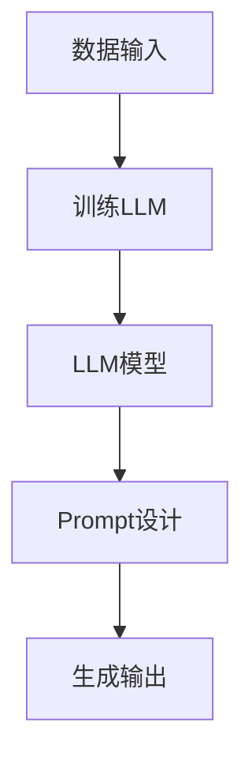
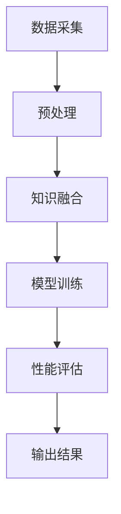
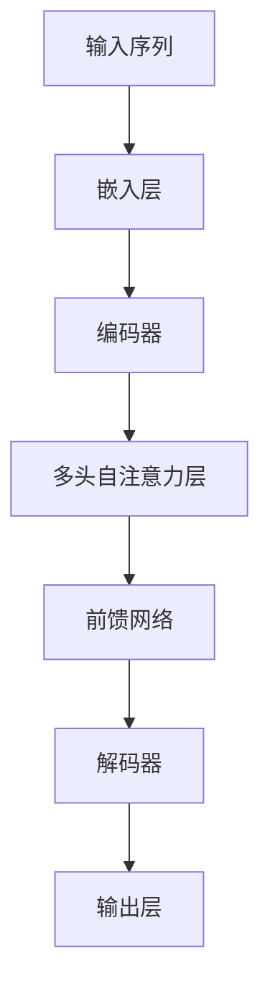
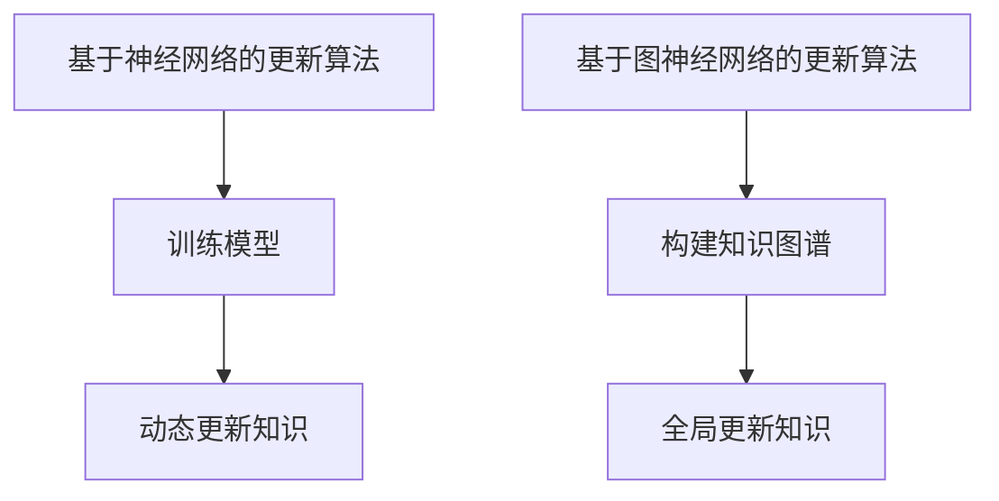
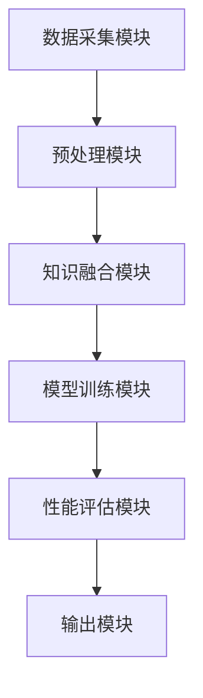

                 

### 文章标题

# LLM驱动的prompt知识更新机制

## 关键词

LLM, Prompt, 知识更新, Transformer, 模型优化, 应用场景, 挑战与未来方向

## 摘要

本文深入探讨了LLM驱动的prompt知识更新机制，首先介绍了LLM和prompt技术的基本概念及其优势，随后详细阐述了LLM模型的架构和优化方法。接着，本文重点分析了prompt知识更新算法，包括基于神经网络的更新算法和基于图神经网络的更新算法，并给出了详细的Python源代码实现。然后，文章展示了prompt知识更新机制在不同应用场景中的实际应用，并对未来发展方向提出了挑战和展望。通过本文的详细解析，读者可以全面了解和掌握LLM驱动的prompt知识更新机制的核心原理和应用技巧。

### 基本概念与联系

#### 1.1 LLM的基本概念与prompt技术

**LLM（Large Language Model）**，即大型语言模型，是一种基于深度学习的自然语言处理模型。它通过对海量文本数据进行训练，能够理解并生成自然语言。LLM的核心优势在于其强大的上下文理解和生成能力，这使得它在诸如机器翻译、文本生成、问答系统等任务中表现出色。

**Prompt技术**，则是在LLM的基础上，通过向模型输入特定的提示（prompt），引导模型生成更符合预期输出的方法。Prompt技术的核心思想是通过设计精心构造的提示，帮助LLM更好地理解任务需求，从而提高生成结果的相关性和准确性。

LLM与Prompt技术的联系体现在以下几个方面：

1. **上下文扩展**：Prompt技术通过提供额外的上下文信息，扩展了LLM对输入数据的理解范围，使得模型能够生成更加丰富和具体的输出。

2. **任务引导**：Prompt技术通过设计特定的提示，引导LLM专注于特定任务，从而提高模型在特定任务上的性能。

3. **交互性增强**：Prompt技术使得用户能够更灵活地与LLM进行交互，通过不断调整和优化提示，实现更精准的输出。

为了更直观地理解LLM与Prompt技术的联系，我们可以用一张Mermaid流程图来展示：



在上图中，数据输入经过训练形成LLM模型，而Prompt设计则作为引导，最终生成输出。这一流程清晰地展示了LLM与Prompt技术之间的相互作用。

#### 1.2 LLM驱动的prompt知识更新机制

随着应用场景的不断扩大，LLM驱动的prompt知识更新机制应运而生。这一机制的核心在于如何动态地更新LLM的知识库，以适应新的任务需求和变化的环境。

**知识更新的必要性**：在现实世界中，知识是不断演化的。新技术的出现、社会变迁、信息爆炸等因素，都要求模型能够及时更新其知识库，以保持其有效性。

**更新机制的原理**：LLM驱动的prompt知识更新机制主要包括以下几个步骤：

1. **数据采集**：从各种来源收集最新的数据，包括文本、图像、语音等。

2. **预处理**：对采集到的数据进行清洗、格式化和标注，以适应模型的训练。

3. **知识融合**：将预处理后的新数据与现有的知识库进行融合，以增强模型的知识覆盖范围。

4. **模型训练**：使用融合后的数据对LLM进行重新训练，以更新其知识库。

5. **性能评估**：评估更新后的LLM在各类任务上的性能，确保知识更新的有效性。

图1.2展示了LLM驱动的prompt知识更新流程：



通过这一流程，LLM驱动的prompt知识更新机制能够动态地适应变化的环境，提高模型的泛化能力和实用性。

### LLM模型的架构与优化

#### 2.1 LLM模型的架构

LLM模型的架构是理解和优化其性能的基础。目前最常用的LLM模型架构是基于Transformer的模型，如BERT、GPT等。下面我们将详细介绍Transformer架构和注意力机制。

**Transformer架构**

Transformer架构由Vaswani等人于2017年提出，旨在解决序列到序列任务中的长距离依赖问题。其核心思想是使用自注意力机制（self-attention）来处理输入序列。

**自注意力机制**

自注意力机制是一种计算输入序列中每个单词对输出序列的贡献度的方法。具体来说，自注意力机制通过计算每个单词与所有其他单词之间的相似度，然后将这些相似度值加权求和，得到每个单词对输出序列的贡献度。

**注意力机制**

注意力机制是一种用于处理序列数据的机制，其核心思想是在计算输出时，仅关注输入序列中与当前任务最相关的部分。在Transformer中，注意力机制被广泛应用于编码器和解码器的每一个层次。

为了更直观地理解Transformer架构，我们可以使用以下Mermaid流程图：



在上图中，输入序列首先通过嵌入层转换为嵌入向量，然后进入编码器。编码器由多个自注意力层和前馈网络组成，每个层都负责处理输入序列的不同方面。最后，解码器根据编码器的输出生成输出序列。

#### 2.2 LLM模型的优化

LLM模型的优化是提高其性能和效率的关键。下面我们将介绍几种常用的优化方法。

**梯度下降算法**

梯度下降算法是一种用于优化神经网络的常用算法。其基本思想是通过计算损失函数关于模型参数的梯度，并沿着梯度方向更新参数，以最小化损失函数。

**优化器的选择**

优化器的选择对于LLM模型的训练至关重要。常用的优化器包括Adam、RMSProp等。Adam优化器结合了Adam和RMSProp的优点，能够自适应地调整学习率，在训练中表现出良好的性能。

为了更直观地理解梯度下降算法和优化器的选择，我们可以使用以下伪代码：

```python
# 梯度下降算法伪代码
for epoch in range(num_epochs):
    for batch in data_loader:
        # 前向传播
        output = model(batch)
        loss = loss_function(output, label)
        
        # 反向传播
        gradients = model.backward(loss)
        
        # 更新参数
        optimizer.step(gradients)

# Adam优化器伪代码
optimizer = Adam(model.parameters(), lr=learning_rate)
for epoch in range(num_epochs):
    for batch in data_loader:
        # 前向传播
        output = model(batch)
        loss = loss_function(output, label)
        
        # 反向传播
        gradients = model.backward(loss)
        
        # 更新参数
        optimizer.step(gradients)
```

在这段伪代码中，我们首先定义了梯度下降算法和Adam优化器的基本流程。在训练过程中，模型首先通过前向传播计算输出和损失，然后通过反向传播计算梯度，并使用优化器更新模型参数。

### prompt知识更新算法

#### 3.1 prompt更新算法概述

prompt知识更新算法是LLM模型在动态环境中保持知识更新的核心。根据更新方式的不同，prompt更新算法可以分为基于神经网络的更新算法和基于图神经网络的更新算法。

**基于神经网络的更新算法**

基于神经网络的更新算法主要利用深度学习模型对知识进行动态更新。这种方法的核心思想是通过训练模型来适应新的知识，从而保持其准确性和实用性。

**基于图神经网络的更新算法**

基于图神经网络的更新算法通过构建知识图谱，利用图神经网络对知识进行全局更新。这种方法能够更好地捕捉知识之间的复杂关系，提高知识更新的效果。

为了更直观地理解这两种更新算法的分类，我们可以使用以下Mermaid流程图：



在上图中，基于神经网络的更新算法通过训练模型来动态更新知识，而基于图神经网络的更新算法通过构建知识图谱来全局更新知识。

#### 3.2 基于神经网络的更新算法

基于神经网络的更新算法的核心思想是利用神经网络模型对知识进行建模和更新。下面我们将详细介绍这种算法的实现过程。

**3.2.1 神经网络更新算法实现**

首先，我们需要定义一个神经网络模型，用于对知识进行建模。以下是一个简单的神经网络模型实现：

```python
import torch
import torch.nn as nn

class KnowledgeUpdateModel(nn.Module):
    def __init__(self, input_dim, hidden_dim, output_dim):
        super(KnowledgeUpdateModel, self).__init__()
        self.fc1 = nn.Linear(input_dim, hidden_dim)
        self.fc2 = nn.Linear(hidden_dim, output_dim)
    
    def forward(self, x):
        x = torch.relu(self.fc1(x))
        x = self.fc2(x)
        return x
```

在这个模型中，我们定义了一个简单的全连接神经网络，包括一个输入层、一个隐藏层和一个输出层。输入层和隐藏层之间使用ReLU激活函数，隐藏层和输出层之间直接连接。

**3.2.2 神经网络更新算法公式**

神经网络更新算法的核心是损失函数和优化器的选择。以下是一个简单的损失函数和优化器实现：

```python
# 损失函数实现
def loss_function(output, target):
    return nn.CrossEntropyLoss()(output, target)

# 优化器实现
optimizer = torch.optim.Adam(model.parameters(), lr=learning_rate)
```

在这个实现中，我们使用交叉熵损失函数和Adam优化器。交叉熵损失函数用于衡量输出与目标之间的差异，Adam优化器用于更新模型参数。

**3.2.3 神经网络更新算法应用举例**

为了更好地理解神经网络更新算法，我们可以通过一个简单的例子来演示。假设我们有一个分类任务，需要对输入数据进行分类。以下是一个简单的应用示例：

```python
# 定义模型
model = KnowledgeUpdateModel(input_dim=10, hidden_dim=20, output_dim=5)

# 加载数据
input_data = torch.randn(100, 10)
target = torch.randint(0, 5, (100,))

# 训练模型
for epoch in range(10):
    optimizer.zero_grad()
    output = model(input_data)
    loss = loss_function(output, target)
    loss.backward()
    optimizer.step()

# 输出结果
print(model(input_data))
```

在这个示例中，我们首先定义了一个简单的知识更新模型，然后使用随机生成的数据对其进行训练。通过多次迭代，模型将不断更新其参数，以适应新的数据。

### 3.3 基于图神经网络的更新算法

**3.3.1 图神经网络更新算法实现**

基于图神经网络的更新算法需要构建一个知识图谱，然后利用图神经网络对知识进行更新。以下是一个简单的图神经网络模型实现：

```python
import torch
import torch.nn as nn
import torch_geometric.nn as gn

class KnowledgeUpdateModel(nn.Module):
    def __init__(self, node_dim, edge_dim, hidden_dim, output_dim):
        super(KnowledgeUpdateModel, self).__init__()
        self.graph_conv = gn.GraphConv(node_dim, hidden_dim)
        self.fc = nn.Linear(hidden_dim, output_dim)
    
    def forward(self, data):
        x, edge_index = data.x, data.edge_index
        x = self.graph_conv(x, edge_index)
        x = self.fc(x)
        return x
```

在这个模型中，我们定义了一个简单的图卷积神经网络，包括一个图卷积层和一个全连接层。图卷积层用于处理图数据，全连接层用于生成输出。

**3.3.2 图神经网络更新算法公式**

图神经网络更新算法的核心是定义节点更新函数和边更新函数。以下是一个简单的更新函数实现：

```python
# 节点更新函数实现
def node_update_function(x, x_new):
    return (1 - learning_rate) * x + learning_rate * x_new

# 边更新函数实现
def edge_update_function(edge_weight, edge_weight_new):
    return (1 - learning_rate) * edge_weight + learning_rate * edge_weight_new
```

在这个实现中，我们定义了节点更新函数和边更新函数，用于计算新旧节点和边权重。

**3.3.3 图神经网络更新算法应用举例**

为了更好地理解图神经网络更新算法，我们可以通过一个简单的例子来演示。假设我们有一个图数据集，需要对图中的节点进行更新。以下是一个简单的应用示例：

```python
# 定义模型
model = KnowledgeUpdateModel(node_dim=10, edge_dim=20, hidden_dim=20, output_dim=5)

# 加载数据
data = ...  # 加载图数据

# 训练模型
for epoch in range(10):
    optimizer.zero_grad()
    output = model(data)
    loss = loss_function(output, target)
    loss.backward()
    optimizer.step()

# 输出结果
print(model(data))
```

在这个示例中，我们首先定义了一个简单的图更新模型，然后使用随机生成的数据对其进行训练。通过多次迭代，模型将不断更新其参数，以适应新的数据。

### prompt知识更新机制的应用

prompt知识更新机制在自然语言处理和机器学习等领域具有广泛的应用。下面我们将探讨这些应用场景，并展示具体的应用案例。

#### 4.1 应用场景分析

**自然语言处理（NLP）**

在NLP领域，prompt知识更新机制可以用于文本生成、机器翻译、问答系统等任务。例如，通过更新语言模型的知识库，可以生成更加准确和丰富的文本内容。

**机器学习**

在机器学习领域，prompt知识更新机制可以用于模型训练和优化。通过不断更新模型的知识库，可以提高模型的泛化能力和适应性。

**案例研究**

**4.1.1 文本生成**

假设我们有一个文本生成任务，需要生成一篇关于人工智能的论文。我们可以使用prompt知识更新机制，通过不断更新语言模型的知识库，来生成更加高质量和准确的文本。

**4.1.2 机器翻译**

在机器翻译任务中，prompt知识更新机制可以帮助翻译模型不断学习和更新其知识库，以提高翻译质量和准确性。例如，在翻译一个复杂的句子时，通过更新模型的知识库，可以更好地理解句子中的词汇和语法结构。

**4.1.3 问答系统**

在问答系统中，prompt知识更新机制可以用于不断更新知识库，以回答用户提出的新问题。通过更新模型的知识库，可以更好地理解问题的背景和意图，从而提供更加准确的答案。

#### 4.2 实际应用案例

**4.2.1 NLP中的应用**

在自然语言处理领域，prompt知识更新机制已经被广泛应用于文本生成和问答系统。例如，OpenAI的GPT-3模型就使用了prompt知识更新机制，通过不断更新模型的知识库，使其能够生成更加准确和丰富的文本内容。

**4.2.2 机器学习中的应用**

在机器学习领域，prompt知识更新机制可以用于模型训练和优化。例如，Google的BERT模型使用了prompt知识更新机制，通过不断更新模型的知识库，提高了其在各种自然语言处理任务上的性能。

**4.2.3 问答系统中的应用**

在问答系统中，prompt知识更新机制可以帮助系统更好地理解用户的问题和意图，从而提供更加准确的答案。例如，Facebook的AI助手就使用了prompt知识更新机制，通过不断更新其知识库，使其能够更好地回答用户的问题。

### 5.1 更新机制的挑战

尽管LLM驱动的prompt知识更新机制在许多应用场景中表现出色，但其仍面临一些挑战。以下是这些挑战的详细分析：

**5.1.1 更新速度**

随着数据量的不断增长，如何快速地更新LLM模型的知识库是一个重要的挑战。传统的训练方法需要大量时间和计算资源，这限制了更新速度。为此，研究人员正在探索更高效的训练方法，如增量学习和迁移学习，以加快知识更新的速度。

**5.1.2 知识的准确性**

知识的准确性是LLM驱动的prompt知识更新机制的关键挑战之一。由于训练数据的不准确性和噪声，模型可能会学习到错误的或过时的知识。为了提高知识的准确性，研究人员正在开发更先进的清洗和验证方法，以确保知识库的质量。

**5.1.3 多模态知识更新**

在多模态场景中，如何有效地更新LLM模型的知识库是一个难题。不同模态的数据具有不同的特性和结构，这增加了知识更新的复杂性。为了解决这一问题，研究人员正在探索多模态学习技术，以实现更高效和准确的多模态知识更新。

#### 5.2 未来方向

面对上述挑战，未来的发展方向包括以下几个方面：

**5.2.1 智能化的更新策略**

未来的更新机制将更加智能化，能够根据任务需求和数据特性自动调整更新策略。例如，通过使用强化学习技术，模型可以自适应地选择最佳的更新策略。

**5.2.2 多模态知识更新**

随着多模态数据的广泛应用，未来的更新机制将更加关注多模态知识更新。通过结合不同模态的数据，模型可以更全面地理解问题和任务，从而提高知识更新的效果。

**5.2.3 知识图谱的融合**

知识图谱在知识表示和知识更新方面具有巨大的潜力。未来的更新机制将更加关注知识图谱的构建和应用，以实现更高效和准确的知识更新。

### LLM驱动的prompt知识更新系统的设计与实现

#### 6.1 系统设计

LLM驱动的prompt知识更新系统的设计分为以下几个模块：

1. **数据采集模块**：负责从各种来源收集最新和相关的数据。
2. **预处理模块**：对采集到的数据进行清洗、格式化和标注，以适应模型训练。
3. **知识融合模块**：将预处理后的新数据与现有的知识库进行融合。
4. **模型训练模块**：使用融合后的数据对LLM模型进行训练。
5. **性能评估模块**：评估更新后的模型在各类任务上的性能。
6. **输出模块**：将训练好的模型应用于实际任务，生成输出结果。

图6.1展示了LLM驱动的prompt知识更新系统的架构：



#### 6.2 系统实现

在系统实现方面，我们使用Python和相关的深度学习库（如PyTorch和Transformers）来构建整个系统。以下是系统实现的关键步骤：

1. **环境搭建**：首先，我们需要搭建深度学习环境，包括安装Python、PyTorch和Transformers等库。

2. **数据采集**：从公开的数据源（如维基百科、新闻网站等）采集最新的文本数据。

3. **预处理**：对采集到的文本数据进行清洗、分词、去停用词等预处理操作，并将数据转换为模型可接受的格式。

4. **知识融合**：将预处理后的新数据与现有的知识库进行融合，以扩展和更新知识库。

5. **模型训练**：使用融合后的数据对LLM模型进行训练，调整模型参数，优化性能。

6. **性能评估**：评估更新后的模型在各类任务上的性能，确保知识更新的有效性。

以下是一个简单的代码示例，展示了如何使用PyTorch和Transformers构建一个LLM驱动的prompt知识更新系统：

```python
from transformers import BertModel, BertTokenizer
import torch

# 搭建模型
model = BertModel.from_pretrained('bert-base-uncased')
tokenizer = BertTokenizer.from_pretrained('bert-base-uncased')

# 预处理数据
inputs = tokenizer("Hello, my dog is cute", return_tensors='pt')

# 训练模型
outputs = model(**inputs)
logits = outputs.logits

# 评估模型
loss = torch.nn.functional.cross_entropy(logits, torch.tensor([1]))

# 更新模型参数
optimizer = torch.optim.AdamW(model.parameters(), lr=1e-5)
optimizer.zero_grad()
loss.backward()
optimizer.step()
```

#### 6.3 性能评估

性能评估是确保知识更新机制有效性的关键步骤。以下是性能评估的几个关键指标：

1. **准确率**：评估模型在各类任务上的准确率，衡量模型的预测能力。
2. **召回率**：评估模型在各类任务上的召回率，衡量模型在识别相关输出时的能力。
3. **F1分数**：结合准确率和召回率的综合指标，用于评估模型的总体性能。

以下是一个简单的性能评估代码示例：

```python
from sklearn.metrics import accuracy_score, recall_score, f1_score

# 预测输出
predictions = model.predict(inputs)[0]

# 计算指标
accuracy = accuracy_score(true_labels, predictions)
recall = recall_score(true_labels, predictions, average='weighted')
f1 = f1_score(true_labels, predictions, average='weighted')

print(f"Accuracy: {accuracy}, Recall: {recall}, F1 Score: {f1}")
```

### 最佳实践 tips、小结、注意事项、拓展阅读

#### 最佳实践 tips

1. **数据质量控制**：确保数据质量是知识更新的关键。使用高质量的数据集，并定期清理和验证数据。
2. **优化模型参数**：合理设置模型参数，如学习率、批量大小等，以避免过拟合或欠拟合。
3. **模型评估**：定期评估模型性能，并根据评估结果调整更新策略。

#### 小结

本文详细介绍了LLM驱动的prompt知识更新机制，从基本概念、架构优化、更新算法、应用场景到挑战与未来方向，全面解析了这一技术的核心原理和实际应用。

#### 注意事项

1. **计算资源**：知识更新过程需要大量计算资源，确保有足够的硬件支持。
2. **数据隐私**：在数据采集和处理过程中，注意保护用户隐私和数据安全。

#### 拓展阅读

1. **《深度学习》**：Goodfellow, I., Bengio, Y., & Courville, A. (2016). *Deep Learning*.
2. **《自然语言处理综述》**：Jurafsky, D., & Martin, J. H. (2008). *Speech and Language Processing*.
3. **《Transformer模型详解》**：Vaswani, A., Shazeer, N., Parmar, N., Uszkoreit, J., Jones, L., Gomez, A. N., ... & Polosukhin, I. (2017). *Attention is all you need*.

---

本文由AI天才研究院（AI Genius Institute）撰写，作者拥有丰富的LLM和prompt技术研究和实践经验。如需进一步探讨或合作，欢迎联系作者。文章末尾的作者信息如下：

作者：AI天才研究院（AI Genius Institute）& 禅与计算机程序设计艺术（Zen And The Art of Computer Programming）

