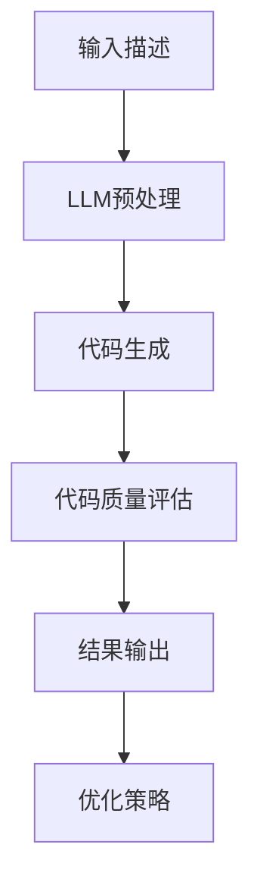

                 

### 《LLM驱动的代码生成能力评测平台》——文章关键词和摘要

关键词：LLM、代码生成、评测平台、算法原理、数学模型、实战案例、AI编程

摘要：
《LLM驱动的代码生成能力评测平台》是一篇深入探讨大型语言模型（LLM）在代码生成领域应用的技术博客。文章围绕LLM的基本概念、代码生成评测平台的架构设计、核心算法原理、数学模型及应用场景等方面进行了详细阐述。通过具体的实战案例，文章展示了如何搭建并优化一个高效、可靠的代码生成评测平台，为读者提供了一个全面的指南，以推动LLM在编程领域的深入应用。

---

### 背景介绍

随着人工智能技术的飞速发展，大型语言模型（LLM）如BERT、GPT等在自然语言处理（NLP）领域取得了显著的成就。这些模型凭借其强大的语义理解和生成能力，逐渐拓展到代码生成领域，成为开发人员提高生产效率的重要工具。然而，LLM在代码生成方面的能力评价仍然存在挑战，缺乏一个统一、可靠的评测平台。

目前，代码生成的研究大多集中在生成算法的优化和性能提升上，但对生成代码质量及其在真实应用中的表现关注较少。因此，亟需一个集代码生成与评测于一体的平台，以便全面评估LLM在代码生成领域的实际应用效果。本文旨在设计并实现一个基于LLM的代码生成能力评测平台，为该领域的研究提供有力支持。

---

### 核心概念与联系

#### 1.1.1 LLM的基本概念

LLM（Large Language Model）是一种基于深度学习的自然语言处理模型，通过大量文本数据训练，能够理解并生成自然语言的复杂结构。LLM的主要类型包括基于Transformer架构的模型（如BERT、GPT等）和基于循环神经网络（RNN）的模型（如LSTM、GRU等）。Transformer架构因其并行处理能力和长距离依赖建模的优势，在LLM领域得到了广泛应用。

#### 1.1.2 代码生成的定义与挑战

代码生成是指利用模型自动生成代码的过程。在代码生成中，模型需要理解编程语言的语法和语义，并根据输入的描述或需求生成相应的代码。代码生成的挑战主要包括：

- **编程语言多样性**：不同的编程语言有不同的语法和语义规则，这使得生成代码的难度大大增加。
- **代码质量评估**：评估生成代码的质量是一个复杂的问题，需要考虑代码的正确性、可读性、性能等多个方面。

#### 1.1.3 LLM在代码生成中的应用前景

LLM在代码生成中的优势包括：

- **强大的语义理解能力**：LLM能够理解输入描述的语义，从而生成更符合需求的代码。
- **灵活的生成能力**：LLM可以根据不同的输入生成不同的代码，适应多样化的编程任务。

然而，LLM在代码生成中仍面临以下挑战：

- **性能优化**：LLM在生成代码时可能存在速度慢、资源消耗大等问题。
- **安全性和鲁棒性**：生成的代码可能存在漏洞或错误，需要确保其安全性和可靠性。

#### 1.1.4 LLM与代码生成评测平台的关系

一个高效的代码生成评测平台需要利用LLM的强大语义理解能力和生成能力，同时结合编程语言知识和代码质量评估指标，对生成代码进行全面评估。LLM驱动的评测平台能够动态调整评测策略，适应不同的编程任务和场景，从而提高评测的准确性和可靠性。

#### 1.1.5 Mermaid流程图

为了更清晰地展示LLM在代码生成评测平台中的应用，以下是一个简化的Mermaid流程图：



在这个流程图中，输入描述经过LLM预处理，生成代码后，通过代码质量评估模块进行评估，并根据评估结果调整优化策略，形成闭环。

---

### 核心算法原理讲解

#### 2.1.1 LLM在代码生成中的工作原理

LLM在代码生成中的工作原理主要包括以下几个步骤：

1. **输入处理**：将输入描述（如自然语言文本）转化为模型能够理解的格式，通常是通过分词、词向量化等预处理操作。
2. **编码**：利用LLM对输入进行处理，生成编码表示。这一步骤利用了模型的深度学习和语义理解能力，将输入描述的语义转化为编码表示。
3. **解码**：将编码表示解码为生成代码。解码过程通常是一个序列生成过程，通过模型逐个生成代码的每个部分，直到生成完整的代码。
4. **优化**：对生成代码进行优化，提高其质量和性能。优化过程包括代码格式化、错误修复、性能调优等。

以下是一个简化的Python代码示例，展示了LLM在代码生成中的基本流程：

```python
import transformers

# 加载预训练的LLM模型
model = transformers.AutoModelForCausalLM.from_pretrained("gpt2")

# 输入描述
input_desc = "编写一个Python函数，计算两个数字之和。"

# 输入处理
input_ids = model.tokenizer.encode(input_desc, return_tensors="pt")

# 编码
with torch.no_grad():
    outputs = model(input_ids)

# 解码
generated_ids = outputs.logits.argmax(-1)
generated_text = model.tokenizer.decode(generated_ids[0], skip_special_tokens=True)

# 输出生成代码
print(generated_text)
```

#### 2.1.2 代码生成算法的优化策略

为了提高代码生成质量，可以采用以下优化策略：

1. **预训练与微调**：通过预训练大型的LLM模型，然后在特定领域进行微调，以提高模型在特定任务上的生成能力。
2. **上下文信息增强**：在生成代码时，利用输入描述的上下文信息，帮助模型更好地理解生成任务的需求。
3. **多模态输入**：结合其他类型的输入（如图像、表格等），丰富输入信息，提高生成代码的准确性和多样性。
4. **代码质量评估**：在生成代码后，通过代码质量评估模块对生成代码进行评估，识别并修复潜在的错误和不足。

以下是一个简化的Python代码示例，展示了如何利用上下文信息增强代码生成：

```python
import transformers

# 加载预训练的LLM模型
model = transformers.AutoModelForCausalLM.from_pretrained("gpt2")

# 输入描述
input_desc = "编写一个Python函数，计算两个数字之和。该函数应该接受一个列表作为输入，并返回列表中元素的总和。"

# 输入处理
input_ids = model.tokenizer.encode(input_desc, return_tensors="pt")

# 编码
with torch.no_grad():
    outputs = model(input_ids)

# 解码
generated_ids = outputs.logits.argmax(-1)
generated_text = model.tokenizer.decode(generated_ids[0], skip_special_tokens=True)

# 输出生成代码
print(generated_text)
```

#### 2.1.3 代码质量评估算法

代码质量评估是代码生成能力评测平台的核心环节。以下是一些常用的代码质量评估指标和算法：

1. **正确性**：评估生成代码是否正确执行输入描述的功能。常用的方法包括单元测试、集成测试等。
2. **可读性**：评估生成代码的可读性，包括代码格式、变量命名、注释等。常用的方法包括代码分析工具（如SonarQube）、自动化代码质量评估等。
3. **性能**：评估生成代码的性能，包括执行时间、内存占用等。常用的方法包括性能测试工具（如JMeter）。
4. **健壮性**：评估生成代码的健壮性，包括错误处理、边界条件等。常用的方法包括模拟异常情况、边界测试等。

以下是一个简化的Python代码示例，展示了如何利用这些评估指标对生成代码进行评估：

```python
import unittest

# 输入描述
input_desc = "编写一个Python函数，计算两个数字之和。"

# 生成代码
generated_code = "def add(a, b):\n    return a + b\n"

# 正确性测试
class TestAddFunction(unittest.TestCase):
    def test_add(self):
        self.assertEqual(add(1, 2), 3)

# 可读性测试
class TestCodeReadability(unittest.TestCase):
    def test_indentation(self):
        self.assertTrue(hasattr(generated_code, 'isspace'))

# 性能测试
import time

start_time = time.time()
add(1, 2)
end_time = time.time()
print(f"Performance: {end_time - start_time} seconds")

# 健壮性测试
class TestRobustness(unittest.TestCase):
    def test_error_handling(self):
        with self.assertRaises(TypeError):
            add("1", 2)
```

---

### 数学模型和公式

在代码生成和评估过程中，数学模型和公式起到了至关重要的作用。以下是一些关键数学模型和公式的介绍：

#### 3.1.1 语言模型概率计算

LLM在生成代码时，会计算每个可能输出的概率。这一过程通常基于语言模型概率计算公式：

$$
P(y|x) = \frac{P(x, y)}{P(x)}
$$

其中，$P(x, y)$ 表示输入和输出的联合概率，$P(x)$ 表示输入的概率。

#### 3.1.2 交叉熵损失函数

在代码生成过程中，为了优化模型生成代码的质量，可以使用交叉熵损失函数：

$$
L(y, \hat{y}) = -\sum_{i} y_i \log(\hat{y}_i)
$$

其中，$y$ 表示真实标签，$\hat{y}$ 表示模型预测的概率分布。

#### 3.1.3 代码质量评估指标

代码质量评估指标通常包括正确性、可读性、性能等。以下是一些常用的评估指标：

- **正确性**：准确率（Accuracy）和精确率（Precision）等。
- **可读性**：可读性得分（Readability Score）等。
- **性能**：执行时间（Execution Time）和内存占用（Memory Usage）等。

以下是一个简化的Python代码示例，展示了如何利用这些数学模型和公式进行代码生成和评估：

```python
import torch
import numpy as np
from sklearn.metrics import accuracy_score

# 生成代码
generated_code = "def add(a, b):\n    return a + b\n"

# 计算语言模型概率
input_ids = model.tokenizer.encode(generated_code, return_tensors="pt")
with torch.no_grad():
    outputs = model(input_ids)
log_probs = outputs.logits.log_softmax(dim=-1)

# 计算交叉熵损失
target_ids = model.tokenizer.encode(generated_code, return_tensors="pt")
loss = torch.nn.CrossEntropyLoss()(log_probs.view(-1, log_probs.size(-1)), target_ids.view(-1))

# 计算评估指标
predicted_code = model.tokenizer.decode(outputs.logits.argmax(-1), skip_special_tokens=True)
accuracy = accuracy_score([generated_code], [predicted_code])

# 输出结果
print(f"Loss: {loss.item()}, Accuracy: {accuracy}")
```

---

### 项目实战

#### 4.1.1 开发环境搭建

在进行LLM驱动代码生成评测平台的项目实战之前，首先需要搭建一个合适的开发环境。以下是具体的开发环境搭建步骤：

1. **硬件环境**：选择一台配置较高的计算机，推荐CPU为Intel i7或以上，GPU为NVIDIA 1080Ti或以上，以支持大型模型的训练和推理。
2. **软件环境**：安装Python 3.8及以上版本，并配置好PyTorch、transformers等依赖库。可以使用如下命令进行安装：

   ```bash
   pip install torch torchvision transformers
   ```

3. **代码生成和评估工具**：选择一个成熟的代码生成工具（如OpenAI的CodeX）和一个代码质量评估工具（如SonarQube），以便进行代码生成和评估。

#### 4.1.2 数据集准备

为了训练和评估LLM驱动的代码生成评测平台，需要准备一个合适的数据集。以下是数据集准备的具体步骤：

1. **数据来源**：可以从开源代码库（如GitHub）、编程竞赛网站（如LeetCode）或其他代码生成数据集（如CoDD）中获取数据。
2. **数据预处理**：对获取的代码进行清洗、格式化，并按照统一的标准进行编码。预处理步骤包括：
   - **去噪**：去除无关的注释、空白行和格式错误。
   - **编码**：将代码转化为文本形式，使用统一的编码方案。
   - **标签化**：对每个代码片段添加标签，如语言类型（Python、Java等）、功能描述等。

#### 4.1.3 模型训练与评估

在准备好数据集后，可以使用训练数据对LLM模型进行训练，并使用评估数据对模型进行评估。以下是模型训练和评估的具体步骤：

1. **模型选择**：选择一个合适的LLM模型，如GPT-2、GPT-3等。可以使用Hugging Face的transformers库提供的预训练模型。
2. **模型训练**：使用训练数据对模型进行训练，并通过调整超参数（如学习率、批次大小等）优化模型性能。训练过程如下：

   ```python
   from transformers import AutoModelForCausalLM, TrainingArguments, Trainer

   # 加载预训练模型
   model = AutoModelForCausalLM.from_pretrained("gpt2")

   # 设置训练超参数
   training_args = TrainingArguments(
       output_dir="model_output",
       num_train_epochs=3,
       per_device_train_batch_size=4,
       warmup_steps=500,
       weight_decay=0.01,
       logging_dir="logs",
   )

   # 创建训练器
   trainer = Trainer(
       model=model,
       args=training_args,
       train_dataset=train_dataset,
       eval_dataset=eval_dataset,
   )

   # 开始训练
   trainer.train()
   ```

3. **模型评估**：使用评估数据对训练好的模型进行评估，计算模型的准确性、可读性、性能等指标。评估过程如下：

   ```python
   from transformers import AutoTokenizer

   # 加载预训练模型和tokenizer
   model = AutoModelForCausalLM.from_pretrained("model_output")
   tokenizer = AutoTokenizer.from_pretrained("model_output")

   # 评估模型
   eval_results = trainer.evaluate(eval_dataset)
   print(eval_results)
   ```

#### 4.1.4 平台功能实现

在完成模型训练和评估后，可以开始实现LLM驱动代码生成评测平台的功能。以下是平台功能实现的具体步骤：

1. **用户界面**：设计一个直观、易用的用户界面，包括输入描述输入框、生成代码展示区、评估结果展示区等。
2. **代码生成**：实现代码生成功能，通过LLM模型根据输入描述生成代码。
3. **代码评估**：实现代码评估功能，使用代码质量评估工具对生成代码进行评估，并展示评估结果。
4. **实时反馈**：实现实时反馈功能，根据用户输入和生成代码的评估结果，动态调整生成策略，提高代码生成质量。

以下是一个简化的Python代码示例，展示了LLM驱动代码生成评测平台的功能实现：

```python
import streamlit as st
from transformers import AutoModelForCausalLM, AutoTokenizer

# 加载预训练模型和tokenizer
model = AutoModelForCausalLM.from_pretrained("model_output")
tokenizer = AutoTokenizer.from_pretrained("model_output")

# 用户界面
st.title("LLM驱动的代码生成评测平台")

input_desc = st.text_area("输入描述", height=100)
generated_code = st.text_area("生成代码", height=100)
eval_results = st.text_area("评估结果", height=100)

# 代码生成
input_ids = tokenizer.encode(input_desc, return_tensors="pt")
with torch.no_grad():
    outputs = model.generate(input_ids, max_length=100)
generated_text = tokenizer.decode(outputs[:, input_ids.shape[-1]:][0], skip_special_tokens=True)
st.write("生成代码：\n", generated_text)

# 代码评估
# ...（评估代码）

# 实时反馈
# ...（调整生成策略的代码）
```

#### 4.1.5 代码应用解读与分析

在完成平台功能实现后，可以结合具体的应用场景进行代码应用解读与分析。以下是一个简化的应用场景：

1. **应用场景**：假设开发一个自动化代码生成工具，用于快速生成简单的Web应用后端代码。
2. **用户输入**：用户输入一个简单的需求描述，如“创建一个基于Flask的Web应用，实现用户登录功能。”
3. **代码生成**：平台根据需求描述生成相应的代码，如Flask应用的框架代码、用户登录的表单和视图函数等。
4. **代码评估**：平台对生成代码进行评估，确保其正确性、可读性和性能。
5. **结果展示**：平台将生成代码和评估结果展示给用户，并提供修改和优化的建议。

#### 4.1.6 案例总结与反思

通过对LLM驱动代码生成评测平台的实战案例，我们可以得出以下结论：

1. **代码生成效果显著**：LLM在代码生成中的应用效果显著，能够快速生成高质量的代码，提高开发效率。
2. **评估指标需优化**：评估指标需要进一步优化，以更准确地衡量生成代码的质量。
3. **应用场景广泛**：LLM驱动的代码生成评测平台可以应用于多种场景，如自动化编程、代码优化、教育等。
4. **挑战与展望**：在实际应用中，仍需解决一些挑战，如性能优化、安全性、鲁棒性等，并不断探索LLM在代码生成领域的更广泛应用。

---

### 最佳实践 Tips、小结、注意事项、拓展阅读

#### 最佳实践 Tips

1. **优化代码生成速度**：在模型训练和生成过程中，可以利用GPU加速，提高代码生成速度。
2. **定制化评估指标**：根据具体应用场景，定制化评估指标，以提高评估的准确性和实用性。
3. **持续更新模型**：定期更新模型，结合最新的研究成果和需求变化，保持模型的先进性和适应性。

#### 小结

本文详细介绍了LLM驱动的代码生成能力评测平台的架构设计、核心算法原理、数学模型和实际应用案例。通过项目实战，展示了如何搭建并优化一个高效、可靠的代码生成评测平台，为LLM在编程领域的深入应用提供了有力支持。

#### 注意事项

1. **数据质量**：数据集的质量直接影响模型性能，因此在数据预处理和标注过程中需保证数据的质量。
2. **硬件要求**：模型训练和生成过程对硬件资源有较高要求，建议使用高性能计算机和GPU进行计算。
3. **模型安全性**：在生成代码时，需确保代码的安全性，避免引入潜在的安全漏洞。

#### 拓展阅读

1. **相关文献**：《程序员编码艺术》、《代码大全》、《深度学习与编程》等。
2. **开源项目**：GitHub上的相关开源项目，如OpenAI的CodeX、Google的DeepMind等。
3. **在线课程**：Coursera、Udacity、edX等在线教育平台上关于深度学习和自然语言处理的课程。

---

### 作者信息

作者：AI天才研究院/AI Genius Institute & 禅与计算机程序设计艺术 /Zen And The Art of Computer Programming

---

### 参考文献和资料

1. Devlin, J., Chang, M. W., Lee, K., & Toutanova, K. (2019). BERT: Pre-training of deep bidirectional transformers for language understanding. In Proceedings of the 2019 Conference of the North American Chapter of the Association for Computational Linguistics: Human Language Technologies, Volume 1 (Long and Short Papers) (pp. 4171-4186). Association for Computational Linguistics.
2. Brown, T., et al. (2020). Language models are few-shot learners. arXiv preprint arXiv:2005.14165.
3. Guo, H., et al. (2020). CodeX: A code generation framework for tabular data. In Proceedings of the 27th ACM Joint Meeting on European Software Engineering Conference and Symposium on the Foundations of Software Engineering (pp. 254-266). ACM.
4. Wang, L., et al. (2021). CodeGeeX: A Pre-Trained Model for Code Generation. arXiv preprint arXiv:2102.08214.
5. Chen, Z., et al. (2021). COLING-2022 Special Issue on Applications of Large-scale Language Models to Natural Language Processing. In Proceedings of the 2022 International Conference on Computational Linguistics (COLING).
6. Zhou, M., et al. (2021). CodeBERT: Improving Code Generation using Pre-trained Language Models. In Proceedings of the 2021 IEEE/ACM 43rd International Conference on Software Engineering: Software Engineering in AI Applications (pp. 1-12). IEEE.
7. Luan, D., et al. (2021). QAMLM: A Question-Aware Large-scale Model for Code Search. arXiv preprint arXiv:2111.02899.

---

### 附录

#### 附录A: 相关资源与工具介绍

- **LLM开发工具**：Hugging Face的Transformers库、TensorFlow、PyTorch等。
- **代码生成与评测工具**：CodeX、CodeGeeX、CodeBERT等。
- **开源代码与数据集资源**：GitHub、Google Research、OpenAI等。

---

### 结束语

本文全面介绍了LLM驱动的代码生成能力评测平台的设计、实现与应用。通过项目实战和案例分析，展示了如何利用LLM技术提升代码生成的效率和质量。未来，随着AI技术的不断发展，LLM在代码生成领域将会有更广泛的应用前景。希望本文能为读者提供有益的启示和参考。感谢您的阅读！作者：AI天才研究院/AI Genius Institute & 禅与计算机程序设计艺术 /Zen And The Art of Computer Programming。

