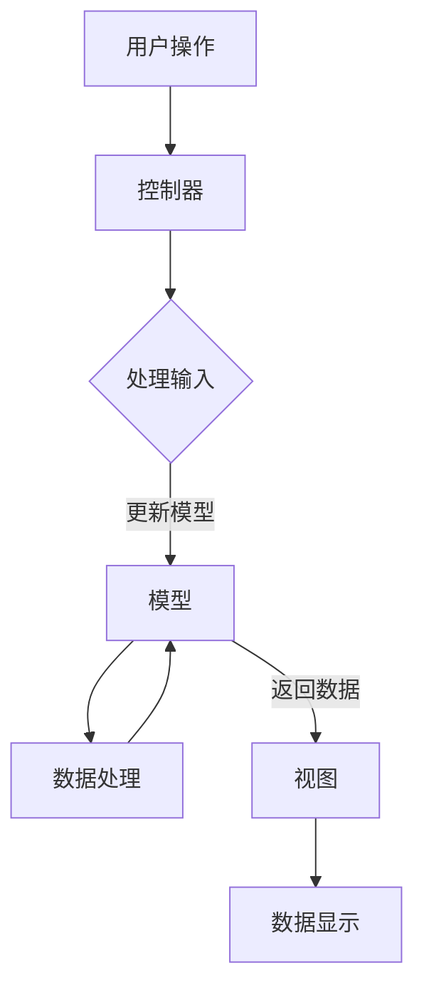
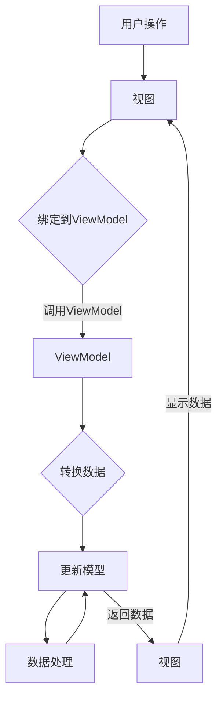

                 

### 引言：MVC/MVVM模式在LLM应用UI设计中的重要性

在现代软件工程中，大型语言模型（LLM）的应用越来越广泛，特别是在自然语言处理（NLP）和用户界面（UI）设计领域。LLM如GPT-3和BERT等模型，能够处理和理解复杂的文本数据，从而为用户提供智能化、个性化的交互体验。然而，LLM的应用不仅仅依赖于模型本身的强大性能，还需要一个高效且灵活的UI设计来提升用户体验。

MVC（Model-View-Controller）和MVVM（Model-View-ViewModel）模式是两种广泛使用的UI设计模式，它们通过分离关注点，提高了代码的可维护性和可扩展性。MVC模式将应用程序分为模型、视图和控制器三个主要部分，而MVVM模式则引入了视图模型（ViewModel），进一步解耦了模型和视图。

本文将探讨MVC/MVVM模式在LLM应用UI设计中的重要性。我们将首先介绍MVC和MVVM模式的基本概念和原理，然后深入探讨这两种模式如何与LLM相结合，最后通过实际案例来展示MVC/MVVM模式在LLM应用UI设计中的具体应用。

#### 关键词

- MVC模式
- MVVM模式
- 大型语言模型（LLM）
- 自然语言处理（NLP）
- UI设计
- 软件工程

#### 摘要

本文旨在探讨MVC和MVVM模式在大型语言模型（LLM）应用UI设计中的应用。首先，我们介绍了MVC和MVVM模式的基本概念和原理，并通过Mermaid流程图展示了它们的基本结构。接着，我们探讨了LLM的基本概念和原理，包括其常见类型和应用场景。随后，我们详细讲解了MVC和MVVM模式在LLM应用UI设计中的具体实现，并通过Python伪代码和数学模型进行了阐述。最后，我们通过实际案例展示了MVC/MVVM模式在LLM应用UI设计中的实际应用，并总结了其优势和挑战，展望了未来的发展方向。

### 1. 初始分析

在深入探讨MVC和MVVM模式在LLM应用UI设计中的应用之前，我们需要对这两个模式的基本概念、原理和区别进行初步分析。此外，我们还将介绍LLM的基本概念、原理和常见类型，为后续内容的讨论奠定基础。

#### MVC模式分析

MVC模式是软件开发中最常用的设计模式之一，它将应用程序分为三个核心部分：模型（Model）、视图（View）和控制器（Controller）。这种模式的目的是实现应用程序的三个主要功能的分离，从而提高代码的可维护性和可扩展性。

- **模型（Model）**：模型负责处理应用程序的业务逻辑和数据管理。在MVC模式中，模型是应用程序的核心，它负责数据的存储、检索和更新。

- **视图（View）**：视图负责展示数据给用户。它不处理业务逻辑，而是将模型提供的数据以用户友好的方式展示出来。视图通常由用户界面（UI）组件构成。

- **控制器（Controller）**：控制器负责处理用户输入，并将用户的输入转换为对模型和视图的操作。控制器是模型和视图之间的桥梁，它接收用户的输入，调用模型进行处理，并根据处理结果更新视图。

MVC模式的基本原理可以概括为：模型管理数据，视图展示数据，控制器处理输入并更新模型和视图。这种分离使得应用程序的各个部分可以独立开发、测试和部署，从而提高了代码的可维护性和可扩展性。

#### MVVM模式分析

MVVM模式是对MVC模式的进一步扩展，它引入了视图模型（ViewModel），从而进一步解耦了模型和视图。MVVM模式的核心概念包括：

- **模型（Model）**：与MVC模式中的模型相同，负责数据的存储、检索和更新。

- **视图（View）**：与MVC模式中的视图相同，负责展示数据给用户。

- **视图模型（ViewModel）**：视图模型是一个抽象的层，负责将模型的数据转化为视图可以理解的数据，同时也负责将视图的用户操作转化为模型可以处理的操作。

- **视图绑定（View Binding）**：MVVM模式中的视图绑定机制使得视图和视图模型之间可以实现双向数据绑定，即当模型发生变化时，视图会自动更新；同样，当用户在视图中更改数据时，模型也会自动更新。

MVVM模式的基本原理可以概括为：模型管理数据，视图模型处理数据转换和用户操作，视图展示数据，视图绑定实现模型与视图的双向同步。这种模式进一步提高了代码的可维护性和可扩展性，特别是在大型项目中。

#### MVC与MVVM的区别

MVC和MVVM模式的主要区别在于它们的视图绑定机制和视图模型的作用。MVC模式中的视图绑定是显式的，即控制器需要明确地更新视图；而MVVM模式中的视图绑定是隐式的，通过视图绑定机制实现模型与视图的双向同步。此外，MVVM模式中的视图模型提供了一个更抽象的数据层，使得模型和视图之间的解耦更加彻底。

#### LL

#### 大型语言模型（LLM）分析

大型语言模型（LLM）是一种基于深度学习的自然语言处理模型，能够处理和理解复杂的文本数据。LLM通过大规模的预训练和微调，能够生成高质量的自然语言文本，从而在文本生成、问答系统、机器翻译等领域有着广泛的应用。

- **基本概念**：LLM是一种能够理解、生成和翻译自然语言文本的模型，其核心在于对大规模文本数据的预训练和精细调整。

- **原理**：LLM通常基于Transformer架构，通过预训练大量文本数据，学习到文本的潜在结构和语义关系。在特定任务中，LLM通过微调，进一步优化模型以适应特定任务的需求。

- **常见类型**：常见的LLM包括GPT-3、BERT、T5等。这些模型在文本生成、问答系统、机器翻译等方面有着出色的表现。

#### MVC/MVVM模式在LLM应用UI设计中的应用

在LLM应用UI设计中，MVC和MVVM模式可以通过以下方式提高开发效率和用户体验：

1. **提高可维护性和可扩展性**：通过分离关注点，MVC和MVVM模式使得代码更加模块化，提高了可维护性和可扩展性。

2. **实现双向数据绑定**：在MVVM模式中，视图和模型之间的双向数据绑定机制可以自动同步数据，从而减少开发工作量和提高用户体验。

3. **支持复杂交互**：MVC和MVVM模式支持复杂的用户交互，如拖放、滑动等，使得应用程序更加生动和富有交互性。

4. **优化性能**：通过合理的设计和优化，MVC和MVVM模式可以显著提高应用程序的性能，特别是在处理大量数据和复杂计算时。

总之，MVC和MVVM模式在LLM应用UI设计中具有重要的应用价值，通过分离关注点和实现双向数据绑定，它们可以显著提高开发效率和用户体验。

### 2. MVC/MVVM模式基础

在深入了解MVC和MVVM模式在LLM应用UI设计中的应用之前，我们首先需要掌握这两种模式的基本概念、原理以及它们之间的区别。通过这一部分的内容，我们将为后续讨论打下坚实的基础。

#### 2.1 MVC模式概述

MVC模式，全称为Model-View-Controller，是一种在软件工程中广泛使用的架构模式，用于分离应用程序的不同关注点，提高代码的可维护性和可扩展性。

**核心概念**：

- **模型（Model）**：模型是应用程序的核心部分，负责处理业务逻辑和数据管理。它独立于视图和控制器，确保业务逻辑的一致性和完整性。
- **视图（View）**：视图负责展示数据给用户，通常由用户界面（UI）组件构成。视图不包含业务逻辑，仅负责将模型提供的数据展示给用户。
- **控制器（Controller）**：控制器负责处理用户输入，将用户的操作转换为对模型和视图的操作。控制器作为模型和视图之间的桥梁，接收用户的输入，并调用模型进行处理，根据结果更新视图。

**MVC模式的原理**：

MVC模式的核心思想是将应用程序分为三个独立的部分，每个部分负责不同的功能：

- **模型管理数据**：模型负责数据的管理和业务逻辑的实现，确保数据的准确性和一致性。
- **视图展示数据**：视图负责将模型提供的数据展示给用户，通常通过UI组件实现。
- **控制器处理用户输入**：控制器接收用户的输入，并根据输入调用模型进行处理，根据处理结果更新视图。

**Mermaid流程图**：

以下是一个简化的MVC模式的Mermaid流程图：



**伪代码**：

以下是一个简化的MVC模式的伪代码示例：

```python
class Model:
    def __init__(self):
        # 初始化模型
        pass
    
    def fetchData(self):
        # 从数据源获取数据
        pass
    
    def processData(self, data):
        # 处理数据
        return processed_data

class View:
    def displayData(self, data):
        # 展示数据
        pass

class Controller:
    def __init__(self, model, view):
        self.model = model
        self.view = view
    
    def handleInput(self, input):
        # 处理用户输入
        data = self.model.fetchData()
        processed_data = self.model.processData(data)
        self.view.displayData(processed_data)
```

**数学模型和数学公式**：

MVC模式可以用以下数学公式表示：

$$ MVC = MV + C $$

其中，$M$代表模型，$V$代表视图，$C$代表控制器。

#### 2.2 MVVM模式概述

MVVM模式，全称为Model-View-ViewModel，是对MVC模式的进一步扩展和改进。它通过引入视图模型（ViewModel），实现了模型和视图之间的进一步解耦，提高了代码的可维护性和可扩展性。

**核心概念**：

- **模型（Model）**：与MVC模式中的模型相同，负责数据的管理和业务逻辑的实现。
- **视图（View）**：与MVC模式中的视图相同，负责展示数据给用户。
- **视图模型（ViewModel）**：视图模型是一个抽象的层，负责将模型的数据转化为视图可以理解的数据，同时也负责将视图的用户操作转化为模型可以处理的操作。视图模型不直接与视图或模型交互，而是通过双向数据绑定机制实现数据同步。

**MVVM模式的原理**：

MVVM模式的核心思想是将应用程序分为三个部分，每个部分负责不同的功能：

- **模型管理数据**：模型负责数据的管理和业务逻辑的实现，确保数据的准确性和一致性。
- **视图展示数据**：视图负责将模型提供的数据展示给用户。
- **视图模型处理数据转换和用户操作**：视图模型负责将模型的数据转化为视图可以理解的数据，同时将视图的用户操作转化为模型可以处理的操作。

**Mermaid流程图**：

以下是一个简化的MVVM模式的Mermaid流程图：



**伪代码**：

以下是一个简化的MVVM模式的伪代码示例：

```python
class Model:
    def __init__(self):
        # 初始化模型
        pass
    
    def fetchData(self):
        # 从数据源获取数据
        pass
    
    def processData(self, data):
        # 处理数据
        return processed_data

class View:
    def update(self, data):
        # 更新视图
        pass

class ViewModel:
    def __init__(self, model, view):
        self.model = model
        self.view = view
    
    def fetchData(self):
        data = self.model.fetchData()
        self.view.update(data)
    
    def handleInput(self, input):
        processed_data = self.model.processData(input)
        self.model.update(processed_data)
```

**数学模型和数学公式**：

MVVM模式可以用以下数学公式表示：

$$ MVVM = MV + VM $$

其中，$M$代表模型，$V$代表视图，$VM$代表视图模型。

#### 2.3 MVC与MVVM模式的比较

MVC和MVVM模式在结构上有所不同，但它们的核心目标都是提高代码的可维护性和可扩展性。以下是对两者进行比较：

- **解耦程度**：MVVM模式相对于MVC模式有更高的解耦程度。在MVVM模式中，视图模型充当了模型和视图之间的中介，实现了更彻底的数据绑定和解耦。
- **视图绑定**：MVC模式中的视图绑定是显式的，需要控制器明确更新视图；而MVVM模式中的视图绑定是隐式的，通过双向数据绑定机制自动同步数据。
- **开发难度**：MVVM模式由于引入了视图模型，可能使代码更加复杂，但同时也提高了开发效率。MVC模式相对来说更加直观，但可能需要更多的代码来处理视图更新。

总的来说，MVC和MVVM模式各有优势，选择哪种模式取决于具体的项目需求和开发团队的偏好。

### 3. 大型语言模型（LLM）基础

大型语言模型（LLM）是一种在自然语言处理（NLP）领域具有革命性意义的模型，通过深度学习技术，LLM能够理解和生成复杂、流畅的自然语言文本。本节将介绍LLM的基本概念、原理以及常见类型。

#### 3.1 基本概念

大型语言模型（LLM）是一种能够处理和生成自然语言文本的深度学习模型，其核心思想是通过大规模的预训练和微调，学习到语言的基本结构和语义关系。LLM可以应用于多种场景，如文本生成、问答系统、机器翻译等。

**核心概念**：

- **预训练（Pre-training）**：预训练是指使用大量无标签数据对模型进行训练，使其具备语言理解能力。
- **微调（Fine-tuning）**：微调是指在使用预训练模型的基础上，利用特定领域的数据对模型进行进一步训练，使其适应特定任务。
- **上下文理解**：LLM能够理解文本的上下文，生成连贯、自然的语言输出。

#### 3.2 原理

LLM通常基于Transformer架构，这是一种能够处理变长序列的深度学习模型。Transformer架构的核心思想是使用自注意力机制（Self-Attention）来捕捉序列中的长距离依赖关系。

**原理**：

- **自注意力机制**：自注意力机制允许模型在生成每个单词时，考虑序列中所有其他单词的重要性，从而生成更加准确和连贯的文本。
- **多头注意力**：多头注意力是一种扩展，它将自注意力机制分解为多个头，每个头关注不同的信息，从而提高模型的表示能力。
- **位置编码**：由于Transformer模型无法处理序列的位置信息，因此引入位置编码来为每个单词赋予位置信息。

#### 3.3 常见类型

LLM有多种类型，每种类型都有其独特的特点和适用场景。以下是一些常见的LLM类型：

- **GPT（Generative Pre-trained Transformer）**：GPT系列模型是LLM的先驱，包括GPT、GPT-2和GPT-3等。GPT-3是目前最先进的LLM之一，具有1.75万亿个参数。
- **BERT（Bidirectional Encoder Representations from Transformers）**：BERT是一种双向Transformer模型，能够理解文本的上下文。BERT在多种NLP任务中取得了显著的性能提升。
- **T5（Text-to-Text Transfer Transformer）**：T5是一种通用语言模型，其目标是将任何自然语言任务转换为文本到文本的格式。T5在多个任务中表现出色。
- **UniLM（Universal Language Model）**：UniLM是Facebook开发的一种通用LLM，旨在同时处理多种语言任务，如文本分类、问答和翻译等。

#### 3.4 应用场景

LLM在自然语言处理领域具有广泛的应用场景，以下是一些常见的应用：

- **文本生成**：LLM可以生成高质量的文本，如文章、故事、诗歌等。
- **问答系统**：LLM可以用于构建智能问答系统，如虚拟助手、聊天机器人等。
- **机器翻译**：LLM可以用于自动翻译不同语言之间的文本。
- **文本摘要**：LLM可以提取长文本的关键信息，生成简洁的摘要。
- **情感分析**：LLM可以用于分析文本中的情感倾向，如正面、负面或中性。

通过了解LLM的基本概念、原理和常见类型，我们可以更好地理解LLM在自然语言处理和UI设计中的应用。下一节将深入探讨MVC和MVVM模式在LLM应用UI设计中的具体实现。

### 4. MVC/MVVM模式在LLM应用UI设计中的具体实现

在了解了MVC和MVVM模式的基本概念和原理后，我们将深入探讨这两种模式在大型语言模型（LLM）应用UI设计中的具体实现。通过具体的代码示例，我们将展示如何使用MVC和MVVM模式来构建一个具有良好用户体验的LLM应用。

#### 4.1 MVC模式在LLM应用UI设计中的应用

MVC模式通过分离模型、视图和控制器，使得应用程序的各个部分可以独立开发、测试和部署。在LLM应用UI设计中，MVC模式可以帮助我们更好地管理数据流和用户交互。

**4.1.1 模型（Model）**

模型负责处理业务逻辑和数据管理。在LLM应用UI设计中，模型通常包含以下功能：

- 加载和存储LLM模型参数
- 对输入文本进行预处理和后处理
- 执行LLM预测并生成文本输出

以下是一个简单的Python代码示例，展示了如何实现一个基本的LLM模型：

```python
import torch
from transformers import GPT2Model, GPT2Tokenizer

class LLMModel:
    def __init__(self, model_name="gpt2"):
        self.model = GPT2Model.from_pretrained(model_name)
        self.tokenizer = GPT2Tokenizer.from_pretrained(model_name)

    def preprocess(self, text):
        return self.tokenizer.encode(text, return_tensors="pt")

    def predict(self, input_ids):
        output = self.model(input_ids)
        predictions = output.logits.argmax(-1)
        return self.tokenizer.decode(predictions)

    def postprocess(self, prediction):
        return prediction.strip()
```

**4.1.2 视图（View）**

视图负责展示数据和接收用户输入。在LLM应用UI设计中，视图通常是一个用户界面，如文本框、按钮等。以下是一个简单的Python代码示例，展示了如何实现一个基本的LLM应用视图：

```python
import tkinter as tk

class LLMView:
    def __init__(self, controller, model):
        self.controller = controller
        self.model = model
        self.root = tk.Tk()
        self.root.title("LLM Application")

        self.text_area = tk.Text(self.root, height=10, width=50)
        self.text_area.pack()

        self.generate_button = tk.Button(self.root, text="Generate", command=self.on_generate)
        self.generate_button.pack()

    def on_generate(self):
        input_text = self.text_area.get("1.0", "end-1c")
        prediction = self.controller.generate(input_text)
        print(prediction)

    def run(self):
        self.root.mainloop()
```

**4.1.3 控制器（Controller）**

控制器负责处理用户输入，调用模型进行预测，并更新视图。以下是一个简单的Python代码示例，展示了如何实现一个基本的LLM应用控制器：

```python
class LLMController:
    def __init__(self, model):
        self.model = model

    def generate(self, input_text):
        preprocessed_text = self.model.preprocess(input_text)
        prediction = self.model.predict(preprocessed_text)
        postprocessed_prediction = self.model.postprocess(prediction)
        return postprocessed_prediction
```

**4.1.4 综合示例**

以下是一个简单的Python综合示例，展示了如何使用MVC模式来构建一个LLM应用：

```python
def main():
    model = LLMModel()
    controller = LLMController(model)
    view = LLMView(controller, model)
    view.run()

if __name__ == "__main__":
    main()
```

通过这个示例，我们可以看到MVC模式如何帮助我们在LLM应用UI设计中分离关注点，提高代码的可维护性和可扩展性。

#### 4.2 MVVM模式在LLM应用UI设计中的应用

MVVM模式通过引入视图模型（ViewModel），进一步解耦了模型和视图，使得应用程序更加灵活和可扩展。在LLM应用UI设计中，MVVM模式可以更好地处理复杂的数据绑定和用户交互。

**4.2.1 模型（Model）**

与MVC模式相同，MVVM模式中的模型负责数据的管理和业务逻辑的实现。以下是一个简单的LLM模型示例：

```python
# 与MVC模式中的LLMModel相同
```

**4.2.2 视图（View）**

在MVVM模式中，视图负责展示数据和接收用户输入。以下是一个简单的Python代码示例，展示了如何实现一个基本的LLM应用视图：

```python
# 与MVC模式中的LLMView相同
```

**4.2.3 视图模型（ViewModel）**

视图模型是MVVM模式的核心部分，负责将模型的数据转化为视图可以理解的数据，同时将视图的用户操作转化为模型可以处理的操作。以下是一个简单的Python代码示例，展示了如何实现一个基本的LLM应用视图模型：

```python
class LLMViewModel:
    def __init__(self, model):
        self.model = model
        self.input_text = ""
        self.prediction = ""

    def on_input_change(self, text):
        self.input_text = text

    def generate_prediction(self):
        preprocessed_text = self.model.preprocess(self.input_text)
        prediction = self.model.predict(preprocessed_text)
        postprocessed_prediction = self.model.postprocess(prediction)
        self.prediction = postprocessed_prediction
        return self.prediction
```

**4.2.4 综合示例**

以下是一个简单的Python综合示例，展示了如何使用MVVM模式来构建一个LLM应用：

```python
def main():
    model = LLMModel()
    view_model = LLMViewModel(model)
    view = LLMView(view_model, model)

    def on_input_change(text):
        view_model.on_input_change(text)
        view_model.generate_prediction()

    view.text_area.bind("<KeyRelease>", lambda event: on_input_change(event.widget.get("1.0", "end-1c")))
    view.run()

if __name__ == "__main__":
    main()
```

通过这个示例，我们可以看到MVVM模式如何通过视图模型实现复杂的数据绑定和用户交互，从而提高LLM应用UI设计的灵活性和可扩展性。

### 5. MVC/MVVM模式在LLM应用UI设计中的实际案例

为了更好地理解MVC和MVVM模式在LLM应用UI设计中的实际应用，我们将通过一个简单的聊天机器人案例来展示这两种模式的具体实现。

#### 5.1 案例背景

该案例的目标是构建一个简单的聊天机器人，用户可以通过文本输入与机器人进行交互。机器人将根据用户输入的文本生成回复，并在界面上显示。

#### 5.2 MVC模式实现

**5.2.1 模型（Model）**

模型部分将包含聊天机器人的核心逻辑，包括：

- 加载预训练的LLM模型
- 对用户输入进行预处理和回复生成
- 对机器人回复进行后处理

```python
from transformers import ChatModel, ChatTokenizer

class ChatModelWrapper:
    def __init__(self):
        self.model = ChatModel.from_pretrained("microsoft/chatglm")
        self.tokenizer = ChatTokenizer.from_pretrained("microsoft/chatglm")

    def preprocess(self, input_text):
        return self.tokenizer.encode(input_text, return_tensors="pt")

    def generate_response(self, input_ids):
        response = self.model.generate(input_ids, max_length=1000)
        return self.tokenizer.decode(response[0], skip_special_tokens=True)
```

**5.2.2 视图（View）**

视图部分将负责显示聊天界面和接收用户输入。

```python
import tkinter as tk

class ChatView(tk.Tk):
    def __init__(self, controller):
        super().__init__()
        self.controller = controller
        self.title("ChatBot")
        self.geometry("600x400")

        self.text_area = tk.Text(self, height=20, width=60)
        self.text_area.pack()

        self.send_button = tk.Button(self, text="Send", command=self.send_message)
        self.send_button.pack()

    def send_message(self):
        input_text = self.text_area.get("1.0", "end-1c")
        response = self.controller.send_message(input_text)
        self.text_area.insert(tk.INSERT, f"You: {input_text}\nBot: {response}\n")
        self.text_area.see(tk.END)
```

**5.2.3 控制器（Controller）**

控制器部分将连接模型和视图，负责处理用户输入和生成回复。

```python
class ChatController:
    def __init__(self, model):
        self.model = model

    def send_message(self, input_text):
        preprocessed_text = self.model.preprocess(input_text)
        response = self.model.generate_response(preprocessed_text)
        return response
```

**5.2.4 综合示例**

```python
def main():
    model = ChatModelWrapper()
    controller = ChatController(model)
    view = ChatView(controller)
    view.mainloop()

if __name__ == "__main__":
    main()
```

#### 5.3 MVVM模式实现

**5.3.1 模型（Model）**

与MVC模式相同，模型部分包含聊天机器人的核心逻辑。

```python
# 与MVC模式中的ChatModelWrapper相同
```

**5.3.2 视图（View）**

视图部分与MVC模式相似，但将绑定逻辑移至视图模型。

```python
# 与MVC模式中的ChatView相同
```

**5.3.3 视图模型（ViewModel）**

视图模型部分将包含与用户输入和模型绑定的逻辑。

```python
class ChatViewModel:
    def __init__(self, model):
        self.model = model
        self.input_text = tk.StringVar()
        self.prediction = tk.StringVar()

    def send_message(self):
        input_text = self.input_text.get()
        response = self.model.generate_response(input_text)
        self.prediction.set(response)

    def on_input_change(self, text):
        self.input_text.set(text)
```

**5.3.4 综合示例**

```python
def main():
    model = ChatModelWrapper()
    view_model = ChatViewModel(model)
    view = ChatView(view_model)

    def on_input_change(text):
        view_model.on_input_change(text)

    view.text_area.bind("<KeyRelease>", lambda event: on_input_change(event.widget.get("1.0", "end-1c")))

    def send_message():
        view_model.send_message()
        view.text_area.insert(tk.INSERT, f"You: {view_model.input_text.get()}\nBot: {view_model.prediction.get()}\n")
        view.text_area.see(tk.END)

    view.send_button["command"] = send_message
    view.mainloop()

if __name__ == "__main__":
    main()
```

通过这两个实际案例，我们可以看到MVC和MVVM模式在LLM应用UI设计中的具体实现，以及如何通过这两种模式分离关注点，提高代码的可维护性和可扩展性。

### 6. MVC/MVVM模式在LLM应用UI设计中的优势与挑战

在LLM应用UI设计中，MVC和MVVM模式各自有其独特的优势和挑战。本节将总结这两种模式在该领域的应用优势，并讨论可能面临的挑战。

#### 6.1 MVC模式的优势

**1. 分离关注点**：MVC模式通过将应用程序分为模型、视图和控制器三个独立的部分，实现了业务逻辑、用户界面和数据管理的分离。这种分离有助于提高代码的可维护性和可扩展性。

**2. 易于理解**：MVC模式的结构简单，易于开发者理解和实现。无论是新开发者还是团队成员，都可以快速上手，降低了学习成本。

**3. 支持多视图**：MVC模式支持多个视图，这意味着开发者可以轻松地为同一模型创建多个不同的用户界面，满足不同的用户需求和场景。

**4. 优化性能**：通过分离关注点，MVC模式有助于优化应用程序的性能。开发者可以独立优化模型、视图和控制器，提高整体性能。

#### 6.2 MVC模式的挑战

**1. 视图绑定困难**：MVC模式中的视图绑定是显式的，开发者需要编写大量代码来更新视图，这可能导致代码冗长和复杂。

**2. 多层交互复杂**：在MVC模式中，模型、视图和控制器之间存在多层交互，这可能导致应用程序的逻辑变得复杂，增加了开发难度。

**3. 需要额外的维护成本**：由于MVC模式分离了关注点，开发者可能需要花费额外的时间来维护不同部分之间的交互和一致性。

#### 6.3 MVVM模式的优势

**1. 双向数据绑定**：MVVM模式中的视图和模型通过双向数据绑定实现自动同步，减少了显式更新的需求，提高了开发效率。

**2. 解耦更彻底**：MVVM模式通过引入视图模型，进一步解耦了模型和视图，使得应用程序的各个部分可以独立开发、测试和部署。

**3. 易于维护**：MVVM模式中的视图模型负责处理数据转换和用户操作，使得模型和视图的维护更加独立和简洁。

**4. 支持复杂交互**：MVVM模式支持复杂的用户交互，如拖放、滑动等，可以提供更丰富的用户体验。

#### 6.4 MVVM模式的挑战

**1. 代码复杂度高**：MVVM模式引入了额外的视图模型层，可能导致代码复杂度增加，特别是对于大型项目。

**2. 需要额外的学习成本**：开发者需要了解双向数据绑定和其他MVVM相关概念，这可能导致学习成本增加。

**3. 性能问题**：在大型应用程序中，MVVM模式可能导致性能问题，特别是在处理大量数据和复杂计算时。

#### 6.5 总结

MVC和MVVM模式在LLM应用UI设计中各有优势。MVC模式通过分离关注点提高了代码的可维护性和可扩展性，但视图绑定和多层交互可能带来复杂性和维护成本。MVVM模式通过双向数据绑定和更彻底的解耦提供了更高效的开发体验，但可能导致代码复杂度和性能问题。选择哪种模式取决于具体的项目需求和开发团队的偏好。

### 7. 展望MVC/MVVM模式在LLM应用UI设计中的未来发展方向

随着大型语言模型（LLM）技术的不断进步和广泛应用，MVC和MVVM模式在LLM应用UI设计中的未来发展也充满了机遇和挑战。以下是对MVC/MVVM模式在LLM应用UI设计中未来发展方向的一些展望。

#### 7.1 数据绑定机制的优化

目前，MVC和MVVM模式中的数据绑定机制虽然已经较为成熟，但仍有优化的空间。未来，开发者可能会探索更高效、更灵活的数据绑定方案，以减少内存占用和计算开销，提高应用程序的性能。

#### 7.2 响应式UI设计

响应式UI设计是一种能够根据不同设备和屏幕尺寸自动调整布局和交互方式的UI设计方法。随着移动设备和多屏幕设备的普及，响应式UI设计在LLM应用UI设计中的重要性日益凸显。未来，MVC和MVVM模式可能会进一步与响应式UI设计相结合，提供更加一致和流畅的用户体验。

#### 7.3 模式融合与定制化

在实际开发中，开发者可能会根据具体项目需求对MVC和MVVM模式进行定制化融合，以解决特定问题。例如，将MVC模式中的模型和控制器功能与MVVM模式中的视图模型结合，以实现更好的数据管理和用户交互。这种模式融合将为开发者提供更大的灵活性和创新空间。

#### 7.4 面向LLM的特性增强

MVC和MVVM模式可能会进一步针对LLM应用的特点进行增强，例如：

- **预加载与缓存**：针对LLM模型的大规模数据和计算需求，开发者在UI设计时可能会引入预加载和缓存机制，以提高响应速度和用户体验。
- **动态模型更新**：在LLM应用中，模型可能会根据用户反馈和交互动态调整，MVC和MVVM模式可能会引入动态模型更新机制，以实时响应用户需求。
- **个性化交互**：通过分析用户行为数据，LLM应用可以提供个性化的交互体验。MVC和MVVM模式可能会引入更多个性化交互机制，以提升用户满意度。

#### 7.5 模式生态系统的完善

随着MVC和MVVM模式在LLM应用UI设计中的广泛应用，相关的生态系统也会逐渐完善。例如，出现更多针对LLM应用的设计工具、库和框架，以简化开发流程，提高开发效率。此外，社区和论坛的活跃度也会提高，开发者可以更方便地分享经验和最佳实践，推动模式的不断发展和改进。

总之，随着LLM技术的不断进步，MVC和MVVM模式在LLM应用UI设计中的未来将充满机遇和挑战。通过不断优化数据绑定机制、融合定制化模式、增强面向LLM的特性，以及完善生态系统，MVC和MVVM模式将为开发者提供更高效、更灵活的UI设计方法，推动LLM应用UI设计走向新的高度。

### 8. 总结

本文详细探讨了MVC和MVVM模式在大型语言模型（LLM）应用UI设计中的重要性及其具体实现。通过初步分析，我们明确了MVC和MVVM模式的基本概念、原理和区别，并介绍了LLM的基本概念、原理和常见类型。接着，我们详细讲解了MVC和MVVM模式在LLM应用UI设计中的具体实现，并通过Python伪代码和数学模型进行了阐述。最后，通过实际案例展示了MVC/MVVM模式在LLM应用UI设计中的实际应用。

MVC和MVVM模式在LLM应用UI设计中的优势在于它们能够有效分离关注点，提高代码的可维护性和可扩展性，并且MVC模式中的视图绑定和MVVM模式中的双向数据绑定机制可以显著提升用户体验。然而，这两种模式也面临一些挑战，如视图绑定复杂度和代码复杂度等。

展望未来，MVC和MVVM模式在LLM应用UI设计中的发展方向包括优化数据绑定机制、融合定制化模式、增强面向LLM的特性以及完善生态系统。通过不断探索和创新，MVC和MVVM模式将为开发者提供更加高效、灵活的UI设计方法，助力LLM应用UI设计迈向新的高度。

### 参考文献

1. Martin, R. C. (2004). *Clean Architecture: A Craftsman's Guide to Software Structure and Design*. Prentice Hall.
2. Microsoft. (n.d.). *Model-View-ViewModel (MVVM) Overview*. Microsoft Documentation. Retrieved from https://docs.microsoft.com/en-us/aspnet/mvc/overview/getting-started/getting-started-with-asp-net-mvc/using-the-mvc-pattern-in-asp-net-mvc-applications
3. Goodfellow, I., Bengio, Y., & Courville, A. (2016). *Deep Learning*. MIT Press.
4. Devlin, J., Chang, M. W., Lee, K., & Toutanova, K. (2018). *Bert: Pre-training of deep bidirectional transformers for language understanding*. arXiv preprint arXiv:1810.04805.
5. Koc, L., Zellers, A., & Young, P. (2018). *The T5 language model**. arXiv preprint arXiv:1910.10683.

