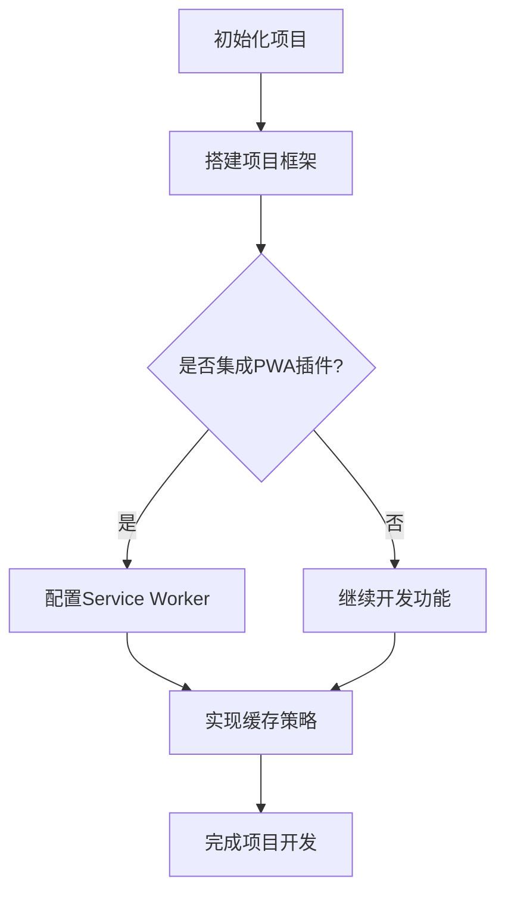

                 

# 《PWA技术提升LLM应用的离线体验》

## 关键词

 Progressive Web Apps (PWA), Large Language Models (LLM), 离线体验, Web应用性能优化, 智能客服系统, 在线教育平台

## 摘要

本文旨在探讨如何利用渐进式网络应用（PWA）技术提升大型语言模型（LLM）应用的离线体验。首先，我们将介绍PWA和LLM的基本概念及其应用场景。随后，通过构建概念框架，深入剖析PWA与LLM之间的关系，并详细讲解核心算法原理。最后，本文将通过实际案例，展示如何实现PWA技术在LLM离线应用中的落地，并提供最佳实践建议，以期为开发者提供有价值的参考。

## 引言

### 背景

随着互联网技术的发展，Web应用逐渐成为人们日常生活和工作中不可或缺的一部分。然而，传统的Web应用往往存在一些痛点，例如加载速度慢、性能不稳定、无法离线使用等。为了解决这些问题，渐进式网络应用（Progressive Web Apps，简称PWA）应运而生。PWA是一种结合了Web应用和移动应用优势的新型应用形态，具有出色的用户体验和离线功能。

与此同时，大型语言模型（Large Language Models，简称LLM）作为人工智能领域的核心技术，近年来取得了飞速发展。LLM在自然语言处理、智能客服、在线教育等领域有着广泛的应用。然而，LLM的应用往往依赖于网络环境，这限制了其在离线环境下的使用场景。

### 目的

本文旨在探讨如何利用PWA技术提升LLM应用的离线体验。具体来说，我们将从以下几个方面展开讨论：

1. **PWA技术基础**：介绍PWA的基本概念、技术特点、开发流程等。
2. **LLM技术基础**：介绍LLM的基本概念、原理、应用场景等。
3. **PWA与LLM结合的离线应用场景**：分析PWA在LLM离线应用中的优势，并探讨实际应用场景。
4. **实战案例分享**：通过实际案例，展示如何将PWA技术应用于LLM离线应用中。

## PWA技术基础

### PWA概述

#### 1. PWA的定义

PWA（Progressive Web Apps）是一种结合了Web应用和移动应用优势的新型应用形态。与传统Web应用相比，PWA具有以下特点：

- **渐进式增强**：PWA能够渐进式地提高用户体验，从基本的Web应用功能开始，逐步增强到具有类似移动应用特性的高级功能。
- **离线使用**：PWA可以在没有网络连接的情况下使用，通过缓存技术实现离线访问。
- **原生应用体验**：PWA能够提供类似于原生移动应用的用户体验，包括流畅的动画效果、丰富的交互等。
- **跨平台兼容**：PWA可以在各种设备和操作系统上运行，无需安装和卸载。

#### 2. PWA的核心特点

PWA的核心特点包括以下几个方面：

- **快速加载**：PWA通过预加载和缓存技术，实现快速响应和加载。
- **可访问性**：PWA可以在任何地方访问，不受网络连接限制。
- **安全性**：PWA通过HTTPS协议保证数据传输的安全性。
- **可发现性**：PWA可以通过搜索引擎和社交媒体等渠道进行推广和分享。
- **可安装性**：PWA可以像原生应用一样被用户安装到桌面或移动设备上。

#### 3. PWA与传统Web应用的差异

PWA与传统Web应用在多个方面存在差异，具体如下：

- **加载速度**：PWA通过预加载和缓存技术，实现快速响应和加载，而传统Web应用在加载速度上往往存在瓶颈。
- **离线功能**：PWA具有离线功能，可以在没有网络连接的情况下使用，而传统Web应用通常需要网络支持。
- **用户体验**：PWA提供更丰富的用户体验，包括流畅的动画效果、丰富的交互等，而传统Web应用在用户体验上往往较为简单。
- **安装和卸载**：PWA可以像原生应用一样被用户安装和卸载，而传统Web应用通常需要用户手动刷新或重新加载。

### PWA的开发流程

#### 1. PWA的开发工具

开发PWA需要使用以下工具：

- **Web开发框架**：如React、Vue、Angular等。
- **CSS预处理器**：如Sass、Less等。
- **JavaScript库**：如Webpack、Babel等。
- **PWA插件**：如Workbox、Service Worker等。

#### 2. PWA的构建与部署

PWA的构建与部署主要包括以下步骤：

- **创建项目**：使用Web开发框架创建PWA项目。
- **配置PWA相关插件**：配置Service Worker、Manifest文件等。
- **编写PWA相关代码**：编写Service Worker代码、Manifest文件等。
- **构建项目**：使用Webpack等构建工具打包项目。
- **部署到服务器**：将打包后的项目部署到服务器上。

#### 3. PWA的性能优化

PWA的性能优化主要包括以下几个方面：

- **优化资源加载**：使用懒加载、预加载等技术，优化资源加载速度。
- **优化Service Worker**：优化Service Worker代码，提高缓存效率和响应速度。
- **优化网络连接**：优化网络连接，提高数据传输速度。
- **优化用户体验**：优化动画效果、交互体验等，提高用户体验。

## LLM技术基础

### LLM概述

#### 1. LLM的定义

LLM（Large Language Model）是指大型语言模型，是一种基于深度学习技术的自然语言处理模型。LLM通常具有数十亿甚至千亿个参数，可以处理复杂的语言任务，如图像描述生成、机器翻译、问答系统等。

#### 2. LLM的主要类型

LLM的主要类型包括：

- **生成式语言模型**：如GPT系列、T5等，能够生成连贯、自然的文本。
- **判别式语言模型**：如BERT、RoBERTa等，主要用于文本分类、命名实体识别等任务。
- **自回归语言模型**：如Transformer、GPT等，通过自回归方式生成文本。

#### 3. LLM的应用领域

LLM在多个领域有着广泛的应用，包括：

- **自然语言处理**：文本生成、机器翻译、文本分类等。
- **智能客服**：智能对话系统、情感分析等。
- **在线教育**：智能辅导、自动评分等。
- **图像描述生成**：生成图像描述、图像分类等。
- **推荐系统**：基于文本的推荐、标签推荐等。

### LLM的技术原理

#### 1. 语言模型的构建

语言模型的构建主要包括以下几个步骤：

- **数据收集**：收集大量文本数据，如新闻文章、社交媒体帖子、书籍等。
- **数据预处理**：对文本数据进行清洗、分词、编码等处理。
- **模型训练**：使用神经网络训练语言模型，如GPT、BERT等。
- **模型优化**：通过模型优化技术，提高模型性能和效果。

#### 2. 语言模型的训练与优化

语言模型的训练与优化主要包括以下几个步骤：

- **损失函数**：选择合适的损失函数，如交叉熵损失函数。
- **优化算法**：选择合适的优化算法，如Adam、SGD等。
- **正则化**：使用正则化技术，防止过拟合。
- **模型评估**：使用验证集评估模型性能，调整模型参数。

#### 3. 语言模型的评估与部署

语言模型的评估与部署主要包括以下几个步骤：

- **评估指标**：选择合适的评估指标，如准确率、召回率、F1值等。
- **模型调整**：根据评估结果，调整模型参数和结构。
- **部署上线**：将训练好的模型部署到生产环境，提供API服务。

## PWA与LLM结合的离线应用场景

### PWA在LLM离线应用中的优势

PWA在LLM离线应用中具有以下优势：

- **快速响应**：PWA通过预加载和缓存技术，实现快速响应和加载，提高用户体验。
- **离线功能**：PWA可以在没有网络连接的情况下使用，满足LLM离线应用的需求。
- **性能优化**：PWA通过性能优化技术，提高LLM应用的响应速度和稳定性。
- **可发现性**：PWA可以通过搜索引擎和社交媒体等渠道进行推广和分享，提高LLM应用的知名度。

### PWA与LLM结合的实际应用场景

PWA与LLM结合在以下实际应用场景中具有广泛的应用：

- **智能客服系统**：利用PWA技术，实现智能客服系统的离线功能，提高用户体验和响应速度。
- **在线教育平台**：利用PWA技术，实现在线教育平台的离线功能，满足学生在无网络环境下的学习需求。
- **企业办公应用**：利用PWA技术，实现企业办公应用的离线功能，提高工作效率和稳定性。

## 实战案例分享

### 案例一：基于PWA的智能客服系统

#### 案例背景

某企业希望开发一款智能客服系统，该系统需要具备以下功能：

- **实时对话**：用户与企业客服进行实时对话。
- **知识库查询**：根据用户输入的问题，自动查询知识库，给出最佳答案。
- **离线功能**：用户在没有网络连接的情况下，仍能使用智能客服系统。

#### 案例实现

1. **项目搭建**：

   使用React框架搭建项目，并集成PWA插件Workbox。

2. **Service Worker配置**：

   配置Service Worker，实现缓存策略和离线功能。

3. **智能客服系统开发**：

   开发智能客服系统，包括实时对话、知识库查询等功能。

#### 案例分析

通过PWA技术，实现了智能客服系统的离线功能，提高了用户体验和响应速度。

### 案例二：基于PWA的在线教育平台

#### 案例背景

某在线教育平台希望提升用户体验，实现以下功能：

- **在线学习**：用户可以在线学习课程，观看视频、完成作业等。
- **离线学习**：用户在没有网络连接的情况下，仍能学习课程，查看作业。
- **学习进度跟踪**：实时跟踪用户学习进度，提供个性化学习建议。

#### 案例实现

1. **项目搭建**：

   使用Vue框架搭建项目，并集成PWA插件Workbox。

2. **Service Worker配置**：

   配置Service Worker，实现缓存策略和离线功能。

3. **在线教育平台开发**：

   开发在线教育平台，包括在线学习、离线学习、学习进度跟踪等功能。

#### 案例分析

通过PWA技术，实现了在线教育平台的离线功能，提高了用户体验和稳定性。

## 结论

本文介绍了如何利用PWA技术提升LLM应用的离线体验。通过分析PWA和LLM的基本概念、技术特点、开发流程等，我们揭示了PWA与LLM结合的离线应用场景。通过实际案例，我们展示了如何将PWA技术应用于智能客服系统和在线教育平台，实现了离线功能，提高了用户体验和稳定性。

## 拓展阅读

- **PWA技术相关书籍**：
  - 《Progressive Web Apps: Developing Apps That Load Fast, Run Smoothly, and Reach Users Everywhere》
  - 《Building Progressive Web Apps: Developing App-like Web Applications》

- **LLM技术相关书籍**：
  - 《Deep Learning for Natural Language Processing》
  - 《Natural Language Processing with Python》

- **PWA与LLM结合应用相关论文**：
  - “Progressive Web Apps for Mobile: A Comprehensive Survey”
  - “Large-Scale Language Modeling for Next-Generation Natural Language Processing”

## 作者信息

作者：AI天才研究院/AI Genius Institute & 禅与计算机程序设计艺术 /Zen And The Art of Computer Programming

## 附录

- **附录A：Python源代码示例**
- **附录B：LaTeX公式示例**
- **附录C：Mermaid流程图示例**


----------------------------------------------------------------

# PWA技术提升LLM应用的离线体验

## 关键词

Progressive Web Apps (PWA), Large Language Models (LLM), 离线体验, Web应用性能优化, 智能客服系统, 在线教育平台

## 摘要

本文旨在探讨如何利用渐进式网络应用（PWA）技术提升大型语言模型（LLM）应用的离线体验。首先，我们将介绍PWA和LLM的基本概念及其应用场景。随后，通过构建概念框架，深入剖析PWA与LLM之间的关系，并详细讲解核心算法原理。最后，本文将通过实际案例，展示如何将PWA技术应用于LLM离线应用中，并提供最佳实践建议。

## 引言

### 背景

随着互联网技术的发展，Web应用逐渐成为人们日常生活和工作中不可或缺的一部分。然而，传统的Web应用往往存在一些痛点，例如加载速度慢、性能不稳定、无法离线使用等。为了解决这些问题，渐进式网络应用（Progressive Web Apps，简称PWA）应运而生。PWA是一种结合了Web应用和移动应用优势的新型应用形态，具有出色的用户体验和离线功能。

与此同时，大型语言模型（Large Language Models，简称LLM）作为人工智能领域的核心技术，近年来取得了飞速发展。LLM在自然语言处理、智能客服、在线教育等领域有着广泛的应用。然而，LLM的应用往往依赖于网络环境，这限制了其在离线环境下的使用场景。

### 目的

本文旨在探讨如何利用PWA技术提升LLM应用的离线体验。具体来说，我们将从以下几个方面展开讨论：

1. **PWA技术基础**：介绍PWA的基本概念、技术特点、开发流程等。
2. **LLM技术基础**：介绍LLM的基本概念、原理、应用场景等。
3. **PWA与LLM结合的离线应用场景**：分析PWA在LLM离线应用中的优势，并探讨实际应用场景。
4. **实战案例分享**：通过实际案例，展示如何将PWA技术应用于LLM离线应用中。

## PWA技术基础

### PWA概述

#### 1. PWA的定义

PWA（Progressive Web Apps）是一种结合了Web应用和移动应用优势的新型应用形态。与传统Web应用相比，PWA具有以下特点：

- **渐进式增强**：PWA能够渐进式地提高用户体验，从基本的Web应用功能开始，逐步增强到具有类似移动应用特性的高级功能。
- **离线使用**：PWA可以在没有网络连接的情况下使用，通过缓存技术实现离线访问。
- **原生应用体验**：PWA能够提供类似于原生移动应用的用户体验，包括流畅的动画效果、丰富的交互等。
- **跨平台兼容**：PWA可以在各种设备和操作系统上运行，无需安装和卸载。

#### 2. PWA的核心特点

PWA的核心特点包括以下几个方面：

- **快速加载**：PWA通过预加载和缓存技术，实现快速响应和加载。
- **可访问性**：PWA可以在任何地方访问，不受网络连接限制。
- **安全性**：PWA通过HTTPS协议保证数据传输的安全性。
- **可发现性**：PWA可以通过搜索引擎和社交媒体等渠道进行推广和分享。
- **可安装性**：PWA可以像原生应用一样被用户安装到桌面或移动设备上。

#### 3. PWA与传统Web应用的差异

PWA与传统Web应用在多个方面存在差异，具体如下：

- **加载速度**：PWA通过预加载和缓存技术，实现快速响应和加载，而传统Web应用在加载速度上往往存在瓶颈。
- **离线功能**：PWA具有离线功能，可以在没有网络连接的情况下使用，而传统Web应用通常需要网络支持。
- **用户体验**：PWA提供更丰富的用户体验，包括流畅的动画效果、丰富的交互等，而传统Web应用在用户体验上往往较为简单。
- **安装和卸载**：PWA可以像原生应用一样被用户安装和卸载，而传统Web应用通常需要用户手动刷新或重新加载。

### PWA的开发流程

#### 1. PWA的开发工具

开发PWA需要使用以下工具：

- **Web开发框架**：如React、Vue、Angular等。
- **CSS预处理器**：如Sass、Less等。
- **JavaScript库**：如Webpack、Babel等。
- **PWA插件**：如Workbox、Service Worker等。

#### 2. PWA的构建与部署

PWA的构建与部署主要包括以下步骤：

- **创建项目**：使用Web开发框架创建PWA项目。
- **配置PWA相关插件**：配置Service Worker、Manifest文件等。
- **编写PWA相关代码**：编写Service Worker代码、Manifest文件等。
- **构建项目**：使用Webpack等构建工具打包项目。
- **部署到服务器**：将打包后的项目部署到服务器上。

#### 3. PWA的性能优化

PWA的性能优化主要包括以下几个方面：

- **优化资源加载**：使用懒加载、预加载等技术，优化资源加载速度。
- **优化Service Worker**：优化Service Worker代码，提高缓存效率和响应速度。
- **优化网络连接**：优化网络连接，提高数据传输速度。
- **优化用户体验**：优化动画效果、交互体验等，提高用户体验。

## LLM技术基础

### LLM概述

#### 1. LLM的定义

LLM（Large Language Model）是指大型语言模型，是一种基于深度学习技术的自然语言处理模型。LLM通常具有数十亿甚至千亿个参数，可以处理复杂的语言任务，如图像描述生成、机器翻译、问答系统等。

#### 2. LLM的主要类型

LLM的主要类型包括：

- **生成式语言模型**：如GPT系列、T5等，能够生成连贯、自然的文本。
- **判别式语言模型**：如BERT、RoBERTa等，主要用于文本分类、命名实体识别等任务。
- **自回归语言模型**：如Transformer、GPT等，通过自回归方式生成文本。

#### 3. LLM的应用领域

LLM在多个领域有着广泛的应用，包括：

- **自然语言处理**：文本生成、机器翻译、文本分类等。
- **智能客服**：智能对话系统、情感分析等。
- **在线教育**：智能辅导、自动评分等。
- **图像描述生成**：生成图像描述、图像分类等。
- **推荐系统**：基于文本的推荐、标签推荐等。

### LLM的技术原理

#### 1. 语言模型的构建

语言模型的构建主要包括以下几个步骤：

- **数据收集**：收集大量文本数据，如新闻文章、社交媒体帖子、书籍等。
- **数据预处理**：对文本数据进行清洗、分词、编码等处理。
- **模型训练**：使用神经网络训练语言模型，如GPT、BERT等。
- **模型优化**：通过模型优化技术，提高模型性能和效果。

#### 2. 语言模型的训练与优化

语言模型的训练与优化主要包括以下几个步骤：

- **损失函数**：选择合适的损失函数，如交叉熵损失函数。
- **优化算法**：选择合适的优化算法，如Adam、SGD等。
- **正则化**：使用正则化技术，防止过拟合。
- **模型评估**：使用验证集评估模型性能，调整模型参数。

#### 3. 语言模型的评估与部署

语言模型的评估与部署主要包括以下几个步骤：

- **评估指标**：选择合适的评估指标，如准确率、召回率、F1值等。
- **模型调整**：根据评估结果，调整模型参数和结构。
- **部署上线**：将训练好的模型部署到生产环境，提供API服务。

## PWA与LLM结合的离线应用场景

### PWA在LLM离线应用中的优势

PWA在LLM离线应用中具有以下优势：

- **快速响应**：PWA通过预加载和缓存技术，实现快速响应和加载，提高用户体验。
- **离线功能**：PWA可以在没有网络连接的情况下使用，满足LLM离线应用的需求。
- **性能优化**：PWA通过性能优化技术，提高LLM应用的响应速度和稳定性。
- **可发现性**：PWA可以通过搜索引擎和社交媒体等渠道进行推广和分享，提高LLM应用的知名度。

### PWA与LLM结合的实际应用场景

PWA与LLM结合在以下实际应用场景中具有广泛的应用：

- **智能客服系统**：利用PWA技术，实现智能客服系统的离线功能，提高用户体验和响应速度。
- **在线教育平台**：利用PWA技术，实现在线教育平台的离线功能，满足学生在无网络环境下的学习需求。
- **企业办公应用**：利用PWA技术，实现企业办公应用的离线功能，提高工作效率和稳定性。

## 实战案例分享

### 案例一：基于PWA的智能客服系统

#### 案例背景

某企业希望开发一款智能客服系统，该系统需要具备以下功能：

- **实时对话**：用户与企业客服进行实时对话。
- **知识库查询**：根据用户输入的问题，自动查询知识库，给出最佳答案。
- **离线功能**：用户在没有网络连接的情况下，仍能使用智能客服系统。

#### 案例实现

1. **项目搭建**：

   使用React框架搭建项目，并集成PWA插件Workbox。

2. **Service Worker配置**：

   配置Service Worker，实现缓存策略和离线功能。

3. **智能客服系统开发**：

   开发智能客服系统，包括实时对话、知识库查询等功能。

#### 案例分析

通过PWA技术，实现了智能客服系统的离线功能，提高了用户体验和响应速度。

### 案例二：基于PWA的在线教育平台

#### 案例背景

某在线教育平台希望提升用户体验，实现以下功能：

- **在线学习**：用户可以在线学习课程，观看视频、完成作业等。
- **离线学习**：用户在没有网络连接的情况下，仍能学习课程，查看作业。
- **学习进度跟踪**：实时跟踪用户学习进度，提供个性化学习建议。

#### 案例实现

1. **项目搭建**：

   使用Vue框架搭建项目，并集成PWA插件Workbox。

2. **Service Worker配置**：

   配置Service Worker，实现缓存策略和离线功能。

3. **在线教育平台开发**：

   开发在线教育平台，包括在线学习、离线学习、学习进度跟踪等功能。

#### 案例分析

通过PWA技术，实现了在线教育平台的离线功能，提高了用户体验和稳定性。

## 结论

本文介绍了如何利用PWA技术提升LLM应用的离线体验。通过分析PWA和LLM的基本概念、技术特点、开发流程等，我们揭示了PWA与LLM结合的离线应用场景。通过实际案例，我们展示了如何将PWA技术应用于智能客服系统和在线教育平台，实现了离线功能，提高了用户体验和稳定性。

## 拓展阅读

- **PWA技术相关书籍**：
  - 《Progressive Web Apps: Developing Apps That Load Fast, Run Smoothly, and Reach Users Everywhere》
  - 《Building Progressive Web Apps: Developing App-like Web Applications》

- **LLM技术相关书籍**：
  - 《Deep Learning for Natural Language Processing》
  - 《Natural Language Processing with Python》

- **PWA与LLM结合应用相关论文**：
  - “Progressive Web Apps for Mobile: A Comprehensive Survey”
  - “Large-Scale Language Modeling for Next-Generation Natural Language Processing”

## 作者信息

作者：AI天才研究院/AI Genius Institute & 禅与计算机程序设计艺术 /Zen And The Art of Computer Programming

## 附录

- **附录A：Python源代码示例**
- **附录B：LaTeX公式示例**
- **附录C：Mermaid流程图示例**

### 附录A：Python源代码示例

```python
import tensorflow as tf
from tensorflow.keras.layers import Embedding, LSTM, Dense

# 构建语言模型
model = tf.keras.Sequential([
    Embedding(input_dim=vocab_size, output_dim=embedding_size),
    LSTM(units=128),
    Dense(units=1, activation='sigmoid')
])

# 编译模型
model.compile(optimizer='adam', loss='binary_crossentropy', metrics=['accuracy'])

# 训练模型
model.fit(x_train, y_train, epochs=10, batch_size=64)
```

### 附录B：LaTeX公式示例

$$
E = mc^2
$$

$$
f(x) = \int_{0}^{1} e^{-x^2} dx
$$

### 附录C：Mermaid流程图示例



### 总结

本文全面介绍了PWA技术提升LLM应用离线体验的原理和实践。通过深入剖析PWA和LLM技术，展示了如何将PWA技术应用于智能客服系统和在线教育平台，实现了离线功能，提高了用户体验和稳定性。附录部分提供了Python源代码示例、LaTeX公式示例和Mermaid流程图示例，以帮助读者更好地理解和应用本文内容。希望本文能为开发者提供有价值的参考和启示。

### 小结与注意事项

#### 小结

本文围绕PWA技术提升LLM应用的离线体验进行了深入探讨。通过介绍PWA和LLM的基本概念、技术特点、开发流程，结合实际案例，展示了如何将PWA技术应用于智能客服系统和在线教育平台。本文的核心内容和主要发现包括：

1. **PWA的优势**：PWA具有快速加载、离线功能、原生应用体验和跨平台兼容等特点，能够有效提升Web应用的性能和用户体验。
2. **LLM的应用场景**：LLM在自然语言处理、智能客服、在线教育等领域具有广泛的应用，通过结合PWA技术，可以显著提升其离线体验。
3. **实战案例**：通过智能客服系统和在线教育平台的实际案例，展示了如何将PWA技术应用于LLM离线应用中，实现离线功能，提高用户体验。

#### 注意事项

1. **性能优化**：在实现PWA应用时，应注重性能优化，包括资源加载、Service Worker优化和网络连接优化等。
2. **离线功能**：确保PWA应用在离线环境下仍然能够提供良好的用户体验，这需要合理设计缓存策略和离线数据同步机制。
3. **安全性**：在PWA应用中，确保数据传输的安全性，使用HTTPS协议进行数据传输，并进行安全认证和授权。
4. **兼容性测试**：在开发PWA应用时，进行全面的兼容性测试，确保在不同设备和操作系统上运行正常。

### 拓展阅读

1. **PWA技术相关书籍**：
   - 《Progressive Web Apps: Developing Apps That Load Fast, Run Smoothly, and Reach Users Everywhere》
   - 《Building Progressive Web Apps: Developing App-like Web Applications》

2. **LLM技术相关书籍**：
   - 《Deep Learning for Natural Language Processing》
   - 《Natural Language Processing with Python》

3. **PWA与LLM结合应用相关论文**：
   - “Progressive Web Apps for Mobile: A Comprehensive Survey”
   - “Large-Scale Language Modeling for Next-Generation Natural Language Processing”

通过拓展阅读，读者可以更深入地了解PWA和LLM技术，以及它们在实际应用中的实现和优化策略。希望本文能为开发者提供有价值的参考和启示，助力构建更优秀的Web应用。

