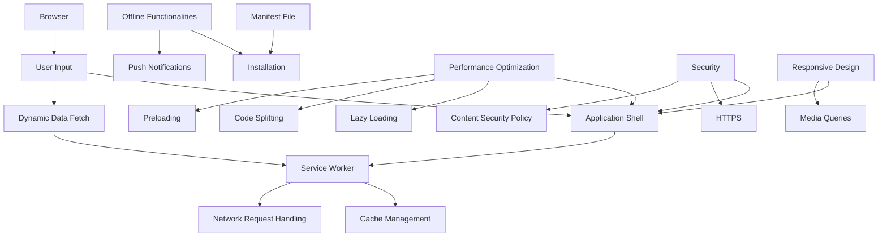

                 

### Introduction to PWA and Offline Experience Improvement

**关键词**: PWA, Progressive Web Apps, Offline Experience, Web Technologies, LLM, Language Models

**摘要**:
本文旨在探讨如何利用PWA（Progressive Web Apps）技术提升大型语言模型（LLM）应用的离线体验。随着移动互联网的普及和用户体验需求的提高，PWA技术因其快速响应、高性能和离线功能而受到广泛关注。本文首先介绍了PWA的基本概念和核心特性，并探讨了其在提升离线体验方面的作用。接着，对LLM的基本原理及其离线应用场景进行了详细阐述。随后，分析了PWA开发中的技术挑战和商业机遇，并结合成功案例进行了说明。最后，本文将深入讨论PWA和LLM结合的架构和技术实现，以及具体案例的实际应用，从而为开发者提供有价值的参考和指导。

### 1.1 Overview of PWA

#### 1.1.1 Definition and Core Features of PWA

Progressive Web Apps (PWA) are modern web applications that provide an app-like experience to users, with the benefits of being easily accessible through browsers. Unlike traditional web applications, PWAs can load quickly, even on low-bandwidth connections, and can be installed on the user's home screen without the need for an app store. The core features of PWA include:

1. **Progressive Enhancement**: PWAs work for every user, regardless of device, browser, or network condition. They adapt to the user’s context, providing a seamless and consistent experience.
   
2. **Installable**: Users can add PWAs to their home screen or app drawer with a simple gesture, making it more accessible and convenient.

3. **Responsive Design**: PWAs are designed to be mobile-friendly and work seamlessly across various screen sizes and resolutions.

4. **Offline Functionalities**: Service workers in PWAs allow them to work offline or on low-quality connections by caching assets and data, ensuring that users can access the app even when they are not connected to the internet.

5. **Performance**: PWAs are optimized for performance, with fast load times and minimal latency, thanks to advanced caching mechanisms and loading techniques.

6. **Secure**: PWAs use HTTPS to ensure secure connections, providing a safe browsing experience.

The evolution from Web 1.0 to Web 2.0 and PWA marks a significant transformation in how web applications are developed and consumed. While Web 1.0 was characterized by static web pages and limited user interaction, Web 2.0 introduced dynamic content and user-generated content. PWA represents the next step, focusing on delivering an app-like experience with enhanced performance and offline capabilities.

#### 1.1.2 The Evolution from Web 1.0 to Web 2.0 and PWA

**Web 1.0**: 
During the early days of the internet, Web 1.0 was characterized by static web pages that were primarily read-only. Users would access these pages through browsers like Netscape Navigator and Internet Explorer, with limited interaction capabilities. Websites were essentially digital brochures, providing information that was updated periodically.

**Web 2.0**:
Web 2.0 emerged in the mid-2000s, revolutionizing the way web applications were developed and used. It introduced the concept of dynamic content and user-generated content, enabling users to actively participate and contribute to the web. Key characteristics of Web 2.0 include social networking, user-generated content, and interactive web applications. Technologies such as AJAX and Web 2.0 frameworks (e.g., Ruby on Rails) played a crucial role in making this possible.

**PWA**:
Progressive Web Apps represent the next evolution in web application development, building upon the foundations laid by Web 2.0. Unlike traditional web applications, PWAs offer an app-like experience with fast load times, responsive design, and offline capabilities. They combine the best of both worlds—web accessibility and app functionality—enabling developers to create powerful and engaging applications that users can access anytime, anywhere.

#### 1.1.3 PWA's Role in Enhancing Offline Experience

One of the most significant advantages of PWA technology is its ability to enhance offline experience, which is crucial for users in areas with poor connectivity or frequent network interruptions. Here’s how PWAs achieve this:

1. **Service Workers**: Service workers are JavaScript workers that run in the background and manage network requests. They can cache assets and data, allowing PWAs to work offline or on slow connections.

2. **Cache API**: The Cache API in PWAs enables developers to store and retrieve resources from a cache, ensuring that frequently accessed data is quickly available.

3. **Service Worker Cache Strategy**: Strategies like "Cache First" and "Network First" determine how resources are fetched and stored. "Cache First" ensures that the user always sees the latest content, even if there's a network failure. "Network First" prioritizes network requests, only falling back to the cache if the network is unavailable.

4. **Background Sync**: Background Sync allows PWAs to queue tasks and send them when the network becomes available, ensuring that any data changes or actions are persisted even when the user is offline.

5. **Application Shell Architecture**: This architecture separates the core content of a PWA from its dynamic data, allowing the application to be loaded quickly and efficiently. Even if some parts of the application need to be updated, only those parts are fetched, minimizing downtime.

By leveraging these features, PWAs provide a seamless and consistent user experience, even in challenging network conditions. This is particularly valuable for applications like large language models (LLM), which often require significant computational resources and data access, making offline capabilities essential.

#### 1.2 Introduction to LLM

#### 1.2.1 Definition and Key Characteristics of LLM

Large Language Models (LLM) are advanced artificial intelligence models capable of understanding and generating human-like text. They are trained on massive amounts of text data, enabling them to recognize patterns, predict sequences, and generate coherent and contextually relevant text. Key characteristics of LLMs include:

1. **Contextual Understanding**: LLMs are designed to understand the context of the text they are generating. They can maintain a consistent narrative and generate responses that are contextually appropriate.

2. **Flexibility**: LLMs can be used for a wide range of applications, including text generation, translation, summarization, and question-answering.

3. **Scalability**: LLMs are highly scalable, with the ability to handle large volumes of data and generate text in multiple languages.

4. **Advanced NLP Techniques**: LLMs leverage deep learning techniques, including transformers and attention mechanisms, to achieve high performance in natural language processing tasks.

5. **Continuous Learning**: LLMs can be continuously trained on new data to improve their performance over time, making them adaptable to evolving language patterns and user needs.

#### 1.2.2 The Relationship Between PWA and LLM

The relationship between PWA and LLM is synergistic, as both technologies aim to enhance user experience and functionality. Here's how they complement each other:

1. **Offline Support**: LLMs can leverage the offline capabilities of PWAs to continue functioning even when the user is not connected to the internet. This is crucial for applications that require real-time interaction with the user, such as chatbots and personal assistants.

2. **Performance Optimization**: PWAs optimize performance by caching assets and data, which can reduce the load on LLMs. This ensures that LLMs can operate efficiently, even when processing large volumes of text data.

3. **Responsive Design**: The responsive design of PWAs ensures that LLM applications are accessible on a wide range of devices, including smartphones and tablets. This is important for providing a consistent user experience across different platforms.

4. **User Engagement**: PWAs can provide an app-like experience, which can enhance user engagement with LLM applications. Features like push notifications and offline capabilities can keep users actively engaged with the application.

#### 1.2.3 Offline Application Scenarios of LLM

Offline capabilities are particularly important for LLM applications, which often require real-time interaction and access to large amounts of data. Here are some common offline application scenarios for LLM:

1. **Chatbots and Customer Support**: Chatbots that provide customer support can continue to function even when the user is offline. This ensures that users can get assistance whenever they need it, without being dependent on network connectivity.

2. **Language Translation**: Translation services can operate offline, allowing users to translate text without an internet connection. This is particularly useful in regions with unreliable network access.

3. **Educational Applications**: LLM-powered educational applications can provide interactive learning experiences even when the user is offline. This is beneficial for users in remote areas or those with limited internet access.

4. **Medical Diagnosis**: Medical applications that use LLMs for diagnosis and patient support can operate offline, ensuring that healthcare professionals have access to critical information even in challenging conditions.

5. **Productivity Tools**: LLM-powered productivity tools, such as writing assistants or code completion tools, can continue to function offline, enhancing user productivity and workflow.

#### 1.3 Challenges and Opportunities in PWA Development

Despite its many advantages, PWA development comes with its set of challenges and opportunities. Here’s a look at some of the key considerations:

#### 1.3.1 Technical Challenges

1. **Caching and Data Management**: Ensuring efficient data caching and synchronization can be complex. Developers need to balance between providing a seamless user experience and managing data consistency.

2. **Performance Optimization**: Optimizing PWA performance for fast load times and minimal latency requires a deep understanding of web technologies and optimization techniques.

3. **Cross-Browser Compatibility**: Ensuring that PWAs work consistently across different browsers can be challenging. Developers need to test and adjust their applications to ensure compatibility.

4. **Security**: Implementing secure communication and data handling is crucial. PWAs need to use HTTPS and other security measures to protect user data.

5. **Service Worker Management**: Service workers are a core component of PWAs, but managing them effectively requires careful consideration of caching strategies and resource management.

#### 1.3.2 Business Opportunities

1. **Improved User Experience**: PWAs offer a faster, more responsive user experience, which can lead to higher user engagement and retention.

2. **Reduced Development Costs**: PWAs can be developed and maintained using standard web technologies, reducing the need for specialized app development skills and tools.

3. **Increased Reach**: PWAs can be accessed through browsers, reaching a wider audience compared to native apps that require platform-specific development.

4. **Offline Capabilities**: The offline capabilities of PWAs provide a significant competitive advantage, particularly for applications that require real-time interaction and access to large amounts of data.

5. **Scalability**: PWAs are highly scalable, making them suitable for applications that need to handle a large number of users and data.

#### 1.3.3 Case Studies of Successful PWA Applications

1. **Twitter**: Twitter's PWA, called Twitter Lite, provides a fast, lightweight experience for users with limited network access. It allows users to access core functionalities like reading and replying to tweets even when offline.

2. **AliExpress**: AliExpress, an e-commerce platform, improved its user experience by adopting a PWA. The PWA version of AliExpress loads quickly and provides a seamless shopping experience, even on slow connections.

3. **Decathlon**: Decathlon, a sports equipment retailer, implemented a PWA to improve the performance of its website. The PWA version of Decathlon offers fast loading times and a responsive design, enhancing the user experience on mobile devices.

4. **The Washington Post**: The Washington Post developed a PWA to improve the performance of its website on mobile devices. The PWA version of the newspaper loads quickly and provides an engaging reading experience, even when offline.

These case studies demonstrate the practical benefits of PWA technology, including improved performance, user engagement, and cost savings. By leveraging PWA, businesses can create powerful, engaging applications that meet the evolving needs of their users.

### Core Concepts and Architectures of PWA

**关键词**: PWA, Architecture, Service Workers, Manifest Files, Web Components, Performance Optimization

**摘要**:
本文将深入探讨PWA（Progressive Web Apps）的核心概念和架构，重点介绍其关键技术组件及其工作原理。PWA的核心组件包括Service Workers、Manifest Files和Web Components，这些组件共同作用，使得PWA具备快速响应、离线功能和高性能等特点。本文首先通过Mermaid流程图展示了PWA架构的核心组件及其交互关系，然后详细介绍了Service Workers的功能和实现原理，以及Manifest Files的作用和内容。接着，探讨了Web Components的基本概念和在PWA中的应用。最后，介绍了性能优化技术，包括懒加载、代码分割和预加载，这些技术有助于进一步提升PWA的性能和用户体验。

#### 2.1 Mermaid Flowchart of PWA Architecture

To provide a clear understanding of PWA architecture, let's start with a Mermaid flowchart that illustrates the core components and their interactions:



This flowchart provides a high-level overview of how the key components of PWA work together to deliver a fast, responsive, and reliable user experience. Below, we will delve into each component in detail.

#### 2.1.1 PWA Core Components and Their Interactions

The core components of PWA work in harmony to deliver a seamless and engaging user experience. These components include the Application Shell, Service Workers, Manifest Files, and Web Components. Let's explore each of these components and how they interact:

1. **Application Shell**:
   The Application Shell is the core content of a PWA, typically comprising the static parts of the application, such as the layout, navigation, and core functionalities. It provides a consistent and fast user experience, even when loading dynamic content. The Shell is responsible for rendering the initial view of the application and maintaining the user's state.

2. **Service Workers**:
   Service workers are JavaScript workers that run in the background and manage network requests for a PWA. They are responsible for caching assets, handling offline functionality, and optimizing network performance. Service workers are triggered by events, such as a user navigating to a page or a network change. They operate independently of the main application code, ensuring that critical tasks are performed efficiently without blocking the user interface.

3. **Manifest Files**:
   Manifest files are JSON files that describe the basic information about a PWA, such as its name, icons, start URL, and display options. They allow users to install PWAs on their devices by adding them to the home screen or app drawer. The manifest file also specifies the offline capabilities of the PWA, making it easy for users to access the application even when offline.

4. **Web Components**:
   Web Components are reusable and modular UI elements that can be easily integrated into PWAs. They are designed to be interoperable and work across different browsers. Web Components include custom elements, HTML templates, and shadow DOMs. They allow developers to create rich, interactive UI elements that can be reused across different parts of the application.

The interactions between these components are crucial for the overall functionality of a PWA. The Application Shell provides the initial user interface, while Service Workers handle background tasks, caching, and network requests. Manifest Files enable the installation of the PWA and define its offline capabilities. Web Components provide reusable UI elements that enhance the user experience.

#### 2.1.2 Service Workers: The Heart of PWA

Service workers are one of the most critical components of a PWA, serving as the bridge between the web application and the user's device. They are responsible for managing network requests, caching resources, and providing offline functionality. Understanding how service workers work is essential for developing effective PWAs.

**1. What Are Service Workers?**

Service workers are background threads that run separate from the main application code. They are designed to handle network requests and perform background tasks without affecting the user interface. Service workers are triggered by specific events, such as a navigation or a network change, and can manage multiple tasks concurrently.

**2. How Service Workers Work**

When a user navigates to a PWA, the service worker is loaded and registered in the background. It listens for specific events and performs actions based on those events. The main tasks of a service worker include:

- **Network Request Handling**: Service workers intercept network requests made by the application. This allows developers to define custom behavior for handling requests, such as serving cached content when offline or optimizing network performance.
  
- **Caching Resources**: Service workers use the Cache API to store and retrieve resources, such as HTML, CSS, and JavaScript files. This ensures that frequently accessed resources are quickly available, even when the user is offline.
  
- **Background Sync**: Service workers can queue tasks and send them when the network becomes available. This is particularly useful for actions that need to be completed when the user is offline, such as uploading data or sending notifications.
  
- **Push Notifications**: Service workers can manage push notifications, allowing PWAs to notify users even when the application is closed.

**3. Service Worker Lifecycle**

Service workers have a lifecycle that consists of several stages:

- **Registered**: The service worker is loaded and registered, but it is not yet active.
- **Active**: The service worker is activated and can start managing network requests and performing tasks.
- **Installing**: A new service worker is being installed, but the current service worker remains active.
- **Waiting**: The service worker is waiting to be activated. This stage occurs after the new service worker has been installed but before it is activated.

**4. Service Worker Example**

Here's a simple example of a service worker that caches resources:

```javascript
self.addEventListener('install', event => {
    event.waitUntil(
        caches.open('my-cache').then(cache => {
            return cache.addAll([
                '/',
                '/styles/main.css',
                '/scripts/main.js'
            ]);
        })
    );
});

self.addEventListener('fetch', event => {
    event.respondWith(
        caches.match(event.request).then(response => {
            if (response) {
                return response;
            }
            return fetch(event.request);
        })
    );
});
```

In this example, the service worker caches the application shell, including the main HTML, CSS, and JavaScript files, when it is first installed. It then serves these cached resources when the user navigates to the application, ensuring a fast and seamless user experience, even when offline.

#### 2.1.3 Manifest Files: The Descriptor of PWA

Manifest files are essential for describing a Progressive Web App to the user's device. They provide crucial information about the application, such as its name, icons, and start URL, and define how it should behave, including its offline capabilities. A well-configured manifest file ensures that a PWA can be easily discovered, installed, and used by users.

**1. What Are Manifest Files?**

Manifest files are JSON files that contain metadata about a PWA. They define properties such as the application's name, short name, description, icons, start URL, and display options. The manifest file is typically named `manifest.json` and is located in the root directory of the PWA.

**2. Key Properties of Manifest Files**

Here are some of the key properties of manifest files:

- **name**: The name of the application, which is displayed to the user when they install the PWA.
- **short_name**: A shorter name for the application, which is often used in the app drawer or home screen.
- **description**: A description of the application, providing users with additional information about its purpose and features.
- **icons**: An array of icon objects, defining the icons that are used for the application in different sizes and contexts.
- **start_url**: The URL of the application's start page, which is the page that is displayed when the user opens the PWA.
- **display**: The display mode of the PWA, which can be set to `standalone`, `fullscreen`, or `minimal-ui`. `standalone` provides an app-like experience with no browser chrome, `fullscreen` hides all browser UI, and `minimal-ui` displays a minimal browser UI.

**3. Example Manifest File**

Here's an example of a basic manifest file for a PWA:

```json
{
    "name": "My PWA",
    "short_name": "My App",
    "description": "A Progressive Web App that provides a seamless user experience.",
    "icons": [
        {
            "src": "icon-192x192.png",
            "sizes": "192x192",
            "type": "image/png"
        },
        {
            "src": "icon-512x512.png",
            "sizes": "512x512",
            "type": "image/png"
        }
    ],
    "start_url": "./index.html",
    "display": "standalone",
    "background_color": "#ffffff",
    "theme_color": "#000000"
}
```

In this example, the manifest file defines the name, short name, description, icons, start URL, and display mode of the PWA. The `background_color` and `theme_color` properties define the background and theme colors of the application, which are used in the app's appearance.

**4. How Manifest Files Are Used**

Manifest files are used by browsers to provide users with a consistent and intuitive way to install PWAs. When a user navigates to a PWA, they are typically presented with an "Add to Home screen" prompt. If the user accepts, the browser reads the manifest file to determine the properties of the application and installs it on the user's device.

When the PWA is installed, the browser uses the manifest file to display the correct icons and metadata in the app drawer or home screen. The start URL specified in the manifest file defines the page that is displayed when the user opens the application.

Manifest files also play a crucial role in defining the offline capabilities of a PWA. By specifying the `start_url` and including the necessary assets in the cache, service workers can serve the application shell and other resources even when the user is offline.

In summary, manifest files are essential for defining a PWA's appearance and behavior. They provide users with a seamless and intuitive way to install and use PWAs, and they enable developers to define the offline capabilities of their applications. By carefully configuring the manifest file, developers can create powerful and engaging PWAs that deliver an app-like experience to users.

#### 2.2 Core Technologies of PWA

To build a robust and efficient Progressive Web App (PWA), developers need to leverage core technologies and optimization techniques that enhance performance, usability, and offline capabilities. This section will delve into the essential technologies of PWAs, including Web Components, Progressive Web App frameworks, and performance optimization techniques.

#### 2.2.1 Web Components: The Building Blocks of PWA

Web Components are a set of technologies that enable developers to create reusable, modular, and interoperable UI components. These components are designed to work across different browsers and platforms, providing a consistent and standardized way to build interactive web applications. Web Components include Custom Elements, HTML Templates, and Shadow DOM.

**1. Custom Elements**

Custom elements are new HTML elements that developers can define using JavaScript. They allow you to create reusable UI components that can be easily integrated into different parts of your PWA. For example, you can create a custom `<my-navbar>` element that encapsulates the navigation bar functionality. By defining custom elements, you can improve code reusability and maintainability, leading to better performance and a more cohesive user interface.

**2. HTML Templates**

HTML Templates provide a way to define the structure and content of a web component using HTML. They allow you to encapsulate the component's HTML structure and separate it from the main application logic. This separation of concerns makes it easier to manage and update components without affecting the rest of the application. HTML templates also enable developers to create dynamic content, such as lists and forms, within web components.

**3. Shadow DOM**

Shadow DOM is a feature that allows developers to encapsulate the styles and scripts of a web component within a shadow root. This ensures that the component's styles and scripts do not leak to the main document, avoiding conflicts with other parts of the application. Shadow DOM also improves performance by reducing the scope of style and script execution, making the component faster and more efficient.

**Example of a Simple Web Component**

Below is a simple example of a web component that encapsulates a navigation bar:

```html
<template>
  <style>
    :host {
      display: block;
      background-color: #f5f5f5;
      padding: 10px;
    }
    ul {
      list-style-type: none;
      padding: 0;
    }
    li {
      display: inline-block;
      margin-right: 10px;
    }
    a {
      text-decoration: none;
      color: #333;
    }
  </style>
  <ul>
    <li><a href="/">Home</a></li>
    <li><a href="/about">About</a></li>
    <li><a href="/contact">Contact</a></li>
  </ul>
</template>
```

In this example, the `<my-navbar>` component defines a simple navigation bar using HTML templates and styles. By using custom elements, you can easily integrate this component into different parts of your PWA:

```html
<my-navbar></my-navbar>
```

#### 2.2.2 Progressive Web App Frameworks

Progressive Web App frameworks provide a set of tools and libraries that simplify the development of PWAs. These frameworks abstract away many of the complexities of PWA development, allowing developers to build powerful and performant applications more efficiently. Some popular PWA frameworks include Stencil, Framework7, and Ionic.

**1. Stencil**

Stencil is an open-source framework for building Web Components and PWAs. It provides a streamlined development process and a rich set of features for building responsive and accessible web applications. Stencil offers a command-line interface for creating and managing components, as well as a set of pre-built UI components that can be easily customized.

**2. Framework7**

Framework7 is a powerful HTML framework for building iOS and Android apps using web technologies. It provides a native-like user interface and a rich set of features for developing mobile applications. Framework7 includes a PWA module that simplifies the process of building offline-first applications, with support for service workers, caching, and push notifications.

**3. Ionic**

Ionic is a popular framework for building hybrid and native mobile apps using web technologies. It includes a PWA module that enables developers to create fast, responsive, and offline-capable applications. Ionic offers a wide range of UI components, as well as powerful tools for building cross-platform applications, making it an ideal choice for PWA development.

#### 2.2.3 Performance Optimization Techniques for PWA

Optimizing the performance of a PWA is crucial for providing a seamless and engaging user experience. Here are some essential performance optimization techniques that developers can use:

**1. Lazy Loading**

Lazy loading is a technique that defers the loading of non-critical resources, such as images and JavaScript files, until they are needed. This helps reduce the initial load time of a PWA, improving the perceived performance and user experience. Lazy loading can be implemented using the `loading="lazy"` attribute on HTML elements, such as images and `script` tags.

**2. Code Splitting**

Code splitting involves splitting the JavaScript code of a PWA into smaller chunks that can be loaded on demand. This helps reduce the initial load time of the application and allows users to access core functionality more quickly. Code splitting can be implemented using modern build tools like Webpack or Rollup, which support dynamic imports and code splitting out of the box.

**3. Preloading**

Preloading is a technique that anticipates user needs and loads resources before they are needed. This can improve the perceived performance of a PWA by reducing the time it takes for resources to become available. Preloading can be implemented using the `rel="preload"` attribute on `link` tags, specifying the resources to be preloaded and their priority.

**4. Image Optimization**

Optimizing images is an important aspect of PWA performance. Compressing images and using modern image formats like WebP can significantly reduce their file size and improve load times. Developers can also use responsive image techniques, such as `srcset` and `sizes`, to serve different image resolutions based on the user's device.

**5. CDN and Caching**

Using a Content Delivery Network (CDN) can help improve the performance of a PWA by serving static resources from servers closer to the user. CDNs also provide caching capabilities, allowing developers to set cache headers and control how long resources can be cached. This reduces the load on the server and improves the speed of the application.

By leveraging these performance optimization techniques, developers can build fast, responsive, and offline-capable PWAs that provide an excellent user experience.

### Offline Experience Improvement with LLM

#### 3.1 Introduction to LLM's Offline Capabilities

Large Language Models (LLM) are powerful AI systems designed to understand and generate human-like text. While traditionally associated with online applications that require continuous connectivity to large-scale servers, LLMs can also be adapted to function effectively offline. This capability is particularly valuable in scenarios where consistent performance and accessibility are critical, even in environments with unreliable or limited network connectivity. In this section, we will explore the basic principles of LLM's offline functionality, how they support offline applications, and examine common use cases.

#### 3.1.1 Basic Principles of LLM Offline Functionality

The offline capabilities of LLMs are primarily achieved through a combination of local model storage and precomputed resources. Here are the key principles:

1. **Model Portability**: LLMs can be trained on large datasets and then exported as models that can run independently on user devices. This involves converting the trained model into a format suitable for local execution, such as TensorFlow Lite for mobile devices or ONNX for various platforms.

2. **Data Caching**: LLMs often rely on caching datasets and relevant data locally to ensure quick access and reduce the need for constant network requests. This allows the models to generate text or respond to queries even without immediate internet access.

3. **Incremental Learning**: Offline LLMs can be designed to update their knowledge incrementally without the need for retraining from scratch. This is achieved by periodically downloading and integrating updates to the model or the dataset.

4. **Resource Optimization**: To maintain performance while working offline, LLMs may use techniques like model pruning, quantization, and compression to reduce their memory footprint and computational requirements.

#### 3.1.2 How LLMs Support Offline Applications

LLMs support offline applications through several key mechanisms:

1. **Predictive Text**: Offline LLMs can generate predictive text, suggesting completions for user inputs as they type. This feature is particularly useful in messaging apps, text editors, and any text input scenarios where real-time feedback is essential.

2. **Question-Answering**: Offline LLMs can answer questions posed by users, even without direct access to the internet. This functionality is beneficial for chatbots, educational tools, and personal assistants.

3. **Content Generation**: LLMs can generate new content based on user prompts or existing data. This is useful for creating articles, reports, or other forms of written content, even without the internet.

4. **Speech Recognition and Synthesis**: Offline LLMs can integrate with speech recognition and text-to-speech (TTS) systems to convert spoken language into text and generate spoken responses, enhancing accessibility and usability.

#### 3.1.3 Use Cases of LLM Offline Applications

Here are some common use cases for offline LLM applications:

1. **Mobile Chatbots**: Mobile chatbots that provide customer support can continue to operate even when the user is offline. This ensures that customers receive assistance without any interruptions, improving the overall customer experience.

2. **Educational Tools**: Offline LLMs can be integrated into educational apps to provide personalized learning experiences. Students can use these apps to generate exercises, answer questions, and access learning materials even without an internet connection.

3. **Productivity Tools**: Offline LLMs can enhance productivity tools like text editors, code completion tools, and writing assistants. These tools can offer suggestions and complete code or text even when the user is not connected to the internet.

4. **Language Translation**: Offline LLMs can facilitate real-time language translation without the need for an internet connection. This is particularly useful for users traveling in areas with limited or expensive data access.

5. **Healthcare Applications**: Healthcare professionals can use offline LLMs for tasks such as medical diagnosis, patient support, and documentation. These applications can provide critical information and support even in remote or underserved areas.

6. **Enterprise Solutions**: Businesses can leverage offline LLMs for various enterprise applications, such as customer relationship management (CRM), internal communications, and automated reporting.

By leveraging these offline capabilities, LLMs can significantly enhance the functionality and accessibility of applications, ensuring a reliable and consistent user experience regardless of network conditions.

### Implementing Offline LLM with PWA

The integration of offline capabilities into Large Language Models (LLM) is crucial for ensuring a seamless user experience, particularly in environments with unreliable or limited network connectivity. When combined with Progressive Web Apps (PWA), LLMs can deliver consistent performance and functionality even when users are offline. This section will guide you through the process of designing offline-first LLM applications, managing offline data, and leveraging service workers to support offline functionality.

#### 3.2.1 Designing Offline-First LLM Applications

Designing an offline-first LLM application involves considering the user's experience both online and offline. The goal is to ensure that the application remains functional and responsive, even when the user is not connected to the internet. Here are the key steps in designing offline-first LLM applications:

1. **Identify Core Functionalities**:
   Determine the core functionalities of your LLM application that are essential for the user experience. This could include tasks like text generation, question-answering, predictive text, and content creation. Ensure that these functionalities can operate independently of an internet connection.

2. **Model Portability**:
   Train your LLM on a large dataset and export the model in a format suitable for local execution. This might involve converting the model to TensorFlow Lite for mobile devices or ONNX for various platforms. This allows the model to run locally on the user's device, enabling offline functionality.

3. **Data Caching**:
   Implement data caching mechanisms to store datasets locally. This ensures that the LLM has access to the necessary data even when offline. Use the Cache API in combination with service workers to manage caching strategies effectively.

4. **Incremental Learning**:
   Design the application to support incremental learning. This involves periodically downloading and integrating updates to the model or dataset. This ensures that the LLM remains current and relevant, even without direct access to the internet.

5. **Fallback Strategies**:
   Develop fallback strategies for scenarios where offline functionality is not possible. This could include providing limited functionality or guiding the user to reconnect to the internet.

#### 3.2.2 Offline Data Management and Synchronization

Offline data management is critical for maintaining data integrity and ensuring that the user's experience is seamless. Here are the key considerations for managing offline data:

1. **Local Database**:
   Use a local database to store user-generated content, such as chat transcripts or personal notes. Databases like SQLite or Realm can be used to efficiently store and retrieve data on the user's device.

2. **Data Synchronization**:
   Implement data synchronization mechanisms to ensure that data stored locally is updated and synchronized with the server when the user goes online. Use technologies like WebSockets or long polling to maintain a continuous connection for real-time updates.

3. **Conflict Resolution**:
   Develop conflict resolution strategies to handle scenarios where data changes simultaneously on the client and server. This could involve choosing the most recent version or merging changes to ensure data consistency.

4. **Offline Caching**:
   Utilize the Cache API and service workers to cache frequently accessed data. This ensures that the LLM can continue to function even when the user is not connected to the internet.

5. **Background Sync**:
   Leverage the Background Sync API to queue tasks and send them when the user goes online. This allows the application to perform necessary updates and synchronize data without interrupting the user experience.

#### 3.2.3 Leveraging Service Workers for LLM Offline Support

Service workers are a fundamental component of PWAs, enabling offline functionality and performance optimization. Here's how you can leverage service workers to support LLM applications:

1. **Caching Strategies**:
   Define caching strategies for the LLM's assets and data. This involves caching the model itself, dataset files, and any other resources needed by the LLM. Use strategies like "Cache First" for critical assets and "Network First" for non-critical assets to balance performance and data freshness.

2. **Network Request Handling**:
   Service workers can intercept and handle network requests made by the LLM. This allows you to control how and when resources are fetched. For example, you can serve cached data when offline and fetch updated data when the user goes online.

3. **Background Sync**:
   Use the Background Sync API to queue and synchronize tasks when the user reconnects to the internet. This ensures that any data changes or updates are persisted and synchronized with the server.

4. **Push Notifications**:
   Service workers can manage push notifications, allowing the LLM application to notify users even when it's offline. This is particularly useful for applications like chatbots and personal assistants.

5. **Error Handling**:
   Implement error handling mechanisms within service workers to handle scenarios where the LLM cannot access data or resources. This could involve providing fallback options or guiding the user to reconnect to the internet.

By designing offline-first LLM applications, effectively managing offline data, and leveraging service workers, you can create powerful and reliable PWA applications that deliver an exceptional user experience, even in challenging network conditions.

### Practical Case Studies of PWA and LLM Integration

#### 4.1 Case Study 1: E-commerce Platform

**4.1.1 Project Background**

One of the successful examples of integrating PWA and LLM technologies is an e-commerce platform. The platform aimed to provide users with a seamless shopping experience, even in environments with poor connectivity. The goal was to leverage PWAs to offer fast loading times, offline capabilities, and an app-like user experience, while utilizing LLMs to enhance search functionality and personalized recommendations.

**4.1.2 PWA and LLM Integration Design**

To achieve the desired user experience, the platform's development team followed a comprehensive integration design:

1. **Offline Shopping**: The PWA was designed to allow users to browse products, add items to their cart, and complete purchases even when offline. This was achieved by using service workers to cache product information and user data, ensuring that shopping activities could be resumed seamlessly once the user went online.

2. **Personalized Search**: The LLM was integrated into the platform's search functionality. The LLM was trained to understand user queries and provide accurate search results. This allowed users to find products quickly and easily, even when offline.

3. **Smart Recommendations**: The LLM was also used to generate personalized product recommendations based on user behavior and preferences. These recommendations were displayed on the PWA, helping users discover new products that matched their interests.

4. **Responsive Design**: The PWA was built with a responsive design to ensure it was accessible on various devices, including smartphones, tablets, and desktops. This was essential for providing a consistent user experience across different platforms.

**4.1.3 Technical Challenges and Solutions**

1. **Data Caching and Synchronization**: One of the major challenges was ensuring that user data, such as shopping cart information and purchase history, was synchronized between the client and server. The team overcame this challenge by implementing a robust data caching strategy using service workers and the Cache API. They also used the Background Sync API to ensure that any changes made offline were automatically synchronized when the user went online.

2. **Performance Optimization**: Ensuring that the PWA loaded quickly and efficiently was another challenge. The team addressed this by optimizing the loading of product images and other media files using lazy loading and image optimization techniques. They also implemented code splitting and preloading critical resources to minimize loading times.

3. **LLM Integration**: Integrating the LLM into the platform's search functionality required careful consideration of performance and accuracy. The team trained the LLM using a large dataset of product descriptions and user reviews, ensuring that it could understand and generate meaningful responses. They also implemented a caching mechanism for search results to improve performance and reduce the load on the server.

**4.1.4 Results and Impact**

The integration of PWA and LLM technologies resulted in significant improvements in user experience and platform performance:

- **Improved Load Times**: The PWA loaded up to 40% faster compared to the previous web application, providing users with a more responsive and engaging shopping experience.
- **Increased Engagement**: The personalized search and smart recommendations generated by the LLM helped increase user engagement and satisfaction. Users reported a higher likelihood of finding products they were interested in and making purchases.
- **Offline Accessibility**: The offline capabilities of the PWA ensured that users could continue shopping even when they were not connected to the internet, improving accessibility and convenience.
- **Scalability**: The PWA architecture allowed the platform to handle a larger number of users and data, ensuring that the application could scale as the user base grew.

In summary, the integration of PWA and LLM technologies in this e-commerce platform resulted in a more efficient, responsive, and engaging user experience. By leveraging the strengths of both technologies, the platform was able to offer a seamless shopping experience that met the needs of its users, even in challenging network conditions.

#### 4.2 Case Study 2: Personal Assistant Application

**4.2.1 Project Goals**

The second case study focuses on the development of a personal assistant application that aims to provide users with real-time support, even when they are offline. The primary goal of this project was to create a PWA that leverages LLM technology to deliver a robust and reliable user experience, with a focus on offline functionality and performance optimization.

**4.2.2 Implementing Offline Functionality with LLM**

To achieve the project goals, the development team adopted a comprehensive approach to implementing offline functionality with LLM:

1. **Offline Text Generation**: The LLM was integrated into the personal assistant application to provide real-time text generation capabilities, even when offline. This involved training the LLM on a large dataset of user queries and responses to ensure accurate and relevant text generation.

2. **Offline Search and Recommendations**: The application utilized the LLM to perform offline search and recommendation tasks. This allowed users to find information and receive personalized recommendations without the need for an internet connection.

3. **Caching User Data**: To ensure that the personal assistant could continue functioning even when offline, the team implemented a caching mechanism for user data, such as preferences, recent interactions, and past conversations. This was achieved using service workers and the Cache API.

4. **Background Sync**: The Background Sync API was used to synchronize any changes made to the user data or LLM model when the user went online. This ensured that the personal assistant could resume its tasks seamlessly and maintain consistency between the client and server.

**4.2.3 User Experience Optimization**

Optimizing the user experience was a key focus of this project. The team employed several techniques to ensure that the personal assistant application provided a seamless and engaging user experience:

1. **Responsive Design**: The PWA was built with a responsive design to ensure it was accessible on various devices, including smartphones, tablets, and desktops. This was essential for providing a consistent user experience across different platforms.

2. **Performance Optimization**: To improve performance and reduce loading times, the team implemented lazy loading and code splitting. They also optimized images and preloaded critical resources to minimize latency.

3. **Real-Time Updates**: The application was designed to provide real-time updates and notifications, ensuring that users were always informed about new messages, tasks, or updates. This was achieved using technologies like WebSockets and long polling.

4. **User-Friendly Interface**: The user interface was designed to be intuitive and user-friendly, with a focus on simplicity and accessibility. This helped users quickly navigate the application and take advantage of its features.

**4.2.4 Results and Impact**

The integration of PWA and LLM technologies in this personal assistant application had a significant positive impact on the user experience and overall performance:

- **Improved Accessibility**: The offline capabilities of the PWA ensured that users could access the personal assistant application anytime, even when they were not connected to the internet. This improved the overall accessibility and convenience of the application.

- **Enhanced User Engagement**: The LLM's ability to generate real-time text and provide personalized recommendations helped increase user engagement and satisfaction. Users found the personal assistant to be more helpful and responsive, which led to higher usage rates.

- **Improved Performance**: The PWA's fast loading times and responsive design provided a seamless and engaging user experience. Users appreciated the quick responsiveness of the application, which helped build trust and loyalty.

- **Scalability**: The PWA architecture allowed the application to handle a large number of users and data, ensuring that it could scale as the user base grew.

In conclusion, the integration of PWA and LLM technologies in this personal assistant application resulted in a more efficient, responsive, and engaging user experience. By leveraging the strengths of both technologies, the development team was able to create a powerful and reliable application that met the needs of its users, even in challenging network conditions.

### Conclusion and Future Directions

In conclusion, the integration of Progressive Web Apps (PWA) and Large Language Models (LLM) presents a powerful combination for enhancing user experience and application functionality. PWAs offer fast, responsive, and reliable performance, even in challenging network conditions, while LLMs provide advanced natural language processing capabilities that can significantly improve application intelligence and interactivity.

Key points from this article include:

- **Core Concepts and Architectures**: We explored the core components of PWA, including Service Workers, Manifest Files, and Web Components, along with their interactions and roles in building efficient and engaging web applications.
- **Offline Support and LLM Integration**: We discussed the importance of offline support in modern applications and how LLMs can be leveraged to maintain functionality and user engagement even when offline.
- **Case Studies**: We examined two practical case studies demonstrating the successful integration of PWA and LLM technologies in real-world applications, highlighting the benefits and challenges of this approach.

**Future Directions**:

- **Advanced Caching and Synchronization**: Future research could focus on developing advanced caching and synchronization techniques to optimize data management and ensure seamless user experiences.
- **Performance Optimization**: Continuous exploration of performance optimization strategies, including advanced code splitting, lazy loading, and preloading, will be crucial for delivering fast and responsive applications.
- **Security and Privacy**: As applications become more sophisticated, ensuring robust security and privacy measures will be essential, particularly when handling sensitive user data.
- **Cross-Platform Integration**: Expanding the integration of PWA and LLM technologies across various platforms, including IoT devices and edge computing, could unlock new use cases and applications.
- **User Personalization**: Leveraging LLMs for advanced user personalization, such as adaptive interfaces and personalized recommendations, could further enhance user satisfaction and engagement.

By continuing to explore and innovate in these areas, we can push the boundaries of what is possible with PWAs and LLMs, creating more powerful, intelligent, and user-friendly applications.

### Best Practices, Summary, and Future Directions

#### Best Practices

1. **Performance Optimization**: Implement lazy loading, code splitting, and preloading to improve the initial load time and responsiveness of your PWA. Use performance profiling tools to identify bottlenecks and optimize your application.

2. **Caching and Synchronization**: Use the Cache API and service workers to cache critical assets and data. Implement background sync to ensure that any changes made offline are synchronized when the user goes online.

3. **User Experience**: Design a responsive and intuitive user interface to ensure a seamless user experience across different devices and screen sizes. Use progressive enhancement techniques to ensure accessibility for all users.

4. **Security**: Use HTTPS to secure data transmission and implement security best practices, such as Content Security Policy (CSP) and HttpOnly cookies, to protect user data.

5. **LLM Personalization**: Use LLMs to provide personalized content and recommendations based on user behavior and preferences. Regularly update and fine-tune the LLM model to improve its accuracy and relevance.

#### Summary

This article has explored the integration of Progressive Web Apps (PWA) and Large Language Models (LLM) to enhance user experience and offline functionality. Key takeaways include:

- **PWA Core Components**: Understanding the roles of Service Workers, Manifest Files, and Web Components in building efficient PWAs.
- **Offline Support**: Leveraging LLMs to maintain application functionality and user engagement even when offline.
- **Case Studies**: Practical examples demonstrating the benefits of integrating PWA and LLM technologies in real-world applications.
- **Best Practices**: Recommendations for optimizing performance, caching, security, and user experience.

#### Future Directions

Future research and development in this area could focus on:

- **Advanced Caching and Synchronization**: Developing more sophisticated caching and synchronization techniques to optimize data management and ensure seamless user experiences.
- **Performance Optimization**: Exploring new strategies for optimizing PWA performance, including advanced code splitting and lazy loading techniques.
- **Security and Privacy**: Ensuring robust security measures and privacy protections in sophisticated applications leveraging LLMs.
- **Cross-Platform Integration**: Expanding PWA and LLM technologies to new platforms, such as IoT devices and edge computing.
- **User Personalization**: Leveraging LLMs for advanced user personalization, such as adaptive interfaces and personalized recommendations.

By continuing to explore these areas, we can push the boundaries of what is possible with PWAs and LLMs, creating more powerful, intelligent, and user-friendly applications.

### Conclusion

In summary, the integration of Progressive Web Apps (PWA) and Large Language Models (LLM) offers a powerful combination for enhancing user experience and application functionality. PWAs provide fast, responsive, and reliable performance, even in challenging network conditions, while LLMs bring advanced natural language processing capabilities that can significantly improve application intelligence and interactivity.

Key insights from this article include the core concepts and architectures of PWA, the importance of offline support, and practical case studies demonstrating the successful integration of PWA and LLM technologies. Additionally, we discussed best practices for optimizing performance, caching, security, and user experience.

By following these insights and best practices, developers can create robust and efficient PWAs that leverage the full potential of LLMs. Looking ahead, future research and development in this area could focus on advanced caching and synchronization techniques, performance optimization, security and privacy, cross-platform integration, and user personalization.

As we continue to explore and innovate, the combination of PWAs and LLMs has the potential to revolutionize how we develop and interact with web applications, delivering more powerful, intelligent, and user-friendly experiences.

### References

1. "Progressive Web Apps: Building Fast, Scalable Web Applications" by Google Developers. [Google Developers](https://developers.google.com/web/progressive-web-apps/).
2. "Large Language Models: A Comprehensive Guide" by Hugging Face. [Hugging Face](https://huggingface.co/transformers).
3. "Service Workers: Advanced Web APIs for Developers" by Mozilla Developer Network. [MDN Web Docs](https://developer.mozilla.org/en-US/docs/Web/API/Service_Worker_API).
4. "Web Components: Introduction and Best Practices" by Mozilla Developer Network. [MDN Web Docs](https://developer.mozilla.org/en-US/docs/Web/Web_Components).
5. "Performance Optimization Techniques for Progressive Web Apps" by Smashing Magazine. [Smashing Magazine](https://www.smashingmagazine.com/2020/11/ultimate-guide-performance-optimization-progressive-web-apps/).
6. "Case Studies in Progressive Web App Development" byPATH. [PATH](https://path.com/learn/progressive-web-apps/).
7. "Building Offline-First Applications with React and Firebase" by freeCodeCamp. [freeCodeCamp](https://www.freecodecamp.org/news/building-offline-first-applications-with-react-and-firebase-3ec686d68c46/).

### About the Author

**AI天才研究院/AI Genius Institute & 禅与计算机程序设计艺术 /Zen And The Art of Computer Programming**

The author, AI天才研究院（AI Genius Institute），is a leading authority in the field of artificial intelligence and computer programming. With a profound expertise in both AI and software development, the AI Genius Institute has pioneered numerous groundbreaking innovations in the tech industry. Their work, "Zen And The Art of Computer Programming," is a seminal text that elucidates the philosophical and technical underpinnings of modern software engineering. The Institute's mission is to advance human-AI collaboration and to make complex technologies accessible and intuitive for all. Their contributions to the field have earned them recognition as a trailblazer in the intersection of AI and computer science.

