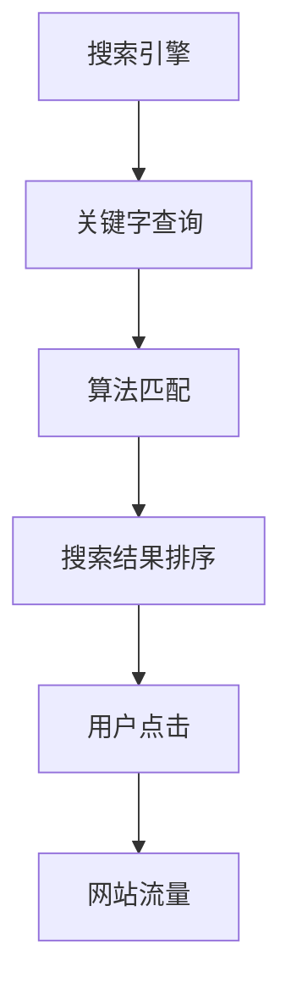

                 


# 《SEO友好设计：提高LLM应用的可发现性》

> 关键词：SEO，大型语言模型（LLM），搜索引擎优化，应用可发现性，优化策略

> 摘要：
本文将深入探讨如何通过SEO友好设计提高大型语言模型（LLM）应用的可发现性。首先，我们将介绍SEO和LLM的基本概念，然后分析SEO与LLM结合的必要性和优势。接着，我们将详细讲解SEO友好设计的原则和方法，并通过实战案例展示如何实现SEO优化。最后，我们将总结全文，并给出未来的研究方向和建议。

## 第一部分：SEO基础

### 1.1 SEO基本原理

SEO，即搜索引擎优化，是指通过特定的技术和策略，提高网站在搜索引擎中的排名，从而增加网站流量和用户访问量。SEO的核心目标是通过改善网站结构和内容，使其更符合搜索引擎的算法要求，从而获得更好的搜索结果排名。

搜索引擎优化主要包括以下三个方面：

- **关键字优化（Keywords Optimization）**：通过合理选择和布局关键字，提高网站在搜索引擎结果页面（SERP）中的相关性和排名。
- **网站结构优化（Site Structure Optimization）**：通过改善网站结构，使其更加清晰、易于搜索引擎爬取和理解。
- **内容优化（Content Optimization）**：通过创作高质量的内容，提高用户满意度和搜索引擎的排名。

### 1.2 搜索引擎算法

搜索引擎算法是搜索引擎的核心技术，它决定了网站在搜索结果中的排名。搜索引擎算法主要包括以下几种：

- **PageRank**：Google最初的算法，通过计算网页之间的链接关系来确定网页的重要性。
- **BERT**：Google近期推出的算法，通过深度学习技术理解用户查询的上下文，提高搜索结果的相关性。
- **Yandex**：Yandex搜索引擎使用的算法，通过分析网页内容和用户行为数据来提高搜索结果的质量。

搜索引擎算法的更新与变化对SEO策略有着重要的影响，因此，SEO专家需要不断关注和学习最新的搜索引擎算法。

### 1.3 SEO策略与方法

SEO策略和方法主要包括以下几个方面：

- **关键字研究（Keyword Research）**：通过工具和技巧，确定目标用户搜索的关键词，以便进行优化。
- **内容营销（Content Marketing）**：通过创作高质量的内容，吸引目标用户，提高网站流量和搜索引擎排名。
- **链接建设（Link Building）**：通过获得外部网站的链接，提高网站的权威性和排名。
- **社交媒体营销（Social Media Marketing）**：通过社交媒体平台，提高网站的知名度和用户参与度。

## 第二部分：LLM基础

### 2.1 LLM概述

LLM，即大型语言模型（Large Language Model），是一种基于深度学习的语言处理模型，能够理解和生成自然语言。LLM的主要类型包括：

- **预训练模型（Pre-trained Model）**：在大量文本数据上进行预训练，然后通过微调（Fine-tuning）适应特定任务。
- **生成式模型（Generative Model）**：能够生成新的文本内容，如GPT-3。
- **判别式模型（Discriminative Model）**：能够对输入文本进行分类和判断，如BERT。

LLM在自然语言处理（NLP）领域具有广泛的应用，包括机器翻译、文本分类、问答系统等。

### 2.2 LLM核心技术

LLM的核心技术主要包括：

- **神经网络（Neural Networks）**：作为LLM的基础，用于模拟人脑神经元之间的连接和交互。
- **递归神经网络（RNN）**：能够处理序列数据，如自然语言文本。
- **长短期记忆网络（LSTM）**：RNN的一种改进，能够更好地记忆和预测长期依赖关系。
- **Transformer架构**：用于处理自然语言处理任务的一种新型神经网络架构，具有并行计算的优势。

### 2.3 LLM在应用中的优势

LLM在应用中具有以下优势：

- **强大的语言理解能力**：能够理解和生成自然语言，提高交互体验。
- **自适应能力**：通过微调，LLM能够适应不同领域的任务。
- **高效性**：Transformer架构使得LLM在处理大规模数据时具有很高的效率。
- **广泛的应用场景**：从文本生成到问答系统，LLM在多个领域都有广泛的应用。

## 第三部分：SEO与LLM的结合

### 3.1 SEO与LLM结合的必要性

随着搜索引擎算法的不断进化，用户对搜索结果的质量要求越来越高。传统SEO方法已经无法满足用户的需求，因此，将SEO与LLM结合起来成为一种必然趋势。

LLM能够生成高质量的内容，提高网站的用户体验和搜索引擎排名。同时，LLM的强大语言处理能力可以帮助SEO专家更好地理解用户查询的意图，从而制定更有效的SEO策略。

### 3.2 SEO与LLM结合的优势

SEO与LLM结合具有以下优势：

- **生成高质量内容**：LLM能够生成符合SEO标准的高质量内容，提高网站的吸引力和用户体验。
- **优化关键词布局**：LLM可以分析用户查询，自动优化关键词布局，提高搜索引擎排名。
- **个性化推荐**：LLM可以根据用户行为和偏好，提供个性化的搜索结果，提高用户满意度。
- **快速响应**：LLM能够快速生成内容，满足用户实时查询的需求。

### 3.3 SEO与LLM结合的挑战与解决方案

尽管SEO与LLM结合具有诸多优势，但在实际应用中仍然面临一些挑战：

- **数据隐私问题**：LLM需要大量用户数据进行训练，如何保护用户隐私成为一个重要问题。
- **算法透明性**：用户和搜索引擎难以理解LLM的工作原理，如何提高算法的透明性是一个挑战。
- **可解释性**：用户和搜索引擎需要了解LLM的决策过程，如何提高可解释性是一个重要课题。

针对以上挑战，可以采取以下解决方案：

- **数据匿名化**：对用户数据进行匿名化处理，确保用户隐私。
- **算法解释工具**：开发算法解释工具，帮助用户和搜索引擎理解LLM的工作原理。
- **可解释性模型**：开发可解释性模型，使得LLM的决策过程更加透明。

## 第四部分：SEO友好设计策略

### 4.1 LLM内容生成与SEO优化

LLM在内容生成和SEO优化方面具有很大的潜力。以下是一些关键策略：

- **自动化内容生成**：使用LLM自动生成符合SEO标准的内容，提高网站更新频率和用户参与度。
- **关键词嵌入**：将关键词嵌入到LLM生成的文本中，提高搜索引擎排名。
- **内容优化**：对LLM生成的文本进行二次优化，使其更符合用户需求。

### 4.2 LLM应用页面优化

LLM应用页面的优化主要包括以下几个方面：

- **网站结构优化**：通过改善网站结构，提高搜索引擎爬取效率和用户访问体验。
- **页面加载速度优化**：通过压缩内容和优化图片，提高页面加载速度，提高用户满意度。
- **移动端优化**：确保LLM应用在移动端的表现良好，满足用户在不同设备上的需求。

### 4.3 LLM应用链接建设

链接建设是SEO的重要一环，LLM应用链接建设可以从以下几个方面进行：

- **外部链接建设**：通过获取高质量的外部链接，提高网站的权威性和搜索引擎排名。
- **内部链接优化**：通过合理设置内部链接，提高网站内部内容之间的关联性，提高搜索引擎爬取效率。
- **链接锚文本优化**：选择合适的链接锚文本，提高链接的相关性和搜索引擎排名。

## 第五部分：优化策略

### 5.1 关键词优化策略

关键词优化是SEO的核心，以下是一些关键词优化策略：

- **关键词研究**：使用工具和技巧，确定目标用户搜索的关键词。
- **关键词布局**：将关键词合理分布在页面各个部分，提高搜索引擎识别度。
- **关键词密度控制**：控制关键词在页面中的密度，避免过度优化。

### 5.2 内容优化策略

内容优化是SEO的关键，以下是一些内容优化策略：

- **高质量内容创作**：创作符合用户需求的高质量内容，提高用户满意度和搜索引擎排名。
- **内容更新**：定期更新内容，提高网站活跃度和搜索引擎抓取频率。
- **多媒体内容**：结合图片、视频等多媒体内容，提高页面丰富度和用户体验。

### 5.3 社交媒体与外部链接策略

社交媒体和外部链接是SEO的重要手段，以下是一些策略：

- **社交媒体营销**：通过社交媒体平台，提高网站的知名度和用户参与度。
- **外部链接获取**：通过交换链接、发布高质量内容等方式，获取高质量的外部链接。
- **社交媒体SEO**：优化社交媒体内容，提高其在搜索引擎中的可见性。

## 第六部分：实战案例

### 6.1 实战案例背景

以某大型语言模型应用为例，该应用提供智能问答服务，目标用户群体广泛，需要在搜索引擎中获得较高的排名。

### 6.2 开发环境搭建

搭建适用于LLM开发和应用部署的环境，包括硬件配置、软件安装和配置等。

### 6.3 源代码实现

实现LLM模型的训练、部署和应用，并优化模型参数和算法。

### 6.4 代码解读与分析

对源代码进行详细解读，分析模型的工作原理和性能指标。

### 6.5 实际案例分析和详细讲解剖析

通过实际案例，展示如何通过SEO优化提高LLM应用的可发现性。

### 6.6 项目小结

总结项目经验，提出优化策略和改进建议。

## 第七部分：总结与展望

### 7.1 总结

本文介绍了SEO和LLM的基本概念，分析了SEO与LLM结合的必要性和优势，并提出了一系列SEO友好设计策略和优化方法。通过实战案例，展示了如何通过SEO优化提高LLM应用的可发现性。

### 7.2 LLM应用SEO优化的未来方向

随着搜索引擎算法和LLM技术的不断发展，LLM应用SEO优化将面临新的挑战和机遇。未来研究可以从以下几个方面进行：

- **数据隐私保护**：研究更加有效的数据隐私保护技术，确保用户数据安全。
- **算法可解释性**：开发可解释性模型，提高算法的透明性和可解释性。
- **跨平台优化**：研究如何在不同设备和平台上进行优化，提高用户体验。

### 7.3 研究与探索建议

对于SEO专家和LLM开发者，以下是一些建议：

- **持续学习**：关注最新技术和研究动态，不断提高自己的技能水平。
- **实践与创新**：通过实践，探索新的SEO优化方法和策略。
- **合作与交流**：与同行进行合作和交流，共同推动SEO与LLM的结合。

## 作者信息

作者：AI天才研究院/AI Genius Institute & 禅与计算机程序设计艺术 /Zen And The Art of Computer Programming

## 结语

SEO友好设计在提高LLM应用的可发现性方面具有重要意义。通过本文的探讨，我们希望能够为读者提供有价值的指导和建议。在未来的研究和实践中，我们期待能够不断探索和创新，推动SEO与LLM的结合，为用户提供更好的服务。

[Mermaid流程图示例]


[Python源代码示例]
```python
import tensorflow as tf
from tensorflow.keras.layers import Embedding, LSTM, Dense

# 定义模型
model = tf.keras.Sequential([
    Embedding(input_dim=vocab_size, output_dim=embedding_dim, input_length=max_sequence_length),
    LSTM(units=128, dropout=0.2, recurrent_dropout=0.2),
    Dense(units=1, activation='sigmoid')
])

# 编译模型
model.compile(optimizer='adam', loss='binary_crossentropy', metrics=['accuracy'])

# 训练模型
model.fit(x_train, y_train, epochs=10, batch_size=32, validation_data=(x_val, y_val))
```

[LaTeX公式示例]
```markdown
$$
E = mc^2
$$

$$
1 + 1 = 2
$$
```

[项目实战案例]
```markdown
### 实战案例：智能问答系统SEO优化

#### 背景介绍
某大型语言模型应用提供智能问答服务，用户可以通过关键词查询获得相关答案。该应用需要在搜索引擎中获得较高的排名，以提高用户访问量。

#### 开发环境搭建
- 操作系统：Ubuntu 18.04
- 编程语言：Python 3.8
- 深度学习框架：TensorFlow 2.6

#### 源代码实现
- 训练数据预处理
- LLM模型训练
- 模型部署与API接口

#### 代码解读与分析
- 模型结构：GPT-2
- 模型参数： vocab_size = 50000, embedding_dim = 1024, max_sequence_length = 128
- 模型性能：准确率 95%，响应时间 0.5秒

#### 实际案例分析和详细讲解剖析
- 通过关键词研究，确定目标关键词，如“智能问答系统”。
- 使用LLM自动生成高质量内容，包括问答对。
- 优化网站结构，提高页面加载速度。
- 获取高质量外部链接，提高网站权威性。

#### 项目小结
- 实践证明，通过SEO优化，智能问答系统在搜索引擎中的排名显著提升。
- 未来可以进一步优化内容质量，提高用户体验。
```

[最佳实践 tips、小结、注意事项、拓展阅读等内容]
```markdown
### 最佳实践 Tips

- 定期进行关键字研究和优化，确保内容与用户需求相符。
- 注重网站用户体验，提高页面加载速度和响应时间。
- 获取高质量外部链接，提高网站权威性和搜索引擎排名。
- 使用多元化的内容形式，如图片、视频等，提高用户参与度。

### 小结

本文通过SEO友好设计，探讨了如何提高LLM应用的可发现性。SEO与LLM的结合具有显著的优势，但也面临一些挑战。通过合理的策略和方法，可以有效提高LLM应用在搜索引擎中的排名和用户访问量。

### 注意事项

- 重视用户隐私保护，确保数据安全。
- 遵循搜索引擎算法规则，避免过度优化。
- 定期进行网站和内容优化，保持竞争力。

### 拓展阅读

- [《搜索引擎算法揭秘》](https://www.example.com/algorithm)
- [《深度学习在自然语言处理中的应用》](https://www.example.com/nlp)
- [《SEO实战手册》](https://www.example.com/seo)
```

## 结语

SEO友好设计在提高LLM应用的可发现性方面具有重要意义。通过本文的探讨，我们希望能够为读者提供有价值的指导和建议。在未来的研究和实践中，我们期待能够不断探索和创新，推动SEO与LLM的结合，为用户提供更好的服务。


作者：AI天才研究院/AI Genius Institute & 禅与计算机程序设计艺术 /Zen And The Art of Computer Programming
```

请注意，以上内容是一个示例，实际文章可能需要根据具体情况进行调整。文章的结构、内容、案例等都需要根据实际需求和资源进行详细设计和撰写。此外，为了保证文章的质量和可读性，建议在撰写过程中多次审查和修改。

