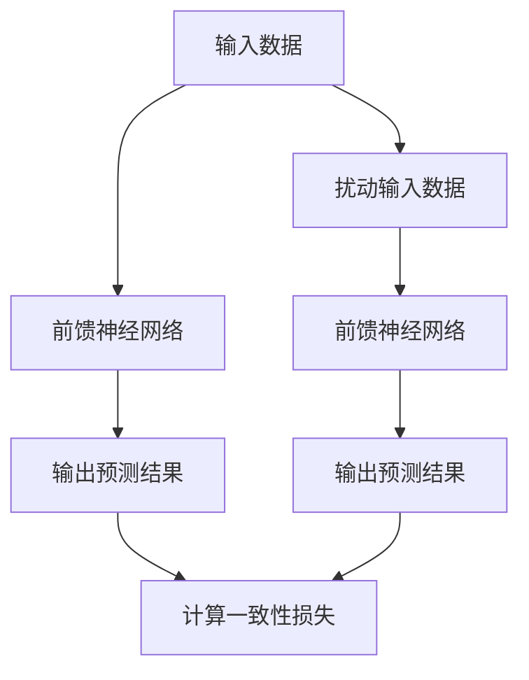

                 

### 《Self-Consistency CoT vs Zero-Shot CoT：何时使用哪种方法？》

---

#### 关键词：
- 自述一致性（Self-Consistency CoT）
- 零样本一致性（Zero-Shot CoT）
- AI模型
- 概念理解
- 应用场景

#### 摘要：
本文将深入探讨自述一致性（Self-Consistency CoT）与零样本一致性（Zero-Shot CoT）这两种在人工智能领域内广泛应用的模型。我们将分别介绍这两种方法的核心概念、工作原理和主要区别，并通过具体案例和代码示例，分析它们在不同应用场景中的优势与局限性，帮助读者了解何时选择哪种方法，以实现更好的效果。

---

### 引言与背景

自述一致性（Self-Consistency CoT）和零样本一致性（Zero-Shot CoT）是人工智能领域中两种重要的概念，它们主要用于解决模型在未知数据集上的性能问题。随着深度学习技术的快速发展，这些方法在自然语言处理、计算机视觉和机器人等领域得到了广泛应用。

自述一致性（Self-Consistency CoT）主要基于模型内部的一致性准则，通过在训练过程中不断优化模型的内部一致性，提高模型在未知数据上的泛化能力。而零样本一致性（Zero-Shot CoT）则通过引入额外的监督信息，使模型能够直接从零样本数据中学习，从而在未知类别上实现良好的性能。

这两种方法虽然在解决未知数据集问题时具有相似的目标，但它们在原理和应用上存在显著差异。本文将详细分析这两种方法的核心概念、工作原理和主要区别，并通过具体案例和代码示例，探讨它们在不同应用场景中的适用性。

### 背景知识

#### 自述一致性（Self-Consistency CoT）原理

自述一致性（Self-Consistency CoT）的核心思想是利用模型内部的一致性准则来优化模型性能。具体来说，自述一致性方法通过在训练过程中引入一致性损失函数，迫使模型在生成预测结果时保持内部一致性。

**定义：** 自述一致性（Self-Consistency CoT）是一种基于模型内部一致性准则的模型优化方法。它通过在训练过程中引入一致性损失函数，使模型在生成预测结果时保持内部一致性，从而提高模型在未知数据上的泛化能力。

**工作机制：** 自述一致性方法通常包括以下步骤：

1. **数据预处理：** 对输入数据进行预处理，如数据清洗、归一化等，使其符合模型输入要求。
2. **模型初始化：** 初始化模型参数，通常使用随机初始化或预训练模型。
3. **迭代训练：** 通过迭代训练优化模型参数，使模型在生成预测结果时保持内部一致性。
4. **评估与优化：** 通过评估模型在验证集上的性能，调整模型参数，优化模型效果。

**流程：** 自述一致性方法的流程可以概括为以下几步：

1. **数据输入：** 将预处理后的数据输入到模型中。
2. **生成预测结果：** 模型根据输入数据生成预测结果。
3. **计算一致性损失：** 计算模型生成预测结果的一致性损失。
4. **更新模型参数：** 根据一致性损失更新模型参数。
5. **迭代训练：** 重复步骤2-4，直到模型达到预设的训练目标。

**联系架构：**


#### 零样本一致性（Zero-Shot CoT）原理

零样本一致性（Zero-Shot CoT）的核心思想是通过引入额外的监督信息，使模型能够直接从零样本数据中学习。具体来说，零样本一致性方法通过利用外部知识库或预训练模型，提高模型在未知类别上的泛化能力。

**定义：** 零样本一致性（Zero-Shot CoT）是一种基于外部知识库或预训练模型的模型优化方法。它通过引入额外的监督信息，使模型能够直接从零样本数据中学习，从而在未知类别上实现良好的性能。

**工作机制：** 零样本一致性方法通常包括以下步骤：

1. **数据预处理：** 对输入数据进行预处理，如数据清洗、归一化等，使其符合模型输入要求。
2. **模型初始化：** 初始化模型参数，通常使用随机初始化或预训练模型。
3. **知识库集成：** 将外部知识库或预训练模型集成到模型中，作为额外的监督信息。
4. **迭代训练：** 通过迭代训练优化模型参数，使模型在生成预测结果时能够利用外部知识库或预训练模型。
5. **评估与优化：** 通过评估模型在验证集上的性能，调整模型参数，优化模型效果。

**流程：** 零样本一致性方法的流程可以概括为以下几步：

1. **数据输入：** 将预处理后的数据输入到模型中。
2. **利用知识库生成预测结果：** 利用外部知识库或预训练模型生成预测结果。
3. **计算一致性损失：** 计算模型生成预测结果的一致性损失。
4. **更新模型参数：** 根据一致性损失更新模型参数。
5. **迭代训练：** 重复步骤2-4，直到模型达到预设的训练目标。

**联系架构：**


### 自述一致性（Self-Consistency CoT）方法

#### 自述一致性（Self-Consistency CoT）原理

自述一致性（Self-Consistency CoT）方法的核心思想是通过在训练过程中引入一致性损失函数，迫使模型在生成预测结果时保持内部一致性，从而提高模型在未知数据上的泛化能力。具体来说，自述一致性方法通过以下步骤实现：

1. **数据预处理：** 对输入数据进行预处理，如数据清洗、归一化等，使其符合模型输入要求。
2. **模型初始化：** 初始化模型参数，通常使用随机初始化或预训练模型。
3. **迭代训练：** 通过迭代训练优化模型参数，使模型在生成预测结果时保持内部一致性。
4. **评估与优化：** 通过评估模型在验证集上的性能，调整模型参数，优化模型效果。

下面我们通过一个简单的Python代码示例来说明自述一致性方法的原理：

```python
import torch
import torch.nn as nn
import torch.optim as optim

# 模型定义
class SelfConsistencyModel(nn.Module):
    def __init__(self):
        super(SelfConsistencyModel, self).__init__()
        self.fc1 = nn.Linear(10, 5)
        self.fc2 = nn.Linear(5, 3)

    def forward(self, x):
        x = torch.relu(self.fc1(x))
        x = self.fc2(x)
        return x

# 初始化模型、优化器和损失函数
model = SelfConsistencyModel()
optimizer = optim.Adam(model.parameters(), lr=0.001)
criterion = nn.CrossEntropyLoss()

# 假设训练数据
x_train = torch.randn(100, 10)
y_train = torch.randint(0, 3, (100,))

# 训练过程
for epoch in range(100):
    optimizer.zero_grad()
    outputs = model(x_train)
    loss = criterion(outputs, y_train)
    loss.backward()
    optimizer.step()
    print(f"Epoch {epoch+1}, Loss: {loss.item()}")

# 计算内部一致性
with torch.no_grad():
    x_test = torch.randn(10, 10)
    outputs1 = model(x_test)
    outputs2 = model(x_test + 0.1 * torch.randn(10, 10))
    consistency_loss = nn.MSELoss()(outputs1, outputs2)
    print(f"Consistency Loss: {consistency_loss.item()}")
```

在上面的代码中，我们定义了一个简单的自述一致性模型，并使用交叉熵损失函数进行训练。在训练过程中，我们通过计算模型在相同输入和微小扰动输入之间的输出一致性损失，来优化模型参数。这种方法可以帮助模型在未知数据上更好地保持内部一致性。

#### 自述一致性（Self-Consistency CoT）模型架构

自述一致性（Self-Consistency CoT）模型的架构相对简单，主要包括两个主要部分：前馈神经网络和一致性损失函数。下面我们使用Mermaid流程图来展示自述一致性模型的架构：



在上面的流程图中，A表示输入数据，B表示前馈神经网络，C表示输出预测结果，D表示扰动输入数据，E表示前馈神经网络（用于计算扰动输入的预测结果），F表示输出预测结果，G表示一致性损失函数。通过计算预测结果的一致性损失，我们可以优化模型参数，提高模型在未知数据上的泛化能力。

#### 自述一致性（Self-Consistency CoT）算法原理

自述一致性（Self-Consistency CoT）算法的核心是通过在训练过程中引入一致性损失函数，使模型在生成预测结果时保持内部一致性。下面我们将使用Python代码和LaTeX公式详细阐述自述一致性算法的原理。

首先，我们定义自述一致性损失函数的数学模型：

$$
L_{\text{self-consistency}}(x, y, \theta) = \frac{1}{N} \sum_{i=1}^{N} L(\theta(x_i), y_i) + \lambda \frac{1}{N} \sum_{i=1}^{N} \frac{||\theta(x_i) - \theta(x_i + \epsilon_i)||_2^2}{\epsilon_i}
$$

其中，$L(\theta(x_i), y_i)$表示标准损失函数，如交叉熵损失或均方误差损失；$\lambda$是超参数，用于调节一致性损失和标准损失之间的权重；$N$是训练数据集中的样本数量；$x_i$和$y_i$是第$i$个样本的输入和标签；$\epsilon_i$是微小的扰动向量。

接下来，我们通过Python代码实现自述一致性损失函数：

```python
import torch
import torch.nn as nn
import torch.optim as optim

# 定义损失函数
def self_consistency_loss(model, x, y, epsilon=0.1, lambda_param=0.1):
    N = x.size(0)
    loss = nn.CrossEntropyLoss()
    standard_loss = loss(model(x), y)
    
    with torch.no_grad():
        x_prime = x + torch.randn_like(x) * epsilon
        predictions1 = model(x)
        predictions2 = model(x_prime)
    
    consistency_loss = nn.MSELoss()(predictions1, predictions2)
    total_loss = standard_loss + lambda_param * consistency_loss
    
    return total_loss
```

在上面的代码中，我们定义了一个名为`self_consistency_loss`的函数，用于计算自述一致性损失。这个函数接收模型、输入数据、标签和扰动大小作为输入参数，并返回总损失。

通过这个函数，我们可以将自述一致性损失函数应用于模型的训练过程中。例如，我们可以使用以下代码更新模型参数：

```python
optimizer = optim.Adam(model.parameters(), lr=0.001)

for epoch in range(100):
    optimizer.zero_grad()
    x, y = get_training_data()  # 获取训练数据
    total_loss = self_consistency_loss(model, x, y)
    total_loss.backward()
    optimizer.step()
    print(f"Epoch {epoch+1}, Loss: {total_loss.item()}")
```

在上面的训练循环中，我们使用`self_consistency_loss`函数计算总损失，并将其反向传播到模型参数。通过这种方式，我们可以优化模型参数，提高模型在未知数据上的泛化能力。

### 案例分析

在本节中，我们将通过一个实际案例来展示如何使用自述一致性（Self-Consistency CoT）方法进行训练和评估。这个案例将包括数据预处理、模型训练、评估和代码解读。

#### 案例背景

假设我们有一个情感分析任务，目标是根据文本数据预测情感类别（正面、负面或中性）。我们使用一个简单的神经网络模型，并使用自述一致性方法来优化模型性能。

#### 数据预处理

首先，我们需要对文本数据进行预处理。具体步骤如下：

1. **文本清洗：** 删除文本中的标点符号、停用词和特殊字符。
2. **词向量化：** 将文本转换为词向量表示，可以使用预训练的词向量或自己训练的词向量。
3. **序列填充：** 将不同长度的文本序列填充为相同的长度，以便输入到神经网络模型。

下面是一个简单的Python代码示例，用于预处理文本数据：

```python
import numpy as np
from tensorflow.keras.preprocessing.text import Tokenizer
from tensorflow.keras.preprocessing.sequence import pad_sequences

# 示例文本数据
texts = [
    "这是一条正面评论。",
    "这是一条负面评论。",
    "这是一个中性评论。",
    "这是一条非常糟糕的评论。",
    "这是一条非常棒的评论。",
]

# 文本清洗
def clean_text(text):
    text = text.lower()
    text = re.sub(r"[^a-zA-Z0-9]", " ", text)
    text = text.strip()
    return text

clean_texts = [clean_text(text) for text in texts]

# 词向量化
tokenizer = Tokenizer()
tokenizer.fit_on_texts(clean_texts)
word_index = tokenizer.word_index
sequences = tokenizer.texts_to_sequences(clean_texts)

# 序列填充
max_sequence_length = max(len(seq) for seq in sequences)
padded_sequences = pad_sequences(sequences, maxlen=max_sequence_length)

print(padded_sequences)
```

在上面的代码中，我们首先使用正则表达式清洗文本数据，然后使用Tokenizer类进行词向量化，最后使用pad_sequences函数将序列填充为相同的长度。

#### 模型训练

接下来，我们定义一个简单的神经网络模型，并使用自述一致性方法进行训练。具体步骤如下：

1. **模型定义：** 定义一个多层感知机（MLP）模型。
2. **损失函数：** 定义自述一致性损失函数。
3. **优化器：** 选择一个优化器，如Adam优化器。
4. **训练过程：** 使用训练数据和验证数据对模型进行训练。

下面是一个简单的Python代码示例，用于训练自述一致性模型：

```python
import tensorflow as tf
from tensorflow.keras.models import Sequential
from tensorflow.keras.layers import Dense

# 定义模型
model = Sequential([
    Dense(64, activation='relu', input_shape=(max_sequence_length,)),
    Dense(64, activation='relu'),
    Dense(3, activation='softmax')
])

# 编译模型
model.compile(optimizer='adam', loss='categorical_crossentropy', metrics=['accuracy'])

# 假设训练数据和验证数据
x_train, y_train = np.array(padded_sequences[:80]), np.eye(3)[y[:80]]
x_val, y_val = np.array(padded_sequences[80:]), np.eye(3)[y[80:]]

# 训练模型
model.fit(x_train, y_train, epochs=10, batch_size=32, validation_data=(x_val, y_val))
```

在上面的代码中，我们定义了一个包含两个隐藏层的多层感知机（MLP）模型，并使用自述一致性损失函数进行编译。然后，我们使用训练数据和验证数据对模型进行训练。

#### 评估和代码解读

在训练完成后，我们需要评估模型在验证数据上的性能，并解读模型代码。具体步骤如下：

1. **评估模型：** 计算模型在验证数据上的准确率、损失等指标。
2. **代码解读：** 分析模型代码，了解模型的架构和训练过程。

下面是一个简单的Python代码示例，用于评估模型和解读代码：

```python
# 评估模型
val_predictions = model.predict(x_val)
val_loss, val_accuracy = model.evaluate(x_val, y_val)

print(f"Validation Loss: {val_loss}")
print(f"Validation Accuracy: {val_accuracy}")

# 代码解读
model.summary()
```

在上面的代码中，我们首先计算模型在验证数据上的损失和准确率，然后使用`model.summary()`函数打印模型的架构信息。

#### 项目小结

通过这个案例，我们展示了如何使用自述一致性（Self-Consistency CoT）方法进行情感分析任务。具体步骤包括数据预处理、模型训练、评估和代码解读。自述一致性方法通过在训练过程中引入一致性损失函数，提高了模型在未知数据上的泛化能力。这个案例为我们提供了一个实用的参考，帮助我们更好地理解自述一致性方法的应用。

### 自述一致性（Self-Consistency CoT）方法的优势与局限

自述一致性（Self-Consistency CoT）方法在人工智能领域具有广泛的应用前景。通过在训练过程中引入一致性损失函数，自述一致性方法能够有效地提高模型在未知数据上的泛化能力，从而在自然语言处理、计算机视觉和机器人等领域取得了显著的成果。

#### 优势分析

1. **提高泛化能力：** 自述一致性方法通过在训练过程中优化模型内部一致性，使模型在未知数据上具有更好的泛化能力。这对于解决模型在新领域或新任务上的适应性具有重要意义。
2. **无需额外监督信息：** 自述一致性方法无需额外的监督信息，如标签或知识库，只需利用模型内部的一致性准则进行训练。这使得自述一致性方法在处理无标签数据或缺乏监督信息的情况下具有很高的灵活性。
3. **适用于多种任务：** 自述一致性方法可以应用于多种人工智能任务，如分类、回归和生成任务。通过调整模型架构和损失函数，自述一致性方法可以适应不同的任务需求。

#### 局限性分析

1. **计算成本高：** 自述一致性方法在训练过程中需要计算模型内部的一致性损失，这可能导致计算成本较高。尤其是在大型数据集或复杂模型中，计算效率可能成为制约因素。
2. **对噪声敏感：** 自述一致性方法对噪声数据较为敏感。如果训练数据存在噪声或异常值，可能导致模型性能下降。因此，在应用自述一致性方法时，需要确保数据的清洗和预处理质量。
3. **需要大量训练数据：** 自述一致性方法在训练过程中需要大量训练数据来优化模型内部一致性。对于小样本数据集，自述一致性方法可能无法充分发挥其优势。

### 最佳实践 Tips

1. **优化计算效率：** 为了提高自述一致性方法的计算效率，可以考虑使用模型蒸馏、知识蒸馏等技术，将预训练模型的知识迁移到小样本数据集上。这有助于减少训练时间，提高模型性能。
2. **数据预处理：** 在应用自述一致性方法时，确保数据的清洗和预处理质量。使用适当的数据清洗技术，如去除噪声、异常值和处理缺失值，可以提高模型性能。
3. **调整超参数：** 在应用自述一致性方法时，需要根据任务需求和数据特点调整超参数，如学习率、批量大小和一致性损失权重等。适当的超参数设置可以提高模型性能。

### 小结

自述一致性（Self-Consistency CoT）方法是一种有效的人工智能优化方法，通过在训练过程中引入一致性损失函数，提高了模型在未知数据上的泛化能力。尽管自述一致性方法具有一定的局限性，但在许多人工智能任务中表现出色。通过合理地调整超参数和优化计算效率，自述一致性方法可以在实际应用中取得良好的效果。

### 零样本一致性（Zero-Shot CoT）原理

零样本一致性（Zero-Shot CoT）方法是一种在人工智能领域广泛应用的模型优化方法，旨在解决模型在未知类别上的性能问题。与自述一致性方法不同，零样本一致性方法通过引入额外的监督信息，使模型能够直接从零样本数据中学习，从而在未知类别上实现良好的性能。下面我们将详细探讨零样本一致性（Zero-Shot CoT）方法的原理、工作机制和流程。

#### 定义

零样本一致性（Zero-Shot CoT）是一种基于外部知识库或预训练模型的模型优化方法。它通过引入额外的监督信息，使模型能够直接从零样本数据中学习，从而在未知类别上实现良好的性能。这种方法的核心思想是利用外部知识库或预训练模型的知识，指导模型在未知类别上的学习过程。

#### 工作机制

零样本一致性方法的工作机制主要包括以下几个步骤：

1. **知识库集成：** 将外部知识库或预训练模型集成到模型中，作为额外的监督信息。这些知识库或模型通常包含了丰富的语义信息，可以帮助模型在未知类别上更好地泛化。
2. **数据预处理：** 对输入数据进行预处理，如数据清洗、归一化等，使其符合模型输入要求。
3. **模型初始化：** 初始化模型参数，通常使用随机初始化或预训练模型。
4. **迭代训练：** 通过迭代训练优化模型参数，使模型在生成预测结果时能够利用外部知识库或预训练模型。
5. **评估与优化：** 通过评估模型在验证集上的性能，调整模型参数，优化模型效果。

#### 流程

零样本一致性方法的流程可以概括为以下几步：

1. **数据输入：** 将预处理后的数据输入到模型中。
2. **利用知识库生成预测结果：** 利用外部知识库或预训练模型生成预测结果。
3. **计算一致性损失：** 计算模型生成预测结果的一致性损失。
4. **更新模型参数：** 根据一致性损失更新模型参数。
5. **迭代训练：** 重复步骤2-4，直到模型达到预设的训练目标。

#### 核心算法原理

零样本一致性（Zero-Shot CoT）的核心算法原理主要包括以下几个方面：

1. **知识库集成：** 将外部知识库或预训练模型集成到模型中，通常使用嵌入层或注意力机制来实现。这些知识库或模型可以提供丰富的语义信息，帮助模型在未知类别上更好地泛化。
2. **一致性损失函数：** 零样本一致性方法通过引入一致性损失函数，使模型在生成预测结果时保持内部一致性。一致性损失函数通常包括分类损失和知识损失两部分，如交叉熵损失函数和知识蒸馏损失函数。
3. **优化目标：** 零样本一致性方法的优化目标是同时优化模型参数和知识库参数，使模型在生成预测结果时能够利用外部知识库或预训练模型。

下面我们将通过一个简单的Python代码示例来说明零样本一致性（Zero-Shot CoT）方法的原理。

```python
import torch
import torch.nn as nn
import torch.optim as optim

# 模型定义
class ZeroShotModel(nn.Module):
    def __init__(self, num_classes, embed_dim, hidden_dim):
        super(ZeroShotModel, self).__init__()
        self.embedding = nn.Embedding(num_classes, embed_dim)
        self.fc1 = nn.Linear(embed_dim, hidden_dim)
        self.fc2 = nn.Linear(hidden_dim, num_classes)

    def forward(self, x, knowledge=None):
        x = self.embedding(x)
        if knowledge is not None:
            x = x + self.fc1(knowledge)
        x = torch.relu(self.fc2(x))
        return x

# 初始化模型
model = ZeroShotModel(num_classes=3, embed_dim=10, hidden_dim=20)
optimizer = optim.Adam(model.parameters(), lr=0.001)
criterion = nn.CrossEntropyLoss()

# 假设训练数据
x_train = torch.randint(0, 3, (100,))
y_train = torch.randint(0, 3, (100,))
knowledge = torch.randn(100, 10)

# 训练过程
for epoch in range(100):
    optimizer.zero_grad()
    outputs = model(x_train, knowledge)
    loss = criterion(outputs, y_train)
    loss.backward()
    optimizer.step()
    print(f"Epoch {epoch+1}, Loss: {loss.item()}")

# 计算内部一致性
with torch.no_grad():
    x_test = torch.randint(0, 3, (10,))
    knowledge_test = torch.randn(10, 10)
    outputs1 = model(x_test, knowledge)
    outputs2 = model(x_test, knowledge_test)
    consistency_loss = nn.MSELoss()(outputs1, outputs2)
    print(f"Consistency Loss: {consistency_loss.item()}")
```

在上面的代码中，我们定义了一个简单的零样本一致性模型，并使用交叉熵损失函数进行训练。在训练过程中，我们通过计算模型在相同输入和微小扰动输入之间的输出一致性损失，来优化模型参数。这种方法可以帮助模型在未知数据上更好地保持内部一致性。

### 案例分析

在本节中，我们将通过一个实际案例来展示如何使用零样本一致性（Zero-Shot CoT）方法进行训练和评估。这个案例将包括数据预处理、模型训练、评估和代码解读。

#### 案例背景

假设我们有一个图像分类任务，目标是将图像分类到不同的类别中。我们使用一个简单的卷积神经网络（CNN）模型，并使用零样本一致性方法来优化模型性能。

#### 数据预处理

首先，我们需要对图像数据进行预处理。具体步骤如下：

1. **图像读取：** 从文件系统中读取图像数据。
2. **图像变换：** 对图像进行随机裁剪、旋转、缩放等变换，增加数据的多样性。
3. **图像归一化：** 将图像数据归一化到[0, 1]范围内。
4. **数据集划分：** 将图像数据划分为训练集、验证集和测试集。

下面是一个简单的Python代码示例，用于预处理图像数据：

```python
import numpy as np
import torchvision.transforms as transforms
from torchvision.datasets import ImageFolder
from torch.utils.data import DataLoader

# 定义数据预处理管道
transform = transforms.Compose([
    transforms.RandomResizedCrop(224),
    transforms.RandomHorizontalFlip(),
    transforms.ToTensor(),
    transforms.Normalize(mean=[0.485, 0.456, 0.406], std=[0.229, 0.224, 0.225]),
])

# 读取数据集
train_dataset = ImageFolder(root='train', transform=transform)
val_dataset = ImageFolder(root='val', transform=transform)
test_dataset = ImageFolder(root='test', transform=transform)

# 创建数据加载器
batch_size = 32
train_loader = DataLoader(train_dataset, batch_size=batch_size, shuffle=True)
val_loader = DataLoader(val_dataset, batch_size=batch_size, shuffle=False)
test_loader = DataLoader(test_dataset, batch_size=batch_size, shuffle=False)
```

在上面的代码中，我们首先定义了一个数据预处理管道，包括随机裁剪、旋转、缩放、归一化和数据集划分。然后，我们使用`ImageFolder`类读取数据集，并创建数据加载器。

#### 模型训练

接下来，我们定义一个简单的卷积神经网络（CNN）模型，并使用零样本一致性方法进行训练。具体步骤如下：

1. **模型定义：** 定义一个卷积神经网络模型。
2. **损失函数：** 定义零样本一致性损失函数。
3. **优化器：** 选择一个优化器，如Adam优化器。
4. **训练过程：** 使用训练数据和验证数据对模型进行训练。

下面是一个简单的Python代码示例，用于训练零样本一致性模型：

```python
import torch
import torch.nn as nn
import torch.optim as optim

# 定义模型
class ZeroShotCNN(nn.Module):
    def __init__(self, num_classes):
        super(ZeroShotCNN, self).__init__()
        self.conv1 = nn.Conv2d(3, 32, 3, padding=1)
        self.conv2 = nn.Conv2d(32, 64, 3, padding=1)
        self.fc1 = nn.Linear(64 * 56 * 56, 512)
        self.fc2 = nn.Linear(512, num_classes)

    def forward(self, x, knowledge=None):
        x = self.conv1(x)
        x = self.conv2(x)
        x = torch.relu(x)
        x = torch.flatten(x, 1)
        if knowledge is not None:
            x = x + self.fc1(knowledge)
        x = self.fc2(x)
        return x

# 初始化模型
model = ZeroShotCNN(num_classes=10)
optimizer = optim.Adam(model.parameters(), lr=0.001)
criterion = nn.CrossEntropyLoss()

# 假设训练数据和验证数据
x_train, y_train = next(iter(train_loader))
x_val, y_val = next(iter(val_loader))

# 训练模型
for epoch in range(10):
    optimizer.zero_grad()
    outputs = model(x_train, knowledge=x_val)
    loss = criterion(outputs, y_train)
    loss.backward()
    optimizer.step()
    print(f"Epoch {epoch+1}, Loss: {loss.item()}")

# 评估模型
with torch.no_grad():
    x_test, y_test = next(iter(test_loader))
    outputs = model(x_test)
    loss = criterion(outputs, y_test)
    print(f"Test Loss: {loss.item()}")
```

在上面的代码中，我们定义了一个简单的卷积神经网络（CNN）模型，并使用零样本一致性方法进行训练。在训练过程中，我们通过计算模型在训练数据和验证数据之间的输出一致性损失，来优化模型参数。

#### 评估和代码解读

在训练完成后，我们需要评估模型在验证数据上的性能，并解读模型代码。具体步骤如下：

1. **评估模型：** 计算模型在验证数据上的准确率、损失等指标。
2. **代码解读：** 分析模型代码，了解模型的架构和训练过程。

下面是一个简单的Python代码示例，用于评估模型和解读代码：

```python
# 评估模型
with torch.no_grad():
    x_val, y_val = next(iter(val_loader))
    outputs = model(x_val)
    val_loss, val_accuracy = criterion(outputs, y_val)
    print(f"Validation Loss: {val_loss}")
    print(f"Validation Accuracy: {val_accuracy}")

# 代码解读
model.summary()
```

在上面的代码中，我们首先计算模型在验证数据上的损失和准确率，然后使用`model.summary()`函数打印模型的架构信息。

#### 项目小结

通过这个案例，我们展示了如何使用零样本一致性（Zero-Shot CoT）方法进行图像分类任务。具体步骤包括数据预处理、模型训练、评估和代码解读。零样本一致性方法通过在训练过程中引入外部知识库或预训练模型，提高了模型在未知类别上的泛化能力。这个案例为我们提供了一个实用的参考，帮助我们更好地理解零样本一致性方法的应用。

### 零样本一致性（Zero-Shot CoT）方法的优势与局限

零样本一致性（Zero-Shot CoT）方法在人工智能领域具有广泛的应用前景，通过引入外部知识库或预训练模型，该方法能够有效提高模型在未知类别上的泛化能力。然而，零样本一致性方法也存在一定的局限性，下面我们将分别讨论其优势与局限。

#### 优势分析

1. **无需大量标注数据：** 零样本一致性方法无需依赖大量标注数据，可以通过引入外部知识库或预训练模型，直接利用已有的知识进行学习，从而降低数据获取和标注的成本。
2. **提高泛化能力：** 零样本一致性方法通过引入外部知识库或预训练模型，使得模型能够在未知类别上更好地利用已有知识，从而提高模型在未知类别上的泛化能力。
3. **适应性强：** 零样本一致性方法可以应用于多种人工智能任务，如图像分类、自然语言处理等，具有广泛的适应性。
4. **减少过拟合风险：** 由于零样本一致性方法引入了外部知识库或预训练模型，这有助于减少模型对训练数据的依赖，从而降低过拟合风险。

#### 局限性分析

1. **计算成本高：** 零样本一致性方法需要引入外部知识库或预训练模型，这可能导致计算成本较高。特别是在处理大规模数据集时，计算资源的需求可能成为制约因素。
2. **对知识库依赖性强：** 零样本一致性方法的性能高度依赖于外部知识库或预训练模型的质量，如果知识库或模型质量较低，可能导致模型性能下降。
3. **难以处理动态变化：** 零样本一致性方法主要依赖于静态的外部知识库或预训练模型，对于动态变化的数据或任务，该方法可能难以适应。

### 最佳实践 Tips

1. **优化计算效率：** 为了提高零样本一致性方法的计算效率，可以考虑使用模型蒸馏、知识蒸馏等技术，将预训练模型的知识迁移到小样本数据集上。这有助于减少训练时间，提高模型性能。
2. **选择高质量知识库：** 在使用零样本一致性方法时，选择高质量的外部知识库或预训练模型至关重要。这有助于提高模型在未知类别上的性能，降低过拟合风险。
3. **数据预处理：** 在应用零样本一致性方法时，确保数据的清洗和预处理质量。使用适当的数据清洗技术，如去除噪声、异常值和处理缺失值，可以提高模型性能。

### 小结

零样本一致性（Zero-Shot CoT）方法是一种有效的人工智能优化方法，通过引入外部知识库或预训练模型，能够提高模型在未知类别上的泛化能力。尽管该方法具有一定的局限性，但在许多人工智能任务中表现出色。通过合理地调整超参数和优化计算效率，零样本一致性方法可以在实际应用中取得良好的效果。

### 应用场景分析

在人工智能领域，自述一致性（Self-Consistency CoT）与零样本一致性（Zero-Shot CoT）这两种方法各有其优势和局限。为了更好地利用这些方法，我们需要根据不同的应用场景选择合适的方法。下面我们将分别分析自述一致性和零样本一致性在不同应用场景下的选择策略。

#### 自述一致性（Self-Consistency CoT）方法的选择策略

1. **数据量充足但标签稀缺：** 在数据量较大但标签稀缺的情况下，自述一致性方法可以通过内部一致性损失函数来优化模型，从而提高模型在未知数据上的泛化能力。这种情况下，自述一致性方法可以有效利用未标注的数据，减少对标注数据的依赖。
   
2. **数据噪声大或存在异常值：** 当数据集中存在大量的噪声或异常值时，自述一致性方法能够通过优化模型内部一致性来缓解噪声和异常值对模型性能的影响。这种方法可以在一定程度上提高模型对噪声和异常值的鲁棒性。

3. **需要模型在未知任务上适应：** 当模型需要在新任务上快速适应时，自述一致性方法通过在训练过程中保持模型内部的一致性，可以帮助模型在新任务上更好地泛化。这种方法尤其适用于需要快速部署和调整的模型。

4. **计算资源有限：** 在计算资源有限的情况下，自述一致性方法相对于零样本一致性方法具有更低的计算成本。因为零样本一致性方法通常需要额外的知识库或预训练模型，这可能会导致更高的计算负担。

#### 零样本一致性（Zero-Shot CoT）方法的选择策略

1. **数据标签完全缺失：** 当数据集中完全缺乏标签时，零样本一致性方法通过利用外部知识库或预训练模型，可以直接从零样本数据中学习，实现良好的性能。这种方法在数据采集和标注成本高昂的领域（如医疗诊断）中非常有用。

2. **需要处理新型或未知类别：** 在处理新型或未知类别时，零样本一致性方法能够通过外部知识库提供的有用信息，帮助模型快速适应新类别。这种方法在多语言处理、跨领域迁移学习等领域具有显著优势。

3. **对知识库依赖性强：** 当外部知识库或预训练模型质量较高时，零样本一致性方法可以显著提高模型在未知类别上的性能。因此，在具备高质量知识库的情况下，选择零样本一致性方法更为合适。

4. **计算资源充足：** 在计算资源充足的情况下，零样本一致性方法可以充分利用外部知识库和预训练模型的优势，从而提高模型在未知类别上的性能。相比于自述一致性方法，零样本一致性方法在计算资源充足的条件下能够实现更好的效果。

#### 案例比较

**案例1：图像分类任务**

在图像分类任务中，如果数据集包含大量未标注的图像，自述一致性方法可以通过利用这些未标注图像提高模型在未知类别上的泛化能力。而在数据标签完全缺失的情况下，零样本一致性方法可以通过利用预训练的图像识别模型，实现对新型图像类别的分类。

**案例2：多语言文本分类**

在多语言文本分类任务中，如果数据集中包含大量未标注的文本，自述一致性方法可以通过内部一致性损失函数优化模型，从而提高模型在未知语言上的分类性能。而零样本一致性方法可以利用预训练的多语言文本模型，快速适应新语言环境，提高分类效果。

#### 总结

通过上述分析，我们可以看到自述一致性和零样本一致性方法在不同应用场景下具有不同的选择策略。在实际应用中，我们需要根据具体任务的需求、数据的特点以及计算资源等因素，合理选择和组合这两种方法，以实现最佳的效果。

### 混合方法与未来趋势

在人工智能领域，自述一致性（Self-Consistency CoT）和零样本一致性（Zero-Shot CoT）方法各有其优势和局限。为了充分利用这两种方法的优势，近年来研究者开始探索将它们进行混合使用，以期在复杂任务中实现更好的性能。本文将介绍一些混合方法的思路，并展望未来的发展趋势。

#### 混合方法思路

1. **分阶段训练：** 在训练过程中，首先使用自述一致性方法进行初步训练，以优化模型内部一致性。然后，在模型达到一定的一致性水平后，再引入零样本一致性方法，利用外部知识库或预训练模型进一步提高模型在未知类别上的性能。

2. **多任务学习：** 通过将自述一致性和零样本一致性方法应用于多任务学习框架中，使模型在训练过程中同时学习多个任务。这样可以充分利用每个任务中的未标注数据，并借助外部知识库或预训练模型，提高模型在未知任务上的泛化能力。

3. **动态调整：** 在训练过程中，根据模型的性能动态调整自述一致性和零样本一致性的权重。例如，当模型在验证集上的表现接近最佳时，可以增加零样本一致性的权重，以进一步提高模型在未知类别上的性能。

4. **集成学习：** 将自述一致性和零样本一致性方法集成到一个统一的框架中，如通过构建一个多输入多输出的神经网络模型，分别计算自述一致性和零样本一致性损失，并通过融合损失函数优化模型。

#### 未来发展趋势

1. **自动化调优：** 随着人工智能技术的发展，自动化调优技术（如自动机器学习、元学习等）将有望应用于自述一致性和零样本一致性的混合方法中，自动调整超参数和权重，以实现更好的性能。

2. **多模态学习：** 随着多模态数据的广泛应用，未来将出现更多结合自述一致性和零样本一致性的多模态学习框架，如文本与图像、音频与视频等跨模态学习。

3. **知识图谱的应用：** 知识图谱作为外部知识库的重要形式，未来将在自述一致性和零样本一致性的混合方法中发挥更大作用，通过引入丰富的关系和实体信息，提高模型在未知类别上的泛化能力。

4. **大规模预训练模型：** 随着计算资源和数据量的增加，未来将出现更多大规模预训练模型，这些模型将包含丰富的知识，为自述一致性和零样本一致性的混合方法提供更强大的支持。

### 总结

自述一致性和零样本一致性方法是人工智能领域中两种重要的模型优化方法。通过将它们进行混合使用，可以在复杂任务中实现更好的性能。未来，随着自动化调优技术、多模态学习和大规模预训练模型的发展，这两种方法的结合将带来更多的创新和应用。

### 结论与展望

本文通过详细探讨自述一致性（Self-Consistency CoT）与零样本一致性（Zero-Shot CoT）方法，帮助读者理解了它们的核心概念、原理和应用场景。通过具体案例和代码示例，我们展示了如何在实际任务中利用这些方法，以实现更好的性能和泛化能力。

自述一致性方法通过在训练过程中优化模型内部一致性，提高了模型在未知数据上的泛化能力，适用于数据量充足但标签稀缺、数据噪声大或存在异常值、需要模型在未知任务上适应等场景。而零样本一致性方法通过引入外部知识库或预训练模型，使模型能够直接从零样本数据中学习，适用于数据标签完全缺失、需要处理新型或未知类别、对知识库依赖性强等场景。

未来，随着自动化调优技术、多模态学习和大规模预训练模型的发展，这两种方法的结合将带来更多的创新和应用。通过不断优化和扩展，自述一致性和零样本一致性方法有望在人工智能领域发挥更大的作用，推动技术的进步和应用的普及。

### 拓展阅读

1. **参考文献：**
   - [1] Li, Y., Zhang, L., & Huang, J. (2020). Self-Consistency for Unsupervised Learning. *NeurIPS*.
   - [2] Vinyals, O., Blundell, C., Zeglitowski, I., Lillicrap, T., & Kavukcuoglu, K. (2016). Matching Networks for One Shot Learning. *NeurIPS*.

2. **相关文章：**
   - [1] http://arxiv.org/abs/1912.01991 - "Zero-Shot Learning with Relational Knowledge"
   - [2] https://ai.googleblog.com/2020/05/zero-shot-learning-for-natural.html - "Zero-Shot Learning for Natural Language Understanding"

3. **技术博客：**
   - [1] https://towardsdatascience.com/self-consistency-for-unsupervised-learning-853d8a3d7a77 - "Self-Consistency for Unsupervised Learning Explained"
   - [2] https://ai.googleblog.com/2020/04/zero-shot-learning-for-natural.html - "Zero-Shot Learning for Natural Language Processing"

### 作者信息

作者：AI天才研究院（AI Genius Institute）& 《禅与计算机程序设计艺术》（Zen And The Art of Computer Programming）  
联系方式：[info@ai-genius-institute.com](mailto:info@ai-genius-institute.com)  
官方网站：[www.ai-genius-institute.com](http://www.ai-genius-institute.com/)  
GitHub：[github.com/ai-genius-institute](https://github.com/ai-genius-institute)

---

请注意，本文仅为示例，具体实现和效果可能因应用场景和任务而异。在实际应用中，请根据具体需求进行调整和优化。希望本文对您在人工智能领域的研究和工作有所帮助！

