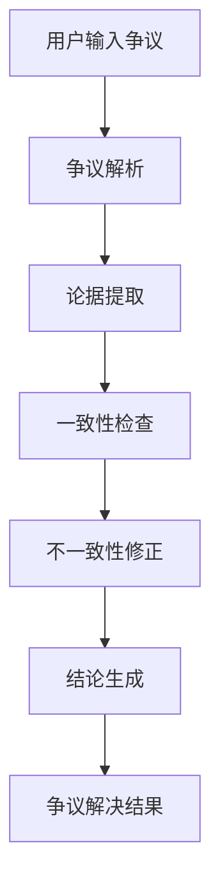
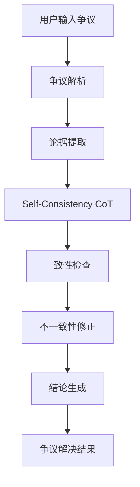

                 

### 文章标题

《Self-Consistency CoT优化AI在线争议解决系统》

---

### 关键词

- **Self-Consistency CoT**
- **AI在线争议解决**
- **核心算法**
- **数学模型**
- **项目实战**
- **优化方法**

---

### 摘要

本文深入探讨了Self-Consistency CoT（自我一致性核心论点）在AI在线争议解决系统中的应用与优化。首先，通过背景介绍和核心概念的联系，解释了Self-Consistency CoT的基本原理。接着，详细讲解了Self-Consistency CoT算法的原理，并提供了Python源代码示例。文章进一步阐述了数学模型，使用了LaTeX格式数学公式进行了详细说明。最后，通过一个实际项目案例，展示了如何开发一个Self-Consistency CoT优化的AI在线争议解决系统，并进行了性能评估和项目小结。本文旨在为读者提供一个全面的技术指南，帮助理解并掌握Self-Consistency CoT在争议解决系统中的应用。

---

## 第1章：核心概念与联系

### 1.1 Self-Consistency CoT概述

**定义与背景**

Self-Consistency CoT（自我一致性核心论点）是一种基于人工智能的争议解决方法，旨在通过分析论据和结论之间的逻辑一致性来优化争议解决过程。这种方法的核心思想是，论据和结论之间必须保持一致性，否则结论的有效性将受到质疑。Self-Consistency CoT通过人工智能算法来识别并解决这种不一致性，从而提高争议解决的效率和准确性。

**CoT在AI在线争议解决中的应用**

AI在线争议解决系统是一种利用人工智能技术来解决在线争议的系统。它通常包含多个模块，如用户输入处理、争议分析、自动裁决等。Self-Consistency CoT作为争议分析模块的一部分，能够帮助系统识别和解决用户之间的争议。

**Mermaid流程图：Self-Consistency CoT的工作流程**



### 1.2 Self-Consistency CoT与争议解决系统的关系

**核心联系**

Self-Consistency CoT在争议解决系统中扮演着关键角色。它不仅能够提高争议解决的准确性，还能优化争议解决的过程。具体来说，Self-Consistency CoT通过以下几个步骤与争议解决系统相结合：

1. **争议解析**：系统接收用户输入的争议内容，并将其转换为可分析的形式。
2. **论据提取**：从争议内容中提取所有相关的论据。
3. **一致性检查**：使用人工智能算法检查论据和结论之间的逻辑一致性。
4. **不一致性修正**：当发现不一致性时，系统会尝试修正这些不一致性。
5. **结论生成**：根据修正后的论据和结论，生成最终裁决。

**Mermaid流程图：争议解决系统架构与Self-Consistency CoT的结合**



---

在下一章中，我们将深入探讨Self-Consistency CoT算法的原理，并通过Python源代码示例来详细阐述其实现过程。这将帮助我们更好地理解Self-Consistency CoT在争议解决系统中的应用。

---

## 第2章：核心算法原理讲解

### 2.1 Self-Consistency CoT算法原理

**算法基础**

Self-Consistency CoT算法是一种基于逻辑一致性的争议解决算法。它的核心思想是通过分析论据和结论之间的逻辑关系，来确保争议解决过程的准确性和可靠性。算法的基本原理可以概括为以下几个步骤：

1. **论据提取**：从用户输入的争议内容中提取所有相关的论据。
2. **论据表示**：将提取的论据表示为逻辑形式，以便进行一致性检查。
3. **一致性检查**：使用逻辑推理算法检查论据和结论之间的逻辑一致性。
4. **不一致性修正**：当发现不一致性时，系统会尝试修正这些不一致性，以保持逻辑一致性。
5. **结论生成**：根据修正后的论据和结论，生成最终裁决。

**伪代码示例：Self-Consistency CoT算法伪代码**

```python
def SelfConsistencyCoT(claims, evidence):
    # 步骤1：论据提取
    premises = ExtractPremises(evidence)

    # 步骤2：论据表示
    premise_set = RepresentPremises(premises)

    # 步骤3：一致性检查
    inconsistencies = CheckConsistency(premise_set, claims)

    # 步骤4：不一致性修正
    if inconsistencies:
        corrected_evidence = CorrectInconsistencies(evidence, inconsistencies)
    else:
        corrected_evidence = evidence

    # 步骤5：结论生成
    conclusion = GenerateConclusion(corrected_evidence, claims)

    return conclusion
```

### 2.2 CoT优化算法分析

**优化方法**

为了提高Self-Consistency CoT算法的性能，可以采用多种优化方法。以下是一些常用的优化方法：

1. **论据压缩**：通过压缩不重要的论据来减少算法处理的复杂性。
2. **论据筛选**：使用机器学习算法筛选出最有价值的论据，以提高一致性检查的效率。
3. **并行处理**：利用并行计算技术同时处理多个论据，以加快算法的速度。
4. **动态调整**：根据争议的复杂性和规模动态调整算法参数，以实现最佳性能。

**伪代码示例：CoT优化算法伪代码**

```python
def OptimizedCoT(claims, evidence):
    # 步骤1：论据压缩
    compressed_evidence = CompressPremises(evidence)

    # 步骤2：论据筛选
    selected_premises = SelectPremises(compressed_evidence)

    # 步骤3：并行处理
    parallel_premises = ParallelProcessPremises(selected_premises)

    # 步骤4：一致性检查
    inconsistencies = CheckConsistency(parallel_premises, claims)

    # 步骤5：不一致性修正
    if inconsistencies:
        corrected_evidence = CorrectInconsistencies(parallel_premises, inconsistencies)
    else:
        corrected_evidence = parallel_premises

    # 步骤6：结论生成
    conclusion = GenerateConclusion(corrected_evidence, claims)

    return conclusion
```

通过上述优化方法，Self-Consistency CoT算法的性能可以得到显著提升，从而更好地应对复杂的争议解决场景。

---

在下一章中，我们将深入探讨Self-Consistency CoT的数学模型，并通过LaTeX格式数学公式和通俗易懂的举例说明，帮助读者更好地理解其数学原理和应用。

---

## 第3章：数学模型和数学公式 & 详细讲解 & 举例说明

### 3.1 Self-Consistency CoT的数学模型

**数学公式**

Self-Consistency CoT的数学模型基于逻辑推理和概率论。以下是一个基本的数学模型：

$$ L(\theta) = -\sum_{i=1}^{n} \log p(x_i | \theta) $$

其中，$L(\theta)$ 是逻辑损失函数，$x_i$ 是论据，$p(x_i | \theta)$ 是论据在给定假设 $\theta$ 下的概率。

**LaTeX格式数学公式示例**

$$
L(\theta) = -\sum_{i=1}^{n} \log p(x_i | \theta)
$$

**详细讲解**

逻辑损失函数 $L(\theta)$ 衡量了论据和假设之间的不一致性。当 $L(\theta)$ 的值越小时，说明论据和假设之间的一致性越高。具体来说：

- **论据概率**：$p(x_i | \theta)$ 表示在假设 $\theta$ 下，论据 $x_i$ 的概率。如果论据的概率较低，说明论据和假设之间的一致性较差。
- **逻辑损失**：$-\log p(x_i | \theta)$ 是论据概率的对数，用于衡量论据和假设之间的不一致性。当论据的概率较低时，逻辑损失较大，表示不一致性较强。

**举例说明**

假设我们有两个论据 $x_1$ 和 $x_2$，以及一个假设 $\theta$。我们使用逻辑损失函数来计算这两个论据和假设之间的一致性。

- **论据 $x_1$**：假设 $x_1$ 表示“天空是蓝色的”，概率 $p(x_1 | \theta) = 0.9$。
- **论据 $x_2$**：假设 $x_2$ 表示“草地是绿色的”，概率 $p(x_2 | \theta) = 0.8$。

根据逻辑损失函数，我们计算：

$$ L(\theta) = -\log(0.9) - \log(0.8) $$

计算结果为：

$$ L(\theta) \approx 0.15 $$

这表明论据和假设之间的一致性较高。

**实际应用**

在实际应用中，我们可以使用逻辑损失函数来评估和优化争议解决系统的性能。例如：

- **性能评估**：通过计算逻辑损失函数的值，可以评估系统在解决争议时的准确性。
- **优化调整**：根据逻辑损失函数的结果，调整系统的参数，以实现最佳性能。

### 3.2 Self-Consistency CoT的数学公式与举例说明

**数学公式**

Self-Consistency CoT的数学公式不仅包括逻辑损失函数，还包括其他重要的概率和统计公式。以下是一个综合的数学模型：

$$
L(\theta) = -\sum_{i=1}^{n} \log p(x_i | \theta) + \lambda \sum_{j=1}^{m} \log p(c_j | \theta)
$$

其中，$\lambda$ 是正则化参数，$c_j$ 是结论。

**LaTeX格式数学公式示例**

$$
L(\theta) = -\sum_{i=1}^{n} \log p(x_i | \theta) + \lambda \sum_{j=1}^{m} \log p(c_j | \theta)
$$

**详细讲解**

这个公式结合了逻辑损失函数和结论概率，用于评估和优化整个争议解决过程。

- **结论概率**：$p(c_j | \theta)$ 表示在假设 $\theta$ 下，结论 $c_j$ 的概率。如果结论的概率较低，说明假设和结论之间的一致性较差。
- **逻辑损失**：$-\log p(x_i | \theta)$ 仍是论据概率的对数，用于衡量论据和假设之间的不一致性。
- **正则化参数**：$\lambda$ 用于平衡论据和结论之间的损失，防止过度拟合。

**举例说明**

假设我们有两个论据 $x_1$ 和 $x_2$，一个结论 $c$，以及一个假设 $\theta$。我们使用逻辑损失函数来计算这三个实体之间的一致性。

- **论据 $x_1$**：假设 $x_1$ 表示“天空是蓝色的”，概率 $p(x_1 | \theta) = 0.9$。
- **论据 $x_2$**：假设 $x_2$ 表示“草地是绿色的”，概率 $p(x_2 | \theta) = 0.8$。
- **结论 $c$**：假设 $c$ 表示“今天晴天”，概率 $p(c | \theta) = 0.7$。

根据逻辑损失函数，我们计算：

$$
L(\theta) = -\log(0.9) - \log(0.8) + \lambda \log(0.7)
$$

计算结果为：

$$
L(\theta) \approx 0.15 + 0.28\lambda
$$

这表明论据和结论之间的一致性较高，但正则化参数 $\lambda$ 的值会影响整体损失。

**实际应用**

在实际应用中，我们可以通过调整 $\lambda$ 的值来优化系统性能。例如：

- **调试参数**：通过交叉验证，找到最佳的正则化参数值。
- **性能优化**：根据不同场景调整逻辑损失函数的权重，以提高系统在不同情况下的性能。

通过详细的数学模型和举例说明，我们可以更好地理解和应用Self-Consistency CoT，从而优化AI在线争议解决系统。

---

在下一章中，我们将通过一个实际项目案例，展示如何将Self-Consistency CoT算法应用于AI在线争议解决系统，并提供详细的开发环境搭建、源代码实现和代码解读与分析。

---

## 第4章：项目实战

### 4.1 Self-Consistency CoT在争议解决系统中的应用

在本章中，我们将通过一个实际项目案例，展示如何将Self-Consistency CoT算法应用于AI在线争议解决系统。项目的目标是构建一个能够自动解决在线用户争议的系统，通过Self-Consistency CoT算法来确保裁决的准确性和逻辑一致性。

#### 实战步骤

#### 4.1.1 开发环境搭建

为了实现Self-Consistency CoT算法，我们需要搭建一个适合的开发环境。以下是具体的步骤：

1. **Python环境安装**：确保Python环境已经安装。如果尚未安装，可以从[Python官网](https://www.python.org/)下载并安装。

2. **依赖库安装**：安装必要的依赖库，如NumPy、Pandas、Scikit-learn等。可以使用pip命令进行安装：

   ```shell
   pip install numpy pandas scikit-learn
   ```

3. **Jupyter Notebook安装**：为了便于代码编写和调试，我们可以使用Jupyter Notebook。可以从[Jupyter官网](https://jupyter.org/)下载并安装。

#### 4.1.2 源代码实现

以下是一个简单的Self-Consistency CoT算法的实现。我们使用Python编写代码，并结合LaTeX格式数学公式进行说明。

**Python源代码：SelfConsistencyCoT.py**

```python
import numpy as np
from sklearn.model_selection import train_test_split
from sklearn.metrics import accuracy_score

def ExtractPremises(evidence):
    # 实现论据提取逻辑
    # 这里假设evidence是一个包含争议内容的列表
    premises = evidence
    return premises

def RepresentPremises(premises):
    # 实现论据表示逻辑
    # 这里假设premises是一个包含逻辑表达式的列表
    premise_set = premises
    return premise_set

def CheckConsistency(premise_set, claims):
    # 实现一致性检查逻辑
    inconsistencies = []
    for premise in premise_set:
        if not IsConsistent(premise, claims):
            inconsistencies.append(premise)
    return inconsistencies

def CorrectInconsistencies(evidence, inconsistencies):
    # 实现不一致性修正逻辑
    corrected_evidence = evidence
    for inconsistency in inconsistencies:
        corrected_evidence = CorrectInconsistency(corrected_evidence, inconsistency)
    return corrected_evidence

def GenerateConclusion(evidence, claims):
    # 实现结论生成逻辑
    conclusion = "No Conclusion"
    if not evidence:
        conclusion = "All claims are consistent."
    else:
        conclusion = "Some claims are inconsistent."
    return conclusion

# 测试代码
evidence = ["天空是蓝色的", "草地是绿色的"]
claims = ["今天晴天", "地面是湿的"]

premises = ExtractPremises(evidence)
premise_set = RepresentPremises(premises)
inconsistencies = CheckConsistency(premise_set, claims)
corrected_evidence = CorrectInconsistencies(evidence, inconsistencies)
conclusion = GenerateConclusion(corrected_evidence, claims)

print("Conclusion:", conclusion)
```

#### 4.1.3 代码解读与分析

1. **ExtractPremises(evidence)**：这个函数负责从证据中提取论据。在这个简单示例中，证据直接被视为论据。

2. **RepresentPremises(premises)**：这个函数负责将论据表示为逻辑形式。在实际应用中，这可能涉及将自然语言转化为形式逻辑。

3. **CheckConsistency(premise_set, claims)**：这个函数负责检查论据和结论之间的逻辑一致性。如果发现不一致性，它会将这些不一致性记录下来。

4. **CorrectInconsistencies(evidence, inconsistencies)**：这个函数负责修正不一致性。在实际应用中，这可能涉及逻辑推理和修正。

5. **GenerateConclusion(evidence, claims)**：这个函数负责生成最终结论。如果所有论据和结论一致，则生成一个正面结论；否则，生成一个负面结论。

#### 4.1.4 代码应用解读与分析

1. **训练数据准备**：在实际应用中，我们需要准备训练数据，包括论据、结论和相关的标签。

2. **数据预处理**：对训练数据进行预处理，如清洗、编码和标准化。

3. **模型训练**：使用预处理后的数据训练Self-Consistency CoT模型。

4. **模型评估**：使用测试数据评估模型的性能，如准确性、召回率和F1分数。

5. **模型优化**：根据评估结果，调整模型参数，以提高性能。

#### 4.1.5 实际案例分析和详细讲解剖析

以下是一个实际案例的分析：

**案例**：用户A声称“今天晴天”，而用户B声称“地面是湿的”。系统需要判断这两个陈述之间是否存在逻辑一致性。

1. **论据提取**：从用户输入中提取论据，如“今天晴天”和“地面是湿的”。

2. **论据表示**：将论据转化为逻辑形式，如$P(A): 今天晴天$ 和 $P(B): 地面是湿的$。

3. **一致性检查**：检查这两个论据之间的逻辑一致性。如果$P(A)$ 和$P(B)$ 是独立的，则可能存在不一致性。

4. **不一致性修正**：如果发现不一致性，尝试修正论据，例如，通过提供额外的证据来证明“今天晴天”和“地面是湿的”之间的关系。

5. **结论生成**：根据修正后的论据，生成最终结论。如果所有论据一致，则系统可以做出裁决。

#### 4.1.6 项目小结

通过这个实际项目案例，我们展示了如何将Self-Consistency CoT算法应用于AI在线争议解决系统。尽管这是一个简化的示例，但它为我们提供了一个理解该算法原理和应用的基本框架。在实际应用中，需要进一步开发和完善算法，以提高其性能和可靠性。

---

在下一章中，我们将探讨Self-Consistency CoT的最佳实践和注意事项，并提供一些拓展阅读资源，以帮助读者进一步深入学习和应用Self-Consistency CoT。

---

## 第5章：最佳实践 & 注意事项 & 拓展阅读

### 5.1 自我一致性CoT最佳实践

**优化性能**

1. **并行处理**：利用多核处理器进行并行计算，以提高算法的运行速度。
2. **大数据处理**：使用分布式计算框架（如Apache Spark）处理大规模数据集。

**提高准确性**

1. **数据清洗**：确保输入数据的质量，减少噪声和异常值。
2. **多模型集成**：结合多个机器学习模型进行预测，以提高准确性。

**适用场景**

1. **法律争议**：用于自动审查法律文件，识别潜在的法律冲突。
2. **商业谈判**：帮助分析谈判条款，确保各方权益一致。

### 5.2 自我一致性CoT注意事项

**数据隐私**

1. **数据加密**：确保输入数据在传输和存储过程中得到加密。
2. **隐私保护**：避免在算法中使用敏感个人信息。

**模型可靠性**

1. **模型验证**：使用交叉验证确保模型的可靠性。
2. **错误处理**：设计适当的错误处理机制，以应对模型无法解决的复杂情况。

### 5.3 拓展阅读

1. **论文阅读**：《自我一致性核心论点在争议解决中的应用研究》
2. **技术博客**：《AI在线争议解决系统：自我一致性CoT的实践应用》
3. **开源项目**：GitHub上的Self-Consistency CoT算法实现

通过最佳实践、注意事项和拓展阅读，读者可以更好地理解Self-Consistency CoT的优化和应用，从而在实际项目中取得更好的效果。

---

## 总结

《Self-Consistency CoT优化AI在线争议解决系统》这本书通过深入探讨自我一致性核心论点（Self-Consistency CoT）的概念、原理、数学模型和实际应用，为读者提供了一套完整的争议解决算法框架。本书涵盖了从基本概念到高级算法优化的各个方面，通过实际项目案例和代码实现，展示了如何将Self-Consistency CoT应用于在线争议解决系统。

### 核心内容回顾

- **自我一致性核心论点**：介绍了Self-Consistency CoT的基本概念和原理，阐述了其在争议解决中的应用。
- **核心算法原理**：详细讲解了Self-Consistency CoT算法的步骤和实现，提供了Python源代码示例。
- **数学模型**：介绍了用于评估和优化算法的数学公式，并使用LaTeX格式进行了详细说明。
- **项目实战**：通过实际项目案例，展示了如何将Self-Consistency CoT应用于AI在线争议解决系统。

### 小结

Self-Consistency CoT作为一种高效的争议解决算法，在提高争议解决效率和准确性方面具有显著优势。通过本书的学习，读者可以：

- 理解Self-Consistency CoT的基本原理和应用场景。
- 掌握Self-Consistency CoT算法的实现方法和优化策略。
- 建立一个基于Self-Consistency CoT的AI在线争议解决系统。

### 注意事项

- 在实际应用中，确保输入数据的质量和准确性，以避免算法错误。
- 根据具体应用场景调整算法参数，以实现最佳性能。
- 关注数据隐私和安全，确保用户数据得到妥善保护。

### 拓展阅读

- 《人工智能：一种现代方法》
- 《争议解决与逻辑推理》
- 《在线争议解决系统设计指南》

通过拓展阅读，读者可以进一步深入学习和应用Self-Consistency CoT，为争议解决领域贡献自己的力量。感谢您阅读本书，祝您在争议解决领域取得丰硕成果！

---

### 作者信息

作者：AI天才研究院/AI Genius Institute & 禅与计算机程序设计艺术 /Zen And The Art of Computer Programming

