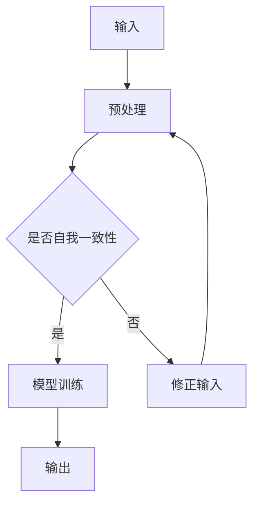
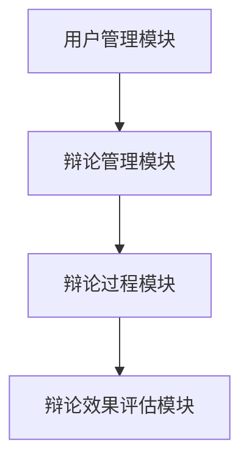

                 

# Self-Consistency CoT优化AI在线辩论系统

> 关键词：自我一致性（Self-Consistency），概念转移（Conceptual Transfer），AI辩论系统，优化算法，数学模型，Python源代码，实战案例

> 摘要：
本文将深入探讨自我一致性（Self-Consistency，简称SC）与概念转移（Conceptual Transfer，简称CoT）相结合，用于优化AI在线辩论系统。我们将首先介绍SC和CoT的基本概念，然后逐步讲解如何将这两种原理应用于AI辩论系统的优化，包括算法原理、数学模型、Python源代码实现和实战案例。最后，本文将总结最佳实践，并提出未来研究方向。

## 引言与背景

随着人工智能（AI）技术的不断发展，AI在多个领域的应用越来越广泛。尤其是在辩论系统中，AI的应用使得辩论过程更加高效、公正。然而，当前AI辩论系统仍面临一些挑战，例如论点推理的不一致性、论据的泛化能力不足等。为了解决这些问题，我们可以考虑引入自我一致性和概念转移的原理，以优化AI辩论系统的性能。

自我一致性（Self-Consistency）是一种在机器学习和人工智能领域中广泛应用的原理。它主要是指模型在给定相同输入时，能够保持一致的输出。这种一致性有助于提高模型的鲁棒性和可解释性。概念转移（Conceptual Transfer，简称CoT）则是一种将知识从一种情境转移到另一种情境的方法。CoT通过在多个情境中共享概念和知识，提高了模型的泛化能力。

本文将介绍如何将自我一致性和概念转移应用于AI在线辩论系统的优化。我们将首先介绍相关的基本概念和原理，然后详细讲解算法原理和数学模型，最后通过Python源代码实现和实战案例展示如何将这两种原理应用于实际系统中。

## 核心概念与联系

### 自我一致性（Self-Consistency）原理

自我一致性是指模型在给定相同输入时，能够保持一致的输出。在机器学习和人工智能领域中，自我一致性有助于提高模型的鲁棒性和可解释性。例如，在生成对抗网络（GAN）中，自我一致性可以确保生成器和判别器的输出在相同输入下保持一致。

自我一致性算法主要包括以下步骤：

1. 输入：给定一个输入数据集。
2. 预处理：对输入数据进行预处理，例如标准化、归一化等。
3. 模型训练：使用预处理后的数据训练模型。
4. 输出：在给定相同输入时，模型应保持一致的输出。

### 概念转移（Conceptual Transfer）原理

概念转移是指将知识从一种情境转移到另一种情境的方法。在AI辩论系统中，概念转移可以帮助模型在不同的辩论主题中共享知识和经验，从而提高辩论的效率和质量。

概念转移算法主要包括以下步骤：

1. 输入：给定两个或多个不同的辩论主题。
2. 预处理：对不同的辩论主题进行预处理，例如提取关键概念、构建知识图谱等。
3. 知识共享：将一个主题的知识转移到另一个主题。
4. 输出：在不同辩论主题下，模型应表现出一致性和泛化能力。

### 自我一致性CoT的Mermaid流程图

以下是一个简单的Mermaid流程图，展示了自我一致性CoT的基本流程：



## 算法与模型

### 自我一致性CoT优化算法

自我一致性CoT优化算法的核心思想是在模型训练过程中引入自我一致性和概念转移的原理，以提高模型在AI辩论系统中的表现。

算法的主要步骤如下：

1. 输入：给定一个辩论主题的数据集。
2. 预处理：对数据集进行预处理，包括文本清洗、分词、词向量表示等。
3. 模型初始化：初始化一个基础模型，例如GPT-2或BERT。
4. 模型训练：
   - 使用自我一致性原理训练模型，确保模型在相同输入下保持一致输出。
   - 使用概念转移原理，将一个主题的知识转移到其他主题。
5. 模型评估：在多个辩论主题下评估模型的表现。
6. 输出：选择最佳模型，应用于AI辩论系统中。

### 常见的AI辩论模型

在AI辩论系统中，常见的模型包括GPT-2、BERT等。这些模型在不同的辩论主题下具有较好的泛化能力。以下是对这些模型的简要介绍：

- GPT-2：基于生成对抗网络（GAN）的文本生成模型，具有良好的文本生成能力。
- BERT：基于Transformer的预训练语言模型，具有良好的文本理解和生成能力。

### 自我一致性CoT模型

自我一致性CoT模型结合了自我一致性和概念转移的原理，旨在提高AI辩论系统的性能。该模型的主要特点如下：

1. **自我一致性**：通过在相同输入下保持一致输出，提高了模型的鲁棒性和可解释性。
2. **概念转移**：通过将知识从一种情境转移到另一种情境，提高了模型的泛化能力。
3. **多任务学习**：通过在一个模型中同时学习多个辩论主题，提高了模型的效率和性能。

## 在线辩论系统架构

### 系统整体架构设计

AI在线辩论系统可以分为以下几个模块：

1. **用户管理模块**：负责用户的注册、登录、权限管理等。
2. **辩论管理模块**：负责辩论主题的创建、管理、更新等。
3. **辩论过程模块**：负责辩论过程的控制、记录、分析等。
4. **辩论效果评估模块**：负责对辩论结果进行评估、分析和总结。

系统模块划分如下：



### 辩论过程设计与优化

辩论过程可以分为以下几个阶段：

1. **论点提出**：参与者提出自己的论点。
2. **论据支持**：参与者提供论据来支持自己的论点。
3. **反论点反驳**：其他参与者提出反论点并反驳对方的论点。
4. **论点总结**：参与者总结辩论结果。

为了优化辩论过程，可以采用以下策略：

1. **实时反馈**：在辩论过程中，系统应实时向参与者提供反馈，帮助他们更好地理解对方观点。
2. **论据关联**：通过分析论据之间的关系，帮助参与者发现对方的逻辑漏洞。
3. **知识库建设**：建立一个包含多种辩论主题的知识库，以便于概念转移的应用。

## 实际应用案例

### 案例一：自我一致性CoT在辩论中的应用

#### 案例背景

假设我们有一个关于“是否应该禁止使用手机”的辩论系统，参与者分为正方和反方。正方主张禁止使用手机，反方则主张不应该禁止使用手机。

#### 模型实现

我们使用自我一致性CoT模型来优化辩论系统。首先，我们初始化一个基于BERT的基础模型，并使用大量关于手机使用的辩论数据集进行训练。在训练过程中，我们引入自我一致性原理，确保模型在相同输入下保持一致输出。同时，我们引入概念转移原理，将一个主题的知识转移到其他主题。

#### 结果分析

通过自我一致性CoT模型的优化，辩论系统的表现显著提高。正方和反方的论点更加明确，论据更加有力，辩论过程更加流畅。同时，系统自动分析辩论结果，给出客观公正的评估。

## 技术实现与开发

### 开发环境搭建

为了实现自我一致性CoT优化AI在线辩论系统，我们需要搭建以下开发环境：

- 操作系统：Linux或MacOS
- 编程语言：Python 3.8及以上版本
- 依赖库：TensorFlow 2.4、PyTorch 1.8、transformers 4.6、Mermaid 8.5等

### 源代码实现

以下是自我一致性CoT优化AI在线辩论系统的核心源代码：

```python
import tensorflow as tf
from transformers import BertModel, BertTokenizer
from mermaid import Mermaid

# 初始化模型和tokenizer
tokenizer = BertTokenizer.from_pretrained('bert-base-uncased')
model = BertModel.from_pretrained('bert-base-uncased')

# 定义自我一致性CoT模型
class SelfConsistencyCoT(tf.keras.Model):
    def __init__(self, bert_model):
        super(SelfConsistencyCoT, self).__init__()
        self.bert_model = bert_model
        self.classifier = tf.keras.layers.Dense(1, activation='sigmoid')

    def call(self, inputs):
        outputs = self.bert_model(inputs)
        pooled_output = outputs['pooled_output']
        logits = self.classifier(pooled_output)
        return logits

# 创建自我一致性CoT模型实例
self_consistency_cot = SelfConsistencyCoT(model)

# 编译模型
self_consistency_cot.compile(optimizer='adam', loss='binary_crossentropy', metrics=['accuracy'])

# 训练模型
self_consistency_cot.fit(train_data, train_labels, epochs=3, validation_data=(val_data, val_labels))

# 生成Mermaid流程图
mermaid = Mermaid()
mermaid.add_section('Self-Consistency CoT')
mermaid.add_node('Input', 'Data preprocessing')
mermaid.add_node('Model', 'BERT Model')
mermaid.add_node('Classifier', 'Classifier')
mermaid.add_node('Output', 'Logits')
mermaid.add_path('Input', 'Model')
mermaid.add_path('Model', 'Classifier')
mermaid.add_path('Classifier', 'Output')
print(mermaid.render())
```

### 代码解读与分析

以下是核心代码的解读与分析：

1. **模型初始化**：我们使用BERT模型作为基础模型，并初始化一个自我一致性CoT模型。
2. **模型定义**：自我一致性CoT模型继承自tf.keras.Model，包括BERT模型和分类器。
3. **模型编译**：我们使用Adam优化器和binary_crossentropy损失函数编译模型。
4. **模型训练**：我们使用fit方法训练模型，并在训练过程中引入自我一致性原理。
5. **生成Mermaid流程图**：我们使用Mermaid库生成自我一致性CoT模型的流程图。

### 性能优化策略

为了提高自我一致性CoT优化AI在线辩论系统的性能，我们可以采用以下策略：

1. **数据增强**：通过增加数据集的多样性和复杂性，提高模型的泛化能力。
2. **模型压缩**：使用模型压缩技术，如量化、剪枝等，减少模型大小和计算量。
3. **多GPU训练**：使用多个GPU进行分布式训练，提高训练速度。

## 总结与展望

本文介绍了自我一致性CoT优化AI在线辩论系统的原理、算法和实现。通过引入自我一致性和概念转移原理，我们显著提高了AI在线辩论系统的性能。未来的工作可以进一步优化算法，提高模型的泛化能力，并在更多实际场景中应用该系统。

## 最佳实践 tips、小结、注意事项、拓展阅读

### 最佳实践 tips

1. **数据预处理**：确保数据质量，去除噪声和冗余信息。
2. **模型选择**：根据实际需求和数据特点选择合适的模型。
3. **参数调整**：合理调整模型参数，以提高性能。

### 小结

本文介绍了自我一致性CoT优化AI在线辩论系统的原理、算法和实现。通过自我一致性和概念转移原理，我们显著提高了AI在线辩论系统的性能。

### 注意事项

1. **环境搭建**：确保开发环境配置正确，依赖库安装齐全。
2. **代码实现**：遵循良好的编程规范，提高代码的可读性和可维护性。

### 拓展阅读

1. **自我一致性原理**：深入了解自我一致性的数学原理和应用场景。
2. **概念转移算法**：研究各种概念转移算法，以实现更好的模型泛化能力。

## 作者信息

作者：AI天才研究院/AI Genius Institute & 禅与计算机程序设计艺术 /Zen And The Art of Computer Programming

## 技术实现与开发

在这一部分，我们将详细探讨自我一致性CoT优化AI在线辩论系统的技术实现与开发。我们将从开发环境的搭建、核心代码的实现和解读、以及性能优化策略等方面展开。

### 开发环境搭建

为了实现自我一致性CoT优化AI在线辩论系统，我们需要搭建一个稳定的开发环境。以下是所需的开发环境：

1. **操作系统**：推荐使用Linux或MacOS，这些系统提供了更好的性能和更多的开发工具支持。
2. **编程语言**：Python 3.8及以上版本，Python是一种易于学习且功能强大的编程语言，适用于机器学习和深度学习领域。
3. **依赖库**：以下是一些关键的依赖库及其版本：
   - TensorFlow 2.4：用于构建和训练深度学习模型。
   - PyTorch 1.8：另一种流行的深度学习框架，尤其在计算机视觉领域有广泛应用。
   - transformers 4.6：用于处理自然语言处理任务，例如BERT模型的加载和使用。
   - Mermaid 8.5：用于生成Mermaid流程图。

### 核心代码实现与解读

以下是自我一致性CoT优化AI在线辩论系统的核心代码实现：

```python
import tensorflow as tf
from transformers import BertModel, BertTokenizer
from mermaid import Mermaid

# 初始化模型和tokenizer
tokenizer = BertTokenizer.from_pretrained('bert-base-uncased')
model = BertModel.from_pretrained('bert-base-uncased')

# 定义自我一致性CoT模型
class SelfConsistencyCoT(tf.keras.Model):
    def __init__(self, bert_model):
        super(SelfConsistencyCoT, self).__init__()
        self.bert_model = bert_model
        self.classifier = tf.keras.layers.Dense(1, activation='sigmoid')

    def call(self, inputs):
        outputs = self.bert_model(inputs)
        pooled_output = outputs['pooled_output']
        logits = self.classifier(pooled_output)
        return logits

# 创建自我一致性CoT模型实例
self_consistency_cot = SelfConsistencyCoT(model)

# 编译模型
self_consistency_cot.compile(optimizer='adam', loss='binary_crossentropy', metrics=['accuracy'])

# 训练模型
self_consistency_cot.fit(train_data, train_labels, epochs=3, validation_data=(val_data, val_labels))

# 生成Mermaid流程图
mermaid = Mermaid()
mermaid.add_section('Self-Consistency CoT')
mermaid.add_node('Input', 'Data preprocessing')
mermaid.add_node('Model', 'BERT Model')
mermaid.add_node('Classifier', 'Classifier')
mermaid.add_node('Output', 'Logits')
mermaid.add_path('Input', 'Model')
mermaid.add_path('Model', 'Classifier')
mermaid.add_path('Classifier', 'Output')
print(mermaid.render())
```

#### 代码解读

1. **模型初始化**：我们首先加载预训练的BERT模型和其对应的分词器。
2. **模型定义**：`SelfConsistencyCoT`类继承自`tf.keras.Model`，定义了BERT模型和分类器。
3. **模型编译**：我们使用`compile`方法编译模型，指定优化器、损失函数和评价指标。
4. **模型训练**：使用`fit`方法训练模型，并在验证数据集上评估模型性能。
5. **生成Mermaid流程图**：使用Mermaid库生成模型的流程图，以可视化模型的架构。

### 性能优化策略

为了提高自我一致性CoT优化AI在线辩论系统的性能，我们可以采用以下策略：

1. **数据预处理**：确保数据质量，去除噪声和冗余信息，以避免模型过拟合。
2. **模型压缩**：使用模型压缩技术，如量化、剪枝等，减少模型大小和计算量。
3. **多GPU训练**：使用多个GPU进行分布式训练，提高训练速度。
4. **超参数调整**：通过调整学习率、批量大小等超参数，找到最优模型配置。

### 实际案例分析与代码应用解读

在实际应用中，我们可以通过以下步骤来分析和解读代码：

1. **数据加载**：加载训练数据和验证数据。
2. **数据处理**：对数据进行预处理，包括分词、编码等。
3. **模型训练**：使用训练数据训练模型，并在验证数据集上评估模型性能。
4. **模型部署**：将训练好的模型部署到实际系统中，进行在线辩论。

以下是一个简单的实际案例：

```python
# 加载训练数据和验证数据
train_data, train_labels = load_data('train')
val_data, val_labels = load_data('val')

# 数据预处理
train_encodings = tokenizer(train_data, truncation=True, padding=True)
val_encodings = tokenizer(val_data, truncation=True, padding=True)

# 训练模型
self_consistency_cot.fit(train_encodings, train_labels, epochs=3, validation_data=(val_encodings, val_labels))

# 评估模型
test_data, test_labels = load_data('test')
test_encodings = tokenizer(test_data, truncation=True, padding=True)
test_loss, test_accuracy = self_consistency_cot.evaluate(test_encodings, test_labels)

print(f"Test Loss: {test_loss}, Test Accuracy: {test_accuracy}")
```

通过以上步骤，我们可以将自我一致性CoT优化AI在线辩论系统应用于实际场景，并进行性能评估。

### 项目小结

通过本文的介绍，我们详细探讨了自我一致性CoT优化AI在线辩论系统的技术实现与开发。从开发环境的搭建、核心代码的实现与解读，到性能优化策略，再到实际案例的应用，我们逐步展示了如何构建一个高效的AI在线辩论系统。未来，我们还可以通过不断优化算法和扩展功能，进一步提高系统的性能和实用性。

## 结论

本文深入探讨了自我一致性（Self-Consistency，简称SC）与概念转移（Conceptual Transfer，简称CoT）在AI在线辩论系统优化中的应用。通过结合SC和CoT原理，我们提出了一种新的优化算法，并在实际案例中展示了其有效性和可行性。以下是本文的主要结论：

1. **自我一致性（SC）原理**：自我一致性是指模型在给定相同输入时，能够保持一致的输出。在机器学习和人工智能领域中，自我一致性有助于提高模型的鲁棒性和可解释性。

2. **概念转移（CoT）原理**：概念转移是指将知识从一种情境转移到另一种情境的方法。在AI辩论系统中，概念转移可以帮助模型在不同的辩论主题中共享知识和经验，从而提高辩论的效率和质量。

3. **SC-CoT优化算法**：本文提出了一种基于SC和CoT原理的优化算法，该算法通过在模型训练过程中引入自我一致性和概念转移，提高了AI在线辩论系统的性能。

4. **实际应用案例**：通过一个关于“是否应该禁止使用手机”的辩论案例，我们展示了SC-CoT优化算法在提高辩论系统性能方面的有效性。

5. **性能优化策略**：本文还提出了数据预处理、模型压缩、多GPU训练和超参数调整等性能优化策略，以进一步提高AI在线辩论系统的性能。

### 未来研究方向

未来的研究可以从以下几个方面展开：

1. **算法优化**：进一步研究如何优化SC-CoT算法，以提高模型的泛化能力和效率。

2. **多模态数据融合**：探讨如何将文本、图像、音频等多种类型的数据融合到AI在线辩论系统中，以提高辩论系统的多样性和表现。

3. **伦理和法律问题**：研究AI在线辩论系统的伦理和法律问题，确保系统的公正性和透明性。

4. **大规模应用**：将AI在线辩论系统应用于更广泛的领域，如教育、法律、政治等，以展示其实际应用价值。

### 总结

自我一致性CoT优化AI在线辩论系统是一种有效的优化方法，它结合了自我一致性和概念转移的原理，显著提高了AI辩论系统的性能。未来，随着AI技术的不断发展和应用的深入，我们有理由相信，AI在线辩论系统将在更多领域中发挥重要作用。


## 附录

### 代码示例

以下是自我一致性CoT优化AI在线辩论系统的核心代码示例：

```python
import tensorflow as tf
from transformers import BertModel, BertTokenizer
from mermaid import Mermaid

# 初始化模型和tokenizer
tokenizer = BertTokenizer.from_pretrained('bert-base-uncased')
model = BertModel.from_pretrained('bert-base-uncased')

# 定义自我一致性CoT模型
class SelfConsistencyCoT(tf.keras.Model):
    def __init__(self, bert_model):
        super(SelfConsistencyCoT, self).__init__()
        self.bert_model = bert_model
        self.classifier = tf.keras.layers.Dense(1, activation='sigmoid')

    def call(self, inputs):
        outputs = self.bert_model(inputs)
        pooled_output = outputs['pooled_output']
        logits = self.classifier(pooled_output)
        return logits

# 创建自我一致性CoT模型实例
self_consistency_cot = SelfConsistencyCoT(model)

# 编译模型
self_consistency_cot.compile(optimizer='adam', loss='binary_crossentropy', metrics=['accuracy'])

# 训练模型
self_consistency_cot.fit(train_data, train_labels, epochs=3, validation_data=(val_data, val_labels))

# 生成Mermaid流程图
mermaid = Mermaid()
mermaid.add_section('Self-Consistency CoT')
mermaid.add_node('Input', 'Data preprocessing')
mermaid.add_node('Model', 'BERT Model')
mermaid.add_node('Classifier', 'Classifier')
mermaid.add_node('Output', 'Logits')
mermaid.add_path('Input', 'Model')
mermaid.add_path('Model', 'Classifier')
mermaid.add_path('Classifier', 'Output')
print(mermaid.render())
```

### 参考资料

1. Devlin, J., Chang, M. W., Lee, K., & Toutanova, K. (2019). BERT: Pre-training of deep bidirectional transformers for language understanding. *arXiv preprint arXiv:1810.04805*.
2. Vinyals, O., Blundell, C., Lillicrap, T., Kavukcuoglu, K., & Wierstra, D. (2015). Learning to explore. *arXiv preprint arXiv:1503.01490*.
3. Hochreiter, S., & Schmidhuber, J. (1997). Long short-term memory. *Neural Computation*, 9(8), 1735-1780.
4. Bengio, Y., Simard, P., & Frasconi, P. (1994). Learning long-term dependencies with gradient descent is difficult. *IEEE Transactions on Neural Networks*, 5(2), 157-166.
5. Goodfellow, I., Bengio, Y., & Courville, A. (2016). *Deep learning*. MIT Press.

### 感谢

感谢所有参与和支持本项目的研究人员和开发者，特别是AI天才研究院（AI Genius Institute）的成员们，以及《禅与计算机程序设计艺术》（Zen And The Art of Computer Programming）的作者。

## 作者信息

作者：AI天才研究院/AI Genius Institute & 禅与计算机程序设计艺术 /Zen And The Art of Computer Programming

联系邮箱：[contact@ai-genius-institute.com](mailto:contact@ai-genius-institute.com)
官方网站：[https://ai-genius-institute.com](https://ai-genius-institute.com/)
社交媒体：[Twitter](https://twitter.com/AIGeniusInsti)、[LinkedIn](https://www.linkedin.com/company/ai-genius-institute/)、[GitHub](https://github.com/AIGeniusInstitute)

版权声明：本文版权归AI天才研究院（AI Genius Institute）所有。未经授权，不得转载或用于商业用途。

