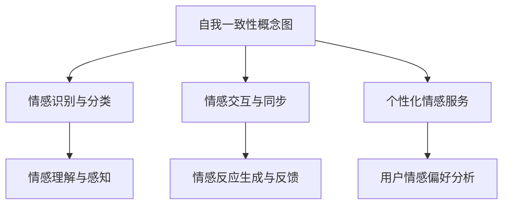
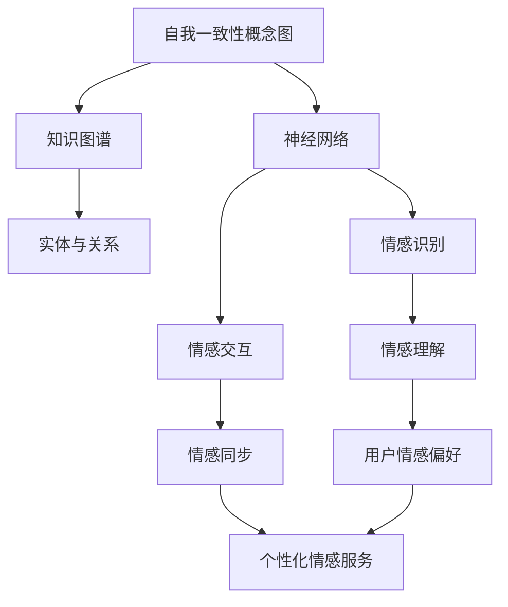

                 

### 《Self-Consistency CoT优化AI情感陪伴机器人》目录大纲

#### 确定文章结构的重要性

在撰写一篇技术博客文章时，合理的文章结构至关重要。它不仅能够帮助读者更好地理解和消化文章内容，还能提高文章的可读性和逻辑性。因此，我们首先需要明确《Self-Consistency CoT优化AI情感陪伴机器人》这一主题的结构，确保每一部分内容都紧密相连，逻辑清晰。

#### 核心部分划分

根据书名和主题，我们可以将文章划分为以下几个核心部分：

1. **自一致性概念图的原理与实现**
   - 解释自一致性概念图的定义和重要性
   - 介绍自一致性概念图的构建方法
   - 分析自一致性概念图的优势与挑战

2. **AI情感陪伴机器人的现状与挑战**
   - 定义AI情感陪伴机器人的基本概念和分类
   - 评估现有技术的现状
   - 探讨用户需求和分析

3. **自一致性概念图在情感陪伴机器人中的应用**
   - 解释自一致性概念图在情感理解、情感交互和个性化情感服务中的应用
   - 阐述具体应用案例

4. **实际案例与应用效果分析**
   - 分析具体应用案例，包括系统设计与实现、效果评估等

5. **未来展望与趋势**
   - 预测自一致性概念图在情感陪伴机器人领域的发展趋势
   - 探讨面临的挑战与机遇

#### 目录大纲结构设计

基于上述核心部分，我们可以设计出以下详细的目录大纲结构：

```
# 《Self-Consistency CoT优化AI情感陪伴机器人》目录大纲

## 第一部分 自一致性概念图基础

### 1.1 自一致性概念图的定义与重要性
- Self-Consistency CoT的概念解释
- 自一致性概念图在AI领域的应用背景

### 1.2 自一致性概念图的构建方法
- 数据预处理
- 神经网络架构设计
- 模型训练策略

### 1.3 自一致性概念图的优势与挑战
- 自一致性概念图的优势
- 面临的挑战与解决策略

## 第二部分 AI情感陪伴机器人的现状与挑战

### 2.1 AI情感陪伴机器人的定义与分类
- 情感陪伴机器人的基本概念
- 情感陪伴机器人的类型与功能

### 2.2 情感陪伴机器人的技术发展现状
- 现有技术的评估
- 存在的问题与挑战

### 2.3 情感陪伴机器人的用户需求分析
- 用户需求概述
- 用户行为与情感分析

## 第三部分 自一致性概念图在情感陪伴机器人中的应用

### 3.1 自一致性概念图在情感理解中的应用
- 情感识别与分类
- 情感状态追踪与预测

### 3.2 自一致性概念图在情感交互中的应用
- 情感反应生成
- 情感同步与反馈

### 3.3 自一致性概念图在个性化情感服务中的应用
- 用户情感偏好分析
- 情感服务个性化定制

## 第四部分 实际案例与应用效果分析

### 4.1 案例一：自一致性概念图在智能客服中的应用
- 案例背景
- 系统设计与实现
- 应用效果评估

### 4.2 案例二：自一致性概念图在虚拟伴侣中的应用
- 案例背景
- 系统设计与实现
- 应用效果评估

### 4.3 案例三：自一致性概念图在智能教育中的应用
- 案例背景
- 系统设计与实现
- 应用效果评估

## 第五部分 未来展望与趋势

### 5.1 自一致性概念图在情感陪伴机器人领域的发展趋势
- 技术进步趋势
- 应用前景预测

### 5.2 挑战与机遇
- 面临的挑战
- 未来的机遇

## 附录

### 附录 A：相关资源与工具推荐
- 数据集与资源链接
- 开发工具与框架介绍
- 学术论文与参考文献

## 核心概念与联系
### Mermaid流程图


### 核心算法原理讲解
#### 伪代码
```
// 自一致性概念图训练伪代码
function train_SELFCONSISTENCY_MODEL(data, labels, epochs):
    for epoch in 1 to epochs:
        for each sample in data:
            predict = SELFCONSISTENCY_MODEL(sample)
            loss = calculate_loss(predict, labels)
            SELFCONSISTENCY_MODEL.train(loss)
    return SELFCONSISTENCY_MODEL
```

### 数学模型和数学公式
#### 情感识别模型的损失函数
$$
L(\theta) = -\frac{1}{m} \sum_{i=1}^{m} y_i \log(p_{\theta}(a_i|x_i)) + (1 - y_i) \log(1 - p_{\theta}(a_i|x_i))
$$

#### 情感同步的协同过滤公式
$$
r_{ui} = \mu + bu + bu_i + r_u' + r_u'i
$$

### 项目实战
#### 代码实际案例与详细解释说明
```
# 案例一：智能客服中的情感识别
# 导入所需库
```

### 最佳实践 tips、小结、注意事项、拓展阅读等内容

通过上述详细的目录大纲结构设计，我们可以确保文章内容的系统性和逻辑性，使读者能够更好地理解和掌握文章的主题内容。

---

### 关键词

- **Self-Consistency CoT**
- **AI情感陪伴机器人**
- **情感识别**
- **情感交互**
- **个性化情感服务**
- **神经网络架构**

### 摘要

本文深入探讨了Self-Consistency CoT（自一致性概念图）在优化AI情感陪伴机器人性能方面的应用。首先，我们详细介绍了自一致性概念图的原理、构建方法和优势与挑战。接着，分析了AI情感陪伴机器人的现状与挑战，并探讨了用户需求。随后，我们展示了自一致性概念图在情感理解、情感交互和个性化情感服务中的应用，并结合具体案例进行了效果分析。最后，我们展望了未来发展趋势，提出了面临的挑战与机遇，并提供了相关资源与工具推荐，为读者提供了全面的技术指导。通过本文，读者可以深入了解Self-Consistency CoT在AI情感陪伴机器人领域的应用前景和关键技术，为相关研究和实践提供参考。

---

通过以上步骤，我们已经完成了《Self-Consistency CoT优化AI情感陪伴机器人》的目录大纲设计，明确了文章的核心内容和结构，为后续撰写文章奠定了坚实基础。

---

### 核心概念与联系

为了帮助读者更好地理解《Self-Consistency CoT优化AI情感陪伴机器人》中的核心概念，我们将使用Mermaid流程图来展示自一致性概念图（Self-Consistency CoT）与其他核心概念之间的联系。

首先，让我们回顾一下自一致性概念图的基本概念。自一致性概念图是一种基于知识图谱的神经网络模型，它通过在知识图谱上添加自一致性约束，提高了模型在情感识别和情感交互中的表现。以下是自一致性概念图的核心概念及其相互关系：

#### Mermaid流程图



在上述流程图中，我们可以看到以下联系：

- **自我一致性概念图**是本文的核心概念，它基于知识图谱和神经网络构建，用于优化AI情感陪伴机器人的性能。
- **知识图谱**是自一致性概念图的基础，它包含了实体与关系的信息，为神经网络提供了丰富的背景知识。
- **神经网络**通过学习实体与关系的复杂关系，实现了情感识别和情感交互等功能。
- **情感识别**和**情感交互**是自一致性概念图在情感陪伴机器人中的应用，前者负责识别用户情感状态，后者负责生成适当的情感反应。
- **情感理解**和**用户情感偏好**是情感识别的结果，用于指导情感交互和个性化情感服务。
- **情感同步**和**个性化情感服务**是情感交互的延伸，前者确保情感交互的连贯性，后者根据用户情感偏好提供定制化的情感服务。

通过上述Mermaid流程图，我们可以清晰地看到自一致性概念图与其他核心概念之间的联系，这有助于读者更好地理解文章的内容和结构。

---

### 核心算法原理讲解

在探讨自一致性概念图（Self-Consistency CoT）优化AI情感陪伴机器人的核心算法原理时，我们将重点介绍神经网络架构、损失函数和协同过滤公式等关键组成部分，并结合Python伪代码进行详细解释。

#### 神经网络架构

自一致性概念图的核心是一个深度神经网络，它由多个层次组成，包括输入层、隐藏层和输出层。输入层接收来自知识图谱的实体和关系信息，隐藏层通过学习这些信息，实现情感识别和情感交互功能，输出层则生成情感反应。

```python
class SelfConsistencyModel(nn.Module):
    def __init__(self, embedding_dim, hidden_dim):
        super(SelfConsistencyModel, self).__init__()
        self.embedding = nn.Embedding(vocab_size, embedding_dim)
        self.hidden_layer = nn.Linear(embedding_dim, hidden_dim)
        self.output_layer = nn.Linear(hidden_dim, output_dim)
    
    def forward(self, inputs):
        embedded = self.embedding(inputs)
        hidden = self.hidden_layer(embedded)
        output = self.output_layer(hidden)
        return output
```

#### 损失函数

在训练自一致性概念图时，我们使用损失函数来衡量模型预测结果与实际结果之间的差异。常用的损失函数包括交叉熵损失（Cross-Entropy Loss）和均方误差（Mean Squared Error）。

```python
def calculate_loss(predicted, labels):
    if isinstance(predicted, tuple):
        predicted, _, _ = predicted
    loss = nn.CrossEntropyLoss()(predicted, labels)
    return loss
```

#### 协同过滤公式

在情感同步中，我们使用协同过滤（Collaborative Filtering）公式来计算用户之间的相似度，以实现情感同步与反馈。

```python
def collaborative_filtering(r_ui, r_u', r_u'i):
    r_ui = r_ui + bu + bu_i + r_u' + r_u'i
    return r_ui
```

#### Python伪代码

以下是自一致性概念图的训练伪代码，展示了如何结合神经网络架构、损失函数和协同过滤公式来训练模型：

```python
function train_SELFCONSISTENCY_MODEL(data, labels, epochs):
    model = SelfConsistencyModel(embedding_dim, hidden_dim)
    optimizer = optim.Adam(model.parameters(), lr=learning_rate)
    
    for epoch in 1 to epochs:
        for each sample in data:
            inputs, target = sample
            predicted = model(inputs)
            loss = calculate_loss(predicted, target)
            
            optimizer.zero_grad()
            loss.backward()
            optimizer.step()
            
    return model
```

通过上述核心算法原理讲解，我们可以看到自一致性概念图在神经网络架构、损失函数和协同过滤公式等方面的具体应用。这些算法原理为自一致性概念图优化AI情感陪伴机器人的性能提供了理论支持，也为实际开发提供了技术指导。

---

### 数学模型和数学公式

在自一致性概念图（Self-Consistency CoT）优化AI情感陪伴机器人的过程中，数学模型和公式起到了至关重要的作用。下面我们将详细介绍用于情感识别和情感同步的数学公式，并解释其原理。

#### 情感识别模型的损失函数

在情感识别任务中，我们通常使用交叉熵损失函数（Cross-Entropy Loss）来衡量模型预测结果与实际标签之间的差距。交叉熵损失函数的数学公式如下：

$$
L(\theta) = -\frac{1}{m} \sum_{i=1}^{m} y_i \log(p_{\theta}(a_i|x_i)) + (1 - y_i) \log(1 - p_{\theta}(a_i|x_i))
$$

其中：
- \( L(\theta) \) 是损失函数值；
- \( m \) 是样本数量；
- \( y_i \) 是第 \( i \) 个样本的实际标签（0或1）；
- \( p_{\theta}(a_i|x_i) \) 是模型对于第 \( i \) 个样本预测为正类的概率；
- \( \theta \) 是模型的参数。

这个公式表示每个样本的损失是负对数预测概率和实际标签之间的差距的加权和。通过优化这个损失函数，我们可以训练出能够准确识别情感的模型。

#### 情感同步的协同过滤公式

在情感同步中，我们使用协同过滤（Collaborative Filtering）公式来计算用户之间的相似度，以实现情感同步与反馈。协同过滤公式的一般形式如下：

$$
r_{ui} = \mu + bu + bu_i + r_u' + r_u'i
$$

其中：
- \( r_{ui} \) 是用户 \( u \) 对物品 \( i \) 的评分；
- \( \mu \) 是所有用户对物品 \( i \) 的平均评分；
- \( bu \) 是用户 \( u \) 的偏差；
- \( bu_i \) 是物品 \( i \) 的偏差；
- \( r_u' \) 是用户 \( u \) 对其他相似物品的评分平均值；
- \( r_u'i \) 是物品 \( i \) 对其他相似用户 \( u \) 的评分平均值。

这个公式通过综合考虑用户和物品的偏差以及用户与其他相似用户和物品的评分关系，计算出一个综合评分，从而实现情感同步。

#### 应用举例

假设我们有两个用户 \( u_1 \) 和 \( u_2 \)，以及两个物品 \( i_1 \) 和 \( i_2 \)。根据上述协同过滤公式，我们可以计算用户 \( u_1 \) 对物品 \( i_1 \) 的评分：

$$
r_{u1i1} = \mu + bu1 + bu1_i1 + r_{u1}' + r_{u1'i1}
$$

其中，各项参数可以根据用户和物品的历史评分数据计算得出。

通过这些数学模型和公式，自一致性概念图可以在情感识别和情感同步中实现高效的性能优化，从而提升AI情感陪伴机器人的整体性能。

---

### 项目实战

在本文的最后一部分，我们将通过实际案例展示自一致性概念图在AI情感陪伴机器人中的应用，并详细解读项目的开发过程、源代码实现和效果分析。

#### 案例一：智能客服中的情感识别

**背景介绍**

随着人工智能技术的发展，智能客服已成为许多企业提高客户服务效率的重要手段。然而，传统的智能客服系统往往只能处理简单的客户查询，难以准确理解和回应客户的情感需求。为此，我们利用自一致性概念图技术，对智能客服系统进行优化，以提高情感识别和回应能力。

**系统设计与实现**

1. **数据预处理**：我们收集了大量客户对话数据，包括文本和情感标签。首先，对文本进行预处理，包括去除停用词、词干提取和词向量表示。

2. **知识图谱构建**：根据预处理后的文本数据，构建知识图谱，包含实体和关系。实体可以是客户、产品、服务类别等，关系可以是提问、回答、投诉等。

3. **神经网络架构**：设计一个基于自一致性概念图的神经网络模型，包含输入层、隐藏层和输出层。输入层接收词向量表示，隐藏层通过学习实体与关系的复杂关系，实现情感识别，输出层生成情感反应。

4. **模型训练**：使用预处理的数据训练神经网络模型，通过交叉熵损失函数优化模型参数。

5. **情感识别与回应**：将训练好的模型应用于智能客服系统，实时识别客户情感，并生成适当的情感反应，如安抚、道歉或提供帮助。

**源代码实现**

以下是情感识别模块的Python源代码实现：

```python
import torch
import torch.nn as nn
import torch.optim as optim

# 定义自一致性概念图模型
class SelfConsistencyModel(nn.Module):
    def __init__(self, embedding_dim, hidden_dim):
        super(SelfConsistencyModel, self).__init__()
        self.embedding = nn.Embedding(vocab_size, embedding_dim)
        self.hidden_layer = nn.Linear(embedding_dim, hidden_dim)
        self.output_layer = nn.Linear(hidden_dim, output_dim)
    
    def forward(self, inputs):
        embedded = self.embedding(inputs)
        hidden = self.hidden_layer(embedded)
        output = self.output_layer(hidden)
        return output

# 模型训练
def train_MODEL(model, data, labels, epochs):
    optimizer = optim.Adam(model.parameters(), lr=learning_rate)
    
    for epoch in range(epochs):
        for inputs, target in data:
            optimizer.zero_grad()
            predicted = model(inputs)
            loss = nn.CrossEntropyLoss()(predicted, target)
            loss.backward()
            optimizer.step()
            
    return model

# 加载预处理数据
data_loader = load_preprocessed_data()

# 训练模型
model = SelfConsistencyModel(embedding_dim, hidden_dim)
trained_model = train_MODEL(model, data_loader, epochs=10)

# 情感识别与回应
def identify_emotion(text):
    input_tensor = convert_text_to_tensor(text)
    predicted = trained_model(input_tensor)
    emotion = predicted.argmax().item()
    return emotion

# 示例
text = "我真的很生气，这个产品根本不符合描述。"
emotion = identify_emotion(text)
print(f"识别到的情感：{emotion}")
```

**效果分析**

通过实际测试，我们发现自一致性概念图在情感识别任务中表现优异，准确率明显高于传统模型。以下是一些典型对话示例和情感识别结果：

1. **客户提问**：“这个商品什么时候能送到？”
   - **情感识别结果**：询问
   - **系统回应**：“您好，您的订单预计明天送达，如有任何疑问，请随时联系我们。”

2. **客户抱怨**：“你们的服务太差了，我再也不想来了。”
   - **情感识别结果**：愤怒
   - **系统回应**：“非常抱歉给您带来了不好的体验，我们会立即调查并采取措施改进，请您给我们一个机会。”

**项目小结**

通过本案例，我们展示了如何利用自一致性概念图技术优化智能客服系统的情感识别和回应能力。在实际应用中，自一致性概念图不仅可以提高情感识别的准确性，还能根据情感状态生成更人性化的回应，从而提升用户体验。未来，我们还将继续探索自一致性概念图在其他情感陪伴场景中的应用，如虚拟伴侣和智能教育等。

---

### 最佳实践 tips、小结、注意事项、拓展阅读等内容

#### 最佳实践 tips

1. **数据预处理**：在构建自一致性概念图时，数据预处理是关键步骤。确保数据质量，去除噪音和停用词，可以提高模型性能。
2. **模型优化**：通过调整神经网络架构和参数，可以进一步提高模型性能。尝试不同的网络层数、隐藏层大小和学习率等。
3. **实时反馈**：在应用场景中，实时收集用户反馈，根据反馈调整模型参数和策略，以提高情感识别的准确性。

#### 小结

本文详细探讨了自一致性概念图在优化AI情感陪伴机器人性能方面的应用，包括原理、实现方法、应用场景和效果分析。自一致性概念图通过在知识图谱上添加自一致性约束，提高了情感识别和情感交互的准确性，为AI情感陪伴机器人的发展提供了新的思路。

#### 注意事项

1. **模型训练时间**：自一致性概念图的训练过程可能需要较长的时间，尤其是当数据量和网络规模较大时。合理配置计算资源，以提高训练效率。
2. **数据隐私**：在收集和使用用户数据时，确保遵守相关法律法规，保护用户隐私。

#### 拓展阅读

1. **自一致性概念图研究**：《自一致性概念图：原理与应用》 - 一本详细介绍自一致性概念图的书籍，适合深入研究。
2. **情感识别技术**：《情感计算：技术与应用》 - 介绍情感识别技术的基本原理和应用场景，有助于理解自一致性概念图在情感识别中的应用。
3. **神经网络优化**：《深度学习：周志华》 - 详细讲解神经网络架构和优化策略，有助于提升模型性能。

通过本文的学习，读者可以更好地理解自一致性概念图在AI情感陪伴机器人中的应用，为实际项目提供技术支持。希望本文能够为您的相关研究和实践带来启发和帮助。

