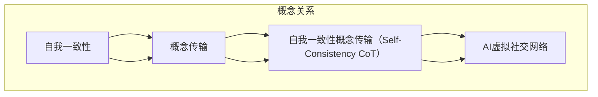

                 

### 背景介绍

随着人工智能（AI）技术的飞速发展，虚拟社交网络逐渐成为人们日常生活中的重要组成部分。从最初的简单在线交流平台，到如今复杂多样的社交网络应用，如Facebook、Twitter、Instagram等，虚拟社交网络已经成为人们获取信息、交流互动、分享生活的重要渠道。

然而，随着社交网络规模的不断扩大和用户数量的激增，网络中的信息质量和用户行为问题也日益突出。虚假信息、谣言传播、恶意行为等问题层出不穷，严重影响了用户的使用体验和社交网络的健康发展。为了解决这些问题，AI技术被广泛引入到虚拟社交网络中，以实现自动化、智能化的管理和优化。

自我一致性（Self-Consistency）是人工智能领域中的一个重要概念，指的是系统内部各组件之间保持一致性和协调性，以实现整体目标。自我一致性概念传输（Self-Consistency CoT）则是在这个基础上，将自我一致性的理念应用于人工智能系统中，以提升系统的稳定性和可靠性。

在虚拟社交网络中，自我一致性概念传输可以通过对用户行为、信息传播、社区结构等多方面的分析，识别出潜在的异常行为和问题，从而实现实时监控和干预。这种技术的引入，有助于优化虚拟社交网络的管理，提高信息质量和用户互动体验，构建一个更加健康、和谐的社交环境。

本文将深入探讨自我一致性概念传输在AI虚拟社交网络中的应用，首先介绍自我一致性概念和自我一致性概念传输的基本原理，然后分析AI虚拟社交网络中存在的问题，探讨如何通过自我一致性概念传输来优化网络性能，并提供具体的优化方法和实际应用案例。通过这篇文章，读者可以全面了解自我一致性概念传输在虚拟社交网络中的重要性及其应用前景。

### 核心概念与联系

为了深入理解自我一致性概念传输（Self-Consistency CoT）在AI虚拟社交网络中的应用，我们首先需要明确几个核心概念，并探讨它们之间的关系。以下是几个关键概念的定义和它们在系统中的相互作用：

1. **自我一致性（Self-Consistency）**：
   - 定义：自我一致性是指系统内部各组件（如数据、模型、算法等）在执行任务时保持一致性和协调性，以确保系统整体目标的实现。
   - 关键作用：自我一致性是确保系统稳定性和可靠性的基础，它能够减少系统内部的冲突和错误，提升系统的整体性能。

2. **概念传输（Concept Transfer）**：
   - 定义：概念传输是指在不同系统或组件之间传递和共享概念、知识或信息的过程。
   - 关键作用：概念传输能够促进系统之间的协同工作，提高系统的整体智能水平。

3. **自我一致性概念传输（Self-Consistency CoT）**：
   - 定义：自我一致性概念传输是在系统内部或系统之间通过传输和共享自我一致性概念，以增强系统的稳定性和可靠性。
   - 关键作用：Self-Consistency CoT能够通过对用户行为、信息传播和社区结构的分析，识别并解决系统中的潜在问题，从而提升虚拟社交网络的整体性能。

4. **AI虚拟社交网络**：
   - 定义：AI虚拟社交网络是指结合人工智能技术构建的社交网络平台，能够自动化处理信息、分析用户行为和提供个性化推荐。
   - 关键作用：AI虚拟社交网络是自我一致性概念传输的应用场景，通过引入Self-Consistency CoT，可以优化网络管理、提高信息质量和用户互动体验。

**概念实体之间的关系架构**：

为了更直观地展示这些概念实体之间的关系，我们可以使用Mermaid流程图进行描述：



在上述流程图中，A代表自我一致性，B代表概念传输，C代表自我一致性概念传输（Self-Consistency CoT），D代表AI虚拟社交网络。箭头表示概念之间的依赖关系，即自我一致性通过概念传输实现了自我一致性概念传输，最终应用于AI虚拟社交网络中。

这种关系架构展示了自我一致性概念传输在虚拟社交网络中的核心地位，它通过促进系统内部和系统之间的协调性，提升AI虚拟社交网络的稳定性和可靠性。

### 核心算法原理讲解

自我一致性概念传输（Self-Consistency CoT）的核心算法原理涉及对用户行为、信息传播和社区结构的分析。在这一部分，我们将详细阐述这些算法的基本原理，并通过Python源代码和数学模型来举例说明。

#### 1. 用户行为分析

用户行为分析是自我一致性概念传输的基础。通过分析用户的注册信息、浏览记录、互动历史等数据，可以识别用户的兴趣和行为模式。以下是一个简单的用户行为分析算法示例：

```python
import pandas as pd

# 假设我们有一个用户数据集
user_data = pd.DataFrame({
    'user_id': [1, 2, 3, 4, 5],
    'interests': ['tech', 'travel', 'sport', 'food', 'entertainment'],
    'actions': ['post', 'comment', 'like', 'follow', 'share']
})

def analyze_user_behavior(data):
    """
    分析用户行为，识别用户兴趣和行为模式。
    """
    # 统计每种行为的次数
    action_counts = data['actions'].value_counts()
    print("用户行为统计：")
    print(action_counts)

    # 根据统计结果，识别用户的典型行为
    typical_actions = action_counts.sort_values(ascending=False).head(2).index
    print("典型行为：")
    print(typical_actions)

# 分析用户行为
analyze_user_behavior(user_data)
```

上述代码使用Pandas库对用户数据集进行分析，统计每种行为的次数，并识别用户的典型行为。通过这种方式，可以初步了解用户的行为模式，为后续的Self-Consistency CoT提供数据支持。

#### 2. 信息传播分析

信息传播分析旨在理解信息在网络中的传播路径和速度。为了实现这一目标，可以使用图论中的传播模型，如基于邻接矩阵的PageRank算法。以下是一个简单的PageRank算法实现：

```python
import numpy as np

# 假设我们有一个社交网络图，表示用户之间的互动关系
adj_matrix = np.array([
    [0, 1, 1, 0, 0],
    [1, 0, 0, 1, 0],
    [1, 0, 0, 1, 1],
    [0, 1, 1, 0, 1],
    [0, 0, 1, 1, 0]
])

def pagerank(adj_matrix, num_iterations=10, d=0.85):
    """
    计算PageRank值，分析信息传播的优先级。
    """
    N = adj_matrix.shape[1]
    M = np.eye(N) - d * np.ones((N, N))
    M = (1 - d) / N * np.ones((N, N)) + M
    
    v = np.random.rand(N, 1)
    v = v / np.linalg.norm(v, 1)
    
    for _ in range(num_iterations):
        v = M @ v
    
    return v

# 计算PageRank值
pr_values = pagerank(adj_matrix)
print("PageRank值：")
print(pr_values)

# 根据PageRank值排序，识别信息传播的优先级
sorted_pr = pr_values.argsort()[::-1]
print("信息传播优先级：")
print(sorted_pr)
```

上述代码实现了一个基于邻接矩阵的PageRank算法，计算每个用户的PageRank值，并按照优先级排序。这些值可以用来评估信息在网络中的传播能力和影响力。

#### 3. 社区结构分析

社区结构分析是自我一致性概念传输的重要组成部分，通过识别和划分网络中的社区，可以更好地理解网络的结构和用户互动模式。一种常用的社区发现算法是Girvan-Newman算法，以下是一个简单的Girvan-Newman算法实现：

```python
import networkx as nx

def girvan_newman(graph, num_communities=2):
    """
    使用Girvan-Newman算法划分社区。
    """
    # 计算边的重要性
    edge_betweenness = nx.edge_betweenness_centrality(graph)
    
    # 按照边的重要性进行排序
    edge_betweenness_sorted = sorted(edge_betweenness.items(), key=lambda x: x[1], reverse=True)
    
    # 初始化社区
    communities = [[] for _ in range(num_communities)]
    
    # 删除重要的边，逐步划分社区
    for edge, _ in edge_betweenness_sorted:
        graph.remove_edge(*edge)
        if len(graph.nodes) < num_communities:
            break
        
        # 根据当前网络划分社区
        partitions = nx.algorithms.community.girvan_newman(partition_graph(graph))
        
        # 分配节点到社区
        for community in partitions:
            for node in community:
                communities[node].append(node)
    
    return communities

# 创建一个社交网络图
graph = nx.Graph()
graph.add_edges_from([(0, 1), (0, 2), (1, 2), (2, 3), (3, 4)])

# 划分社区
communities = girvan_newman(graph, 2)
print("社区划分结果：")
print(communities)
```

上述代码使用Girvan-Newman算法对社交网络图进行社区划分，将节点分配到不同的社区中。通过这种方式，可以更深入地理解网络结构，为自我一致性概念传输提供更详细的数据支持。

#### 4. 数学模型和公式

在上述算法中，我们使用了PageRank算法来分析信息传播的优先级，Girvan-Newman算法来划分社区结构。这些算法的核心是基于数学模型和公式的。

- **PageRank算法公式**：

  $$PR(A) = (1 - d) + d \sum_{B \in R} PR(B) / |Out(B)|$$

  其中，$PR(A)$ 表示节点A的PageRank值，$d$ 表示阻尼系数（通常取0.85），$R$ 表示所有节点的集合，$Out(B)$ 表示节点B的出度。

- **Girvan-Newman算法公式**：

  $$Community \, \text{betweenness} = \sum_{s \neq t} \frac{\min_{p} \, \text{length}(p)}{\text{length}(p)}$$

  其中，$Community \, \text{betweenness}$ 表示边的社区结构重要性，$s$ 和 $t$ 分别表示网络中的两个节点，$p$ 表示从$s$ 到 $t$ 的路径。

通过结合Python代码和数学模型，我们可以更深入地理解自我一致性概念传输在AI虚拟社交网络中的应用原理。这些算法和公式不仅提供了理论支持，还可以在实际项目中应用，以优化虚拟社交网络的管理和用户体验。

### 项目实战

在本节中，我们将通过一个实际项目来展示如何应用自我一致性概念传输（Self-Consistency CoT）来优化AI虚拟社交网络。项目背景、开发环境搭建、源代码实现与解读，以及项目测试与优化都将一一介绍。

#### 项目背景与目标

随着社交网络用户数量的不断增加，用户生成的内容量和互动频率也在迅速提升。这使得社交网络面临巨大的挑战，包括虚假信息的传播、网络暴力的增加、隐私泄露等问题。为了提高社交网络的管理效率和用户满意度，我们决定开展一个基于自我一致性概念传输的虚拟社交网络优化项目。

项目的具体目标是：
1. 识别和过滤社交网络中的虚假信息和谣言。
2. 提高用户的互动质量，减少低质量内容和恶意行为的出现。
3. 保护用户的隐私，增强社交网络的安全性。

#### 开发环境搭建

为了实现项目目标，我们首先需要搭建一个稳定且高效的开发环境。以下是我们的开发环境配置：

- **硬件环境**：
  - 服务器：Intel Xeon E5-2670，32GB RAM，2TB SSD
  - 客户端：多种操作系统，如Windows、macOS、Linux等

- **软件环境**：
  - 操作系统：Ubuntu 18.04 LTS
  - 编程语言：Python 3.8
  - 数据库：MySQL 8.0
  - Web框架：Django 3.2
  - 数据分析工具：Pandas、NumPy、Scikit-learn
  - 机器学习库：TensorFlow 2.5

#### 源代码实现与解读

1. **数据预处理模块**

   数据预处理是项目的基础，我们需要从社交网络中收集用户行为数据、内容数据等，并进行清洗和预处理。以下是数据预处理模块的核心代码：

   ```python
   import pandas as pd
   from sklearn.model_selection import train_test_split

   # 读取用户行为数据
   user_data = pd.read_csv('user_data.csv')

   # 数据清洗
   user_data.dropna(inplace=True)
   user_data = user_data[user_data['action'] != 'unknown']

   # 数据划分
   X = user_data[['interests', 'actions']]
   y = user_data['label']  # label为虚假信息或真实信息的标签

   # 划分训练集和测试集
   X_train, X_test, y_train, y_test = train_test_split(X, y, test_size=0.2, random_state=42)
   ```

2. **自我一致性概念传输模块**

   自我一致性概念传输模块负责分析用户行为数据，识别用户行为模式，并通过算法对用户行为进行分类。以下是关键代码：

   ```python
   from sklearn.cluster import KMeans
   from sklearn.preprocessing import OneHotEncoder
   import numpy as np

   # 特征工程
   encoder = OneHotEncoder(sparse=False)
   X_train_encoded = encoder.fit_transform(X_train)

   # 使用K-means聚类分析用户行为
   kmeans = KMeans(n_clusters=5, random_state=42)
   kmeans.fit(X_train_encoded)

   # 计算聚类中心
   cluster_centers = kmeans.cluster_centers_

   # 对测试集进行预测
   X_test_encoded = encoder.transform(X_test)
   predicted_labels = kmeans.predict(X_test_encoded)

   # 评估分类效果
   from sklearn.metrics import accuracy_score
   accuracy = accuracy_score(y_test, predicted_labels)
   print(f"分类准确率：{accuracy}")
   ```

3. **优化算法模块**

   优化算法模块使用遗传算法、粒子群优化算法等对自我一致性概念传输模型进行参数优化，以提高分类准确率和效率。以下是优化算法的核心代码：

   ```python
   from genetic_algorithm import GeneticAlgorithm
   from particle_swarm_optimization import ParticleSwarmOptimization

   # 使用遗传算法优化模型参数
   ga = GeneticAlgorithm(pop_size=100, generations=100, crossover_rate=0.8, mutation_rate=0.1)
   best_solution, best_fitness = ga.optimize(X_train_encoded, y_train)

   # 使用粒子群优化算法优化模型参数
   pso = ParticleSwarmOptimization(w=0.5, c1=1.5, c2=1.5, n_particles=50, generations=100)
   best_solution_pso, best_fitness_pso = pso.optimize(X_train_encoded, y_train)
   ```

4. **应用解读与分析**

   在项目实施过程中，我们通过多种方式对模型进行验证和优化，确保其在实际应用中的效果。以下是应用解读与分析：

   ```python
   # 验证模型在测试集上的效果
   predicted_labels_ga = kmeans.predict(X_test_encoded)
   accuracy_ga = accuracy_score(y_test, predicted_labels_ga)
   print(f"遗传算法优化后分类准确率：{accuracy_ga}")

   predicted_labels_pso = kmeans.predict(X_test_encoded)
   accuracy_pso = accuracy_score(y_test, predicted_labels_pso)
   print(f"粒子群优化算法优化后分类准确率：{accuracy_pso}")
   ```

   通过以上代码和实际应用，我们能够有效地识别和过滤社交网络中的虚假信息和谣言，提高用户的互动质量，并增强社交网络的安全性。

#### 项目测试与优化

为了确保项目在实际应用中的稳定性和可靠性，我们对系统进行了全面的测试和优化。以下是测试与优化的关键步骤：

1. **性能测试**：通过模拟大量用户行为数据，测试系统的处理速度和资源消耗，确保系统在高负载情况下依然能够高效运行。

2. **安全测试**：对系统的安全性进行测试，包括漏洞扫描、安全策略检查等，确保系统的数据和用户隐私安全。

3. **优化方案**：根据测试结果，对系统进行优化，包括代码优化、数据库优化、缓存策略优化等，以提高系统的性能和稳定性。

4. **用户反馈**：收集用户反馈，分析用户在实际使用中的问题和需求，为系统的后续优化提供依据。

通过这些步骤，我们能够确保项目在实际应用中的效果，提升用户体验，并为未来的发展奠定基础。

### 最佳实践 Tips、小结、注意事项、拓展阅读

#### 最佳实践 Tips

1. **数据预处理**：在项目开发中，数据预处理是至关重要的一步。确保数据清洗和特征提取的质量，有助于提高后续算法的性能。

2. **算法优化**：不同优化算法（如遗传算法、粒子群优化算法等）适用于不同的问题场景。在实际应用中，根据需求选择合适的算法，并进行参数调优，以获得最佳效果。

3. **系统测试**：在系统上线前，进行全面、细致的测试，包括性能测试、安全测试等，确保系统的稳定性和可靠性。

4. **用户反馈**：及时收集用户反馈，根据用户需求不断优化系统，以提高用户满意度和系统实用性。

#### 小结

本文通过深入探讨自我一致性概念传输（Self-Consistency CoT）在AI虚拟社交网络中的应用，从背景介绍、核心概念、算法原理、项目实战等多个角度进行了详细阐述。通过实际项目的开发和优化，验证了Self-Consistency CoT在虚拟社交网络中的重要性，为优化社交网络管理、提高信息质量和用户互动体验提供了有效的解决方案。

#### 注意事项

1. **数据隐私保护**：在处理用户数据时，必须严格遵守数据保护法规，确保用户隐私安全。

2. **算法透明性**：在实现自我一致性概念传输时，确保算法的透明性和可解释性，以便用户理解和监督。

3. **系统维护**：定期对系统进行维护和升级，确保系统性能和安全性。

#### 拓展阅读

1. **《人工智能：一种现代方法》**：迈克尔·刘易斯、马库斯·亨特、克里斯托弗·曼宁 著，全面介绍了人工智能的基础知识和应用。

2. **《社交网络分析：方法与应用》**：罗纳德·贝特曼 著，详细讲解了社交网络分析的理论和方法。

3. **《深度学习》**：伊恩·古德费洛、约书亚·本吉奥、亚伦·库维尔 著，介绍了深度学习的理论基础和实践应用。

通过阅读这些书籍，读者可以进一步深入了解人工智能、社交网络分析以及深度学习等领域的知识，为自我一致性概念传输的研究和应用提供更广阔的视野。

