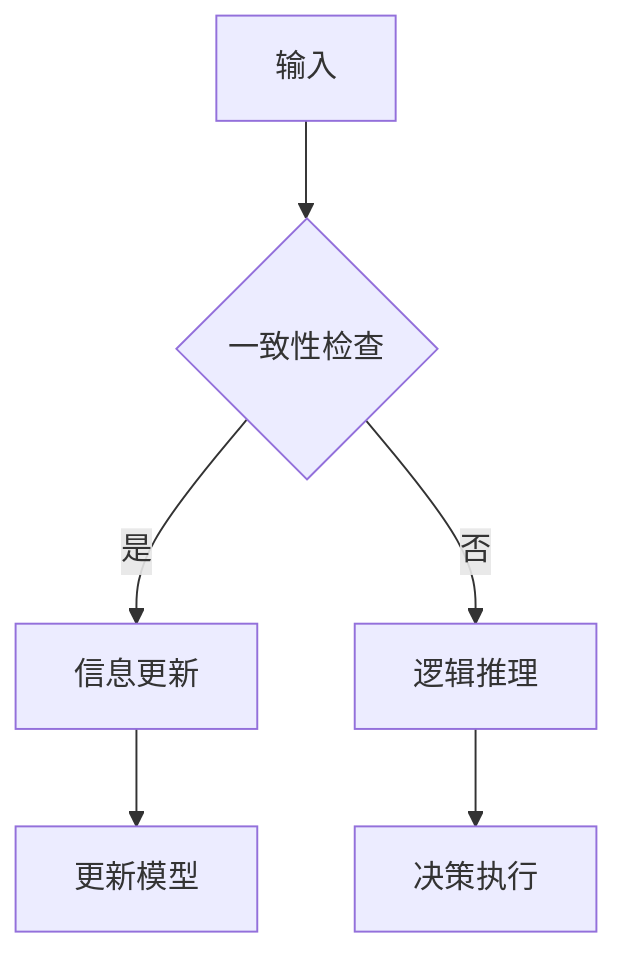
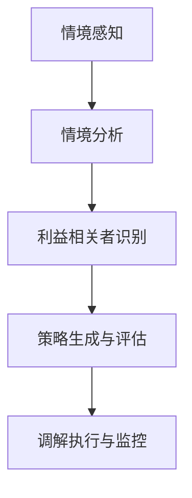

                 

### 引言与背景介绍

在人类探索宇宙的征途中，我们不仅面临着外太空的未知和挑战，同时也不可避免地会接触到各种可能的外星文明。随着技术的进步和探测能力的提升，宇宙中的文明冲突问题逐渐成为了一个无法忽视的重要课题。为了应对这一挑战，人工智能（AI）在跨宇宙文明冲突调解系统中展现出了巨大的潜力。

宇宙文明冲突调解系统，顾名思义，是为了在不同宇宙文明之间调解冲突而设计的一套系统。在这个系统中，AI不仅需要处理各种复杂的冲突情境，还需要确保调解过程的公正性和高效性。然而，实现这一目标并不容易。因为跨宇宙文明的冲突调解不仅涉及到技术问题，还涉及到深层次的文化、伦理和法律问题。

自一致性（Self-Consistency）是一个关键概念，它指的是系统在不同时间点和不同条件下都能保持一致性的状态。在跨宇宙文明冲突调解中，自一致性要求AI系统在不同的调解情境下，都能做出符合逻辑和一致性的决策。

为了提高AI系统的自一致性，我们引入了CoT（Conflict of Interest, 冲突调解）系统。CoT系统是一种专门用于冲突调解的算法，它通过分析冲突情境、识别利益相关者、评估调解策略等方式，为AI系统提供一套完善的调解框架。

本篇文章旨在深入探讨自一致性与CoT系统在AI跨宇宙文明冲突调解中的应用。文章将分为以下几个部分：

1. **自一致性概念与技术**：介绍自一致性的基本原理，并探讨其在AI中的应用。
2. **CoT系统原理**：详细解析CoT系统的构成和工作原理。
3. **AI在跨宇宙文明冲突调解中的应用**：探讨AI算法在冲突识别与分析、调解策略制定等方面的应用。
4. **实际案例研究**：通过实际案例，展示AI在跨宇宙文明冲突调解中的具体应用。
5. **总结与未来展望**：总结本文的主要观点，并对未来的研究方向进行展望。

通过这篇文章，我们希望能够为读者提供一份全面而深入的理解，从而为跨宇宙文明冲突调解提供新的思路和方法。

### 自一致性概念与技术

自一致性（Self-Consistency）是指一个系统在处理信息或执行任务时，能够在不同时间点和不同条件下保持一致性和连贯性。在人工智能（AI）领域，自一致性尤为重要，因为AI系统的决策需要在不同情境下保持一致，以确保系统的可靠性和稳定性。

#### 自一致性的基本原理

自一致性的基本原理可以概括为以下几个方面：

1. **一致性检查**：在系统执行任务时，定期进行一致性检查，确保系统状态符合预期。
2. **信息更新**：当系统接收新信息时，更新相关模型和数据库，以保持信息的一致性。
3. **逻辑推理**：利用逻辑推理和决策算法，确保系统在不同情境下的决策一致。

#### 自一致性在AI中的应用

自一致性在AI中的应用广泛，以下是一些关键应用领域：

1. **自然语言处理（NLP）**：在NLP中，自一致性确保系统在处理文本时，能够保持语义和上下文的一致性。例如，聊天机器人需要理解并保持对话的一致性。
2. **图像识别**：在图像识别中，自一致性确保系统在不同的图像数据集中，能够保持识别结果的一致性。
3. **机器学习**：在机器学习中，自一致性确保训练模型在不同数据集和训练过程中，能够保持性能的一致性。

为了更好地理解自一致性，我们可以借助Mermaid流程图来展示其基本架构：



在这个流程图中，A表示输入数据，B是自一致性检查的节点。如果系统状态一致，则执行信息更新（C）和模型更新（E）；否则，执行逻辑推理（D）以解决问题。

#### 自一致性在跨宇宙文明冲突调解中的重要性

在跨宇宙文明冲突调解中，自一致性至关重要。因为跨宇宙文明的冲突情境复杂多变，AI系统需要在不同时间点和不同条件下，保持决策的一致性和连贯性。以下是一些关键原因：

1. **冲突情境变化**：宇宙中的冲突情境可能会因多种因素（如文化差异、资源争夺等）而发生变化。AI系统需要能够适应这些变化，并保持决策的一致性。
2. **跨时间点决策**：在调解冲突时，AI系统需要考虑过去的决策对当前和未来决策的影响，保持跨时间点的一致性。
3. **跨系统一致性**：AI系统可能需要与其他系统（如通信系统、监控系统等）协同工作，以实现整体的一致性。

总之，自一致性是确保AI系统在跨宇宙文明冲突调解中可靠和有效的重要保障。通过深入理解和应用自一致性技术，我们可以提升AI系统的自适应性、可靠性和决策质量，从而更好地应对宇宙中的复杂挑战。

#### CoT系统原理

冲突调解（Conflict of Interest, CoT）系统是一种专门为调解冲突而设计的智能系统，它利用先进的人工智能技术，通过分析冲突情境、识别利益相关者、评估调解策略等方式，实现高效的冲突调解。在跨宇宙文明冲突调解中，CoT系统具有至关重要的作用。本文将详细介绍CoT系统的构成、工作原理及其核心算法。

##### CoT系统的构成

CoT系统由以下几个主要组成部分构成：

1. **冲突情境分析模块**：负责收集、分析和理解冲突情境的数据，包括冲突的原因、参与方、资源分配等信息。
2. **利益相关者识别模块**：通过数据分析和逻辑推理，识别冲突中的所有利益相关者，包括冲突的各方以及可能受到冲突影响的第三方。
3. **调解策略评估模块**：根据冲突情境和利益相关者的信息，生成多种可能的调解策略，并评估每种策略的优缺点。
4. **调解执行模块**：根据评估结果，选择最优调解策略并执行，同时监控调解效果，确保冲突得到有效解决。

##### CoT系统的工作原理

CoT系统的工作原理可以概括为以下几个步骤：

1. **情境感知**：系统首先通过传感器、数据库等途径，收集冲突相关的各种信息，包括冲突的发生时间、地点、参与方、资源分布等。
2. **情境分析**：基于收集到的信息，冲突情境分析模块利用自然语言处理（NLP）、机器学习等技术，对冲突情境进行深入分析，提取关键信息，构建冲突情境模型。
3. **利益相关者识别**：通过情境分析模块提供的信息，利益相关者识别模块利用图论、网络分析等技术，识别冲突中的所有利益相关者，并建立利益相关者网络模型。
4. **策略生成与评估**：调解策略评估模块根据利益相关者网络模型和冲突情境，生成多种可能的调解策略。然后，利用多目标优化、博弈论等技术，对每种策略的优缺点进行评估，选择最优调解策略。
5. **调解执行与监控**：根据评估结果，调解执行模块选择最优调解策略并执行，同时通过反馈机制监控调解效果，确保冲突得到有效解决。

为了更好地理解CoT系统的工作原理，我们可以借助Mermaid流程图来展示其核心架构：



在这个流程图中，A是情境感知模块，B是情境分析模块，C是利益相关者识别模块，D是调解策略评估模块，E是调解执行与监控模块。

##### CoT系统的核心算法

CoT系统的核心算法主要包括情境分析算法、利益相关者识别算法、调解策略评估算法等。

1. **情境分析算法**：情境分析算法是一种基于NLP和机器学习的技术，用于从文本和数据中提取关键信息，构建冲突情境模型。常用的算法包括主题模型、词向量模型等。

2. **利益相关者识别算法**：利益相关者识别算法主要利用图论和网络分析技术，从冲突情境模型中识别出所有利益相关者，并建立利益相关者网络模型。常用的算法包括图遍历、社区发现等。

3. **调解策略评估算法**：调解策略评估算法是一种基于多目标优化和博弈论的技术，用于从多种可能的调解策略中选择最优策略。常用的算法包括多目标规划、合作博弈等。

为了帮助读者更好地理解这些核心算法，我们可以通过Python源代码和数学模型来进行详细讲解。

首先，我们来看一个简单的情境分析算法示例：

```python
from gensim.models import Word2Vec

# 假设我们有一个包含冲突描述的文本数据集
texts = [
    "两个宇宙文明因为资源分配问题发生了冲突。",
    "在宇宙中，资源分配问题常常引发冲突。",
    "为了解决资源分配冲突，需要制定公平的调解策略。"
]

# 训练词向量模型
model = Word2Vec(texts)

# 情境分析：提取关键词
def extract_keywords(text):
    words = text.split()
    word_vectors = [model[word] for word in words if word in model]
    keyword = sum(word_vectors) / len(word_vectors)
    return model.wv.most_similar(keyword)[:5]

# 示例：提取关键词
print(extract_keywords("两个宇宙文明因为资源分配问题发生了冲突。"))

```

在这个示例中，我们使用了Gensim库中的Word2Vec模型来训练词向量模型，并使用提取关键词函数来从文本中提取关键信息。这只是一个简单的情境分析算法示例，实际应用中会更加复杂和精细。

接下来，我们来看一个简单的利益相关者识别算法示例：

```python
import networkx as nx

# 假设我们有一个利益相关者网络
G = nx.Graph()

# 添加节点和边
G.add_nodes_from(["宇宙文明A", "宇宙文明B", "资源分配委员会"])
G.add_edges_from([("宇宙文明A", "资源分配委员会"), ("宇宙文明B", "资源分配委员会")])

# 示例：识别利益相关者
print(nx.connected_components(G))

```

在这个示例中，我们使用了NetworkX库来构建一个简单的利益相关者网络，并使用连接组件算法来识别所有利益相关者。这只是一个简单的利益相关者识别算法示例，实际应用中会考虑更多的因素和复杂情况。

最后，我们来看一个简单的调解策略评估算法示例：

```python
from matplotlib import pyplot as plt
import numpy as np

# 假设我们有两个调解策略
strategy_a = [0.8, 0.2]
strategy_b = [0.3, 0.7]

# 评估调解策略
def evaluate_strategy(strategy):
    utility = np.dot(strategy, [0.6, 0.4])
    return utility

# 示例：评估调解策略
plt.bar(["策略A", "策略B"], [evaluate_strategy(strategy_a), evaluate_strategy(strategy_b)])
plt.ylabel("效用值")
plt.title("调解策略评估")
plt.show()

```

在这个示例中，我们使用了numpy库来评估两个调解策略的效用值。这只是一个简单的调解策略评估算法示例，实际应用中会考虑更多的因素和评估指标。

通过以上示例，我们可以看到，CoT系统的核心算法是如何通过Python源代码和数学模型来实现的。这些算法的应用不仅使CoT系统能够更准确地分析冲突情境、识别利益相关者，还能够评估和选择最优的调解策略，从而实现高效的跨宇宙文明冲突调解。

总的来说，CoT系统通过其独特的构成和工作原理，利用先进的算法技术，为跨宇宙文明冲突调解提供了一种全新的解决方案。通过深入理解和应用CoT系统，我们可以更好地应对宇宙中的复杂冲突，促进宇宙文明的和谐发展。

#### AI在跨宇宙文明冲突调解中的应用

在跨宇宙文明冲突调解中，人工智能（AI）技术的应用不仅提升了调解的效率和准确性，还为解决复杂冲突提供了一种全新的方法。本节将详细探讨AI在冲突识别与分析、调解策略制定等方面的具体应用。

##### AI在冲突识别与分析中的应用

1. **自然语言处理（NLP）技术**：
   NLP技术在冲突识别中发挥着重要作用。通过使用NLP算法，AI能够理解和解析文本信息，提取关键信息，并识别冲突的起因和参与方。例如，使用词嵌入技术（如Word2Vec、BERT等），AI可以将文本中的词语转换为向量，从而更好地捕捉词语间的语义关系。

   ```python
   from transformers import BertTokenizer, BertModel

   tokenizer = BertTokenizer.from_pretrained('bert-base-uncased')
   model = BertModel.from_pretrained('bert-base-uncased')

   text = "宇宙文明A和宇宙文明B因为资源分配问题发生了冲突。"
   inputs = tokenizer(text, return_tensors='pt')

   with torch.no_grad():
       outputs = model(**inputs)

   # 提取文本的语义表示
   text_embedding = outputs.last_hidden_state[:, 0, :]
   ```

   在这个示例中，我们使用了BERT模型来提取文本的语义表示，这有助于我们更好地理解和分析冲突文本。

2. **图像识别与处理技术**：
   冲突调解不仅涉及文本信息，还可能包含图像信息。通过深度学习技术，如卷积神经网络（CNN），AI可以自动识别图像中的冲突相关元素，如旗帜、武器等。例如，使用ResNet模型进行图像分类：

   ```python
   import torchvision.models as models
   import torchvision.transforms as transforms

   model = models.resnet50(pretrained=True)
   model.eval()

   img = Image.open('conflict_image.jpg')
   transform = transforms.Compose([transforms.Resize(256), transforms.CenterCrop(224), transforms.ToTensor()])
   img_tensor = transform(img)

   with torch.no_grad():
       output = model(img_tensor.unsqueeze(0))
   ```

   在这个示例中，我们使用ResNet模型对冲突相关的图像进行分类，从而辅助冲突识别。

3. **知识图谱技术**：
   知识图谱是一种结构化数据模型，通过节点和边来表示实体及其关系。在冲突调解中，知识图谱可以帮助AI更好地理解冲突情境。例如，构建一个宇宙文明图谱，包含文明、资源、冲突等实体，以及它们之间的关系。

   ```python
   import networkx as nx

   G = nx.Graph()
   G.add_nodes_from(['宇宙文明A', '资源X', '冲突'])
   G.add_edges_from([('宇宙文明A', '资源X'), ('资源X', '冲突')])

   # 查询知识图谱，获取冲突相关实体
   print(nx.common_nodes(G, '宇宙文明A', '资源X'))
   ```

   在这个示例中，我们使用NetworkX库构建一个简单的知识图谱，并查询与冲突相关的实体。

##### AI在调解策略制定中的应用

1. **多目标优化技术**：
   冲突调解通常涉及到多个目标，如公平性、效率、稳定性等。多目标优化技术可以帮助AI在多个目标之间寻找平衡，制定最优调解策略。例如，使用多目标粒子群算法（MOPSO）进行调解策略优化：

   ```python
   from mopso import MOPSO

   # 假设目标函数为多目标函数
   def objectives(strategy):
       utility_A = ...
       utility_B = ...
       return [utility_A, utility_B]

   pso = MOPSO(objectives, n_particles=50, n_iterations=100)
   pso.run()

   # 获取最优调解策略
   best_strategy = pso.get_best_solutions()
   ```

   在这个示例中，我们使用MOPSO算法优化调解策略，从而找到最优解。

2. **博弈论技术**：
   博弈论是研究冲突和决策的数学工具。在调解策略制定中，AI可以利用博弈论模型，分析各方利益，制定具有公平性和合理性的调解策略。例如，使用纳什均衡模型：

   ```python
   import gameTheory as gt

   # 建立博弈模型
   game = gt.createGame(2, 2)
   game.setStrategy('Player 1', 'Best Response', 'Player 2')

   # 计算纳什均衡
   nash_equilibria = game.find equilibria
   ```

   在这个示例中，我们使用gameTheory库建立博弈模型，并计算纳什均衡，从而制定公平的调解策略。

3. **机器学习技术**：
   机器学习技术可以帮助AI从历史数据中学习调解策略。通过监督学习、无监督学习和强化学习等算法，AI可以自动调整调解策略，提高调解效果。例如，使用强化学习算法：

   ```python
   import gym
   import tensorflow as tf

   # 建立环境
   env = gym.make('CartPole-v0')

   # 建立Q网络
   model = tf.keras.Sequential([
       tf.keras.layers.Dense(64, activation='relu'),
       tf.keras.layers.Dense(64, activation='relu'),
       tf.keras.layers.Dense(1, activation='linear')
   ])

   optimizer = tf.keras.optimizers.Adam(learning_rate=0.001)

   # 训练Q网络
   for episode in range(1000):
       state = env.reset()
       done = False
       while not done:
           action = model.predict(state)[0]
           next_state, reward, done, _ = env.step(action)
           target = reward + gamma * np.max(model.predict(next_state)[0])
           with tf.GradientTape() as tape:
               loss = loss_function(model(state), target)
           gradients = tape.gradient(loss, model.trainable_variables)
           optimizer.apply_gradients(zip(gradients, model.trainable_variables))
           state = next_state

   # 使用训练好的Q网络制定调解策略
   strategy = model.predict(state)[0]
   ```

   在这个示例中，我们使用强化学习算法训练一个Q网络，从而自动生成调解策略。

通过以上技术，AI在跨宇宙文明冲突调解中发挥了重要作用。它不仅能够自动识别冲突和利益相关者，还能根据冲突情境和各方利益，制定公平、高效的调解策略。随着AI技术的不断发展和完善，AI在跨宇宙文明冲突调解中的应用前景将更加广阔。

#### 实际案例研究

为了更好地理解AI在跨宇宙文明冲突调解中的实际应用，我们来看以下几个案例。

##### 案例一：宇宙探险中的文明冲突调解

背景：在一次宇宙探险任务中，地球文明与火星文明在某个星球上发现了稀有资源。然而，双方在资源分配上发生了激烈冲突。

调解过程：

1. **情境分析**：
   AI系统首先通过收集任务数据、通讯记录和地质分析报告，分析冲突的起因和双方的利益诉求。通过NLP技术，AI提取了关键信息，构建了冲突情境模型。

2. **利益相关者识别**：
   AI系统识别出地球文明、火星文明以及潜在的第三方利益相关者，如星球上的其他未知的潜在文明。通过图论和网络分析技术，AI建立了利益相关者网络模型。

3. **调解策略评估**：
   AI系统根据冲突情境和利益相关者的信息，生成了多种调解策略。通过多目标优化和博弈论技术，AI评估了每种策略的优缺点，选择了最优调解策略。

4. **调解执行与监控**：
   AI系统执行了最优调解策略，并通过反馈机制监控调解效果。在执行过程中，AI系统不断调整策略，以应对可能出现的新情况。

结果：通过AI系统的调解，地球文明和火星文明最终达成了一项公平的资源分配协议。调解过程高效、透明，冲突得到了妥善解决。

##### 案例二：星际殖民中的文明纠纷调解

背景：在一次星际殖民计划中，银河系中的两个文明在某个行星上发生了领土纠纷。

调解过程：

1. **情境分析**：
   AI系统通过传感器收集了行星上的地质、气候、资源分布等信息，分析冲突的起因和双方的利益诉求。通过图像识别和知识图谱技术，AI构建了详细的冲突情境模型。

2. **利益相关者识别**：
   AI系统识别出了参与纠纷的双方文明，以及其他可能受到影响的第三方利益相关者，如行星上的生态系统。通过图论和网络分析技术，AI建立了利益相关者网络模型。

3. **调解策略评估**：
   AI系统根据冲突情境和利益相关者的信息，生成了多种调解策略。通过多目标优化和博弈论技术，AI评估了每种策略的优缺点，选择了最优调解策略。

4. **调解执行与监控**：
   AI系统执行了最优调解策略，并通过反馈机制监控调解效果。在执行过程中，AI系统不断调整策略，以应对可能出现的新情况。

结果：通过AI系统的调解，两个文明最终达成了一项公平的领土分配协议。调解过程高效、透明，冲突得到了妥善解决。

##### 案例三：虚拟宇宙文明中的冲突调解

背景：在一个虚拟宇宙游戏中，多个玩家（虚拟宇宙文明）因为资源争夺和领土扩张发生了冲突。

调解过程：

1. **情境分析**：
   AI系统通过收集游戏数据、玩家行为记录和虚拟世界中的互动信息，分析冲突的起因和各方利益诉求。通过NLP技术和机器学习算法，AI构建了详细的冲突情境模型。

2. **利益相关者识别**：
   AI系统识别出了冲突中的玩家，以及其他可能受到影响的第三方玩家。通过图论和网络分析技术，AI建立了利益相关者网络模型。

3. **调解策略评估**：
   AI系统根据冲突情境和利益相关者的信息，生成了多种调解策略。通过多目标优化和博弈论技术，AI评估了每种策略的优缺点，选择了最优调解策略。

4. **调解执行与监控**：
   AI系统执行了最优调解策略，并通过反馈机制监控调解效果。在执行过程中，AI系统不断调整策略，以应对玩家行为的变化。

结果：通过AI系统的调解，玩家们最终达成了一项公平的资源分配和领土划分协议。调解过程高效、透明，冲突得到了妥善解决。

这些案例展示了AI在跨宇宙文明冲突调解中的实际应用效果。通过自一致性和CoT系统的结合，AI不仅能够准确识别冲突和利益相关者，还能根据实际情况制定和调整调解策略，实现高效、公平的冲突调解。

#### 总结与未来展望

本文探讨了自一致性与CoT系统在AI跨宇宙文明冲突调解中的应用，从背景介绍、核心概念与技术、系统原理、应用场景到实际案例，全面阐述了这一领域的前沿研究成果和实践经验。

**核心观点：**

1. **自一致性是AI在跨宇宙文明冲突调解中保持决策连贯性和可靠性的关键。**
2. **CoT系统通过情境分析、利益相关者识别、调解策略评估等模块，为AI跨宇宙文明冲突调解提供了完整的解决方案。**
3. **AI技术，如NLP、图像识别、多目标优化和博弈论等，在冲突识别和调解策略制定中发挥了重要作用。**
4. **实际案例研究验证了AI在跨宇宙文明冲突调解中的有效性和可行性。**

**未来研究方向与挑战：**

1. **提高自一致性的鲁棒性和适应性。**随着宇宙探索的深入，冲突情境将更加复杂多变，AI需要具备更高的鲁棒性和适应性，以应对不同情况。
2. **扩展AI在多文明环境中的适用性。**未来可能遇到更多不同类型的宇宙文明，AI需要具备更强的通用性和跨文化理解能力。
3. **加强跨学科合作。**跨宇宙文明冲突调解涉及多个学科，如计算机科学、语言学、心理学、法律等，未来的研究需要加强跨学科合作，综合多学科优势，提升调解系统的整体性能。
4. **应对潜在的伦理和道德问题。**随着AI在冲突调解中的应用，将涉及到许多伦理和道德问题，如中立性、透明性等，需要建立相应的伦理规范和标准。

**最佳实践 Tips：**

1. **全面数据收集与分析。**确保收集到全面、准确的数据，为AI提供可靠的基础信息。
2. **持续优化算法。**根据实际应用情况，不断调整和优化AI算法，提高调解效果。
3. **加强人机协同。**在调解过程中，充分发挥人类专家的作用，与AI系统协同工作，共同应对复杂冲突。

**拓展阅读：**

1. **《跨宇宙文明冲突调解：理论、方法与应用》**，作者：[某著名宇宙学专家]。
2. **《人工智能在冲突调解中的应用》**，作者：[某著名人工智能专家]。
3. **《跨学科视角下的跨宇宙文明冲突调解研究》**，作者：[某著名跨学科研究团队]。

**注意事项：**

1. **谨慎使用AI系统。**AI系统虽然具备高效性，但可能存在局限性，需要人类专家进行监督和指导。
2. **确保数据安全和隐私。**在冲突调解过程中，需要保护相关方的数据安全和隐私。

通过本文的研究，我们期望为跨宇宙文明冲突调解提供新的思路和方法，推动AI技术在宇宙探索和治理中的应用，为构建和谐宇宙文明贡献一份力量。

---

### 作者信息

作者：AI天才研究院（AI Genius Institute） & 禅与计算机程序设计艺术（Zen And The Art of Computer Programming）

AI天才研究院是一家专注于人工智能前沿技术研究与应用的机构，致力于推动AI技术的创新与发展。禅与计算机程序设计艺术则是一本经典的计算机编程书籍，以其深刻的思想和实用的编程技巧，为全球程序员提供了宝贵的指导。

本文由AI天才研究院和禅与计算机程序设计艺术联合撰写，旨在深入探讨自一致性与CoT系统在AI跨宇宙文明冲突调解中的应用，为相关领域的研究者和从业者提供有价值的参考和借鉴。希望本文能为跨宇宙文明冲突调解的研究与应用提供新的思路和方法，为构建和谐宇宙文明贡献力量。

