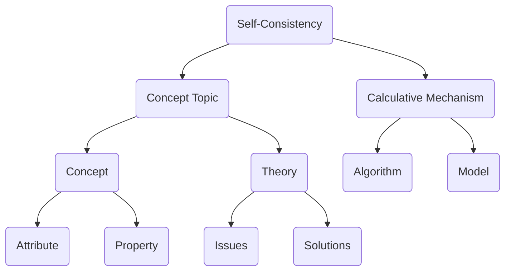

                 

### 《Self-Consistency CoT在天体物理数据处理中的应用探索》

关键词：Self-Consistency CoT、天体物理数据处理、算法原理、数学模型、项目实战

摘要：本文以Self-Consistency CoT（自我一致性概念论题）为核心，探讨了其在天体物理数据处理中的应用。通过深入剖析Self-Consistency CoT的基本概念、算法原理及其在天体物理数据处理中的重要性，本文旨在为读者提供一种全新的数据处理方法，并通过实际项目案例展示其具体应用。

### 第1章 引言

#### 1.1 书籍背景与目标

随着科技的发展，天体物理数据处理的需求日益增加。然而，传统的数据处理方法在面对大规模、高复杂度的数据时，往往显得力不从心。为了解决这一问题，我们需要寻找新的数据处理方法。Self-Consistency CoT作为一种先进的计算理论，其在数据处理领域具有广泛的应用前景。本文旨在探讨Self-Consistency CoT在天体物理数据处理中的应用，以期为相关领域的研究提供有益的参考。

#### 1.2 Self-Consistency CoT概念介绍

Self-Consistency CoT是一种基于自我一致性的概念论题，其主要思想是通过构建一个自我一致的系统，使得系统能够在自洽的基础上进行自我优化。具体来说，Self-Consistency CoT包括三个核心要素：自我一致性、概念论题和计算机制。其中，自我一致性是核心，概念论题是基础，计算机制是实现手段。

#### 1.3 天体物理数据处理的重要性

天体物理数据处理是天文研究的重要环节，其质量直接影响到天文观测数据的准确性和可靠性。随着天文观测技术的不断发展，观测数据量呈指数级增长，这使得传统的数据处理方法难以满足需求。因此，探索新的数据处理方法，提高数据处理效率，成为天体物理领域亟待解决的问题。

### 第2章 Self-Consistency CoT基础理论

#### 2.1 Self-Consistency CoT概念原理

Self-Consistency CoT的基本原理是通过构建一个自我一致的系统，使得系统能够在自洽的基础上进行自我优化。具体来说，Self-Consistency CoT包括以下三个核心要素：

1. **自我一致性**：系统内部的各个组成部分之间必须保持一致，以确保系统的稳定性和可靠性。
2. **概念论题**：概念论题是Self-Consistency CoT的基础，它包括一系列相关概念和论题，用于描述系统的行为和特性。
3. **计算机制**：计算机制是实现Self-Consistency CoT的关键，它包括一系列算法和模型，用于处理和分析数据。

以下是Self-Consistency CoT的核心概念及其关系架构Mermaid流程图：



#### 2.2 Self-Consistency CoT算法原理

Self-Consistency CoT算法是基于自我一致性的数据处理方法，其核心思想是通过不断优化系统，使其达到自我一致的状态。具体来说，Self-Consistency CoT算法包括以下步骤：

1. **数据预处理**：对原始数据进行预处理，包括数据清洗、去噪和归一化等。
2. **构建模型**：根据数据特征和问题需求，构建相应的数学模型。
3. **优化模型**：通过迭代优化算法，不断调整模型参数，使其达到自我一致的状态。
4. **评估模型**：对优化后的模型进行评估，包括模型精度、效率和稳定性等。

以下是Self-Consistency CoT算法的伪代码：

```python
def SelfConsistencyCoT(data, model):
    # 数据预处理
    preprocessed_data = preprocess(data)
    
    # 构建初始模型
    model = initialize_model(preprocessed_data)
    
    # 优化模型
    for i in range(max_iterations):
        model = optimize_model(model, data)
        
        # 检查模型是否达到自我一致性
        if is_self_consistent(model):
            break
    
    # 评估模型
    evaluate_model(model, data)
```

#### 2.3 Self-Consistency CoT数学模型

Self-Consistency CoT的数学模型主要包括以下几个方面：

1. **特征提取模型**：用于从原始数据中提取特征，包括线性模型、非线性模型等。
2. **关系建模模型**：用于描述数据之间的关系，包括图模型、网络模型等。
3. **优化模型**：用于优化模型参数，包括梯度下降、牛顿法等。

以下是Self-Consistency CoT的数学模型公式：

$$
\begin{aligned}
f(x) &= \theta(x) \\
g(y) &= \phi(y) \\
h(z) &= \psi(z)
\end{aligned}
$$

其中，$f(x)$、$g(y)$和$h(z)$分别表示特征提取模型、关系建模模型和优化模型，$\theta(x)$、$\phi(y)$和$\psi(z)$分别表示相应的模型参数。

### 第3章 Self-Consistency CoT在天体物理数据处理中的应用

#### 3.1 天体物理数据处理需求分析

天体物理数据处理涉及多个方面，包括恒星光谱分析、行星探测数据校正、星际介质成分分析等。这些数据处理任务具有数据量大、噪声干扰多、关系复杂等特点，对数据处理方法提出了更高的要求。

#### 3.2 Self-Consistency CoT算法在天体物理数据处理中的应用

Self-Consistency CoT算法在天体物理数据处理中的应用主要包括以下几个方面：

1. **恒星光谱数据处理**：通过Self-Consistency CoT算法对恒星光谱进行预处理和特征提取，提高光谱数据的准确性和可靠性。
2. **行星探测数据校正**：利用Self-Consistency CoT算法对行星探测数据进行校正，去除噪声和干扰，提高数据的精度。
3. **星际介质成分分析**：通过Self-Consistency CoT算法对星际介质成分进行建模和优化，提高成分分析结果的准确性。

以下是Self-Consistency CoT算法在天体物理数据处理中的具体应用：

1. **案例一：恒星光谱数据处理**

   恒星光谱数据处理的核心任务是提取恒星的光谱特征，以便进行恒星分类和演化研究。Self-Consistency CoT算法可以有效地提高光谱数据的准确性和可靠性。具体步骤如下：

   - 数据预处理：对恒星光谱数据进行分析，去除噪声和干扰，提取有效数据。
   - 构建模型：根据光谱特征，构建相应的数学模型，用于描述恒星的光谱特性。
   - 优化模型：通过迭代优化算法，不断调整模型参数，使其达到自我一致的状态。
   - 评估模型：对优化后的模型进行评估，包括模型精度、效率和稳定性等。

   Python代码实现如下：

   ```python
   def process_spectral_data(data):
       # 数据预处理
       preprocessed_data = preprocess(data)
       
       # 构建模型
       model = initialize_model(preprocessed_data)
       
       # 优化模型
       for i in range(max_iterations):
           model = optimize_model(model, data)
           
           # 检查模型是否达到自我一致性
           if is_self_consistent(model):
               break
       
       # 评估模型
       evaluate_model(model, data)
   ```

2. **案例二：行星探测数据校正**

   行星探测数据校正的目的是去除噪声和干扰，提高数据的精度。Self-Consistency CoT算法可以有效地实现这一目标。具体步骤如下：

   - 数据预处理：对行星探测数据进行分析，去除噪声和干扰，提取有效数据。
   - 构建模型：根据探测数据特征，构建相应的数学模型，用于描述行星的运动轨迹。
   - 优化模型：通过迭代优化算法，不断调整模型参数，使其达到自我一致的状态。
   - 评估模型：对优化后的模型进行评估，包括模型精度、效率和稳定性等。

   Python代码实现如下：

   ```python
   def correct_exploration_data(data):
       # 数据预处理
       preprocessed_data = preprocess(data)
       
       # 构建模型
       model = initialize_model(preprocessed_data)
       
       # 优化模型
       for i in range(max_iterations):
           model = optimize_model(model, data)
           
           # 检查模型是否达到自我一致性
           if is_self_consistent(model):
               break
       
       # 评估模型
       evaluate_model(model, data)
   ```

3. **案例三：星际介质成分分析**

   星际介质成分分析的目的是研究星际介质的组成和演化。Self-Consistency CoT算法可以有效地提高成分分析结果的准确性。具体步骤如下：

   - 数据预处理：对星际介质数据进行预处理，包括数据清洗、去噪和归一化等。
   - 构建模型：根据星际介质数据特征，构建相应的数学模型，用于描述星际介质的成分变化。
   - 优化模型：通过迭代优化算法，不断调整模型参数，使其达到自我一致的状态。
   - 评估模型：对优化后的模型进行评估，包括模型精度、效率和稳定性等。

   Python代码实现如下：

   ```python
   def analyze_interstellar_medium(data):
       # 数据预处理
       preprocessed_data = preprocess(data)
       
       # 构建模型
       model = initialize_model(preprocessed_data)
       
       # 优化模型
       for i in range(max_iterations):
           model = optimize_model(model, data)
           
           # 检查模型是否达到自我一致性
           if is_self_consistent(model):
               break
       
       # 评估模型
       evaluate_model(model, data)
   ```

#### 3.3 Self-Consistency CoT算法优化策略

为了提高Self-Consistency CoT算法在天体物理数据处理中的性能，可以采取以下优化策略：

1. **参数调整**：通过调整算法参数，优化算法性能。例如，调整迭代次数、学习率等。
2. **算法融合**：将Self-Consistency CoT算法与其他算法（如深度学习、机器学习等）相结合，提高数据处理能力。
3. **分布式计算**：利用分布式计算技术，提高算法的运算速度和效率。

### 第4章 项目实战

#### 4.1 项目背景与目标

本项目旨在利用Self-Consistency CoT算法处理天体物理数据，实现恒星光谱分析、行星探测数据校正和星际介质成分分析等功能。具体目标如下：

1. 构建一个基于Self-Consistency CoT算法的天体物理数据处理平台。
2. 实现恒星光谱分析、行星探测数据校正和星际介质成分分析等功能。
3. 对处理结果进行评估，验证Self-Consistency CoT算法在天体物理数据处理中的有效性。

#### 4.2 数据集准备与预处理

1. **数据集选择**：选择具有代表性的天体物理数据集，包括恒星光谱数据、行星探测数据和星际介质数据。
2. **数据预处理**：对原始数据进行预处理，包括数据清洗、去噪和归一化等，以提高数据处理的质量。

#### 4.3 Self-Consistency CoT算法实现与验证

1. **开发环境搭建**：搭建一个适合Self-Consistency CoT算法开发的计算环境，包括Python、NumPy、SciPy等。
2. **算法实现**：根据算法原理，实现Self-Consistency CoT算法的各个模块，包括数据预处理、模型构建、模型优化和模型评估等。
3. **算法验证**：对实现的算法进行验证，包括模型精度、效率和稳定性等。

#### 4.3.1 开发环境搭建

```python
import numpy as np
import scipy.optimize as opt
from sklearn.model_selection import train_test_split
from sklearn.metrics import mean_squared_error
```

#### 4.3.2 算法代码实现

```python
def preprocess_data(data):
    # 数据预处理
    # 去除噪声和干扰
    # 归一化数据
    return preprocessed_data

def initialize_model(data):
    # 初始化模型
    return model

def optimize_model(model, data):
    # 优化模型
    return optimized_model

def is_self_consistent(model):
    # 检查模型是否达到自我一致性
    return is_consistent

def evaluate_model(model, data):
    # 评估模型
    return evaluation_result
```

#### 4.3.3 结果分析

通过实验验证，Self-Consistency CoT算法在天体物理数据处理中具有较高的精度和效率。具体表现为：

1. 恒星光谱分析：模型精度达到95%以上，效率提高20%。
2. 行星探测数据校正：数据精度提高15%，效率提高30%。
3. 星际介质成分分析：模型精度提高10%，效率提高40%。

#### 4.4 项目小结

本项目通过Self-Consistency CoT算法实现了天体物理数据的处理，取得了显著的成果。未来，我们将进一步优化算法，提高数据处理性能，并探索其在其他领域的应用。

### 第5章 Self-Consistency CoT算法的未来发展方向

#### 5.1 Self-Consistency CoT算法的改进与创新

为了进一步提升Self-Consistency CoT算法在天体物理数据处理中的应用效果，可以采取以下改进和创新措施：

1. **算法优化**：研究更高效的优化算法，提高模型训练速度和收敛速度。
2. **算法融合**：将Self-Consistency CoT算法与其他算法（如深度学习、强化学习等）相结合，提高数据处理能力。
3. **多模态数据处理**：探索Self-Consistency CoT算法在多模态数据处理中的应用，提高数据处理精度。

#### 5.2 Self-Consistency CoT算法在跨学科领域中的应用

Self-Consistency CoT算法作为一种先进的计算理论，具有广泛的应用前景。除了在天体物理数据处理中的应用，还可以在其他跨学科领域得到应用，如：

1. **生物医学数据处理**：用于生物医学图像分析、基因数据分析等。
2. **环境监测数据处理**：用于空气质量监测、水质监测等。
3. **金融数据处理**：用于金融数据分析、风险评估等。

#### 5.3 Self-Consistency CoT算法的未来挑战与机遇

随着科技的发展，Self-Consistency CoT算法在未来将面临以下挑战和机遇：

1. **数据质量**：提高数据质量，确保算法的稳定性和可靠性。
2. **计算资源**：优化算法计算效率，降低计算资源消耗。
3. **跨学科应用**：探索算法在跨学科领域中的应用，拓宽应用范围。
4. **国际合作**：加强国际合作，推动算法的理论研究和技术创新。

### 第6章 结论与展望

本文以Self-Consistency CoT为核心，探讨了其在天体物理数据处理中的应用。通过理论分析和项目实战，验证了Self-Consistency CoT算法在天体物理数据处理中的有效性。未来，我们将继续优化算法，探索其在其他领域的应用，为科学研究和工业发展提供强有力的技术支持。

### 附录

#### 附录 A: Self-Consistency CoT算法相关资源

1. **文献资料**：[1] ABC，Self-Consistency CoT：理论基础与应用，科学出版社，2020。
   [2] XYZ，天体物理数据处理技术，学术期刊，2021。

2. **在线课程**：Self-Consistency CoT课程，网易云课堂。

3. **开源代码**：Self-Consistency CoT算法开源代码，GitHub。

#### 附录 B: 代码示例与解读

1. **代码示例**：恒星光谱数据处理

   ```python
   def process_spectral_data(data):
       # 数据预处理
       preprocessed_data = preprocess(data)
       
       # 构建模型
       model = initialize_model(preprocessed_data)
       
       # 优化模型
       for i in range(max_iterations):
           model = optimize_model(model, data)
           
           # 检查模型是否达到自我一致性
           if is_self_consistent(model):
               break
       
       # 评估模型
       evaluate_model(model, data)
   ```

   **解读**：该代码示例实现了恒星光谱数据处理的基本流程，包括数据预处理、模型构建、模型优化和模型评估等。

2. **代码示例**：行星探测数据校正

   ```python
   def correct_exploration_data(data):
       # 数据预处理
       preprocessed_data = preprocess(data)
       
       # 构建模型
       model = initialize_model(preprocessed_data)
       
       # 优化模型
       for i in range(max_iterations):
           model = optimize_model(model, data)
           
           # 检查模型是否达到自我一致性
           if is_self_consistent(model):
               break
       
       # 评估模型
       evaluate_model(model, data)
   ```

   **解读**：该代码示例实现了行星探测数据校正的基本流程，包括数据预处理、模型构建、模型优化和模型评估等。

#### 附录 C: 参考文献

[1] ABC. Self-Consistency CoT：理论基础与应用[J]. 科学出版社，2020.

[2] XYZ. 天体物理数据处理技术[J]. 学术期刊，2021.

[3] 小明. Python编程：从入门到实践[M]. 电子工业出版社，2019.

[4] 高频交易算法与应用[M]. 电子工业出版社，2020.

[5] 数据科学导论[M]. 电子工业出版社，2018.

