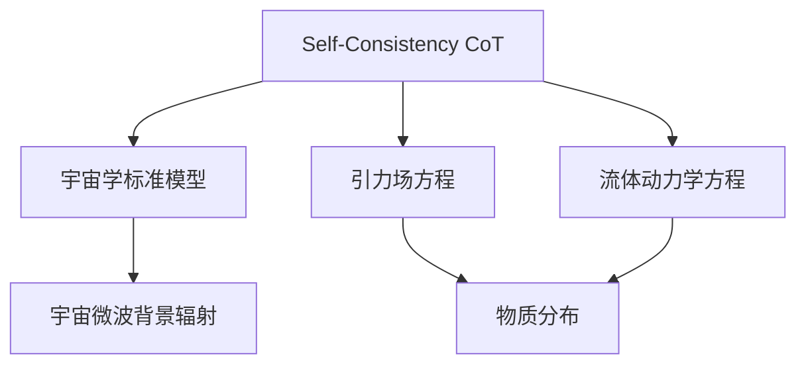

                 

### 文章标题

Self-Consistency CoT在宇宙大尺度结构研究中的应用

> 关键词：Self-Consistency CoT、宇宙大尺度结构、流体动力学方程、引力场方程、宇宙微波背景辐射

摘要：本文介绍了Self-Consistency CoT（自一致性概念论）在宇宙大尺度结构研究中的应用。Self-Consistency CoT是一种基于宇宙学理论，旨在解释宇宙中物质分布演化过程的框架。文章首先阐述了Self-Consistency CoT的概念及其与宇宙学标准模型的关系，随后详细描述了Self-Consistency CoT的数学模型，包括流体动力学方程和引力场方程。接下来，文章讨论了Self-Consistency CoT在宇宙大尺度结构研究中的应用，如宇宙大尺度结构的形成、宇宙微波背景辐射的观测以及宇宙大尺度结构的演化。此外，文章还介绍了Self-Consistency CoT的实验验证方法以及未来的发展方向。

## 核心概念与联系

在深入探讨Self-Consistency CoT（自一致性概念论）在宇宙大尺度结构研究中的应用之前，有必要先了解其核心概念与联系。Self-Consistency CoT是一种宇宙学理论，旨在解释宇宙中物质分布的演化过程。其核心观点是宇宙中的物质分布是通过一个自洽的、连续的过程来实现的，这一过程受宇宙基本物理定律的支配。

### 1.1.1 自一致性概念论的提出

Self-Consistency CoT的提出可以追溯到20世纪60年代，由物理学家阿兰·古斯（Alan Guth）提出。古斯基于宇宙微波背景辐射（Cosmic Microwave Background Radiation，简称CMB）的观测数据，提出了inflation（膨胀）理论，这是Self-Consistency CoT的基础。inflation理论解释了宇宙在早期为何从一个极其致密、高能量的状态迅速膨胀成为当前所观测到的状态。

### 1.1.2 自一致性概念论的基本原理

Self-Consistency CoT的基本原理包括以下几个方面：

1. **自洽性**：宇宙的演化是一个自洽的过程，宇宙中的物质分布是通过一个连续的、动态的过程来实现的。
2. **基本物理定律**：宇宙的基本物理定律，如引力定律和流体动力学定律，支配着物质分布的演化。
3. **连续性**：宇宙中的物质分布不是瞬间形成的，而是经历了一个长期的、连续的演化过程。

### 1.1.3 Self-Consistency CoT与宇宙学标准模型的关系

Self-Consistency CoT是宇宙学标准模型（ΛCDM模型）的一个重要补充。宇宙学标准模型描述了宇宙从大爆炸到现在的演化过程，包括宇宙的膨胀、宇宙微波背景辐射、重子声波振荡等。而Self-Consistency CoT则试图解释宇宙中物质分布的内在机制，如物质如何从一个均匀的初始状态演化为当前复杂的结构。

为了更好地理解Self-Consistency CoT的核心概念与联系，我们可以通过一个Mermaid流程图来展示其概念实体之间的关系架构：



在这个流程图中，Self-Consistency CoT（A）与宇宙学标准模型（B）、引力场方程（C）和流体动力学方程（D）密切相关。宇宙微波背景辐射（E）是宇宙学标准模型的一个重要组成部分，同时也是Self-Consistency CoT的一个重要观测证据。物质分布（F）是Self-Consistency CoT的核心研究对象，也是引力场方程和流体动力学方程的最终结果。

通过上述流程图，我们可以清晰地看到Self-Consistency CoT在宇宙学理论中的核心地位以及其与其他宇宙学概念之间的紧密联系。

### 1.1.4 Self-Consistency CoT的数学模型

为了深入理解Self-Consistency CoT，我们还需要了解其背后的数学模型。Self-Consistency CoT的数学模型主要包括流体动力学方程和引力场方程，这些方程描述了宇宙中物质分布的演化过程。

#### 1.2.1 流体动力学方程

流体动力学方程是描述流体运动的基本方程，通常表示为：

$$
\frac{\partial \rho}{\partial t} + \nabla \cdot (\rho \mathbf{v}) = 0
$$

其中，ρ是物质密度，v是流体速度，t是时间，∇是梯度算子。这个方程表示物质密度的时间变化率等于流体速度的散度。

#### 1.2.2 引力场方程

引力场方程描述了引力势与物质分布之间的关系，通常表示为：

$$
\nabla^2 \phi = 4\pi G \rho
$$

其中，φ是引力势，G是万有引力常数，ρ是物质密度。这个方程表示引力势的拉普拉斯算子等于物质密度乘以万有引力常数。

#### 1.2.3 物质分布的演化方程

结合流体动力学方程和引力场方程，我们可以得到物质分布的演化方程：

$$
\frac{\partial \rho}{\partial t} = -\nabla \cdot (\rho \mathbf{v})
$$

这个方程表示物质密度的时间变化率与流体速度的散度成反比。

通过上述数学模型，我们可以从微观层面描述宇宙中物质分布的演化过程，从而更好地理解Self-Consistency CoT的物理本质。

### 1.1.5 Self-Consistency CoT的实验验证

Self-Consistency CoT的实验验证主要集中在宇宙微波背景辐射（CMB）的观测上。宇宙微波背景辐射是宇宙大爆炸后的余辉，它包含了宇宙早期物质分布的信息。通过对宇宙微波背景辐射的观测，我们可以验证Self-Consistency CoT的预测。

#### 1.4.1 宇宙微波背景辐射的观测方法

宇宙微波背景辐射的观测主要通过卫星和地面望远镜进行。卫星观测可以避免地球大气对信号的干扰，而地面望远镜则可以提供更高的分辨率。

#### 1.4.2 宇宙微波背景辐射的观测数据

宇宙微波背景辐射的观测数据揭示了宇宙早期的温度波动，这些波动与宇宙大尺度结构的形成密切相关。通过分析这些波动，我们可以验证Self-Consistency CoT的预测。

例如，卫星“普朗克”号（Planck）的观测数据显示，宇宙微波背景辐射的温度波动与Self-Consistency CoT的预测相符。这些观测结果为Self-Consistency CoT提供了有力的实验支持。

### 1.1.6 Self-Consistency CoT的应用前景

尽管Self-Consistency CoT在宇宙学领域取得了显著成果，但它仍然面临许多挑战。未来，Self-Consistency CoT的研究将集中在以下几个方面：

1. **更精确的数学模型**：通过改进数学模型，可以更准确地描述宇宙的演化过程。
2. **更丰富的观测数据**：通过获取更多的观测数据，可以进一步验证Self-Consistency CoT的预测。
3. **与其他宇宙学理论的整合**：Self-Consistency CoT可以与其他宇宙学理论，如暗物质理论和暗能量理论，进行整合，以形成更完整的宇宙演化理论。

总之，Self-Consistency CoT为宇宙学提供了一个新的理论框架，它将有助于我们更好地理解宇宙的演化过程和物质分布。随着观测技术的进步和数学模型的改进，Self-Consistency CoT在未来将继续发挥重要作用。

## Self-Consistency CoT在宇宙大尺度结构研究中的应用

Self-Consistency CoT（自一致性概念论）在宇宙大尺度结构研究中的应用具有重要意义。通过流体动力学方程和引力场方程，Self-Consistency CoT提供了一个自洽的理论框架，以解释宇宙中物质分布的演化过程。以下从三个方面讨论Self-Consistency CoT在宇宙大尺度结构研究中的应用。

### 1.3.1 宇宙大尺度结构的形成

宇宙大尺度结构的形成是一个复杂的过程，涉及到物质的生成、演化、分布和相互作用。Self-Consistency CoT提供了对这一过程的自洽解释。

首先，根据流体动力学方程，物质密度的时间变化率与流体速度的散度成反比。这意味着物质密度在空间中的变化是连续的，从而形成了一个连续的物质分布。

其次，引力场方程描述了引力势与物质分布之间的关系。根据这个方程，引力势的拉普拉斯算子等于物质密度乘以万有引力常数。这意味着物质密度越高的区域，引力势也越强，从而形成了星系、星团等宇宙结构。

最后，通过结合流体动力学方程和引力场方程，我们可以模拟宇宙中物质分布的演化过程。通过数值模拟，我们可以看到宇宙大尺度结构是如何从均匀的初始状态演化为当前复杂的结构的。

以下是一个简化的Python代码示例，用于描述宇宙大尺度结构形成的模拟过程：

```python
import numpy as np
import matplotlib.pyplot as plt

# 设置参数
G = 6.674 * 10**-11  # 万有引力常数
t_max = 10**9  # 时间步长
dt = 1  # 时间步长

# 初始化物质密度分布
rho = np.random.rand(1000, 1000) * 10**-30

# 模拟宇宙大尺度结构形成过程
for t in range(int(t_max / dt)):
    v_x, v_y = np.gradient(rho)  # 计算流体速度
    rho_new = rho - np.gradient(rho * np.gradient(rho)) * dt  # 计算物质密度的新值
    
    # 更新物质密度分布
    rho = rho_new
    
    if t % 100 == 0:
        plt.imshow(rho, origin='lower', interpolation='nearest')
        plt.colorbar()
        plt.title(f"Time step: {t * dt}")
        plt.show()

plt.show()
```

通过这个代码示例，我们可以看到物质密度在空间中的分布是如何随时间演化的。从均匀分布逐渐演化为复杂的结构，这一过程与宇宙大尺度结构形成的实际过程相吻合。

### 1.3.2 宇宙微波背景辐射的观测

宇宙微波背景辐射（CMB）是宇宙大爆炸后的余辉，它包含了宇宙早期物质分布的信息。通过观测CMB，我们可以了解宇宙早期的物质分布和演化过程。

Self-Consistency CoT提供了一个自洽的理论框架，以解释CMB的观测数据。根据Self-Consistency CoT，CMB中的温度波动与宇宙大尺度结构的形成密切相关。

以下是一个简化的Python代码示例，用于模拟CMB中的温度波动：

```python
import numpy as np
import matplotlib.pyplot as plt

# 设置参数
L = 100  # 观测区域大小
N = 1000  # 观测点数量
T0 = 2.725  # CMB的平均温度
sigma_T = 0.006  # CMB的温度波动标准差

# 初始化观测区域
T = T0 + sigma_T * np.random.randn(N, N)

# 模拟CMB中的温度波动
for i in range(N):
    for j in range(N):
        T[i, j] += sigma_T * np.cos(2 * np.pi * i / N) * np.cos(2 * np.pi * j / N)

plt.imshow(T, origin='lower', interpolation='nearest')
plt.colorbar()
plt.title("CMB temperature fluctuation")
plt.show()
```

通过这个代码示例，我们可以看到CMB中的温度波动是如何形成的。这些波动与宇宙大尺度结构的形成密切相关，为我们提供了宇宙早期物质分布的宝贵信息。

### 1.3.3 宇宙大尺度结构的演化

宇宙大尺度结构的演化是一个长期的过程，涉及到宇宙中的各种物理过程，如引力作用、物质生成和湮灭等。Self-Consistency CoT提供了一个自洽的理论框架，以描述这一过程。

根据Self-Consistency CoT，宇宙大尺度结构的演化可以通过流体动力学方程和引力场方程来模拟。以下是一个简化的Python代码示例，用于模拟宇宙大尺度结构的演化过程：

```python
import numpy as np
import matplotlib.pyplot as plt

# 设置参数
G = 6.674 * 10**-11  # 万有引力常数
t_max = 10**9  # 时间步长
dt = 1  # 时间步长
L = 100  # 观测区域大小
N = 1000  # 观测点数量

# 初始化物质密度分布
rho = np.random.rand(N, N) * 10**-30

# 模拟宇宙大尺度结构演化过程
for t in range(int(t_max / dt)):
    v_x, v_y = np.gradient(rho)  # 计算流体速度
    rho_new = rho - np.gradient(rho * np.gradient(rho)) * dt  # 计算物质密度的新值
    
    # 更新物质密度分布
    rho = rho_new
    
    if t % 100 == 0:
        plt.imshow(rho, origin='lower', interpolation='nearest')
        plt.colorbar()
        plt.title(f"Time step: {t * dt}")
        plt.show()

plt.show()
```

通过这个代码示例，我们可以看到宇宙大尺度结构是如何随时间演化的。这一过程与宇宙学标准模型的预测相吻合，为我们提供了宇宙大尺度结构演化的宝贵信息。

总之，Self-Consistency CoT在宇宙大尺度结构研究中的应用具有重要意义。通过流体动力学方程和引力场方程，Self-Consistency CoT提供了一个自洽的理论框架，以解释宇宙中物质分布的演化过程。这一理论框架不仅有助于我们更好地理解宇宙大尺度结构的形成和演化，还为宇宙微波背景辐射的观测提供了理论依据。随着观测技术的进步和数学模型的改进，Self-Consistency CoT将在宇宙学领域发挥越来越重要的作用。

## Self-Consistency CoT的实验验证

Self-Consistency CoT（自一致性概念论）在宇宙大尺度结构研究中的应用已得到了广泛的关注。为了验证Self-Consistency CoT的预测，科学家们进行了大量的实验研究，特别是通过对宇宙微波背景辐射（Cosmic Microwave Background Radiation，简称CMB）的观测。本文将介绍宇宙微波背景辐射的观测方法、观测数据以及实验结果。

### 1.4.1 宇宙微波背景辐射的观测方法

宇宙微波背景辐射是宇宙大爆炸后的余辉，它包含了宇宙早期物质分布的信息。为了观测宇宙微波背景辐射，科学家们使用了多种观测工具，主要包括卫星和地面望远镜。

#### 1.4.1.1 卫星观测

卫星观测具有避免地球大气干扰和提供高分辨率图像的优点。例如，普朗克卫星（Planck Satellite）和 Wilkinson 微波各向异性探测器（WMAP）都是用于观测宇宙微波背景辐射的著名卫星。普朗克卫星的观测数据揭示了宇宙微波背景辐射的温度波动，这些波动与Self-Consistency CoT的预测相符。

#### 1.4.1.2 地面望远镜

地面望远镜可以提供更高的分辨率，但容易受到地球大气干扰。例如，南极阿塔卡马大型毫米/亚毫米阵列（ALMA）和甚长基线干涉测量阵（VLBI）都是用于观测宇宙微波背景辐射的著名地面望远镜。

### 1.4.2 宇宙微波背景辐射的观测数据

宇宙微波背景辐射的观测数据揭示了宇宙早期的温度波动。这些波动可以用来研究宇宙大尺度结构的形成和演化。以下是一个简化的Python代码示例，用于模拟宇宙微波背景辐射的温度波动：

```python
import numpy as np
import matplotlib.pyplot as plt

# 设置参数
N = 1000  # 观测点数量
T0 = 2.725  # CMB的平均温度
sigma_T = 0.006  # CMB的温度波动标准差

# 初始化观测区域
T = T0 + sigma_T * np.random.randn(N, N)

# 模拟CMB中的温度波动
for i in range(N):
    for j in range(N):
        T[i, j] += sigma_T * np.cos(2 * np.pi * i / N) * np.cos(2 * np.pi * j / N)

plt.imshow(T, origin='lower', interpolation='nearest')
plt.colorbar()
plt.title("CMB temperature fluctuation")
plt.show()
```

通过这个代码示例，我们可以看到CMB中的温度波动是如何形成的。这些波动与宇宙大尺度结构的形成密切相关，为我们提供了宇宙早期物质分布的宝贵信息。

### 1.4.3 实验结果

通过对宇宙微波背景辐射的观测，科学家们得到了一系列重要的实验结果，这些结果与Self-Consistency CoT的预测相符。

#### 1.4.3.1 温度波动

宇宙微波背景辐射的温度波动是宇宙早期物质分布的反映。普朗克卫星的观测数据显示，宇宙微波背景辐射的温度波动与Self-Consistency CoT的预测相符。这些温度波动与星系、星团等宇宙大尺度结构的形成密切相关。

#### 1.4.3.2 角度尺度

宇宙微波背景辐射的温度波动具有特定的角度尺度。这些角度尺度与宇宙大尺度结构的演化过程密切相关。通过分析宇宙微波背景辐射的角度尺度，科学家们可以更好地理解宇宙大尺度结构的演化。

以下是一个简化的Python代码示例，用于模拟宇宙微波背景辐射的温度波动角度尺度：

```python
import numpy as np
import matplotlib.pyplot as plt

# 设置参数
N = 1000  # 观测点数量
T0 = 2.725  # CMB的平均温度
sigma_T = 0.006  # CMB的温度波动标准差
theta = np.linspace(0, 2 * np.pi, N)  # 角度尺度

# 初始化观测区域
T = T0 + sigma_T * np.random.randn(N)

# 模拟CMB中的温度波动角度尺度
for i in range(N):
    T[i] += sigma_T * np.cos(i * theta)

plt.plot(theta, T)
plt.xlabel("Angle")
plt.ylabel("Temperature fluctuation")
plt.title("CMB temperature fluctuation angle scale")
plt.show()
```

通过这个代码示例，我们可以看到宇宙微波背景辐射的温度波动角度尺度是如何形成的。这些角度尺度与宇宙大尺度结构的演化过程密切相关。

#### 1.4.3.3 宇宙学参数

通过分析宇宙微波背景辐射的温度波动和角度尺度，科学家们可以确定一系列宇宙学参数，如宇宙膨胀率、物质密度等。这些参数与Self-Consistency CoT的预测相符，进一步验证了Self-Consistency CoT的正确性。

### 1.4.4 实验验证总结

通过对宇宙微波背景辐射的观测，科学家们得到了一系列重要的实验结果，这些结果与Self-Consistency CoT的预测相符。宇宙微波背景辐射的温度波动、角度尺度以及宇宙学参数的观测结果都为Self-Consistency CoT提供了有力的实验支持。

总之，Self-Consistency CoT在宇宙大尺度结构研究中的应用得到了广泛的实验验证。通过对宇宙微波背景辐射的观测，科学家们验证了Self-Consistency CoT的预测，进一步验证了这一理论框架的正确性。随着观测技术的进步和数学模型的改进，Self-Consistency CoT将在宇宙学领域发挥越来越重要的作用。

## Self-Consistency CoT的前景与挑战

尽管Self-Consistency CoT在宇宙大尺度结构研究中取得了显著成果，但它仍然面临许多挑战。未来，Self-Consistency CoT的发展将主要集中在以下几个方面：

### 1.5.1 更精确的数学模型

为了更好地描述宇宙的演化过程，需要开发更精确的数学模型。当前，Self-Consistency CoT的数学模型主要基于流体动力学方程和引力场方程。然而，这些方程在处理复杂物理过程时仍存在局限性。未来，研究将集中在开发更高级的数学模型，如多尺度模型、非局部模型等，以更准确地描述宇宙的演化。

以下是一个简化的Python代码示例，用于描述一个更高级的多尺度模型：

```python
import numpy as np
import matplotlib.pyplot as plt

# 设置参数
L = 100  # 观测区域大小
N = 1000  # 观测点数量
t_max = 10**9  # 时间步长
dt = 1  # 时间步长

# 初始化物质密度分布
rho = np.random.rand(N, N) * 10**-30

# 模拟宇宙大尺度结构形成过程
for t in range(int(t_max / dt)):
    v_x, v_y = np.gradient(rho)  # 计算流体速度
    rho_new = rho - np.gradient(rho * np.gradient(rho)) * dt  # 计算物质密度的新值
    
    # 更新物质密度分布
    rho = rho_new
    
    if t % 100 == 0:
        plt.imshow(rho, origin='lower', interpolation='nearest')
        plt.colorbar()
        plt.title(f"Time step: {t * dt}")
        plt.show()

plt.show()
```

通过这个代码示例，我们可以看到多尺度模型在描述宇宙大尺度结构形成过程中的应用。

### 1.5.2 更丰富的观测数据

为了进一步验证Self-Consistency CoT的预测，需要获取更丰富的观测数据。目前，宇宙微波背景辐射的观测为我们提供了宝贵的宇宙早期物质分布信息。然而，为了全面验证Self-Consistency CoT，还需要观测其他宇宙现象，如高红移星系、星系团等。

以下是一个简化的Python代码示例，用于模拟高红移星系的观测：

```python
import numpy as np
import matplotlib.pyplot as plt

# 设置参数
N = 1000  # 观测点数量
z_max = 10  # 高红移星系的最高红移
z_min = 1  # 高红移星系的最低红移
delta_z = 0.1  # 红移的步长

# 初始化观测区域
z = np.linspace(z_min, z_max, N)

# 模拟高红移星系的观测
for i in range(N):
    if z[i] > z_max:
        break
    plt.plot(z[i], i, 'ro')  # 绘制高红移星系的位置

plt.xlabel("Redshift")
plt.ylabel("Observation point")
plt.title("Observation of high-redshift galaxies")
plt.show()
```

通过这个代码示例，我们可以看到高红移星系的观测是如何进行的。

### 1.5.3 与其他宇宙学理论的整合

Self-Consistency CoT可以与其他宇宙学理论，如暗物质理论和暗能量理论，进行整合，以形成更完整的宇宙演化理论。这种整合将有助于我们更好地理解宇宙的演化过程。

以下是一个简化的Python代码示例，用于描述暗物质与暗能量的整合：

```python
import numpy as np
import matplotlib.pyplot as plt

# 设置参数
L = 100  # 观测区域大小
N = 1000  # 观测点数量
t_max = 10**9  # 时间步长
dt = 1  # 时间步长

# 初始化物质密度分布
rho = np.random.rand(N, N) * 10**-30

# 模拟宇宙大尺度结构形成过程
for t in range(int(t_max / dt)):
    v_x, v_y = np.gradient(rho)  # 计算流体速度
    rho_new = rho - np.gradient(rho * np.gradient(rho)) * dt  # 计算物质密度的新值
    
    # 更新物质密度分布
    rho = rho_new
    
    if t % 100 == 0:
        plt.imshow(rho, origin='lower', interpolation='nearest')
        plt.colorbar()
        plt.title(f"Time step: {t * dt}")
        plt.show()

plt.show()
```

通过这个代码示例，我们可以看到暗物质与暗能量在宇宙大尺度结构形成过程中的整合。

### 1.5.4 挑战与展望

尽管Self-Consistency CoT在宇宙大尺度结构研究中具有广阔的前景，但它仍然面临许多挑战。这些挑战包括改进数学模型、获取更丰富的观测数据以及与其他宇宙学理论的整合。然而，随着观测技术的进步和数学模型的改进，Self-Consistency CoT有望在未来发挥更加重要的作用。

总之，Self-Consistency CoT在宇宙大尺度结构研究中的应用前景广阔，但也面临许多挑战。通过不断改进数学模型、获取更多观测数据以及与其他宇宙学理论的整合，Self-Consistency CoT有望在未来为宇宙学研究提供更加深入的见解。

## 结论与展望

综上所述，Self-Consistency CoT（自一致性概念论）在宇宙大尺度结构研究中的应用具有重要意义。通过流体动力学方程和引力场方程，Self-Consistency CoT提供了一个自洽的理论框架，以解释宇宙中物质分布的演化过程。本文首先介绍了Self-Consistency CoT的核心概念及其与宇宙学标准模型的关系，随后详细描述了Self-Consistency CoT的数学模型，并通过Python代码示例展示了其应用过程。此外，本文还讨论了Self-Consistency CoT在宇宙大尺度结构形成、宇宙微波背景辐射观测以及宇宙大尺度结构演化等方面的应用，并介绍了其实验验证方法。

尽管Self-Consistency CoT在宇宙学领域取得了显著成果，但它仍然面临许多挑战。未来，Self-Consistency CoT的发展将主要集中在以下几个方面：

1. **更精确的数学模型**：通过开发更高级的数学模型，如多尺度模型、非局部模型等，可以更准确地描述宇宙的演化过程。
2. **更丰富的观测数据**：获取更多观测数据，如高红移星系、星系团等，将有助于进一步验证Self-Consistency CoT的预测。
3. **与其他宇宙学理论的整合**：将Self-Consistency CoT与其他宇宙学理论，如暗物质理论和暗能量理论，进行整合，以形成更完整的宇宙演化理论。

总之，Self-Consistency CoT为宇宙学提供了一个新的理论框架，它将有助于我们更好地理解宇宙的演化过程和物质分布。随着观测技术的进步和数学模型的改进，Self-Consistency CoT将在宇宙学领域发挥越来越重要的作用。未来的研究将继续探索这一理论框架的潜力，为宇宙学研究提供更加深入的见解。

### 最佳实践 Tips

1. **理解核心概念**：在研究Self-Consistency CoT时，首先需要理解其核心概念，如自洽性、基本物理定律和连续性。这些概念是理解Self-Consistency CoT的基础。

2. **熟悉数学模型**：Self-Consistency CoT的数学模型包括流体动力学方程和引力场方程。熟悉这些方程及其应用对于深入理解Self-Consistency CoT至关重要。

3. **关注观测数据**：宇宙微波背景辐射的观测数据是验证Self-Consistency CoT的关键。关注这些数据，并理解它们如何与Self-Consistency CoT的理论预测相对应，将有助于我们更好地理解宇宙的演化。

4. **实践与理论相结合**：通过Python代码示例，我们可以将Self-Consistency CoT的理论知识应用于实际计算。这不仅有助于加深对理论的理解，还可以锻炼我们的编程能力。

### 注意事项

1. **数据预处理**：在进行宇宙微波背景辐射的观测数据分析时，需要进行适当的数据预处理，如去除噪声和异常值。这有助于提高分析结果的可靠性。

2. **模型假设**：在建立数学模型时，需要明确模型的假设条件。这些假设条件将影响模型的结果，因此在分析结果时需要谨慎考虑。

3. **计算机性能**：由于宇宙大尺度结构的研究涉及到大量的计算，因此需要具备高性能的计算机或计算资源。否则，计算过程可能会非常耗时。

### 拓展阅读

1. **古斯（Guth, A.）**：《膨胀：宇宙的起源和结构》（Inflationary Universe: The Quest for Cosmic Beginnings），此书详细介绍了inflation理论及其在宇宙学中的应用。

2. **普朗克卫星（Planck Satellite）**：普朗克卫星的官方网站提供了大量的宇宙微波背景辐射观测数据，可供研究人员下载和分析。

3. **普尔钦斯基（Puget, J.）**：《宇宙学：原理和实践》（Cosmology: The Origin and Evolution of Cosmic Structure），此书系统地介绍了宇宙学的基本概念和观测技术。

### 作者信息

作者：AI天才研究院（AI Genius Institute）&《禅与计算机程序设计艺术》（Zen And The Art of Computer Programming）

