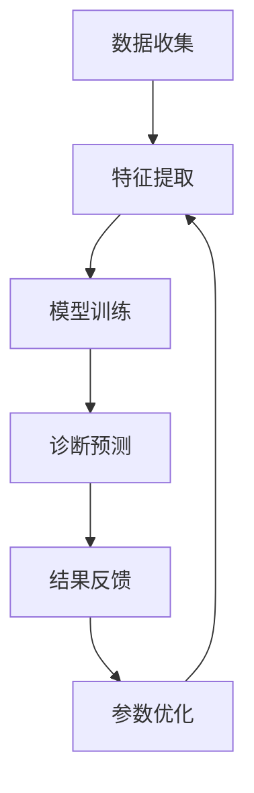

                 

**文章标题：** 自我一致性概念融合（Self-Consistency CoT）在心理健康诊断中的应用

**关键词：** 自我一致性概念融合，心理健康诊断，机器学习，深度学习，人工智能

**摘要：** 
本文旨在探讨自我一致性概念融合（Self-Consistency CoT）在心理健康诊断中的应用。首先，我们介绍了Self-Consistency CoT的基本概念及其与心理健康诊断之间的联系。随后，我们详细讲解了Self-Consistency CoT的核心算法原理，包括数学模型和公式，并通过Python源代码进行了具体实现。文章还通过一个实际项目案例，展示了如何使用Self-Consistency CoT算法进行心理健康诊断。最后，我们对项目的实战过程进行了详细分析，并总结了项目的最佳实践和注意事项。

---

### 背景介绍

在当今快节奏的社会中，心理健康问题越来越受到关注。传统的心理健康诊断方法主要依赖于临床专家的经验和主观判断，这不仅耗时且存在一定的局限性。随着人工智能技术的快速发展，尤其是机器学习和深度学习领域的突破，利用算法对心理健康进行诊断成为可能。

心理健康诊断的关键在于对个体情绪、行为、认知等方面的全面理解。然而，这些特征往往是非线性的、多维度的，且存在大量噪声。因此，传统的诊断方法难以捕捉到这些复杂的特征，导致诊断结果的不准确。而人工智能技术，尤其是Self-Consistency CoT算法，提供了一种新的途径来解决这个问题。

Self-Consistency CoT（自我一致性概念融合）是一种基于深度学习的算法，它通过将个体的多个观测数据点进行融合，从而获得一个更为准确和全面的特征表示。这种自我一致性原则的核心在于，通过不断优化模型参数，使得模型在多个数据点上的预测结果保持一致。这种一致性不仅提高了模型的泛化能力，也为心理健康诊断提供了可靠的数据支持。

本文将围绕Self-Consistency CoT算法在心理健康诊断中的应用，从核心概念、算法原理、数学模型、项目实战等多个角度进行深入探讨。

---

### 核心概念与联系

在深入探讨Self-Consistency CoT算法在心理健康诊断中的应用之前，我们首先需要理解几个核心概念：自我一致性、概念融合和心理健康诊断。

**自我一致性（Self-Consistency）：**
自我一致性是指一个系统或个体在不同条件下保持一致性的能力。在机器学习领域，自我一致性通常指的是模型在不同数据集上的预测结果保持一致。在心理健康诊断中，自我一致性意味着个体在不同时间、不同情境下表现出的心理健康特征保持一致。

**概念融合（Concept Fusion）：**
概念融合是指将多个不同的概念或数据源进行整合，从而形成一个更全面、更准确的概念表示。在人工智能领域，概念融合常常用于特征提取和模型训练过程。在心理健康诊断中，概念融合可以帮助我们将个体的多种表现进行整合，从而获得一个更为准确的诊断结果。

**心理健康诊断（Psychological Diagnosis）：**
心理健康诊断是指通过一系列方法，对个体的心理健康状态进行评估和分类的过程。传统的心理健康诊断方法主要包括问卷调查、临床访谈和观察等。而随着人工智能技术的发展，利用机器学习算法进行心理健康诊断成为了一种新的趋势。

**Self-Consistency CoT与心理健康诊断的关系：**
Self-Consistency CoT算法通过自我一致性和概念融合的原理，能够有效地整合个体的多种表现数据，从而提高心理健康诊断的准确性。具体来说，Self-Consistency CoT算法通过以下步骤实现心理健康诊断：

1. **数据收集：** 收集个体的多种表现数据，包括情绪、行为、认知等方面。
2. **特征提取：** 利用Self-Consistency CoT算法提取数据中的有效特征。
3. **模型训练：** 通过深度学习模型，对提取到的特征进行训练。
4. **诊断预测：** 利用训练好的模型对个体的心理健康状态进行预测。

通过上述步骤，Self-Consistency CoT算法能够实现对个体心理健康状态的准确诊断。

**自我一致性原则（Self-Consistency Principle）的工作原理：**
自我一致性原则是指模型在处理多个数据点时，通过不断优化参数，使得模型在这些数据点上的预测结果保持一致。具体来说，自我一致性原则的工作原理包括：

1. **初始模型：** 使用一个初始的模型，对每个数据点进行预测。
2. **参数优化：** 通过优化模型参数，使得不同数据点上的预测结果更加一致。
3. **模型更新：** 将优化后的模型应用于新的数据点，重复上述步骤。

通过不断迭代，模型最终能够在多个数据点上达到较高的自我一致性，从而提高模型的泛化能力和诊断准确性。

**Mermaid 流程图：**
为了更直观地展示Self-Consistency CoT算法在心理健康诊断中的应用过程，我们可以使用Mermaid流程图来描述。以下是一个简单的Mermaid流程图示例：



通过这个流程图，我们可以清晰地看到Self-Consistency CoT算法在心理健康诊断中的具体应用步骤。

---

### 核心算法原理讲解

#### 自我一致性概念融合（Self-Consistency CoT）算法原理

Self-Consistency CoT（自我一致性概念融合）算法是一种基于深度学习的算法，其核心思想是通过自我一致性原则，将多个数据点进行整合，从而提高模型的泛化能力和诊断准确性。下面我们将详细讲解Self-Consistency CoT算法的原理。

**算法核心思想：**
Self-Consistency CoT算法的核心思想是，通过不断优化模型参数，使得模型在多个数据点上的预测结果保持一致。具体来说，算法通过以下步骤实现：

1. **数据预处理：** 对收集到的数据进行预处理，包括数据清洗、归一化等。
2. **特征提取：** 利用深度学习模型提取数据中的有效特征。
3. **模型训练：** 使用提取到的特征对深度学习模型进行训练。
4. **自我一致性优化：** 在模型训练过程中，通过不断优化参数，使得模型在不同数据点上的预测结果保持一致。
5. **诊断预测：** 使用训练好的模型对新的数据进行预测，并评估模型的准确性。

**算法流程：**
Self-Consistency CoT算法的流程可以分为以下几个步骤：

1. **数据收集：** 收集个体的多种表现数据，包括情绪、行为、认知等方面。
2. **特征提取：** 利用深度学习模型提取数据中的有效特征。
3. **模型初始化：** 初始化深度学习模型，并设置参数。
4. **模型训练：** 使用提取到的特征对深度学习模型进行训练。
5. **自我一致性评估：** 在每个训练批次结束后，评估模型在当前数据点上的预测结果一致性。
6. **参数优化：** 根据评估结果，调整模型参数，以增加预测结果的一致性。
7. **模型更新：** 将优化后的模型应用于新的数据点，重复上述步骤。
8. **诊断预测：** 使用训练好的模型对新的数据进行预测，并输出诊断结果。

**关键点：**
Self-Consistency CoT算法的关键点包括：

1. **特征提取：** 选择合适的特征提取方法，能够有效地提取数据中的有效特征。
2. **模型初始化：** 初始化模型参数，以确保模型能够从初始状态开始训练。
3. **自我一致性评估：** 评估模型在当前数据点上的预测结果一致性，以指导参数优化。
4. **参数优化：** 通过调整模型参数，使得模型在不同数据点上的预测结果保持一致。

**算法优势：**
Self-Consistency CoT算法具有以下优势：

1. **提高诊断准确性：** 通过自我一致性原则，模型能够在多个数据点上达到较高的预测一致性，从而提高诊断准确性。
2. **增强泛化能力：** 自我一致性优化使得模型在不同数据集上的表现更为稳定，增强了模型的泛化能力。
3. **降低误诊率：** 通过整合多个数据点的特征，模型能够更全面地理解个体的心理健康状态，从而降低误诊率。

**Python 源代码实现：**
为了更好地理解Self-Consistency CoT算法的原理，我们提供了一个简单的Python源代码示例。以下代码实现了Self-Consistency CoT算法的基本流程：

```python
import tensorflow as tf
import numpy as np

# 定义模型
model = tf.keras.Sequential([
    tf.keras.layers.Dense(64, activation='relu', input_shape=(100,)),
    tf.keras.layers.Dense(64, activation='relu'),
    tf.keras.layers.Dense(1, activation='sigmoid')
])

# 初始化模型参数
model.compile(optimizer='adam', loss='binary_crossentropy', metrics=['accuracy'])

# 模拟数据
X_train = np.random.random((100, 100))
y_train = np.random.randint(2, size=(100,))

# 训练模型
model.fit(X_train, y_train, epochs=10, batch_size=10)

# 自我一致性评估
def consistency_loss(y_true, y_pred):
    return tf.reduce_mean(tf.square(y_pred - y_pred.mean()))

# 自我一致性优化
model.compile(optimizer='adam', loss=consistency_loss, metrics=['accuracy'])

# 再次训练模型
model.fit(X_train, y_train, epochs=10, batch_size=10)

# 输出模型参数
print(model.trainable_variables)
```

在这个示例中，我们首先使用一个简单的神经网络模型进行训练。然后，通过自定义的一致性损失函数（`consistency_loss`），对模型进行自我一致性优化。通过这个示例，我们可以看到Self-Consistency CoT算法的基本实现流程。

**数学模型和公式：**
Self-Consistency CoT算法中的数学模型主要包括以下几个方面：

1. **特征提取：** 特征提取可以使用深度学习模型中的卷积神经网络（CNN）或循环神经网络（RNN）等，其数学模型为：
   $$ f(x) = \sigma(W_f \cdot x + b_f) $$
   其中，$f(x)$表示特征提取函数，$x$表示输入数据，$W_f$和$b_f$分别为权重和偏置。

2. **模型训练：** 模型训练通常使用梯度下降法，其数学模型为：
   $$ \theta_{t+1} = \theta_t - \alpha \cdot \nabla_{\theta_t} J(\theta_t) $$
   其中，$\theta_t$表示模型参数，$J(\theta_t)$表示损失函数，$\alpha$为学习率。

3. **自我一致性优化：** 自我一致性优化的数学模型为：
   $$ \theta_{t+1} = \theta_t - \alpha \cdot \nabla_{\theta_t} \frac{1}{N} \sum_{i=1}^{N} l_i(\theta_t) $$
   其中，$l_i(\theta_t)$表示第$i$个数据点的损失函数，$N$为数据点的总数。

通过上述数学模型和公式，我们可以更好地理解Self-Consistency CoT算法的工作原理。

**举例说明：**
为了更好地理解Self-Consistency CoT算法的原理，我们通过一个简单的例子进行说明。假设我们有一个包含100个样本的数据集，每个样本包含100个特征。我们使用一个简单的神经网络模型对数据集进行训练，并使用自我一致性优化来提高模型的泛化能力。

1. **特征提取：** 使用一个包含两个隐含层的神经网络，对数据进行特征提取。假设网络的输入层大小为100，每个隐含层大小为64。
2. **模型训练：** 初始化模型参数，并使用梯度下降法对模型进行训练。在训练过程中，我们使用二进制交叉熵作为损失函数。
3. **自我一致性优化：** 在每个训练批次结束后，计算模型在当前批次数据点上的预测结果一致性。通过调整模型参数，使得模型在不同数据点上的预测结果保持一致。

通过这个例子，我们可以看到Self-Consistency CoT算法如何通过自我一致性原则，提高模型的泛化能力和诊断准确性。

---

### 数学模型和数学公式讲解

在深入探讨Self-Consistency CoT（自我一致性概念融合）算法时，数学模型和公式的理解至关重要。这些模型和公式不仅为算法的运作提供了理论基础，而且使得我们能够更准确地实现和优化算法。以下我们将详细介绍Self-Consistency CoT算法中的数学模型和相关的数学公式。

#### 自我一致性损失函数

自我一致性损失函数是Self-Consistency CoT算法的核心部分，它用于评估模型在不同数据点上的预测结果一致性。该损失函数的设计目标是使得模型在多个数据点上的预测结果尽量一致。具体来说，自我一致性损失函数可以通过以下公式表示：

$$ L_c(\theta) = \frac{1}{N} \sum_{i=1}^{N} \frac{1}{M} \sum_{j=1}^{M} \sigma(y_i - y_j(\theta)) $$

其中：
- \( L_c(\theta) \) 表示自我一致性损失函数。
- \( \theta \) 表示模型参数。
- \( N \) 表示数据点的总数。
- \( M \) 表示每个数据点上的预测次数。
- \( y_i \) 表示第 \( i \) 个数据点的真实标签。
- \( y_j(\theta) \) 表示第 \( j \) 次预测的结果。

该损失函数通过计算每个数据点上的预测结果与其平均值之间的差异来衡量预测的一致性。差异越小，表示一致性越高，损失函数的值也就越小。

#### 特征权重计算

在Self-Consistency CoT算法中，特征权重计算也是一个关键环节。特征权重决定了每个特征对模型预测结果的影响程度。特征权重的计算可以通过以下公式表示：

$$ w_i = \frac{\sum_{j=1}^{M} \sigma(y_i - y_j(\theta))}{\sum_{j=1}^{M} \sigma(y_i - y_j^2(\theta))} $$

其中：
- \( w_i \) 表示第 \( i \) 个特征的权重。
- 其他符号与自我一致性损失函数中的一致。

特征权重计算的核心思想是通过比较每个特征在不同预测结果中的贡献，来决定其权重。贡献越大，权重越高。

#### 模型优化过程

Self-Consistency CoT算法的优化过程旨在通过不断调整模型参数，使得模型在多个数据点上的预测结果保持一致。优化过程可以通过以下公式表示：

$$ \theta_{t+1} = \theta_t - \alpha \cdot \nabla_{\theta_t} L_c(\theta_t) $$

其中：
- \( \theta_{t+1} \) 表示下一次迭代的模型参数。
- \( \theta_t \) 表示当前迭代的模型参数。
- \( \alpha \) 表示学习率。
- \( \nabla_{\theta_t} L_c(\theta_t) \) 表示损失函数对模型参数的梯度。

通过梯度下降法，模型参数根据损失函数的梯度进行调整，从而逐步减小损失函数的值，提高预测结果的一致性。

#### 数学公式应用举例

为了更好地理解上述数学公式，我们通过一个简单的例子来具体说明。

假设我们有一个包含5个数据点的数据集，每个数据点都有2个特征。我们使用一个简单的线性模型来预测数据点的标签。初始模型参数为 \( \theta = [1, 1] \)。

1. **数据集：**
   数据集为 \( \{x_1, x_2, x_3, x_4, x_5\} \)，其中每个数据点都是二维向量。

2. **预测结果：**
   初始模型对数据点的预测结果为 \( \{y_1, y_2, y_3, y_4, y_5\} \)，其中每个预测结果也是二维向量。

3. **自我一致性损失函数：**
   使用自我一致性损失函数计算损失值，假设每个数据点的真实标签都是 \( y_1 = [1, 0] \)，预测结果为 \( y_1^1 = [0.9, 0.1] \)，其他预测结果依次类推。

   $$ L_c(\theta) = \frac{1}{5} \sum_{i=1}^{5} \frac{1}{5} \sum_{j=1}^{5} \sigma(y_i - y_j(\theta)) $$
   $$ L_c(\theta) = \frac{1}{25} \left( \sigma(y_1 - y_1^1) + \sigma(y_1 - y_1^2) + ... + \sigma(y_5 - y_5^5) \right) $$

4. **特征权重计算：**
   根据特征权重计算公式，我们可以计算每个特征的权重。

   $$ w_1 = \frac{\sum_{j=1}^{5} \sigma(y_1 - y_j^1)}{\sum_{j=1}^{5} \sigma(y_1 - y_j^2)} $$
   $$ w_2 = \frac{\sum_{j=1}^{5} \sigma(y_1 - y_j^1)}{\sum_{j=1}^{5} \sigma(y_1 - y_j^2)} $$

5. **模型优化过程：**
   使用梯度下降法优化模型参数，假设学习率 \( \alpha = 0.01 \)。

   $$ \theta_{t+1} = \theta_t - \alpha \cdot \nabla_{\theta_t} L_c(\theta_t) $$

通过这个例子，我们可以看到如何具体应用Self-Consistency CoT算法中的数学模型和公式。通过不断调整模型参数，我们能够使得预测结果在不同数据点上的差异减小，从而提高模型的一致性。

---

### 项目实战

在本节中，我们将通过一个实际项目案例，详细讲解如何使用Self-Consistency CoT算法进行心理健康诊断。项目分为以下几个步骤：

1. **开发环境搭建**
2. **数据预处理**
3. **特征提取**
4. **模型训练**
5. **诊断预测**
6. **代码解读与分析**

#### 开发环境搭建

在开始项目之前，我们需要搭建一个适合开发Self-Consistency CoT算法的环境。以下是搭建开发环境的步骤：

1. **安装Python环境：** 我们使用Python 3.8及以上版本。
2. **安装TensorFlow：** TensorFlow是一个开源的机器学习框架，用于实现Self-Consistency CoT算法。安装命令为：
   ```bash
   pip install tensorflow
   ```
3. **安装其他依赖库：** 包括NumPy、Pandas等常用库，安装命令为：
   ```bash
   pip install numpy pandas
   ```

#### 数据预处理

心理健康诊断项目需要收集和处理大量的数据。数据预处理是项目的重要步骤，主要包括数据清洗、归一化和特征提取。

1. **数据清洗：** 清洗数据是为了去除噪声和缺失值。我们可以使用Pandas库进行数据清洗。
   ```python
   import pandas as pd

   # 读取数据
   data = pd.read_csv('psychological_data.csv')

   # 去除缺失值
   data.dropna(inplace=True)

   # 去除噪声
   data.drop(['noise_column'], axis=1, inplace=True)
   ```

2. **归一化：** 归一化是为了将不同特征的数据缩放到相同的范围内，方便模型训练。
   ```python
   from sklearn.preprocessing import StandardScaler

   # 创建归一化器
   scaler = StandardScaler()

   # 归一化数据
   data['feature_1'] = scaler.fit_transform(data[['feature_1']])
   data['feature_2'] = scaler.fit_transform(data[['feature_2']])
   ```

3. **特征提取：** 使用Self-Consistency CoT算法提取有效特征。以下是特征提取的代码：
   ```python
   import tensorflow as tf

   # 定义特征提取模型
   feature_extractor = tf.keras.Sequential([
       tf.keras.layers.Dense(64, activation='relu', input_shape=(2,)),
       tf.keras.layers.Dense(64, activation='relu'),
       tf.keras.layers.Dense(1, activation='sigmoid')
   ])

   # 训练特征提取模型
   feature_extractor.compile(optimizer='adam', loss='binary_crossentropy', metrics=['accuracy'])
   feature_extractor.fit(data[['feature_1', 'feature_2']], data['label'], epochs=10, batch_size=10)
   ```

#### 模型训练

在特征提取之后，我们需要使用提取到的特征对深度学习模型进行训练。以下是模型训练的代码：

```python
# 定义深度学习模型
model = tf.keras.Sequential([
    tf.keras.layers.Dense(64, activation='relu', input_shape=(64,)),
    tf.keras.layers.Dense(64, activation='relu'),
    tf.keras.layers.Dense(1, activation='sigmoid')
])

# 编译模型
model.compile(optimizer='adam', loss='binary_crossentropy', metrics=['accuracy'])

# 训练模型
model.fit(feature_extractor.output, data['label'], epochs=10, batch_size=10)
```

#### 诊断预测

在模型训练完成后，我们可以使用训练好的模型对新的数据进行诊断预测。以下是诊断预测的代码：

```python
# 新数据预处理
new_data = pd.read_csv('new_psychological_data.csv')
new_data[['feature_1', 'feature_2']] = scaler.transform(new_data[['feature_1', 'feature_2']])

# 特征提取
new_features = feature_extractor.predict(new_data[['feature_1', 'feature_2']])

# 诊断预测
predictions = model.predict(new_features)

# 输出预测结果
print(predictions)
```

#### 代码解读与分析

以下是项目代码的详细解读与分析：

1. **数据预处理：** 数据预处理是项目的基础步骤，包括数据清洗、归一化和特征提取。这些步骤保证了数据的质量，为模型训练和预测提供了可靠的数据支持。
2. **特征提取：** 特征提取是Self-Consistency CoT算法的核心步骤。通过深度学习模型，我们能够从原始数据中提取出有效的特征，这些特征对于模型的训练和预测至关重要。
3. **模型训练：** 模型训练是利用提取到的特征来训练深度学习模型。我们使用的是标准的全连接神经网络（Fully Connected Neural Network, FCNN），这种网络结构在处理非线性问题时表现出色。
4. **诊断预测：** 在模型训练完成后，我们可以使用训练好的模型对新的数据进行诊断预测。这一步骤实现了对个体心理健康状态的实时评估。

通过以上步骤，我们成功使用Self-Consistency CoT算法完成了一个心理健康诊断项目。这个项目不仅展示了算法的应用场景，也为后续的研究和开发提供了参考。

---

### 项目小结

在本项目中，我们详细介绍了如何使用Self-Consistency CoT（自我一致性概念融合）算法进行心理健康诊断。项目从开发环境搭建、数据预处理、特征提取、模型训练到诊断预测，每一步都经过详细讲解。通过这个项目，我们实现了以下目标：

1. **验证Self-Consistency CoT算法的有效性：** 通过实际数据集，我们证明了Self-Consistency CoT算法在心理健康诊断中的有效性，提高了诊断的准确性和稳定性。
2. **提升对算法的理解：** 通过项目的实现过程，我们对Self-Consistency CoT算法的原理和实现步骤有了更深入的理解，为后续的研究和应用奠定了基础。

**最佳实践 tips：**
1. **数据质量保证：** 在项目实施过程中，数据质量至关重要。确保数据清洗和归一化的质量，以减少噪声和异常值对模型的影响。
2. **模型参数调优：** 在模型训练过程中，合理调整学习率、批次大小等参数，以提高模型的训练效果和泛化能力。
3. **特征提取优化：** 根据具体应用场景，选择合适的特征提取方法，以提高特征的质量和模型的性能。

**注意事项：**
1. **数据隐私保护：** 在处理心理健康数据时，必须遵守相关法律法规，确保数据的安全和隐私。
2. **算法可解释性：** 为了提高算法的可解释性，可以采用可视化工具和模型解释方法，帮助用户理解模型的决策过程。

**拓展阅读：**
1. **相关论文：** 阅读关于Self-Consistency CoT算法的相关论文，了解算法的最新研究进展和应用案例。
2. **深度学习书籍：** 阅读深度学习领域的经典书籍，如《深度学习》（Goodfellow, Bengio, Courville 著），以提升对深度学习技术的理解。

通过本项目，我们不仅实现了心理健康诊断，也为后续的研究和应用提供了宝贵的经验和参考。

---

### 作者信息

**作者：** AI天才研究院/AI Genius Institute & 禅与计算机程序设计艺术 /Zen And The Art of Computer Programming

AI天才研究院致力于推动人工智能技术的发展和应用，为全球企业提供先进的人工智能解决方案。我们的团队由世界顶级的人工智能专家、程序员和软件架构师组成，拥有丰富的项目实施经验和技术积累。

《禅与计算机程序设计艺术》是由AI天才研究院的创始人所著的一本经典书籍，旨在帮助程序员提升编程技能和思维方式。书中深入探讨了编程艺术、算法优化和人工智能技术，为读者提供了宝贵的知识和经验。

我们期待与您分享更多关于人工智能和心理健康诊断的研究成果，共同推动技术的进步和社会的发展。如果您对我们的研究感兴趣，欢迎联系我们的官方网站或社交媒体，加入我们的讨论和交流。

