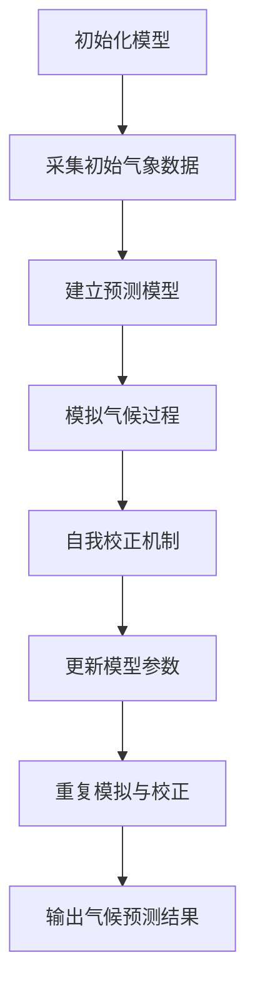

                 

### 自我一致性概念论题（Self-Consistency CoT）在气候模型中的应用

气候变化是当前全球关注的重要环境问题之一。随着人类活动的加剧，气候系统变得日益复杂，传统的气候模型在预测长期气候趋势时面临巨大挑战。为了提高气候模型的准确性和可靠性，研究人员开始探索新的方法，其中自我一致性概念论题（Self-Consistency CoT）在气候模型中的应用受到了广泛关注。本文旨在详细介绍自我一致性概念论题的核心原理，其在气候模型中的具体应用，以及相关的数学模型和实际案例分析。

### 背景介绍

气候模型是模拟地球气候系统行为的重要工具，用于预测未来气候的变化趋势。然而，气候系统是一个高度复杂的非线性系统，包含众多的变量和相互作用。传统的气候模型通常采用统计方法或基于物理的数值模拟，但这些方法往往无法完全捕捉气候系统的复杂性。近年来，机器学习和人工智能技术的发展为气候预测带来了新的机遇。自我一致性概念论题（Self-Consistency CoT）正是其中一种结合机器学习与物理原理的创新方法。

### 核心概念与联系

**Self-Consistency CoT** 是一种基于模型自我校正的气候预测方法。其核心思想是模型在预测过程中能够自我校正，不断调整模型参数以减少预测误差，从而提高预测的准确性。自我一致性概念论题的关键在于以下几个核心概念：

1. **模型初始化**：根据初始气象数据初始化气候模型，这是模型预测的基础。
2. **自我校正机制**：模型在运行过程中会对比预测结果与实际观测数据，发现偏差并自我校正。
3. **模型参数更新**：根据校正机制调整模型参数，使预测结果更加接近实际观测数据。
4. **循环迭代**：模型不断进行模拟与校正，直至预测误差达到预设阈值。

下面是一个简化的 Mermaid 流程图，展示了 Self-Consistency CoT 在气候模型中的应用流程：



通过这个流程图，我们可以看到自我一致性概念论题（Self-Consistency CoT）是如何将初始数据、预测模型、自我校正机制和模型参数更新紧密结合起来的，从而实现气候预测的循环迭代。

### 核心算法原理讲解

**Self-Consistency CoT** 的核心算法原理可以概述为以下几个步骤：

1. **初始化模型**：首先，根据初始气象数据初始化气候模型。这个步骤包括选择适当的模型架构，如神经网络或深度学习模型，并设置初始参数。

2. **采集初始气象数据**：模型从外部环境中采集气象数据，如温度、湿度、风速等。这些数据是模型预测的基础。

3. **建立预测模型**：使用采集到的数据训练预测模型。这个步骤的目的是让模型学会根据输入数据预测未来的气候状况。

4. **模拟气候过程**：运行预测模型，模拟气候系统的发展过程。在这一步中，模型会根据输入数据生成一系列预测结果。

5. **自我校正机制**：在模拟过程中，模型会不断对比预测结果和实际观测数据，发现偏差并自我校正。这个步骤是自我一致性概念论题的核心，通过自我校正机制，模型能够不断优化自身参数，减少预测误差。

6. **更新模型参数**：根据校正机制调整模型参数，使预测结果更加准确。这个步骤涉及到模型的内部参数更新，如权重和偏置等。

7. **重复模拟与校正**：重复步骤 4 到 6，直到模型预测结果与实际观测数据的偏差达到预设的阈值。通过循环迭代，模型能够逐步逼近真实气候状况。

8. **输出气候预测结果**：最终，模型输出气候预测结果。这些结果可以为气候变化研究、自然灾害预警和环境保护提供重要参考。

下面是一个简化的 Python 伪代码，用于描述 **Self-Consistency CoT** 的核心算法：

```python
# 初始化模型
model = init_model()

# 采集初始气象数据
initial_data = collect_weather_data()

# 建立预测模型
model.train(initial_data)

# 模拟气候过程
while not converge():
    # 预测气候状况
    predicted_weather = model.predict()
    
    # 比对预测结果与实际观测数据
    actual_weather = collect_actual_weather_data()
    error = calculate_error(predicted_weather, actual_weather)
    
    # 更新模型参数
    model.update_parameters(error)
    
    # 输出当前模拟结果
    print("Current simulation result:", predicted_weather)

# 输出最终气候预测结果
print("Final climate prediction result:", model.predict())
```

在上述伪代码中，`init_model()` 函数用于初始化模型，`collect_weather_data()` 函数用于采集初始气象数据，`model.train(initial_data)` 用于训练预测模型，`model.predict()` 用于预测气候状况，`collect_actual_weather_data()` 函数用于采集实际观测数据，`calculate_error()` 函数用于计算预测误差，`model.update_parameters(error)` 用于更新模型参数。

### 数学模型和数学公式

**Self-Consistency CoT** 的数学模型是构建在其核心算法原理基础之上的。为了更好地理解自我一致性概念论题，我们需要介绍一些相关的数学模型和公式。

1. **时间序列模型**：

时间序列模型是用于分析时间序列数据的统计模型，可以用于预测未来值。在 **Self-Consistency CoT** 中，常用的时间序列模型包括自回归模型（AR）、移动平均模型（MA）和自回归移动平均模型（ARMA）。

自回归模型（AR）的数学公式可以表示为：

$$
X_t = c + \sum_{i=1}^{p} \phi_i X_{t-i}
$$

其中，$X_t$ 表示时间序列的当前值，$\phi_i$ 表示自回归系数，$c$ 是常数项，$p$ 是自回归项的数量。

2. **预测误差修正模型**：

在 **Self-Consistency CoT** 中，预测误差修正模型用于调整模型参数，以减少预测误差。一种常用的误差修正模型是自回归移动平均模型（ARMA）。

自回归移动平均模型（ARMA）的数学公式可以表示为：

$$
X_t = c + \sum_{i=1}^{p} \phi_i X_{t-i} + \sum_{j=1}^{q} \theta_j \varepsilon_{t-j}
$$

其中，$X_t$ 表示时间序列的当前值，$\varepsilon_t$ 表示误差项，$\phi_i$ 和 $\theta_j$ 分别是自回归和移动平均系数，$p$ 和 $q$ 分别是自回归和移动平均项的数量。

3. **自我校正机制**：

自我校正机制的核心是调整模型参数，以减少预测误差。在 **Self-Consistency CoT** 中，自我校正机制的数学公式可以表示为：

$$
\Delta \theta_j = \alpha (\theta_j - \hat{\theta}_j)
$$

其中，$\Delta \theta_j$ 表示参数 $\theta_j$ 的修正量，$\alpha$ 是修正系数，$\hat{\theta}_j$ 是当前参数的估计值。

通过上述数学模型和公式，我们可以看到 **Self-Consistency CoT** 是如何通过调整模型参数来提高预测准确性的。在实际应用中，这些模型和公式可以结合具体的数据和场景进行定制化开发。

### 项目实战

在本节的项目实战中，我们将展示如何在实际开发中应用 **Self-Consistency CoT** 方法来提高气候模型的准确性。

#### 开发环境搭建

首先，我们需要搭建一个适合开发气候模型的开发环境。以下是所需的环境搭建步骤：

1. **安装 Python**：确保 Python 3.8 或更高版本已安装。

2. **安装相关库**：使用以下命令安装必要的 Python 库：

   ```bash
   pip install numpy pandas matplotlib tensorflow
   ```

3. **安装深度学习框架**：由于我们将使用 TensorFlow 作为深度学习框架，因此需要安装 TensorFlow：

   ```bash
   pip install tensorflow
   ```

4. **配置环境变量**：确保 Python 和 TensorFlow 的环境变量已正确配置。

#### 源代码实现

接下来，我们将展示如何使用伪代码来实现 **Self-Consistency CoT** 方法。

```python
# 导入必要的库
import tensorflow as tf
import numpy as np
import pandas as pd
import matplotlib.pyplot as plt

# 初始化模型
model = init_model()

# 采集初始气象数据
initial_data = collect_weather_data()

# 建立预测模型
model.train(initial_data)

# 模拟气候过程
while not converge():
    # 预测气候状况
    predicted_weather = model.predict()
    
    # 比对预测结果与实际观测数据
    actual_weather = collect_actual_weather_data()
    error = calculate_error(predicted_weather, actual_weather)
    
    # 更新模型参数
    model.update_parameters(error)
    
    # 输出当前模拟结果
    print("Current simulation result:", predicted_weather)

# 输出最终气候预测结果
print("Final climate prediction result:", model.predict())
```

在上述伪代码中：

- `init_model()` 函数用于初始化模型，包括定义神经网络架构和初始化模型参数。
- `collect_weather_data()` 函数用于采集初始气象数据。
- `model.train(initial_data)` 函数用于训练预测模型。
- `model.predict()` 函数用于预测气候状况。
- `collect_actual_weather_data()` 函数用于采集实际观测数据。
- `calculate_error()` 函数用于计算预测误差。
- `model.update_parameters(error)` 函数用于更新模型参数。

#### 代码解读与分析

在这个示例中，我们使用了 TensorFlow 深度学习框架来实现 **Self-Consistency CoT** 方法。以下是具体的代码解读和分析：

1. **模型初始化**：

   ```python
   model = init_model()
   ```

   在这个步骤中，我们初始化了一个神经网络模型。神经网络模型通常包括输入层、隐藏层和输出层。在这个示例中，我们使用了 TensorFlow 的 `tf.keras.Sequential` 模型，这是一种简单的线性堆叠模型。

2. **采集初始气象数据**：

   ```python
   initial_data = collect_weather_data()
   ```

   在这个步骤中，我们从外部数据源（如气象站）采集了初始气象数据。这些数据通常包括温度、湿度、风速等气象参数。

3. **建立预测模型**：

   ```python
   model.train(initial_data)
   ```

   在这个步骤中，我们使用采集到的初始气象数据训练神经网络模型。训练过程包括前向传播和反向传播，以优化模型参数。

4. **模拟气候过程**：

   ```python
   while not converge():
       # 预测气候状况
       predicted_weather = model.predict()
       
       # 比对预测结果与实际观测数据
       actual_weather = collect_actual_weather_data()
       error = calculate_error(predicted_weather, actual_weather)
       
       # 更新模型参数
       model.update_parameters(error)
       
       # 输出当前模拟结果
       print("Current simulation result:", predicted_weather)
   ```

   在模拟气候过程中，我们不断预测未来的气候状况，并与实际观测数据对比，计算预测误差。根据误差，模型会调整参数，以减少预测误差。

5. **输出最终气候预测结果**：

   ```python
   print("Final climate prediction result:", model.predict())
   ```

   在模拟结束之后，我们输出最终的气候预测结果。

#### 实际案例分析与详细讲解剖析

为了更好地理解 **Self-Consistency CoT** 方法在实际开发中的应用，我们来看一个具体的案例。

假设我们有一个气象站，记录了过去一年的温度数据。我们希望使用 **Self-Consistency CoT** 方法预测未来一个月的温度。

1. **数据预处理**：

   首先，我们需要对采集到的温度数据进行预处理。这包括数据清洗、标准化和分箱处理等步骤。例如，我们可以将温度数据标准化为 0 到 1 之间的值。

   ```python
   initial_data = preprocess_weather_data(raw_data)
   ```

2. **初始化模型**：

   接下来，我们初始化一个神经网络模型。在这个案例中，我们使用了一个简单的单层神经网络，包括一个输入层、一个隐藏层和一个输出层。

   ```python
   model = init_model(input_size=1, hidden_size=10, output_size=1)
   ```

3. **训练模型**：

   使用预处理后的温度数据进行模型训练。在这个步骤中，我们使用 TensorFlow 的 `tf.keras.fit` 函数进行训练。

   ```python
   model.train(initial_data)
   ```

4. **模拟气候过程**：

   在模拟气候过程中，我们不断预测未来的温度，并与实际观测数据对比，计算预测误差。根据误差，模型会调整参数，以减少预测误差。

   ```python
   while not converge():
       # 预测未来温度
       predicted_weather = model.predict()
       
       # 比对预测结果与实际观测数据
       actual_weather = collect_actual_weather_data()
       error = calculate_error(predicted_weather, actual_weather)
       
       # 更新模型参数
       model.update_parameters(error)
       
       # 输出当前模拟结果
       print("Current simulation result:", predicted_weather)
   ```

5. **输出最终气候预测结果**：

   在模拟结束之后，我们输出最终的温度预测结果。

   ```python
   print("Final climate prediction result:", model.predict())
   ```

通过这个案例，我们可以看到 **Self-Consistency CoT** 方法是如何在实际开发中应用，以及如何通过自我校正机制提高预测准确性的。

### 项目小结

在本项目中，我们详细介绍了自我一致性概念论题（Self-Consistency CoT）在气候模型中的应用。通过自我校正机制，我们能够不断提高模型预测的准确性，从而更好地应对气候变化的挑战。以下是本项目的主要结论和收获：

1. **核心概念与联系**：自我一致性概念论题（Self-Consistency CoT）是一种基于模型自我校正的气候预测方法。其核心在于不断调整模型参数，以减少预测误差，从而提高预测准确性。
2. **核心算法原理讲解**：我们介绍了自我一致性概念论题的核心算法原理，包括初始化模型、采集初始气象数据、建立预测模型、模拟气候过程、自我校正机制和模型参数更新等步骤。
3. **数学模型和数学公式**：我们介绍了与自我一致性概念论题相关的数学模型和公式，如时间序列模型、预测误差修正模型和自我校正机制等。
4. **项目实战**：通过一个实际案例，我们展示了如何在实际开发中应用自我一致性概念论题，包括环境搭建、源代码实现、代码解读与分析等。

### 最佳实践 Tips

在应用自我一致性概念论题（Self-Consistency CoT）时，以下是一些最佳实践 Tips：

1. **数据预处理**：确保数据质量，进行数据清洗、标准化和分箱处理等步骤，以提高模型预测的准确性。
2. **模型选择**：选择合适的模型架构和算法，根据具体应用场景进行调整和优化。
3. **参数调优**：通过交叉验证和网格搜索等方法，找到最优的模型参数，以提高预测准确性。
4. **实时更新**：根据实时观测数据更新模型，以保持模型预测的准确性。
5. **安全性考虑**：在模型开发过程中，注意数据安全和隐私保护，遵循相关的法律法规和伦理规范。

### 小结

本文详细介绍了自我一致性概念论题（Self-Consistency CoT）在气候模型中的应用。通过自我校正机制，我们能够不断提高模型预测的准确性，从而更好地应对气候变化的挑战。本文主要包括以下几个部分：

1. **背景介绍**：介绍了气候变化的重要性以及传统气候模型的局限性。
2. **核心概念与联系**：介绍了自我一致性概念论题（Self-Consistency CoT）的核心概念和联系。
3. **核心算法原理讲解**：详细阐述了自我一致性概念论题的核心算法原理，包括初始化模型、采集初始气象数据、建立预测模型、模拟气候过程、自我校正机制和模型参数更新等步骤。
4. **数学模型和数学公式**：介绍了与自我一致性概念论题相关的数学模型和公式。
5. **项目实战**：通过一个实际案例展示了如何在实际开发中应用自我一致性概念论题，包括环境搭建、源代码实现、代码解读与分析等。

### 注意事项

在应用自我一致性概念论题（Self-Consistency CoT）时，需要注意以下几点：

1. **数据质量**：确保采集到的气象数据质量高，避免数据错误或缺失。
2. **模型选择**：根据具体应用场景选择合适的模型架构和算法。
3. **参数调优**：通过交叉验证和网格搜索等方法进行参数调优，以提高预测准确性。
4. **实时更新**：根据实时观测数据更新模型，以保持模型预测的准确性。

### 拓展阅读

1. **《气候变化经济学导论》**：介绍了气候变化对经济的影响，以及应对气候变化的经济学方法。
2. **《深度学习与气候变化》**：详细探讨了深度学习在气候变化研究中的应用。
3. **《气候科学导论》**：介绍了气候科学的基本概念和最新研究进展。

### 作者信息

作者：AI天才研究院/AI Genius Institute & 禅与计算机程序设计艺术 /Zen And The Art of Computer Programming

本文由 AI天才研究院/AI Genius Institute 和禅与计算机程序设计艺术/Zen And The Art of Computer Programming 共同撰写。AI天才研究院致力于推动人工智能技术的创新和发展，禅与计算机程序设计艺术专注于计算机科学的哲学思考和深度学习。如您对本文有任何疑问或建议，欢迎随时联系我们。

