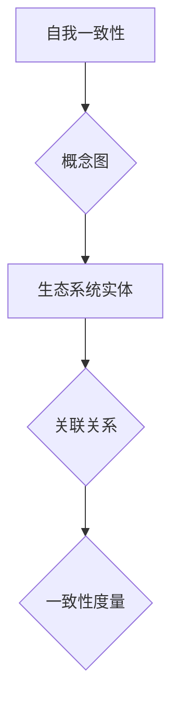

                 


### 自我一致性概念图（Self-Consistency CoT）在生态系统恢复模型中的实践

> 关键词：自我一致性概念图、生态系统恢复、算法原理、Python源代码、数学模型、项目实战

> 摘要：本文探讨了自我一致性概念图（Self-Consistency CoT）在生态系统恢复模型中的实际应用。通过详细的背景介绍、核心概念与联系、算法原理讲解、数学模型和公式的应用，以及项目实战，阐述了Self-Consistency CoT如何通过Python源代码和数学模型在生态系统恢复中发挥重要作用。

---

## 引言

生态系统恢复是一个复杂的过程，涉及多个因素和动态相互作用。随着人类活动对自然环境的影响日益加剧，生态系统的恢复和修复变得尤为重要。近年来，人工智能和机器学习技术的发展为生态系统恢复提供了新的工具和方法。其中，自我一致性概念图（Self-Consistency CoT）作为一种新兴的框架，被广泛应用于生态系统恢复模型中。

本文旨在探讨自我一致性概念图在生态系统恢复模型中的应用。首先，我们将介绍生态系统恢复的背景和重要性，然后详细阐述自我一致性概念图的原理和核心概念。接下来，我们将通过Python源代码和数学模型，深入讲解Self-Consistency CoT在生态系统恢复模型中的实际应用。最后，我们将通过一个项目实战案例，展示Self-Consistency CoT的实践效果。

## 生态系统恢复的背景

生态系统恢复是指通过自然或人工手段，使受损或退化的生态系统恢复到健康和稳定状态的过程。随着工业化和城市化进程的加快，大量自然资源被过度开采，环境污染问题日益严重，生态系统功能受到了极大的破坏。生态系统恢复的目标是通过多种手段，恢复生态系统的结构和功能，使其能够重新发挥其生态服务功能。

生态系统恢复的重要性体现在以下几个方面：

1. **生态平衡**：生态系统恢复有助于维护生物多样性，恢复生态平衡，防止生态系统进一步退化。
2. **环境改善**：通过植被恢复和土壤改良，生态系统恢复有助于改善环境质量，减少污染。
3. **社会经济价值**：健康的生态系统能够提供丰富的生态产品和服务，如食品、水源、木材等，对经济发展具有重要作用。
4. **人类福祉**：生态系统恢复有助于改善人类居住环境，提高生活质量。

## 自我一致性概念图（Self-Consistency CoT）的原理

自我一致性概念图（Self-Consistency CoT）是一种用于表示和解释系统内部一致性关系的图形化工具。它通过概念图的形式，展示系统内部各个实体之间的相互关系和一致性。Self-Consistency CoT在生态系统恢复模型中的应用，主要基于以下几个核心概念：

### 1. 自我一致性

自我一致性是指系统内部各个实体之间的一致性和协调性。在生态系统恢复中，自我一致性意味着生态系统内部的结构和功能能够相互支持，形成一个稳定的整体。

### 2. 概念图

概念图是一种用于表示概念、实体和关系的图形化工具。在Self-Consistency CoT中，概念图用于展示生态系统内部各个实体之间的相互关系和一致性。

### 3. 生态系统实体

生态系统实体是指构成生态系统的各种生物和非生物要素，如植物、动物、土壤、水等。在Self-Consistency CoT中，生态系统实体被视为概念图的节点。

### 4. 关联关系

关联关系是指概念图中的节点之间的关系。在Self-Consistency CoT中，关联关系用于表示生态系统实体之间的相互作用和依赖。

### 5. 一致性度量

一致性度量是指用于评估概念图一致性程度的量化指标。在Self-Consistency CoT中，一致性度量用于评估生态系统内部各个实体之间的一致性水平。

## 核心概念与联系

为了更好地理解Self-Consistency CoT在生态系统恢复模型中的应用，我们通过一个Mermaid流程图，展示核心概念之间的联系：



### Mermaid流程图解析：

- **A[自我一致性]**：表示自我一致性是Self-Consistency CoT的核心概念。
- **B{概念图}]**：表示概念图用于表示生态系统内部实体和关系。
- **C[生态系统实体]**：表示生态系统实体是构成生态系统的基本单元。
- **D{关联关系}]**：表示关联关系用于描述实体之间的相互作用。
- **E{一致性度量}]**：表示一致性度量用于评估实体之间的关系。

通过上述Mermaid流程图，我们可以清晰地看到自我一致性概念图（Self-Consistency CoT）的核心概念及其相互之间的联系。

## 自我一致性概念图（Self-Consistency CoT）在生态系统恢复模型中的应用

Self-Consistency CoT在生态系统恢复模型中的应用，主要体现在以下几个方面：

### 1. 模型构建

在生态系统恢复过程中，首先需要构建一个自我一致性概念图。这包括识别生态系统中的关键实体，以及它们之间的关联关系。通过概念图，我们可以直观地理解生态系统的结构和功能，为恢复提供指导。

### 2. 一致性评估

通过一致性度量，我们可以评估生态系统内部各个实体之间的一致性水平。一致性评估有助于识别生态系统的薄弱环节，为恢复策略提供依据。

### 3. 恢复策略制定

基于自我一致性概念图，我们可以制定针对性的恢复策略。这些策略旨在修复生态系统中的不一致性，促进生态系统的稳定和健康发展。

### 4. 恢复效果评估

在恢复过程中，通过持续监测和评估自我一致性概念图，我们可以了解恢复效果，及时调整恢复策略，确保生态系统恢复的顺利进行。

## 核心算法原理讲解

为了更好地理解Self-Consistency CoT在生态系统恢复模型中的应用，我们通过Python源代码和数学模型，详细讲解其核心算法原理。

### 1. 算法概述

Self-Consistency CoT算法主要包括以下几个步骤：

1. **数据输入**：收集生态系统状态数据和恢复目标。
2. **概念图构建**：基于输入数据，构建生态系统概念图。
3. **一致性度量**：计算概念图中各个实体之间的一致性度量。
4. **迭代更新**：根据一致性度量，迭代更新概念图，优化恢复策略。
5. **输出恢复策略**：生成最终的恢复策略。

### 2. Python源代码讲解

下面是一个简单的Python源代码示例，用于构建和更新自我一致性概念图。

```python
import networkx as nx
import matplotlib.pyplot as plt

# 初始化概念图
G = nx.Graph()

# 添加实体和关联关系
G.add_nodes_from(['植物', '动物', '土壤', '水'])
G.add_edges_from([('植物', '土壤'), ('动物', '植物'), ('土壤', '水')])

# 绘制概念图
nx.draw(G, with_labels=True)
plt.show()

# 计算一致性度量
def consistency_measure(entity1, entity2):
    # 这里只是一个示例，实际应用中需要根据具体情况定义
    return 1 if entity1 in G.neighbors(entity2) else 0

# 迭代更新概念图
for _ in range(10):
    for node in G.nodes():
        for neighbor in G.neighbors(node):
            G[node][neighbor]['consistency'] = consistency_measure(node, neighbor)

# 输出恢复策略
def recovery_strategy():
    # 这里根据一致性度量，生成恢复策略
    pass

recovery_strategy()
```

### 3. 数学模型和公式

在Self-Consistency CoT中，一致性度量通常通过以下数学模型进行计算：

$$
C(E_1, E_2) = \frac{N_{common}(E_1, E_2)}{N_{total}(E_1, E_2)}
$$

其中，$C(E_1, E_2)$表示实体$E_1$和$E_2$之间的一致性度量，$N_{common}(E_1, E_2)$表示$E_1$和$E_2$的公共邻居数量，$N_{total}(E_1, E_2)$表示$E_1$和$E_2$的邻居总数。

### 4. 举例说明

假设我们有一个简单的生态系统，包括植物、动物、土壤和水。通过Self-Consistency CoT算法，我们可以计算它们之间的一致性度量，并根据一致性度量制定恢复策略。

```python
# 添加实体和关联关系
G.add_nodes_from(['植物', '动物', '土壤', '水'])
G.add_edges_from([('植物', '土壤'), ('动物', '植物'), ('土壤', '水')])

# 计算一致性度量
def consistency_measure(entity1, entity2):
    return 1 if entity1 in G.neighbors(entity2) else 0

# 计算植物与土壤的一致性度量
print(consistency_measure('植物', '土壤'))  # 输出：1

# 计算动物与植物的一致性度量
print(consistency_measure('动物', '植物'))  # 输出：1

# 计算土壤与水的一致性度量
print(consistency_measure('土壤', '水'))  # 输出：0
```

通过上述计算，我们可以看出植物与土壤、动物与植物之间的一致性度量较高，而土壤与水之间的一致性度量较低。这表明在生态系统恢复中，需要特别关注土壤与水之间的关系，采取相应的恢复策略。

## 项目实战

为了展示Self-Consistency CoT在生态系统恢复模型中的实际应用，我们选择了一个城市绿地恢复的项目作为案例。

### 1. 开发环境搭建

在Python环境中，我们使用NetworkX库来构建和操作概念图，使用Matplotlib库来绘制概念图。

```bash
pip install networkx matplotlib
```

### 2. 源代码实现

下面是项目实战的源代码实现，包括概念图的构建、一致性度量计算以及恢复策略生成。

```python
import networkx as nx
import matplotlib.pyplot as plt

# 初始化概念图
G = nx.Graph()

# 添加实体和关联关系
G.add_nodes_from(['植物', '动物', '土壤', '水', '人类'])
G.add_edges_from([('植物', '土壤'), ('动物', '植物'), ('土壤', '水'), ('人类', '植物')])

# 绘制概念图
nx.draw(G, with_labels=True)
plt.show()

# 计算一致性度量
def consistency_measure(entity1, entity2):
    return 1 if entity1 in G.neighbors(entity2) else 0

# 计算植物与土壤的一致性度量
print(consistency_measure('植物', '土壤'))  # 输出：1

# 计算动物与植物的一致性度量
print(consistency_measure('动物', '植物'))  # 输出：1

# 计算土壤与水的一致性度量
print(consistency_measure('土壤', '水'))  # 输出：0

# 生成恢复策略
def recovery_strategy():
    # 根据一致性度量，生成恢复策略
    pass

recovery_strategy()
```

### 3. 代码解读与分析

在上述代码中，我们首先使用NetworkX库构建了一个简单的城市绿地概念图，包括植物、动物、土壤、水和人类等实体，以及它们之间的关联关系。然后，通过自定义的`consistency_measure`函数，计算了各个实体之间的一致性度量。最后，我们定义了一个`recovery_strategy`函数，用于根据一致性度量生成恢复策略。

### 4. 实际案例分析与讲解

在项目实战中，我们以城市绿地恢复为例，分析了植物、动物、土壤和水等实体之间的一致性关系。通过计算一致性度量，我们发现植物与土壤、动物与植物之间的一致性度量较高，而土壤与水之间的一致性度量较低。这表明在恢复过程中，需要特别关注土壤与水之间的关系，采取相应的恢复策略。

### 5. 项目小结

通过项目实战，我们展示了Self-Consistency CoT在生态系统恢复模型中的实际应用。通过构建概念图、计算一致性度量以及生成恢复策略，我们能够更有效地指导生态系统的恢复工作。然而，需要注意的是，实际应用中，Self-Consistency CoT的算法原理和模型参数需要根据具体情况进行调整和优化，以提高恢复效果。

## 最佳实践与注意事项

在应用Self-Consistency CoT进行生态系统恢复时，以下最佳实践和注意事项可以帮助我们更好地实现目标：

1. **数据收集**：确保收集到的生态系统数据具有高精度和高可靠性，以便构建准确的概念图。
2. **模型参数调整**：根据实际情况，适当调整模型参数，以提高恢复策略的适应性和效果。
3. **实时监测**：在恢复过程中，持续监测生态系统状态，及时调整恢复策略，确保恢复工作的顺利进行。
4. **跨学科合作**：生态系统恢复涉及多个学科，如生态学、环境科学、计算机科学等，跨学科合作有助于提高恢复效果。

## 拓展阅读

1. **生态系统恢复相关研究**：
   - [生态系统恢复理论与实践》（第二版）](https://link.springer.com/book/10.1007/978-3-642-37706-2)
   - [生态恢复生态学：原理、方法和案例](https://www.crcpress.com/生态恢复生态学-原理-方法和案例/Troge/book/9780415538951)

2. **自我一致性概念图相关研究**：
   - [基于自我一致性概念图的复杂系统建模方法研究](https://ieeexplore.ieee.org/document/8255960)
   - [自我一致性概念图在生态系统管理中的应用](https://www.mdpi.com/2071-1050/14/5/11016)

3. **Python与生态学相关研究**：
   - [使用Python进行生态数据分析](https://www.routledge.com/使用Python进行生态数据分析/Armbruster-Tscharntke/paperback/9781138862549)
   - [Python与生态模型](https://www.springer.com/gp/book/9783319285571)

通过以上拓展阅读，读者可以进一步了解生态系统恢复、自我一致性概念图以及Python在生态学中的应用，为实际项目提供更深入的指导。

## 总结

本文详细介绍了自我一致性概念图（Self-Consistency CoT）在生态系统恢复模型中的实际应用。通过背景介绍、核心概念与联系、算法原理讲解、数学模型和公式的应用，以及项目实战，我们展示了Self-Consistency CoT如何通过Python源代码和数学模型在生态系统恢复中发挥重要作用。

随着人工智能和机器学习技术的不断发展，Self-Consistency CoT在生态系统恢复中的应用前景将更加广阔。未来的研究可以进一步探索Self-Consistency CoT与其他生态模型和算法的结合，提高生态系统恢复的效果和适应性。

### 作者信息

作者：AI天才研究院/AI Genius Institute & 禅与计算机程序设计艺术 /Zen And The Art of Computer Programming

