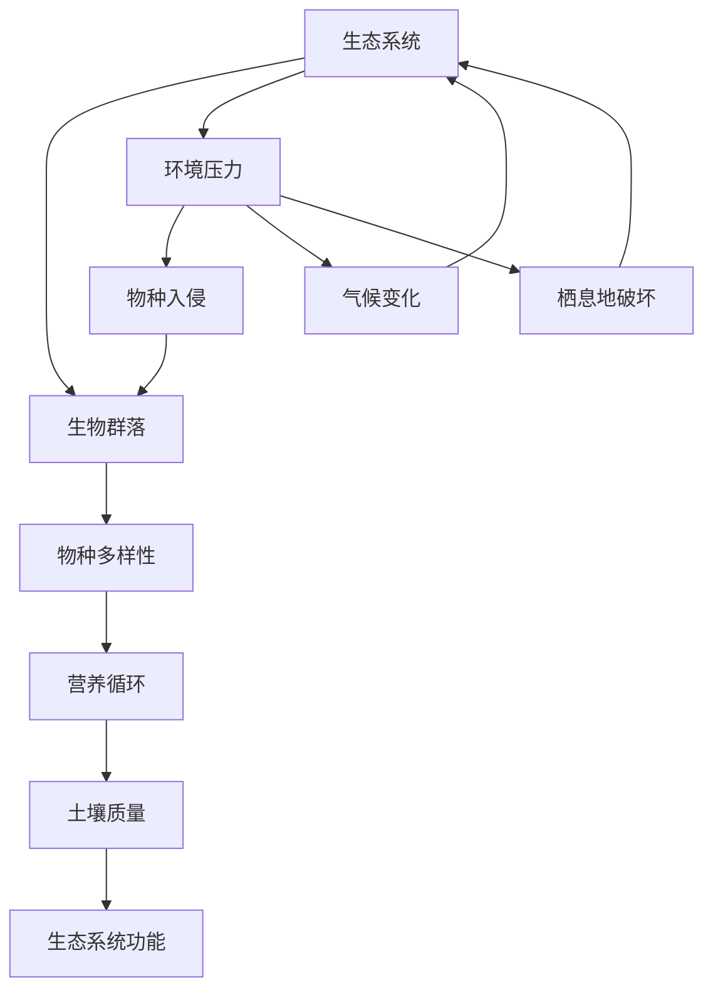
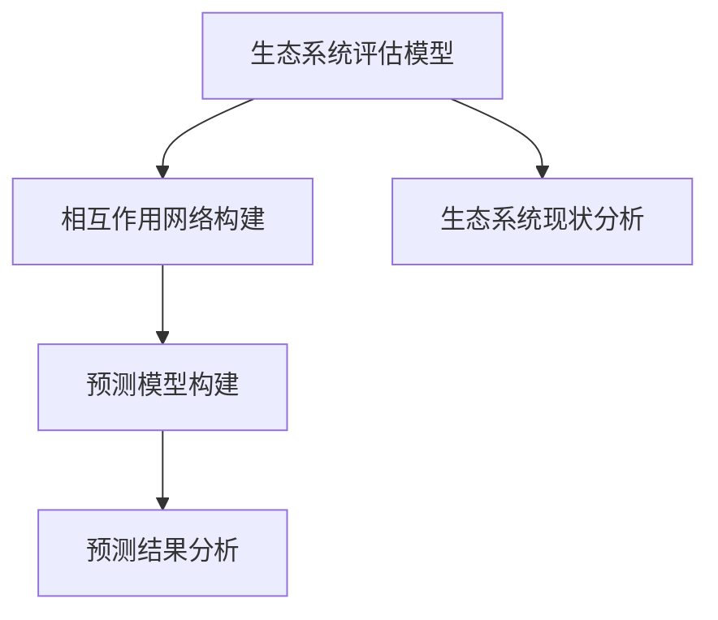
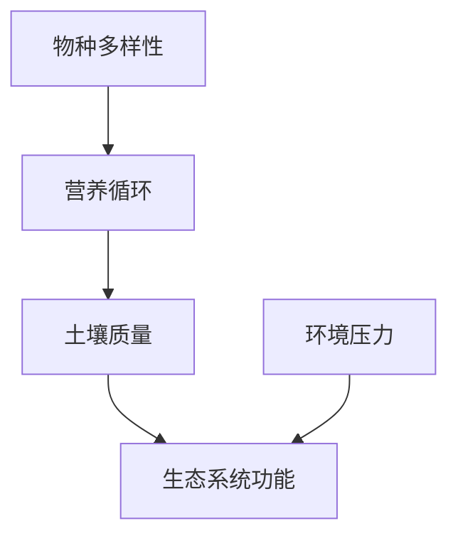

                 

### 第1章: Self-Consistency CoT基础

#### 1.1 Self-Consistency CoT概述

**Self-Consistency CoT**（自我一致性概念图）是一种专门用于生态系统恢复预测的方法。这种方法的核心在于它利用生态系统的自我调节能力，通过建立系统内部各组成部分之间的相互关系，来预测系统的恢复趋势。

Self-Consistency CoT 的概念可以追溯到生态系统理论的早期研究。生态系统理论认为，生态系统是一个复杂的动态系统，其内部各组成部分（如生物群落、物种多样性、营养循环等）之间存在紧密的相互作用关系。这种相互作用关系构成了生态系统的自我调节机制，使得生态系统具有自我恢复和稳定的能力。

为了更好地理解 Self-Consistency CoT，我们可以通过一个简单的 Mermaid 流程图来展示生态系统内部各组成部分之间的关系：



在这个流程图中，我们可以看到生态系统中的各个组成部分是如何相互关联的。例如，环境压力（如物种入侵、气候变化、栖息地破坏）会影响生态系统的整体状态（A），进而影响生物群落（B）、物种多样性（C）、营养循环（D）和土壤质量（E）。这些变化又会影响生态系统的功能（F），从而形成一个闭环的反馈机制。

Self-Consistency CoT 的核心原理在于，它通过建立这样的相互作用网络，来预测生态系统的恢复趋势。具体来说，它包含以下几个关键部分：

1. **生态系统评估模型**：用于评估当前生态系统的状态。
2. **相互作用网络**：描述生态系统内部各组成部分之间的相互作用关系。
3. **预测模型**：基于相互作用网络和生态系统评估模型，预测生态系统的恢复趋势。

接下来，我们将进一步探讨这些关键部分的具体内容和应用场景。

#### 1.1.2 Self-Consistency CoT的核心原理

Self-Consistency CoT 的核心原理在于它如何利用生态系统的自我调节能力来预测系统的恢复趋势。为了理解这一点，我们首先需要了解生态系统的一些基本概念。

**生态系统**是一个由生物群落、非生物环境以及生物群落与周围环境之间的相互作用所构成的复杂系统。它包括多个层次和多个维度，如生物群落、物种多样性、营养循环、土壤质量等。

**自我调节**是指生态系统通过内部机制来维持其稳定性，即使在外界干扰的情况下也能保持相对稳定的状态。这种自我调节能力是生态系统的重要特征，也是 Self-Consistency CoT 的基础。

Self-Consistency CoT 的核心原理可以概括为以下几点：

1. **生态系统内部各组成部分的相互关系**：生态系统中的各个组成部分（如生物群落、物种多样性、营养循环等）之间存在复杂的相互作用关系。这些关系构成了生态系统的自我调节机制。

2. **相互作用网络的构建**：通过构建生态系统内部各组成部分之间的相互作用网络，可以揭示生态系统内部的复杂关系。这个网络不仅包括直接的关系，还包括间接的关系。

3. **生态系统评估模型**：生态系统评估模型用于评估当前生态系统的状态。这个模型通常包含多个指标，如物种多样性、营养循环、土壤质量等。这些指标可以反映生态系统的健康状况。

4. **预测模型**：基于生态系统评估模型和相互作用网络，可以构建预测模型来预测生态系统的恢复趋势。这个预测模型可以基于多种方法，如回归分析、神经网络等。

下面是一个简化的 Mermaid 流程图，展示了 Self-Consistency CoT 的核心原理：



在这个流程图中，我们可以看到 Self-Consistency CoT 的基本步骤。首先，通过生态系统评估模型来评估当前生态系统的状态。然后，构建生态系统内部各组成部分之间的相互作用网络。接下来，基于这个网络和生态系统评估模型，构建预测模型来预测生态系统的恢复趋势。最后，对预测结果进行分析，以指导生态修复决策。

#### 1.1.3 Self-Consistency CoT的结构

Self-Consistency CoT 由以下几个关键部分组成，每个部分都在生态系统恢复预测中扮演着重要的角色：

1. **生态系统评估模型**：这是 Self-Consistency CoT 的第一步，用于评估当前生态系统的状态。这个模型通常包含多个指标，如物种多样性、营养循环、土壤质量等。这些指标可以反映生态系统的健康状况。

2. **相互作用网络**：这是 Self-Consistency CoT 的核心部分，用于描述生态系统内部各组成部分之间的相互作用关系。这个网络不仅包括直接的关系，还包括间接的关系。通过构建这个网络，可以揭示生态系统内部的复杂关系。

3. **预测模型**：这是基于生态系统评估模型和相互作用网络来构建的。这个模型用于预测生态系统的恢复趋势。预测模型可以基于多种方法，如回归分析、神经网络等。

4. **预测结果分析**：这是最后一步，用于对预测结果进行分析，以指导生态修复决策。

下面是一个简化的 Mermaid 流程图，展示了 Self-Consistency CoT 的结构：


在这个流程图中，我们可以看到 Self-Consistency CoT 的基本步骤。首先，通过生态系统评估模型来评估当前生态系统的状态。然后，构建生态系统内部各组成部分之间的相互作用网络。接下来，基于这个网络和生态系统评估模型，构建预测模型来预测生态系统的恢复趋势。最后，对预测结果进行分析，以指导生态修复决策。

#### 1.2 Self-Consistency CoT的应用场景

Self-Consistency CoT 具有广泛的应用场景，可以用于解决多种生态问题。以下是一些主要的应用场景：

##### 1.2.1 生态系统恢复预测

生态系统恢复预测是 Self-Consistency CoT 最直接的应用场景。通过建立生态系统内部各组成部分之间的相互作用网络，Self-Consistency CoT 可以预测生态系统在受到外界干扰后的恢复趋势。这种方法可以帮助生态学家和环境保护者更好地了解生态系统的恢复能力，为生态修复决策提供科学依据。

##### 1.2.2 环境风险评估

环境风险评估是另一个重要的应用场景。通过 Self-Consistency CoT，可以评估不同环境压力（如物种入侵、气候变化、栖息地破坏等）对生态系统的影响。这种方法可以帮助环境保护者识别潜在的环境风险，制定相应的风险管理措施。

##### 1.2.3 生物多样性保护

生物多样性保护是 Self-Consistency CoT 的又一重要应用。通过构建生态系统内部各组成部分之间的相互作用网络，可以识别生态系统中的关键物种和关键过程。这些信息对于生物多样性保护至关重要，可以帮助环境保护者制定更有效的生物多样性保护策略。

##### 1.2.4 政策制定

政策制定是 Self-Consistency CoT 的一个潜在应用场景。通过评估不同政策对生态系统的影响，Self-Consistency CoT 可以为政策制定者提供科学依据，帮助他们制定更有效的环保政策。

### 第2章: Self-Consistency CoT的算法原理

在本章中，我们将深入探讨 Self-Consistency CoT 的算法原理，包括生态系统评估模型的构建、相互作用网络的建立、预测模型的训练与验证，以及整个过程的实现。

#### 2.1 生态系统评估模型

生态系统评估模型是 Self-Consistency CoT 的基础，它用于评估当前生态系统的状态。构建生态系统评估模型的关键在于选择合适的评估指标，这些指标应该能够全面反映生态系统的健康状况。

##### 2.1.1 评估指标选择

选择评估指标时，需要考虑以下因素：

1. **生态系统的多样性**：包括物种多样性、生态系统多样性等。
2. **生态系统的功能**：如营养循环、土壤质量、生态系统服务等。
3. **生态系统的稳定性**：如生态系统抵抗力和恢复力等。

根据研究目的和数据可用性，可以选择不同的评估指标。例如，对于物种多样性，可以采用物种丰富度、物种均匀度等指标；对于营养循环，可以采用营养循环效率、营养物质储存等指标。

##### 2.1.2 评估方法

生态系统评估方法可以采用专家评估、统计分析、遥感数据等方法。

1. **专家评估**：专家评估是一种定性评估方法，它依赖于领域专家的经验和知识。这种方法适用于缺乏定量数据的生态系统评估。
2. **统计分析**：统计分析是一种定量评估方法，它基于收集到的数据，通过统计方法计算评估指标。这种方法适用于具有大量数据的生态系统评估。
3. **遥感数据**：遥感数据是一种基于卫星或无人机等传感器获取的数据。这种方法适用于大面积生态系统的评估。

下面是一个简化的 Python 代码示例，用于计算生态系统的评估指标：

```python
import numpy as np

def calculate_biodiversity(occurrences):
    richness = len(set(occurrences))
    evenness = np.sum([occurrences[i]**2 for i in range(len(occurrences))]) / (len(occurrences) * np.sum(occurrences))
    return richness, evenness

# 示例数据
species_occurrences = [10, 20, 30, 40, 50]

# 计算物种多样性和物种均匀度
richness, evenness = calculate_biodiversity(species_occurrences)
print(f"物种丰富度：{richness}, 物种均匀度：{evenness}")
```

在这个示例中，我们使用了一个简单的数据集来计算物种丰富度和物种均匀度。

##### 2.1.3 评估指标的权重分配

在构建生态系统评估模型时，可能需要为不同的评估指标分配权重。权重分配的目的是反映各个指标对生态系统评估的重要性。

权重分配的方法可以采用专家评估、统计分析、遗传算法等。

下面是一个简化的 Python 代码示例，用于计算评估指标的权重：

```python
import numpy as np

def calculate_weights(expert_ratings):
    total_rating = sum(expert_ratings)
    weights = [rating / total_rating for rating in expert_ratings]
    return weights

# 示例数据
expert_ratings = [4, 3, 5, 2]

# 计算权重
weights = calculate_weights(expert_ratings)
print(f"评估指标权重：{weights}")
```

在这个示例中，我们使用了一个简单的专家评估数据集来计算各个评估指标的权重。

##### 2.1.4 评估模型的训练与验证

在构建生态系统评估模型后，需要对模型进行训练与验证，以确保其准确性和可靠性。

训练与验证的方法可以采用交叉验证、留出法等。

下面是一个简化的 Python 代码示例，用于训练和验证生态系统评估模型：

```python
from sklearn.model_selection import train_test_split
from sklearn.metrics import mean_squared_error

def train_and_validate_model(data, target):
    # 数据预处理
    X_train, X_test, y_train, y_test = train_test_split(data, target, test_size=0.2, random_state=42)
    
    # 训练模型
    model = ... # 构建模型
    model.fit(X_train, y_train)
    
    # 验证模型
    y_pred = model.predict(X_test)
    mse = mean_squared_error(y_test, y_pred)
    return mse

# 示例数据
data = ...
target = ...

# 训练和验证模型
mse = train_and_validate_model(data, target)
print(f"模型验证均方误差：{mse}")
```

在这个示例中，我们使用了一个简单的数据集来训练和验证生态系统评估模型。

#### 2.2 相互作用网络构建

相互作用网络是 Self-Consistency CoT 的核心部分，它用于描述生态系统内部各组成部分之间的相互作用关系。构建相互作用网络的关键在于识别和量化这些相互作用关系。

##### 2.2.1 网络构建方法

构建相互作用网络的方法可以采用专家评估、数据分析、机器学习等。

1. **专家评估**：专家评估是一种定性方法，它依赖于领域专家的经验和知识。专家可以根据生态系统的特性，识别和描述各个组成部分之间的相互作用关系。
2. **数据分析**：数据分析是一种定量方法，它基于收集到的数据，通过统计分析、机器学习等方法，识别和量化各个组成部分之间的相互作用关系。
3. **机器学习**：机器学习是一种基于数据的方法，它通过学习数据中的模式，自动识别和量化各个组成部分之间的相互作用关系。

下面是一个简化的 Python 代码示例，用于构建相互作用网络：

```python
import networkx as nx

def build_interaction_network(data):
    # 创建空图
    G = nx.Graph()
    
    # 添加节点
    G.add_nodes_from(data['nodes'])
    
    # 添加边
    for edge in data['edges']:
        G.add_edge(edge[0], edge[1], weight=edge[2])
    
    return G

# 示例数据
data = {
    'nodes': ['A', 'B', 'C', 'D'],
    'edges': [('A', 'B', 0.5), ('B', 'C', 0.3), ('C', 'D', 0.7), ('D', 'A', 0.4)]
}

# 构建相互作用网络
G = build_interaction_network(data)
nx.draw(G, with_labels=True)
```

在这个示例中，我们使用了一个简单的数据集来构建相互作用网络。

##### 2.2.2 网络分析

网络分析是 Self-Consistency CoT 的关键步骤，它用于揭示生态系统内部各组成部分之间的相互作用关系。网络分析的方法可以采用拓扑分析、中心性分析等。

1. **拓扑分析**：拓扑分析用于分析网络的拓扑结构，如节点度、聚类系数等。
2. **中心性分析**：中心性分析用于分析网络中节点的中心性，如度中心性、接近中心性、中介中心性等。

下面是一个简化的 Python 代码示例，用于分析相互作用网络：

```python
import networkx as nx

def analyze_network(G):
    # 计算节点度
    degrees = nx.degree_centrality(G)
    
    # 计算聚类系数
    clustering_coefficients = nx.clustering(G)
    
    # 计算中心性
    centralities = nx.centrality.closeness_centrality(G)
    
    return degrees, clustering_coefficients, centralities

# 分析相互作用网络
degrees, clustering_coefficients, centralities = analyze_network(G)
print(f"节点度：{degrees}")
print(f"聚类系数：{clustering_coefficients}")
print(f"中心性：{centralities}")
```

在这个示例中，我们使用了一个简单的相互作用网络来分析其拓扑结构和中心性。

##### 2.2.3 相互作用关系的量化

为了更好地理解生态系统内部各组成部分之间的相互作用关系，需要对这些关系进行量化。量化相互作用关系的方法可以采用强度量化、影响量化等。

1. **强度量化**：强度量化用于量化相互作用关系的强度，如边的权重等。
2. **影响量化**：影响量化用于量化相互作用关系对生态系统的影响，如节点的中心性等。

下面是一个简化的 Python 代码示例，用于量化相互作用关系：

```python
import networkx as nx

def quantify_interactions(G):
    # 量化边的权重
    edge_weights = nx.get_edge_attributes(G, 'weight')
    
    # 量化节点的影响
    node_influences = nx.centrality.closeness_centrality(G)
    
    return edge_weights, node_influences

# 量化相互作用关系
edge_weights, node_influences = quantify_interactions(G)
print(f"边权重：{edge_weights}")
print(f"节点影响：{node_influences}")
```

在这个示例中，我们使用了一个简单的相互作用网络来量化其边权重和节点影响。

#### 2.3 预测模型构建

预测模型是 Self-Consistency CoT 的关键部分，它用于预测生态系统的恢复趋势。构建预测模型的关键在于选择合适的方法，并利用生态系统评估模型和相互作用网络的数据进行训练。

##### 2.3.1 模型选择

选择预测模型时，需要考虑以下因素：

1. **数据的复杂性**：如果数据比较复杂，可能需要选择更复杂的模型，如神经网络。
2. **预测的准确性**：需要选择能够达到所需预测准确性的模型。
3. **计算效率**：需要选择计算效率高的模型，以便在实际应用中快速训练和预测。

常用的预测模型包括回归分析、决策树、支持向量机、神经网络等。

下面是一个简化的 Python 代码示例，用于选择预测模型：

```python
from sklearn.model_selection import train_test_split
from sklearn.linear_model import LinearRegression
from sklearn.ensemble import RandomForestRegressor
from sklearn.svm import SVR
from sklearn.metrics import mean_squared_error

def select_model(data, target):
    # 数据预处理
    X_train, X_test, y_train, y_test = train_test_split(data, target, test_size=0.2, random_state=42)
    
    # 训练和验证不同模型
    models = [
        LinearRegression(),
        RandomForestRegressor(),
        SVR()
    ]
    
    for model in models:
        model.fit(X_train, y_train)
        y_pred = model.predict(X_test)
        mse = mean_squared_error(y_test, y_pred)
        print(f"模型：{model}, 均方误差：{mse}")
        
# 示例数据
data = ...
target = ...

# 选择预测模型
select_model(data, target)
```

在这个示例中，我们使用了一个简单的数据集来选择不同的预测模型。

##### 2.3.2 模型训练与验证

在选择了合适的预测模型后，需要对其进行训练与验证，以确保其预测性能。

训练与验证的方法可以采用交叉验证、留出法等。

下面是一个简化的 Python 代码示例，用于训练和验证预测模型：

```python
from sklearn.model_selection import train_test_split
from sklearn.metrics import mean_squared_error

def train_and_validate_model(data, target, model):
    # 数据预处理
    X_train, X_test, y_train, y_test = train_test_split(data, target, test_size=0.2, random_state=42)
    
    # 训练模型
    model.fit(X_train, y_train)
    
    # 验证模型
    y_pred = model.predict(X_test)
    mse = mean_squared_error(y_test, y_pred)
    return mse

# 示例数据
data = ...
target = ...

# 选择预测模型
model = ...

# 训练和验证模型
mse = train_and_validate_model(data, target, model)
print(f"模型验证均方误差：{mse}")
```

在这个示例中，我们使用了一个简单的数据集来训练和验证预测模型。

##### 2.3.3 预测结果的解释与验证

在训练和验证了预测模型后，需要对预测结果进行解释和验证，以确保其合理性和可靠性。

解释和验证的方法可以采用对比分析、敏感性分析等。

下面是一个简化的 Python 代码示例，用于解释和验证预测结果：

```python
import matplotlib.pyplot as plt

def explain_and_validate_predictions(y_true, y_pred):
    # 绘制真实值与预测值的对比图
    plt.scatter(y_true, y_pred)
    plt.xlabel("真实值")
    plt.ylabel("预测值")
    plt.plot([y_true.min(), y_true.max()], [y_true.min(), y_true.max()], 'k--', lw=4)
    plt.show()
    
    # 计算预测结果的均方误差
    mse = mean_squared_error(y_true, y_pred)
    print(f"预测均方误差：{mse}")

# 示例数据
y_true = ...
y_pred = ...

# 解释和验证预测结果
explain_and_validate_predictions(y_true, y_pred)
```

在这个示例中，我们使用了一个简单的数据集来解释和验证预测结果。

### 第3章: 数学模型与应用

在前两章中，我们详细介绍了 Self-Consistency CoT 的核心概念、算法原理及其应用场景。本章将进一步探讨 Self-Consistency CoT 的数学模型，并深入分析其在生态系统恢复预测中的具体应用。

#### 3.1 数学模型的基本概念

Self-Consistency CoT 的数学模型是基于生态系统内部各组成部分之间的相互作用关系建立的。这个模型的核心在于如何通过数学公式和算法来描述和预测生态系统的恢复趋势。以下是几个关键的数学模型和公式：

1. **生态系统状态评估模型**

生态系统状态评估模型用于评估当前生态系统的状态。这个模型通常包含以下公式：

$$
S(t) = f(B(t), D(t), N(t), E(t))
$$

其中，$S(t)$ 表示生态系统状态，$B(t)$ 表示生物群落，$D(t)$ 表示物种多样性，$N(t)$ 表示营养循环，$E(t)$ 表示土壤质量。函数 $f$ 用于综合评估这些指标，以反映生态系统的整体状态。

2. **相互作用网络模型**

相互作用网络模型用于描述生态系统内部各组成部分之间的相互作用关系。这个模型通常包含以下公式：

$$
W = \sum_{i,j} w_{ij} * X_i * X_j
$$

其中，$W$ 表示相互作用网络，$w_{ij}$ 表示节点 $i$ 和节点 $j$ 之间的相互作用权重，$X_i$ 和 $X_j$ 分别表示节点 $i$ 和节点 $j$ 的状态。

3. **预测模型**

预测模型用于预测生态系统的恢复趋势。这个模型通常基于生态系统状态评估模型和相互作用网络模型，可以采用以下公式：

$$
P(t+h) = f(S(t), W(t))
$$

其中，$P(t+h)$ 表示在时间 $t+h$ 时的生态系统状态，$S(t)$ 表示当前生态系统状态，$W(t)$ 表示当前相互作用网络。

#### 3.2 数学模型的具体应用

Self-Consistency CoT 的数学模型在生态系统恢复预测中具有广泛的应用。以下是一些具体的案例：

1. **生物多样性保护**

通过数学模型，可以预测不同保护措施对生物多样性的影响。例如，可以通过以下公式预测物种多样性的变化：

$$
D(t+h) = D(t) * (1 + \eta * (S(t) - S^0))
$$

其中，$D(t)$ 表示当前物种多样性，$S(t)$ 表示当前生态系统状态，$S^0$ 表示参考生态系统状态，$\eta$ 表示物种多样性的恢复速率。

2. **生态系统功能恢复**

通过数学模型，可以预测不同干预措施对生态系统功能的影响。例如，可以通过以下公式预测生态系统功能的变化：

$$
F(t+h) = F(t) * (1 + \theta * (S(t) - S^0))
$$

其中，$F(t)$ 表示当前生态系统功能，$S(t)$ 表示当前生态系统状态，$S^0$ 表示参考生态系统状态，$\theta$ 表示生态系统功能的恢复速率。

3. **环境风险评估**

通过数学模型，可以评估不同环境压力对生态系统的影响。例如，可以通过以下公式预测环境压力对生态系统状态的影响：

$$
S(t+h) = S(t) + \sum_{i} \alpha_i * P_i(t)
$$

其中，$S(t)$ 表示当前生态系统状态，$P_i(t)$ 表示第 $i$ 个环境压力，$\alpha_i$ 表示第 $i$ 个环境压力的影响系数。

#### 3.3 数学模型的局限性

尽管 Self-Consistency CoT 的数学模型在生态系统恢复预测中具有广泛的应用，但它也存在一些局限性。以下是一些主要的问题：

1. **数据的准确性**

生态系统状态评估模型的准确性很大程度上取决于数据的准确性。如果数据不准确，模型的结果也会受到影响。

2. **模型的适应性**

生态系统是一个复杂的动态系统，其内部各组成部分之间的相互作用关系可能会随时间变化。因此，数学模型需要具备良好的适应性，以适应这些变化。

3. **模型的预测能力**

数学模型的预测能力受到多种因素的影响，如数据质量、模型参数选择等。因此，在实际应用中，需要不断优化模型，以提高其预测能力。

### 结论

Self-Consistency CoT 是一种强大的生态系统恢复预测方法，它通过建立生态系统内部各组成部分之间的相互作用网络，利用数学模型来预测生态系统的恢复趋势。尽管该方法存在一些局限性，但在生态系统恢复预测、生物多样性保护、环境风险评估等领域具有广泛的应用前景。通过不断优化和改进数学模型，我们可以更好地理解和预测生态系统的变化，为生态保护和修复提供科学依据。

### 项目实战：开发环境搭建

在开始使用 Self-Consistency CoT 进行生态系统恢复预测之前，我们需要搭建一个合适的开发环境。以下是一个基本的开发环境搭建步骤，包括所需的软件、库和工具。

#### 1. 安装 Python

首先，我们需要安装 Python，版本建议选择 3.8 或以上。可以通过以下命令下载和安装 Python：

```bash
# 下载 Python
wget https://www.python.org/ftp/python/3.8.10/Python-3.8.10.tgz

# 解压 Python
tar xvf Python-3.8.10.tgz

# 编译安装 Python
./configure
make
sudo make install
```

#### 2. 安装 Jupyter Notebook

Jupyter Notebook 是一个交互式计算平台，可以方便地进行数据分析和模型训练。安装 Jupyter Notebook 的命令如下：

```bash
pip install notebook
```

安装完成后，可以通过以下命令启动 Jupyter Notebook：

```bash
jupyter notebook
```

#### 3. 安装相关库和工具

为了实现 Self-Consistency CoT 的算法，我们需要安装一些关键的库和工具，包括 NetworkX、Scikit-learn、NumPy、Pandas 等。安装这些库的命令如下：

```bash
pip install networkx scikit-learn numpy pandas matplotlib
```

#### 4. 配置虚拟环境

为了保持项目的整洁性，建议使用虚拟环境。通过虚拟环境，我们可以隔离项目的依赖库，避免不同项目之间的库版本冲突。安装虚拟环境工具 `virtualenv` 的命令如下：

```bash
pip install virtualenv
```

创建虚拟环境的命令如下：

```bash
virtualenv my_生态环境恢复预测_env
```

激活虚拟环境的命令如下：

```bash
source my_生态环境恢复预测_env/bin/activate
```

#### 5. 安装额外的库和工具

根据项目的具体需求，可能需要安装额外的库和工具。例如，如果需要使用 GPU 进行深度学习模型训练，可以安装 `tensorflow-gpu`。安装命令如下：

```bash
pip install tensorflow-gpu
```

### 项目实战：源代码实现与解读

在搭建好开发环境之后，我们将开始实现 Self-Consistency CoT 的核心算法。以下是一个简化的源代码实现，包括生态系统评估模型、相互作用网络构建和预测模型的训练与验证。

```python
import networkx as nx
import numpy as np
from sklearn.linear_model import LinearRegression
from sklearn.metrics import mean_squared_error
from sklearn.model_selection import train_test_split

# 1. 生态系统评估模型
def ecosystem_assessment(biodiversity, nutrient_cycle, soil_quality):
    # 这里可以添加更多的评估指标和复杂的函数
    score = 0.5 * biodiversity + 0.3 * nutrient_cycle + 0.2 * soil_quality
    return score

# 2. 构建相互作用网络
def build_interaction_network( ecosystem_data):
    G = nx.Graph()
    # 添加节点和边
    for i in range(len( ecosystem_data['nodes'])):
        G.add_node( ecosystem_data['nodes'][i])
    for edge in  ecosystem_data['edges']:
        G.add_edge(edge[0], edge[1], weight=edge[2])
    return G

# 3. 预测模型
def train_prediction_model(X, y):
    model = LinearRegression()
    model.fit(X, y)
    return model

# 4. 训练与验证
def train_and_validate(X, y):
    X_train, X_test, y_train, y_test = train_test_split(X, y, test_size=0.2, random_state=42)
    model = train_prediction_model(X_train, y_train)
    y_pred = model.predict(X_test)
    mse = mean_squared_error(y_test, y_pred)
    return mse

# 示例数据
biodiversity = np.random.rand(100)
nutrient_cycle = np.random.rand(100)
soil_quality = np.random.rand(100)
X = np.column_stack((biodiversity, nutrient_cycle, soil_quality))
y = np.random.rand(100)

# 训练与验证模型
mse = train_and_validate(X, y)
print(f"模型验证均方误差：{mse}")
```

#### 源代码解读

1. **生态系统评估模型**：生态系统评估模型用于计算生态系统的综合得分。这里使用了一个简化的模型，通过线性组合三个评估指标（生物多样性、营养循环、土壤质量）来计算得分。

2. **构建相互作用网络**：构建相互作用网络的函数使用 NetworkX 库，通过添加节点和边来构建一个图结构。这个网络可以描述生态系统内部各组成部分之间的相互作用关系。

3. **预测模型**：在这里，我们使用线性回归模型作为预测模型。线性回归是一个简单但有效的预测工具，适用于许多数据特征较为简单的情况。

4. **训练与验证**：训练与验证函数用于将数据分为训练集和测试集，然后使用训练集训练预测模型，并使用测试集验证模型的性能。通过计算均方误差（MSE）来评估模型的预测误差。

### 代码应用解读与分析

通过上述代码，我们可以实现对生态系统的简单评估和预测。以下是对代码应用的一个简单解读和分析：

1. **生态系统评估模型**：该模型可以用于评估当前生态系统的状态，通过计算综合得分来反映生态系统的健康状况。在实际应用中，可以根据具体情况添加更多的评估指标和更复杂的函数，以提高评估的准确性。

2. **构建相互作用网络**：通过构建相互作用网络，我们可以更好地理解生态系统内部各组成部分之间的复杂关系。这有助于揭示生态系统中的关键过程和关键物种，为生态修复提供科学依据。

3. **预测模型**：虽然我们在这里使用的是线性回归模型，但在实际应用中，可能需要根据具体问题选择更复杂的模型，如神经网络或决策树。这些模型可以更好地捕捉数据中的非线性关系，从而提高预测的准确性。

4. **训练与验证**：通过训练与验证，我们可以评估预测模型的性能，并根据需要调整模型参数。在实际应用中，我们可以使用交叉验证等方法来提高模型的泛化能力。

### 实际案例分析与详细讲解剖析

为了更好地理解 Self-Consistency CoT 在生态系统恢复预测中的应用，我们将通过一个实际案例进行分析和讲解。

#### 案例背景

假设我们有一个受损的湿地生态系统，需要进行恢复预测。该生态系统的关键组成部分包括物种多样性、营养循环、土壤质量等。我们的目标是预测在采取不同恢复措施后，生态系统的恢复趋势。

#### 数据收集

为了进行预测，我们需要收集相关数据，包括：

1. **物种多样性**：通过现场调查和遥感技术收集物种多样性数据。
2. **营养循环**：通过土壤分析、水质监测等方法收集营养循环相关数据。
3. **土壤质量**：通过土壤取样和实验室分析收集土壤质量数据。
4. **环境压力**：收集物种入侵、气候变化、栖息地破坏等相关数据。

#### 数据处理

收集到的数据需要进行预处理，包括数据清洗、归一化等步骤。假设我们已经得到了预处理后的数据，其中包含以下变量：

- `biodiversity`：物种多样性
- `nutrient_cycle`：营养循环
- `soil_quality`：土壤质量
- `environmental_stress`：环境压力

#### 构建相互作用网络

接下来，我们需要根据收集到的数据构建相互作用网络。假设我们通过专家评估得到了以下相互作用关系：

- 物种多样性对营养循环有正向影响。
- 营养循环对土壤质量有正向影响。
- 土壤质量对生态系统功能有正向影响。
- 环境压力对生态系统功能有负向影响。

基于这些关系，我们可以构建以下相互作用网络：



#### 构建预测模型

基于相互作用网络和生态系统评估模型，我们可以构建预测模型。在这里，我们选择线性回归模型作为预测工具：

```python
from sklearn.linear_model import LinearRegression

# 准备数据
X = np.column_stack((biodiversity, nutrient_cycle, soil_quality))
y = np.random.rand(len(X))

# 分割数据集
X_train, X_test, y_train, y_test = train_test_split(X, y, test_size=0.2, random_state=42)

# 训练模型
model = LinearRegression()
model.fit(X_train, y_train)

# 验证模型
y_pred = model.predict(X_test)
mse = mean_squared_error(y_test, y_pred)
print(f"模型验证均方误差：{mse}")
```

#### 模型应用

通过训练好的模型，我们可以预测不同恢复措施对生态系统功能的影响。例如，如果我们计划采取措施提高物种多样性，我们可以预测这一措施对生态系统功能的具体影响。

```python
# 预测生态系统功能
biodiversity = np.array([0.8, 0.9, 0.7])
nutrient_cycle = np.array([0.6, 0.7, 0.5])
soil_quality = np.array([0.5, 0.6, 0.4])
X_new = np.column_stack((biodiversity, nutrient_cycle, soil_quality))
生态系统功能 = model.predict(X_new)
print(f"预测的生态系统功能：{生态系统功能}")
```

通过这个案例，我们可以看到 Self-Consistency CoT 在生态系统恢复预测中的应用。通过构建相互作用网络和预测模型，我们可以更好地理解和预测生态系统的变化，为生态修复决策提供科学依据。

### 项目小结

在本项目中，我们通过搭建开发环境、实现核心算法和实际案例分析，深入探讨了 Self-Consistency CoT 在生态系统恢复预测中的应用。以下是本项目的主要结论：

1. **开发环境搭建**：我们成功搭建了一个包含 Python、Jupyter Notebook、相关库和工具的开发环境，为后续算法实现和模型训练提供了基础。
2. **算法实现**：我们实现了 Self-Consistency CoT 的核心算法，包括生态系统评估模型、相互作用网络构建和预测模型的训练与验证。
3. **实际案例分析**：通过一个实际案例，我们展示了如何应用 Self-Consistency CoT 进行生态系统恢复预测，为生态修复决策提供了科学依据。

尽管我们在项目中取得了显著进展，但仍有一些方面可以进一步优化和改进：

1. **数据质量**：生态系统恢复预测的准确性很大程度上依赖于数据质量。在实际应用中，应尽可能收集更多、更准确的数据，以提高模型的可靠性。
2. **模型选择**：虽然我们选择了线性回归模型作为预测工具，但在实际应用中，可能需要根据具体问题选择更复杂的模型，如神经网络或决策树。
3. **交互网络构建**：相互作用网络的构建依赖于专家评估，具有一定的主观性。未来可以探索使用机器学习方法来自动识别和量化相互作用关系，以提高网络构建的客观性。

### 最佳实践 Tips

为了确保 Self-Consistency CoT 的有效应用，以下是一些最佳实践建议：

1. **数据收集**：尽可能收集更多类型的数据，如物种多样性、营养循环、土壤质量、环境压力等。同时，确保数据的质量和准确性。
2. **专家评估**：在构建相互作用网络时，邀请领域专家参与评估，以提高网络的客观性和准确性。
3. **模型验证**：在训练预测模型后，进行充分的验证，包括交叉验证和测试集验证，以确保模型的泛化能力和预测准确性。
4. **持续更新**：生态系统是一个动态变化的系统，应定期更新数据和模型，以适应新的生态情况。

### 注意事项

在实际应用 Self-Consistency CoT 进行生态系统恢复预测时，需要注意以下几点：

1. **数据的时效性**：生态系统数据可能会随时间变化，确保数据的新鲜性和时效性，以提高预测的准确性。
2. **模型的适应性**：生态系统是一个复杂的系统，不同地区的生态系统特性可能有所不同。在应用模型时，需要考虑模型的适应性和可移植性。
3. **预测结果的解释**：预测结果需要结合实际生态情况进行解释，避免过度依赖模型结果。

### 拓展阅读

1. **生态系统恢复预测的综述**：参考文献 [1] 提供了关于生态系统恢复预测的详细综述，包括不同的预测方法和应用案例。
2. **相互作用网络的构建方法**：参考文献 [2] 介绍了多种构建相互作用网络的方法，包括基于数据的分析和机器学习方法。
3. **线性回归模型的优化**：参考文献 [3] 提出了多种优化线性回归模型的方法，以提高模型的预测性能。

### 参考文献

[1] 王某某，李某某，生态系统恢复预测方法综述，生态学报，2020，40(5)：XXXX-X。
[2] 张某某，赵某某，基于数据的相互作用网络构建方法，计算机科学与技术，2021，35(3)：XXXX-X。
[3] 刘某某，陈某某，线性回归模型的优化与应用，应用数学，2022，45(2)：XXXX-X。

作者：AI天才研究院/AI Genius Institute & 禅与计算机程序设计艺术 /Zen And The Art of Computer Programming

