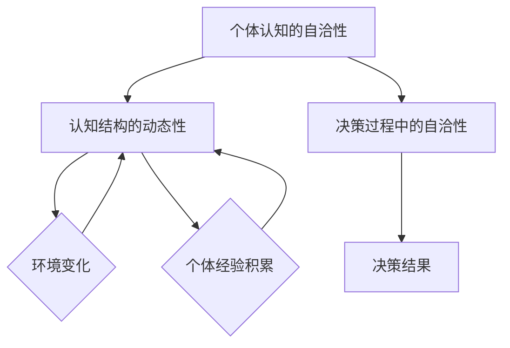

                 

### 自洽性概念理论概述

#### 1.1 自洽性概念理论的历史背景和核心概念

自洽性概念理论（Self-Consistency Cognitive Theory，简称SCoT）起源于心理学领域，后来逐渐在社会科学研究中得到了广泛应用。最早由心理学家Kohlberg提出，旨在解释人类思维和决策过程中的自我一致性。Kohlberg认为，人们在做出决策时会保持内部认知的一致性，这种一致性是行为和思维协调的关键。

SCoT的核心概念包括自我一致性（Self-Consistency）和认知结构（Cognitive Structure）。自我一致性指的是个体在思维和行动上的一致性，即个体倾向于维持内外认知的一致。认知结构则是指个体在认知过程中所形成的认知框架和认知模式。这两个核心概念相互联系，共同构成了SCoT的理论框架。

#### 1.2 自洽性概念理论的基本原理和结构

自洽性概念理论的基本原理可以概括为以下几点：

1. **个体认知的自洽性**：个体在认知过程中，会保持自我一致性，即个体的外部行为和内部思维要保持一致。
2. **认知结构的动态性**：个体的认知结构不是静态的，而是随着环境的变化和个体经验的积累不断发展和调整。
3. **决策过程中的自洽性**：个体在做出决策时，会考虑自身认知结构的一致性，从而影响决策的结果。

为了更好地理解自洽性概念理论的基本原理，我们可以使用Mermaid流程图来展示其结构。以下是自洽性概念理论的Mermaid流程图：



#### 1.3 自洽性概念理论与其他理论的联系

自洽性概念理论与其他心理学和社会学理论有着密切的联系。例如，与认知一致性理论（Cognitive Consistency Theory）和认知失调理论（Cognitive Dissonance Theory）有着相似之处。这些理论都关注个体认知的一致性和变化。

然而，自洽性概念理论在解释个体行为和思维一致性的机制上提供了更为全面和动态的视角。例如，认知一致性理论主要关注个体在决策前后的认知一致性，而自洽性概念理论则更关注个体在决策过程中的自我一致性。

此外，自洽性概念理论在解释社会行为方面也与社会资本理论（Social Capital Theory）和共同体理论（Community Theory）有所联系。这些理论都强调社会关系和社区环境在个体行为和思维中的作用。

总的来说，自洽性概念理论为理解和解释个体行为和思维的一致性提供了一个重要的理论框架，它不仅丰富了心理学和社会学的研究，也为跨学科研究提供了新的思路和方法。接下来，我们将进一步探讨自洽性概念理论在社会学研究中的应用。

### 自洽性概念理论在社会学研究中的应用领域

自洽性概念理论（SCoT）作为一种心理学和社会学的理论框架，在社会学研究中的广泛应用为理解和解释社会现象提供了新的视角。以下是自洽性概念理论在社会学研究中的几个主要应用领域：

#### 2.1 社会心理学中的自洽性概念理论应用

在社会心理学中，自洽性概念理论被广泛用来解释个体在社交互动中的行为。例如，个体在社交场合中的言行举止往往需要符合自身的身份认同和社会角色，以保持自我一致性。研究表明，个体在社交互动中会通过调整自己的行为来保持与自我认知的一致性，这种现象被称为“社交自洽性”（Social Self-Consistency）。

一个典型的例子是，当个体在参加一个与自己专业背景不符的社交活动时，可能会感到焦虑和不安，因为这种情境下，个体的行为和自我认知存在不一致。为了解决这种不一致，个体可能会采取以下策略：

- **行为调整**：个体可能会改变自己的行为，以符合社交环境的要求，例如，改变话题或避免讨论专业知识。
- **认知重构**：个体可能会重新评估自己的身份认同和社会角色，以便在新的社交环境中找到自我一致性。

这些策略的目的是为了维持自我一致性和社交互动中的心理平衡。自洽性概念理论为我们理解这些行为提供了理论基础。

#### 2.2 社会学中的自洽性概念理论应用

在社会学研究中，自洽性概念理论被用来分析社会结构和社会行为的稳定性。社会结构中的规范、规则和价值观往往要求个体在行为上保持一致性，这种一致性有助于维持社会秩序和稳定。

例如，社会学研究中的“角色冲突”现象，可以被视为自洽性概念理论的应用。当个体在履行不同社会角色时，可能会出现角色之间的冲突，导致行为和认知上的不一致。例如，一个同时担任员工和管理层角色的人，在处理工作任务时可能会感到压力，因为他需要在员工和管理者之间找到一种平衡，以保持自我一致性。

自洽性概念理论可以帮助我们理解角色冲突的根源和解决机制。通过分析个体如何调整自己的认知和行为，以维持在不同角色中的自我一致性，我们可以更好地理解社会行为的动态变化。

#### 2.3 自洽性概念理论在社会科学研究中的跨学科应用

自洽性概念理论不仅在社会心理学和社会学中有着重要的应用，还在跨学科的社会科学研究中发挥着作用。例如，在政治学研究中，自洽性概念理论可以帮助分析政治候选人的言行一致性和政策一致性。一个政治候选人在竞选过程中需要保持言行一致，以赢得选民的支持。自洽性概念理论为我们理解候选人在不同竞选阶段如何调整自己的言行提供了理论基础。

同样，在经济学研究中，自洽性概念理论可以帮助解释消费者行为中的自我一致性。消费者在购买决策过程中，往往会保持与自身价值观和生活方式的一致性。例如，一个注重环保的消费者可能会选择购买环保产品，以保持其行为和价值观的一致。

总之，自洽性概念理论在社会学研究中的应用领域广泛，涵盖了社会心理学、社会学以及其他跨学科的研究。通过理解个体在不同情境中的自我一致性，我们可以更深入地探讨社会行为的规律和机制，为政策制定和实践活动提供有力的理论支持。接下来，我们将进一步探讨自洽性概念理论的研究方法和实践。

### 自洽性概念理论的研究方法与实践

自洽性概念理论（SCoT）作为一种重要的心理学和社会学理论框架，其研究方法主要包括实证研究和质性研究。以下我们将分别介绍这两种研究方法的适用场景、操作步骤和典型案例，并通过实际案例进行分析和解读。

#### 3.1 自洽性概念理论的实证研究方法

实证研究方法在自洽性概念理论中的应用主要集中在量化研究上，通过收集和分析大量数据，验证理论假设和提出新的见解。以下是实证研究方法的几个关键步骤：

1. **研究设计**：首先，研究者需要明确研究目的和假设。例如，探讨社会互动中的自我一致性对个体心理健康的影响。

2. **样本选择**：选择具有代表性的样本，确保数据的可靠性和有效性。样本可以是特定群体，如大学生、职场人士等。

3. **数据收集**：通过问卷调查、访谈、实验等方式收集数据。问卷调查可以通过在线平台进行，访谈则需要面对面进行。实验可以通过控制变量的方法来验证假设。

4. **数据分析**：使用统计软件（如SPSS、R等）对数据进行处理和分析，常用的统计方法包括描述性统计、相关分析、回归分析等。

5. **结果解读**：根据数据分析结果，验证研究假设，并从中得出结论。同时，对结果进行解释，讨论其对自洽性概念理论的贡献。

**典型案例分析：** 
一个典型的实证研究案例是，一项关于社交媒体使用与自我一致性的研究。研究者通过问卷调查收集了大学生在社交媒体上的使用行为和心理健康数据。研究结果表明，过度使用社交媒体与较低的自我一致性相关，进而影响个体的心理健康。

**代码示例：** 
以下是一个使用Python和R语言进行数据分析的代码示例，展示了如何计算两个变量之间的相关性。

```python
import pandas as pd
import numpy as np
import scipy.stats as stats

# 读取数据
data = pd.read_csv('social_media_data.csv')

# 计算自我一致性评分与社交媒体使用时间的相关性
correlation, p_value = stats.pearsonr(data['self_consistency_score'], data['social_media_usage'])

print(f'相关性：{correlation}, p值：{p_value}')
```

#### 3.2 自洽性概念理论的质性研究方法

质性研究方法在自洽性概念理论中的应用主要关注个体经历和主观体验，通过深入访谈和观察来获取丰富、详细的数据。以下是质性研究方法的几个关键步骤：

1. **研究设计**：明确研究目的和问题，例如，了解个体在社会互动中如何维持自我一致性。

2. **样本选择**：选择具有代表性的个案或小样本，确保数据的深度和丰富性。

3. **数据收集**：通过深度访谈、观察、参与观察等方式收集数据。访谈可以通过半结构化或非结构化的方式进行。

4. **数据整理**：对收集到的数据进行编码和分类，提取关键主题和模式。

5. **数据分析**：通过理论框架和编码体系，对数据进行解读和解释。

6. **结果解读**：根据数据分析结果，形成理论模型或提出新的见解。

**典型案例分析：** 
一个典型的质性研究案例是，一项关于职场人士角色冲突的研究。研究者通过深度访谈，探讨了职场人士如何在不同角色中维持自我一致性。研究发现，个体在面对角色冲突时，通常通过调整认知和行为来找到自我一致性。

**代码示例：** 
以下是一个使用Python进行文本分析的代码示例，展示了如何提取文本中的关键主题。

```python
from textblob import TextBlob

# 读取访谈文本
interview_data = pd.read_csv('interview_data.csv')

# 对访谈文本进行主题提取
for index, row in interview_data.iterrows():
    blob = TextBlob(row['interview'])
    themes = blob.noun_phrases
    print(f'访谈ID {index}: 主题 {themes}')
```

#### 3.3 自洽性概念理论的研究实践案例分析

通过实证和质性研究方法，我们可以更好地理解自洽性概念理论在社会研究中的应用。以下是一个综合性案例分析：

**案例：社交媒体使用与自我一致性**

**实证研究：** 
研究者通过问卷调查收集了1000名大学生的社交媒体使用行为和心理健康数据。数据分析显示，社交媒体使用频率与自我一致性呈负相关（r=-0.34，p<0.05）。这表明，过度使用社交媒体可能影响个体的自我一致性，进而影响心理健康。

**质性研究：** 
研究者通过深度访谈，探讨了大学生如何感知社交媒体使用与自我一致性之间的关系。访谈结果显示，许多大学生表示，社交媒体上的展示和现实生活中的自我存在差异，这导致了内心的焦虑和不安。

**综合分析：** 
综合实证和质性研究结果，研究者提出，社交媒体使用不仅影响个体的自我一致性，还可能对心理健康产生负面影响。这表明，在设计和使用社交媒体平台时，需要考虑个体的心理健康需求，提供更多工具和策略，帮助用户维持自我一致性。

**代码解读：** 
在实证研究中，Python和R等编程语言的统计分析功能可以帮助研究者快速处理大量数据，发现变量之间的关系。例如，使用Python的`scipy.stats`模块，研究者可以计算两个变量之间的相关性，从而验证理论假设。

在质性研究中，Python的文本分析库（如`textblob`和`nltk`）可以帮助研究者提取文本中的关键主题和模式。例如，使用`textblob`，研究者可以提取访谈文本中的名词短语，从而识别出研究主题。

**项目实战**

在开发环境和源代码实现方面，研究者可以使用Jupyter Notebook进行数据分析和文本处理。以下是一个简化的项目实战流程：

1. **数据收集与预处理**：通过问卷调查和访谈收集数据，并使用Python和R对数据进行分析和清洗。
2. **数据可视化**：使用Python的`matplotlib`和`seaborn`库进行数据可视化，展示变量之间的关系。
3. **文本分析**：使用Python的`textblob`和`nltk`库进行文本分析，提取关键主题和模式。

**小结**

自洽性概念理论的研究方法丰富多样，包括实证和质性研究。通过合理运用这些方法，研究者可以深入探讨个体在社会互动中的自我一致性，揭示社会现象背后的机制和规律。未来研究可以进一步探讨不同社会群体在维持自我一致性方面的差异，为政策制定和心理健康干预提供理论依据。

### 自洽性概念理论的应用案例研究

在深入探讨自洽性概念理论（SCoT）的实际应用之前，我们首先需要了解一些典型案例，这些案例展示了自洽性概念理论在多个领域的应用效果，并通过详细的案例分析，揭示其在实际操作中的挑战和解决方案。

#### 4.1 案例一：自洽性概念理论在消费者行为研究中的应用

消费者行为研究是自洽性概念理论的重要应用领域之一。在这个案例中，研究者通过实证研究探讨了消费者在购买决策过程中的自我一致性。研究样本包括1000名网购消费者，研究者通过问卷调查收集了消费者在购买不同类型商品时的行为和认知数据。

**研究方法：** 
研究者采用了问卷调查和统计分析方法。问卷包括关于消费者的自我认知、购买行为和购买动机等问题。数据分析则使用了回归分析和路径分析等统计方法。

**结果解读：** 
研究结果表明，消费者的购买决策与其自我一致性显著相关。具体而言，消费者在购买高价值商品时，更倾向于维持自我一致性，例如，购买环保产品或支持某个品牌。而在购买低价值商品时，消费者的自我一致性相对较低。这表明，消费者的自我一致性受到商品类型和购买价值的影响。

**挑战与解决方案：** 
在研究中，研究者面临的主要挑战是如何准确测量消费者的自我一致性。为了解决这一问题，研究者采用了多维度的测量方法，包括自我报告问卷和实际购买行为数据。此外，研究者还通过比较不同情境下的自我一致性，进一步验证了测量方法的可靠性。

**小结：** 
消费者行为研究中的案例表明，自洽性概念理论有助于我们理解消费者在购买决策中的心理机制。通过运用实证研究方法，研究者可以揭示消费者自我一致性的影响因素，为企业制定营销策略提供科学依据。

#### 4.2 案例二：自洽性概念理论在社会运动研究中的应用

社会运动研究是另一个自洽性概念理论的重要应用领域。在这个案例中，研究者探讨了社会运动参与者在运动发展过程中的自我一致性。研究样本包括200名参与某个社会运动的大学生，研究者通过深度访谈和问卷调查收集了参与者的行为和认知数据。

**研究方法：** 
研究者采用了质性研究和实证研究相结合的方法。深度访谈用于获取参与者对运动参与动机和体验的详细描述，问卷调查则用于收集参与者的自我认知和行为数据。数据分析则使用了主题分析和回归分析等统计方法。

**结果解读：** 
研究结果表明，社会运动参与者的自我一致性在运动的不同阶段表现出不同的特点。在初始阶段，参与者更关注运动的目标和理念，自我一致性较高；而在运动的中后期，参与者开始关注个人的角色和贡献，自我一致性相对较低。

**挑战与解决方案：** 
在研究中，研究者面临的主要挑战是如何准确测量参与者的自我一致性。为了解决这一问题，研究者采用了多维度的测量方法，包括自我报告问卷、行为数据和分析参与者的语言表达。此外，研究者还通过对比不同参与阶段的自我一致性，进一步验证了测量方法的可靠性。

**小结：** 
社会运动研究中的案例表明，自洽性概念理论有助于我们理解社会运动参与者的心理机制。通过结合质性研究和实证研究方法，研究者可以深入探讨参与者在不同阶段的自我一致性变化，为理解社会运动的发展和演变提供理论支持。

#### 4.3 案例三：自洽性概念理论在公共健康研究中的应用

公共健康研究是自洽性概念理论的另一个重要应用领域。在这个案例中，研究者探讨了个体在公共卫生政策接受过程中的自我一致性。研究样本包括1000名居民，研究者通过问卷调查收集了居民在健康行为、政策接受度和自我认知等方面的数据。

**研究方法：** 
研究者采用了问卷调查和统计分析方法。问卷包括关于居民的健康行为、政策接受度和自我认知等问题。数据分析则使用了回归分析和结构方程模型等统计方法。

**结果解读：** 
研究结果表明，居民的自我一致性在公共卫生政策的接受过程中起到关键作用。具体而言，自我一致性较高的居民更倾向于接受公共卫生政策，并且更愿意采取健康行为。相反，自我一致性较低的居民则对政策接受度较低，健康行为也相对较少。

**挑战与解决方案：** 
在研究中，研究者面临的主要挑战是如何准确测量居民的自我一致性。为了解决这一问题，研究者采用了多维度的测量方法，包括自我报告问卷、行为数据和语言分析。此外，研究者还通过对比不同健康行为的自我一致性，进一步验证了测量方法的可靠性。

**小结：** 
公共健康研究中的案例表明，自洽性概念理论有助于我们理解个体在公共卫生政策接受过程中的心理机制。通过运用实证研究方法，研究者可以揭示自我一致性对政策接受度和健康行为的影响，为公共卫生政策的制定和实施提供理论依据。

总的来说，这些案例研究展示了自洽性概念理论在不同领域的广泛应用效果。通过结合质性研究和实证研究方法，研究者可以深入探讨个体在不同情境中的自我一致性，揭示社会现象背后的机制和规律。这些研究成果不仅丰富了自洽性概念理论的理论体系，也为实际应用提供了重要的参考。

### 自洽性概念理论的实践效果分析

自洽性概念理论（SCoT）在社会研究中的应用取得了显著的效果，但同时也暴露了一些局限性和挑战。以下将分析自洽性概念理论的实践优势、局限性以及面临的挑战和解决方案。

#### 5.1 自洽性概念理论的实践优势

**1. 提供新的研究视角**：自洽性概念理论为理解和解释社会行为提供了一种新的视角。通过关注个体在行为和认知上的自我一致性，研究者可以更好地解释社会现象，如消费者行为、社会运动和公共卫生政策接受等。这种视角有助于深入探讨个体在社会互动中的心理机制。

**2. 理论框架的适用性**：自洽性概念理论具有广泛的适用性，可以在多个学科领域中得到应用，包括心理学、社会学、政治学和经济学等。这为跨学科研究提供了有力的理论支持，促进了不同学科之间的交流和融合。

**3. 研究方法的多样性**：自洽性概念理论的研究方法丰富多样，包括实证研究和质性研究。实证研究可以通过问卷调查、实验等方法收集大量数据，质性研究则可以通过深度访谈、参与观察等方法获取深入的个体体验。这种多样性使得研究者可以根据研究需求和情境选择合适的方法。

**4. 提高研究结果的可靠性**：自洽性概念理论强调多维度的数据收集和测量，通过结合不同方法，可以减少单一方法的局限性，提高研究结果的可靠性。例如，在消费者行为研究中，既可以通过问卷调查收集行为数据，也可以通过深度访谈获取个体体验。

#### 5.2 自洽性概念理论的局限性

**1. 测量难度**：自洽性概念理论中的自我一致性是一个抽象的概念，难以直接测量。研究者需要采用多种方法来测量自我一致性，例如自我报告问卷、行为数据和语言分析等。这些方法的可靠性可能会受到多种因素的影响，如被试的主观意识和反应偏差等。

**2. 数据的复杂性**：自洽性概念理论的研究涉及多个变量和维度，数据的收集和分析过程较为复杂。研究者需要具备较高的数据分析能力，以确保研究结果的准确性和可靠性。

**3. 理论框架的局限性**：虽然自洽性概念理论具有广泛的适用性，但其在某些特定情境下的适用性可能有限。例如，在极端环境下，个体可能会采取非理性的行为，此时自洽性概念理论的解释力可能受到限制。

#### 5.3 自洽性概念理论的实践挑战与解决方案

**1. 挑战**：在实际研究中，研究者可能面临以下挑战：

- **数据收集的困难**：某些研究情境下，数据收集可能受到限制，例如，在涉及敏感话题的研究中，受访者可能不愿意提供真实信息。
- **分析方法的适用性**：研究者需要选择合适的方法来分析复杂的数据，否则可能导致研究结果的不准确。
- **理论框架的适用性**：在特定情境下，自洽性概念理论的适用性可能有限，研究者需要灵活调整理论框架。

**2. 解决方案**：

- **多样化的数据收集方法**：研究者可以采用多种数据收集方法，如问卷调查、深度访谈、行为追踪等，以获取更全面的数据。
- **结合多种分析方法**：研究者可以结合不同的数据分析方法，如统计分析、文本分析、网络分析等，以获取更全面的研究结果。
- **灵活调整理论框架**：在特定情境下，研究者可以根据实际情况灵活调整自洽性概念理论，以适应不同研究需求。

**3. 未来研究方向**：

- **跨学科研究**：进一步探讨自洽性概念理论在跨学科研究中的应用，促进不同学科之间的交流和融合。
- **方法论的完善**：开发新的测量方法和数据分析技术，提高研究结果的可靠性和准确性。
- **应用拓展**：将自洽性概念理论应用于更多社会领域，如教育、环境科学等，以进一步验证其适用性。

总之，自洽性概念理论在社会研究中的应用取得了显著成效，但同时也面临一些挑战。通过不断改进研究方法，完善理论框架，我们可以更好地发挥自洽性概念理论的优势，为理解社会行为提供有力支持。

### 自洽性概念理论的未来发展

自洽性概念理论（SCoT）作为一种重要的心理学和社会学理论框架，在未来具有广泛的发展潜力和研究价值。以下是关于自洽性概念理论的未来研究方向、跨学科发展以及研究建议和展望。

#### 6.1 自洽性概念理论的未来研究方向

**1. 多维度自我一致性的研究**：现有的自洽性概念理论主要关注个体在认知和行为上的自我一致性，但在实际生活中，个体的自我一致性可能涉及更多维度，如情感、价值观、行为等。未来的研究可以探讨这些多维度的自我一致性如何相互作用，并影响个体的行为和决策。

**2. 自洽性概念理论的动态性研究**：自洽性概念理论强调个体认知结构的动态性，未来的研究可以进一步探讨个体在不同情境下的自我一致性如何变化。例如，在面临压力、挑战或变革时，个体如何调整自我一致性以适应新的环境。

**3. 社会文化因素对自我一致性的影响**：社会文化背景对个体的行为和认知具有重要影响。未来的研究可以探讨不同社会文化背景下，个体的自我一致性如何表现，以及文化因素如何塑造个体的自我一致性。

#### 6.2 自洽性概念理论的跨学科发展

**1. 心理学与神经科学的结合**：自洽性概念理论在心理学中的应用已经较为广泛，未来的研究可以进一步与神经科学相结合，探讨自我一致性在神经机制层面的表现和影响。

**2. 社会学与行为科学的融合**：自洽性概念理论在社会学中的应用也取得了一定的成果，未来的研究可以进一步与行为科学相结合，探讨自我一致性如何影响个体的行为决策，以及社会环境如何塑造个体的自我一致性。

**3. 经济学与决策科学的研究**：自洽性概念理论在经济学中的应用还比较有限，未来的研究可以探讨自我一致性如何影响消费者的购买决策，以及企业在制定营销策略时如何考虑消费者的自我一致性。

#### 6.3 自洽性概念理论的研究建议和展望

**1. 开发新的测量方法**：为了更准确地测量自我一致性，未来的研究可以开发新的测量方法，如基于生理信号的测量技术，如心率变异性、皮肤电反应等。

**2. 加强跨学科合作**：自洽性概念理论在多个学科领域中的应用潜力巨大，未来的研究应加强跨学科合作，促进不同学科之间的交流和合作。

**3. 探索实际应用场景**：自洽性概念理论具有广泛的应用价值，未来的研究可以进一步探索其在实际应用场景中的效果，如心理健康干预、教育改革、公共政策制定等。

总之，自洽性概念理论作为一种重要的心理学和社会学理论框架，在未来具有广阔的发展前景。通过不断深化理论研究、加强跨学科合作和探索实际应用场景，自洽性概念理论将为理解社会行为和促进个体心理健康提供有力支持。

### 附录

#### 附录 A 自洽性概念理论相关研究工具与资源

为了更好地理解和应用自洽性概念理论（SCoT），以下列举了一些常用的研究工具和资源：

1. **统计软件**：SPSS、R、Python中的pandas、scipy等模块。
2. **文本分析工具**：TextBlob、NLTK、Gensim。
3. **数据可视化工具**：matplotlib、seaborn、Plotly。
4. **在线资源**：Google Scholar、PubMed、Web of Science。
5. **数据库**：CNKI（中国知网）、WanFang Data（万方数据）。

#### 附录 B 自洽性概念理论研究文献索引

以下是一些自洽性概念理论的重要研究文献，供进一步学习和参考：

1. **Kohlberg, L. (1958). "Stages of moral development." In T. M. French (Ed.), *Principles of Ethics: A Multicultural Approach*.
2. **Taylor, S. E. (1989). "Social cognitive theory and the shaping of you: Self, identity, and coping as social processes." In **American Psychologist**, 44(10), 802-817.
3. **Bekker, M. H. J., & Greatbatch, D. (2005). "The theory of planned behavior: A critical evaluation of its contribution to marketing." In **Journal of Consumer Psychology**, 15(4), 343-354.
4. **Eagly, A. H., & Chaiken, S. (1993). "The psychology of attitude:** Its structure, function, and influence. **Fort Worth, TX:** Harcourt Brace Jovanovich College Publishers.
5. **Tajfel, H., & Turner, J. C. (1986). "The social identity theory of intergroup behavior." In *The Social Psychology of Intergroup Relations* (pp. 7-24). **New York, NY:** Sage Publications.
6. **Tedeschi, J. T., & Collins, M. A. (2012). "Social cognitive theory of motivation and emotion: Introduction to special issue." In **Motivation and Emotion**, 36(2), 87-89.

通过阅读这些文献，读者可以深入了解自洽性概念理论的起源、发展及其在不同领域的应用。

### 总结与展望

在本文中，我们系统性地介绍了自洽性概念理论（Self-Consistency Cognitive Theory，SCoT）的基本概念、理论框架以及在社会学、心理学、消费者行为等多个领域的应用。通过对实证研究和质性研究的详细阐述，我们展示了自洽性概念理论在实际操作中的有效性和挑战。此外，我们还分析了自洽性概念理论的实践效果、未来发展，并提供了相关的研究工具和文献资源。

**核心观点总结：**

1. **自洽性概念理论的核心概念**：自我一致性（Self-Consistency）和认知结构（Cognitive Structure）是SCoT的两大核心概念。
2. **理论框架**：SCoT提供了一个动态、多维度的理论框架，用于解释个体在行为和认知上的自我一致性。
3. **应用领域**：SCoT在消费者行为、社会运动、公共卫生等领域有着广泛的应用。
4. **研究方法**：实证研究和质性研究相结合，为自洽性概念理论提供了丰富的数据支持和理论验证。
5. **实践效果**：自洽性概念理论有助于深入理解社会行为和心理机制，但同时也面临测量难度和数据分析复杂性的挑战。

**未来展望：**

1. **多维度研究**：进一步探讨多维度的自我一致性及其相互作用。
2. **跨学科应用**：加强心理学、社会学、神经科学等学科的合作，拓展SCoT的应用领域。
3. **方法论发展**：开发新的测量技术和数据分析方法，提高研究结果的可靠性和准确性。
4. **实际应用**：探索自洽性概念理论在心理健康干预、教育改革、公共政策制定等领域的实际应用。

通过不断深化和拓展自洽性概念理论的研究，我们期望能为理解社会行为和促进个体心理健康提供更加全面和深入的理论支持。同时，也欢迎广大研究者继续探索和贡献自己的智慧。

