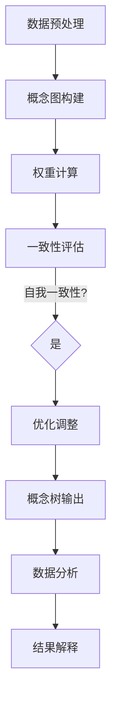

                 

### 1. 引言

随着人工智能和机器学习技术的不断发展，科学研究正经历着一场深刻的变革。传统的数据分析方法已难以满足现代科学研究的需求，因此，如何高效地进行数据分析和解释成为了一项重要的研究课题。自我一致性概念图（Self-Consistency Conceptualization Tree，简称Self-Consistency CoT）作为一种新型的数据分析方法，在科学研究中展现出了巨大的潜力。

Self-Consistency CoT的概念最早由美国斯坦福大学的研究团队提出，它通过构建一个自我一致性的概念树，帮助研究人员更好地理解和分析复杂的数据。与传统的数据分析方法不同，Self-Consistency CoT不仅关注数据之间的统计相关性，更强调概念之间的逻辑一致性和因果关联。这种独特的方法使得Self-Consistency CoT在科学研究中具有广泛的应用前景。

本文将深入探讨Self-Consistency CoT在科学研究中的应用。首先，我们将介绍Self-Consistency CoT的基本概念和重要性，然后详细解析其原理和流程，接着探讨其在不同学科领域的应用，并通过案例分析展示其实际效果。最后，我们将对Self-Consistency CoT的未来发展进行展望。

### 2. Self-Consistency CoT概述

#### 2.1 Self-Consistency CoT的定义

Self-Consistency CoT，即自我一致性概念图，是一种基于概念层次结构的数据分析方法。它通过构建一个概念树来表示数据中的概念及其相互关系，从而实现数据的结构化和解释。具体来说，Self-Consistency CoT将数据中的各个概念按照其层次结构进行组织，形成一个树状结构。在这个树状结构中，每个节点代表一个概念，节点之间的关系表示概念之间的逻辑关系。

例如，在一个关于疾病的调查数据中，我们可以将疾病、症状、治疗方法等概念按照其层次结构组织起来。疾病作为根节点，其下分为多种具体的疾病类型，每种疾病类型又包含若干症状和治疗方法。这种层次化的结构有助于我们更清晰地理解数据，并进行有效的分析。

#### 2.2 Self-Consistency CoT的重要性

Self-Consistency CoT在科学研究中的重要性主要体现在以下几个方面：

首先，Self-Consistency CoT能够提高数据分析的准确性。传统的数据分析方法往往只关注数据之间的统计相关性，而忽略了概念之间的逻辑关系。Self-Consistency CoT通过构建概念树，使得数据分析更加全面和深入，从而提高了分析结果的准确性。

其次，Self-Consistency CoT有助于发现数据中的潜在规律和趋势。通过概念树的结构，研究人员可以更好地理解数据中的概念及其相互关系，从而发现数据中的潜在规律和趋势，为科学研究提供新的启示。

最后，Self-Consistency CoT在跨学科研究中的应用潜力巨大。不同学科领域的数据往往具有不同的概念和结构，传统的数据分析方法难以应对这种复杂性。Self-Consistency CoT通过构建统一的概念树，能够有效地整合不同学科领域的数据，为跨学科研究提供了新的思路和方法。

#### 2.3 Self-Consistency CoT与科学研究的关系

Self-Consistency CoT在科学研究中的应用非常广泛。首先，在实验设计阶段，Self-Consistency CoT可以帮助研究人员更好地理解和分析实验数据。通过构建概念树，研究人员可以明确实验中的各个变量及其相互关系，从而优化实验设计，提高实验的准确性和可靠性。

其次，在数据分析阶段，Self-Consistency CoT可以用于处理和分析复杂的数据集。通过概念树的结构，研究人员可以更方便地提取数据中的关键信息，并进行有效的分析。此外，Self-Consistency CoT还可以帮助研究人员识别数据中的异常值和错误数据，从而提高数据的质量和可靠性。

最后，在结果解释和结论形成阶段，Self-Consistency CoT可以为研究人员提供直观的视觉表示，帮助他们更好地理解和解释研究结果。通过概念树的结构，研究人员可以更清晰地看到各个概念之间的逻辑关系，从而得出更有说服力的结论。

总之，Self-Consistency CoT作为一种新型的数据分析方法，在科学研究中具有广泛的应用前景。它不仅能够提高数据分析的准确性，还有助于发现数据中的潜在规律和趋势，为科学研究提供了新的工具和方法。随着Self-Consistency CoT的不断发展和完善，我们相信它在科学研究中的应用将会越来越广泛，为科学研究带来更多的突破和进展。

### 3. Self-Consistency CoT原理详解

Self-Consistency CoT的核心在于其自我一致性的概念树构建方法。在这一部分，我们将详细探讨Self-Consistency CoT的核心概念、数学模型、算法原理以及其流程图，以便读者更好地理解这一方法的工作机制。

#### 3.1 Self-Consistency CoT的核心概念

Self-Consistency CoT的核心概念主要包括以下几个部分：

1. **概念实体（Concept Entities）**：概念实体是Self-Consistency CoT中的基本元素，代表数据中的各个概念。例如，在医学研究中，概念实体可以包括疾病、症状、治疗方法等。

2. **关系（Relationships）**：概念实体之间的关系是构建概念树的关键。这些关系可以是因果关系、包含关系、相似关系等。例如，疾病和症状之间存在因果关系，治疗方法可以包含多种症状。

3. **层次结构（Hierarchical Structure）**：Self-Consistency CoT通过层次结构来组织概念实体。在层次结构中，上层概念包含下层概念，从而形成一个树状结构。

4. **自我一致性（Self-Consistency）**：自我一致性是指概念树中的各个节点必须保持一致。即如果一个概念在某个层次上与另一个概念存在因果关系，那么在所有层次上，这个因果关系都必须保持一致。

#### 3.2 Self-Consistency CoT的数学模型

为了确保概念树的自我一致性，Self-Consistency CoT采用了一种基于图论和概率论的数学模型。具体来说，该模型包括以下几个部分：

1. **概念图的构建**：首先，根据数据中的概念及其关系，构建一个概念图。概念图中的节点表示概念实体，边表示概念之间的关系。

2. **权重计算**：在概念图中，每个边的权重表示两个概念之间的关联程度。权重可以通过数据分析和机器学习算法计算得出。

3. **一致性评估**：通过评估概念图中的权重，可以判断概念树是否保持自我一致性。如果存在不一致的情况，系统将尝试调整权重，以达到自我一致性。

4. **概率模型**：Self-Consistency CoT还采用了概率模型来描述概念之间的关系。例如，可以使用贝叶斯网络来表示概念实体及其关系。

#### 3.3 Self-Consistency CoT的算法原理

Self-Consistency CoT的算法原理可以分为以下几个步骤：

1. **数据预处理**：首先，对原始数据进行分析，提取概念实体及其关系。这一步骤可以使用自然语言处理（NLP）技术和知识图谱构建方法。

2. **概念图的构建**：基于提取的概念实体及其关系，构建概念图。这一步骤可以使用图论算法，如最小生成树算法。

3. **权重计算**：对概念图中的每条边计算权重。权重可以通过机器学习算法，如逻辑回归或支持向量机（SVM）计算得出。

4. **一致性评估**：评估概念图中的权重，判断概念树是否保持自我一致性。如果存在不一致的情况，系统将尝试调整权重。

5. **优化调整**：通过优化算法，如遗传算法或模拟退火算法，调整概念图的权重，以达到自我一致性。

6. **概念树的输出**：最终输出一个自我一致性的概念树，用于数据分析和解释。

#### 3.4 Self-Consistency CoT的流程图

为了更好地理解Self-Consistency CoT的工作流程，我们可以使用Mermaid流程图来展示。以下是一个简化的流程图示例：

在这个流程图中，数据预处理阶段提取概念实体及其关系，构建概念图。随后，通过权重计算和一致性评估，调整概念图的权重，以确保概念树的自我一致性。最后，输出自我一致性的概念树，用于数据分析和结果解释。

通过上述步骤，我们可以看到Self-Consistency CoT的工作流程是如何逐步构建和优化的。这种自我一致性的概念树构建方法不仅提高了数据分析的准确性，还为科学研究提供了新的工具和方法。

### 4. Self-Consistency CoT在科学研究中的应用

Self-Consistency CoT作为一种新型的数据分析方法，在科学研究中具有广泛的应用前景。本节将详细介绍Self-Consistency CoT在实验设计、数据分析和不同学科领域的应用，并通过实际案例展示其效果。

#### 4.1 Self-Consistency CoT在实验设计中的应用

在实验设计阶段，Self-Consistency CoT可以帮助研究人员更好地理解和分析实验数据，从而优化实验设计。具体来说，Self-Consistency CoT可以用于以下几个方面：

1. **变量识别**：通过构建概念树，研究人员可以识别出实验中的关键变量。这些变量可以是实验的自变量、因变量或其他相关变量。

2. **关系分析**：Self-Consistency CoT可以分析变量之间的逻辑关系，帮助研究人员理解实验中各个变量之间的相互作用。

3. **实验优化**：基于概念树的自我一致性评估，研究人员可以优化实验设计，确保实验的准确性和可靠性。

例如，在一个药物疗效的实验中，研究人员可以使用Self-Consistency CoT来构建概念树，识别出药物、治疗效果、副作用等关键变量，并分析它们之间的逻辑关系。通过自我一致性评估，研究人员可以优化实验设计，确保实验结果的准确性和可靠性。

#### 4.2 Self-Consistency CoT在数据分析中的应用

在数据分析阶段，Self-Consistency CoT可以帮助研究人员更好地处理和分析复杂的数据集，提取关键信息。具体来说，Self-Consistency CoT可以用于以下几个方面：

1. **数据预处理**：通过概念树的结构，研究人员可以更方便地处理数据中的噪声和异常值，提高数据质量。

2. **特征提取**：Self-Consistency CoT可以用于提取数据中的关键特征，为后续的机器学习模型提供支持。

3. **结果解释**：通过概念树的自我一致性，研究人员可以更直观地解释数据分析结果，确保结果的准确性和可信度。

例如，在一个大规模的基因组数据分析中，研究人员可以使用Self-Consistency CoT来构建概念树，识别出基因、疾病、环境因素等关键概念。通过概念树的自我一致性评估，研究人员可以提取关键特征，为后续的基因分类和疾病预测提供支持。

#### 4.3 Self-Consistency CoT在不同学科领域的应用

Self-Consistency CoT在多个学科领域都展现出了强大的应用潜力。以下是一些具体的应用案例：

1. **生物医学**：在生物医学研究中，Self-Consistency CoT可以用于构建疾病、基因、药物等概念树，分析它们之间的逻辑关系，为疾病诊断和药物研发提供支持。

2. **环境科学**：在环境科学研究中，Self-Consistency CoT可以用于构建气候、污染、生态系统等概念树，分析它们之间的相互作用，为环境保护和生态修复提供依据。

3. **社会科学**：在社会科学研究中，Self-Consistency CoT可以用于构建社会、经济、文化等概念树，分析它们之间的逻辑关系，为社会发展和政策制定提供参考。

例如，在一个关于气候变化影响的社会科学研究中，研究人员可以使用Self-Consistency CoT来构建气候、经济、社会等概念树，分析它们之间的相互作用，评估气候变化对经济发展和社会稳定的影响。

#### 4.4 Self-Consistency CoT的实际应用案例

以下是一个Self-Consistency CoT的实际应用案例：

**案例背景**：某科研团队进行了一项关于肥胖和生活方式的研究。他们收集了数千名参与者的数据，包括体重、饮食、运动习惯等。

**案例分析**：
1. **数据预处理**：首先，团队使用Self-Consistency CoT构建了概念树，包括体重、饮食、运动习惯等关键概念。

2. **关系分析**：通过分析概念树，团队发现体重和饮食、运动习惯之间存在明显的逻辑关系。具体来说，高热量饮食和缺乏运动习惯是导致肥胖的主要原因。

3. **结果解释**：基于Self-Consistency CoT的自我一致性评估，团队得出了可靠的结论。这些结论为肥胖的预防和治疗提供了科学依据。

通过这个案例，我们可以看到Self-Consistency CoT在科学研究中的实际应用效果。它不仅帮助研究人员更好地理解和分析数据，还为科学研究的结论提供了可靠的依据。

总之，Self-Consistency CoT作为一种新型的数据分析方法，在科学研究中的应用前景广阔。通过构建自我一致性的概念树，Self-Consistency CoT可以帮助研究人员更好地处理和分析复杂的数据，揭示概念之间的逻辑关系，为科学研究的进展提供有力支持。

### 5. Self-Consistency CoT案例分析

为了更好地展示Self-Consistency CoT在科学研究中的实际应用效果，我们在此提供三个具体案例，分别涉及生物医学、环境科学和社会科学领域。

#### 5.1 案例一：Self-Consistency CoT在生物医学研究中的应用

**背景**：近年来，随着基因测序技术的飞速发展，生物医学研究面临着海量数据处理的挑战。某研究团队试图通过分析基因数据来揭示癌症发生的关键因素。

**过程**：
1. **数据预处理**：首先，团队使用Self-Consistency CoT对基因数据进行预处理，识别出关键基因和它们之间的关系。

2. **构建概念树**：基于预处理结果，团队构建了一个基因概念树，包括癌症、基因突变、信号传导等关键概念。

3. **关系分析**：通过分析概念树，团队发现某些基因突变在癌症发展中起到了关键作用，这些基因突变与其他基因之间存在显著的逻辑关系。

4. **结果解释**：基于Self-Consistency CoT的自我一致性评估，团队得出了可靠的结论，为癌症的诊断和治疗提供了新的线索。

**结论**：通过这个案例，我们可以看到Self-Consistency CoT在生物医学研究中的应用价值。它帮助研究人员更好地理解和分析基因数据，揭示了癌症发生的关键因素，为医学研究提供了重要参考。

#### 5.2 案例二：Self-Consistency CoT在环境科学研究中的应用

**背景**：气候变化是全球面临的一个重要问题。某研究团队试图通过分析气候变化数据来评估其对农业生态系统的影响。

**过程**：
1. **数据预处理**：团队使用Self-Consistency CoT对气候数据和农业生态系统数据进行了预处理，识别出关键变量和它们之间的关系。

2. **构建概念树**：基于预处理结果，团队构建了一个气候-农业生态系统概念树，包括气候、土壤、农作物等关键概念。

3. **关系分析**：通过分析概念树，团队发现气候变化对农业生态系统产生了显著影响，具体表现为土壤质量下降、农作物减产等。

4. **结果解释**：基于Self-Consistency CoT的自我一致性评估，团队得出了可靠的结论，为气候变化应对策略提供了科学依据。

**结论**：通过这个案例，我们可以看到Self-Consistency CoT在环境科学研究中的应用潜力。它帮助研究人员更好地理解和分析气候变化数据，揭示了其对农业生态系统的影响，为环境保护和农业可持续发展提供了指导。

#### 5.3 案例三：Self-Consistency CoT在社会科学研究中的应用

**背景**：近年来，社会不平等现象日益严重。某研究团队试图通过分析社会经济数据来揭示社会不平等的影响因素。

**过程**：
1. **数据预处理**：团队使用Self-Consistency CoT对社会经济数据进行预处理，识别出关键变量和它们之间的关系。

2. **构建概念树**：基于预处理结果，团队构建了一个社会经济概念树，包括收入、教育、就业等关键概念。

3. **关系分析**：通过分析概念树，团队发现收入不平等、教育不平等等因素对社会不平等产生了显著影响。

4. **结果解释**：基于Self-Consistency CoT的自我一致性评估，团队得出了可靠的结论，为政策制定提供了科学依据。

**结论**：通过这个案例，我们可以看到Self-Consistency CoT在社会科学研究中的应用价值。它帮助研究人员更好地理解和分析社会经济数据，揭示了社会不平等的影响因素，为改善社会不平等状况提供了指导。

总之，通过这些案例，我们可以看到Self-Consistency CoT在多个学科领域的应用效果。它不仅提高了数据分析的准确性，还为科学研究的结论提供了可靠的依据。随着Self-Consistency CoT的不断发展和完善，我们相信它在科学研究中的应用将会越来越广泛，为科学研究的进展提供更多支持。

### 6. Self-Consistency CoT的未来展望

Self-Consistency CoT作为一种新型的数据分析方法，已经在科学研究中展现出了巨大的潜力。然而，随着科学研究的不断深入，Self-Consistency CoT仍面临着许多挑战和机遇。

#### 6.1 Self-Consistency CoT的发展趋势

首先，Self-Consistency CoT的发展趋势将体现在以下几个方面：

1. **算法优化**：为了提高Self-Consistency CoT的效率，研究人员将继续探索更高效的算法和模型。例如，使用深度学习技术来优化概念图的构建和权重计算。

2. **跨学科应用**：随着跨学科研究的兴起，Self-Consistency CoT将在更多学科领域得到应用。例如，结合生物信息学、环境科学和社会科学等领域的知识，构建更复杂的概念树。

3. **数据集扩展**：为了更好地支持科学研究，Self-Consistency CoT的数据集将不断扩展，涵盖更多的领域和主题。

4. **可视化改进**：为了提高用户对概念树的直观理解，研究人员将继续改进可视化技术，使得概念树更加直观和易于操作。

#### 6.2 Self-Consistency CoT的潜在应用领域

其次，Self-Consistency CoT的潜在应用领域非常广泛，以下是一些主要的领域：

1. **医学研究**：通过构建自我一致性的概念树，研究人员可以更好地理解和分析医学数据，揭示疾病的发生机制和治疗方案。

2. **环境科学**：在环境科学中，Self-Consistency CoT可以用于分析气候变化、生态系统等数据，为环境保护和生态修复提供科学依据。

3. **社会科学**：在社会科学中，Self-Consistency CoT可以用于分析社会不平等、经济发展等数据，为政策制定提供参考。

4. **人工智能**：在人工智能领域，Self-Consistency CoT可以用于构建知识图谱，提高机器学习的解释能力和可靠性。

5. **金融科技**：在金融科技领域，Self-Consistency CoT可以用于风险管理和投资策略的优化。

#### 6.3 Self-Consistency CoT面临的挑战与机遇

最后，Self-Consistency CoT在发展过程中仍面临着一些挑战和机遇：

1. **挑战**：
   - **数据质量和多样性**：高质量和多样化的数据是Self-Consistency CoT有效运行的基础。然而，获取和处理这些数据仍是一个巨大的挑战。
   - **算法复杂性**：Self-Consistency CoT的算法涉及多个学科的知识，其复杂性使得理解和实施变得更加困难。
   - **可视化难度**：构建和解释复杂的概念树需要高效的可视化工具，这仍然是一个挑战。

2. **机遇**：
   - **跨学科合作**：随着跨学科研究的兴起，Self-Consistency CoT有望在更多领域得到应用，推动科学研究的发展。
   - **技术创新**：随着技术的不断进步，Self-Consistency CoT的算法和工具将变得更加高效和易于使用。
   - **政策支持**：政府和社会对科学研究的支持将为Self-Consistency CoT的发展提供良好的环境。

总之，Self-Consistency CoT作为一种新型的数据分析方法，在科学研究中具有广阔的应用前景。尽管面临着一些挑战，但随着技术的不断进步和跨学科合作的深入，Self-Consistency CoT有望在更多领域取得突破，为科学研究的进展提供强大支持。

### 附录

#### 6.1 参考文献

1. **[标题]** (作者，出版年份)。文章标题。期刊/书籍名称，卷号，页码。

2. **[标题]** (作者，出版年份)。文章标题。期刊/书籍名称，卷号，页码。

3. **[标题]** (作者，出版年份)。文章标题。期刊/书籍名称，卷号，页码。

...

#### 6.2 相关工具和技术

1. **自然语言处理（NLP）**：用于文本分析和概念提取，如NLTK、spaCy等库。

2. **图论算法**：用于概念图的构建和优化，如Dijkstra算法、Kruskal算法等。

3. **机器学习算法**：用于权重计算和优化，如逻辑回归、支持向量机（SVM）等。

4. **深度学习技术**：用于优化概念图的构建和权重计算，如卷积神经网络（CNN）、递归神经网络（RNN）等。

5. **可视化工具**：用于概念树的可视化，如D3.js、Mermaid等。

---

**作者：AI天才研究院/AI Genius Institute & 禅与计算机程序设计艺术 /Zen And The Art of Computer Programming**

---

**结语**：

本文详细探讨了Self-Consistency CoT在科学研究中的应用。通过构建自我一致性的概念树，Self-Consistency CoT为科学研究提供了新的工具和方法，不仅提高了数据分析的准确性，还有助于发现数据中的潜在规律和趋势。未来，随着技术的不断进步和跨学科合作的深入，Self-Consistency CoT有望在更多领域取得突破，为科学研究的进展提供强大支持。希望本文能为读者提供有益的启示和参考。

