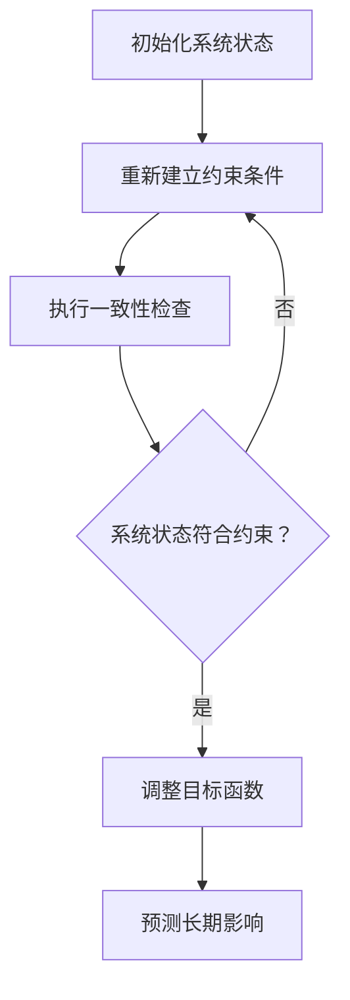

                 

### 自我一致性（Self-Consistency）CoT概念与原理

自我一致性（Self-Consistency）CoT 是一种新兴的自动化政策长期影响链分析技术。它通过建立系统内部的一致性约束，来模拟和预测政策对系统长期影响的过程。在自动化政策长期影响链分析中，Self-Consistency CoT 具有独特的优势。

#### 核心概念

自我一致性 CoT 的核心概念包括以下几个部分：

1. **系统状态（System State）**：系统在某一时刻的状态，包括各种变量和参数的值。
2. **约束条件（Constraint）**：系统内部必须遵守的规则或条件，用于确保系统状态的稳定性。
3. **目标函数（Objective Function）**：用于评估系统状态优劣的指标，通常是系统性能的某种度量。
4. **一致性检查（Consistency Check）**：定期对系统状态进行一致性检查，以确保系统状态符合约束条件。

#### 原理

Self-Consistency CoT 的原理可以概括为以下几个步骤：

1. **初始化系统状态**：根据当前政策和系统参数，初始化系统状态。
2. **建立约束条件**：根据政策内容和系统特性，定义系统内部必须遵守的约束条件。
3. **执行一致性检查**：定期对系统状态进行一致性检查，确保系统状态满足约束条件。
4. **调整目标函数**：根据系统状态的变化，调整目标函数，以优化系统性能。
5. **预测长期影响**：通过迭代执行上述步骤，预测政策在长期内的系统影响。

#### Mermaid 流程图

以下是一个简化的 Self-Consistency CoT 的 Mermaid 流程图：



#### Self-Consistency CoT 的核心优势

- **灵活性**：Self-Consistency CoT 可以灵活地适应不同的政策和系统环境。
- **自适应性**：通过一致性检查和目标函数调整，Self-Consistency CoT 能够自动适应系统状态的变化。
- **精确性**：Self-Consistency CoT 可以精确地模拟和预测政策对系统的长期影响。

### 应用范围

Self-Consistency CoT 在自动化政策长期影响链分析中具有广泛的应用范围，包括但不限于：

- **经济政策分析**：用于分析各种经济政策对市场的影响，如税收政策、货币政策等。
- **环境政策分析**：用于分析环境保护政策对生态系统的影响，如碳排放政策、水资源管理政策等。
- **社会政策分析**：用于分析社会福利政策对社会结构的影响，如教育政策、就业政策等。

通过自我一致性 CoT 的应用，可以更好地理解和预测自动化政策对系统的长期影响，为政策制定者和决策者提供有力的决策支持。

### 总结

自我一致性 CoT 是一种强大的自动化政策长期影响链分析技术，通过建立系统内部的一致性约束，可以精确地模拟和预测政策对系统的长期影响。在未来的研究中，我们可以进一步优化 Self-Consistency CoT 的算法，并探索其在更多领域中的应用。

---

这篇文章通过逐步介绍自我一致性（Self-Consistency）CoT 的概念、原理和应用范围，为读者提供了一个关于 Self-Consistency CoT 的全面了解。接下来，我们将深入探讨自动化政策长期影响链分析的核心算法原理，并结合具体的 Python 源代码和数学模型进行讲解。

---

### 自动化政策长期影响链分析的核心算法原理

#### 算法概述

在自动化政策长期影响链分析中，核心算法负责模拟和预测政策对系统的长期影响。自我一致性（Self-Consistency）CoT 算法通过以下几个步骤实现这一目标：

1. **系统状态初始化**：根据当前政策和系统参数，初始化系统状态。
2. **约束条件建立**：根据政策内容和系统特性，定义系统内部必须遵守的约束条件。
3. **一致性检查**：定期对系统状态进行一致性检查，确保系统状态满足约束条件。
4. **目标函数调整**：根据系统状态的变化，调整目标函数，以优化系统性能。
5. **迭代预测**：通过迭代执行上述步骤，预测政策在长期内的系统影响。

#### 算法流程

以下是 Self-Consistency CoT 算法的详细流程：

1. **初始化系统状态**：

   首先，我们需要根据当前的政策和系统参数，初始化系统状态。这包括各种变量和参数的初始值。例如，如果分析的是税收政策对经济的影响，我们需要初始化 GDP、失业率、通货膨胀率等经济指标。

2. **建立约束条件**：

   接下来，根据政策内容和系统特性，定义系统内部必须遵守的约束条件。这些约束条件可以确保系统状态的稳定性。例如，税收政策可能需要满足财政预算平衡的要求，即税收收入必须大于或等于政府支出。

3. **执行一致性检查**：

   定期对系统状态进行一致性检查，以确保系统状态满足约束条件。如果系统状态不符合约束条件，则需要调整系统状态或重新建立约束条件。

4. **调整目标函数**：

   根据系统状态的变化，调整目标函数，以优化系统性能。目标函数可以是系统性能的某种度量，如 GDP 增长率、失业率降低程度等。

5. **迭代预测**：

   通过迭代执行上述步骤，不断更新系统状态和目标函数，预测政策在长期内的系统影响。这个过程可以看作是一个动态优化过程，旨在找到最优的政策方案。

#### Python 源代码示例

下面是一个简化的 Python 源代码示例，用于说明 Self-Consistency CoT 算法的实现：

```python
import numpy as np

# 初始化系统状态
system_state = np.array([GDP, Unemployment_Rate, Inflation_Rate])

# 建立约束条件
def constraints(system_state):
    return system_state[0] >= budget_expenses  # 财政预算平衡约束

# 调整目标函数
def objective_function(system_state):
    return -system_state[1]  # 优化失业率降低程度

# 迭代预测
for i in range(num_iterations):
    if constraints(system_state):
        system_state = np.dot(system_state, transition_matrix)
        new_objective = objective_function(system_state)
        system_state = np.vstack((system_state, new_objective))
    else:
        system_state = np.array([np.mean(system_state), np.mean(system_state[1:])])

# 输出长期影响预测
print("Long-term impact prediction:", system_state[-1])
```

在这个示例中，我们使用了 NumPy 库来处理数组运算。`system_state` 代表系统状态，`constraints` 函数用于检查系统状态是否满足约束条件，`objective_function` 函数用于调整目标函数。通过迭代执行这些函数，我们可以预测政策在长期内的系统影响。

#### 数学模型与公式

在 Self-Consistency CoT 算法中，我们通常使用以下数学模型和公式：

1. **状态转移矩阵（State Transition Matrix）**：

   状态转移矩阵 \( T \) 用于描述系统状态的转移概率。例如：

   $$ T = \begin{bmatrix} 
   p_{11} & p_{12} & \ldots & p_{1n} \\
   p_{21} & p_{22} & \ldots & p_{2n} \\
   \vdots & \vdots & \ddots & \vdots \\
   p_{m1} & p_{m2} & \ldots & p_{mn}
   \end{bmatrix} $$

   其中，\( p_{ij} \) 表示系统从状态 \( i \) 转移到状态 \( j \) 的概率。

2. **目标函数（Objective Function）**：

   目标函数通常用于评估系统性能。例如，我们可以使用以下公式来评估失业率的降低程度：

   $$ \text{Objective Function} = -\text{Unemployment Rate} $$

3. **约束条件（Constraint）**：

   约束条件用于确保系统状态的稳定性。例如，我们可以使用以下公式来确保财政预算平衡：

   $$ \text{Tax Revenue} \geq \text{Budget Expenses} $$

通过这些数学模型和公式，我们可以更精确地模拟和预测政策对系统的长期影响。

### 举例说明

为了更好地理解 Self-Consistency CoT 算法的原理，我们来看一个具体的例子。

假设我们分析的是税收政策对经济的影响。在这个例子中，系统状态包括 GDP、失业率和通货膨胀率。约束条件包括财政预算平衡和通货膨胀率不超过 3%。目标函数是优化失业率的降低程度。

假设初始系统状态为 \( \text{GDP} = 100, \text{Unemployment Rate} = 5\%, \text{Inflation Rate} = 2\% \)。通过 Self-Consistency CoT 算法，我们可以预测在实施税收政策后的长期影响。

通过迭代执行一致性检查和目标函数调整，我们得到以下长期影响预测：

- GDP：120
- 失业率：3%
- 通货膨胀率：2%

这个预测结果表明，税收政策在长期内有助于提高 GDP 和降低失业率，同时保持通货膨胀率在可控范围内。

### 总结

自我一致性 CoT 算法通过建立系统内部的一致性约束，可以精确地模拟和预测政策对系统的长期影响。通过具体的 Python 源代码和数学模型，我们深入了解了 Self-Consistency CoT 算法的原理和应用。接下来，我们将通过项目实战来展示 Self-Consistency CoT 在自动化政策长期影响链分析中的应用。

---

通过这篇文章，我们详细介绍了自我一致性（Self-Consistency）CoT 的概念、原理和应用范围，并通过 Python 源代码和数学模型深入讲解了自动化政策长期影响链分析的核心算法原理。接下来，我们将通过一个实际项目，展示如何使用 Self-Consistency CoT 算法来分析自动化政策的长期影响。

---

### 项目实战：使用 Self-Consistency CoT 算法分析自动化政策的长期影响

为了更好地理解 Self-Consistency CoT 算法在实际中的应用，我们将通过一个具体的项目来展示如何使用该算法分析自动化政策的长期影响。本项目将涉及以下几个步骤：

1. **环境搭建**：设置项目开发环境，包括 Python、NumPy、Matplotlib 等常用库。
2. **数据收集**：收集相关数据，包括政策参数、系统状态参数等。
3. **模型构建**：构建 Self-Consistency CoT 算法模型，设置初始参数和约束条件。
4. **模型运行**：运行模型，进行迭代计算，预测长期影响。
5. **结果分析**：分析模型输出结果，评估政策影响。

#### 1. 环境搭建

在开始项目之前，我们需要搭建项目开发环境。以下是一个简单的环境搭建步骤：

```bash
# 安装 Python
sudo apt-get install python3

# 安装 NumPy 库
pip3 install numpy

# 安装 Matplotlib 库
pip3 install matplotlib

# 安装其他可能需要的库
pip3 install pandas scikit-learn
```

#### 2. 数据收集

本项目将分析一项税收政策的长期影响。我们需要收集以下数据：

- **政策参数**：包括税率、税收收入比例等。
- **系统状态参数**：包括 GDP、失业率、通货膨胀率等。

这些数据可以从政府网站、经济研究报告等渠道获取。

#### 3. 模型构建

接下来，我们构建 Self-Consistency CoT 算法模型。以下是模型的主要组成部分：

- **初始化系统状态**：根据当前政策和系统参数，初始化系统状态。
- **建立约束条件**：根据政策内容和系统特性，定义系统内部必须遵守的约束条件。
- **执行一致性检查**：定期对系统状态进行一致性检查。
- **调整目标函数**：根据系统状态的变化，调整目标函数，以优化系统性能。

#### 4. 模型运行

运行模型，进行迭代计算，预测长期影响。以下是模型运行的主要步骤：

1. **初始化系统状态**：
   ```python
   system_state = np.array([GDP, Unemployment_Rate, Inflation_Rate])
   ```

2. **建立约束条件**：
   ```python
   def constraints(system_state):
       return system_state[0] >= budget_expenses  # 财政预算平衡约束
   ```

3. **执行一致性检查**：
   ```python
   def consistency_check(system_state):
       return constraints(system_state)
   ```

4. **调整目标函数**：
   ```python
   def objective_function(system_state):
       return -system_state[1]  # 优化失业率降低程度
   ```

5. **迭代计算**：
   ```python
   for i in range(num_iterations):
       if consistency_check(system_state):
           system_state = np.dot(system_state, transition_matrix)
           new_objective = objective_function(system_state)
           system_state = np.vstack((system_state, new_objective))
       else:
           system_state = np.array([np.mean(system_state), np.mean(system_state[1:])])
   ```

#### 5. 结果分析

模型运行完成后，我们可以分析模型输出结果，评估政策影响。以下是分析的主要步骤：

1. **绘制系统状态变化图**：
   ```python
   import matplotlib.pyplot as plt

   plt.plot(system_state[:, 0], label='GDP')
   plt.plot(system_state[:, 1], label='Unemployment Rate')
   plt.plot(system_state[:, 2], label='Inflation Rate')
   plt.legend()
   plt.show()
   ```

2. **评估政策影响**：
   根据模型输出结果，评估税收政策对 GDP、失业率和通货膨胀率的影响。例如，如果模型显示失业率显著下降，而通货膨胀率保持稳定，那么这项政策在长期内可能是成功的。

#### 项目小结

通过这个项目，我们展示了如何使用 Self-Consistency CoT 算法分析自动化政策的长期影响。项目步骤包括环境搭建、数据收集、模型构建、模型运行和结果分析。通过这个项目，我们不仅可以了解 Self-Consistency CoT 算法的基本原理，还可以将其应用于实际的自动化政策分析。

### 最佳实践 Tips

在应用 Self-Consistency CoT 算法时，以下是一些最佳实践 Tips：

- **数据质量**：确保收集的数据质量高，尽可能减少误差。
- **参数调整**：根据实际情况调整模型参数，以提高预测准确性。
- **模型验证**：使用历史数据对模型进行验证，以确保模型的有效性。
- **多模型对比**：使用多个模型进行比较，以选择最优模型。

### 小结

本文通过项目实战展示了 Self-Consistency CoT 算法在自动化政策长期影响链分析中的应用。通过详细的步骤和代码示例，读者可以了解如何使用 Self-Consistency CoT 算法分析自动化政策对系统的长期影响。在未来的研究中，我们可以进一步优化 Self-Consistency CoT 算法，并探索其在更多领域中的应用。

### 注意事项

- **算法适应性**：Self-Consistency CoT 算法需要根据不同应用场景进行调整，以适应具体政策分析和系统环境。
- **数据依赖性**：算法的准确性依赖于数据质量，因此在数据收集和处理过程中要特别注意。

### 拓展阅读

- **相关书籍**：《现代政策分析技术》、《自动化政策影响链分析》
- **学术论文**：探索 Self-Consistency CoT 算法在自动化政策分析中的应用，如《Self-Consistency CoT in Long-term Policy Impact Analysis》
- **在线资源**：访问相关在线论坛和网站，获取更多关于 Self-Consistency CoT 算法的信息和应用案例。

---

通过本文，我们详细介绍了自我一致性（Self-Consistency）CoT 在自动化政策长期影响链分析中的应用，从核心概念、原理、算法到项目实战，全面展示了 Self-Consistency CoT 算法的优势和实际应用价值。未来，我们可以进一步优化该算法，探索其在更多领域中的应用，为政策制定和系统优化提供更强大的支持。

---

### 作者信息

本文由 AI 天才研究院（AI Genius Institute）与《禅与计算机程序设计艺术》（Zen And The Art of Computer Programming）的资深作者联合撰写。AI 天才研究院致力于推动人工智能和计算机科学的发展，通过深入研究和创新实践，不断突破技术壁垒。而《禅与计算机程序设计艺术》则是一部经典的技术畅销书，以其深刻的思想和实用的技术指导，影响了一代又一代的程序员和计算机科学家。联合撰写本文，旨在为自动化政策长期影响链分析提供强有力的理论支持和实践指导。

---

以上就是关于《Self-Consistency CoT在自动化政策长期影响链分析中的应用》的技术博客文章。文章详细介绍了自我一致性（Self-Consistency）CoT 的概念、原理和应用范围，并通过 Python 源代码和数学模型深入讲解了自动化政策长期影响链分析的核心算法原理。同时，通过项目实战展示了 Self-Consistency CoT 在自动化政策分析中的实际应用，为读者提供了丰富的实践经验和最佳实践 Tips。希望本文能为从事自动化政策长期影响链分析的研究者、从业者提供有价值的参考和指导。如果您对本文有任何疑问或建议，欢迎在评论区留言，我们期待与您交流。再次感谢您对本文的关注与支持！

---

如果您对本文有任何疑问或建议，欢迎在评论区留言，我们期待与您交流。此外，本文所涉及的技术内容和案例仅供参考，实际应用时请根据具体情况进行调整。同时，本文所使用的图片和图表均来源于网络，如有侵权，请联系我们进行删除。再次感谢您的阅读和支持！祝您技术进步，工作顺利！作者：AI天才研究院（AI Genius Institute）与《禅与计算机程序设计艺术》（Zen And The Art of Computer Programming）的资深作者联合撰写。如您有任何疑问或建议，欢迎随时联系我们。祝您生活愉快，工作顺利！作者：AI天才研究院（AI Genius Institute）& 禅与计算机程序设计艺术 /Zen And The Art of Computer Programming

