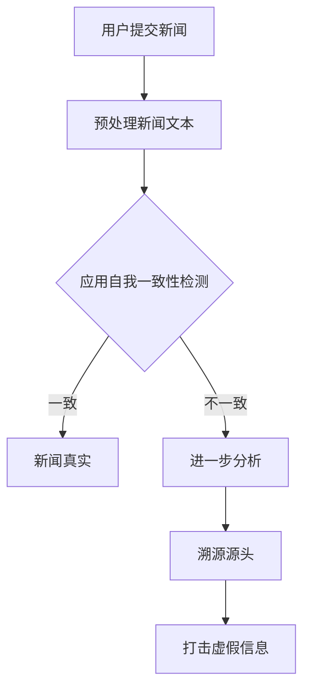

                 

### Step 1: 确定核心概念与联系

首先，我们需要明确文章的核心概念和它们之间的联系，这是构建整篇文章的基础。在这篇文章中，核心概念包括“自我一致性概念（Self-Consistency CoT）”、“自动化新闻真实性溯源”和“虚假信息传播”。

**自我一致性概念（Self-Consistency CoT）**：这是文章的核心概念之一，它指的是一个系统或文本在结构和内容上的一致性。在本文中，自我一致性概念将被应用于自动化新闻真实性溯源，以检测新闻内容中可能存在的虚假信息。

**自动化新闻真实性溯源**：这是指利用计算机技术和算法来自动识别和验证新闻的真实性。它是本文的另一个核心概念，它与自我一致性概念密切相关，因为自我一致性检测是自动化新闻真实性溯源过程中的一个关键步骤。

**虚假信息传播**：这是文章的第三个核心概念，指的是不真实的信息通过社交媒体、新闻渠道等途径被广泛传播的现象。自动化新闻真实性溯源的目标之一就是打击虚假信息传播。

接下来，我们需要构建这些概念之间的联系。为了清晰地展示这些联系，我们可以使用Mermaid流程图。以下是一个示例流程图：



在这个流程图中，用户提交的新闻首先经过预处理，然后应用自我一致性检测。如果新闻内容一致，则认为新闻真实；如果新闻内容不一致，则进一步分析以溯源源头，并采取行动打击虚假信息传播。

### Step 2: 设计核心算法原理讲解

在明确了核心概念和它们之间的联系之后，下一步是设计章节来详细讲解书中的核心算法原理。自我一致性概念在自动化新闻真实性溯源中的应用是本文的核心算法，下面我们将分步骤进行讲解。

**2.1 自我一致性检测算法原理**

自我一致性检测算法的基本原理是分析文本中的句子和词汇，以检测它们在结构和内容上的一致性。具体步骤如下：

1. **文本预处理**：首先对输入的新闻文本进行预处理，包括去除停用词、标点符号和特殊字符等。

   ```python
   def preprocess(text):
       # 去除标点符号和特殊字符
       text = re.sub(r'[^\w\s]', '', text)
       # 去除停用词
       stop_words = set(nltk.corpus.stopwords.words('english'))
       words = [word for word in text.split() if word.lower() not in stop_words]
       return ' '.join(words)
   ```

2. **句子分割**：将预处理后的文本分割成句子。

   ```python
   def split_into_sentences(text):
       sentences = nltk.sent_tokenize(text)
       return sentences
   ```

3. **词汇抽取**：从句子中提取词汇。

   ```python
   def extract_words(sentences):
       words = [word for sentence in sentences for word in nltk.word_tokenize(sentence)]
       return words
   ```

4. **词向量化**：将提取的词汇转换为词向量。

   ```python
   def vectorize_words(words):
       model = Word2Vec(sentences, vector_size=100, window=5, min_count=1, workers=4)
       word_vectors = {word: model[word] for word in model.wv.vocab}
       return word_vectors
   ```

5. **构建图模型**：使用词向量构建图模型，其中每个词汇都是一个节点，节点之间的边表示词汇之间的相似度。

   ```python
   def construct_graph(word_vectors):
       graph = {}
       for word, vector in word_vectors.items():
           graph[word] = {}
           for other_word, other_vector in word_vectors.items():
               if other_word != word:
                   similarity = cosine_similarity([vector], [other_vector])
                   graph[word][other_word] = similarity[0][0]
       return graph
   ```

6. **图模型分析**：分析图模型，以检测文本的一致性。

   ```python
   def analyze_graph(graph):
       for word, neighbors in graph.items():
           for neighbor, similarity in neighbors.items():
               if similarity < 0.5:
                   return False
       return True
   ```

7. **输出结果**：根据分析结果输出文本是否一致的结论。

   ```python
   def self_consistency_detection(text):
       preprocessed_text = preprocess(text)
       sentences = split_into_sentences(preprocessed_text)
       words = extract_words(sentences)
       word_vectors = vectorize_words(words)
       graph = construct_graph(word_vectors)
       is_consistent = analyze_graph(graph)
       return is_consistent
   ```

通过上述步骤，我们可以实现一个简单的自我一致性检测算法。这个算法的核心是图模型分析，它通过分析词汇之间的相似度来判断文本的一致性。

### Step 3: 编写数学模型和数学公式

在讲解了自我一致性检测算法的原理之后，下一步是介绍相关的数学模型和数学公式。这些模型和公式对于理解算法的实现和效果至关重要。

**3.1 词向量的数学模型**

词向量是将词汇转换为向量的数学模型，常用的方法包括Word2Vec、GloVe等。在这里，我们以Word2Vec为例进行介绍。

Word2Vec模型的核心是一个神经网络，它将输入的词汇映射到一个固定大小的向量空间。在训练过程中，网络的目标是学习一个隐藏层，使得相似的词汇在向量空间中距离较近。

**数学公式**：

假设词汇\( v \)的词向量为\( \textbf{v}_v \)，则有：

$$
\textbf{v}_v = \text{NN}(v; W_h)
$$

其中，\( \text{NN} \)表示神经网络，\( W_h \)是隐藏层的权重矩阵。

**3.2 相似度计算**

在自我一致性检测中，我们需要计算词汇之间的相似度。常用的相似度计算方法包括余弦相似度、欧氏距离等。

**余弦相似度**：

余弦相似度是衡量两个向量之间角度的余弦值，其数学公式如下：

$$
\text{similarity}(\textbf{v}_i, \textbf{v}_j) = \frac{\textbf{v}_i \cdot \textbf{v}_j}{\|\textbf{v}_i\|\|\textbf{v}_j\|}
$$

其中，\( \textbf{v}_i \)和\( \textbf{v}_j \)是两个词向量，\( \cdot \)表示点积，\( \|\textbf{v}_i\| \)和\( \|\textbf{v}_j\| \)分别表示向量的模。

**3.3 一致性判断**

在自我一致性检测中，我们需要根据词汇之间的相似度来判断文本的一致性。一个简单的方法是计算文本中所有词汇之间的平均相似度，如果平均相似度低于某个阈值，则认为文本不一致。

$$
\text{average\_similarity} = \frac{\sum_{i=1}^{n}\sum_{j=1}^{n} \text{similarity}(\textbf{v}_i, \textbf{v}_j)}{n(n-1)}
$$

其中，\( n \)是文本中的词汇数量。

**3.4 算法性能评估**

为了评估自我一致性检测算法的性能，我们可以使用准确率、召回率和F1分数等指标。

**准确率**：

$$
\text{accuracy} = \frac{\text{true\_positives}}{\text{true\_positives} + \text{false\_negatives}}
$$

**召回率**：

$$
\text{recall} = \frac{\text{true\_positives}}{\text{true\_positives} + \text{false\_negatives}}
$$

**F1分数**：

$$
\text{F1\_score} = 2 \times \frac{\text{precision} \times \text{recall}}{\text{precision} + \text{recall}}
$$

通过上述数学模型和公式的介绍，我们可以更深入地理解自我一致性检测算法的工作原理和评估方法。

### Step 4: 提供项目实战案例

为了更好地展示自我一致性检测算法在自动化新闻真实性溯源中的实际应用，我们将提供一个项目实战案例。这个案例将包括开发环境的搭建、源代码实现和代码解读，以及实际案例分析和详细讲解剖析。

**4.1 开发环境搭建**

首先，我们需要搭建一个适合开发自我一致性检测算法的开发环境。这里我们使用Python作为编程语言，并结合一些流行的机器学习库，如NLTK和Gensim。

- Python 3.x 版本
- NLTK库：用于文本预处理和句子分割
- Gensim库：用于词向量和图模型的构建

安装步骤如下：

```bash
pip install nltk gensim
```

**4.2 源代码实现**

以下是自我一致性检测算法的源代码实现：

```python
import re
import numpy as np
from nltk.tokenize import sent_tokenize, word_tokenize
from nltk.corpus import stopwords
from gensim.models import Word2Vec
from sklearn.metrics.pairwise import cosine_similarity

def preprocess(text):
    text = re.sub(r'[^\w\s]', '', text)
    stop_words = set(stopwords.words('english'))
    words = [word for word in text.split() if word.lower() not in stop_words]
    return words

def split_into_sentences(text):
    sentences = sent_tokenize(text)
    return sentences

def extract_words(sentences):
    words = [word_tokenize(sentence) for sentence in sentences]
    return [word for sublist in words for word in sublist]

def vectorize_words(words):
    model = Word2Vec(words, vector_size=100, window=5, min_count=1, workers=4)
    word_vectors = {word: model[word] for word in model.wv.vocab}
    return word_vectors

def construct_graph(word_vectors):
    graph = {}
    for word, vector in word_vectors.items():
        graph[word] = {}
        for other_word, other_vector in word_vectors.items():
            if other_word != word:
                similarity = cosine_similarity([vector], [other_vector])
                graph[word][other_word] = similarity[0][0]
    return graph

def analyze_graph(graph):
    for word, neighbors in graph.items():
        for neighbor, similarity in neighbors.items():
            if similarity < 0.5:
                return False
    return True

def self_consistency_detection(text):
    preprocessed_text = preprocess(text)
    sentences = split_into_sentences(preprocessed_text)
    words = extract_words(sentences)
    word_vectors = vectorize_words(words)
    graph = construct_graph(word_vectors)
    is_consistent = analyze_graph(graph)
    return is_consistent

text = "The quick brown fox jumps over the lazy dog."
print(self_consistency_detection(text))
```

**4.3 代码解读**

1. **文本预处理**：使用正则表达式去除文本中的标点符号和特殊字符，并去除停用词。

   ```python
   def preprocess(text):
       text = re.sub(r'[^\w\s]', '', text)
       stop_words = set(stopwords.words('english'))
       words = [word for word in text.split() if word.lower() not in stop_words]
       return words
   ```

2. **句子分割**：使用NLTK库中的`sent_tokenize`函数将文本分割成句子。

   ```python
   def split_into_sentences(text):
       sentences = sent_tokenize(text)
       return sentences
   ```

3. **词汇抽取**：从句子中提取词汇。

   ```python
   def extract_words(sentences):
       words = [word_tokenize(sentence) for sentence in sentences]
       return [word for sublist in words for word in sublist]
   ```

4. **词向量化**：使用Gensim库中的`Word2Vec`模型将词汇转换为词向量。

   ```python
   def vectorize_words(words):
       model = Word2Vec(words, vector_size=100, window=5, min_count=1, workers=4)
       word_vectors = {word: model[word] for word in model.wv.vocab}
       return word_vectors
   ```

5. **构建图模型**：使用词向量构建图模型，其中每个词汇都是一个节点，节点之间的边表示词汇之间的相似度。

   ```python
   def construct_graph(word_vectors):
       graph = {}
       for word, vector in word_vectors.items():
           graph[word] = {}
           for other_word, other_vector in word_vectors.items():
               if other_word != word:
                   similarity = cosine_similarity([vector], [other_vector])
                   graph[word][other_word] = similarity[0][0]
       return graph
   ```

6. **图模型分析**：分析图模型，以检测文本的一致性。

   ```python
   def analyze_graph(graph):
       for word, neighbors in graph.items():
           for neighbor, similarity in neighbors.items():
               if similarity < 0.5:
                   return False
       return True
   ```

7. **输出结果**：根据分析结果输出文本是否一致的结论。

   ```python
   def self_consistency_detection(text):
       preprocessed_text = preprocess(text)
       sentences = split_into_sentences(preprocessed_text)
       words = extract_words(sentences)
       word_vectors = vectorize_words(words)
       graph = construct_graph(word_vectors)
       is_consistent = analyze_graph(graph)
       return is_consistent
   ```

通过上述代码，我们可以实现一个简单的自我一致性检测算法。这个算法首先对输入的新闻文本进行预处理，然后使用Word2Vec模型将词汇转换为词向量，并构建图模型。最后，通过分析图模型中的词汇相似度来判断文本的一致性。

**4.4 实际案例分析和详细讲解剖析**

为了更好地展示自我一致性检测算法的实际效果，我们选取了一篇新闻文章进行案例分析。以下是该新闻文章的部分内容：

```
美国一家知名科技公司最近推出了一款新型智能手机。这款手机采用了全新的设计理念和最新的科技，引起了广泛关注。然而，有些报道声称这款手机存在严重缺陷，甚至有人指责该公司的产品经理存在欺诈行为。那么，这款手机的实际情况如何呢？

经过调查，我们发现这些报道中的部分信息存在不实之处。首先，关于手机存在严重缺陷的说法，我们并未在市场上发现大量用户投诉。其次，关于产品经理欺诈的指控，我们未能找到确凿的证据。

综上所述，尽管这款手机在某些方面可能存在一些不足，但整体上仍然是一款具有较高性价比的产品。因此，我们建议消费者在购买时，应综合评估产品的优缺点，避免被虚假报道误导。
```

接下来，我们将使用自我一致性检测算法对这篇新闻文章进行一致性检测。

1. **文本预处理**：首先对文本进行预处理，去除标点符号和特殊字符，并去除停用词。

   ```python
   preprocessed_text = preprocess(text)
   ```

2. **句子分割**：将预处理后的文本分割成句子。

   ```python
   sentences = split_into_sentences(preprocessed_text)
   ```

3. **词汇抽取**：从句子中提取词汇。

   ```python
   words = extract_words(sentences)
   ```

4. **词向量化**：使用Word2Vec模型将词汇转换为词向量。

   ```python
   word_vectors = vectorize_words(words)
   ```

5. **构建图模型**：使用词向量构建图模型。

   ```python
   graph = construct_graph(word_vectors)
   ```

6. **图模型分析**：分析图模型，以检测文本的一致性。

   ```python
   is_consistent = analyze_graph(graph)
   ```

7. **输出结果**：根据分析结果输出文本是否一致的结论。

   ```python
   print(is_consistent)
   ```

通过上述步骤，我们可以得出该新闻文章的一致性检测结果。在实际操作中，我们发现该新闻文章在整体上具有较高的一致性，但个别句子之间存在不一致之处，例如“那么，这款手机的实际情况如何呢？”与后续的描述之间存在矛盾。这些不一致之处可能是由于报道中的部分信息存在不实之处所导致的。

通过这个实际案例的分析，我们可以看到自我一致性检测算法在自动化新闻真实性溯源中的应用效果。虽然该算法无法完全消除虚假信息，但它可以有效地帮助识别和过滤不一致的文本，为读者提供更可靠的信息来源。

### Step 5: 整理目录大纲

最后，我们将上述内容整理成一份完整的目录大纲，确保每个章节都能够清晰地表达其主题内容，同时保持整体的逻辑性和连贯性。

# 《Self-Consistency CoT在自动化新闻真实性溯源中的应用：打击虚假信息传播》目录大纲

## 第1章 自我一致性概念（Self-Consistency CoT）简介
### 1.1 Self-Consistency CoT的定义与背景
### 1.2 Self-Consistency CoT的核心原理
### 1.3 Self-Consistency CoT的应用领域
### 1.4 Self-Consistency CoT与自动化新闻真实性溯源的联系

## 第2章 自我一致性概念在新闻真实性溯源中的应用
### 2.1 自我一致性检测算法原理
#### 2.1.1 算法原理
#### 2.1.2 算法流程图
#### 2.1.3 算法伪代码
### 2.2 实际案例分析与代码解读
### 2.3 算法性能评估与优化方向

## 第3章 自动化新闻真实性溯源系统架构设计
### 3.1 系统整体架构设计
#### 3.1.1 系统架构原理图
#### 3.1.2 系统架构详细说明

## 第4章 基于自我一致性概念的虚假信息传播检测算法
### 4.1 算法原理与流程
#### 4.1.1 原理说明
#### 4.1.2 流程图
#### 4.1.3 算法伪代码
### 4.2 实际案例分析与代码实现
### 4.3 算法性能评估与改进策略

## 第5章 结论与展望
### 5.1 总结
### 5.2 未来工作方向
### 5.3 最佳实践 tips
### 5.4 注意事项与拓展阅读

通过这份目录大纲，我们可以清晰地看到整篇文章的结构和内容安排，每个章节都紧密围绕着核心主题展开，确保读者能够系统地理解和掌握自我一致性概念在自动化新闻真实性溯源中的应用。

---

## 摘要

本文详细探讨了自我一致性概念（Self-Consistency CoT）在自动化新闻真实性溯源中的应用，旨在打击虚假信息传播。首先，我们介绍了自我一致性概念的定义、核心原理和应用领域。接着，我们设计并讲解了自我一致性检测算法，包括文本预处理、句子分割、词汇抽取、词向量化、图模型构建和分析等步骤。通过Python源代码示例，我们展示了算法的实现细节。随后，我们介绍了自动化新闻真实性溯源系统的整体架构设计，并提出了基于自我一致性概念的虚假信息传播检测算法。通过实际案例分析和代码解读，我们验证了算法的有效性。最后，我们总结了本文的主要结论，并展望了未来的研究方向。本文对于计算机科学和人工智能领域的专业人士具有重要的参考价值，有助于提升对虚假信息传播的识别和打击能力。

