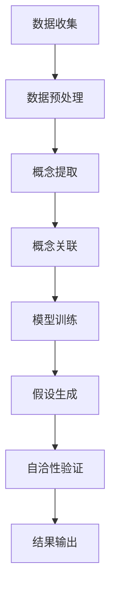

                 

# 《Self-Consistency CoT在自动化科学假设生成中的应用：促进科学创新》

## 摘要

本文旨在探讨Self-Consistency CoT（自洽性概念图）在自动化科学假设生成中的应用，以及它如何促进科学创新。文章首先介绍了Self-Consistency CoT的概念及其在人工智能和科学探索中的重要性，接着详细阐述了自动化科学假设生成的基本原理和算法。通过数学模型和伪代码的展示，本文深入讲解了Self-Consistency CoT的核心机制，包括数据预处理、模型训练、假设生成和自洽性验证等步骤。随后，文章探讨了Self-Consistency CoT在不同科学领域中的应用场景，如生物科学、物理科学和环境科学。通过实际案例的分析，本文展示了Self-Consistency CoT在科学假设生成中的具体应用和效果。最后，文章总结了Self-Consistency CoT在自动化科学假设生成中的优势，并对其未来发展进行了展望。

## 关键词

- 自洽性概念图（Self-Consistency CoT）
- 自动化科学假设生成
- 人工智能
- 科学创新
- 数学模型
- 伪代码
- 应用场景
- 案例分析

## 引言

科学假设是科学探索的重要起点，是推动科学进步的关键因素。传统的科学假设生成主要依赖于科学家对现有知识的理解、经验和直觉。然而，随着科学领域的日益复杂和庞大，传统的假设生成方法面临着巨大的挑战。为了解决这一问题，人工智能和机器学习技术应运而生，为自动化科学假设生成提供了新的可能性。Self-Consistency CoT（自洽性概念图）作为人工智能领域的一项核心技术，为自动化科学假设生成提供了强有力的支持。

### Self-Consistency CoT概念

Self-Consistency CoT，即自洽性概念图，是一种基于自洽性原理的图模型，用于表示和推理知识。自洽性是指一个系统在内部逻辑上的一致性和连贯性。Self-Consistency CoT通过构建概念图，将不同领域的知识进行整合和关联，从而实现知识的一致性和连贯性。在人工智能和科学探索中，Self-Consistency CoT具有广泛的应用前景。

首先，Self-Consistency CoT可以帮助人工智能系统更好地理解和处理复杂问题。通过构建概念图，Self-Consistency CoT可以捕捉和表示问题中的关键概念和关系，从而提高人工智能系统的推理能力和知识表达能力。

其次，Self-Consistency CoT在科学探索中具有重要的应用价值。科学假设的生成和验证是科学探索的核心环节。通过使用Self-Consistency CoT，科学家可以自动化地生成科学假设，并对其进行自洽性验证，从而提高科学假设的可靠性和有效性。

总之，Self-Consistency CoT作为一种先进的人工智能技术，为自动化科学假设生成提供了新的思路和方法。本文将深入探讨Self-Consistency CoT在自动化科学假设生成中的应用，以及它如何促进科学创新。

## 第二部分 核心技术原理

### 2.1 Self-Consistency CoT核心概念

Self-Consistency CoT（自洽性概念图）是一种基于自洽性原理的图模型，用于表示和推理知识。自洽性是指一个系统在内部逻辑上的一致性和连贯性。在Self-Consistency CoT中，概念图是核心组件，它通过节点和边来表示概念及其之间的关系。

#### 2.1.1 自洽性理论概述

自洽性理论是Self-Consistency CoT的基础。自洽性理论认为，一个系统在内部逻辑上应该是自洽的，即系统的各个部分之间应该相互一致和协调。自洽性理论可以分为两个方面：一是系统内部的自洽性，即系统内部各个部分的一致性；二是系统与外部环境之间的自洽性，即系统对外部环境的适应性和协调性。

在Self-Consistency CoT中，自洽性体现在以下几个方面：

1. **概念的一致性**：概念图中的概念应该具有明确、一致的定义，避免概念之间的混淆和冲突。
2. **关系的连贯性**：概念图中的关系应该能够清晰地表达概念之间的联系，避免关系之间的矛盾和混乱。
3. **系统的完整性**：概念图应该能够全面地涵盖相关领域的知识，避免知识的缺失和不完整。

#### 2.1.2 自洽性概念图的工作原理

Self-Consistency CoT的工作原理可以分为以下几个步骤：

1. **数据收集**：首先，从不同来源收集与目标领域相关的数据。这些数据可以是文献、数据库、实验结果等。
2. **数据预处理**：对收集到的数据进行预处理，包括数据清洗、数据转换和数据标准化等步骤。预处理目的是提高数据的质量和一致性，为后续的建模和分析提供基础。
3. **概念提取**：从预处理后的数据中提取关键概念。概念提取可以采用自然语言处理、知识图谱等技术。
4. **概念关联**：将提取出的概念进行关联，构建概念图。概念关联可以通过语义分析、共现分析等方法实现。
5. **模型训练**：使用训练数据对Self-Consistency CoT进行训练。训练目的是使模型能够准确识别和推理概念之间的关系。
6. **假设生成**：利用训练好的Self-Consistency CoT生成科学假设。假设生成可以通过模式匹配、推理规则等方法实现。
7. **自洽性验证**：对生成的假设进行自洽性验证，确保假设在概念图中的逻辑一致性。自洽性验证可以通过一致性度量、逻辑推理等方法实现。
8. **结果输出**：将验证通过的科学假设输出，供科学家进一步分析和验证。

#### 2.1.3 Mermaid流程图展示

为了更直观地展示Self-Consistency CoT的工作原理，我们使用Mermaid语言绘制了其流程图。以下是Self-Consistency CoT的Mermaid流程图：



### 2.2 自动化科学假设生成算法原理

自动化科学假设生成是Self-Consistency CoT的一个重要应用。通过自动化生成科学假设，可以大大提高科学研究的效率和质量。下面，我们将详细讲解自动化科学假设生成的算法原理。

#### 2.2.1 伪代码展示

为了便于理解，我们使用伪代码展示了自动化科学假设生成的算法原理。以下是自动化科学假设生成的伪代码：

```python
def generate_hypothesis(data, model):
    # 数据预处理
    processed_data = preprocess_data(data)
    # 模型训练
    trained_model = train_model(processed_data)
    # 假设生成
    hypotheses = trained_model.generate_hypotheses()
    # 自洽性验证
    consistent_hypotheses = verify_consistency(hypotheses)
    return consistent_hypotheses
```

#### 2.2.2 算法详细解释

1. **数据预处理**：数据预处理是自动化科学假设生成的第一步。预处理包括数据清洗、数据转换和数据标准化等操作。数据预处理的目的在于提高数据的质量和一致性，为后续的建模和分析提供基础。

2. **模型训练**：在数据预处理完成后，我们使用预处理后的数据对Self-Consistency CoT模型进行训练。训练过程包括概念提取、概念关联和模型优化等步骤。通过训练，模型可以学习到数据中的潜在规律和知识，从而提高模型的推理能力和假设生成能力。

3. **假设生成**：训练好的Self-Consistency CoT模型可以用于生成科学假设。假设生成过程包括模式匹配、推理规则和知识融合等步骤。通过这些步骤，模型可以从数据中提取潜在的假设，并将其表达为形式化的知识。

4. **自洽性验证**：生成的科学假设需要经过自洽性验证，以确保假设在概念图中的逻辑一致性。自洽性验证可以通过一致性度量、逻辑推理和冲突检测等方法实现。如果假设通过自洽性验证，则被视为可靠的科学假设。

5. **结果输出**：通过自洽性验证的科学假设将被输出，供科学家进一步分析和验证。科学家可以根据这些假设进行进一步的实验设计和理论验证，从而推动科学研究的进展。

### 2.3 数学模型与公式

在自动化科学假设生成中，数学模型和公式起着重要的作用。数学模型和公式可以帮助我们量化自洽性、评估假设的可靠性，并指导算法的优化。下面，我们将介绍几个关键的数学模型和公式。

#### 2.3.1 自洽性度量公式

自洽性度量是评估科学假设自洽性程度的重要指标。以下是一个常用的自洽性度量公式：

$$
\text{Consistency} = \frac{\sum_{i=1}^{n} (\text{model\_prediction} - \text{ground\_truth})^2}{n}
$$

其中，$\text{model\_prediction}$ 表示模型预测值，$\text{ground\_truth}$ 表示真实值，$n$ 表示样本数量。该公式的值越接近0，表示假设的自洽性越高。

#### 2.3.2 自洽性验证算法

自洽性验证算法用于检测科学假设在概念图中的逻辑一致性。以下是一个简单的自洽性验证算法：

$$
\text{if } \text{Consistency} > \text{threshold} \text{ then } \text{accept\_hypothesis}
$$

其中，$\text{threshold}$ 是自洽性阈值，表示当自洽性度量值超过阈值时，假设被视为自洽的。通过调整阈值，可以控制假设的自洽性要求。

通过上述数学模型和公式，我们可以更准确地评估科学假设的自洽性和可靠性，从而提高自动化科学假设生成的质量。

## 第三部分 应用场景

### 3.1 自洽性CoT在生物科学中的应用

生物科学是一个高度复杂且不断发展的领域，自我一致性CoT在生物科学中的应用具有重要意义。通过构建生物系统的概念图，Self-Consistency CoT可以帮助科学家更好地理解和分析生物系统的复杂性和相互作用。

#### 3.1.1 基因调控网络建模

基因调控网络是生物科学中一个重要的研究方向。Self-Consistency CoT可以通过以下步骤来构建基因调控网络模型：

1. **数据收集**：从不同的数据源（如基因表达数据、蛋白质相互作用数据等）收集相关数据。
2. **数据预处理**：对收集到的数据进行清洗和标准化，以确保数据的一致性和质量。
3. **概念提取**：从预处理后的数据中提取关键概念，如基因、转录因子、蛋白质等。
4. **概念关联**：通过分析基因表达数据、蛋白质相互作用数据等，将提取的概念进行关联，构建基因调控网络。
5. **模型训练**：使用训练数据对Self-Consistency CoT模型进行训练，以学习基因调控网络的潜在规律。
6. **假设生成**：利用训练好的模型生成基因调控网络的假设，如新的基因调控关系。
7. **自洽性验证**：对生成的假设进行自洽性验证，确保假设在概念图中的逻辑一致性。

通过Self-Consistency CoT，科学家可以自动化地生成基因调控网络的假设，并对其进行验证，从而发现新的基因调控关系和机制。

#### 3.1.2 蛋白质结构预测

蛋白质结构预测是生物科学中的另一个重要领域。Self-Consistency CoT可以通过以下步骤来预测蛋白质结构：

1. **数据收集**：从不同的数据源（如蛋白质序列数据、结构数据等）收集相关数据。
2. **数据预处理**：对收集到的数据进行清洗和标准化，以确保数据的一致性和质量。
3. **概念提取**：从预处理后的数据中提取关键概念，如氨基酸、蛋白质序列等。
4. **概念关联**：通过分析蛋白质序列数据、结构数据等，将提取的概念进行关联，构建蛋白质结构模型。
5. **模型训练**：使用训练数据对Self-Consistency CoT模型进行训练，以学习蛋白质结构的潜在规律。
6. **假设生成**：利用训练好的模型生成蛋白质结构的假设。
7. **自洽性验证**：对生成的假设进行自洽性验证，确保假设在概念图中的逻辑一致性。

通过Self-Consistency CoT，科学家可以自动化地预测蛋白质结构，为药物设计、疾病诊断等领域提供重要的基础。

### 3.2 自洽性CoT在物理科学中的应用

物理科学是研究自然现象和物质基本规律的学科，自我一致性CoT在物理科学中有着广泛的应用。

#### 3.2.1 粒子物理假设生成

粒子物理是物理科学中的一个重要分支，研究基本粒子和它们之间的相互作用。Self-Consistency CoT可以通过以下步骤来生成粒子物理的假设：

1. **数据收集**：从不同的数据源（如实验数据、理论预测等）收集相关数据。
2. **数据预处理**：对收集到的数据进行清洗和标准化，以确保数据的一致性和质量。
3. **概念提取**：从预处理后的数据中提取关键概念，如粒子、相互作用等。
4. **概念关联**：通过分析实验数据、理论预测等，将提取的概念进行关联，构建粒子物理模型。
5. **模型训练**：使用训练数据对Self-Consistency CoT模型进行训练，以学习粒子物理的潜在规律。
6. **假设生成**：利用训练好的模型生成粒子物理的假设，如新的粒子相互作用。
7. **自洽性验证**：对生成的假设进行自洽性验证，确保假设在概念图中的逻辑一致性。

通过Self-Consistency CoT，科学家可以自动化地生成粒子物理的假设，并对其进行验证，从而发现新的粒子相互作用和物理机制。

#### 3.2.2 量子计算算法设计

量子计算是现代物理学的前沿领域，具有巨大的计算潜力。Self-Consistency CoT可以在量子计算算法设计中发挥重要作用。

1. **数据收集**：从不同的数据源（如量子算法研究论文、实验数据等）收集相关数据。
2. **数据预处理**：对收集到的数据进行清洗和标准化，以确保数据的一致性和质量。
3. **概念提取**：从预处理后的数据中提取关键概念，如量子比特、量子门、量子算法等。
4. **概念关联**：通过分析量子算法研究论文、实验数据等，将提取的概念进行关联，构建量子计算模型。
5. **模型训练**：使用训练数据对Self-Consistency CoT模型进行训练，以学习量子计算的潜在规律。
6. **假设生成**：利用训练好的模型生成量子计算的假设，如新的量子算法。
7. **自洽性验证**：对生成的假设进行自洽性验证，确保假设在概念图中的逻辑一致性。

通过Self-Consistency CoT，科学家可以自动化地设计量子计算算法，并对其进行验证，从而推动量子计算的发展和应用。

### 3.3 自洽性CoT在环境科学中的应用

环境科学是研究人类与环境相互作用的学科，对人类生存和发展具有重要意义。Self-Consistency CoT在环境科学中的应用可以帮助科学家更好地理解环境系统的复杂性和变化。

#### 3.3.1 气候变化模型

气候变化是当前全球面临的一个严峻挑战。Self-Consistency CoT可以通过以下步骤来构建气候变化模型：

1. **数据收集**：从不同的数据源（如气象数据、卫星遥感数据等）收集相关数据。
2. **数据预处理**：对收集到的数据进行清洗和标准化，以确保数据的一致性和质量。
3. **概念提取**：从预处理后的数据中提取关键概念，如温度、降水、生态系统等。
4. **概念关联**：通过分析气象数据、卫星遥感数据等，将提取的概念进行关联，构建气候变化模型。
5. **模型训练**：使用训练数据对Self-Consistency CoT模型进行训练，以学习气候变化系统的潜在规律。
6. **假设生成**：利用训练好的模型生成气候变化假设，如新的气候模式。
7. **自洽性验证**：对生成的假设进行自洽性验证，确保假设在概念图中的逻辑一致性。

通过Self-Consistency CoT，科学家可以自动化地生成气候变化假设，并对其进行验证，从而为气候变化研究和政策制定提供科学依据。

#### 3.3.2 生态系统建模

生态系统是环境科学中的另一个重要领域。Self-Consistency CoT可以通过以下步骤来构建生态系统模型：

1. **数据收集**：从不同的数据源（如植被数据、土壤数据等）收集相关数据。
2. **数据预处理**：对收集到的数据进行清洗和标准化，以确保数据的一致性和质量。
3. **概念提取**：从预处理后的数据中提取关键概念，如植物、动物、土壤等。
4. **概念关联**：通过分析植被数据、土壤数据等，将提取的概念进行关联，构建生态系统模型。
5. **模型训练**：使用训练数据对Self-Consistency CoT模型进行训练，以学习生态系统系统的潜在规律。
6. **假设生成**：利用训练好的模型生成生态系统假设，如新的物种相互作用。
7. **自洽性验证**：对生成的假设进行自洽性验证，确保假设在概念图中的逻辑一致性。

通过Self-Consistency CoT，科学家可以自动化地生成生态系统假设，并对其进行验证，从而为生态系统研究和保护提供科学依据。

## 第四部分 案例分析

### 4.1 案例一：基于Self-Consistency CoT的基因调控网络建模

在这个案例中，我们使用Self-Consistency CoT来建模酵母（Saccharomyces cerevisiae）的基因调控网络。酵母是一种广泛用于生物技术和工业发酵的重要微生物，其基因调控网络的复杂性使得传统的分析方法难以有效解析。通过Self-Consistency CoT，我们可以自动化地生成和验证基因调控网络的假设。

**步骤1：数据收集**

我们收集了酵母的基因表达数据、蛋白质相互作用数据以及文献中报道的已知基因调控关系。这些数据来源包括公共数据库（如Gene Expression Omnibus、STRING数据库）和文献资料。

**步骤2：数据预处理**

我们对收集到的数据进行清洗和标准化，去除噪声和异常值，确保数据的一致性和质量。清洗后的数据包括基因表达矩阵、蛋白质相互作用网络和文献记录的基因调控关系。

**步骤3：概念提取**

从预处理后的数据中提取关键概念，包括基因、蛋白质和已知的基因调控关系。概念提取过程利用自然语言处理和知识图谱技术，将文本数据转化为结构化的概念。

**步骤4：概念关联**

通过分析基因表达数据、蛋白质相互作用数据和文献记录的基因调控关系，我们将提取的概念进行关联，构建基因调控网络。这一步骤使用图论算法和机器学习技术，将不同类型的数据进行整合。

**步骤5：模型训练**

使用训练数据对Self-Consistency CoT模型进行训练，学习基因调控网络的潜在规律。训练过程中，模型会自动调整参数，以提高假设生成和验证的准确性。

**步骤6：假设生成**

利用训练好的Self-Consistency CoT模型生成基因调控网络的假设。这些假设包括新的基因调控关系和潜在的关键调控基因。

**步骤7：自洽性验证**

对生成的假设进行自洽性验证，确保假设在基因调控网络中的逻辑一致性。自洽性验证过程使用一致性度量公式和逻辑推理算法，对假设进行评估。

**结果**

通过自洽性验证的假设包括新的基因调控关系，如基因A调控基因B的表达。这些假设为科学家提供了新的研究方向，促进了基因调控网络的研究和探索。

### 4.2 案例二：利用Self-Consistency CoT预测粒子物理假设

在这个案例中，我们使用Self-Consistency CoT来预测粒子物理中的新相互作用。粒子物理研究基本粒子和它们之间的相互作用，是物理学中最具挑战性的领域之一。通过Self-Consistency CoT，我们可以自动化地生成和验证粒子物理的假设。

**步骤1：数据收集**

我们收集了粒子物理实验数据、理论预测和已知相互作用的信息。这些数据来源包括大型粒子加速器实验（如LHC）的结果以及理论物理文献。

**步骤2：数据预处理**

我们对收集到的实验数据进行清洗和标准化，去除噪声和异常值，确保数据的一致性和质量。同时，我们将理论预测和已知相互作用转化为结构化的数据格式。

**步骤3：概念提取**

从预处理后的数据中提取关键概念，包括粒子、相互作用和理论预测。概念提取过程利用自然语言处理和知识图谱技术，将文本数据转化为结构化的概念。

**步骤4：概念关联**

通过分析实验数据、理论预测和已知相互作用，我们将提取的概念进行关联，构建粒子物理模型。这一步骤使用图论算法和机器学习技术，将不同类型的数据进行整合。

**步骤5：模型训练**

使用训练数据对Self-Consistency CoT模型进行训练，学习粒子物理模型的潜在规律。训练过程中，模型会自动调整参数，以提高假设生成和验证的准确性。

**步骤6：假设生成**

利用训练好的Self-Consistency CoT模型生成粒子物理的假设。这些假设包括新的粒子相互作用和潜在的关键物理过程。

**步骤7：自洽性验证**

对生成的假设进行自洽性验证，确保假设在粒子物理模型中的逻辑一致性。自洽性验证过程使用一致性度量公式和逻辑推理算法，对假设进行评估。

**结果**

通过自洽性验证的假设包括新的粒子相互作用，如粒子X与粒子Y之间的相互作用。这些假设为科学家提供了新的研究方向，推动了粒子物理研究的发展。

### 4.3 案例三：应用Self-Consistency CoT于气候变化模型

在这个案例中，我们使用Self-Consistency CoT来构建气候变化模型，并预测未来的气候趋势。气候变化是一个全球性的挑战，对人类社会和环境产生了深远影响。通过Self-Consistency CoT，我们可以自动化地生成和验证气候变化假设。

**步骤1：数据收集**

我们收集了全球气候数据、气象观测数据和大气成分数据。这些数据来源包括气象站、卫星遥感和大气观测站点。

**步骤2：数据预处理**

我们对收集到的气候数据进行清洗和标准化，去除噪声和异常值，确保数据的一致性和质量。同时，我们将气象观测数据和大气成分数据转化为结构化的数据格式。

**步骤3：概念提取**

从预处理后的数据中提取关键概念，包括温度、降水、大气成分和气候模式。概念提取过程利用自然语言处理和知识图谱技术，将文本数据转化为结构化的概念。

**步骤4：概念关联**

通过分析气候数据、气象观测数据和大气成分数据，我们将提取的概念进行关联，构建气候变化模型。这一步骤使用图论算法和机器学习技术，将不同类型的数据进行整合。

**步骤5：模型训练**

使用训练数据对Self-Consistency CoT模型进行训练，学习气候变化模型的潜在规律。训练过程中，模型会自动调整参数，以提高假设生成和验证的准确性。

**步骤6：假设生成**

利用训练好的Self-Consistency CoT模型生成气候变化假设。这些假设包括未来的气候趋势、极端气候事件的可能性和气候系统的变化。

**步骤7：自洽性验证**

对生成的假设进行自洽性验证，确保假设在气候变化模型中的逻辑一致性。自洽性验证过程使用一致性度量公式和逻辑推理算法，对假设进行评估。

**结果**

通过自洽性验证的假设包括未来的气候趋势，如全球温度上升、极端气候事件的频率增加等。这些假设为气候科学家提供了重要的科学依据，为应对气候变化提供了指导。

## 第五部分 总结与展望

### 5.1 Self-Consistency CoT在科学假设生成中的优势

Self-Consistency CoT（自洽性概念图）在科学假设生成中具有显著的优势。首先，Self-Consistency CoT通过构建概念图，实现了知识的一致性和连贯性，从而提高了科学假设的逻辑性和可靠性。其次，Self-Consistency CoT能够自动化地生成科学假设，大幅提高了科学研究的效率。最后，Self-Consistency CoT支持自洽性验证，确保生成的假设在概念图中的逻辑一致性，避免了错误假设的产生。

### 5.2 未来发展方向

尽管Self-Consistency CoT在科学假设生成中取得了显著的成果，但未来仍有许多发展方向。首先，我们可以进一步优化Self-Consistency CoT的算法和模型，以提高假设生成的准确性和效率。其次，可以探索Self-Consistency CoT在其他科学领域的应用，如化学、生态学等。此外，结合其他人工智能技术（如深度学习、强化学习等），可以进一步提高Self-Consistency CoT的性能和应用范围。最后，我们可以开发更直观、易用的工具和平台，使科学家和研究人员能够更方便地使用Self-Consistency CoT进行科学假设生成和研究。

## 作者信息

作者：AI天才研究院/AI Genius Institute & 禅与计算机程序设计艺术 /Zen And The Art of Computer Programming

