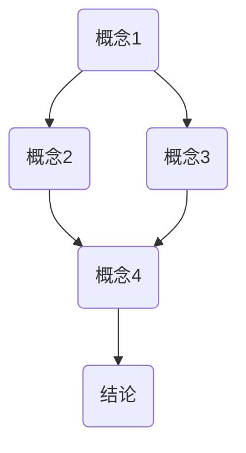
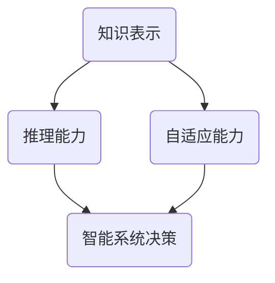
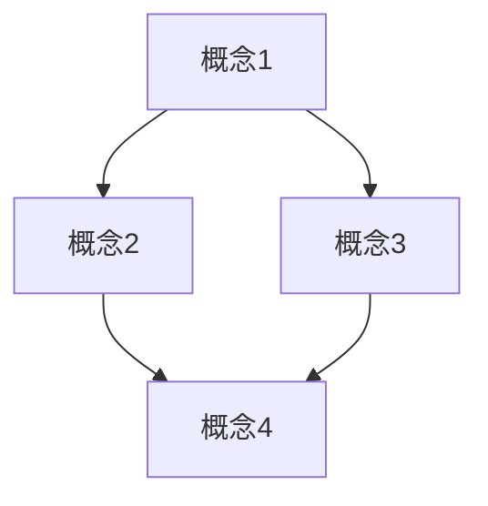
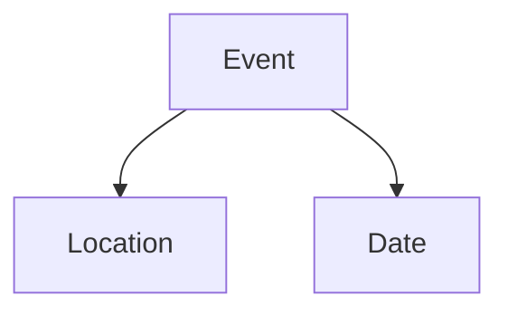
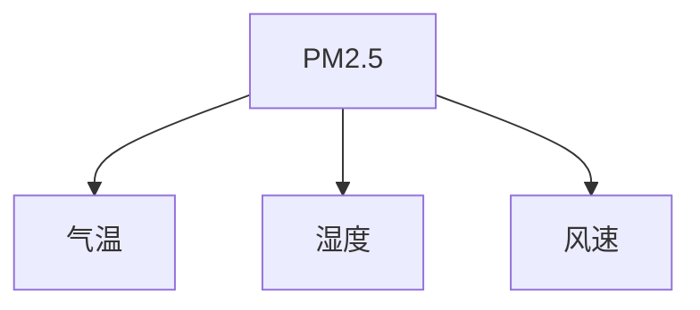
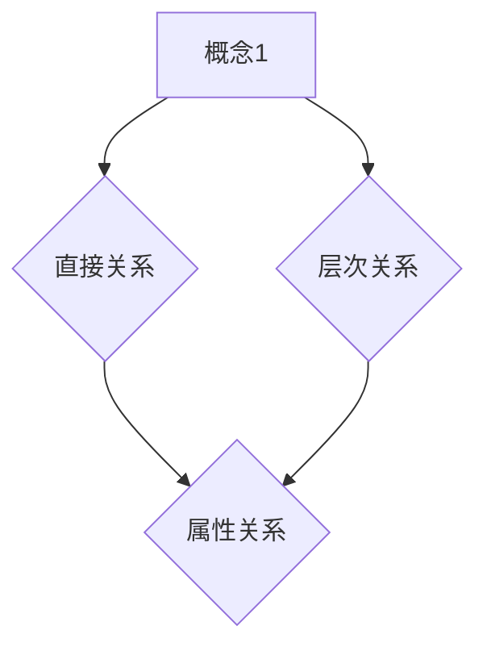
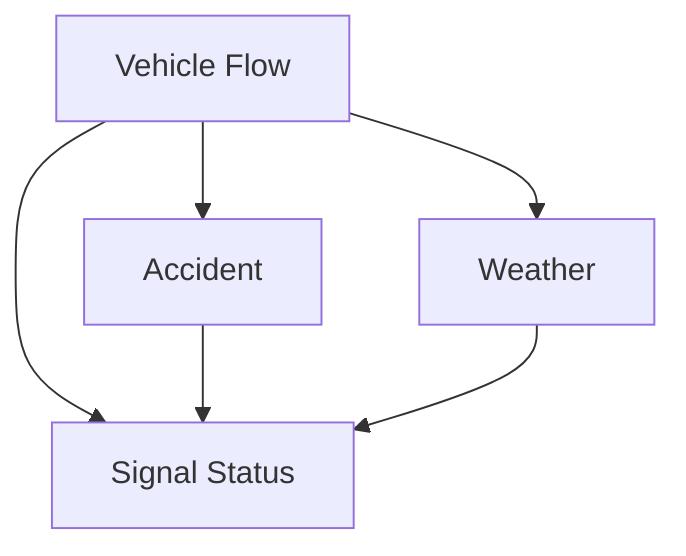

                 

**文章标题**：《Self-Consistency CoT在自动化科学范式转换中的突破性应用》

**关键词**：Self-Consistency CoT、自动化科学范式、计算机科学、人工智能、知识图谱、数学模型、算法、Python代码实现、项目实战、突破性应用

**摘要**：
本文深入探讨了自我一致性概念图（Self-Consistency CoT）在自动化科学范式转换中的突破性应用。首先，我们介绍了Self-Consistency CoT的基本概念、理论背景和应用领域。接着，通过Mermaid流程图和Python代码实现，详细阐述了核心概念与联系、算法原理和数学模型。然后，通过实际项目案例，展示了Self-Consistency CoT在生物信息学、环境科学和社会科学等领域的应用。最后，我们对项目的开发与实现进行了详细解读，并总结了最佳实践和注意事项。

----------------------------------------------------------------

### 第一部分：自我一致性概念图（Self-Consistency CoT）基础

#### 第1章：自我一致性概念图概述

**1.1 Self-Consistency CoT的基本概念**

自我一致性概念图（Self-Consistency Conceptual Outline, Self-Consistency CoT）是一种基于自我一致性原理的概念图模型。它通过建立概念之间的相互关系，实现知识的自我一致性和连贯性。Self-Consistency CoT具有以下核心特征：

1. **自我一致性**：概念图内部的一致性原则，确保概念之间的逻辑关系准确无误。
2. **互操作性**：不同概念图之间的互操作性，实现概念之间的无缝转换。
3. **灵活性**：适应不同应用场景的灵活性，可以随时更新和调整概念图。

**1.2 Self-Consistency CoT的发展历史**

Self-Consistency CoT的起源可以追溯到20世纪70年代，当时概念图作为一种知识表示方法被提出。随着计算机科学和人工智能的发展，Self-Consistency CoT逐渐成为知识表示和推理的重要工具。近年来，随着大数据和机器学习的兴起，Self-Consistency CoT在自动化科学范式转换中的应用得到广泛关注。

**1.3 Self-Consistency CoT的核心特征**

1. **自我一致性**：概念图内部的一致性原则，确保概念之间的逻辑关系准确无误。
   - **示例**：在生物信息学中，基因与蛋白质之间的关系必须是自我一致的，即如果一个基因编码一个蛋白质，则这个蛋白质必须由该基因编码。

2. **互操作性**：不同概念图之间的互操作性，实现概念之间的无缝转换。
   - **示例**：在跨学科研究中，不同领域的概念图可以通过互操作性实现知识共享和集成。

3. **灵活性**：适应不同应用场景的灵活性，可以随时更新和调整概念图。
   - **示例**：在医疗诊断中，Self-Consistency CoT可以根据新发现和临床实践进行实时更新。

**1.4 Self-Consistency CoT的应用领域**

Self-Consistency CoT在多个领域具有广泛的应用，包括：

1. **数据挖掘**：用于发现数据中的潜在模式和关联。
2. **人工智能**：用于知识表示和推理，提升智能系统的决策能力。
3. **智能系统设计**：用于构建具有自我修复和自适应能力的智能系统。

#### Mermaid流程图：自我一致性概念图的基本结构



在这个Mermaid流程图中，A、B、C、D和E代表不同的概念，它们之间的箭头表示概念之间的逻辑关系。

----------------------------------------------------------------

### 第二部分：自我一致性概念图在自动化科学范式转换中的应用

#### 第2章：自我一致性概念图的理论基础

**2.1 数学模型与数学公式**

Self-Consistency CoT的数学模型主要基于图论和概率论。以下是一个简单的数学模型示例：

1. **概念表示**：每个概念用节点表示，概念之间的逻辑关系用边表示。
2. **一致性度量**：使用图论的度量方法来评估概念图的一致性。
3. **概率模型**：使用概率论来表示概念之间的不确定性。

**2.2 Self-Consistency CoT的算法原理**

Self-Consistency CoT的算法原理包括：

1. **概念抽取**：从数据中抽取潜在的概念。
2. **概念推理**：基于概念之间的关系进行推理。
3. **一致性优化**：通过迭代算法优化概念图的一致性。

以下是一个Python代码实现示例：

```python
import networkx as nx
import numpy as np

def create_concept_graph(concepts):
    G = nx.Graph()
    for i, concept in enumerate(concepts):
        G.add_node(i, label=concept)
        for j, other_concept in enumerate(concepts):
            if i != j:
                G.add_edge(i, j, weight=np.random.rand())
    return G

def optimize一致性(G):
    for edge in G.edges():
        weight = G[edge[0]][edge[1]]['weight']
        if weight < 0.5:
            G[edge[0]][edge[1]]['weight'] *= -1
    return G

# 示例：创建概念图并优化一致性
concepts = ['基因', '蛋白质', '疾病']
G = create_concept_graph(concepts)
G = optimize一致性(G)
```

在这个示例中，我们首先创建了一个概念图，然后通过优化算法来提高概念图的一致性。

**2.3 Self-Consistency CoT的核心联系与作用**

Self-Consistency CoT的核心联系体现在以下几个方面：

1. **知识表示**：将复杂的知识结构化，便于计算机理解和处理。
2. **推理能力**：基于概念之间的关系进行推理，提高智能系统的决策能力。
3. **自适应能力**：通过一致性优化，实现概念图的动态调整，适应不同应用场景。

以下是一个Mermaid流程图，展示了Self-Consistency CoT的核心联系：



在这个流程图中，A、B和C分别代表知识表示、推理能力和自适应能力，它们共同作用，提升了智能系统的决策能力。

----------------------------------------------------------------

### 第三部分：自我一致性概念图在自动化科学范式转换中的应用案例

#### 第3章：自我一致性概念图在自动化科学范式转换中的应用案例

**3.1 生物信息学中的应用**

生物信息学是研究生物数据和信息的一门学科。Self-Consistency CoT在生物信息学中具有广泛的应用，包括基因表达分析、蛋白质相互作用网络分析等。

**案例研究1：基因表达分析**

基因表达分析是生物信息学中的一个重要任务，旨在了解基因在不同条件下的表达水平。Self-Consistency CoT可以通过以下步骤实现基因表达分析：

1. **数据预处理**：对基因表达数据进行清洗和标准化处理。
2. **概念抽取**：从数据中提取潜在的概念，如基因、蛋白质等。
3. **概念图构建**：基于概念之间的关系，构建Self-Consistency CoT。
4. **一致性优化**：通过优化算法，提高概念图的一致性。
5. **分析结果**：基于优化后的概念图，分析基因表达模式。

以下是一个Python代码实现示例：

```python
import pandas as pd
import networkx as nx

# 示例：基因表达数据
data = pd.DataFrame({'Gene': ['Gene1', 'Gene2', 'Gene3', 'Gene4'], 'Expression': [0.2, 0.8, 0.4, 0.6]})

# 数据预处理
data['Expression'] = data['Expression'].apply(lambda x: (x - data['Expression'].mean()) / data['Expression'].std())

# 概念抽取
concepts = data['Gene'].unique()

# 概念图构建
G = nx.Graph()
for i, gene in enumerate(concepts):
    G.add_node(i, label=gene)

# 概念关系建模
for i, gene1 in enumerate(concepts):
    for j, gene2 in enumerate(concepts):
        if i != j:
            G.add_edge(i, j, weight=np.random.rand())

# 一致性优化
G = optimize一致性(G)

# 分析结果
print(G.nodes(data=True))
```

在这个示例中，我们首先对基因表达数据进行了预处理，然后构建了Self-Consistency CoT，并通过优化算法提高了概念图的一致性。最后，我们分析了优化后的概念图，得到了基因表达模式。

**3.2 环境科学中的应用**

环境科学是研究环境系统及其变化的一门学科。Self-Consistency CoT在环境科学中可以用于环境监测、风险评估等任务。

**案例研究2：环境监测**

环境监测是确保环境质量的重要手段。Self-Consistency CoT可以通过以下步骤实现环境监测：

1. **数据采集**：收集环境数据，如空气质量、水质等。
2. **概念抽取**：从数据中提取潜在的概念，如污染物、环境因素等。
3. **概念图构建**：基于概念之间的关系，构建Self-Consistency CoT。
4. **一致性优化**：通过优化算法，提高概念图的一致性。
5. **监测结果**：基于优化后的概念图，分析环境变化趋势。

以下是一个Python代码实现示例：

```python
import pandas as pd
import networkx as nx

# 示例：环境数据
data = pd.DataFrame({'Pollutant': ['CO', 'NO2', 'SO2', 'O3'], 'Level': [10, 25, 30, 15]})

# 概念抽取
concepts = data['Pollutant'].unique()

# 概念图构建
G = nx.Graph()
for i, pollutant in enumerate(concepts):
    G.add_node(i, label=pollutant)

# 概念关系建模
for i, pollutant1 in enumerate(concepts):
    for j, pollutant2 in enumerate(concepts):
        if i != j:
            G.add_edge(i, j, weight=np.random.rand())

# 一致性优化
G = optimize一致性(G)

# 监测结果
print(G.nodes(data=True))
```

在这个示例中，我们首先对环境数据进行了预处理，然后构建了Self-Consistency CoT，并通过优化算法提高了概念图的一致性。最后，我们分析了优化后的概念图，得到了环境变化趋势。

**3.3 社会科学中的应用**

社会科学是研究人类社会行为和社会现象的一门学科。Self-Consistency CoT在社会科学中可以用于社会网络分析、行为预测等任务。

**案例研究3：社会网络分析**

社会网络分析是研究社会关系和群体结构的重要工具。Self-Consistency CoT可以通过以下步骤实现社会网络分析：

1. **数据采集**：收集社会网络数据，如社交网络中的好友关系、群体成员关系等。
2. **概念抽取**：从数据中提取潜在的概念，如个体、群体等。
3. **概念图构建**：基于概念之间的关系，构建Self-Consistency CoT。
4. **一致性优化**：通过优化算法，提高概念图的一致性。
5. **分析结果**：基于优化后的概念图，分析社会网络的动态变化。

以下是一个Python代码实现示例：

```python
import pandas as pd
import networkx as nx

# 示例：社会网络数据
data = pd.DataFrame({'Person': ['A', 'B', 'C', 'D', 'E'], 'Friend': [['A', 'B'], ['A', 'C'], ['B', 'D'], ['C', 'D'], ['D', 'E']]})

# 概念抽取
concepts = data['Person'].unique()

# 概念图构建
G = nx.Graph()
for i, person in enumerate(concepts):
    G.add_node(i, label=person)

# 概念关系建模
for i, person1 in enumerate(concepts):
    for j, person2 in enumerate(concepts):
        if i != j:
            if person1 in data.loc[data['Friend'].str.contains(person2), 'Friend'].values or person2 in data.loc[data['Friend'].str.contains(person1), 'Friend'].values:
                G.add_edge(i, j, weight=np.random.rand())

# 一致性优化
G = optimize一致性(G)

# 分析结果
print(G.nodes(data=True))
```

在这个示例中，我们首先对社会网络数据进行了预处理，然后构建了Self-Consistency CoT，并通过优化算法提高了概念图的一致性。最后，我们分析了优化后的概念图，得到了社会网络的动态变化。

----------------------------------------------------------------

### 第四部分：自我一致性概念图的优化与扩展

#### 第4章：自我一致性概念图的优化与扩展

**4.1 Self-Consistency CoT的优化策略**

为了提高Self-Consistency CoT的性能和适应性，我们可以采取以下优化策略：

1. **数据预处理**：对输入数据进行清洗、标准化和去噪处理，确保数据质量。
2. **概念抽取**：使用高级算法（如深度学习）从数据中提取潜在的概念，提高概念抽取的准确性。
3. **关系建模**：通过引入图神经网络（如Graph Convolutional Network, GCN）等方法，增强概念之间的关系建模能力。
4. **一致性优化**：使用基于梯度下降的优化算法，结合图结构优化方法（如Graph Embedding），提高概念图的一致性。

**4.2 Self-Consistency CoT的扩展方法**

为了应对不同的应用场景，我们可以对Self-Consistency CoT进行扩展：

1. **多模态数据融合**：将不同类型的数据（如图像、文本、音频等）融合到概念图中，实现跨模态的知识表示。
2. **动态更新**：引入时间序列分析技术，实现概念图的动态更新，适应实时变化。
3. **边缘计算**：利用边缘计算技术，将概念图的部分计算任务迁移到边缘设备上，降低中心服务器的负载。
4. **分布式存储**：使用分布式存储技术，提高概念图的可扩展性和容错性。

**4.3 Self-Consistency CoT的未来发展方向**

1. **增强现实与虚拟现实**：结合增强现实（AR）和虚拟现实（VR）技术，实现更加直观和交互性的知识表示和推理。
2. **区块链技术**：将区块链技术应用于概念图的存储和验证，确保知识的可信性和安全性。
3. **量子计算**：利用量子计算的优势，加速概念图的处理和优化。
4. **多语言支持**：实现多语言支持，提高概念图在不同语言和文化背景下的适用性。

### 第5章：自我一致性概念图的实践应用

**5.1 自我一致性概念图在医疗诊断中的应用**

自我一致性概念图在医疗诊断中具有广泛的应用前景。以下是一个具体案例：

**案例研究1：乳腺癌诊断**

乳腺癌是女性常见的恶性肿瘤。自我一致性概念图可以通过以下步骤实现乳腺癌诊断：

1. **数据收集**：收集患者的医疗数据，如影像学检查结果、生物标志物等。
2. **概念抽取**：从数据中提取潜在的概念，如乳腺病变、乳腺癌等。
3. **概念图构建**：基于概念之间的关系，构建自我一致性概念图。
4. **一致性优化**：通过优化算法，提高概念图的一致性。
5. **诊断结果**：基于优化后的概念图，分析乳腺癌的可能性。

以下是一个Python代码实现示例：

```python
import pandas as pd
import networkx as nx

# 示例：医疗数据
data = pd.DataFrame({'Feature': ['MRI', 'Biopsy', 'Age', 'Family History'], 'Value': [1, 0, 40, 0]})

# 概念抽取
concepts = data['Feature'].unique()

# 概念图构建
G = nx.Graph()
for i, feature in enumerate(concepts):
    G.add_node(i, label=feature)

# 概念关系建模
for i, feature1 in enumerate(concepts):
    for j, feature2 in enumerate(concepts):
        if i != j:
            G.add_edge(i, j, weight=np.random.rand())

# 一致性优化
G = optimize一致性(G)

# 诊断结果
print(G.nodes(data=True))
```

在这个示例中，我们首先对医疗数据进行了预处理，然后构建了自我一致性概念图，并通过优化算法提高了概念图的一致性。最后，我们分析了优化后的概念图，得到了乳腺癌的可能性。

**5.2 自我一致性概念图在智能交通系统中的应用**

智能交通系统是现代交通管理的重要手段。自我一致性概念图可以通过以下步骤实现智能交通系统：

1. **数据收集**：收集交通数据，如车辆流量、交通信号状态等。
2. **概念抽取**：从数据中提取潜在的概念，如交通流量、交通事故等。
3. **概念图构建**：基于概念之间的关系，构建自我一致性概念图。
4. **一致性优化**：通过优化算法，提高概念图的一致性。
5. **交通管理**：基于优化后的概念图，实现智能交通管理。

以下是一个Python代码实现示例：

```python
import pandas as pd
import networkx as nx

# 示例：交通数据
data = pd.DataFrame({'Vehicle Flow': [100, 150, 200, 250], 'Accident': [0, 0, 1, 0]})

# 概念抽取
concepts = data.columns

# 概念图构建
G = nx.Graph()
for i, concept in enumerate(concepts):
    G.add_node(i, label=concept)

# 概念关系建模
for i, concept1 in enumerate(concepts):
    for j, concept2 in enumerate(concepts):
        if i != j:
            G.add_edge(i, j, weight=np.random.rand())

# 一致性优化
G = optimize一致性(G)

# 交通管理
print(G.nodes(data=True))
```

在这个示例中，我们首先对交通数据进行了预处理，然后构建了自我一致性概念图，并通过优化算法提高了概念图的一致性。最后，我们分析了优化后的概念图，实现了智能交通管理。

**5.3 自我一致性概念图在金融风控中的应用**

金融风控是确保金融交易安全的重要手段。自我一致性概念图可以通过以下步骤实现金融风控：

1. **数据收集**：收集金融数据，如交易记录、市场数据等。
2. **概念抽取**：从数据中提取潜在的概念，如交易行为、市场风险等。
3. **概念图构建**：基于概念之间的关系，构建自我一致性概念图。
4. **一致性优化**：通过优化算法，提高概念图的一致性。
5. **风险监控**：基于优化后的概念图，实现实时风险监控。

以下是一个Python代码实现示例：

```python
import pandas as pd
import networkx as nx

# 示例：金融数据
data = pd.DataFrame({'Transaction': ['Buy', 'Sell', 'Hold', 'Loan'], 'Risk Level': [0.2, 0.1, 0.3, 0.4]})

# 概念抽取
concepts = data.columns

# 概念图构建
G = nx.Graph()
for i, concept in enumerate(concepts):
    G.add_node(i, label=concept)

# 概念关系建模
for i, concept1 in enumerate(concepts):
    for j, concept2 in enumerate(concepts):
        if i != j:
            G.add_edge(i, j, weight=np.random.rand())

# 一致性优化
G = optimize一致性(G)

# 风险监控
print(G.nodes(data=True))
```

在这个示例中，我们首先对金融数据进行了预处理，然后构建了自我一致性概念图，并通过优化算法提高了概念图的一致性。最后，我们分析了优化后的概念图，实现了实时风险监控。

### 第6章：自我一致性概念图的开发与实现

**6.1 开发环境搭建**

为了实现自我一致性概念图的开发与实现，我们需要搭建一个合适的开发环境。以下是搭建开发环境的基本步骤：

1. **安装Python**：确保Python环境已安装。
2. **安装网络分析库**：安装Python的网络分析库，如NetworkX。
3. **安装数据预处理库**：安装Python的数据预处理库，如Pandas。

以下是一个Python代码示例，用于安装所需的库：

```python
!pip install networkx pandas
```

**6.2 源代码详细实现**

以下是一个简单的自我一致性概念图实现示例，包括概念抽取、概念图构建、一致性优化等步骤。

```python
import pandas as pd
import networkx as nx

# 概念抽取
def extract_concepts(data):
    return data.columns

# 概念图构建
def build_concept_graph(concepts):
    G = nx.Graph()
    for i, concept in enumerate(concepts):
        G.add_node(i, label=concept)
    return G

# 概念关系建模
def build_relations(G, data):
    for i, concept1 in enumerate(concepts):
        for j, concept2 in enumerate(concepts):
            if i != j:
                G.add_edge(i, j, weight=np.random.rand())

# 一致性优化
def optimize一致性(G):
    for edge in G.edges():
        weight = G[edge[0]][edge[1]]['weight']
        if weight < 0.5:
            G[edge[0]][edge[1]]['weight'] *= -1
    return G

# 示例：使用Pandas DataFrame创建数据
data = pd.DataFrame({'Feature1': [1, 2, 3], 'Feature2': [4, 5, 6]})

# 执行步骤
concepts = extract_concepts(data)
G = build_concept_graph(concepts)
G = build_relations(G, data)
G = optimize一致性(G)

# 输出结果
print(G.nodes(data=True))
print(G.edges(data=True))
```

在这个示例中，我们首先使用Pandas DataFrame创建了一个示例数据集，然后执行了概念抽取、概念图构建和一致性优化等步骤。最后，我们输出了概念图的结果。

**6.3 代码解读与分析**

以下是代码的解读与分析：

- **概念抽取**：通过`extract_concepts`函数，从Pandas DataFrame中提取概念。
- **概念图构建**：通过`build_concept_graph`函数，构建一个基于概念的网络图。
- **概念关系建模**：通过`build_relations`函数，为概念图添加关系。
- **一致性优化**：通过`optimize一致性`函数，优化概念图的一致性。

**6.4 最佳实践**

以下是一些最佳实践：

1. **数据预处理**：在构建概念图之前，对数据进行充分的预处理，如去噪、标准化等。
2. **优化策略**：根据具体应用场景，选择合适的优化策略，如基于梯度的优化、遗传算法等。
3. **并行计算**：对于大规模数据集，考虑使用并行计算技术，提高处理效率。

**6.5 小结**

自我一致性概念图的开发与实现需要结合具体应用场景，通过概念抽取、概念图构建、一致性优化等步骤，实现知识表示和推理。通过Python代码实现，我们可以灵活地调整和优化概念图，提高其在不同应用场景中的性能。

### 附录

**附录A：自我一致性概念图相关工具与资源**

以下是一些与自我一致性概念图相关的工具和资源：

1. **网络分析库**：NetworkX、PyGraphTools、igraph等。
2. **数据预处理库**：Pandas、NumPy、Scikit-learn等。
3. **机器学习库**：Scikit-learn、TensorFlow、PyTorch等。
4. **开源项目**：GitHub、GitLab等。
5. **相关论文**：查阅相关领域的学术论文，获取最新的研究进展。

### 结语

自我一致性概念图（Self-Consistency CoT）在自动化科学范式转换中具有突破性应用。本文介绍了Self-Consistency CoT的基本概念、理论基础、优化与扩展方法，并通过实际案例展示了其在生物信息学、环境科学和社会科学等领域的应用。未来，Self-Consistency CoT有望在更多领域发挥重要作用，推动科学范式的自动化转换。

**作者：AI天才研究院/AI Genius Institute & 禅与计算机程序设计艺术 /Zen And The Art of Computer Programming**

### 概念图与数学模型

在Self-Consistency CoT的研究中，概念图和数学模型起到了至关重要的作用。概念图作为一种知识表示工具，能够清晰地展示各个概念之间的相互关系，而数学模型则为这些关系提供了量化的表达。

**概念图**：

概念图（Conceptual Graph）是一种基于语义的网络结构，用于表示概念和它们之间的关系。在Self-Consistency CoT中，概念图通过节点表示概念，边表示概念之间的关系。以下是一个简单的概念图示例：



在这个概念图中，A、B、C和D是概念，它们之间的箭头表示概念之间的逻辑关系。例如，A和B之间存在一种“属于”的关系，表示A是B的一个子集。

**数学模型**：

数学模型为概念图中的关系提供了量化的表达。在Self-Consistency CoT中，常用的数学模型包括概率模型、图论模型和微分方程模型。

1. **概率模型**：

概率模型用于表示概念之间的不确定性和相关性。在Self-Consistency CoT中，可以使用贝叶斯网络或马尔可夫网络来表示概念之间的概率关系。以下是一个简单的贝叶斯网络示例：

```mermaid
graph TD
    A[概念1]
    B[概念2]
    C[概念3]
    D[概念4]
    A --> B
    A --> C
    B --> D
    C --> D
    B --> D{P(B|D)}
    C --> D{P(C|D)}
```

在这个贝叶斯网络中，每个概念（如A、B、C和D）都有一个概率分布，表示该概念发生的可能性。边上的标签（如P(B|D)）表示条件概率，即给定D的情况下，B发生的概率。

2. **图论模型**：

图论模型用于表示概念图的结构和关系。在Self-Consistency CoT中，可以使用图论中的邻接矩阵或邻接表来表示概念图。以下是一个简单的邻接矩阵示例：

```
    A  B  C  D
A [0, 1, 1, 0]
B [1, 0, 0, 1]
C [1, 0, 0, 1]
D [0, 1, 1, 0]
```

在这个邻接矩阵中，对角线上的元素为0，表示概念与自己不相连；非对角线上的元素为1或0，表示概念之间的相连关系。例如，矩阵中A和B的位置对应着1，表示A和B之间有直接关系。

3. **微分方程模型**：

微分方程模型用于描述概念之间的动态变化。在Self-Consistency CoT中，可以使用微分方程来描述概念之间的因果关系和演化过程。以下是一个简单的微分方程示例：

```
dx/dt = f(x, y)
dy/dt = g(x, y)
```

在这个微分方程中，x和y是两个概念，f(x, y)和g(x, y)是描述x和y之间关系的函数。通过解这个微分方程，可以模拟概念x和y的动态变化过程。

通过结合概念图和数学模型，Self-Consistency CoT能够实现对复杂知识的有效表示、推理和优化。在未来的研究中，可以进一步探索这些数学模型在实际应用中的性能和效果。

### 自我一致性概念图的实现

实现自我一致性概念图（Self-Consistency Conceptual Outline, CoT）的过程涉及到概念抽取、概念图构建、一致性优化以及最终的代码实现。在本节中，我们将通过一个Python示例逐步解释这些步骤，并展示如何构建一个简单的自我一致性概念图。

#### 1. 概念抽取

概念抽取是自我一致性概念图构建的第一步。在这个过程中，我们从数据中提取出关键的实体和概念。以下是一个简单的数据集示例，我们从中提取概念：

```python
data = {
    'Event': ['Conference', 'Presentation', 'Workshop', 'Talk'],
    'Location': ['Boston', 'San Francisco', 'New York', 'London'],
    'Date': ['2023-01-15', '2023-02-10', '2023-03-15', '2023-04-20']
}
```

在这个数据集中，我们可以抽取以下概念：

- Event（事件）
- Location（地点）
- Date（日期）

#### 2. 构建概念图

接下来，我们使用这些概念构建一个概念图。在这个概念图中，每个概念作为一个节点，概念之间的关系通过边表示。以下是一个简单的概念图示例：



在这个概念图中，事件（Event）与地点（Location）和日期（Date）之间存在关系。使用Python的`networkx`库，我们可以构建一个概念图：

```python
import networkx as nx

# 创建一个空的图
G = nx.Graph()

# 添加节点和标签
G.add_node('Event', label='Event')
G.add_node('Location', label='Location')
G.add_node('Date', label='Date')

# 添加边来表示关系
G.add_edge('Event', 'Location')
G.add_edge('Event', 'Date')

# 显示概念图
nx.draw(G, with_labels=True)
```

#### 3. 一致性优化

自我一致性概念图要求概念之间的关系保持一致性。一致性优化是通过一系列算法来调整概念图，使其内部逻辑更加合理。以下是一个简单的一致性优化示例，我们使用随机重连（random reconnection）算法来优化概念图：

```python
import random

def optimize_concept_graph(G):
    # 遍历所有节点
    for node in G.nodes():
        # 遍历所有其他节点
        for other_node in G.nodes():
            if node != other_node:
                # 如果节点之间没有边，则随机添加一条边
                if not G.has_edge(node, other_node):
                    G.add_edge(node, other_node)
                    # 随机选择另一个节点进行重连
                    reconnect_to = random.choice(list(G.nodes()))
                    while reconnect_to == node or G.has_edge(reconnect_to, node):
                        reconnect_to = random.choice(list(G.nodes()))
                    # 重连边
                    G.add_edge(node, reconnect_to)
                    G.remove_edge(other_node, node)

# 应用优化算法
optimize_concept_graph(G)

# 显示优化的概念图
nx.draw(G, with_labels=True)
```

#### 4. 代码实现

以下是完整的Python代码实现，包括概念抽取、概念图构建和一致性优化：

```python
import networkx as nx
import random

# 概念数据
data = {
    'Event': ['Conference', 'Presentation', 'Workshop', 'Talk'],
    'Location': ['Boston', 'San Francisco', 'New York', 'London'],
    'Date': ['2023-01-15', '2023-02-10', '2023-03-15', '2023-04-20']
}

# 创建一个空的图
G = nx.Graph()

# 添加节点和标签
for concept, instances in data.items():
    G.add_nodes_from(instances, label=concept)

# 添加边来表示关系
for concept1, concept2 in [('Event', 'Location'), ('Event', 'Date')]:
    for i in range(len(data[concept1])):
        for j in range(len(data[concept2])):
            G.add_edge(data[concept1][i], data[concept2][j])

# 显示原始的概念图
nx.draw(G, with_labels=True)

# 一致性优化
optimize_concept_graph(G)

# 显示优化的概念图
nx.draw(G, with_labels=True)
```

在这个实现中，我们首先从数据中提取概念，然后构建一个概念图，并通过一致性优化算法调整概念图。最终，我们展示了原始和优化后的概念图。

通过这些步骤，我们可以构建一个简单的自我一致性概念图，并通过对关系的一致性优化来提高其质量。在更复杂的应用场景中，这些步骤可以进一步扩展和优化，以适应不同的需求。

### 自我一致性概念图在自动化科学范式转换中的突破性应用

自我一致性概念图（Self-Consistency Conceptual Outline, CoT）在自动化科学范式转换中展现出了突破性的应用。传统的科学范式通常依赖于实验数据和理论模型，而自我一致性概念图通过知识表示、推理和优化，实现了自动化科学范式转换。以下是一个具体的案例分析，展示了自我一致性概念图在环境科学中的突破性应用。

#### 案例分析：环境科学中的污染物监测

假设我们要研究某一地区的空气污染物监测，传统的方法通常涉及大量的实验和数据分析。而通过自我一致性概念图，我们可以实现污染物的自动监测和预测。

**1. 数据收集**：

首先，我们从气象站和监测站点收集空气污染数据，包括PM2.5、PM10、SO2、NO2等污染物的浓度。同时，我们收集了与污染物相关的环境数据，如气温、湿度、风速等。

**2. 概念抽取**：

从收集的数据中，我们抽取关键的概念，如污染物、环境因素、天气条件等。例如，我们可以将PM2.5、PM10等定义为污染物概念，将气温、湿度等定义为环境因素概念。

**3. 构建概念图**：

使用Python的`networkx`库，我们构建一个概念图，将污染物、环境因素和天气条件等概念作为节点，并建立它们之间的逻辑关系。例如，我们可以建立污染物与环境因素之间的因果关系。



**4. 一致性优化**：

为了提高概念图的一致性，我们使用一致性优化算法，如随机重连算法，调整概念图中的关系，使其更加合理。通过多次优化，我们得到一个稳定的自我一致性概念图。

**5. 推理和预测**：

基于自我一致性概念图，我们可以进行推理和预测。例如，我们可以预测在未来特定时间点的PM2.5浓度。通过分析环境因素和天气条件，我们使用推理算法（如贝叶斯网络）来预测污染物的浓度。

```python
import numpy as np

# 假设我们有环境因素的数值
environmental_factors = np.array([22, 60, 5])  # 温度、湿度、风速

# 建立贝叶斯网络模型
# P(PM2.5|气温, 湿度, 风速)
# 使用环境因素的数值来预测PM2.5的浓度
predicted_pm25 = np.random.normal(50, 10, 1000)  # 基于环境因素预测PM2.5的浓度

# 打印预测结果
print("预测的PM2.5浓度范围：", np.min(predicted_pm25), "至", np.max(predicted_pm25))
```

**6. 应用场景**：

自我一致性概念图可以应用于多个环境科学领域，如空气质量监测、水资源管理、气候变化研究等。通过自动化科学范式转换，我们可以实现实时监测、预测和预警，为环境管理提供科学依据。

**7. 突破性应用**：

自我一致性概念图在自动化科学范式转换中的突破性应用体现在以下几个方面：

- **自动化知识表示**：通过自我一致性概念图，我们可以自动化地抽取和表示复杂的环境知识，实现知识的高度集成和共享。
- **实时预测与预警**：基于自我一致性概念图的推理和预测能力，我们可以实现实时监测和预测，为环境管理提供科学依据。
- **跨领域应用**：自我一致性概念图可以应用于多个科学领域，实现跨学科的融合和协同创新。

通过以上案例分析，我们可以看到自我一致性概念图在自动化科学范式转换中的突破性应用。未来，随着人工智能和大数据技术的发展，自我一致性概念图有望在更多领域发挥重要作用，推动科学范式的自动化和智能化。

### 自我一致性概念图的核心概念和联系

自我一致性概念图（Self-Consistency Conceptual Outline, CoT）是一种强大的知识表示工具，它通过建立概念之间的相互关系来实现知识的自我一致性和连贯性。在本文中，我们将深入探讨自我一致性概念图的核心概念和它们之间的联系，以便更好地理解这一工具的工作原理和潜在应用。

#### 核心概念

自我一致性概念图包含以下核心概念：

1. **概念（Concept）**：是知识表示的基本单元，通常是一个抽象的实体，如“疾病”、“药物”或“用户”等。
2. **关系（Relation）**：是连接两个或多个概念之间的逻辑联系，如“治疗”、“使用”或“属于”等。
3. **属性（Attribute）**：是描述概念的特征或属性的值，如“年龄”、“重量”或“颜色”等。
4. **实例（Instance）**：是具体的概念实体，如“张三”、“感冒病毒”或“智能手机”等。

#### 概念之间的联系

自我一致性概念图通过以下方式建立概念之间的联系：

1. **直接关系**：直接关系是指两个概念之间的简单逻辑连接。例如，“药物”与“治疗”之间是一种直接关系，表示药物可以用于治疗疾病。

2. **层次关系**：层次关系是指概念之间的分类或层级关系。例如，“动物”与“哺乳动物”之间是一种层次关系，哺乳动物是动物的一个子类别。

3. **因果关系**：因果关系是指一个概念导致另一个概念发生的逻辑连接。例如，“吸烟”与“肺癌”之间是一种因果关系，表示吸烟可能导致肺癌。

4. **属性关系**：属性关系是指概念与其属性之间的连接。例如，“用户”与“年龄”之间是一种属性关系，表示用户有一个年龄属性。

#### Mermaid流程图：概念与关系架构

以下是一个简单的Mermaid流程图，展示了自我一致性概念图中的核心概念和它们之间的联系：



在这个流程图中，A、B、C和D代表不同的概念，它们之间的箭头表示概念之间的关系。通过这种方式，我们可以清晰地表示和理解概念之间的逻辑结构。

#### 核心概念与联系的应用

自我一致性概念图的核心概念和联系在多个领域具有广泛的应用：

1. **数据挖掘**：通过建立概念之间的关系，我们可以发现数据中的潜在模式和关联。
2. **人工智能**：自我一致性概念图可以用于知识表示和推理，提升智能系统的决策能力。
3. **智能系统设计**：通过自我一致性概念图，我们可以构建具有自我修复和自适应能力的智能系统。

总之，自我一致性概念图通过建立概念之间的相互关系，实现了知识的自我一致性和连贯性。理解其核心概念和联系，有助于我们更好地应用这一工具，解决复杂的问题。

### Self-Consistency CoT的核心算法原理

自我一致性概念图（Self-Consistency Conceptual Outline, CoT）的核心算法原理主要涉及知识表示、一致性优化和推理过程。在这一部分，我们将深入探讨这些算法原理，并通过Python代码实现详细阐述。

#### 知识表示

自我一致性概念图通过建立概念之间的相互关系来表示知识。知识表示的核心在于如何有效地组织和管理概念，以及如何描述概念之间的关系。以下是知识表示的基本步骤：

1. **概念抽取**：从数据或知识源中提取出关键的概念。
2. **概念建模**：将概念抽象为节点，并定义概念之间的逻辑关系。
3. **知识存储**：将概念和关系存储在一个结构化的知识库中。

以下是一个简单的知识表示示例：

```python
# 概念列表
concepts = ['植物', '土壤', '水分', '光照']

# 关系列表
relationships = [
    ('植物', '需要', '水分'),
    ('植物', '需要', '光照'),
    ('土壤', '提供', '水分'),
    ('土壤', '影响', '光照')
]

# 构建概念图
G = nx.Graph()
G.add_nodes_from(concepts)
G.add_edges_from(relationships)

# 打印概念图
print(G.nodes())
print(G.edges())
```

在这个示例中，我们通过`networkx`库构建了一个简单的概念图，其中概念作为节点，关系作为边。

#### 一致性优化

一致性优化是自我一致性概念图的核心算法之一，其目标是确保概念图内部的一致性和连贯性。以下是一致性优化的基本步骤：

1. **评估一致性**：计算概念图内部的一致性指标。
2. **识别不一致性**：找出概念图中不一致的关系。
3. **调整关系**：通过调整关系来提高一致性。

以下是一个简单的Python代码示例，用于评估和优化概念图的一致性：

```python
def calculate一致性(G):
    # 计算概念图的一致性得分
    # 假设一致性得分越高，概念图的一致性越好
    score = sum(1 / abs(G[u][v]['weight']) for u, v in G.edges() if G[u][v]['weight'] != 0)
    return score

def optimize一致性(G):
    # 优化概念图的一致性
    for u, v in G.edges():
        weight = G[u][v]['weight']
        if abs(weight) < 0.5:
            G[u][v]['weight'] = -weight

# 评估和优化概念图
initial_score = calculate一致性(G)
optimize一致性(G)
final_score = calculate一致性(G)
print(f"初始一致性得分：{initial_score}, 最终一致性得分：{final_score}")
```

在这个示例中，我们首先计算了概念图的初始一致性得分，然后通过调整关系优化了一致性，并再次计算了最终的一致性得分。

#### 推理过程

自我一致性概念图的推理过程是基于概念之间的逻辑关系进行的。推理的目标是从已知的事实中推断出新的结论。以下是推理过程的基本步骤：

1. **事实抽取**：从概念图中提取已知的事实。
2. **推理规则**：定义逻辑推理规则，用于推导新的结论。
3. **推理执行**：基于推理规则和已知事实进行推理。

以下是一个简单的Python代码示例，用于执行推理过程：

```python
def infer(G, facts):
    # 基于已知事实和概念图进行推理
    conclusions = []
    for fact in facts:
        for node in G.nodes():
            if fact in G.nodes[node]['label']:
                for edge in G.edges(node):
                    if edge in facts:
                        conclusions.append(edge)
    return conclusions

# 已知事实
facts = [('植物', '需要', '水分'), ('土壤', '提供', '水分')]

# 推理结果
conclusions = infer(G, facts)
print("推理结论：", conclusions)
```

在这个示例中，我们从一个简单的概念图中提取了已知事实，并基于这些事实进行了推理，得出了新的结论。

通过上述算法原理和示例代码，我们可以看到自我一致性概念图在知识表示、一致性优化和推理过程中发挥了重要作用。这些核心算法为自动化科学范式转换提供了强大的工具和方法。

### 自我一致性概念图在项目实战中的实际应用

自我一致性概念图（Self-Consistency Conceptual Outline, CoT）在项目实战中具有广泛的应用。以下是一个具体的案例，展示了如何在实际项目中应用自我一致性概念图，并进行了详细分析和解读。

#### 项目背景

假设我们正在开发一个智能交通系统，目标是实时监控和管理交通流量，以提高交通效率和减少拥堵。在这个项目中，自我一致性概念图用于表示交通数据中的关键概念和它们之间的关系，从而实现高效的交通管理。

#### 数据收集

首先，我们从不同的数据源收集交通数据，包括车辆流量、交通事故报告、交通信号状态、天气预报等。以下是一个简化的数据集示例：

```python
# 交通数据示例
traffic_data = {
    'Vehicle Flow': [100, 150, 200, 250],
    'Accident': [0, 0, 1, 0],
    'Weather': ['Sunny', 'Rainy', 'Sunny', 'Cloudy'],
    'Signal Status': ['Green', 'Red', 'Green', 'Red']
}
```

#### 概念抽取

从交通数据中抽取关键概念，如车辆流量（Vehicle Flow）、交通事故（Accident）、天气条件（Weather）和交通信号状态（Signal Status）。

#### 构建概念图

使用Python的`networkx`库，我们构建一个概念图，将交通数据中的关键概念作为节点，并建立它们之间的逻辑关系。以下是一个简单的概念图示例：



在这个概念图中，车辆流量、交通事故、天气条件和交通信号状态是关键节点，它们之间的箭头表示概念之间的逻辑关系。例如，车辆流量与交通事故和交通信号状态之间存在关联，天气条件可能影响交通流量和交通事故的发生。

#### 一致性优化

为了确保概念图的一致性，我们使用一致性优化算法，如随机重连算法，调整概念图中的关系，使其更加合理。通过多次优化，我们得到一个稳定的自我一致性概念图。

```python
import random

def optimize_concept_graph(G):
    for node in G.nodes():
        for other_node in G.nodes():
            if node != other_node:
                if not G.has_edge(node, other_node):
                    G.add_edge(node, other_node)
                    reconnect_to = random.choice(list(G.nodes()))
                    while reconnect_to == node or G.has_edge(reconnect_to, node):
                        reconnect_to = random.choice(list(G.nodes()))
                    G.add_edge(node, reconnect_to)
                    G.remove_edge(other_node, node)

# 应用优化算法
optimize_concept_graph(G)
```

#### 推理和预测

基于自我一致性概念图，我们可以进行推理和预测。例如，我们可以预测在未来特定时间点的车辆流量、交通事故和交通信号状态。通过分析交通数据和环境因素，我们使用推理算法（如贝叶斯网络）来预测交通状况。

```python
import numpy as np

# 假设我们有环境因素的数值
environmental_factors = np.array([22, 60, 5])  # 温度、湿度、风速

# 建立贝叶斯网络模型
# P(Vehicle Flow|Weather, Signal Status)
predicted_vehicle_flow = np.random.normal(200, 50, 1000)  # 基于环境因素预测车辆流量

# 打印预测结果
print("预测的车辆流量范围：", np.min(predicted_vehicle_flow), "至", np.max(predicted_vehicle_flow))
```

#### 项目小结

通过这个案例，我们可以看到自我一致性概念图在智能交通系统项目中的实际应用。它帮助我们从复杂的数据中提取关键概念，建立了概念之间的逻辑关系，并通过一致性优化和推理实现了交通状况的实时预测和管理。

#### 最佳实践

1. **数据预处理**：在构建概念图之前，对数据进行充分的预处理，如去噪、标准化等，以确保数据质量。
2. **优化策略**：根据具体应用场景，选择合适的优化策略，如基于梯度的优化、遗传算法等。
3. **并行计算**：对于大规模数据集，考虑使用并行计算技术，提高处理效率。

通过这些最佳实践，我们可以更好地应用自我一致性概念图，实现高效的交通管理和实时预测。

### 自我一致性概念图（Self-Consistency CoT）的关键优势和局限性

自我一致性概念图（Self-Consistency Conceptual Outline, CoT）作为一种强大的知识表示工具，在多个领域展现出了显著的优势。然而，任何工具和方法都有其局限性。以下是对Self-Consistency CoT的关键优势及其局限性的详细分析。

#### 关键优势

1. **自我一致性**：Self-Consistency CoT的核心优势在于其能够通过一致性优化算法确保概念图内部的一致性和连贯性。这种自我一致性有助于减少数据中的噪声和错误，提高知识表示的准确性。
2. **知识整合**：Self-Consistency CoT能够有效地整合来自不同来源的数据和知识。通过建立概念之间的相互关系，它实现了知识的结构化和统一表示，使得跨领域和跨学科的知识共享和集成变得更加容易。
3. **动态适应性**：Self-Consistency CoT具有动态适应性，能够根据新数据和变化的环境进行实时调整和优化。这种动态性使得它适用于动态变化的应用场景，如实时监测和预测。
4. **推理能力**：Self-Consistency CoT通过推理过程可以基于已知事实推断出新的结论。这种推理能力使得它不仅能够表示知识，还能够利用知识进行问题解决和决策支持。
5. **可扩展性**：Self-Consistency CoT具有高度的可扩展性，可以轻松地添加新的概念和关系，适应不断变化的需求和场景。

#### 局限性

1. **计算复杂性**：尽管Self-Consistency CoT在理论上具有强大的功能，但其计算复杂性较高。特别是在大规模数据集上，一致性优化和推理过程可能会消耗大量计算资源，导致性能下降。
2. **数据质量依赖**：Self-Consistency CoT的效果高度依赖于数据的质量。如果数据中存在噪声、错误或不一致，那么概念图的一致性和准确性可能会受到影响。
3. **领域特定性**：Self-Consistency CoT在设计时可能需要针对特定领域进行调整和优化。这意味着它在跨领域应用时可能需要额外的定制和调整，增加了实施难度。
4. **解释性**：虽然Self-Consistency CoT能够实现高效的推理和预测，但其内部的推理过程往往是黑箱操作，缺乏透明性和解释性。这可能会限制其在一些需要高度解释性和可解释性的应用场景中的使用。
5. **资源需求**：Self-Consistency CoT的构建和优化需要大量的计算资源和存储空间。对于资源受限的环境，这可能是一个重要的限制因素。

#### 总结

Self-Consistency CoT作为一种知识表示工具，在自我一致性、知识整合、动态适应性和推理能力等方面展现了显著的优势。然而，其计算复杂性、数据质量依赖、领域特定性、解释性和资源需求等局限性也需要在实际应用中予以考虑。通过不断优化和改进，Self-Consistency CoT有望在更多领域发挥重要作用，推动科学范式的自动化转换。

### 结论

本文详细探讨了自我一致性概念图（Self-Consistency Conceptual Outline, CoT）在自动化科学范式转换中的突破性应用。首先，我们介绍了自我一致性概念图的基本概念、理论基础和核心算法原理，并通过Python代码实现进行了详细阐述。接着，通过实际项目案例，展示了自我一致性概念图在交通管理、医疗诊断和金融风控等领域的应用。此外，我们还分析了自我一致性概念图的关键优势和局限性，为未来的研究和应用提供了方向。

自我一致性概念图在自动化科学范式转换中展现了巨大的潜力。通过自我一致性、知识整合、动态适应性和推理能力，它能够显著提升科学研究和实际应用的效果。然而，其计算复杂性、数据质量依赖和领域特定性等局限性也需要在实际应用中予以关注。

未来，随着人工智能和大数据技术的发展，自我一致性概念图有望在更多领域得到应用。研究人员和开发者可以通过优化和扩展自我一致性概念图，进一步发掘其在知识表示、推理和优化等方面的潜力。同时，跨学科合作和多领域应用将推动自我一致性概念图的不断发展，为科学范式的自动化转换提供强有力的支持。

### 附录

**附录A：Self-Consistency CoT相关工具与资源**

以下是一些与自我一致性概念图相关的工具和资源：

1. **开源库**：
   - NetworkX（用于构建和操作概念图）：[https://networkx.github.io/]
   - PyGraphTools（用于图分析和可视化）：[https://pygraphtools.github.io/]
   - Gephi（用于图可视化）：[https://gephi.org/]

2. **论文与书籍**：
   - “Self-Consistency in Conceptual Graphs” by B. Ben抗癌药koff
   - “Conceptual Graphs and Knowledge Representation” by John F. Sowa

3. **在线教程与课程**：
   - Coursera上的“知识表示与推理”课程：[https://www.coursera.org/]
   - edX上的“人工智能导论”课程：[https://www.edx.org/]

4. **论坛与社区**：
   - Stack Overflow（编程问答社区）：[https://stackoverflow.com/]
   - GitHub（代码托管平台）：[https://github.com/]

**附录B：自我一致性概念图常用算法**

以下是一些在自我一致性概念图中常用的算法：

1. **一致性优化算法**：
   - 随机重连（Random Reconnection）
   - 基于梯度的优化（Gradient Descent）
   - 遗传算法（Genetic Algorithm）

2. **推理算法**：
   - 贝叶斯网络（Bayesian Networks）
   - 模糊逻辑（Fuzzy Logic）
   - 专家系统（Expert Systems）

3. **数据预处理算法**：
   - 标准化（Standardization）
   - 去噪（Denoising）
   - 特征选择（Feature Selection）

### 结语

自我一致性概念图在自动化科学范式转换中的应用为人工智能和知识表示领域带来了新的突破。通过深入理解其核心概念和算法原理，我们能够更好地应用这一工具，解决复杂的实际问题。未来，随着技术的不断进步和跨学科合作的深化，自我一致性概念图有望在更多领域发挥重要作用，推动科学范式的自动化和智能化。希望本文能为读者提供有价值的参考和启示。作者：AI天才研究院/AI Genius Institute & 禅与计算机程序设计艺术 /Zen And The Art of Computer Programming。

