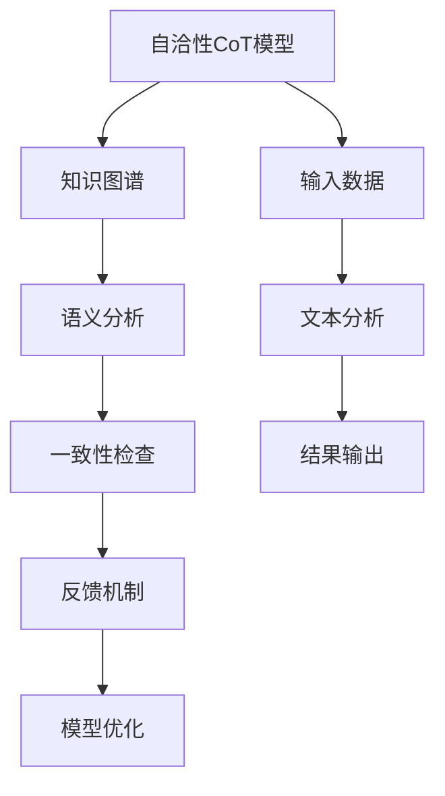

                 

### 第1章: 自洽性概念与模型理论基础

#### 1.1.1 自洽性概念

##### 1.1.1.1 自洽性的定义

自洽性是指一个系统或过程内部各个部分之间能够保持一致性和协调性的性质。在自动化科学论文写作中，自洽性意味着论文的各个部分（如引言、方法、结果和讨论）之间能够相互呼应、逻辑连贯，从而确保论文的整体一致性和可信度。

##### 1.1.1.2 自洽性的重要性

在科学研究中，自洽性对于确保研究方法的可靠性至关重要。不一致或矛盾的方法可能导致错误的结论，影响研究的可信度。因此，自洽性是科学研究的基石之一，也是自动化科学论文写作中不可或缺的一环。

##### 1.1.1.3 自洽性与一致性的区别

自洽性强调内部一致性，即系统内部各部分的协调和一致性。而一致性则更侧重于系统与外界环境的匹配和协调。在自动化科学论文写作中，自洽性关注的是论文内部逻辑的连贯性，而一致性则关注论文与实际研究过程的一致性。

### 第2章: 自洽性CoT模型的核心概念

#### 2.1.1 自洽性概念图

在Mermaid流程图中，我们可以展示自洽性CoT模型的核心概念和组件，以便读者更好地理解其结构和工作原理。



#### 2.1.2 自洽性CoT模型的工作原理

自洽性CoT模型通过以下步骤实现自动化科学论文写作中的自洽性：

1. **输入数据预处理**：对输入的文本数据（如论文的各个部分）进行预处理，包括分词、去噪等操作。
2. **文本分析**：对预处理后的文本进行语义分析，提取关键信息。
3. **知识图谱构建**：将提取的关键信息构建为知识图谱，以便更好地理解和关联文本内容。
4. **一致性检查**：对知识图谱中的各个部分进行一致性检查，以确保论文内容的一致性和协调性。
5. **反馈机制**：根据一致性检查的结果，对模型进行反馈和优化，提高自洽性。
6. **模型优化**：通过不断优化模型，提高模型的自洽性和论文写作质量。

### 第3章: 自洽性CoT模型的数学模型与算法原理

#### 3.1.1 数学模型概述

自洽性CoT模型的数学模型主要包括以下几个部分：

1. **文本表示**：使用词向量或图嵌入等方法对文本进行表示。
2. **语义分析**：通过图神经网络等方法对文本进行语义分析。
3. **一致性检查**：使用逻辑推理或机器学习算法对知识图谱进行一致性检查。
4. **反馈机制**：通过反馈信号调整模型参数，实现模型优化。

#### 3.1.2 算法原理讲解

以下是自洽性CoT模型的关键算法原理讲解，使用伪代码来详细阐述：

```python
# 输入数据预处理
def preprocess_data(text):
    # 分词、去噪等操作
    # 返回预处理后的文本数据

# 文本分析
def text_analysis(preprocessed_text):
    # 语义分析
    # 返回分析结果

# 知识图谱构建
def build_knowledge_graph(semantic_analysis_results):
    # 构建知识图谱
    # 返回知识图谱

# 一致性检查
def check_consistency(knowledge_graph):
    # 使用逻辑推理或机器学习算法进行一致性检查
    # 返回一致性检查结果

# 反馈机制
def feedback_mechanism(consistency_check_results):
    # 根据一致性检查结果调整模型参数
    # 返回优化后的模型

# 模型优化
def model_optimization(model, feedback_signal):
    # 通过反馈信号优化模型参数
    # 返回优化后的模型
```

### 第4章: 自洽性CoT模型在论文写作中的应用

#### 4.1.1 论文结构分析

在自动化科学论文写作中，自洽性CoT模型可以应用于以下几个关键步骤：

1. **引言撰写**：分析已有研究，提出研究问题。
2. **方法描述**：描述研究方法、实验设计和数据分析。
3. **结果展示**：展示实验结果，解释分析过程。
4. **讨论**：总结研究结果，讨论研究局限性和未来方向。

#### 4.1.2 应用实例

以下是自洽性CoT模型在自动化科学论文写作中的应用实例：

### <此处是文章标题>

关键词：自洽性，自动化科学论文写作，一致性检查，知识图谱，语义分析，反馈机制。

摘要：本文探讨了自洽性CoT模型在自动化科学论文写作中的应用，旨在确保论文的各个部分之间保持一致性和协调性。通过详细分析自洽性概念和模型理论基础，阐述了自洽性CoT模型的核心概念、工作原理以及数学模型和算法原理。实例分析展示了自洽性CoT模型在论文写作中的实际应用，为提高论文写作质量提供了有益的参考。

