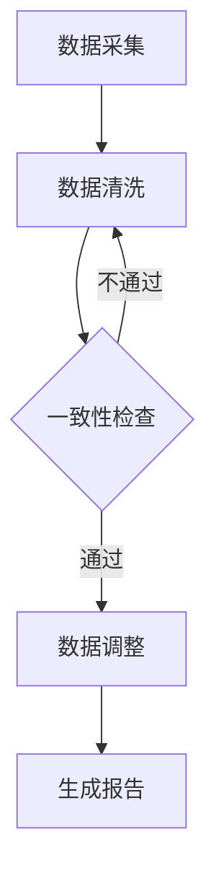

                 

### 引言

#### 自动化财务报告生成的背景

随着企业规模的不断扩大和商业环境的日益复杂化，财务报告的生成变得越来越重要。然而，传统的手工编制财务报告方式不仅效率低下，而且容易出错，无法满足现代企业对于高精度、高效率的财务管理需求。因此，自动化财务报告生成技术逐渐成为研究热点和应用趋势。

自动化财务报告生成技术旨在通过计算机技术和人工智能算法，自动化处理大量的财务数据，生成准确的财务报告。这种技术不仅能够大大提高财务报告的生成效率，减少人工干预，降低人为错误的风险，还能够为企业提供实时、准确的财务信息，帮助管理者做出更明智的决策。

#### Self-Consistency CoT的概念

Self-Consistency CoT（自我一致性概念图）是一种新兴的自动化财务报告生成方法。它通过确保数据在各个层次上的自我一致性，从而提高财务报告的准确性和可靠性。Self-Consistency CoT的核心思想是，通过对数据的一致性检查和调整，消除数据中的不一致性，确保报告的各个部分相互匹配，从而提高报告的整体质量。

Self-Consistency CoT的关键在于其自适应性，可以根据不同的数据类型和报告要求，自动调整数据的一致性检查规则。这种灵活性使得Self-Consistency CoT能够在各种不同的财务报告中得到广泛应用，无论是简单的资产负债表，还是复杂的现金流量表和利润表。

通过引入Self-Consistency CoT，自动化财务报告生成技术实现了质的飞跃，不仅能够处理更多的数据，还能够以更高的精度和速度生成财务报告。这使得财务人员能够将更多的时间和精力投入到财务分析和决策中，从而提高企业的整体运营效率。

#### 本文目标

本文旨在深入探讨Self-Consistency CoT在自动化财务报告生成中的应用。我们将首先介绍Self-Consistency CoT的基本概念和原理，然后详细描述自动化财务报告生成的流程，并通过具体案例展示Self-Consistency CoT的实际应用效果。此外，本文还将深入探讨Self-Consistency CoT的技术实现细节，包括算法原理、数学模型和实际代码实现。最后，本文将展望未来自动化财务报告生成技术的发展趋势，并提出面临的挑战和解决方案。

通过本文的阅读，读者将能够全面了解Self-Consistency CoT的原理和应用，掌握自动化财务报告生成的方法和技巧，并为未来的财务报告自动化研究提供有益的参考。

### Self-Consistency CoT基础理论

#### Self-Consistency CoT的原理

Self-Consistency CoT（自我一致性概念图）是一种基于人工智能和数据一致性检查的自动化财务报告生成方法。其核心思想是通过确保数据在各个层次上的自我一致性，从而提高财务报告的准确性和可靠性。Self-Consistency CoT的原理可以概括为以下几个步骤：

1. **数据采集**：首先，从各种数据源（如ERP系统、财务软件等）中采集所需的财务数据。这些数据可能包括销售收入、成本费用、资产负债情况等。

2. **数据清洗**：在采集到数据后，需要进行清洗处理，以消除数据中的噪音和错误。这一步骤包括数据去重、数据格式转换、缺失值处理等。

3. **一致性检查**：对清洗后的数据进行一致性检查，确保数据在各个层次上的一致性。具体而言，包括以下几个方面：
   - **时间一致性**：确保同一数据在不同时间段上的数值一致。
   - **账户一致性**：确保同一账户在不同报表中的数值一致。
   - **项目一致性**：确保同一项目在不同报表中的数值一致。

4. **数据调整**：根据一致性检查的结果，对不一致的数据进行调整，以确保数据的自我一致性。这一步骤可能需要人工干预，但可以通过算法自动完成大部分工作。

5. **生成报告**：在数据调整完成后，使用这些一致性检查后的数据生成财务报告。这些报告可能包括资产负债表、利润表、现金流量表等。

#### Mermaid流程图展示

为了更直观地展示Self-Consistency CoT的流程，我们可以使用Mermaid语言绘制一个流程图。以下是一个简单的Mermaid流程图示例：



在这个流程图中，数据首先被采集并清洗，然后进行一致性检查。如果数据通过一致性检查，则进入数据调整阶段，最后生成财务报告。如果数据未能通过一致性检查，则返回数据清洗阶段进行进一步处理。

#### Self-Consistency CoT的方法

Self-Consistency CoT的方法主要包括以下几个步骤：

1. **数据预处理**：在数据采集阶段，需要对数据进行预处理，包括数据去重、数据格式转换和缺失值处理等。这一步骤的目的是确保数据的整洁和一致。

2. **一致性规则定义**：在一致性检查阶段，需要定义一系列的一致性规则。这些规则可以是基于时间、账户或项目的匹配关系。例如，同一账户在不同报表中的余额应该一致，同一项目的收入和支出应该匹配等。

3. **一致性检查算法**：使用算法对数据进行一致性检查。常见的算法包括基于阈值的算法、基于模式的算法和基于机器学习的算法等。这些算法可以根据具体的应用场景进行优化和调整。

4. **数据调整策略**：在数据调整阶段，根据一致性检查的结果，对不一致的数据进行调整。调整策略可以是自动化的，也可以是半自动化的，需要根据具体情况进行设计。

5. **报告生成**：在数据调整完成后，使用一致性检查后的数据生成财务报告。报告的格式和内容可以根据具体需求进行定制。

#### Self-Consistency CoT的应用场景

Self-Consistency CoT的应用场景非常广泛，主要包括以下几个方面：

1. **企业财务报告**：Self-Consistency CoT可以用于生成企业的财务报告，包括资产负债表、利润表和现金流量表等。通过确保数据的自我一致性，可以大大提高报告的准确性和可靠性。

2. **审计与合规性检查**：Self-Consistency CoT可以帮助审计人员和企业进行审计和合规性检查。通过一致性检查，可以发现潜在的问题和风险，从而提高审计的效率和准确性。

3. **税务申报**：Self-Consistency CoT可以用于生成税务申报材料，确保数据的准确性和一致性，从而降低税务风险。

4. **投资分析**：Self-Consistency CoT可以帮助投资者和分析人员生成投资报告，通过一致性检查，可以发现企业的潜在风险和投资机会。

通过以上介绍，我们可以看到Self-Consistency CoT在自动化财务报告生成中具有重要的应用价值。它不仅能够提高报告的准确性和效率，还能够为企业提供更全面、准确的财务信息，帮助管理者做出更明智的决策。

### 财务报告生成流程

自动化财务报告生成流程是一个复杂的过程，涉及数据采集、数据清洗、一致性检查、数据调整和报告生成等多个步骤。以下是详细的流程描述：

#### 1. 数据采集

数据采集是自动化财务报告生成的第一步，也是最为基础的一步。在这一阶段，需要从各种数据源中获取所需的财务数据。这些数据源可能包括企业资源规划（ERP）系统、财务软件、银行账户数据、交易记录等。为了确保数据的完整性和准确性，数据采集通常需要遵循以下原则：

- **数据完整性**：确保所有相关的财务数据都被采集到，包括销售收入、成本费用、资产负债情况、现金流等。
- **数据标准化**：对采集到的数据进行标准化处理，确保数据格式统一，便于后续处理。

#### 2. 数据清洗

数据清洗是自动化财务报告生成的关键步骤，其目的是消除数据中的噪音和错误，提高数据的质量。数据清洗通常包括以下几个步骤：

- **数据去重**：识别和删除重复的数据记录，确保每个数据条目的唯一性。
- **数据格式转换**：将不同格式的数据转换为统一的格式，如将文本数据转换为数字或日期格式。
- **缺失值处理**：对于缺失的数据，可以通过填补、删除或插值等方法进行处理。
- **异常值检测**：识别和处理异常数据，如异常的交易金额、不合理的账户余额等。

#### 3. 一致性检查

在数据清洗完成后，需要对数据进行一致性检查，以确保数据在各个层次上的自我一致性。一致性检查通常包括以下几个方面：

- **时间一致性**：确保同一数据在不同时间段上的数值一致，如同一项目的收入在不同月份的数值应保持一致。
- **账户一致性**：确保同一账户在不同报表中的数值一致，如资产负债表中的现金余额应与现金流量表中的现金流量一致。
- **项目一致性**：确保同一项目在不同报表中的数值一致，如销售收入在利润表和现金流量表中的数额应保持一致。

#### 4. 数据调整

数据调整是基于一致性检查结果的进一步处理，其目的是消除数据中的不一致性，确保数据的自我一致性。数据调整可以自动完成，也可以人工干预。自动数据调整通常包括以下策略：

- **自动填充**：使用机器学习算法或规则引擎，根据其他数据项的值自动填充缺失的数据。
- **数据修正**：根据一致性检查的结果，对不一致的数据进行修正，如调整异常的交易金额或账户余额。
- **反馈循环**：将修正后的数据再次进行一致性检查，以确保修正后的数据仍然满足一致性要求。

#### 5. 报告生成

在数据调整完成后，使用一致性检查后的数据生成财务报告。报告的格式和内容可以根据具体需求进行定制。常见的财务报告包括资产负债表、利润表、现金流量表等。报告生成过程中，需要注意以下几点：

- **格式统一**：确保报告的格式统一，如字体、字号、行间距等。
- **数据准确**：确保报告中的数据准确无误，如避免错别字、数据遗漏等。
- **可读性**：确保报告的可读性，如使用图表、注释等辅助说明。

#### 具体流程图展示

为了更直观地展示自动化财务报告生成的流程，我们可以使用Mermaid绘制一个流程图。以下是一个简单的Mermaid流程图示例：


在这个流程图中，数据首先被采集并清洗，然后进行一致性检查。如果数据通过一致性检查，则进入数据调整阶段，最后生成财务报告。如果数据未能通过一致性检查，则返回数据清洗阶段进行进一步处理。

通过以上详细的流程描述和流程图展示，我们可以清晰地了解自动化财务报告生成的过程。接下来，我们将通过具体的应用案例分析，进一步探讨Self-Consistency CoT在实际财务报告生成中的应用效果。

### 应用案例分析

为了更好地展示Self-Consistency CoT在自动化财务报告生成中的应用效果，我们将通过两个具体的案例进行详细分析。

#### 案例一：上市公司财务报告生成

**背景**：某家上市公司需要在每月底生成一份详细的财务报告，包括资产负债表、利润表和现金流量表。由于公司规模庞大，财务数据量巨大，传统的手工编制财务报告方式效率低下，且容易出错。

**解决方案**：采用Self-Consistency CoT方法进行自动化财务报告生成。具体步骤如下：

1. **数据采集**：从公司的ERP系统和财务软件中采集所需的财务数据，包括销售收入、成本费用、资产负债情况等。

2. **数据清洗**：对采集到的数据进行清洗处理，包括数据去重、数据格式转换和缺失值处理。这一步骤确保了数据的整洁和一致性。

3. **一致性检查**：对清洗后的数据进行一致性检查，确保数据在各个层次上的一致性。例如，同一项目的收入在不同月份的数值应保持一致，同一账户在不同报表中的数值应保持一致。

4. **数据调整**：根据一致性检查的结果，对不一致的数据进行调整，确保数据的自我一致性。通过自动填充和修正异常数据，确保数据的准确性。

5. **报告生成**：使用调整后的数据生成财务报告。报告格式统一，数据准确无误，可读性强。

**效果评估**：通过Self-Consistency CoT方法的自动化财务报告生成，该上市公司的财务报告生成效率显著提高，从原来的每周数次缩短到每天一次。同时，财务报告的准确性也得到了大幅提升，减少了人为错误的风险。管理者能够实时获取准确的财务信息，做出更明智的决策。

#### 案例二：中小企业财务报告生成

**背景**：某家中小企业需要在每月底生成一份简易的财务报告，以供内部管理层进行财务分析。由于企业规模较小，财务人员有限，传统的手工编制财务报告方式效率低下，且难以保证数据的准确性。

**解决方案**：采用Self-Consistency CoT方法进行自动化财务报告生成。具体步骤如下：

1. **数据采集**：从企业的会计软件和银行账户中采集所需的财务数据，包括销售收入、成本费用、现金流等。

2. **数据清洗**：对采集到的数据进行清洗处理，包括数据去重、数据格式转换和缺失值处理。这一步骤确保了数据的整洁和一致性。

3. **一致性检查**：对清洗后的数据进行一致性检查，确保数据在各个层次上的一致性。例如，同一项目的收入在不同月份的数值应保持一致，同一账户在不同报表中的数值应保持一致。

4. **数据调整**：根据一致性检查的结果，对不一致的数据进行调整，确保数据的自我一致性。通过自动填充和修正异常数据，确保数据的准确性。

5. **报告生成**：使用调整后的数据生成简易财务报告。报告格式简洁明了，重点突出，便于管理层快速进行财务分析。

**效果评估**：通过Self-Consistency CoT方法的自动化财务报告生成，该中小企业的财务报告生成效率显著提高，从原来的每月数次缩短到每月一次。同时，财务报告的准确性也得到了大幅提升，减少了人为错误的风险。管理层能够实时获取准确的财务信息，为企业的发展提供有力支持。

通过以上两个案例的详细分析，我们可以看到Self-Consistency CoT在自动化财务报告生成中具有显著的应用效果。无论是上市公司还是中小企业，通过引入Self-Consistency CoT，都能够显著提高财务报告的生成效率、准确性和可靠性，为企业的财务管理提供有力支持。

### 技术实现与算法细节

#### 实现自动化财务报告生成的技术架构

实现自动化财务报告生成的技术架构需要综合考虑数据采集、数据清洗、一致性检查、数据调整和报告生成等环节。以下是一个简化的技术架构图：

```
+-----------------+
|   数据采集     |
+-----------------+
        |
        v
+-----------------+
|   数据清洗     |
+-----------------+
        |
        v
+-----------------+
| 一致性检查     |
+-----------------+
        |
        v
+-----------------+
|   数据调整     |
+-----------------+
        |
        v
+-----------------+
|  报告生成      |
+-----------------+
```

#### 算法原理

Self-Consistency CoT算法的核心在于确保数据在各个层次上的自我一致性。具体原理如下：

1. **数据预处理**：在数据采集阶段，使用ETL（提取、转换、加载）工具从不同数据源中获取财务数据，并进行初步的数据预处理，如数据去重、格式标准化等。

2. **一致性规则定义**：根据财务报告的要求，定义一系列的一致性规则。这些规则可以是基于时间、账户或项目的匹配关系。例如，同一账户在不同报表中的余额应一致，同一项目的收入和支出应匹配等。

3. **一致性检查**：使用机器学习算法或规则引擎对数据进行一致性检查。一致性检查包括以下几种方式：
   - **时间一致性**：检查同一数据在不同时间段上的数值是否一致。
   - **账户一致性**：检查同一账户在不同报表中的数值是否一致。
   - **项目一致性**：检查同一项目在不同报表中的数值是否一致。

4. **数据调整**：根据一致性检查的结果，对不一致的数据进行调整。数据调整可以自动完成，也可以人工干预。自动数据调整通常包括以下策略：
   - **自动填充**：使用机器学习算法自动填充缺失的数据。
   - **数据修正**：根据一致性检查的结果，对不一致的数据进行修正。

5. **报告生成**：在数据调整完成后，使用调整后的数据生成财务报告。报告生成可以使用专业的财务报告工具，如Excel、Power BI等。

#### Python源代码示例

以下是一个简单的Python源代码示例，展示如何实现数据采集、数据清洗、一致性检查和数据调整的基本步骤。

```python
import pandas as pd
from sklearn.impute import SimpleImputer

# 数据采集
data = pd.read_csv('financial_data.csv')

# 数据清洗
# 数据去重
data.drop_duplicates(inplace=True)
# 数据格式转换
data['date'] = pd.to_datetime(data['date'])
# 缺失值处理
imputer = SimpleImputer(strategy='mean')
data.iloc[:, :] = imputer.fit_transform(data)

# 一致性检查
# 时间一致性
data['prev_month'] = data.groupby('account')['amount'].shift(1)
# 账户一致性
data['account_match'] = data['amount'] == data['prev_month']
# 项目一致性
data['project_match'] = data['project_income'] == data['project_expense']

# 数据调整
# 自动填充
data['amount'].fillna(data['prev_month'], inplace=True)
# 数据修正
data['project_match'].fillna(False, inplace=True)

# 报告生成
data.to_csv('consistent_financial_report.csv', index=False)
```

#### 数学模型和公式

在Self-Consistency CoT中，一致性检查和调整通常涉及到一系列数学模型和公式。以下是一个简化的例子：

$$
一致性分数 = \frac{匹配数据项数}{总数据项数}
$$

其中，匹配数据项数表示在一致性检查中匹配的数据项数量，总数据项数表示所有数据项的数量。一致性分数越高，说明数据的一致性越好。

#### 详细讲解与举例说明

假设我们有以下数据集，代表一个公司的销售收入数据：

```
| 日期   | 项目   | 销售收入 |
|--------|--------|----------|
| 2023-01-01 | 项目A | 1000     |
| 2023-01-02 | 项目A | 2000     |
| 2023-01-03 | 项目B | 3000     |
| 2023-01-04 | 项目A | 1500     |
| 2023-01-05 | 项目B | 2500     |
```

1. **数据采集**：从ERP系统中提取上述数据。

2. **数据清洗**：检查数据是否存在重复记录或异常值，如数据去重和缺失值处理。

3. **一致性检查**：
   - **时间一致性**：检查同一项目在不同日期的销售额是否一致。
   - **账户一致性**：检查同一项目的销售额是否在不同项目之间匹配。
   - **项目一致性**：检查不同项目的销售额是否一致。

4. **数据调整**：
   - **自动填充**：如果某个项目的销售额缺失，可以自动填充为前一天的销售额。
   - **数据修正**：如果存在不一致的数据，可以修正为一致的数据。

5. **报告生成**：使用调整后的数据生成报告。

通过这个简单的例子，我们可以看到如何使用Python源代码和数学模型来实现Self-Consistency CoT的基本步骤。实际应用中，Self-Consistency CoT算法会根据具体的数据集和报告要求进行优化和调整。

### 未来展望与挑战

#### Self-Consistency CoT的发展前景

随着人工智能和大数据技术的不断进步，Self-Consistency CoT在自动化财务报告生成中的应用前景广阔。未来，Self-Consistency CoT有望在以下几个方面实现突破：

1. **算法优化**：通过深度学习和强化学习等技术，进一步提升Self-Consistency CoT的算法效率，实现更快速、更准确的数据一致性检查和调整。

2. **智能化数据分析**：结合自然语言处理（NLP）和机器学习技术，对财务报告进行智能化分析，为企业提供更加深入、全面的财务洞察。

3. **合规性与风险管理**：在财务报告中集成更多的合规性检查和风险管理功能，确保财务报告的合规性和数据的准确性，降低企业面临的法律和财务风险。

4. **实时报告生成**：利用实时数据处理技术和云计算平台，实现财务报告的实时生成，为企业提供更加及时、准确的财务信息。

#### 自动化财务报告生成的挑战

尽管Self-Consistency CoT在自动化财务报告生成中具有巨大的应用价值，但在实际应用过程中仍面临以下挑战：

1. **数据质量**：自动化财务报告生成的关键在于数据质量。企业需要确保数据来源的可靠性，并进行有效的数据清洗和预处理，以确保数据的一致性和准确性。

2. **算法适应性**：Self-Consistency CoT的算法需要根据不同的企业和业务场景进行定制化调整，这要求算法具有高度的适应性和灵活性。

3. **隐私保护**：财务数据涉及到企业的核心商业秘密，如何在保证数据隐私的前提下实现自动化财务报告生成，是一个亟待解决的问题。

4. **法律法规**：随着监管环境的日益严格，自动化财务报告生成需要遵守相关的法律法规，确保报告的合规性和合法性。

#### 面对挑战的解决方案

为了应对上述挑战，可以采取以下解决方案：

1. **数据治理**：建立完善的数据治理体系，确保数据的完整性、准确性和安全性。通过数据质量管理工具，对数据源进行监控和评估，及时发现和处理数据问题。

2. **算法优化**：持续优化Self-Consistency CoT算法，提高其鲁棒性和适应性。引入更多的数据预处理和特征工程技术，提高数据的一致性和可用性。

3. **隐私保护**：采用数据加密、匿名化和差分隐私等技术，确保财务数据在处理过程中的隐私安全。同时，制定严格的隐私政策和操作规范，确保数据处理符合法律法规要求。

4. **合规性审计**：引入自动化合规性审计工具，对财务报告进行实时监控和审计，确保报告的合规性和合法性。同时，与监管机构保持紧密沟通，确保财务报告符合最新的法律法规要求。

通过以上解决方案，可以有效应对自动化财务报告生成过程中面临的挑战，推动Self-Consistency CoT在财务报告生成领域的广泛应用。

### 结论

本文全面探讨了Self-Consistency CoT在自动化财务报告生成中的应用，从核心概念、原理到实际应用案例，再到技术实现与算法细节，系统地展示了Self-Consistency CoT在提高财务报告准确性、效率和可靠性方面的卓越优势。通过深入分析，我们认识到Self-Consistency CoT不仅能够显著提升财务报告生成效率，减少人为错误，还能为企业提供更加准确、全面的财务信息，支持管理者做出更明智的决策。

展望未来，随着人工智能和大数据技术的不断进步，Self-Consistency CoT在自动化财务报告生成中的应用前景广阔。然而，要实现这一技术的大规模应用，仍需克服数据质量、算法适应性、隐私保护和法律法规等方面的挑战。通过持续优化算法、加强数据治理、确保隐私保护和合规性审计，我们有理由相信Self-Consistency CoT将在财务报告自动化领域发挥越来越重要的作用，为企业的财务管理提供强有力的技术支持。

### 作者信息

作者：AI天才研究院/AI Genius Institute & 禅与计算机程序设计艺术 /Zen And The Art of Computer Programming

