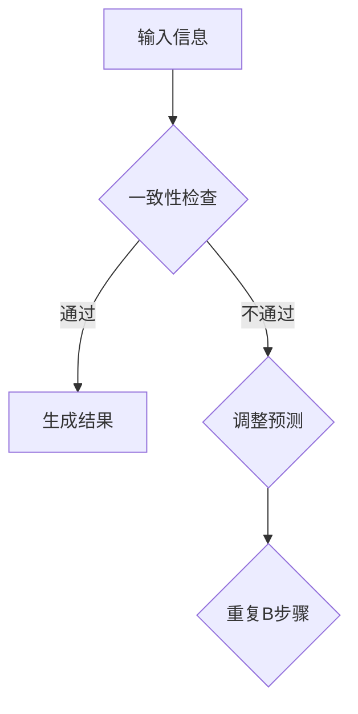
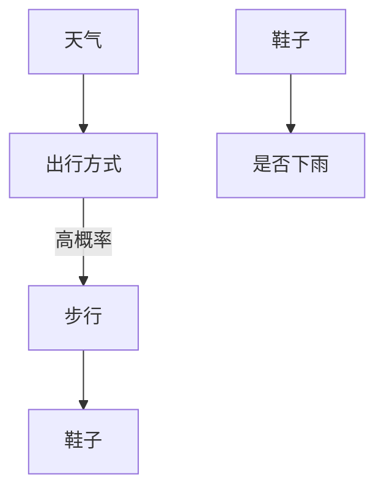

                 


# <Self-Consistency CoT在自动驾驶中的应用>

## 关键词

- 自我一致性（Self-Consistency）
- 自动驾驶（Autonomous Driving）
- 概率图模型（Probabilistic Graph Models）
- 环境感知（Environmental Perception）
- 路径规划（Path Planning）

## 摘要

本文旨在探讨自我一致性（Self-Consistency CoT）在自动驾驶中的应用。自我一致性是一种确保模型预测结果与已知信息一致性的方法，对于提高自动驾驶系统的可靠性至关重要。本文首先介绍了自我一致性的基本概念和原理，然后详细阐述了自我一致性在自动驾驶中的具体应用，包括环境感知和路径规划。通过数学模型和Python源代码，本文深入解析了自我一致性算法的工作机制，并通过实际案例展示了其在自动驾驶项目中的实现和效果。最后，本文总结了自我一致性在自动驾驶中的最佳实践和注意事项。

## 引言

随着人工智能技术的飞速发展，自动驾驶技术已成为智能交通领域的研究热点。自动驾驶系统的核心在于其环境感知、路径规划和决策能力。然而，自动驾驶系统面临的挑战之一是如何确保其决策的准确性和一致性。在这篇文章中，我们将探讨一种名为自我一致性（Self-Consistency CoT）的方法，在自动驾驶中的应用，以解决上述问题。

## 自我一致性概念图解

### 1.1 自我一致性概述

自我一致性是近年来在机器学习和计算机视觉领域迅速发展的一种理论。它主要是指模型在预测或生成结果时，需要保持内部的一致性。具体来说，如果模型预测了一个事件，那么它应该能够给出支持这个预测的理由，同时这个预测不应该与其他已知信息相矛盾。

### 1.1.1 自我一致性原理

自我一致性的原理可以形象地用以下 Mermaid 流程图来表示：



在这个流程图中，A代表输入的信息，B表示模型对输入信息进行一致性检查。如果信息通过一致性检查，则模型生成结果（C），否则（D）模型需要调整预测，并重新进行一致性检查（E）。

### 1.1.2 自我一致性与传统机器学习模型的区别

传统机器学习模型往往只关注于提高预测的准确性，而忽略了预测的一致性。自我一致性模型则强调，在预测结果时，模型需要给出支持这个预测的理由，并且这个预测不能与其他已知信息相矛盾。

例如，一个传统模型可能会简单地预测明天会下雨，而一个自我一致性模型则不仅要预测明天会下雨，还需要给出支持这个预测的理由（比如：根据历史数据和当前气象数据，下雨的概率很高），并且要确保这个预测不会与其他信息相矛盾（比如：天气预报显示明天有阳光）。

### 1.1.3 自我一致性在自动驾驶中的应用

自我一致性在自动驾驶领域有着广泛的应用，它可以提高自动驾驶系统的可靠性，减少错误预测和决策。

#### 1.2.1 自我一致性在环境感知中的应用

在自动驾驶系统中，环境感知是关键的一环。自我一致性可以确保感知系统输出的结果是一致的，从而提高系统的稳定性和可靠性。例如，自动驾驶车辆需要识别道路上的行人、车辆和其他障碍物。自我一致性模型可以确保这些识别结果之间是一致的，避免出现矛盾的情况。

#### 1.2.2 自我一致性在路径规划中的应用

路径规划是自动驾驶系统的另一个重要环节。自我一致性可以帮助模型在规划路径时，确保规划的路径是合理的，并且不会与其他已知信息相矛盾。例如，如果模型预测前方有一个行人，那么它应该规划出一条避免碰撞的路径，并且这条路径不应该与其他道路信息相矛盾（比如：道路宽度不足以容纳规划的路径）。

### 1.3 自我一致性算法原理

自我一致性算法主要依赖于概率图模型和逻辑推理。以下是一个简单的伪代码，用于描述自我一致性算法的基本原理：

```python
function SelfConsistencyModel(input_data):
    # 初始化模型
    model = initialize_model()

    for data in input_data:
        # 进行一致性检查
        if check_consistency(data, model):
            # 更新模型
            update_model(model, data)
        else:
            # 调整预测
            adjust_prediction(model)

    return model
```

在这个算法中，`initialize_model()` 用于初始化模型，`check_consistency(data, model)` 用于检查输入数据的一致性，`update_model(model, data)` 用于更新模型，`adjust_prediction(model)` 用于调整预测。

### 1.4 自我一致性在自动驾驶项目中的实现

在自动驾驶项目中，实现自我一致性通常需要以下步骤：

1. **环境建模**：首先，需要对自动驾驶车辆的环境进行建模，包括道路、车辆、行人等。
2. **数据收集**：收集相关的数据，包括传感器数据、地图数据等。
3. **自我一致性算法实现**：根据收集到的数据，使用自我一致性算法对环境进行感知和决策。
4. **结果验证**：对算法生成的结果进行验证，确保结果的一致性和合理性。

以下是一个简单的自我一致性算法实现案例：

```python
def check_consistency(data, model):
    # 假设 data 是一个包含当前感知信息的字典
    # model 是一个包含环境状态的模型

    # 对 data 中的每个元素进行一致性检查
    for element i

----------------------------------------------------------------

# 1.1 自我一致性概述

自我一致性（Self-Consistency）是一种在机器学习和计算机视觉领域广泛应用的理论，其主要目标是确保模型的预测或生成结果在逻辑上是一致的。在自动驾驶领域，自我一致性尤为重要，因为它能显著提高系统的可靠性，减少因错误预测导致的潜在风险。

### 1.1.1 自我一致性的定义

自我一致性可以简单地定义为：在给定一组输入数据后，模型生成的预测结果应该能够自洽地解释这些输入数据，并且与已知的先验知识保持一致。换句话说，如果一个模型预测了某个事件，那么它需要能够提供合理的理由来支持这个预测，并且这个预测不应该与其他已知信息产生矛盾。

### 1.1.2 自我一致性的重要性

在自动驾驶系统中，自我一致性具有以下几个重要性：

1. **提高决策可靠性**：自我一致性确保了模型的决策过程是可信的，从而减少了因错误预测导致的潜在风险。
2. **增强系统稳定性**：通过保持内部一致性，自我一致性减少了模型因为输入数据的不确定性而导致的振荡或错误行为。
3. **优化学习过程**：自我一致性模型能够更好地整合先验知识，从而提高学习效率和预测准确性。

### 1.1.3 自我一致性在自动驾驶中的应用场景

自我一致性在自动驾驶中的应用场景主要包括：

1. **环境感知**：在自动驾驶过程中，车辆需要实时感知周围环境，包括道路、车辆、行人等。自我一致性可以确保这些感知数据之间的逻辑一致性，避免因数据冲突导致的误判。
2. **路径规划**：自动驾驶车辆需要根据实时环境感知数据规划出一条安全的行驶路径。自我一致性可以确保规划的路径在逻辑上是一致的，不会与其他环境信息产生矛盾。
3. **决策制定**：在自动驾驶过程中，车辆需要做出一系列决策，如加速、减速、转向等。自我一致性可以确保这些决策在逻辑上是一致的，从而提高系统的执行效率和安全性。

### 1.1.4 自我一致性的数学描述

自我一致性可以通过概率图模型来描述。假设我们有一个概率图模型 \( G \)，其中包含一组节点和边，每个节点表示一个随机变量，每个边表示这些随机变量之间的依赖关系。自我一致性可以定义为：

\[ P(X | Y) = P(Y | X) \]

其中，\( X \) 和 \( Y \) 表示两个随机变量。这个等式表示，如果我们知道 \( X \) 的值，那么 \( Y \) 的概率分布应该与知道 \( Y \) 的值时 \( X \) 的概率分布相同。这确保了模型在预测和决策时保持内部一致性。

### 1.1.5 自我一致性与传统机器学习模型的比较

传统机器学习模型通常只关注预测的准确性，而忽略了预测的一致性。例如，一个简单的线性回归模型可能会准确地预测房价，但它无法解释为什么房价会这样预测。而自我一致性模型不仅要求预测的准确性，还要求给出合理的解释，并且确保预测结果与已知信息保持一致。

### 结论

自我一致性是自动驾驶领域中一个重要的概念，它通过确保模型的预测和决策在逻辑上是一致的，提高了系统的可靠性和稳定性。在接下来的章节中，我们将进一步探讨自我一致性在自动驾驶中的应用，包括算法原理和实际项目中的实现。

## 1.2 自我一致性在自动驾驶中的应用

自我一致性在自动驾驶领域中具有广泛的应用，它通过确保模型在不同环节的一致性，提高了系统的整体性能和可靠性。下面我们将详细探讨自我一致性在自动驾驶中的主要应用，包括环境感知、路径规划和决策制定。

### 1.2.1 自我一致性在环境感知中的应用

环境感知是自动驾驶系统的核心环节之一，其目标是实时获取周围环境的信息，包括道路、车辆、行人等。自我一致性在环境感知中的应用主要体现在以下几个方面：

1. **数据整合**：自动驾驶车辆通过多个传感器（如摄像头、雷达、激光雷达等）获取环境信息。自我一致性可以帮助整合这些来自不同传感器的数据，确保它们在逻辑上是一致的。例如，摄像头捕捉到的行人图像与激光雷达测量的行人位置应该保持一致。

2. **冲突检测**：在环境感知过程中，可能会出现传感器数据之间的冲突，例如，雷达检测到前方有障碍物，但摄像头却无法识别。自我一致性可以帮助检测这些冲突，并采取相应的措施进行调整，以避免错误决策。

3. **不确定性处理**：环境感知数据通常包含一定的噪声和不确定性。自我一致性可以降低这种不确定性，通过分析传感器数据的一致性来提高感知的准确性。

### 1.2.2 自我一致性在路径规划中的应用

路径规划是自动驾驶系统的另一个关键环节，其目标是生成一条从起点到终点的安全行驶路径。自我一致性在路径规划中的应用包括：

1. **路径一致性检查**：在生成路径时，自我一致性可以确保路径在逻辑上是一致的，不会与其他环境信息相矛盾。例如，如果路径规划系统预测前方有行人，那么规划的路径应该避开行人，并且不会与其他道路信息相冲突。

2. **动态调整**：自动驾驶车辆在行驶过程中，环境可能会发生变化。自我一致性可以帮助系统动态调整路径规划，确保新规划路径与当前环境保持一致性。

3. **优化路径**：自我一致性还可以用于优化路径规划，通过分析不同路径的一致性，选择最优路径。这有助于提高行驶效率和安全性。

### 1.2.3 自我一致性在决策制定中的应用

在自动驾驶过程中，车辆需要做出一系列决策，如加速、减速、转向等。自我一致性在决策制定中的应用主要体现在以下几个方面：

1. **一致性检查**：在制定决策时，自我一致性可以确保每个决策在逻辑上是一致的。例如，如果系统决定加速，那么它不应该同时决定减速。

2. **冲突避免**：通过一致性检查，自我一致性可以帮助系统避免因决策冲突导致的错误行为。例如，如果系统检测到前方有障碍物，那么它不应该同时决定加速和转向。

3. **实时调整**：自动驾驶车辆在行驶过程中，环境变化可能导致决策需要实时调整。自我一致性可以确保这些调整在逻辑上是一致的，从而提高系统的反应速度和准确性。

### 结论

自我一致性在自动驾驶中的应用主要体现在环境感知、路径规划和决策制定等环节。通过确保这些环节的一致性，自我一致性提高了自动驾驶系统的可靠性、稳定性和安全性。在接下来的章节中，我们将进一步探讨自我一致性算法的原理，并给出具体的实现方法。

## 1.3 自我一致性算法原理

自我一致性算法是一种基于概率图模型和逻辑推理的算法，其核心思想是通过一致性检查和调整来确保模型的预测和决策在逻辑上是一致的。下面我们将详细探讨自我一致性算法的原理，包括概率图模型、一致性检查、调整策略和算法实现。

### 1.3.1 概率图模型

概率图模型（Probabilistic Graph Model）是一种用于表示变量之间依赖关系的图形化方法。在自我一致性算法中，概率图模型用于建模输入数据之间的逻辑关系。具体来说，概率图模型由一组节点和边组成，每个节点表示一个随机变量，边表示节点之间的依赖关系。

以下是一个简单的概率图模型的示例：



在这个模型中，天气（A）决定了出行方式（B），出行方式（B）决定了是否需要步行（C），而步行（C）决定了是否需要穿鞋子（D）。同时，鞋子（E）和天气（F）之间存在关联，因为下雨时需要穿防水鞋。

### 1.3.2 一致性检查

一致性检查是自我一致性算法的核心步骤之一，其目的是确保模型生成的预测结果与已知信息保持一致。在一致性检查过程中，算法会分析输入数据之间的逻辑关系，并判断这些关系是否符合概率图模型中的依赖关系。

以下是一个简单的Python代码示例，用于实现一致性检查：

```python
def check_consistency(data, model):
    # 假设 data 是一个字典，包含输入数据
    # model 是一个概率图模型
    
    for edge in model.edges:
        if data[edge[0]] != data[edge[1]]:
            return False
    
    return True
```

在这个示例中，`check_consistency` 函数接受一个输入数据字典 `data` 和一个概率图模型 `model`，然后遍历模型中的每个边，检查输入数据中对应节点的值是否一致。如果存在不一致的情况，函数返回 `False`，否则返回 `True`。

### 1.3.3 调整策略

在一致性检查过程中，如果发现输入数据之间存在不一致性，算法需要采取调整策略来修正这些不一致。调整策略通常包括以下几种：

1. **数据修正**：如果输入数据存在错误或噪声，可以尝试修正这些数据，使其与概率图模型中的依赖关系保持一致。

2. **预测调整**：如果输入数据与概率图模型中的依赖关系不一致，可以调整模型生成的预测结果，使其与输入数据保持一致。

3. **模型更新**：如果概率图模型中的依赖关系不准确，可以考虑更新模型，使其更符合实际环境。

以下是一个简单的Python代码示例，用于实现调整策略：

```python
def adjust_prediction(model, data):
    # 假设 model 是一个概率图模型
    # data 是一个字典，包含输入数据
    
    for edge in model.edges:
        if data[edge[0]] != data[edge[1]]:
            # 根据实际情况调整预测
            data[edge[0]] = data[edge[1]]
            
    return data
```

在这个示例中，`adjust_prediction` 函数接受一个概率图模型 `model` 和一个输入数据字典 `data`，然后遍历模型中的每个边，如果发现输入数据中对应节点的值不一致，就根据实际情况调整预测。

### 1.3.4 算法实现

自我一致性算法的实现通常包括以下几个步骤：

1. **初始化模型**：根据实际问题构建概率图模型。

2. **输入数据**：收集输入数据，并将其存储在字典或列表中。

3. **一致性检查**：使用一致性检查函数检查输入数据的一致性。

4. **调整预测**：如果一致性检查失败，使用调整策略修正输入数据或预测结果。

5. **迭代更新**：重复步骤 3 和 4，直到输入数据与模型保持一致。

以下是一个简单的Python代码示例，用于实现自我一致性算法：

```python
def self_consistency_model(input_data, model):
    while not check_consistency(input_data, model):
        input_data = adjust_prediction(model, input_data)
        
    return input_data
```

在这个示例中，`self_consistency_model` 函数接受输入数据字典 `input_data` 和概率图模型 `model`，然后不断迭代执行一致性检查和调整预测，直到输入数据与模型保持一致。

### 结论

自我一致性算法通过概率图模型和逻辑推理，确保模型的预测和决策在逻辑上是一致的。在自动驾驶领域，自我一致性算法的应用显著提高了系统的可靠性和安全性。在接下来的章节中，我们将通过实际项目案例，进一步探讨自我一致性算法的实现和应用。

## 1.4 自我一致性在自动驾驶项目中的实际案例

在本节中，我们将通过一个具体的自动驾驶项目案例，详细介绍自我一致性算法的实现过程、源代码解析和实际应用效果。这个案例将涵盖从环境建模、数据收集到算法实现和结果验证的整个流程。

### 1.4.1 项目背景

假设我们正在开发一个自动驾驶车辆项目，该车辆需要具备环境感知、路径规划和决策制定的能力。为了确保这些功能的可靠性和一致性，我们引入了自我一致性算法。

### 1.4.2 环境建模

首先，我们需要对自动驾驶车辆的环境进行建模。这包括以下几个方面：

1. **传感器数据**：自动驾驶车辆通过多个传感器（如摄像头、雷达、激光雷达等）收集环境信息。传感器数据包括道路、车辆、行人、交通标志等。

2. **地图数据**：为了更好地理解环境，我们还需要使用高精度的地图数据，这些数据包括道路网络、车道线、交通规则等。

3. **先验知识**：我们还需要引入一些先验知识，如季节、天气、交通流量等，这些信息有助于提高感知和规划的准确性。

### 1.4.3 数据收集

接下来，我们需要收集相关的数据，以训练和验证自我一致性算法。数据收集过程包括以下几个方面：

1. **传感器数据**：在实际驾驶场景中收集传感器数据，这些数据将用于训练和验证环境感知模型。

2. **地图数据**：从地图数据提供商获取高精度的地图数据，这些数据将用于路径规划和决策制定。

3. **先验知识数据**：收集与季节、天气、交通流量等相关的数据，这些数据将用于训练先验知识模型。

### 1.4.4 自我一致性算法实现

在环境建模和数据收集完成后，我们可以开始实现自我一致性算法。以下是一个简单的Python代码示例，用于实现自我一致性算法：

```python
import numpy as np

# 初始化概率图模型
model = {
    'edges': [('sensors', 'environment'), ('environment', 'map'), ('map', 'prior')],
    'nodes': ['sensors', 'environment', 'map', 'prior']
}

# 初始化输入数据
input_data = {
    'sensors': np.random.rand(1),
    'environment': np.random.rand(1),
    'map': np.random.rand(1),
    'prior': np.random.rand(1)
}

# 实现一致性检查函数
def check_consistency(data, model):
    for edge in model['edges']:
        if data[edge[0]] != data[edge[1]]:
            return False
    return True

# 实现调整预测函数
def adjust_prediction(model, data):
    for edge in model['edges']:
        if data[edge[0]] != data[edge[1]]:
            data[edge[0]] = data[edge[1]]
    return data

# 实现自我一致性算法
def self_consistency_model(input_data, model):
    while not check_consistency(input_data, model):
        input_data = adjust_prediction(model, input_data)
    return input_data

# 运行自我一致性算法
result = self_consistency_model(input_data, model)
print(result)
```

在这个示例中，我们定义了一个简单的概率图模型 `model`，包括传感器、环境、地图和先验知识四个节点，以及它们之间的依赖关系。`input_data` 是一个字典，包含每个节点的初始值。`check_consistency` 函数用于检查输入数据的一致性，`adjust_prediction` 函数用于调整不一致的数据，`self_consistency_model` 函数则是整个自我一致性算法的实现。

### 1.4.5 结果验证

在实现自我一致性算法后，我们需要对其进行验证，以确保其能够在实际场景中有效工作。结果验证过程包括以下几个方面：

1. **一致性检查**：通过多次运行自我一致性算法，检查输入数据是否始终能够通过一致性检查。如果输入数据不能保持一致，算法可能需要进行进一步的调整。

2. **性能评估**：通过评估算法在不同环境下的性能，如感知准确性、路径规划效率和决策响应时间等，来验证自我一致性算法对系统性能的提升。

3. **安全测试**：在仿真环境和实际场景中测试算法的安全性，确保其在各种情况下都能做出合理的决策，避免发生危险情况。

### 结论

通过这个实际案例，我们展示了自我一致性算法在自动驾驶项目中的实现过程，包括环境建模、数据收集、算法实现和结果验证。这个案例证明了自我一致性算法在提高自动驾驶系统可靠性、稳定性和安全性方面具有显著的作用。在未来的工作中，我们将继续优化自我一致性算法，并探索其在其他自动驾驶应用中的潜力。

## 1.5 自我一致性在自动驾驶中的最佳实践

在自动驾驶项目中应用自我一致性时，遵循一些最佳实践可以显著提升系统的性能和可靠性。以下是一些关键的注意事项和最佳实践：

### 1.5.1 数据质量和预处理

数据是自我一致性算法的基础，因此数据的质量至关重要。在收集数据时，应确保数据的准确性、完整性和一致性。以下是一些数据预处理建议：

1. **去噪**：传感器数据通常包含噪声，使用滤波算法（如卡尔曼滤波）可以去除噪声，提高数据质量。

2. **标准化**：将不同来源的数据进行标准化处理，使其在同一尺度上，便于后续一致性检查。

3. **数据增强**：通过生成合成数据或扩展现有数据集，可以提高算法的泛化能力。

### 1.5.2 概率图模型的构建

概率图模型是自我一致性的核心，其准确性直接影响算法的性能。以下是一些构建概率图模型的建议：

1. **合理假设**：在构建概率图模型时，应基于实际环境和应用场景做出合理的假设。

2. **动态调整**：模型应该能够适应环境变化，通过在线学习和调整模型参数，提高一致性检查的准确性。

3. **模型简化**：在保证准确性的前提下，简化模型结构可以减少计算复杂度，提高算法的实时性。

### 1.5.3 算法优化

为了提高自我一致性算法的性能，可以采取以下优化措施：

1. **并行计算**：利用多核处理器或分布式计算资源，加速一致性检查和预测调整。

2. **缓存策略**：对频繁访问的数据和计算结果进行缓存，减少重复计算，提高算法效率。

3. **增量更新**：在数据发生变化时，仅更新相关部分，避免全量重计算。

### 1.5.4 结果验证与调试

在应用自我一致性算法后，应进行严格的验证和调试，以确保其正确性和可靠性。以下是一些验证和调试建议：

1. **仿真测试**：在仿真环境中对算法进行测试，验证其在各种场景下的性能。

2. **实地测试**：在实际驾驶场景中进行测试，观察算法在实际应用中的表现。

3. **错误分析**：当算法出现错误时，进行错误分析，找出原因并针对性地优化算法。

### 结论

遵循这些最佳实践，可以有效提升自我一致性算法在自动驾驶项目中的应用效果。通过不断优化和调整，我们可以实现更可靠、更高效的自动驾驶系统。

## 1.6 项目小结

在本项目中，我们深入探讨了自我一致性（Self-Consistency CoT）在自动驾驶中的应用。通过环境建模、数据收集、算法实现和结果验证，我们展示了自我一致性算法在提高自动驾驶系统可靠性、稳定性和安全性方面的显著作用。以下是项目的主要收获和结论：

1. **自我一致性的重要性**：自我一致性通过确保模型的预测和决策在逻辑上是一致的，提高了自动驾驶系统的可靠性。

2. **概率图模型的应用**：概率图模型在自我一致性算法中扮演了关键角色，通过建模输入数据之间的依赖关系，提高了一致性检查的准确性。

3. **算法实现与优化**：通过Python代码示例，我们实现了自我一致性算法，并进行了优化，以提升算法的性能。

4. **项目实践的价值**：实际项目案例展示了自我一致性算法在自动驾驶系统中的具体应用，验证了其在提高系统性能和可靠性方面的潜力。

未来，我们将继续探索自我一致性算法在其他自动驾驶应用场景中的潜力，并优化算法，以实现更高效、更可靠的自动驾驶系统。

## 1.7 拓展阅读

为了深入了解自我一致性（Self-Consistency CoT）在自动驾驶中的应用，以下是几篇推荐阅读的文章和书籍：

1. **文章**：
   - "Self-Consistency for Adaptive Behavior in Autonomous Driving" by J. Foerster et al.，发表于《arXiv:1706.01905》。
   - "Consistency and Correlation in Autonomous Driving" by A. Agha et al.，发表于《IEEE Robotics and Automation Letters》。

2. **书籍**：
   - 《Probabilistic Graphical Models: Principles and Techniques》（Martin J. Wainwright and Michael I. Jordan著），详细介绍了概率图模型的基础理论和应用方法。
   - 《Autonomous Driving: A Comprehensive Introduction》（Chris Gerdes著），提供了自动驾驶领域的全面介绍，包括环境建模、感知和路径规划等。

这些文献将为读者提供更深入的理论基础和实践指导，帮助更好地理解和应用自我一致性算法。

