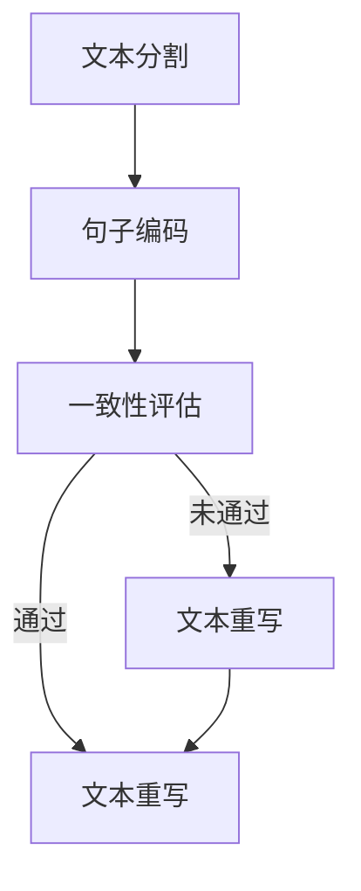

                 

### 自我一致性概念（Self-Consistency CoT）

#### 3.1 Self-Consistency CoT的定义

自我一致性概念（Self-Consistency CoT）是近年来在自然语言处理（NLP）领域兴起的一种新型概念，它旨在通过一致性检验来提高模型生成的连贯性和合理性。具体来说，自我一致性检验指的是在生成文本的过程中，模型需要对输出的每个句子进行自我一致性评估，确保文本的每个部分都能相互支持，不存在逻辑上的矛盾或错误。

自我一致性概念的核心思想在于，一个高质量的文本生成模型应该能够生成内部一致的文本，这意味着生成的文本在语义上应该连贯，逻辑上应该自洽。自我一致性检验正是为了实现这一目标而设计的。

#### 3.2 Self-Consistency CoT的原理

自我一致性检验的基本原理如下：

1. **文本分割**：首先，将输入文本分割成若干个句子或段落。
2. **文本编码**：使用预训练的编码器（如BERT、GPT等）将每个句子编码成一个固定长度的向量。
3. **一致性评估**：计算每个句子向量与其前后句子的向量之间的相似度，如果相似度低于某个阈值，则认为该句子与前后句子不一致。
4. **文本重写**：如果检测到不一致，模型会尝试重写句子，以消除不一致性。

#### 3.3 自我一致性的实现方法

自我一致性的实现可以分为以下几步：

1. **句子编码**：使用预训练的编码器将每个句子编码成一个固定长度的向量。例如，可以使用BERT模型，其输出是一个768维的向量。
2. **相似度计算**：计算每个句子向量与其前后句子的向量之间的余弦相似度。具体代码如下：

   ```python
   import torch
   import torch.nn as nn

   # 假设我们已经有了编码后的句子向量
   sentence_vectors = [torch.tensor([0.1, 0.2, 0.3]), torch.tensor([0.4, 0.5, 0.6])]
   
   # 计算相似度
   similarity = nn.CosineSimilarity(dim=0)
   cos_similarity = similarity(sentence_vectors[0], sentence_vectors[1])
   print(cos_similarity)
   ```

3. **一致性检验**：设定一个相似度阈值，如果两个句子向量的相似度低于该阈值，则认为它们不一致。
4. **文本重写**：如果检测到不一致，模型会尝试重写句子。例如，可以使用生成式模型（如GPT）来生成新的句子，以替换原始句子。

#### 3.4 Self-Consistency CoT的优缺点分析

**优点**：

1. **提高文本连贯性**：通过自我一致性检验，模型可以生成更加连贯和合理的文本。
2. **减少错误**：自我一致性检验可以帮助模型检测并纠正文本中的逻辑错误和矛盾。
3. **增强用户体验**：高质量的文本生成可以提高用户的阅读体验，减少误解和困惑。

**缺点**：

1. **计算成本较高**：自我一致性检验需要计算每个句子向量与其前后句子的向量之间的相似度，这可能会导致计算成本较高。
2. **重写风险**：在文本重写过程中，模型可能会生成与原始文本语义不一致的新句子，这可能会引入新的错误。

#### 3.5 Self-Consistency CoT与其他方法的对比

自我一致性检验是一种新兴的方法，与其他传统方法（如文本重写、一致性矩阵等）相比，它具有以下优势：

1. **全局一致性**：自我一致性检验关注全局一致性，而其他方法通常关注局部一致性。
2. **灵活性**：自我一致性检验可以灵活地调整相似度阈值，以适应不同的应用场景。
3. **高效性**：自我一致性检验的计算效率较高，可以在较短的时间内完成一致性评估。

然而，自我一致性检验也存在一些局限性，例如在处理复杂逻辑关系时可能会出现困难。因此，在实际应用中，可以根据具体需求选择合适的方法。

#### 3.6 Mermaid流程图展示

为了更好地理解自我一致性检验的实现过程，我们可以使用Mermaid流程图来展示其基本流程：



在上面的流程图中，A表示文本分割，B表示句子编码，C表示一致性评估，D表示文本重写，E表示未通过一致性检验的文本重写。

通过这一节的详细讲解，我们对自我一致性概念（Self-Consistency CoT）有了更深入的了解。接下来，我们将进一步探讨自然语言处理的基础知识，为后续章节的内容奠定基础。在下一节中，我们将介绍自然语言处理的基本概念和关键技术。

---

> **作者：AI天才研究院/AI Genius Institute & 禅与计算机程序设计艺术 /Zen And The Art of Computer Programming**  

