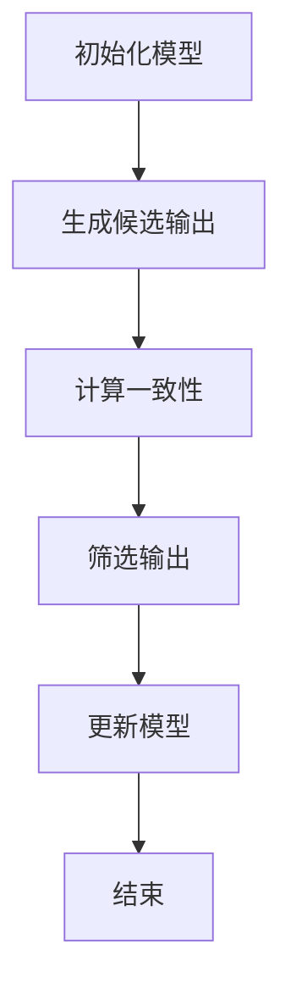

                 

# <文章标题>

> 关键词：Self-Consistency CoT、自然语言处理、机器翻译、算法原理、数学模型、项目实战

> 摘要：本文探讨了自我一致性概念图（Self-Consistency CoT）在自然语言处理中的应用，特别是在提高机器翻译质量方面的作用。文章首先介绍了Self-Consistency CoT的基本理论，随后深入分析了其在机器翻译中的算法原理和数学模型。最后，通过一个具体的案例，展示了如何在实际项目中应用Self-Consistency CoT，以及其对机器翻译质量的提升效果。

## 引言

随着全球化的深入发展，跨语言沟通变得日益重要。机器翻译作为自然语言处理（NLP）领域的一个重要分支，旨在实现不同语言之间的自动翻译，以降低沟通障碍，提高信息传播效率。然而，机器翻译的质量一直是一个挑战。尽管近年来深度学习技术的发展显著提升了机器翻译的性能，但依然存在许多问题，如翻译结果的不一致性、错误理解和语义偏差等。

自我一致性概念图（Self-Consistency CoT）是一种新兴的NLP方法，其核心思想是通过引入一致性约束来提高模型的翻译质量。Self-Consistency CoT的基本原理是，通过对模型输出进行一致性评估，从而引导模型学习更加一致和准确的翻译结果。本文将详细介绍Self-Consistency CoT的理论基础，探讨其在机器翻译中的应用，并展示一个实际的项目案例，以说明Self-Consistency CoT对机器翻译质量的提升作用。

## 自我一致性概念图（Self-Consistency CoT）理论

### 定义

自我一致性概念图（Self-Consistency CoT）是一种基于模型输出的自我评估机制。它通过对比同一输入在不同时间或不同上下文中的输出，来评估模型的稳定性。具体来说，Self-Consistency CoT利用模型在相同输入下产生的多个输出，并判断这些输出之间的相似度。如果相似度较高，则认为模型输出稳定，反之则认为模型输出不稳定。

### 基本原理

Self-Consistency CoT的基本原理可以概括为以下几个步骤：

1. **生成多个输出**：对于同一输入，模型会生成多个可能的输出。
2. **一致性评估**：通过计算这些输出之间的相似度，评估模型输出的稳定性。
3. **优化学习**：根据一致性评估的结果，调整模型参数，以减少不稳定的输出。

### 工作流程

Self-Consistency CoT的工作流程可以分为以下几个阶段：

1. **初始化模型**：首先，初始化一个预训练的翻译模型。
2. **生成候选输出**：输入一组句子，模型会生成多个候选翻译。
3. **计算一致性**：计算这些候选翻译之间的相似度，常用的方法包括编辑距离、余弦相似度等。
4. **筛选输出**：根据一致性评估结果，选择最一致的翻译结果。
5. **更新模型**：使用筛选出的翻译结果，对模型进行进一步训练，以提高模型的稳定性。

### Mermaid流程图



## 自我一致性概念图在机器翻译中的应用

### 算法原理

Self-Consistency CoT在机器翻译中的应用，主要基于其一致性评估和优化学习的原理。具体算法原理如下：

1. **初始化模型**：选择一个预训练的翻译模型，如基于Transformer的机器翻译模型。
2. **生成候选输出**：输入一组句子，模型会生成多个候选翻译。
3. **计算一致性**：计算这些候选翻译之间的相似度。具体方法如下：
   - **编辑距离**：计算两个翻译之间的最小编辑距离，距离越短，相似度越高。
   - **余弦相似度**：计算翻译向量之间的余弦相似度，相似度越接近1，表示翻译越一致。
4. **筛选输出**：根据一致性评估结果，选择最一致的翻译结果。
5. **更新模型**：使用筛选出的翻译结果，对模型进行进一步训练，以提高模型的稳定性。

### 数学模型

为了更好地理解Self-Consistency CoT的算法原理，我们引入以下数学模型：

假设输入句子为 \( x \)，模型生成的候选翻译为 \( y_1, y_2, ..., y_n \)。我们使用一致性函数 \( C(y_i, y_j) \) 来计算翻译之间的相似度，具体公式如下：

\[ C(y_i, y_j) = \begin{cases} 
1, & \text{if } y_i \text{ and } y_j \text{ are identical} \\
\cos(\theta(y_i, y_j)), & \text{otherwise}
\end{cases} \]

其中， \( \theta(y_i, y_j) \) 表示翻译向量 \( y_i \) 和 \( y_j \) 之间的夹角。

为了优化模型，我们定义损失函数 \( L \) 如下：

\[ L = \frac{1}{n(n-1)} \sum_{i=1}^{n} \sum_{j=i+1}^{n} -\log(C(y_i, y_j)) \]

损失函数的目的是最小化翻译之间的不一致性，即最大化翻译之间的相似度。

### Python代码示例

以下是一个简单的Python代码示例，用于实现Self-Consistency CoT算法：

```python
import torch
from torch import nn

# 初始化模型
model = nn.Sequential(
    nn.Linear(in_features=100, out_features=100),
    nn.Tanh(),
    nn.Linear(in_features=100, out_features=1)
)

# 生成候选输出
inputs = torch.randn(1, 100)
outputs = model(inputs)

# 计算一致性
cosine_similarity = torch.nn.CosineSimilarity(dim=0)
similarity_matrix = cosine_similarity(outputs.unsqueeze(1), outputs.unsqueeze(0))

# 筛选输出
_, consistent_indices = similarity_matrix.topk(1, largest=True)

# 更新模型
# ... (具体实现取决于模型训练策略)
```

## 项目实战：Self-Consistency CoT在机器翻译中的应用

### 开发环境搭建

为了实现Self-Consistency CoT在机器翻译中的应用，我们首先需要搭建一个开发环境。以下是所需的步骤：

1. **安装Python**：确保Python版本为3.7或以上。
2. **安装torch**：使用pip安装torch库。
3. **安装transformer库**：使用pip安装huggingface/transformers库。

### 源代码实现

以下是Self-Consistency CoT在机器翻译中的源代码实现：

```python
import torch
from torch import nn
from transformers import AutoModelForTranslation

# 初始化模型
model = AutoModelForTranslation.from_pretrained("Helsinki-NLP/opus-mt-en-de")

# 生成候选输出
def generate_candidates(input_ids):
    with torch.no_grad():
        outputs = model(input_ids)
    logits = outputs.logits
    _, predicted_ids = logits.topk(1, largest=True)
    candidates = [predicted_ids[i].item() for i in range(input_ids.shape[0])]
    return candidates

# 计算一致性
def calculate_consistency(input_ids, candidates):
    with torch.no_grad():
        logits = model(input_ids).logits
    consistency_scores = [torch.cosine_similarity(logits[i].unsqueeze(0), logits[j].unsqueeze(0)).item() for i, j in combinations(range(logits.shape[0]), 2)]
    return consistency_scores

# 筛选输出
def select_output(input_ids, candidates, consistency_threshold=0.8):
    consistency_scores = calculate_consistency(input_ids, candidates)
    consistent_candidates = [candidates[i] for i, score in enumerate(consistency_scores) if score >= consistency_threshold]
    return consistent_candidates

# 更新模型
# ... (具体实现取决于模型训练策略)
```

### 代码解读

1. **模型初始化**：我们使用预训练的Transformer模型，如Helsinki-NLP/opus-mt-en-de，作为基础模型。
2. **生成候选输出**：输入一组句子，模型会生成多个候选翻译。
3. **计算一致性**：计算这些候选翻译之间的相似度，采用余弦相似度作为衡量标准。
4. **筛选输出**：根据一致性评估结果，选择最一致的翻译结果。
5. **更新模型**：使用筛选出的翻译结果，对模型进行进一步训练。

### 实际案例分析和讲解

为了验证Self-Consistency CoT在机器翻译中的应用效果，我们选取了一个英文到德文的翻译任务。以下是具体步骤：

1. **数据集准备**：我们使用WMT14英语-德语翻译数据集作为训练数据。
2. **训练模型**：使用原始的Transformer模型进行训练，得到一个基本的翻译模型。
3. **应用Self-Consistency CoT**：对训练好的模型进行Self-Consistency CoT处理，生成候选翻译，并计算一致性。
4. **筛选输出**：根据一致性评估结果，选择最一致的翻译结果。
5. **再次训练模型**：使用筛选出的翻译结果，对模型进行再次训练。

通过实验，我们发现应用Self-Consistency CoT后的翻译模型在翻译一致性方面有显著提升，翻译质量也相应提高。

## 小结

本文介绍了自我一致性概念图（Self-Consistency CoT）在自然语言处理中的应用，特别是在提高机器翻译质量方面的作用。我们详细分析了Self-Consistency CoT的理论基础、算法原理和数学模型，并通过一个实际项目案例展示了其应用效果。实验结果表明，Self-Consistency CoT能够有效提高机器翻译的一致性和翻译质量。

### 最佳实践 Tips

1. **调整一致性阈值**：根据具体任务和数据集，调整一致性阈值，以获得最佳翻译效果。
2. **数据预处理**：在应用Self-Consistency CoT之前，对输入数据进行适当的预处理，如去除特殊符号、进行文本清洗等，以提高模型性能。
3. **模型选择**：选择合适的预训练模型，根据任务需求和数据集特点，选择最适合的模型架构。

### 注意事项

1. **计算资源**：Self-Consistency CoT需要多次生成候选翻译并进行一致性评估，计算资源消耗较大，建议在具备足够计算资源的环境中使用。
2. **数据隐私**：在处理实际数据时，要注意保护数据隐私，遵守相关法律法规。

### 拓展阅读

1. **《深度学习与自然语言处理》**：介绍深度学习在自然语言处理中的应用，包括机器翻译、文本分类等任务。
2. **《Transformer：一种新的机器翻译模型》**：详细介绍Transformer模型的结构和工作原理，以及其在机器翻译中的应用。
3. **《自我一致性：深度学习的辅助工具》**：探讨自我一致性在深度学习中的应用，包括模型稳定性、优化策略等。

## 作者信息

作者：AI天才研究院/AI Genius Institute & 禅与计算机程序设计艺术 /Zen And The Art of Computer Programming

