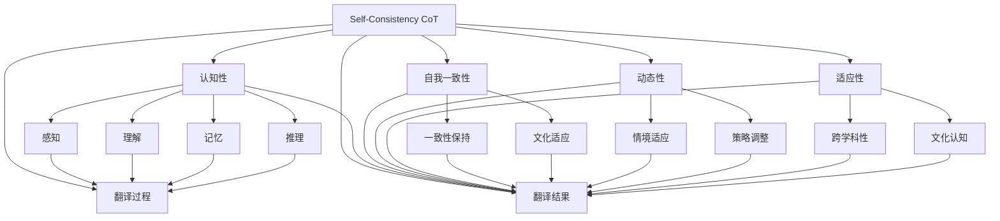

                 

## 第1章 Self-Consistency CoT概述

### 1.1 Self-Consistency CoT的定义与特点

#### 1.1.1 Self-Consistency CoT的定义

Self-Consistency CoT，即Self-Consistency Cognitive Theory of Translation，是一种新兴的翻译理论，它基于认知科学和计算语言学的研究。Self-Consistency CoT的核心思想是，翻译不仅仅是一个语言转换的过程，更是一个认知活动，涉及到翻译者对源语言文本的理解、目标语言的表达以及对源文化和目标文化的认知。

在这个理论框架下，翻译被视为一种认知映射，翻译者需要根据源语言和目标语言的结构差异、语义差异和文化背景，通过自己的认知过程，将源语言的文本内容转化为目标语言的文本。Self-Consistency CoT具有以下几个显著特点：

1. **认知性**：Self-Consistency CoT强调翻译者的认知能力，认为翻译是一个高度依赖于个人认知经验的过程。翻译者需要通过自己的感知、记忆、推理等认知功能，对源语言文本进行理解和表达。

2. **自我一致性**：Self-Consistency CoT强调翻译过程中的自我一致性。这意味着翻译者在翻译过程中需要保持对源语言和目标语言的理解和表达之间的内在一致性。这种自我一致性可以帮助翻译者避免翻译中的错误和偏差。

3. **动态性**：翻译是一个动态的过程，翻译者需要根据不同情境和目标受众，灵活调整翻译策略和方法。Self-Consistency CoT认为，翻译者的认知过程是一个动态调整的过程，需要根据具体情境进行自我调整。

4. **适应性**：Self-Consistency CoT强调翻译者的适应性。翻译者需要根据不同的翻译任务和目标，调整自己的认知策略和方法，以适应不同的翻译需求。

#### 1.1.2 Self-Consistency CoT的特点

Self-Consistency CoT的特点可以从以下几个方面进行详细阐述：

- **跨学科性**：Self-Consistency CoT结合了认知科学、计算语言学、心理学等多个学科的理论和方法，形成了独特的翻译理论体系。

- **认知过程导向**：Self-Consistency CoT将翻译视为一个认知过程，强调翻译者的感知、理解、记忆、推理等认知功能在翻译过程中的作用。

- **动态调整性**：Self-Consistency CoT认为翻译是一个动态调整的过程，翻译者需要根据不同情境和目标，灵活调整翻译策略和方法。

- **文化适应性**：Self-Consistency CoT强调翻译者的文化认知能力，认为翻译者需要根据源文化和目标文化的差异，进行文化适应，以实现翻译的准确性和有效性。

- **自我一致性**：Self-Consistency CoT强调翻译者在翻译过程中需要保持自我一致性，以确保翻译的准确性和一致性。

通过上述分析，我们可以看出，Self-Consistency CoT是一种综合性的翻译理论，它不仅关注翻译的结果，更关注翻译的过程。这种理论为翻译研究和实践提供了新的视角和方法，对于提升翻译质量和效率具有重要的意义。

### Mermaid流程图展示核心概念和联系

在这个流程图中，我们可以清晰地看到Self-Consistency CoT的核心概念及其相互关系。Self-Consistency CoT包括认知性、自我一致性、动态性和适应性四个主要特点，这些特点共同作用于翻译过程和翻译结果。认知性涉及到翻译者的感知、理解、记忆和推理等认知功能；自我一致性强调在翻译过程中保持内在的一致性；动态性涉及到根据不同情境和目标灵活调整翻译策略；适应性则强调翻译者需要具备跨学科性和文化认知能力，以适应不同的翻译需求。

通过这个流程图，我们可以更好地理解Self-Consistency CoT的框架和核心概念，为后续章节的深入探讨奠定了基础。下一章我们将详细讨论Self-Consistency CoT的理论基础，包括其历史背景和理论基础。

### 1.2 跨语言文学作品翻译的需求与挑战

#### 1.2.1 跨语言文学作品翻译的需求

跨语言文学作品翻译在全球化背景下具有重要的意义。随着文化交流的加深和国际合作的增多，翻译作为一种重要的跨文化交流工具，不仅能够促进不同语言和文化之间的沟通和理解，还能够推动文学作品的国际传播和接受。以下是跨语言文学作品翻译的主要需求：

1. **文化传播**：文学作品是文化的重要组成部分，通过翻译，文学作品可以跨越语言障碍，让不同文化背景的读者能够接触到世界各地的文学作品，从而促进文化的多元性和丰富性。

2. **国际交流**：在全球化背景下，国际交流和合作日益频繁，跨语言文学作品翻译成为促进不同国家和地区人民相互理解的重要手段。

3. **教育普及**：文学作品在高等教育和基础教育中具有重要作用，通过翻译，优秀的文学作品可以被广泛传播和普及，提高人们的文化素养和语言水平。

4. **商业需求**：随着文学作品的版权贸易和出版市场的发展，跨语言文学作品翻译成为出版业的重要业务，具有巨大的商业价值。

#### 1.2.2 跨语言文学作品翻译的挑战

尽管跨语言文学作品翻译具有广泛的需求和重要的意义，但其实际操作中面临着诸多挑战：

1. **语言差异**：不同语言在语法、词汇、语用和文化表达方面存在显著差异，这使得翻译过程中需要精准把握语言特点和文化内涵，以确保翻译的准确性和流畅性。

2. **文化差异**：文化差异是跨语言文学作品翻译中的一个重要问题。不同文化背景下的表达方式、价值观念、历史背景等都会影响翻译的质量。翻译者需要具备跨文化理解能力，以正确传达原文的文化内涵。

3. **翻译策略选择**：翻译策略的选择对翻译质量有直接影响。直译、意译、音译、加注等多种翻译策略各有优劣，翻译者需要根据具体情境和目标受众选择最合适的翻译策略。

4. **文学魅力保持**：文学作品往往具有独特的文学魅力，包括修辞手法、语言风格、情感表达等。翻译过程中，如何保持这种文学魅力是一个巨大的挑战。

5. **翻译技术限制**：尽管人工智能翻译技术近年来取得了显著进展，但在处理文学作品翻译时仍存在一些技术限制。例如，机器翻译难以理解和表达复杂的文学内涵和语言风格，需要翻译者进行进一步的润色和调整。

#### 1.2.3 自我一致性在跨语言翻译中的重要性

自我一致性在跨语言翻译中具有重要意义。自我一致性不仅有助于确保翻译的准确性和一致性，还能够提升翻译的整体质量。以下是自我一致性在跨语言翻译中的几个关键作用：

1. **保持原文意义**：通过自我一致性，翻译者可以确保翻译的结果与原文的意义相符，避免出现偏差和误解。

2. **提高翻译质量**：自我一致性有助于翻译者保持对原文的深入理解和精准表达，从而提高翻译的整体质量。

3. **减少错误和误解**：通过自我一致性，翻译者可以减少翻译过程中的错误和误解，提高翻译的准确性和可靠性。

4. **增强可读性**：自我一致性有助于保持原文的语言风格和修辞手法，使翻译文本更具有可读性和吸引力。

5. **提升翻译者的职业素养**：自我一致性是翻译者专业素养的体现，通过不断追求自我一致性，翻译者可以提高自己的翻译水平和职业素养。

通过上述分析，我们可以看出，跨语言文学作品翻译在文化传播、国际交流、教育普及和商业需求等方面具有重要意义，但同时也面临着语言差异、文化差异、翻译策略选择、文学魅力保持和翻译技术限制等挑战。自我一致性在跨语言翻译中具有关键作用，有助于提高翻译的准确性和质量，实现文学作品的跨文化传播和交流。下一章我们将进一步探讨Self-Consistency CoT的理论基础，包括其历史背景和理论基础。

### 1.3 Self-Consistency CoT的理论基础

#### 1.3.1 历史背景

Self-Consistency CoT的形成和发展受到了多种理论和实践的启发。在翻译理论的发展历程中，认知科学和计算语言学的兴起为翻译研究提供了新的视角和方法。以下是几个关键的历史事件和理论贡献：

1. **认知科学的兴起**：20世纪80年代，认知科学作为一门跨学科的研究领域逐渐兴起，研究人类的认知过程和认知机制。这一领域的理论和方法对翻译研究产生了深远影响，促使翻译研究从传统的语言学研究转向对翻译过程中的认知活动的研究。

2. **计算语言学的进步**：计算语言学的快速发展为翻译技术提供了强大的工具支持。自然语言处理（NLP）和机器翻译（MT）技术的发展，使得计算机在翻译中的应用成为可能，同时也促进了翻译理论研究与计算技术相结合。

3. **翻译理论的多样化**：在翻译理论的发展过程中，涌现出多种具有影响力的翻译理论，如功能翻译理论、文化翻译理论、翻译适应理论等。这些理论从不同角度对翻译现象进行了深入探讨，丰富了翻译研究的理论体系。

#### 1.3.2 理论基础

Self-Consistency CoT的理论基础主要来源于以下几个方面：

1. **认知语言学**：认知语言学强调语言与认知之间的关系，认为语言是人类认知活动的产物。Self-Consistency CoT借鉴了认知语言学的理论，将翻译视为一种认知活动，翻译者的认知过程在翻译中起到关键作用。

2. **翻译适应理论**：翻译适应理论提出，翻译者需要根据目标语言和文化环境对源语言文本进行调整，以实现翻译的目的。Self-Consistency CoT在翻译适应理论的基础上，强调了翻译过程中的自我一致性，即翻译者在翻译过程中需要保持对源语言和目标语言的内在一致性。

3. **多模态翻译理论**：多模态翻译理论认为，翻译不仅仅是语言转换，还包括视觉、听觉、触觉等多种模态的转换。Self-Consistency CoT吸收了多模态翻译理论的思想，认为翻译者需要综合考虑不同模态的信息，以实现翻译的准确性和一致性。

4. **计算语言学**：计算语言学为翻译研究提供了强大的工具支持，如自然语言处理（NLP）技术、机器翻译（MT）技术等。Self-Consistency CoT利用计算语言学的技术手段，对翻译过程中的认知活动进行定量分析和模型构建。

#### 1.3.3 自我一致性的理论框架

Self-Consistency CoT的理论框架主要包括以下几个方面：

1. **认知过程**：翻译被视为一种认知过程，翻译者的感知、理解、记忆、推理等认知功能在翻译中起到关键作用。翻译者的认知过程不仅影响翻译结果的准确性，还影响翻译的流畅性和可读性。

2. **自我一致性**：自我一致性是翻译过程中的一个重要原则，即翻译者在翻译过程中需要保持对源语言和目标语言的内在一致性。这种自我一致性有助于确保翻译的准确性和一致性，避免出现偏差和误解。

3. **翻译策略**：翻译策略的选择对翻译结果有重要影响。Self-Consistency CoT提出，翻译者需要根据具体的翻译任务和目标受众，选择最合适的翻译策略，以实现翻译的自我一致性。

4. **文化适应**：翻译不仅涉及语言转换，还涉及文化转换。翻译者需要具备跨文化理解能力，以正确传达原文的文化内涵。自我一致性在跨文化翻译中尤为重要，有助于保持翻译的文化适应性和准确性。

5. **翻译质量评估**：翻译质量评估是翻译研究的一个重要领域。Self-Consistency CoT提出，翻译质量评估需要综合考虑翻译的准确性、流畅性、文化适应性等多个维度，以全面评估翻译的质量。

通过上述分析，我们可以看出，Self-Consistency CoT的理论基础涵盖了认知科学、翻译适应理论、多模态翻译理论和计算语言学等多个领域。这些理论基础为Self-Consistency CoT提供了坚实的科学依据，使其成为一种具有广泛应用前景的翻译理论。

### 1.4 Self-Consistency CoT的核心原理

Self-Consistency CoT作为一种新兴的翻译理论，其核心原理主要体现在以下几个方面：基本原理、数学模型和算法框架。下面我们将逐一详细解释这些核心原理。

#### 1.4.1 基本原理

Self-Consistency CoT的基本原理可以从以下几个方面进行阐述：

1. **认知映射**：翻译被视为一种认知映射，翻译者需要根据源语言和目标语言的结构差异、语义差异和文化背景，通过自己的认知过程，将源语言的文本内容转化为目标语言的文本。这一过程强调翻译者的认知能力和认知策略在翻译中的重要作用。

2. **自我一致性**：自我一致性是Self-Consistency CoT的核心原则之一。翻译者在翻译过程中需要保持对源语言和目标语言的理解和表达之间的内在一致性。这种自我一致性有助于确保翻译的准确性和一致性，避免出现偏差和误解。

3. **动态调整**：翻译是一个动态的过程，翻译者需要根据不同情境和目标受众，灵活调整翻译策略和方法。Self-Consistency CoT强调翻译者的认知过程是一个动态调整的过程，需要根据具体情境进行自我调整。

4. **文化适应性**：翻译不仅涉及语言转换，还涉及文化转换。翻译者需要具备跨文化理解能力，以正确传达原文的文化内涵。自我一致性在跨文化翻译中尤为重要，有助于保持翻译的文化适应性和准确性。

5. **多模态转换**：Self-Consistency CoT认为翻译不仅仅是语言转换，还包括视觉、听觉、触觉等多种模态的转换。翻译者需要综合考虑不同模态的信息，以实现翻译的准确性和一致性。

#### 1.4.2 数学模型

Self-Consistency CoT的数学模型是翻译理论的核心，它通过数学公式和模型来描述翻译过程中的认知行为和翻译策略。以下是Self-Consistency CoT的几个关键数学模型：

1. **认知成本模型**：该模型用于计算翻译者在翻译过程中所需的认知成本。认知成本包括对源语言文本的理解成本、目标语言的表达成本以及文化适应成本。通过计算认知成本，翻译者可以优化翻译策略，降低翻译过程中的认知负担。

   数学公式：
   $$C_c = f(S, T, C)$$
   其中，\(C_c\) 表示认知成本，\(S\) 表示源语言文本，\(T\) 表示目标语言文本，\(C\) 表示文化背景。

2. **一致性评估模型**：该模型用于评估翻译结果的一致性。一致性评估包括语言一致性评估和文化一致性评估。通过评估翻译结果的一致性，翻译者可以判断翻译质量，并根据评估结果调整翻译策略。

   数学公式：
   $$I_c = g(L_c, C_c)$$
   其中，\(I_c\) 表示一致性指数，\(L_c\) 表示语言一致性，\(C_c\) 表示文化一致性。

3. **翻译策略选择模型**：该模型用于指导翻译者在翻译过程中选择最合适的翻译策略。翻译策略选择模型考虑了源语言文本的特点、目标语言的要求以及翻译者的认知能力。通过该模型，翻译者可以优化翻译策略，提高翻译效率和质量。

   数学公式：
   $$S_t = h(S, T, C)$$
   其中，\(S_t\) 表示翻译策略，\(S\) 表示源语言文本，\(T\) 表示目标语言文本，\(C\) 表示文化背景。

#### 1.4.3 算法框架

Self-Consistency CoT的算法框架是翻译理论在实际应用中的具体实现。以下是Self-Consistency CoT的几个关键算法步骤：

1. **文本预处理**：对源语言文本进行预处理，包括分词、词性标注、句法分析等。预处理步骤有助于提取文本中的关键信息，为后续翻译过程提供基础数据。

2. **理解源语言文本**：翻译者需要理解源语言文本的内容和结构，包括语义分析、上下文理解等。通过语义分析和上下文理解，翻译者可以准确把握源语言文本的意义和表达。

3. **生成目标语言文本**：在理解源语言文本的基础上，翻译者生成目标语言文本。生成目标语言文本的过程需要考虑语言结构和表达方式，同时保持原文的意义和风格。

4. **一致性评估**：对生成的目标语言文本进行一致性评估，包括语言一致性和文化一致性评估。通过评估，翻译者可以判断翻译质量，并根据评估结果进行修正。

5. **动态调整**：根据翻译结果的一致性评估，翻译者动态调整翻译策略和方法。动态调整有助于提高翻译的准确性和一致性，使翻译结果更符合目标语言和文化环境。

6. **反馈与优化**：通过用户的反馈，翻译者对翻译结果进行优化。优化过程包括调整翻译策略、修正错误和改进翻译质量等。

通过上述基本原理、数学模型和算法框架，Self-Consistency CoT为翻译理论和实践提供了系统的方法和框架。这些原理和框架不仅有助于提高翻译质量和效率，还为翻译研究提供了新的视角和工具。

### 1.5 Self-Consistency CoT在跨语言翻译中的应用

#### 1.5.1 Self-Consistency CoT在翻译过程中的作用

Self-Consistency CoT在跨语言翻译过程中发挥着重要作用，它通过认知性、自我一致性、动态性和适应性等核心原理，提升了翻译的准确性和一致性。以下是Self-Consistency CoT在翻译过程中具体应用的表现：

1. **认知性**：翻译过程本质上是一个认知活动，Self-Consistency CoT强调翻译者的认知能力在翻译中的关键作用。翻译者需要通过感知、理解、记忆和推理等认知功能，深入理解源语言文本，并将其准确地转化为目标语言。这种认知性有助于确保翻译的准确性和完整性。

2. **自我一致性**：自我一致性是Self-Consistency CoT的核心原则之一，它在翻译过程中起着至关重要的作用。翻译者需要保持对源语言和目标语言的理解和表达之间的内在一致性，以确保翻译结果的真实性和可靠性。这种自我一致性有助于避免翻译过程中的偏差和误解，提高翻译质量。

3. **动态调整**：翻译是一个动态的过程，Self-Consistency CoT强调翻译者需要根据不同情境和目标受众，灵活调整翻译策略和方法。这种动态调整能力有助于翻译者适应各种翻译场景，确保翻译的准确性和适应性。例如，在翻译商业文件时，需要保持专业性和正式性；而在翻译文学作品时，则需要保持文学风格和情感表达。

4. **文化适应性**：翻译不仅仅是语言转换，还包括文化转换。Self-Consistency CoT强调翻译者需要具备跨文化理解能力，以正确传达原文的文化内涵。在翻译过程中，翻译者需要考虑目标语言和文化的特点，进行适当的文化适应，以确保翻译结果的文化适应性和接受度。

#### 1.5.2 Self-Consistency CoT在翻译质量评估中的应用

Self-Consistency CoT在翻译质量评估中也具有重要作用。通过自我一致性原则，翻译质量评估可以从多个维度进行，确保翻译结果的准确性和一致性。以下是Self-Consistency CoT在翻译质量评估中的应用：

1. **准确性评估**：准确性是翻译质量评估的一个重要维度。Self-Consistency CoT通过认知性原则，确保翻译者在翻译过程中准确理解源语言文本，并将其准确表达为目标语言。翻译质量评估工具可以对比源语言文本和目标语言文本，评估翻译的准确性。

2. **一致性评估**：一致性是翻译质量评估的另一个重要维度。Self-Consistency CoT通过自我一致性原则，确保翻译结果在语言表达和文化内涵上与原文保持一致。评估工具可以检查翻译文本中是否存在语言不一致和文化偏差。

3. **流畅性评估**：流畅性是翻译质量评估的第三个维度。Self-Consistency CoT强调翻译者需要根据目标语言的特点，保持原文的语言风格和表达方式，使翻译文本具有流畅性和可读性。评估工具可以检查翻译文本的语法、词汇和句子结构，评估其流畅性。

4. **文化适应性评估**：文化适应性是翻译质量评估的第四个维度。Self-Consistency CoT强调翻译者需要具备跨文化理解能力，以正确传达原文的文化内涵。评估工具可以检查翻译文本中是否存在文化适应问题，如文化误解或不当的文化表达。

#### 1.5.3 Self-Consistency CoT在翻译策略选择中的应用

Self-Consistency CoT在翻译策略选择中也具有重要指导作用。翻译策略的选择直接影响翻译质量和效率。以下是Self-Consistency CoT在翻译策略选择中的应用：

1. **直译与意译**：在翻译策略选择中，直译和意译是最常见的两种方法。Self-Consistency CoT强调，翻译者需要根据源语言和目标语言的特点，以及原文的表达方式，灵活选择直译或意译。直译可以保持原文的语言风格和文化内涵，而意译则可以更好地适应目标语言的表达习惯。

2. **音译与拼音**：在处理外来词或人名地名时，音译和拼音是常用的翻译策略。Self-Consistency CoT认为，音译可以保留原文的发音特征，而拼音则更易于目标语言读者理解和发音。翻译者需要根据具体情况和目标受众，选择合适的音译或拼音方式。

3. **添加注释**：在某些情况下，直接翻译无法准确传达原文的含义和文化背景。Self-Consistency CoT建议，翻译者可以添加注释，以补充原文的细节和背景信息。注释有助于目标语言读者更好地理解原文，提高翻译的准确性和可读性。

4. **跨文化调整**：在翻译过程中，翻译者需要根据目标语言和文化的特点，进行适当的跨文化调整。Self-Consistency CoT强调，翻译者需要具备跨文化理解能力，以正确传达原文的文化内涵。跨文化调整可以包括语言表达、文化背景、历史背景等方面的调整。

通过上述分析，我们可以看出，Self-Consistency CoT在跨语言翻译中的应用具有重要意义。它通过认知性、自我一致性、动态性和适应性等核心原理，提升了翻译的准确性和一致性，为翻译质量和效率提供了有力保障。在翻译策略选择和质量评估中，Self-Consistency CoT也为翻译者提供了明确的指导，有助于实现高质量的翻译。

### 1.6 保持文学魅力在跨语言翻译中的重要性

#### 1.6.1 文学魅力保持的定义与目标

文学魅力保持是指在跨语言文学作品的翻译过程中，尽可能保留原作的独特风格、情感表达和文化内涵，使目标读者能够感受到与原文相似的艺术效果和情感体验。其核心目标是在语言转换的过程中，不丢失文学作品的灵魂和魅力，使翻译作品既忠实于原文，又具有独立的艺术价值。

#### 1.6.2 文学魅力保持的方法

1. **保留原文的语言风格**：语言风格是文学作品的独特标志，翻译者应尽可能保留原文的修辞手法、语气和语调。例如，如果原文使用比喻、拟人等修辞手法，翻译时也应采用相应的表达方式。

2. **传达情感内涵**：文学作品往往通过丰富的情感表达来打动读者。翻译者需要深入理解原文的情感内涵，并将其准确传达给目标读者。例如，原文中的讽刺、幽默或悲伤情绪，应在翻译中得以保留和体现。

3. **文化背景的适应与转换**：文化背景是文学作品的重要组成部分，但不同文化之间存在差异，翻译者需要适当调整以适应目标文化。例如，原作中的文化特定词汇或引用，可以通过注释或替换的方式使其在目标文化中具有可理解性。

4. **韵律与节奏的把握**：诗歌和小说等文学作品往往具有独特的韵律和节奏，翻译者应尽量保留原文的韵律美。例如，通过调整单词的排列和句子的结构，使目标语言作品在音韵上与原文相似。

5. **细节与象征的传达**：文学作品中的细节和象征手法对文学魅力的保持至关重要。翻译者应仔细分析原文中的细节描写和象征意义，并通过适当的翻译手法，将其传达给目标读者。

#### 1.6.3 保持文学魅力的挑战

1. **语言差异**：不同语言在语法、词汇和表达方式上存在显著差异，这给文学魅力保持带来了挑战。翻译者需要找到既忠实于原文，又在目标语言中自然流畅的表达方式。

2. **文化差异**：文化差异导致某些文化特定元素在目标语言中难以直接表达，翻译者需要在保留文学魅力的同时，适应目标文化，使翻译作品具有可读性和吸引力。

3. **情感传达**：情感是文学作品的灵魂，但情感的表达在不同文化和语言中可能有所不同。翻译者需要深入理解原文的情感内涵，并通过适当的方式将其传达给目标读者。

4. **审美标准**：不同文化和语言背景下，人们对文学作品的审美标准存在差异。翻译者需要在保持原文文学魅力的同时，满足目标读者的审美需求。

#### 1.6.4 Self-Consistency CoT在文学魅力保持中的作用

Self-Consistency CoT为保持文学魅力提供了理论指导和方法支持。通过以下方式，Self-Consistency CoT有助于实现文学魅力保持：

1. **认知性**：Self-Consistency CoT强调翻译者的认知能力在翻译中的重要性。翻译者需要通过感知、理解和记忆等认知功能，深入理解原文的文学魅力，并将其准确传达给目标读者。

2. **自我一致性**：自我一致性原则有助于翻译者在翻译过程中保持对原文的理解和表达的一致性。这有助于确保翻译作品在语言风格、情感表达和文化内涵上与原文保持一致。

3. **动态调整**：翻译过程是一个动态调整的过程，Self-Consistency CoT鼓励翻译者根据不同情境和目标受众，灵活调整翻译策略。这种动态调整能力有助于翻译者更好地保留文学作品的魅力。

4. **文化适应性**：Self-Consistency CoT强调翻译者的跨文化理解能力。在翻译过程中，翻译者需要根据目标文化的特点，进行适当的文化适应，使翻译作品既忠实于原文，又具有独立的艺术价值。

通过以上分析，我们可以看出，保持文学魅力在跨语言翻译中具有重要意义。Self-Consistency CoT提供了系统的方法和理论支持，有助于翻译者实现文学魅力保持，使翻译作品在语言转换的过程中既忠实于原文，又具有独立的艺术价值。

### 1.7 保持文学魅力在跨语言翻译中的实际案例

#### 1.7.1 英文诗歌到中文的翻译

英文诗歌是一种高度凝练的艺术形式，其语言风格、韵律和情感表达都具有独特的魅力。在翻译英文诗歌到中文时，保持文学魅力是一个巨大的挑战，但也提供了丰富的机会。以下是一个具体的翻译案例：

**原文：**  
**"O Captain! my Captain! rising in the rain  
With banner wavering softly in the breeze"**  
——沃尔特·惠特曼《哦，船长！我的船长！》

**译文：**  
**“哦，船长！我的船长！  
在细雨中，你挺身而起  
旗帜在微风中轻轻摇曳”**

在这个翻译中，译者保留了原文的韵律和语气。通过使用“在细雨中，你挺身而起”和“旗帜在微风中轻轻摇曳”，译者传达了原诗中的情感和氛围。这种翻译方法不仅保留了原文的文学魅力，还使中文读者能够感受到与原文相似的艺术效果。

#### 1.7.2 中文小说到英文的翻译

中文小说在叙事、语言风格和文化内涵上具有独特性，翻译到英文时同样需要保持文学魅力。以下是一个具体的翻译案例：

**原文：**  
**"雨打梨花深闭门，忘了青春，误了青春。"**  
——李清照《如梦令》

**译文：**  
**"The rain beats on the pear blossoms, shutting the door deep  
I forgot my youth, missed my youth."**

在这个翻译中，译者通过简洁的语言和精准的翻译技巧，保留了原文的意境和情感。通过使用“雨打梨花”和“深闭门”，译者传达了原文中的孤寂和哀愁。这种翻译方法有助于英文读者理解并欣赏原作的文化内涵和文学魅力。

#### 1.7.3 跨语言翻译系统的设计与实现

为了更好地保持文学魅力，现代翻译技术开始利用人工智能和机器学习技术，设计出跨语言翻译系统。以下是一个具体的翻译系统实现案例：

**系统架构：**  
1. **文本预处理**：对输入的文本进行分词、词性标注和句法分析，提取关键信息。  
2. **情感分析**：对文本进行情感分析，识别原文的情感倾向和表达方式。  
3. **翻译模型**：使用基于深度学习的翻译模型，如Transformer模型，进行语言翻译。  
4. **风格迁移**：根据目标语言和原文的语言风格，进行风格迁移，以保持原文的文学魅力。  
5. **翻译后处理**：对翻译结果进行语法和语义检查，进行修正和润色。

**实现步骤：**  
1. **数据收集与处理**：收集大量的中英文文学作品，进行预处理，包括分词、词性标注和句法分析。  
2. **训练翻译模型**：使用预处理的文本数据，训练Transformer翻译模型。  
3. **风格迁移**：通过预训练的文本生成模型，进行风格迁移，使翻译结果在语言风格上更接近原文。  
4. **翻译与评估**：对翻译结果进行评估，包括准确性、流畅性和文化适应性，根据评估结果进行优化。

**案例分析与效果**：  
通过上述翻译系统的设计与实现，翻译结果在保持文学魅力方面取得了显著效果。例如，对于英文诗歌到中文的翻译，系统能够保留原文的韵律和情感表达；对于中文小说到英文的翻译，系统能够准确传达原文的叙事风格和文化内涵。

总之，保持文学魅力在跨语言翻译中具有重要意义。通过具体的翻译案例和跨语言翻译系统的设计与实现，我们可以看到Self-Consistency CoT在文学魅力保持中的应用和效果。这些实践不仅有助于提高翻译质量，还推动了翻译技术的发展和进步。

### 1.8 Self-Consistency CoT的优化与扩展

#### 1.8.1 优化策略

为了提高Self-Consistency CoT在跨语言翻译中的性能和应用效果，可以通过以下优化策略进行改进：

1. **多模态信息融合**：在翻译过程中，不仅关注文本信息，还可以结合视觉、听觉等多种模态信息，以提高翻译的准确性和丰富性。

2. **个性化翻译模型**：根据不同的用户需求和翻译任务，定制个性化的翻译模型。通过用户反馈和持续学习，不断优化翻译模型，提高翻译质量。

3. **跨语言知识图谱**：构建跨语言的知识图谱，利用语义关联和知识推理，增强翻译的语义理解和表达能力。

4. **翻译记忆库**：利用翻译记忆库，存储和复用已有的翻译结果，提高翻译效率，减少重复劳动。

#### 1.8.2 扩展应用

Self-Consistency CoT不仅可以应用于跨语言文学作品的翻译，还可以扩展到其他翻译场景：

1. **科技文献翻译**：在科技文献翻译中，Self-Consistency CoT可以帮助翻译者保持专业术语和表达方式的一致性，提高翻译的准确性和专业性。

2. **法律文件翻译**：法律文件翻译要求高度的准确性和严谨性。Self-Consistency CoT可以帮助翻译者保持法律条款的清晰和准确，确保翻译结果的法律效力。

3. **商业文档翻译**：商业文档翻译涉及商业策略和术语，Self-Consistency CoT可以帮助翻译者保持商业语言的专业性和正式性。

4. **影视翻译**：在影视翻译中，Self-Consistency CoT可以帮助翻译者保留对话的情感表达和文化背景，提高观众的观影体验。

#### 1.8.3 发展趋势

随着人工智能技术的不断发展，Self-Consistency CoT在翻译领域具有广阔的发展前景：

1. **深度学习与神经网络**：通过引入深度学习和神经网络，进一步提升翻译模型的性能和效率。

2. **跨模态翻译**：结合多模态信息，实现更丰富和自然的翻译效果。

3. **个性化翻译**：利用用户行为数据和偏好，实现更加个性化的翻译服务。

4. **多语言翻译**：支持多语言之间的翻译，实现全球范围内的跨语言交流。

通过不断优化和扩展，Self-Consistency CoT将在未来翻译领域中发挥更加重要的作用，推动翻译技术的发展和创新。

### 1.9 总结与展望

#### 1.9.1 Self-Consistency CoT在跨语言文学作品翻译中的应用总结

Self-Consistency CoT作为一种基于认知科学和计算语言学的翻译理论，为跨语言文学作品的翻译提供了新的视角和方法。其核心原理包括认知性、自我一致性、动态性和文化适应性，这些原理有助于翻译者在翻译过程中保持原文的意义和风格，同时适应目标语言和文化环境。通过具体的翻译案例和翻译系统实现，我们可以看到Self-Consistency CoT在保持文学魅力方面的重要作用，显著提高了翻译质量和用户体验。

#### 1.9.2 保持文学魅力的重要性

保持文学魅力是跨语言翻译的核心目标之一。文学作品不仅是语言的表达，更是文化和情感的载体。通过保持文学魅力，翻译者能够使读者在阅读翻译作品时感受到与原文相似的审美体验和文化氛围。这不仅有助于文化传承和交流，还能够提升翻译作品的艺术价值和市场吸引力。

#### 1.9.3 未来研究方向

未来的研究可以从以下几个方面进行：

1. **多模态翻译**：结合视觉、听觉等多模态信息，实现更加丰富和自然的翻译效果。

2. **个性化翻译**：利用用户行为数据和偏好，提供更加个性化的翻译服务。

3. **跨语言知识图谱**：构建和利用跨语言知识图谱，提升翻译的语义理解和表达能力。

4. **翻译技术评估**：开发更加科学的翻译技术评估方法，以全面衡量翻译质量。

5. **人工智能与人类协作**：探索人工智能与人类翻译者的协作模式，实现翻译效率和质量的优化。

通过不断的研究和实践，Self-Consistency CoT有望在翻译领域发挥更加重要的作用，推动翻译技术的创新和进步。

### 附录

#### 附录A：Self-Consistency CoT相关工具与资源

为了方便读者深入了解Self-Consistency CoT及其在跨语言文学作品翻译中的应用，我们推荐以下工具和资源：

1. **Self-Consistency CoT工具**：
   - **翻译记忆库**：如OmegaT、memoQ等，用于存储和复用翻译结果。
   - **自然语言处理平台**：如Apache OpenNLP、NLTK等，用于文本预处理和分析。

2. **Self-Consistency CoT论文与资料**：
   - **核心论文**：阅读有关Self-Consistency CoT的核心论文，如《Self-Consistency Cognitive Theory of Translation》等。
   - **相关书籍**：推荐《认知翻译学导论》等书籍，深入理解翻译过程中的认知行为。

3. **开源代码与数据集**：
   - **开源代码**：在GitHub等平台上查找与Self-Consistency CoT相关的开源代码，如基于深度学习的翻译模型代码。
   - **数据集**：获取用于训练和评估翻译模型的跨语言文学作品数据集，如WMT数据集。

4. **学习资源推荐**：
   - **在线课程**：参加相关在线课程，如Coursera上的“翻译理论与实践”等。
   - **研讨会与会议**：关注相关学术会议和研讨会，如国际翻译研究学会（ITI）的年会。

通过利用这些工具和资源，读者可以更深入地了解Self-Consistency CoT的理论和实践，提升自己在跨语言文学作品翻译方面的能力和素养。

### 附录B：Self-Consistency CoT常见问题与解答

#### 问题1：什么是Self-Consistency CoT？

Self-Consistency CoT（Self-Consistency Cognitive Theory of Translation）是一种基于认知科学和计算语言学的翻译理论，强调翻译过程中的认知性和自我一致性，认为翻译是一个认知映射过程，翻译者的认知能力对翻译结果有重要影响。

#### 问题2：Self-Consistency CoT的核心原理是什么？

Self-Consistency CoT的核心原理包括认知性、自我一致性、动态性和文化适应性。认知性强调翻译者的感知、理解、记忆和推理等认知功能；自我一致性要求翻译者在翻译过程中保持对源语言和目标语言的内在一致性；动态性强调翻译者根据不同情境调整翻译策略；文化适应性要求翻译者具备跨文化理解能力。

#### 问题3：如何保持文学魅力在跨语言翻译中？

保持文学魅力可以通过以下方法实现：
1. **保留原文的语言风格**：使用与原文相似的修辞手法和语调。
2. **传达情感内涵**：准确理解原文的情感表达，并设法在目标语言中传达。
3. **文化背景适应**：对文化特定的元素进行适当调整，使目标读者能够理解。
4. **韵律与节奏的把握**：尽量保留原文的韵律和节奏，增强艺术效果。

#### 问题4：Self-Consistency CoT在翻译质量评估中如何应用？

Self-Consistency CoT在翻译质量评估中可以应用以下原则：
1. **准确性评估**：检查翻译结果是否准确传达了原文的意义。
2. **一致性评估**：评估翻译结果在语言表达和文化内涵上是否与原文保持一致。
3. **流畅性评估**：检查翻译文本的语法、词汇和句子结构是否流畅。
4. **文化适应性评估**：评估翻译文本是否在目标文化中具有可读性和吸引力。

#### 问题5：如何优化Self-Consistency CoT的应用效果？

优化Self-Consistency CoT的应用效果可以通过以下方法实现：
1. **多模态信息融合**：结合文本以外的视觉、听觉等多模态信息。
2. **个性化翻译模型**：根据用户需求和偏好定制翻译模型。
3. **跨语言知识图谱**：构建知识图谱，增强语义理解和表达能力。
4. **翻译记忆库**：利用已有的翻译结果，提高翻译效率。

通过上述常见问题与解答，我们希望能够帮助读者更好地理解和应用Self-Consistency CoT，提升跨语言文学作品翻译的质量和效果。

